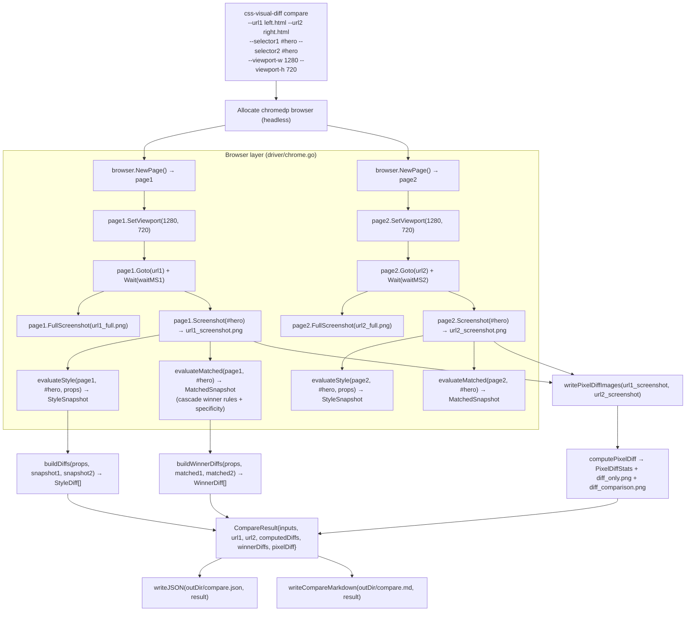

# CSS Visual Diff — Browser Evidence Gathering, Visual Regression, and LLM Review Tooling

> [!summary]
> - **What it does**: Navigates two URLs in a headless Chrome, screenshots both, extracts computed CSS and CSS cascade winner evidence, computes pixel-level diffs, and optionally hands structured evidence to an LLM for natural-language review
> - **Origin**: Found inside `hair-booking` as `cmd/sbcap` / `internal/sbcap` — a browser-comparison engine used internally during hair-stylist booking frontend development. Extracted into a standalone Go module in tickets HAIR-017–HAIR-020
> - **Key differentiator**: Unlike screenshot-only visual diff tools, this tool surfaces *why* something looks different by pairing pixel diffs with CSS property-level diffs and CSS cascade winner analysis
> - **Current state**: Working Go CLI (`github.com/go-go-golems/css-visual-diff`) with `compare`, `llm-review`, `script compare brief` embedded JS verbs, and Pinocchio profile-backed LLM inference

## Why this project exists

During the hair-booking frontend restyle work (HAIR-016 — fringe design system port), the team needed a way to answer one question with precision: when the CSS design system changes, which elements on the page actually look different, and *why*? Pixel-level diffs tell you *something* changed. They do not tell you *which CSS property* caused it or whether a cascade winner changed from one rule to another.

The hair-booking codebase already contained an answer to this problem: `cmd/sbcap` and `internal/sbcap`, a chromedp-based browser-comparison tool that had been used internally for smoke-testing the stylist frontend. It was capable of navigating two targets, extracting CSS evidence, and producing structured diff reports, but it was tightly embedded in a specific repo and its output was not easily consumable by coding agents.

The natural path was to study `sbcap` thoroughly (HAIR-017), extract it into a standalone Go module (HAIR-018), design a programmable JavaScript orchestration layer on top of it (HAIR-019), and integrate Geppetto/Pinocchio-backed LLM review (HAIR-020).

## What sbcap / css-visual-diff actually is

At its core, `css-visual-diff` is a **structured browser-comparison engine** built on chromedp. It is not merely a screenshot comparison tool. It captures evidence across four layers:

1. **Full-page screenshots** — the visual ground truth
2. **Element screenshots** — scoped to a CSS selector on each target
3. **Computed CSS properties** — what the browser actually resolved for each element
4. **CSS cascade winners** — which rule "won" the cascade for each property, with specificity and origin tracking

This layered evidence is what makes the tool useful for *understanding* visual differences rather than just detecting them. A pixel diff says "pixels changed." A CSS cascade winner diff says "the `border-radius` property changed from `4px` to `8px` because on the left side `button.primary` (specificity 0,2,1, author) won, but on the right side the reset stylesheet rule `button` (specificity 0,0,1, user-agent) won instead."

The tool operates in two modes: an ad hoc **compare** path (direct CLI with `--url1`, `--url2`, `--selector`) and a YAML-plan **run** path (structured multi-section multi-target config file for batch analysis).

### The data model

The central artifact of the tool is `CompareResult` (defined in `modes/compare.go`):

```go
type CompareResult struct {
    Inputs CompareInputs        `json:"inputs"`
    URL1   CompareSideResult   `json:"url1"`
    URL2   CompareSideResult   `json:"url2"`
    ComputedDiffs []StyleDiff  `json:"computed_diffs"`
    WinnerDiffs   []WinnerDiff `json:"winner_diffs"`
    PixelDiff     PixelDiffStats `json:"pixel_diff"`
}

type CompareSideResult struct {
    URL               string
    Selector          string
    FullScreenshot    string   // path to full-page PNG
    ElementScreenshot string  // path to scoped element PNG
    Computed StyleSnapshot    // key-value map of resolved CSS properties
    Matched  MatchedSnapshot // cascade winner rules + specificity
}
```

For each side, the tool produces both a **StyleSnapshot** (flat computed property map) and a **MatchedSnapshot** (the cascade-resolved winning rules). The `WinnerDiff` type in `matched_styles.go` exposes the cascade winner analysis — this is the most conceptually dense part of the system.

### The CSS cascade winner analysis (matched_styles.go — 722 lines)

This is the most complex and most distinctive subsystem. The `MatchedStylesResult` types track, for every CSS property on a matched element:

- Which selector won (with specificity `A,B,C` integers)
- Whether `!important` was set
- The cascade origin (`inline`, `author`, `user-agent`)
- The winning value

The `Specificity` struct implements a three-component comparator:

```go
type Specificity struct {
    A int  // IDs (e.g. #sidebar)
    B int  // classes, attributes, pseudo-classes
    C int  // element type, pseudo-elements
}

func (s Specificity) Compare(other Specificity) int {
    if s.A != other.A { return direction(s.A, other.A) }
    if s.B != other.B { return direction(s.B, other.B) }
    if s.C != other.C { return direction(s.C, other.C) }
    return 0
}
```

The cascade winner comparison (`WinnerDiff`) compares not just the values but the *winning selectors*. If the selector that wins for `border-radius` changed from `.card` to `button`, that is a different kind of evidence from a value-only change — it indicates a structural CSS reorganization, not just a tweak.

The mode runs two browser pages in parallel (one per target), queries each for the matched CSS rules via chromedp's CSS DOM APIs (`cdproto/css`, `cdproto/dom`), merges the candidate lists, and picks the cascade winner per property.

### Pixel diff (pixeldiff_util.go)

The pixel-level diff uses pure Go `image` package operations. It:

1. Reads both element screenshots as `image.NRGBA`
2. Pads smaller image to match larger with white background
3. Iterates pixel-by-pixel computing RGB Euclidean distance: `mag2 = dr² + dg² + db²`
4. If `mag2 > threshold²`, marks pixel as changed (overlay turns it red: `R=255, G=0, B=0, A=255`)
5. Produces two outputs: a **diff-only** PNG (red pixels on transparent background) and a **diff-comparison** PNG (side-by-side: left | right | diff overlay)

```go
func computePixelDiff(url1, url2 *image.NRGBA, threshold int) (PixelDiffStats, *image.NRGBA) {
    thr2 := threshold * threshold
    changed := 0
    for y := 0; y < h; y++ {
        for x := 0; x < w; x++ {
            mag2 := dr*dr + dg*dg + db*db
            if mag2 > thr2 {
                changed++
                overlay.Pix[i+0] = 255  // red
                overlay.Pix[i+1] = 0
                overlay.Pix[i+2] = 0
            }
        }
    }
}
```

The `diff-comparison.png` layout is: `[left screenshot | right screenshot | diff overlay]` in a canvas three times wider than a single screenshot.

### The YAML plan runner

The `run` command reads a structured YAML config (`config/config.go`) that defines:

- Two targets (each with URL, viewport, wait delay)
- Named sections (scoped selectors for per-element capture)
- Named style specs (which properties to extract per selector)
- Output options and mode list

This is the batch/regression-test path: a CI pipeline can run `css-visual-diff run --config regression.yaml --modes capture,cssdiff,matched-styles,ai-review` and get structured multi-target multi-section evidence.

## Project structure

```
css-visual-diff/
├── cmd/css-visual-diff/main.go         ← Cobra root + command wiring
├── internal/cssvisualdiff/
│   ├── ai/client.go                    ← AI interface (NoopClient stub)
│   ├── config/config.go               ← YAML config loader + types
│   ├── config/config_test.go
│   ├── driver/chrome.go               ← Thin chromedp wrapper (115 lines)
│   ├── dsl/
│   │   ├── codec.go                   ← JSON marshal/unmarshal helpers for JS boundary
│   │   ├── embed.go                   ← go:embed for bundled .js scripts
│   │   ├── host.go                    ← Goja runtime host (DSL orchestration engine)
│   │   ├── host_test.go
│   │   ├── registrar.go               ← Runtime module registrars (diff, report)
│   │   ├── sections.go                ← Shared Glazed sections for script commands
│   │   └── scripts/compare.js         ← Embedded JS verb implementations
│   ├── llm/
│   │   ├── bootstrap.go               ← Pinocchio profile bootstrap wrapper (104 lines)
│   │   ├── bootstrap_test.go
│   │   ├── review.go                  ← Geppetto multimodal compare review (325 lines)
│   │   └── review_test.go
│   ├── modes/
│   │   ├── ai_review.go              ← Placeholder batch AI review over capture.json
│   │   ├── capture.go                ← Two-target multi-section screenshot capture
│   │   ├── compare.go                ← Primary compare flow (377 lines)
│   │   ├── compare_test.go
│   │   ├── cssdiff.go                ← CSS property-level diff extraction (230 lines)
│   │   ├── matched_styles.go         ← CSS cascade winner analysis (722 lines — largest)
│   │   ├── matched_styles_test.go
│   │   ├── modes.go                  ← Mode registry and runner glue
│   │   ├── pixeldiff.go              ← Pixel diff orchestrator (171 lines)
│   │   ├── pixeldiff_util.go         ← Pure-Go image diff primitives (134 lines)
│   │   └── stories.go                ← Storybook snapshot integration
│   ├── runner/runner.go              ← YAML-plan execution runner (100 lines)
│   └── services/agent_brief.go       ← Deterministic concise report helper (125 lines)
├── legacy/python-prototype/           ← Retired Python prototype (OpenAI Vision + Playwright)
├── Makefile
├── go.mod
└── go.sum
```

## Implementation details

### How the compare mode works end-to-end



### How the browser driver works (driver/chrome.go — 115 lines)

The driver is intentionally thin. It wraps chromedp's `NewExecAllocator` + `NewContext` pattern and exposes six methods on `Page`:

| Method | chromedp action | Purpose |
|--------|----------------|---------|
| `NewBrowser(ctx)` | `NewExecAllocator` + `NewContext` | Allocates headless browser |
| `browser.NewPage()` | `NewContext` on browserCtx | Creates isolated tab |
| `page.SetViewport(w, h)` | `emulation.SetDeviceMetricsOverride` | Sets viewport dimensions |
| `page.Goto(url)` | `chromedp.Navigate` | Navigates to URL |
| `page.Wait(d)` | `chromedp.Sleep` | Waits after navigation |
| `page.FullScreenshot(path)` | `chromedp.FullScreenshot` (quality 90) | Full-page PNG |
| `page.Screenshot(selector, path)` | `chromedp.Screenshot` (by query) | Element-scoped PNG |
| `page.Evaluate(script, out)` | `chromedp.Evaluate` | Runs JS, writes to `out` |

All methods log through zerolog at Info/Error level. The driver is the only place chromedp is directly referenced — all evidence gathering happens through this thin API surface.

### CSS cascade winner analysis (matched_styles.go detail)

The cascade analysis is the most powerful and most complex part of the tool. It uses chromedp's `css.GetMatchedStylesForNode` and `css.GetComputedStyleForNode` CDP commands to retrieve:

1. **Matched rules**: all CSS rules that matched the element (with cascade origin, specificity, and property values)
2. **Winning rule per property**: which rule won the cascade for each computed property

The `evaluateMatched` function in `matched_styles.go` builds a `MatchedSnapshot` by calling `css.GetMatchedStylesForNode(nodeID)` and `css.GetComputedStyleForNode(nodeID)`. It tracks candidates per property:

```go
type Candidate struct {
    Property    string
    Value       string
    Selector    string
    Important   bool
    Specificity Specificity
    Origin      CascadeOrigin  // inline, author, user-agent
    Order       int            // source order tiebreaker
}
```

For each property, it selects the winner by:
1. `!important` wins over non-`!important`
2. Higher specificity wins (A > B > C, lexicographic)
3. Later source order wins (tiebreaker)

The `WinnerDiff` then compares the winners for each property across the two targets. If left wins with `.card { border-radius: 4px }` and right wins with `* { border-radius: 8px }`, that is a selector-change winner diff — more informative than a value-only diff.

### CSS property diff (cssdiff.go)

The `cssdiff` mode extracts only the computed style differences without cascade analysis. It is simpler and faster than `matched-styles` but provides less causal explanation. The `StyleDiff` struct is:

```go
type StyleDiff struct {
    Property string `json:"property"`
    Original string `json:"original"`
    React    string `json:"react"`
}
```

The default property set when `--props` is not specified covers box model, typography, color, and effects:

```go
"display", "position", "width", "height",
"margin-top", "margin-right", "margin-bottom", "margin-left",
"padding-top", "padding-right", "padding-bottom", "padding-left",
"font-family", "font-size", "font-weight", "line-height",
"color", "background-color", "background-image",
"border-radius", "box-shadow", "z-index"
```

### Pixel diff (pixeldiff_util.go detail)

The pixel diff is pure Go — no external image library dependency. Key algorithm decisions:

- **Padding to same size**: before comparing, both images are padded to the max dimensions with white (`RGBA{255,255,255,255}`) backgrounds so size mismatches don't cause misleading 100% diff rates
- **RGB Euclidean distance**: `mag2 = dr² + dg² + db²` is compared against `threshold²` (threshold is configurable 0–255, default 30)
- **Overlay**: the diff-only image is built by copying `url2`'s pixels, then overwriting changed pixels with red (`R=255, G=0, B=0, A=255`)
- **Side-by-side layout**: `diff_comparison.png` is `3w × h` pixels: `[left | right | diff-overlay]`

### The JS DSL layer (dsl/ — go-go-goja integration)

The newer orchestration layer builds on `go-go-goja` and `pkg/jsverbs`. Instead of invoking the CLI for every comparison, embedded JavaScript snippets orchestrate evidence gathering through typed host modules.

The `Host` struct in `dsl/host.go` is small (28 lines):

```go
type Host struct {
    registry *jsverbs.Registry
    factory  *engine.Factory
}

func NewHost() (*Host, error) {
    registry, err := jsverbs.ScanFS(embeddedScripts, "scripts")
    factory, err := engine.NewBuilder().
        WithRequireOptions(noderequire.WithLoader(registry.RequireLoader())).
        WithModules(engine.DefaultRegistryModules()).
        WithRuntimeModuleRegistrars(newRuntimeRegistrar()).
        Build()
    return &Host{registry, factory}, nil
}
```

The runtime registrar in `dsl/registrar.go` exposes two host modules to JavaScript:

**`diff` module:**
```go
exports.Set("compareRegion", func(raw map[string]interface{}) (interface{}, error) {
    input := decodeInto[compareRegionInput](raw)
    settings := input.toCompareSettings()
    result, err := modes.GenerateCompareResult(ctx, settings)
    modes.WriteCompareArtifacts(result, ...)
    return toPlainValue(result)  // JSON-marshal to plain map for Glazed rows
})
```

**`report` module:**
```go
exports.Set("agentBrief", func(raw map[string]interface{}) (interface{}, error) {
    brief := services.BuildAgentBrief(...)
    return toPlainValue(brief)
})
exports.Set("renderAgentBrief", func(...) (string, error) { ... })
```

The `toPlainValue()` function is critical: it JSON-marshal/unmarshal's the Go struct to a plain `map[string]any` before returning it from the host module. Without this, `jsverbs` row conversion collapses the Go struct into a single `value` column instead of a structured Glazed table row.

The embedded scripts in `dsl/scripts/compare.js` use these modules:

```javascript
function compareBrief(left, right, selector, question) {
    var result = diff.compareRegion({ left, right, selector });
    var brief = report.renderAgentBrief({ question, result });
    return { result, brief };
}
```

### LLM review layer (llm/review.go — 325 lines)

The `llm` package uses Geppetto for inference and Pinocchio for profile/bootstrap resolution. The `ReviewCompare` function:

1. Resolves profile via `Pinocchio` bootstrap helpers → `geppettoengine.Engine`
2. Builds a text prompt summarizing the `CompareResult`
3. Packages screenshots as base64 `content` blocks in a Geppetto multimodal turn
4. Runs `geppettoengine.RunInferenceWithResult()`
5. Extracts assistant text and returns a `ReviewResult`

The prompt text is built by `BuildReviewPromptText`:

```
Compare these two rendered UI regions and answer the question using both the screenshots
and the structured evidence below.

Question: [question]
Targets:
- Left: [url1] ([selector1])
- Right: [url2] ([selector2])
- Viewport: WxH

Pixel diff summary:
- Changed pixels: N / M (X.XX%) at threshold T

Computed property changes:
- [property]: [original] -> [react]
- ...

Winning rule changes:
- [property]: [left winner selector] -> [right winner selector]
- ...

Answer in concise engineering prose. Mention the biggest visual shifts,
likely CSS causes, and any important UX impact.
```

Images are packaged as base64 content for cross-provider compatibility:

```go
func buildImagePayload(path string, required bool) (map[string]any, string, error) {
    content, _ := os.ReadFile(path)
    return map[string]any{
        "media_type": detectImageMediaType(path),
        "content":    base64.StdEncoding.EncodeToString(content),
    }, path, nil
}
```

### The bootstrap layer (llm/bootstrap.go — 104 lines)

The `bootstrap.go` wrapper delegates to `pinocchio/pkg/cmds/profilebootstrap` helpers, giving `css-visual-diff` the same profile resolution lifecycle as Pinocchio:

```go
func ResolveEngineSettings(ctx context.Context, opts BootstrapOptions) (*BootstrapResult, error) {
    parsed, err := profilebootstrap.NewCLISelectionValues(...)
    resolved, err := profilebootstrap.ResolveCLIEngineSettings(ctx, parsed)
    return &BootstrapResult{Parsed: parsed, Resolved: resolved}, nil
}

func (r *BootstrapResult) BuildEngine() (geppettoengine.Engine, error) {
    return profilebootstrap.NewEngineFromResolvedCLIEngineSettings(r.Resolved)
}
```

The `llm-review` command exposes `--profile gpt-5-nano-low`, `--profile-registries`, `--config-file`, and `--print-inference-settings`. Resolving `gpt-5-nano-low` produces:

```json
{
  "chat.api_type": "openai-responses",
  "chat.engine": "gpt-5-nano",
  "chat.max_response_tokens": 128000,
  "inference.reasoning_effort": "low",
  "inference.reasoning_summary": "concise"
}
```

This is identical to what Pinocchio resolves for the same profile, confirming the bootstrap path is shared.

### The agent brief service (services/agent_brief.go — 125 lines)

A zero-dependency helper for producing concise, token-efficient summaries of `CompareResult` for use in logs, CI output, or as lightweight substitutes for LLM review. It builds an `AgentBriefResult`:

```go
type AgentBriefResult struct {
    Question             string            `json:"question"`
    Bullets              []string          `json:"bullets"`
    PixelDiffPercent     float64           `json:"pixelDiffPercent"`
    ChangedPropertyCount int               `json:"changedPropertyCount"`
    Artifacts            map[string]string `json:"artifacts"`
}
```

The bullet generation rules:
1. Lead with pixel drift percentage if any pixels changed
2. Emit up to `maxBullets` computed style diff bullets (`Change 'border-radius' from '4px' to '8px'`)
3. Fill remaining slots with winner-rule selector changes (`Winning rule for 'border-radius' changed from '.card' to 'button'`)

The `renderAgentBrief` function produces text output suitable for CI log lines:
```
What are the main visual differences?
- Visual drift is 18.69% of pixels at threshold 30.
- Change 'background-color' from 'rgb(240, 240, 240)' to 'rgb(255, 255, 255)'.
- Change 'border-radius' from '4px' to '8px'.
```

## The ticket journey

### HAIR-017 — sbcap analysis and extraction guide

**Trigger**: User wanted to understand `cmd/sbcap` and extract it as a standalone tool for the fringe design system restyle work.

**What was done**:
1. Created ticket under `hair-booking/ttmp/`
2. Inspected `cmd/sbcap` and `internal/sbcap` package structure, counted line lengths
3. Identified `matched_styles.go` as the largest (722 lines) and most conceptually dense subsystem — confirmed it as the key differentiator
4. Created reproducible experiment scripts (`01_build_test_and_probe.sh`, `02_compare_fixture.sh`)
5. Ran end-to-end compare against local fixture HTML pages, producing real artifacts
6. Wrote a detailed intern-grade extraction guide (architecture, mode analysis, extraction options, API sketches, phased plan)
7. Fixed docmgr vocabulary issues and generated-artifact hygiene
8. Uploaded to reMarkable at `/ai/2026/04/21/HAIR-017`

**Key experiment findings**:
- `go test ./cmd/sbcap ./internal/sbcap/...` passed
- Local fixture compare: `Total pixels: 64380, Changed pixels: 12036, Changed percent: 18.6952%`
- Real CSS diffs surfaced: `font-family`, `color`, `background-color`, `border-radius`, `box-shadow`

### HAIR-018 — rebuild css-visual-diff from sbcap

**Trigger**: User asked to execute the migration.

**What was done**:
1. Moved Python prototype to `legacy/python-prototype/`
2. Copied Go template scaffold from `corporate-headquarters/go-template`
3. Copied `cmd/sbcap` → `cmd/css-visual-diff`, `internal/sbcap` → `internal/cssvisualdiff`
4. Renamed module path, import paths, CLI strings
5. Pinned dependencies back to sbcap-compatible versions (fixing `GetComputedStyleForNode` API mismatch)
6. Polished Makefile, added CI workflows, GoReleaser config
7. Validated: `GOWORK=off go test ./...`, `GOWORK=off go build ./cmd/css-visual-diff`
8. Committed as `774f01c` (baseline import) and `b667cfa` (build defaults polish)

**Important lesson**: fresh `go mod tidy` pulled newer chromedp/glazed versions than the imported code expected, causing a 2-vs-3 return value mismatch on `css.GetComputedStyleForNode`. Fixed by pinning to exact sbcap-compatible versions.

### HAIR-019 — JS DSL design and go-go-goja integration

**Trigger**: User wanted a programmable orchestration layer so coding agents could ask precise questions via embedded scripts.

**What was done**:
1. Studied `go-go-goja/engine`, `pkg/jsverbs`, docs, and playbooks
2. Wrote two design docs: abstract DSL model + concrete go-go-goja integration plan
3. Implemented first integration slice (commit `da1a2b4`):
   - `dsl/host.go` — Goja runtime host
   - `dsl/registrar.go` — runtime module registrars for `diff` and `report`
   - `dsl/scripts/compare.js` — embedded `compareRegion` and `brief` verbs
   - `services/agent_brief.go` — deterministic brief helper
   - Root command integration: `PersistentPreRunE` for logging, `script` verb group
4. Fixed `.gitignore` for nested generated artifact directories
5. Amended first commit to remove accidentally staged generated artifacts
6. Verified with smoke script: `script compare brief --url1 left.html --url2 right.html`

**Key insight**: host modules must return plain JSON-compatible `map[string]any`, not raw Go structs. The `toPlainValue()` JSON roundtrip is what enables Glazed structured output on the JS verb boundary.

### HAIR-020 — Geppetto/Pinocchio LLM review integration

**Trigger**: User clarified that the LLM integration must support Pinocchio profile repository loading, not just hardcoded model strings.

**What was done**:
1. Inspected `geppetto/pkg/inference/engine`, `geppetto/pkg/sections/profile_sections.go`
2. Inspected `pinocchio/pkg/cmds/profilebootstrap/engine_settings.go`, `profile_selection.go`, `cmds/js.go`
3. Confirmed Pinocchio already implements the exact lifecycle: base inference settings → profile selection → registry chain → merge → final settings
4. Designed and wrote implementation guide: Geppetto inference + Pinocchio bootstrap + css-visual-diff evidence gathering
5. Landed Phase 1: `llm/bootstrap.go` wiring to `pinocchio/pkg/cmds/profilebootstrap`
6. Landed Phase 2: `llm/review.go` reusable review service + `llm-review` command
7. Added `--print-inference-settings` parity with Pinocchio
8. Compared resolved settings between Pinocchio and css-visual-diff — identical for `gpt-5-nano-low` and default profile
9. Ran live `gpt-5-nano-low` smoke with saved ticket fixtures
10. Committed as `b667bcdc` (bootstrap) and `c4d170c6` (llm-review command) and `9c0f08bc` (inference settings debug)

**Caveat discovered**: Geppetto's `openai-responses` helper still has a code comment indicating image/audio support is not fully implemented in that path. The live smoke with `gpt-5-nano-low` succeeded, but the answer may be relying primarily on textual CSS evidence rather than true multimodal image transport.

## Current status

All four tickets are closed. The codebase is functional with:

| Command | Purpose | Status |
|---------|---------|--------|
| `compare` | Ad hoc two-target compare | ✅ Working |
| `capture` | Multi-section two-target screenshot capture | ✅ Working |
| `cssdiff` | CSS property-level diff | ✅ Working |
| `matched-styles` | Cascade winner analysis | ✅ Working |
| `pixeldiff` | Pixel-level image diff | ✅ Working |
| `run` | YAML plan runner | ✅ Working |
| `llm-review` | Geppetto-backed multimodal LLM review | ✅ Working |
| `script compare brief` | Embedded JS verb | ✅ Working |
| `script compare region` | Embedded JS verb | ✅ Working |
| `--print-inference-settings` | Debug resolved profile settings | ✅ Working |

## Open questions

1. **Geppetto image transport**: Whether `gpt-5-nano-low` is the right default profile given the `openai-responses` image transport caveat — needs verification before defaulting to image-heavy review work
2. **Lower-level `page` host module**: Whether to expose `page.open`, `page.screenshot`, `page.evaluate` directly in JS or continue with high-level `diff`/`report` primitives
3. **Runtime pooling**: Whether startup cost warrants a runtime pool once the tool runs in CI frequently
4. **User-supplied script directories**: Whether to add `--script-dir` support beyond the embedded default set

## Near-term next steps

1. Verify Geppetto `openai-responses` image transport completeness
2. Add more embedded script verbs (beyond the `compare` slice)
3. Integrate `css-visual-diff` as a smoke/regression tool in the hair-booking CI pipeline
4. Consider a `--watch` mode that re-runs compare on file changes for live development feedback

## Project working rule

Each layer owns its natural concern and no more:
- **Browser mechanics** stay in Go (`driver/chrome.go`)
- **Evidence gathering** stays in Go (`modes/` packages)
- **Orchestration** stays in constrained JavaScript (`dsl/scripts/`, `dsl/registrar.go`)
- **Inference** stays in Geppetto/Pinocchio (`llm/review.go`, `llm/bootstrap.go`)

The JS DSL should compose evidence primitives, not reimplement them. The LLM layer should consume structured evidence, not raw screenshots.
