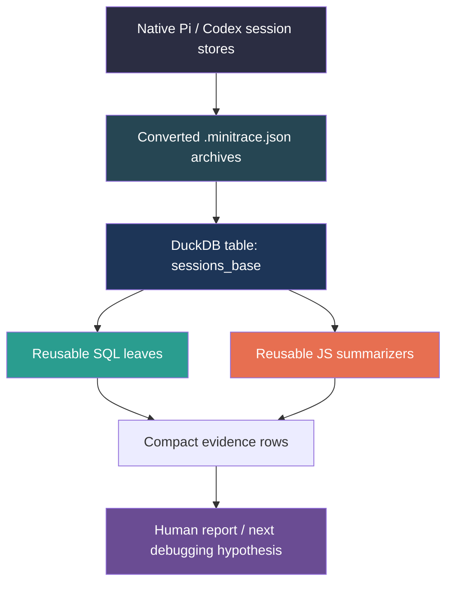
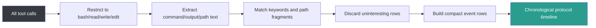

# Playbook: Efficient Past Transcript Analysis with go-minitrace

This note is a project report, but it is written as a teaching document rather than a changelog. Its purpose is to show an intern how to use `go-minitrace` as a disciplined transcript-analysis system: how to convert the right sessions, how to avoid wasting context on raw transcript reading, how to build a small reusable query-command repository, how to mix SQL and JavaScript effectively, and how to turn a large pile of old agent sessions into a compact body of evidence.

The motivating incident was a Loupedeck transport regression. The current live run succeeds at the websocket handshake and then dies with `websocket: bad opcode 4`. That kind of failure is exactly where transcript analysis helps. If you only read today's logs, you know that the current code is broken. If you analyze the old sessions efficiently, you can answer the more important question: _what used to work, what changed, and where should you look next?_

This playbook is indexed by [[go-minitrace]]. Its historical DuckDB examples should be migrated using [[ARTICLE - go-minitrace Query Engine Migration - DuckDB to Normalized SQLite]].

> [!summary]
> - `go-minitrace` is most effective when treated as a **small analysis framework**, not as a one-off SQL runner.
> - The most efficient workflow is a **three-layer funnel**: session inventory, targeted evidence extraction, then JS-backed summarization.
> - A ticket-local query repository under `scripts/query-commands/` is the right unit of reuse.
> - For DuckDB JSON, prefer **`json_extract_string(...)`** or parenthesized arrow expressions inside predicates.
> - For JS command repos, helper modules must look like helpers. Top-level helper functions with ordinary names can accidentally become command surfaces and collide with Glazed flags.

## Why this note exists

A common mistake in transcript analysis is to treat every past session as equally important. That leads to two kinds of waste. The first is token waste: too much raw material, too little structure. The second is reasoning waste: the investigator spends time rediscovering the same filters, the same archive globs, and the same path patterns instead of asking progressively better questions.

The Loupedeck investigation made this visible very quickly. There were multiple relevant Pi sessions, spread across several working directories, with different goals:

- early hardware bring-up,
- later runtime and rendering work,
- JS verbs / CLI integration,
- and then a fresh analysis pass over those old sessions.

What we needed was not a heroic one-time grep. We needed a repeatable method that could do three things well:

1. reduce a large transcript corpus to a few high-signal sessions,
2. extract only the evidence-bearing tool calls from those sessions,
3. package the result as reusable commands so the next pass starts from a higher baseline.

That is the real lesson of this project: a good transcript-analysis workflow is a _tool-making workflow_.

## The concrete incident: a Loupedeck protocol error

The immediate trigger for the analysis was a current runtime failure of the form:

```text
GOWORK=off go run ./cmd/loupedeck verbs counter-button run
...
INFO Connect successful resp="... Status:101 Switching Protocols ..."
INFO Sending reset.
INFO Setting default brightness.
INFO Setting callback message="{len: 4, type: 07, txn: 03, data: [9]}"
INFO Setting callback message="{len: 4, type: 03, txn: 04, data: [9]}"
INFO Loupedeck JS live runner started script=builtin:02-counter-button.js verb="counter-button run" ...
WARN Read error, exiting error="websocket: bad opcode 4"
Error: listen: websocket read failed: websocket: bad opcode 4
```

This is a very good transcript-analysis problem because the failure is _late enough_ to imply partial success:

- the serial device is found,
- the websocket handshake completes,
- initial reset / brightness setup happens,
- the runtime starts,
- and only then does the read loop trip over an opcode error.

So the problem is not “nothing connects.” It is narrower. Something about message handling, framing, scheduling, or the interaction between startup traffic and the read loop has drifted.

The old transcripts let us ask three better questions:

- Did this transport stack work before under similar conditions?
- Which files and commands were touched when transport behavior changed?
- Which sessions explain the evolution from “works” to “mysteriously broken”?

## The core mental model

The easiest way to understand `go-minitrace` is to stop thinking of it as “DuckDB over JSON” and instead think of it as a three-stage reduction pipeline.



The important design insight is that every stage should reduce entropy.

- The native session store is large, noisy, and operational.
- The converted archive is queryable.
- The DuckDB table is structured.
- The SQL leaves narrow the search.
- The JS summarizers turn raw rows into an argument.

When people say they want to “analyze transcripts with AI,” what they usually want is the last two boxes. The error is trying to jump to them without building the middle layers.

## The three-layer funnel

In practice, the workflow that worked best was this:

### Layer 1: Session inventory

First identify the small number of sessions worth reading about.

This means asking questions like:

- Which sessions are in scope for the repo and date range?
- Which sessions have the highest tool-call counts?
- Which sessions touched the target codebase?
- Which sessions are clearly analysis-only versus implementation sessions?

A session inventory command is cheap to write and pays for itself immediately.

For the Loupedeck investigation, the important sessions surfaced quickly:

- `658a1b75-c2ef-4693-8e5c-e02f4c344288` — early hardware / protocol bring-up in `~/code/wesen/2026-04-11--loupedeck-test`
- `28f358e9-0947-4ae8-afdf-87a60d8d113d` — continued work on the original test repo
- `114cf5a5-75ef-45f9-8ed7-0faf2ea9965f` — JS verbs and CLI integration in `~/workspaces/2026-04-13/js-loupedeck`
- `813f73e3-7315-4230-aad4-2b96f6e970e3` — later analysis pass over the Loupedeck repo

Once you know those IDs, you are no longer reading a fog. You are reading a shortlist.

### Layer 2: Targeted evidence extraction

Once the shortlist exists, the next step is not “read all turns.” It is “extract the tool calls that carry actual evidence.”

In practice those are often:

- `bash` calls that contain logs, tests, `git show`, `rg`, or runtime output,
- `read` calls over transport-related files,
- `edit` / `write` calls that touch key implementation paths,
- occasional `understand_image` / browser calls when the issue is UI-heavy.

For the Loupedeck case, the best evidence lived in:

- bash output containing runtime logs,
- file reads of `pkg/device/*`,
- file reads and edits of `cmd/loupedeck/cmds/run/*`,
- and commit-inspection commands like `git show ...`.

This is where small reusable SQL leaves become extremely valuable.

### Layer 3: JS-backed summarization

Once the candidate rows are small enough, JS is worth using. SQL is excellent at filtering and grouping. JS is better at building compact “explain this to a human” outputs.

A JS command can:

- run multiple queries,
- combine bash output and file touches,
- attach previews,
- classify event kinds,
- build a timeline,
- and cut the result down to a human-reviewable set.

That is the difference between a dump and a report.

## Start with the help tree, not with cleverness

One of the strongest habits from this project is simple: before inventing anything, read the built-in help.

The most useful commands were:

```bash
go-minitrace help --all
go-minitrace help structured-query-commands
go-minitrace help js-api-reference
go-minitrace help writing-duckdb-queries
go-minitrace help duckdb-query-recipes
go-minitrace help query-duckdb
go-minitrace help analysis-guide
go-minitrace query commands --help
```

Why does this matter? Because `go-minitrace` is already opinionated about how analysis should be structured.

The help pages teach three crucial things:

1. **repository-backed commands are first-class** — you are supposed to make reusable commands,
2. **JS command files are scanner-first** — metadata is discovered statically,
3. **query repositories can be external and ticket-local** — this makes investigation-specific command sets natural.

That last point matters a lot. It means a ticket can ship with its own small analysis toolkit.

### Documentation and reference material I actually used

The following materials were the real starting points for learning the `go-minitrace` workflow in this investigation.

#### Embedded help commands

These are the first things I would rerun on a fresh machine:

- `go-minitrace help --all`
- `go-minitrace help structured-query-commands`
- `go-minitrace help js-api-reference`
- `go-minitrace help writing-duckdb-queries`
- `go-minitrace help duckdb-query-recipes`
- `go-minitrace help query-duckdb`
- `go-minitrace help analysis-guide`
- `go-minitrace query commands --help`

#### Local source documentation in the `go-minitrace` checkout

These are the files behind the built-in help system and the checked-in query examples:

- [`pkg/doc/structured-query-commands.md`](file:///home/manuel/code/wesen/corporate-headquarters/go-minitrace/pkg/doc/structured-query-commands.md)
- [`pkg/doc/js-api-reference.md`](file:///home/manuel/code/wesen/corporate-headquarters/go-minitrace/pkg/doc/js-api-reference.md)
- [`pkg/doc/writing-duckdb-queries.md`](file:///home/manuel/code/wesen/corporate-headquarters/go-minitrace/pkg/doc/writing-duckdb-queries.md)
- [`pkg/doc/duckdb-query-recipes.md`](file:///home/manuel/code/wesen/corporate-headquarters/go-minitrace/pkg/doc/duckdb-query-recipes.md)
- [`pkg/doc/query-duckdb.md`](file:///home/manuel/code/wesen/corporate-headquarters/go-minitrace/pkg/doc/query-duckdb.md)
- [`pkg/doc/analysis-guide.md`](file:///home/manuel/code/wesen/corporate-headquarters/go-minitrace/pkg/doc/analysis-guide.md)
- [`pkg/doc/end-to-end-analysis.md`](file:///home/manuel/code/wesen/corporate-headquarters/go-minitrace/pkg/doc/end-to-end-analysis.md)
- [`pkg/doc/troubleshooting.md`](file:///home/manuel/code/wesen/corporate-headquarters/go-minitrace/pkg/doc/troubleshooting.md)

#### Checked-in example repositories

These example trees were especially useful because they show the intended command-repository shape rather than merely describing it:

- [`testdata/query-repositories/README.md`](file:///home/manuel/code/wesen/corporate-headquarters/go-minitrace/testdata/query-repositories/README.md)
- [`testdata/query-repositories/js-showcase/README.md`](file:///home/manuel/code/wesen/corporate-headquarters/go-minitrace/testdata/query-repositories/js-showcase/README.md)
- [`testdata/query-repositories/js-showcase/analysis/workspace-lab.js`](file:///home/manuel/code/wesen/corporate-headquarters/go-minitrace/testdata/query-repositories/js-showcase/analysis/workspace-lab.js)
- [`testdata/query-repositories/js-showcase/analysis/lib/cookbook.js`](file:///home/manuel/code/wesen/corporate-headquarters/go-minitrace/testdata/query-repositories/js-showcase/analysis/lib/cookbook.js)
- [`testdata/query-repositories/js-showcase/overview/session-tools.js`](file:///home/manuel/code/wesen/corporate-headquarters/go-minitrace/testdata/query-repositories/js-showcase/overview/session-tools.js)
- [`testdata/query-repositories/mixed-sql-js-showcase/overview/session-tools.js`](file:///home/manuel/code/wesen/corporate-headquarters/go-minitrace/testdata/query-repositories/mixed-sql-js-showcase/overview/session-tools.js)
- [`testdata/query-repositories/mixed-sql-js-showcase/analysis/raw-workspace-stats.sql`](file:///home/manuel/code/wesen/corporate-headquarters/go-minitrace/testdata/query-repositories/mixed-sql-js-showcase/analysis/raw-workspace-stats.sql)

#### Ticket-local references from this investigation

These artifacts matter because they record the exact archive glob, experiments, and safe query patterns that emerged while doing the Loupedeck work:

- [`design/01-duckdb-query-issues-postmortem.md`](file:///home/manuel/code/wesen/trace-analysis/ttmp/2026/04/22/LOUPEDECK-BROKEN--investigate-why-did-the-loupedeck-serial-protocol-break/design/01-duckdb-query-issues-postmortem.md)
- [`design/02-duckdb-arrow-precedence-postmortem-and-querying-guide.md`](file:///home/manuel/code/wesen/trace-analysis/ttmp/2026/04/22/LOUPEDECK-BROKEN--investigate-why-did-the-loupedeck-serial-protocol-break/design/02-duckdb-arrow-precedence-postmortem-and-querying-guide.md)
- [`reference/01-diary.md`](file:///home/manuel/code/wesen/trace-analysis/ttmp/2026/04/22/LOUPEDECK-BROKEN--investigate-why-did-the-loupedeck-serial-protocol-break/reference/01-diary.md)
- [`reference/02-duckdb-query-investigation-diary.md`](file:///home/manuel/code/wesen/trace-analysis/ttmp/2026/04/22/LOUPEDECK-BROKEN--investigate-why-did-the-loupedeck-serial-protocol-break/reference/02-duckdb-query-investigation-diary.md)

#### External reference material used indirectly through the investigation

These were helpful for understanding DuckDB JSON behavior and why some queries failed in misleading ways:

- [DuckDB JSON functions](https://duckdb.org/docs/current/data/json/json_functions.html)
- [DuckDB JSON overview](https://duckdb.org/docs/current/data/json/overview.html)
- [DuckDB issue: arrow precedence confusion](https://github.com/duckdb/duckdb/issues/16970)
- [DuckDB issue: lambda / arrow precedence interactions](https://github.com/duckdb/duckdb/issues/21975)

## The right place to put reusable analysis code

For this investigation, the working rule was:

> Any script worth keeping goes in the ticket’s `scripts/` directory, and the ticket’s `scripts/query-commands/` subtree becomes the command repository.

That led to a structure like this:

```text
/home/manuel/code/wesen/trace-analysis/
└── ttmp/2026/04/22/LOUPEDECK-BROKEN--investigate-why-did-the-loupedeck-serial-protocol-break/
    └── scripts/
        ├── 01-convert-loupedeck-sessions.sh
        ├── 02-tool-call-search.sh
        ├── 03-search-protocol.sh
        └── query-commands/
            └── loupedeck/
                ├── bash-keyword-search.sql
                ├── file-touch-search.sql
                ├── protocol-keyword-search.sql
                └── analysis/
                    ├── session-summary.js
                    ├── bash-output-search.js
                    ├── file-search.js
                    ├── protocol-analysis.js
                    ├── protocol-timeline.js
                    └── lib/
                        └── helpers.js
```

This is the single best habit to steal from the project. If you make the command repo local to the ticket, then:

- the investigation is reproducible,
- the next reviewer can rerun the exact same commands,
- and your SQL / JS artifacts do not get stranded in shell history.

## How command-path mapping works

`go-minitrace` maps repository layout to CLI commands in a predictable way.

A SQL file becomes a leaf directly.

```text
query-commands/loupedeck/bash-keyword-search.sql
```

becomes:

```bash
go-minitrace query commands loupedeck bash-keyword-search ...
```

A JS file usually adds one more grouping level based on the filename stem.

```text
query-commands/loupedeck/analysis/protocol-timeline.js
```

becomes:

```bash
go-minitrace query commands loupedeck analysis protocol-timeline ...
```

This is a small thing, but it is worth understanding because it affects how you organize your command repo. The repo layout is not merely cosmetic. It becomes the UI of your investigation.

## What SQL is for, and what JS is for

A good intern rule is:

- Use **SQL** when the question is fundamentally row-oriented.
- Use **JS** when the question is fundamentally explanatory.

### Good SQL questions

- Which bash tool calls mention `websocket`?
- Which sessions touched `pkg/device/listen.go`?
- Which tool names dominate a session?
- Which file paths contain `cmd/loupedeck/cmds/run/`?

### Good JS questions

- Build a protocol timeline across bash/read/edit events.
- Show the most interesting clues per session in chronological order.
- Combine multiple query results into a compact “spotlight” row.
- Rank sessions by how transport-relevant they look.

You can feel the difference. SQL is a searchlight. JS is an editor.

## The SQL patterns that turned out to matter most

The two most useful SQL leaves from this project were simple.

### 1. Bash keyword search

The goal is to search both the executed command text and the bash output.

```sql
SELECT
  id AS session_id,
  title,
  timing->>'started_at' AS started_at,
  CAST(tc->>'emitting_turn_index' AS INT) AS turn_index,
  tc->>'id' AS call_id,
  json_extract_string(tc, '$.input.command') AS bash_command,
  json_extract_string(tc, '$.output.result') AS bash_output
FROM sessions_base,
     UNNEST(tool_calls) AS t(tc)
WHERE (tc->>'tool_name') = 'bash'
  AND (
    COALESCE(json_extract_string(tc, '$.input.command'), '') LIKE {{ .keyword | sqlLike }}
    OR COALESCE(json_extract_string(tc, '$.output.result'), '') LIKE {{ .keyword | sqlLike }}
  )
ORDER BY started_at, session_id, turn_index
LIMIT {{ .limit }};
```

The reason this is such a strong pattern is that bash calls are disproportionately informative. They contain:

- runtime logs,
- test failures,
- git history,
- quick code archaeology,
- and human-written shell commands that reveal intent.

### 2. File-touch search

The goal is to normalize file paths across `read`, `write`, and `edit` calls, then optionally search tool output content.

```sql
SELECT
  id AS session_id,
  title,
  timing->>'started_at' AS started_at,
  CAST(tc->>'emitting_turn_index' AS INT) AS turn_index,
  (tc->>'tool_name') AS tool_name,
  COALESCE(
    json_extract_string(tc, '$.input.file_path'),
    json_extract_string(tc, '$.input.path'),
    json_extract_string(tc, '$.input.arguments.path'),
    json_extract_string(tc, '$.input.arguments.file_path')
  ) AS file_path,
  json_extract_string(tc, '$.output.result') AS tool_result
FROM sessions_base,
     UNNEST(tool_calls) AS t(tc)
WHERE (tc->>'tool_name') IN ('read', 'write', 'edit')
```

The core idea here is path normalization. Different tool calls store paths in slightly different places. If you do not normalize, your search surface fragments.

## The DuckDB lesson: JSON is where confusion lives

A separate but important lesson from the project is that DuckDB’s JSON arrow operators are easy to misuse in predicates.

The safe rule is:

- either parenthesize `->` / `->>` expressions in predicates,
- or use `json_extract_string(...)`.

For example, prefer:

```sql
WHERE (tc->>'tool_name') = 'bash'
```

or:

```sql
WHERE json_extract_string(tc, '$.output.result') LIKE '%serial%'
```

This is not merely style. The earlier investigation got derailed by misleading DuckDB errors until it was verified that the real problem was **arrow precedence**, not dirty JSON shapes.

For ticket-local commands, `json_extract_string(...)` often makes the command easier for a future reader to trust.

## The first serious JS gotcha

The most educational failure in the command-authoring work had nothing to do with Loupedeck. It had to do with how JS command repositories are scanned.

At one point the external query repo failed with:

```text
Flag 'output' already exists
```

This looked at first like a query problem. It was not. The real issue was that helper modules contained ordinary top-level function names like:

```js
function extractExitCode(output) {
  ...
}
```

The JS scanner interpreted those top-level helper functions as command-like surfaces, which created an `output` argument that collided with Glazed’s global `--output` flag.

The fix was conceptually simple and practically crucial:

- make helper-only top-level functions look private,
- prefix them with `_`,
- export them through `module.exports`.

For example:

```js
function _extractExitCode(output) {
  ...
}

module.exports = {
  extractExitCode: _extractExitCode,
};
```

This is the kind of detail that deserves to be written down because it is not obvious from general JavaScript experience. It is specific to the scanner-first command model.

### Working rule

> In a `go-minitrace` JS command repository, top-level helper functions should look like helpers, not verbs.

That means underscore-prefix them unless they are meant to be scanned as command entrypoints.

## A good JS command: the protocol timeline

The most useful JS command from this ticket was a timeline builder that mixed:

- bash command text,
- bash output,
- file path touches,
- and output previews.

Its job was not to answer a single SQL question. Its job was to produce a compact chronological narrative.

In pseudocode, the algorithm looks like this:

```text
function protocolTimeline(filters):
    rows = query all bash/read/write/edit tool calls
           ordered by started_at, session_id, turn_index

    for each row:
        output_text = extractResult(row.output_json)
        command_text = row.command
        file_path = row.file_path

        keyword_matches = keywords found in command_text or output_text
        path_matches = interesting path fragments found in file_path

        if no matches:
            skip row

        emit a compact event row with:
            - session_id
            - turn_index
            - tool_name
            - matched keywords
            - short command preview
            - short output preview
            - short file path

    return first N interesting events
```

The key point is not the syntax. It is the design.

The command does not try to preserve the whole world. It preserves only what a human investigator needs to continue the story.



## The actual workflow that proved efficient

Here is the version I would teach an intern.

### Step 1: Convert only the sessions you care about

Do not begin by converting the entire universe just because you can.

For this investigation, the archive glob ended up being:

```text
'/home/manuel/code/wesen/trace-analysis/ttmp/2026/04/22/LOUPEDECK-BROKEN--investigate-why-did-the-loupedeck-serial-protocol-break/analysis/loupedeck-sessions/active/*/*.minitrace.json'
```

That is already a huge improvement over pointing at all historical session stores.

### Step 2: Inventory the sessions

Use a reusable summary command first.

For example:

```bash
GOWORK=off go run ./cmd/go-minitrace query commands \
  --query-repository /home/manuel/code/wesen/trace-analysis/ttmp/2026/04/22/LOUPEDECK-BROKEN--investigate-why-did-the-loupedeck-serial-protocol-break/scripts/query-commands \
  loupedeck analysis session-summary \
  --archive-glob '/home/manuel/code/wesen/trace-analysis/ttmp/2026/04/22/LOUPEDECK-BROKEN--investigate-why-did-the-loupedeck-serial-protocol-break/analysis/loupedeck-sessions/active/*/*.minitrace.json' \
  --output json
```

This quickly surfaced which sessions were:

- large,
- implementation-heavy,
- and likely to contain the transport story.

### Step 3: Search for protocol clues in bash output

Then use a SQL leaf:

```bash
GOWORK=off go run ./cmd/go-minitrace query commands \
  --query-repository /home/manuel/code/wesen/trace-analysis/ttmp/2026/04/22/LOUPEDECK-BROKEN--investigate-why-did-the-loupedeck-serial-protocol-break/scripts/query-commands \
  loupedeck bash-keyword-search \
  --archive-glob '/home/manuel/code/wesen/trace-analysis/ttmp/2026/04/22/LOUPEDECK-BROKEN--investigate-why-did-the-loupedeck-serial-protocol-break/analysis/loupedeck-sessions/active/*/*.minitrace.json' \
  --keyword 'Connect successful' \
  --output json
```

This recovered an older successful runtime log from session `658a1b75`. That log was especially valuable because it showed:

- an initial malformed-response / timeout hiccup,
- a successful retry,
- `101 Switching Protocols`,
- `Sending reset`,
- `Setting default brightness`,
- and then a long sequence of normal binary protocol messages.

That is exactly the kind of evidence you want from transcript analysis: not “something once worked,” but a concrete, dated, replayable example of how it worked.

### Step 4: Search for file touches around transport code

Then search file paths:

```bash
GOWORK=off go run ./cmd/go-minitrace query commands \
  --query-repository /home/manuel/code/wesen/trace-analysis/ttmp/2026/04/22/LOUPEDECK-BROKEN--investigate-why-did-the-loupedeck-serial-protocol-break/scripts/query-commands \
  loupedeck file-touch-search \
  --archive-glob '/home/manuel/code/wesen/trace-analysis/ttmp/2026/04/22/LOUPEDECK-BROKEN--investigate-why-did-the-loupedeck-serial-protocol-break/analysis/loupedeck-sessions/active/*/*.minitrace.json' \
  --file-pattern 'pkg/device/' \
  --output json
```

This showed the sessions and turns where the transport files were being inspected:

- `pkg/device/loupedeck.go`
- `pkg/device/listen.go`
- `pkg/device/display.go`
- `cmd/loupedeck/cmds/run/command.go`

At that point the investigation was no longer looking for “the bug somewhere.” It was looking at a bounded set of files and sessions.

### Step 5: Build a timeline for one session

Finally, use the JS summarizer:

```bash
GOWORK=off go run ./cmd/go-minitrace query commands \
  --query-repository /home/manuel/code/wesen/trace-analysis/ttmp/2026/04/22/LOUPEDECK-BROKEN--investigate-why-did-the-loupedeck-serial-protocol-break/scripts/query-commands \
  loupedeck analysis protocol-timeline \
  --archive-glob '/home/manuel/code/wesen/trace-analysis/ttmp/2026/04/22/LOUPEDECK-BROKEN--investigate-why-did-the-loupedeck-serial-protocol-break/analysis/loupedeck-sessions/active/*/*.minitrace.json' \
  --session-id 114cf5a5 \
  --output json
```

This produced a compact cross-tool narrative for the JS verbs session instead of forcing the investigator to reread hundreds of turns.

## What the Loupedeck case study taught

The actual findings from the transcript pass are useful because they show what “good transcript analysis” looks like in practice.

### Finding 1: the transport stack definitely worked earlier

Historical logs recovered from the transcripts showed successful runs where:

- the serial device was enumerated,
- the websocket handshake completed,
- reset and brightness setup succeeded,
- and then the device continued to exchange binary messages without immediately dying.

This matters because it changes the question from “did we ever have a good protocol stack?” to “what changed after we did?”

### Finding 2: explicit-device-path behavior changed once and was then fixed

An older run showed this failure mode:

```text
connect: unknown device product ID: ""
```

That happened when connecting via an explicit serial path and not recovering metadata. Later code in `pkg/device/connect.go` added a post-connect metadata refresh using `lookupSerialPortMetadata(c.Name)` before resolving the device profile.

This is a beautiful example of what transcript analysis can recover:

- not just that a bug existed,
- but how it manifested,
- and what code path was later introduced to address it.

### Finding 3: dependency drift is probably not the whole explanation

Git history and transcript evidence together showed:

- `go.bug.st/serial` stayed at `v1.6.0`,
- `github.com/gorilla/websocket` later moved from `v1.5.0` to `v1.5.3`,
- but the major Loupedeck structural changes were elsewhere: device migration, runtime convergence, JS verbs embedding, and CLI command refactors.

This does not prove that the websocket bump is irrelevant. But it does push the hypothesis weight toward:

- `pkg/device/listen.go`,
- `pkg/device/display.go`,
- `cmd/loupedeck/cmds/run/*`,
- runtime startup behavior,
- and transport-scheduler interaction.

### Finding 4: transcript analysis is best at narrowing, not proving

This is an important epistemic rule.

A transcript cannot directly prove the precise runtime cause of today’s `bad opcode 4`. What it can do very well is:

- establish a historical baseline,
- identify the sessions where transport code was actively changed,
- surface the key files and commit neighborhoods,
- and rule out large classes of wrong assumptions.

That is already enough to save a great deal of debugging time.

## The command-writing rules I would now standardize

If I were teaching this as an internal method, I would insist on the following working rules.

### Rule 1: Every investigation gets a ticket-local query repository

Do not leave the useful commands in shell history.

### Rule 2: Start with two SQL leaves before writing any JS

Those two leaves are usually:

- a bash keyword search,
- and a file-touch search.

If those do not reduce the problem enough, _then_ write JS.

### Rule 3: Use JS only for summary-shaped outputs

If the command is basically a single query, keep it in SQL.

### Rule 4: Prefer `json_extract_string(...)` for nested JSON predicates

It is less clever and more robust.

### Rule 5: Prefix helper-only top-level JS functions with `_`

This prevents scanner confusion and accidental command-surface generation.

### Rule 6: Keep commands small and composable

A command should answer one kind of question well.

Bad:

- “mega command that does everything and returns a thousand columns”

Good:

- `session-summary`
- `bash-keyword-search`
- `file-touch-search`
- `protocol-timeline`

## Anti-patterns to avoid

### Anti-pattern 1: Reading raw transcripts too early

This feels productive because it is concrete, but it is usually the least efficient first step.

### Anti-pattern 2: Writing a giant one-off SQL string in the shell

You will lose it, misquote it, or fail to explain it to the next reviewer.

### Anti-pattern 3: Using JS before you understand the row shape

Always inspect the raw table shape first. JS is not a substitute for schema understanding.

### Anti-pattern 4: Treating all sessions as equally relevant

A shortlist of four sessions is better than a vague sense that “something happened over a week.”

### Anti-pattern 5: Assuming transcript analysis can replace source reading

It cannot. Transcript analysis tells you _where to look_ in the code and _why that area matters_. It is a force multiplier for source reading, not a replacement for it.

## The algorithm I would teach an intern

If I had to reduce the whole note to a procedure, it would be this:

```text
INPUT:
    a bug or question
    a likely time window
    a likely repo or working-directory scope

PROCEDURE:
    1. discover candidate sessions
    2. convert only the relevant subset to .minitrace.json archives
    3. read go-minitrace help pages before inventing queries
    4. create ticket-local scripts/query-commands repository
    5. write session inventory command
    6. write bash keyword search SQL leaf
    7. write file touch search SQL leaf
    8. run those leaves to build a shortlist of sessions and files
    9. if needed, write one JS summarizer that turns evidence rows into a timeline
   10. read source code and git history only in the narrowed target area
   11. write a report that preserves commands, archive globs, and findings

OUTPUT:
    a reusable command repo
    a narrowed evidence set
    a continuation-friendly report
```

This procedure matters because it turns transcript analysis from an improvisation into a habit.

## The most important conceptual lesson

The deepest lesson from this project is not about DuckDB or even about `go-minitrace`. It is about how to approach historical evidence efficiently.

A transcript archive is like a system log with human intent embedded inside it. It contains:

- commands,
- code reads,
- edits,
- failures,
- recoveries,
- and the sequence in which someone discovered what they knew.

That sequence is often the most valuable part. Good transcript analysis does not merely answer “what files changed?” It helps answer:

- what did the earlier investigator believe,
- what evidence did they use,
- what false starts consumed time,
- and what actually changed the state of knowledge?

That is why the command repo pattern matters so much. Once you build small reusable reductions, you can recover that sequence without rereading the whole transcript corpus.

## What I would do next in a similar project

For a future investigation, I would extend the pattern in three directions.

### 1. Add a commit-neighborhood command

A command that detects `git show`, `git diff`, `git log`, and commit hashes from bash output would make it easier to connect transcript evidence directly to source history.

### 2. Add a “session spotlight” JS summarizer

This would produce one paragraph-like row per session:

- title,
- cwd,
- dominant files,
- dominant keywords,
- and top transport clues.

That would make Layer 1 even faster.

### 3. Add persistent flattened helper views

If a future version of `go-minitrace` exposes stable flattened views such as `tool_calls_base`, many of these leaves become even simpler and easier to teach.

## Working rules

If you only remember one page from this note, remember this one.

- Begin with `go-minitrace help --all`, `structured-query-commands`, and `js-api-reference`.
- Convert only the relevant sessions, not the whole world.
- Keep all reusable artifacts in the ticket’s `scripts/` directory.
- Use a ticket-local `scripts/query-commands/` repository.
- Write two SQL leaves first: bash search and file-touch search.
- Use `json_extract_string(...)` or parenthesized JSON arrows in predicates.
- Use JS only when the output needs human-oriented summarization or multi-query composition.
- Prefix helper-only top-level JS functions with `_`.
- Treat transcript analysis as a narrowing tool for source reading, not a substitute for it.
- Preserve the final commands and archive globs in the report so the next person can replay the work.

## Reference implementation locations

The concrete artifacts from this investigation live here:

- Ticket root: `/home/manuel/code/wesen/trace-analysis/ttmp/2026/04/22/LOUPEDECK-BROKEN--investigate-why-did-the-loupedeck-serial-protocol-break`
- Query-command repository: `/home/manuel/code/wesen/trace-analysis/ttmp/2026/04/22/LOUPEDECK-BROKEN--investigate-why-did-the-loupedeck-serial-protocol-break/scripts/query-commands`
- `go-minitrace` checkout used for help and command execution: `/home/manuel/code/wesen/corporate-headquarters/go-minitrace`
- Loupedeck codebase studied through the transcripts: `/home/manuel/code/wesen/corporate-headquarters/loupedeck`

The most relevant command files are:

- `/home/manuel/code/wesen/trace-analysis/ttmp/2026/04/22/LOUPEDECK-BROKEN--investigate-why-did-the-loupedeck-serial-protocol-break/scripts/query-commands/loupedeck/bash-keyword-search.sql`
- `/home/manuel/code/wesen/trace-analysis/ttmp/2026/04/22/LOUPEDECK-BROKEN--investigate-why-did-the-loupedeck-serial-protocol-break/scripts/query-commands/loupedeck/file-touch-search.sql`
- `/home/manuel/code/wesen/trace-analysis/ttmp/2026/04/22/LOUPEDECK-BROKEN--investigate-why-did-the-loupedeck-serial-protocol-break/scripts/query-commands/loupedeck/analysis/protocol-timeline.js`

## Closing thought

The phrase “analyze past transcripts” sounds like a reading task. It is not. It is a reduction-and-representation task.

The investigator who succeeds is not the one who can stare at the most JSON. It is the one who can build the smallest trustworthy set of tools that turns historical noise into current leverage.

That is what `go-minitrace` is good at when used well: not replacing judgment, but making judgment cheaper.
