# Playbook: Researching a Hardware Device from Firmware, Schematics, and Tickets

This note is a reusable playbook for how to research an unfamiliar hardware device when the goal is not just to read about it, but to actually build firmware, understand the board architecture, document what was learned, and leave behind a trail that another engineer can continue. The concrete example is the M5Stack Tab5 investigation, but the pattern generalizes to many embedded devices: dev kits, industrial controllers, tablets, radios, camera boards, and any board where the truth is split across firmware, schematics, datasheets, and runtime experiments.

The important idea is that hardware research should not be treated as a single reading task. It is a loop that alternates between **collecting references**, **building a mental model**, **testing the model in firmware**, and **writing down the results in a durable form**. The Tab5 example is a good case study because it required all of those activities: cloning the factory firmware, downloading the hardware reference pack, building the vendor demo, writing new firmware, debugging boot/runtime behavior, and maintaining ticket docs and long-form reports while the understanding evolved.

> [!summary]
> - Good hardware research is a **multi-artifact workflow**, not a single document review. You need the block diagram, schematics, datasheets, source tree, runtime logs, and a place to record the evolving model.
> - The fastest way to get stuck is to start with implementation before you know the board boundaries. The fastest way to waste time is to read documents without testing the model on the real device.
> - The most useful output is not “a note that I looked at things.” It is a **research bundle**: download plan, local reference pack, working firmware scaffold, scripts, tickets, diary, and a project/article writeup.
> - In the Tab5 example, the key success move was to treat documentation as part of the engineering loop itself, not as a separate reporting phase after the work was already done.

## Why this note exists

A lot of hardware-device research is done badly in one of two ways.

The first bad way is the **pure reading approach**. An engineer downloads the datasheet PDF, skims the README, looks at a few pin maps, and concludes they understand the board. That approach fails because modern devices are systems, not chips. Their behavior emerges from several layers at once:

- board-level wiring,
- multiple silicon components,
- power sequencing,
- factory firmware architecture,
- SDK configuration,
- and runtime constraints like memory bandwidth or peripheral contention.

The second bad way is the **pure coding approach**. An engineer clones the firmware repo, starts changing code, and assumes that compile errors or runtime logs will reveal everything they need to know. That also fails, because firmware only shows what the current authors chose to encode. The board may have hidden constraints in the schematics, the power tree, the GPIO expanders, or the vendor build configuration that are invisible until you already have the wrong mental model.

The Tab5 work showed a better pattern: use source code, hardware documents, and documentation artifacts as three equal sources of truth, and iterate between them. That pattern is worth preserving because it turns hardware onboarding from a vague “figure it out” exercise into a repeatable engineering method.

## When to use this playbook

Use this playbook when:

- you just got a new board or hardware device and need to understand how it is actually built
- the vendor provides both firmware and hardware docs, but they are fragmented
- you expect to write new firmware or adapt existing firmware rather than just run a stock demo
- the board seems to involve multiple chips, unusual buses, or board-specific BSP logic
- you want durable artifacts for a future engineer, not just personal notes
- you need to preserve exact commands, scripts, and observations during the investigation

This pattern is especially useful when the board is **not** a trivial single-chip microcontroller board. The more the device behaves like a system — application host + co-processor, display + touch + power tree + codec + camera + radio module — the more important this workflow becomes.

Do not use the full workflow when:

- the board is already well understood internally and you only need a tiny API lookup
- you are doing a one-off experiment that will never be reused
- the device has no meaningful hardware-specific complexity beyond a normal SDK quickstart

## The core mental model

The research loop is best thought of as a pipeline with feedback:


The non-obvious part is that **documentation is not the end of the process**. Documentation changes what question you ask next. A diary entry, a ticket design doc, or a cleaned-up project note can expose a mismatch in your understanding and force you to go back to the schematics or the firmware.

In other words, the loop is:

1. collect evidence,
2. compress it into an explanation,
3. use the explanation to spot what you still do not understand,
4. go gather more evidence.

That feedback loop is the difference between “I looked at the board for a day” and “I now understand the board well enough to build on it confidently.”

## The pattern shape

A good hardware-research project usually produces seven concrete artifact families.

### 1. Local source mirror or workspace

Clone the official firmware or reference repo and keep it locally, even if you do not plan to modify it immediately.

Why:

- the vendor repo is often the best map of subsystem boundaries
- it reveals build assumptions, BSP layering, component versions, and SDK configuration
- grep is often faster than reading prose docs once you know what to look for

In the Tab5 case, the vendor tree `M5Tab5-UserDemo` was the reference implementation for:

- app structure,
- board HAL ordering,
- Wi-Fi bring-up,
- display initialization,
- and default `sdkconfig` choices.

### 2. Downloaded hardware reference pack

Do not rely on live vendor websites staying stable. Download the relevant PDFs, schematics, block diagrams, pin maps, and peripheral datasheets into a local bundle.

Why:

- you want a stable, searchable corpus
- you want to inspect files repeatedly without re-navigating the site
- future ticket docs and reports should reference local evidence, not brittle URLs

In the Tab5 work, the reference pack included:

- block diagram,
- full schematic PDF,
- sliced schematic images,
- pin map,
- chip datasheets,
- and a manifest of the original download URLs.

### 3. A research ticket with a diary

Use a ticket workspace from the start, even if the project feels exploratory. The diary is not clerical overhead; it is the memory of the investigation.

Why:

- you need a place to store scripts and commands in order
- you need a design doc when the work changes from exploration to implementation
- you need somewhere to record failed approaches without polluting the final report

A useful ticket layout looks like:

```text
index.md
reference/01-diary.md
design-doc/...
scripts/01-....sh
scripts/02-....sql
changelog.md
tasks.md
```

In the Tab5 example, the `docmgr` tickets were essential because the work kept alternating between engineering and explanation. Without the diary, the reasoning behind later fixes would have been lost.

### 4. A minimal working firmware scaffold

Do not jump directly from reading docs to the final product. Create or adopt a small firmware scaffold whose job is to prove the board is understood well enough to boot, initialize the important subsystems, and emit useful logs.

Why:

- a scaffold gives you a safe place to test one subsystem at a time
- runtime behavior tells you whether the architecture model is correct
- it is easier to debug a small teaching scaffold than a full app framework

The Tab5 example used two such scaffolds:

- a web-text-echo firmware to understand the P4/C6 networking model
- a boot-logo/display firmware to isolate the display bring-up path

### 5. Investigation scripts

Any shell, SQL, or inspection script that takes more than one command to reproduce should be saved. This includes:

- build wrappers,
- flashing scripts,
- monitor capture helpers,
- grep / comparison scripts,
- analysis SQL,
- and data extraction helpers.

Why:

- scripts make the investigation replayable
- scripts reveal the order of reasoning
- scripts reduce the cost of rerunning or extending the analysis later

### 6. Long-form project and article notes

A hardware research effort should usually produce **two** kinds of durable note:

- a **project note** explaining the concrete board, firmware, and current state
- an **article/playbook note** preserving the reusable engineering pattern or failure class

In the Tab5 case, those notes became:

- [[PROJ - M5 Tab5 - Getting Acquainted|the project note]]
- [[ARTICLE - M5 Tab5 - Reference Firmware and Hardware Docs Onboarding|the onboarding/article note]]
- [[ARTICLE - M5 Tab5 - Display Bring-Up Failure and Display Architecture|the display-debugging article]]

### 7. A final methodology report

Once the session is over, you can look back at the transcript and explain not only *what was learned about the board*, but *how the research itself was done*. That is the note you write when you want a future engineer to reuse the process, not just the facts.

That is what this note is doing.

## The recommended implementation sequence

The most reliable order is not “read all docs, then code.” It is a phased progression where each phase produces an artifact that unlocks the next one.

### Phase 1: Establish the corpus

- clone the vendor repo
- identify the likely build path
- download the board docs pack
- write a short download / setup plan
- keep a manifest of all downloaded sources

At this point you are building the local evidence base, not yet claiming understanding.

### Phase 2: Build the first mental model

Read in this order:

1. block diagram
2. pin map
3. top-level README / repo layout
4. target-specific app entrypoint
5. one or two subsystem files (for example Wi-Fi or display)
6. schematic pages relevant to the subsystem you want to touch first

The point is to answer:

- what are the major chips?
- what is the host CPU?
- what is delegated to co-processors or external modules?
- what buses connect the important subsystems?
- what does the factory firmware consider the proper initialization order?

### Phase 3: Prove the board works on real hardware

Before writing your own firmware, build and flash the vendor demo or some known-good baseline. This phase is about trust calibration.

Questions to answer:

- does the board enumerate and flash correctly?
- do the vendor logs look healthy?
- do any obvious board-level features misbehave before you touch anything?

If the baseline is not working, you do not yet know whether later failures are your fault.

### Phase 4: Build a minimal scaffold around one subsystem

Pick one subsystem that forces you to confront the board architecture but is still small enough to explain.

Examples:

- networking + HTTP server
- display + backlight + logo render
- sensor readout + serial console
- storage + configuration persistence

Keep the firmware small. The goal is not feature completeness. The goal is to force your mental model to survive contact with the real device.

### Phase 5: Compare against vendor truth when you get stuck

When a failure appears, compare your scaffold to the vendor implementation.

Do not compare randomly. Compare in layers:

- `sdkconfig.defaults`
- target-specific entrypoint
- BSP or HAL sequencing
- reset and control-line setup
- component versions
- runtime logs

The Tab5 display investigation is a perfect example. The fix did not come from guessing harder. It came from comparing the custom bring-up order against the vendor HAL and noticing that board-preparation steps were missing.

### Phase 6: Convert findings into docs while the context is still hot

This is where most research workflows collapse. Engineers postpone documentation until “after the work is done,” which guarantees lost context.

Instead, write while the investigation is still active:

- diary updates during the work
- design doc when the architecture becomes clear
- bug report when a failure mode is understood
- project/article note when the lesson stabilizes

### Phase 7: Produce the polished reusable report

Only after the above should you write the polished vault note or final report. By then, you are no longer speculating. You are selecting, compressing, and explaining verified understanding.

## The Tab5 example, step by step

The Tab5 session is useful because it passed through the full loop rather than just the first half.

### 1. It started with source collection, not code changes

The work began from the vendor product page and expanded outward:

- official docs page
- firmware repository
- datasheets and schematics
- pin maps and block diagrams
- local download plan and manifest

That prevented a common early mistake: implementing before understanding what hardware was actually on the board.

### 2. The first real milestone was a known-good vendor demo

The user demo was built and flashed first. That established a baseline:

- the hardware was healthy
- the toolchain was correct
- the board could run the vendor firmware before any custom work began

This is important because every later bug could be classified against that baseline.

### 3. The first custom firmware targeted one architectural slice

The text-echo web server firmware was a good research choice because it forced understanding of:

- NVS
- Wi-Fi bring-up
- HTTP serving
- the host/remote radio split
- console provisioning
- and the difference between the P4 and the C6

It was small enough to reason about, but rich enough to expose the board’s real networking model.

### 4. The second firmware targeted a different subsystem and exposed a deeper board truth

The boot-logo firmware seemed at first like a simple display exercise. In reality it exposed:

- the importance of BSP ordering
- the role of the shared I2C bus and GPIO expanders
- and later the PSRAM/display throughput constraints

That is exactly what a good research scaffold should do: reveal that the board is more specific and more constrained than the first mental model assumed.

### 5. Documentation was produced in parallel, not afterward

Throughout the Tab5 work, the process continually emitted:

- ticket docs
- diaries
- changelogs
- scripts
- Obsidian project notes
- article-style reports

That changed the quality of the investigation. Instead of keeping everything in transient terminal context, the work became reviewable, teachable, and resumable.

## A concrete architecture for the research process itself

The research workflow can be modeled as its own system:

```mermaid
flowchart TD
    subgraph Inputs
        DOCS[Vendor docs / PDFs]
        CODE[Vendor firmware repo]
        HW[Real hardware device]
        TASK[User goal or engineering task]
    end

    subgraph Working Process
        DL[Download and mirror references]
        READ[Read block diagram, schematics, code]
        BUILD[Build baseline firmware]
        SCaffold[Write minimal scaffold firmware]
        TEST[Test on hardware]
        COMPARE[Compare with vendor truth]
        SCRIPT[Save scripts and commands]
        TICKET[Maintain ticket docs and diary]
    end

    subgraph Outputs
        MODEL[Stable mental model]
        FW[Working tutorial firmware]
        BUG[Bug reports / failure analyses]
        NOTE[Project and article notes]
    end

    TASK --> DL
    DOCS --> READ
    CODE --> READ
    HW --> TEST
    DL --> READ
    READ --> BUILD
    BUILD --> SCaffold
    SCaffold --> TEST
    TEST --> COMPARE
    COMPARE --> SCaffold
    TEST --> SCRIPT
    SCRIPT --> TICKET
    COMPARE --> TICKET
    TICKET --> MODEL
    SCaffold --> FW
    TICKET --> BUG
    MODEL --> NOTE

    style MODEL fill:#2d4a22,stroke:#4a7c3f
    style FW fill:#1a3a5c,stroke:#3a7cbd
    style BUG fill:#5b3a1a,stroke:#b97a3a
    style NOTE fill:#4a224a,stroke:#8f4f8f
```



This diagram is useful because it makes one thing explicit: the **ticket and diary are part of the engineering system**, not clerical outputs.

## Common failure modes

### Failure mode 1: starting with the wrong abstraction layer

Example: reading only the firmware and missing the board-level wiring.

Result:

- you treat a board as if it were simpler than it is
- you blame the wrong subsystem when things fail

Tab5 example:

- assuming the display problem was “just DSI API syntax” instead of a board initialization-order issue

### Failure mode 2: collecting documents without forming a testable model

Example: downloading a giant folder of PDFs and never distilling them into a few core architectural claims.

Result:

- lots of files, little understanding
- no way to decide what code path to inspect next

Working fix:

- after reading, always write down a 3–5 sentence model of the board before coding

### Failure mode 3: changing too much at once

Example: importing half the vendor project or changing multiple SDK and BSP variables together.

Result:

- when something breaks, you cannot identify the cause

Working fix:

- isolate one subsystem and one hypothesis per iteration

### Failure mode 4: not preserving the failed approaches

Example: only keeping the successful final code.

Result:

- future engineers repeat the same mistakes
- the hard-won reasoning behind the fix disappears

Working fix:

- use the diary and ticket docs to record wrong turns and exact symptoms

### Failure mode 5: writing the polished report too early

Example: producing the “final” note before the runtime evidence and comparison work are complete.

Result:

- elegant prose built on unstable understanding
- future corrections become awkward or require rewriting history

Working fix:

- keep the diary rough and chronological
- let the polished article come last

## Anti-patterns

Avoid these.

### “The datasheet is enough”

It rarely is. A board is not just a chip.

### “The vendor firmware is too complex, I’ll ignore it”

That is exactly how you miss the initialization ordering or configuration that actually makes the board work.

### “I’ll remember the commands later”

You will not, especially once the investigation branches.

### “I’ll document once the firmware is stable”

By then the debugging logic and the reasons behind intermediate choices will already be fading.

### “A bug report is separate from the implementation story”

For hardware work, they are often the same story. The bug report is frequently the clearest explanation of the architecture.

## A short pseudocode version of the workflow

```text
function research_hardware_device(task):
    sources = collect_vendor_repo_and_docs(task)
    save_download_plan_and_manifest(sources)

    model = read_block_diagram_then_code_then_schematics(sources)
    baseline = build_and_flash_vendor_demo()
    assert baseline_works(baseline)

    scaffold = build_minimal_firmware_for_one_subsystem(model)

    while not confident(model, scaffold):
        result = run_on_hardware(scaffold)
        record_logs_scripts_and_notes(result)

        if result contradicts model:
            vendor_truth = inspect_vendor_firmware_and_configs()
            hardware_truth = inspect_schematics_and_datasheets()
            model = refine(model, vendor_truth, hardware_truth, result)
            scaffold = update(scaffold, model)

        update_ticket_diary_and_design_docs(model, result)

    write_project_note(model, scaffold)
    write_article_note(reusable_lessons(model, process))
```

The most important line is not the build step. It is:

```text
update_ticket_diary_and_design_docs(model, result)
```

That is what turns an investigation into durable engineering knowledge.

## What made the Tab5 example especially good

Three things.

### 1. It spanned multiple subsystem types

The work touched:

- firmware onboarding
- radio architecture
- HTTP serving
- display bring-up
- memory/performance tuning
- documentation infrastructure

That made it a good representative example of real hardware research rather than a narrow micro-task.

### 2. It had real runtime contact with the device

This was not a purely theoretical reading exercise. The board was flashed, monitored, and debugged. That forced the mental model to prove itself.

### 3. It produced both project-specific and reusable outputs

The Tab5 notes now preserve:

- the board-specific findings
- the display-specific failure analysis
- and, through this note, the reusable methodology for doing similar research on other devices

## Working rules

> [!important]
> **Always read the block diagram first, the schematics second, and the code third.**
>
> The block diagram gives you the system boundaries. The schematics give you the electrical truth. The code shows how the current authors navigated those truths. Starting in the opposite order makes the device seem simpler than it really is.

> [!important]
> **Treat documentation as part of the engineering loop, not as a reporting phase after the work.**
>
> In hardware research, writing the diary, design doc, and article is one of the ways you discover what you still do not understand.

> [!important]
> **The first firmware you write should be a research instrument, not a product.**
>
> Its job is to reveal the board’s architecture and constraints clearly, not to maximize features.

## Related notes

- [[PROJ - M5 Tab5 - Getting Acquainted|M5 Tab5 - Getting Acquainted]]
- [[ARTICLE - M5 Tab5 - Reference Firmware and Hardware Docs Onboarding|M5 Tab5 - Reference Firmware and Hardware Docs Onboarding]]
- [[ARTICLE - M5 Tab5 - Display Bring-Up Failure and Display Architecture|M5 Tab5 - Display Bring-Up Failure and Display Architecture]]

## Source projects and artifacts

Primary example repos and workspaces used in this pattern:

- `/home/manuel/workspaces/2025-12-21/echo-base-documentation/M5Tab5-UserDemo`
- `/home/manuel/workspaces/2025-12-21/echo-base-documentation/esp32-s3-m5/0050-tab5-web-text-echo`
- `/home/manuel/workspaces/2025-12-21/echo-base-documentation/esp32-s3-m5/0051-tab5-boot-logo`
- `/home/manuel/code/wesen/trace-analysis/ttmp/2026/04/21/TKT-2026-0422-hardware-research-methodology--hardware-research-documentation-methodology`

The final lesson is simple: a hardware device is never just a firmware repo, and it is never just a PDF pack. Research works when you force those worlds to continuously explain each other.