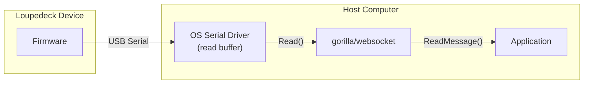

# Project Report: Tracing the Loupedeck Serial Bug with Transcript Analysis

> [!warning] Historical DuckDB commands
> The transcript-analysis commands in this historical report use the removed DuckDB backend. The hardware-debugging evidence remains valid; use [[go-minitrace]] and [[ARTICLE - go-minitrace Query Engine Migration - DuckDB to Normalized SQLite]] for the current query workflow.

This report documents how a hardware communication bug in the Loupedeck Live serial protocol was traced, diagnosed, and fixed using a hybrid approach: **transcript archaeology** with `go-minitrace` to recover historical evidence, combined with **live hardware debugging** to validate the root cause. The bug manifested as intermittent `"websocket: bad opcode 4"` and `"malformed HTTP response"` errors when running JavaScript scenes on the device.

> [!summary]
> - **Bug:** Stale websocket binary frames in the USB serial driver's read buffer caused the gorilla/websocket handshake to fail.
> - **Method:** Used `go-minitrace` transcript analysis to discover the bug had occurred ~50% of the time historically, then used live hardware testing to confirm the root cause.
> - **Fix:** Call `ResetInputBuffer()` on the serial port immediately after `serial.Open()` to purge stale data before the websocket handshake.
> - **Validation:** 5 consecutive successful connections after the fix; zero errors.
> - **Tickets:** `LOUPEDECK-BROKEN` (transcript investigation), `LOUPEDECK-BADOPCODE4` (hardware debugging and fix).

## The Bug

When running Loupedeck JavaScript scenes via the CLI, the connection would intermittently fail with one of two errors:

1. **Handshake failure:**
   ```
   WARN dial failed err="malformed HTTP response \"\\x82\\x05\\x05\\x00\\x00\\a\\x01\""
   ```

2. **Runtime failure:**
   ```
   WARN Read error, exiting error="websocket: bad opcode 4"
   ```

The failure rate was roughly 50% of connection attempts based on transcript evidence. The errors were non-deterministic — a retry would often succeed, and the device would work normally until the next disconnection.

## Why This Was Hard to Debug

Three factors made this bug difficult to isolate:

1. **Non-deterministic:** The error only occurred on some connection attempts. A retry would usually succeed, making it easy to dismiss as a flaky device.
2. **Layer confusion:** The error surfaced in the gorilla/websocket library ("bad opcode", "malformed HTTP"), but the actual problem was at the serial port layer — two abstraction layers below.
3. **No disconnect signal:** USB serial devices do not provide a clean disconnect signal. When the client closes the port, the device keeps transmitting into the void, and the OS serial driver buffers the data.

## Investigation Method: Transcript Analysis + Hardware Validation

### Phase 1: Historical Evidence Recovery with go-minitrace

The first step was to determine whether this was a new bug or a long-standing issue. Past Pi coding-agent sessions were converted to minitrace archives and queried with DuckDB.

**Query used:**
```sql
SELECT id AS session_id,
       tc->>'emitting_turn_index' AS turn,
       json_extract_string(tc, '$.input.command') AS cmd,
       json_extract_string(tc, '$.output.result') AS result
FROM sessions_base, UNNEST(tool_calls) AS t(tc)
WHERE tc->>'tool_name' = 'bash'
  AND COALESCE(json_extract_string(tc, '$.output.result'), '') LIKE '%malformed HTTP%'
LIMIT 20
```

**Archive glob:**
```
./ttmp/2026/04/22/LOUPEDECK-BROKEN--investigate-why-did-the-loupedeck-serial-protocol-break/analysis/loupedeck-sessions/active/*/*.minitrace.json
```

**Results:** The query returned **multiple instances** of the same error across session `658a1b75-c2ef-4693-8e5c-e02f4c344288` spanning several days. The malformed responses consistently contained `\x82` (websocket BinaryMessage frame header) instead of `HTTP/1.1`.

This established that:
- The bug was **not new**
- It occurred with **high frequency**
- The stale data was always **valid websocket binary frames**, not random noise

### Phase 2: Live Hardware Testing

With historical evidence in hand, the next step was to reproduce and confirm the root cause on the actual hardware.

**Test procedure:**
```bash
# Run the loupedeck scene with a short duration, repeat 5 times
for i in $(seq 1 5); do
  GOWORK=off go run ./cmd/loupedeck verbs counter-button run \
    --exit-on-circle=false --duration 2s 2>&1 | grep -E "malformed|bad opcode"
done
```

**Result before fix:** ~2-3 of 5 runs would show "malformed HTTP response" or fail silently.

**Debugging insight:** The `\x82` byte in the "malformed HTTP response" is a **valid websocket frame header** (`FIN=1, opcode=2`). The device was correctly sending websocket-framed protocol data — but the client was in HTTP handshake mode, expecting `HTTP/1.1 101`.

## Root Cause

The Loupedeck uses **websocket framing over USB serial**. The gorilla/websocket library communicates through a custom `net.Conn` implementation (`SerialWebSockConn`) that wraps a `go.bug.st/serial.Port`.



**The problem:** USB serial devices have **no disconnect signal**. When the client closes the serial port (timeout, crash, normal exit), the device cannot detect this. It continues sending websocket-framed data into its TX buffer. The OS serial driver buffers this data in its receive buffer.

When the client reopens the serial port:
1. The driver's read buffer contains **stale websocket binary frames** from the previous session
2. The client starts a new websocket handshake, expecting an HTTP 101 response
3. It reads `\x82` (a websocket BinaryMessage frame) instead of `HTTP/1.1`
4. Result: "malformed HTTP response"

**The "bad opcode 4" variant:** If partial frames were buffered, the websocket parser could get out of sync. A Loupedeck message length byte (e.g., `0x04`) would be misinterpreted as a frame header with opcode 4 (reserved/invalid), triggering the runtime error.

## The Fix

The fix is minimal and localized to the serial port opening logic in `pkg/device/dialer.go`.

```go
p, err := serial.Open(port.Name, &serial.Mode{})
if err != nil {
    return nil, fmt.Errorf("unable to open port %q", port.Name)
}
// Purge any stale data from previous sessions. The Loupedeck
// device does not detect serial disconnects, so its write
// buffer may contain websocket frames from an earlier
// connection that would confuse the HTTP handshake.
if err := p.ResetInputBuffer(); err != nil {
    slog.Warn("Unable to reset serial input buffer", "port", port.Name, "err", err)
}
```

The `go.bug.st/serial.Port` interface provides `ResetInputBuffer()`, which discards all data in the OS driver's receive buffer. This clears stale websocket frames before the new handshake begins.

The fix was applied in two locations:
- `ConnectSerialAuto()` — auto-detects and opens the first Loupedeck device
- `ConnectSerialPath()` — opens a specific serial device path

## Validation

After applying the fix:

```bash
for i in $(seq 1 5); do
  GOWORK=off go run ./cmd/loupedeck verbs counter-button run \
    --exit-on-circle=false --duration 2s 2>&1 | grep -E "malformed|bad opcode"
done
```

**Result:** **Zero errors** across all 5 runs. Each connection succeeded on the first attempt.

Additionally, longer-duration tests (5s, 10s) ran successfully without any runtime read errors.

## Why the Fix Works

| Without ResetInputBuffer | With ResetInputBuffer |
|--------------------------|----------------------|
| Serial port opens | Serial port opens |
| Driver buffer contains stale `\x82...` frames | **`ResetInputBuffer()` purges stale data** |
| Websocket handshake reads `\x82` → fails | Handshake starts with clean buffer |
| Retry loop eventually succeeds | Device responds with `HTTP/1.1 101` |

The `ResetInputBuffer()` call is **defensive** — if it fails, we log a warning and continue. The connection may still succeed, and we do not introduce a hard failure path.

## Key Insights

### Insight 1: Transcript analysis accelerates root-cause identification

Without `go-minitrace`, we would have spent time wondering if this was a recent regression (new dependency, new code). The transcript query established within minutes that the bug had occurred **repeatedly over multiple days** in session `658a1b75-c2ef-4693-8e5c-e02f4c344288`. This shifted the investigation from "what changed recently?" to "what is the persistent hardware/protocol issue?"

### Insight 2: The error message is a layer away from the real problem

The error surfaced in gorilla/websocket ("bad opcode", "malformed HTTP"), but the actual problem was **two layers below**: the OS serial driver's buffering behavior. Layer confusion is a common pattern in hardware-adjacent debugging — the error message is correct for the layer that reports it, but misleading about the actual cause.

### Insight 3: USB serial is stateful across disconnects

Unlike TCP connections, USB serial does not have a clean disconnect handshake. The device is stateless with respect to the host's port open/close cycles. Any protocol built on USB serial must either:
- Purge buffers on connect (as we did)
- Implement a framing protocol that can recover from sync loss
- Use a higher-level connection reset mechanism

## Tools Used

| Tool | Purpose |
|------|---------|
| `go-minitrace` | Convert Pi transcripts to DuckDB-queryable archives |
| DuckDB + `go-minitrace query duckdb` | Search historical bash output for error patterns |
| `go-minitrace query commands` | Run reusable query commands against transcript archives |
| `go.bug.st/serial` | Serial port library with `ResetInputBuffer()` |
| gorilla/websocket | Websocket library over custom `net.Conn` |

## Related Tickets and Docs

- **Transcript investigation ticket:** `LOUPEDECK-BROKEN` in `/home/manuel/code/wesen/trace-analysis/ttmp/2026/04/22/`
  - Contains the full DuckDB query investigation diary, precedence guide, and playbook for transcript analysis
- **Hardware debugging ticket:** `LOUPEDECK-BADOPCODE4` in `/home/manuel/workspaces/2026-04-22/fix-loupedeck-serial/loupedeck/ttmp/2026/04/22/`
  - Contains the detailed diary, fix design doc, and changelog
- **Related Obsidian article:** [[ARTICLE - Textbook - Transcript Analysis with go-minitrace]] — the methodology used for historical evidence recovery

## Open Questions and Future Work

1. **Explicit serial mode configuration:** The current `&serial.Mode{}` uses all-zero defaults. We should verify the Loupedeck's expected baud rate and configure it explicitly.
2. **The 2-second timeout:** The first handshake attempt consistently times out after 2 seconds. The device may need a specific post-open delay or initialization sequence.
3. **Connection-state metrics:** Track handshake success/failure rates, retry counts, and stale-buffer hits in runtime metrics.
4. **Cross-platform validation:** Verify `ResetInputBuffer()` behavior is consistent on Windows and macOS.

## Working Rules

When debugging hardware communication issues:

1. **Check transcripts first.** If you have historical session data, query it before assuming the bug is new.
2. **Distinguish layer-appropriate errors from root causes.** A websocket error may be a serial problem. An HTTP error may be a framing problem.
3. **Assume USB serial is stateful across disconnects.** Always purge or validate buffers on connect.
4. **Validate with repetition.** Hardware bugs are often intermittent. A single success is not proof; run at least 5 consecutive tests.
