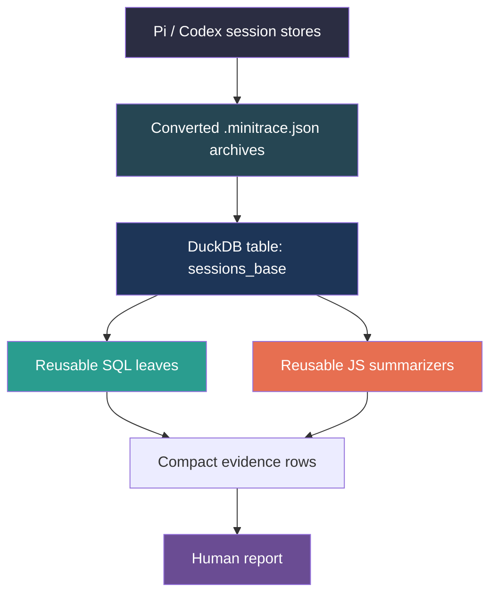

# Transcript Analysis with go-minitrace

> [!warning] Historical DuckDB commands
> This textbook chapter was written against the removed DuckDB query engine. The reduction method remains useful, but its commands and SQL require migration to `go-minitrace query run` and normalized SQLite. See [[go-minitrace]] and [[ARTICLE - go-minitrace Query Engine Migration - DuckDB to Normalized SQLite]].

This chapter explains how to use `go-minitrace` as a disciplined transcript-analysis system. The goal is not to document every feature of the tool. The goal is to teach a single method: how to turn a large corpus of agent session transcripts into a small body of trustworthy evidence, quickly enough that it is worth doing on every significant investigation.

The method was built while debugging a real Loupedeck transport regression, and every pattern in this chapter is drawn from that experience. The concrete commands are real. The mistakes are real. The commands that finally worked are real.

## 1. The problem with reading transcripts directly

An agent session transcript is not a document. It is a log of operations interleaved with a model's reasoning. Reading it from top to bottom is the wrong abstraction: it produces token-heavy noise and forces the investigator to rediscover the same structure on every session.

The common failure mode looks like this. An investigator opens three transcripts, reads three hundred turns each, and emerges with a vague impression that something happened around April 13th. The impression is not wrong, but it is expensive to acquire and hard to share. The next person on the ticket has to do it again.

What you actually want from transcript analysis is a small, precise answer to a specific question. The question might be:

- Which sessions touched the transport code?
- Which commands produced evidence of a working websocket handshake?
- When did the explicit-device-path code change its error behavior?

A transcript is useful only if it can answer a question like one of these. If it cannot, you have spent tokens on noise.

The challenge is that you do not always know the right question at the start. You discover it by narrowing. The narrowing process is the method, and that is what this chapter teaches.

## 2. The three-stage reduction pipeline

The mental model that makes transcript analysis efficient is to think of it as a three-stage pipeline. Each stage reduces entropy.



Stage one converts raw session stores into `.minitrace.json` archive files. A session store contains the full conversation: turns, tool calls, model outputs, and metadata. The archive is queryable but still unstructured. The conversion is a one-time step; after it is done, you work only against the archive.

Stage two loads the archive into a DuckDB table named `sessions_base`. The table exposes sessions as rows and nested tool calls as a JSON array column. DuckDB can query this structure efficiently, but only if you ask the right questions.

Stage three applies reusable SQL and JavaScript commands to extract only the rows that matter. This is where the pipeline earns its name. A good command at this stage returns ten rows from ten thousand, and those ten rows contain the answer.

The pipeline works because each stage does one job well. Conversion makes the material queryable. The DuckDB table makes querying fast and expressive. The reusable commands make the output trustworthy and repeatable.

## 3. The right way to think about go-minitrace

Most people approach `go-minitrace` as a SQL runner. They write a long query, run it, and look at the output. That works for one-off exploration. It does not scale to a multi-session investigation with multiple reviewers.

The right way to think about `go-minitrace` is as a command-authoring framework. The tool is designed around the idea that you should build small, named, reusable analysis commands and store them in a repository. When you find a useful pattern, you commit it to a command. When the next person picks up the ticket, they start from the commands, not from scratch.

This matters because transcript analysis is inherently iterative. You look at the first cut of results, you ask a better question, you write a new command, and you narrow further. The commands that survive the iteration are the artifact of the investigation. They are worth more than the raw output because they encode the logic of the narrowing.

The tool makes this easy. Commands live in a repository directory. The directory structure maps to CLI subcommands. SQL files become direct command leaves. JavaScript files become analysis commands with typed flags and JSON output.

Before writing a single line of analysis, read the embedded help. The following commands establish the full surface area:

```bash
go-minitrace help --all
go-minitrace help structured-query-commands
go-minitrace help js-api-reference
go-minitrace help writing-duckdb-queries
go-minitrace help duckdb-query-recipes
go-minitrace query commands --help
```

These pages teach the command-authoring model by showing it. Reading them before writing commands is the single most efficient thing you can do at the start of an investigation.

## 4. Building the command repository

Every investigation should build its own local command repository. This is the habit that separates a useful analysis from a one-time experiment.

Store the repository in the ticket's `scripts/` directory. Give it a `query-commands/` subdirectory. Point `go-minitrace` at it with the `--query-repository` flag:

```bash
go-minitrace query commands \
  --query-repository /path/to/ticket/scripts/query-commands \
  loupedeck bash-keyword-search \
  --archive-glob '/path/to/archives/*.minitrace.json' \
  --keyword 'websocket' \
  --output json
```

A clean repository for a protocol investigation looks like this:

```text
scripts/
├── query-commands/
│   └── loupedeck/
│       ├── bash-keyword-search.sql    ← SQL leaf
│       ├── file-touch-search.sql      ← SQL leaf
│       └── analysis/
│           ├── session-summary.js      ← JS summarizer
│           ├── protocol-timeline.js     ← JS summarizer
│           └── lib/
│               └── helpers.js          ← private helpers
```

The key convention is the underscore prefix for helper-only functions in JavaScript modules. The command scanner treats top-level functions as command candidates. If a helper module exposes a function named `extractExitCode`, the scanner will try to surface it as a command. This produces a collision with Glazed's global `--output` flag. The fix is simple:

```javascript
// helpers.js — WRONG
function extractExitCode(output) { ... }
module.exports = { extractExitCode };

// helpers.js — RIGHT
function _extractExitCode(output) { ... }
module.exports = { extractExitCode: _extractExitCode };
```

Use underscore-prefixed names for any function that is not a command entrypoint, and export it with its non-prefixed name. This convention keeps the scanner focused on the actual verbs.

## 5. The two SQL leaves that carry most of the weight

Not all analysis requires JavaScript. Most of the narrowing in a transcript investigation comes from two kinds of SQL queries. Get these right first.

### The bash keyword search

Bash tool calls are the most informative rows in a transcript. They contain runtime logs, test output, git history commands, and human-written shell scripts that reveal intent. A SQL leaf that searches both the command text and the bash output is the most versatile tool in the repository.

```sql
SELECT
  id AS session_id,
  timing->>'started_at' AS started_at,
  CAST(tc->>'emitting_turn_index' AS INT) AS turn_index,
  tc->>'id' AS call_id,
  json_extract_string(tc, '$.input.command') AS bash_command,
  json_extract_string(tc, '$.output.result') AS bash_output
FROM sessions_base,
     UNNEST(tool_calls) AS t(tc)
WHERE (tc->>'tool_name') = 'bash'
  AND (
    COALESCE(json_extract_string(tc, '$.input.command'), '') LIKE {{ .keyword | sqlLike }}
    OR COALESCE(json_extract_string(tc, '$.output.result'), '') LIKE {{ .keyword | sqlLike }}
  )
ORDER BY started_at, session_id, turn_index
LIMIT {{ .limit }};
```

A few things are worth noting about this query. The table name `sessions_base` is the standard name for the DuckDB-loaded archive table. The `UNNEST(tool_calls)` unpacks the JSON array of tool calls into rows. The `json_extract_string` function extracts a string value from a JSON object without requiring a CAST. The `{{ .keyword | sqlLike }}` is the sqleton template syntax for a safely escaped LIKE pattern.

The `{{ | sqlLike }}` template adds the surrounding `%` wildcards automatically. This means the caller passes `--keyword 'websocket'` and the SQL becomes `LIKE '%websocket%'`.

### The file-touch search

Tool calls of type `read`, `write`, and `edit` carry file path information. The challenge is that different tools store paths in different JSON fields: `input.file_path`, `input.path`, `input.arguments.path`. A good file-touch search normalizes these fields and optionally searches the tool result content.

```sql
SELECT
  id AS session_id,
  timing->>'started_at' AS started_at,
  CAST(tc->>'emitting_turn_index' AS INT) AS turn_index,
  (tc->>'tool_name') AS tool_name,
  COALESCE(
    json_extract_string(tc, '$.input.file_path'),
    json_extract_string(tc, '$.input.path'),
    json_extract_string(tc, '$.input.arguments.path'),
    json_extract_string(tc, '$.input.arguments.file_path')
  ) AS file_path,
  json_extract_string(tc, '$.output.result') AS tool_result
FROM sessions_base,
     UNNEST(tool_calls) AS t(tc)
WHERE (tc->>'tool_name') IN ('read', 'write', 'edit')
  {{ if .session_id }}
  AND id LIKE {{ .session_id | sqlLike }}
  {{ end }}
  {{ if .file_pattern }}
  AND COALESCE(
    json_extract_string(tc, '$.input.file_path'),
    json_extract_string(tc, '$.input.path'),
    json_extract_string(tc, '$.input.arguments.path'),
    json_extract_string(tc, '$.input.arguments.file_path'),
    ''
  ) LIKE {{ .file_pattern | sqlLike }}
  {{ end }}
  {{ if .content_keyword }}
  AND COALESCE(json_extract_string(tc, '$.output.result'), '') LIKE {{ .content_keyword | sqlLike }}
  {{ end }}
ORDER BY started_at, session_id, turn_index
LIMIT {{ .limit }};
```

The `COALESCE` here is doing real work. It tries each possible path field in order and returns the first non-null value. Without this normalization, a search for `pkg/device/` would miss tool calls that store the path in `input.arguments.path` rather than `input.file_path`.

## 6. A concrete DuckDB pitfall and the safe rule

During the Loupedeck investigation, DuckDB returned an error that looked like a data quality problem:

```
Conversion Error: Failed to cast value to numerical:
{"id":"call_7rKkXHfGxM6KPFlwHDARvoZq|fc_0b07a016a3..."}
```

The error message suggested that `output.result` contained mixed types. The real cause was DuckDB's JSON arrow operator precedence.

When you write `unnest.tool_calls->'output'->>'result' LIKE '%serial%'`, DuckDB parses this as `unnest.tool_calls->('output'->>'result') LIKE '%serial%'`. The arrow operators have lower precedence than the `LIKE` operator because DuckDB also uses arrow syntax in lambda contexts. The predicate fails, and DuckDB reports it as a casting problem rather than a parsing problem.

The safe rule is to always parenthesize JSON extraction in predicates:

```sql
-- WRONG
WHERE unnest.tool_calls->'output'->>'result' LIKE '%serial%'

-- RIGHT
WHERE (unnest.tool_calls->'output'->>'result') LIKE '%serial%'

-- ALSO RIGHT — and clearer in template context
WHERE json_extract_string(tc, '$.output.result') LIKE {{ .keyword | sqlLike }}
```

The `json_extract_string` function is preferable in reusable commands because it is self-grouping and does not require parentheses in predicates.

## 7. When to reach for JavaScript

SQL is excellent at filtering and grouping. JavaScript is better at three things: composing multiple queries, building compact narrative output, and applying classification logic.

Use JavaScript when the analysis requires joining results from several queries, or when the output needs to be readable by a human reviewer rather than machine-readable rows. Use SQL when the question is a search.

The most useful JavaScript pattern in this investigation was a timeline builder. It pulled bash, read, write, and edit tool calls from a session, filtered them by keyword matches and path patterns, and emitted only the interesting rows with previews attached. This converted hundreds of rows into a readable chronological narrative.

### A minimal JavaScript command

A good first JS command is nothing more than a small wrapper around one SQL query. The point is not sophistication. The point is to learn the scanner-first command shape.

```javascript
__section__("filters", {
  title: "Filters",
  fields: {
    keyword: {
      type: "string",
      default: "websocket",
      help: "Substring matched against bash command text and output",
    },
    limit: {
      type: "int",
      default: 25,
      help: "Maximum rows to return",
    },
  },
});

function bashClueSearch(filters) {
  const mt = require("minitrace");
  return mt.query(`
    SELECT
      id AS session_id,
      CAST(tc->>'emitting_turn_index' AS INT) AS turn_index,
      json_extract_string(tc, '$.input.command') AS bash_command,
      json_extract_string(tc, '$.output.result') AS bash_output
    FROM ${mt.tableName},
         UNNEST(tool_calls) AS t(tc)
    WHERE (tc->>'tool_name') = 'bash'
      AND (
        COALESCE(json_extract_string(tc, '$.input.command'), '') LIKE ${mt.sql.like(filters.keyword)}
        OR COALESCE(json_extract_string(tc, '$.output.result'), '') LIKE ${mt.sql.like(filters.keyword)}
      )
    ORDER BY session_id, turn_index
    LIMIT ${filters.limit}
  `);
}

__verb__("bashClueSearch", {
  name: "bash-clue-search",
  short: "Search bash command text and output for one keyword",
  fields: { filters: { bind: "filters" } },
});
```

If this file lives at:

```text
query-commands/loupedeck/analysis/bash-clue-search.js
```

then the command path becomes:

```bash
go-minitrace query commands loupedeck analysis bash-clue-search ...
```

This example is intentionally simple. It teaches the three core pieces of the JS command model:

- `__section__` defines typed user inputs,
- the command function calls `require("minitrace")` and runs one or more queries,
- `__verb__` exposes the function as a named CLI leaf.

### A real JavaScript summarizer

The protocol timeline command used in the Loupedeck investigation is more representative of why JavaScript is worth the trouble. It mixes SQL querying with JS-side filtering and shaping.

A simplified version of the real command looks like this:

```javascript
const { extractResult, parseKeywords, truncate } = require("./lib/helpers");

__section__("filters", {
  title: "Protocol timeline filters",
  fields: {
    session_id: {
      type: "string",
      help: "Session id substring to focus on",
    },
    keywords: {
      type: "string",
      default: "websocket,serial,protocol,opcode,ttyACM,bug.st/serial,gorilla/websocket",
      help: "Comma-separated keywords matched against bash text and file content",
    },
    path_keywords: {
      type: "string",
      default: "pkg/device/,cmd/loupedeck/cmds/run/,connect.go,listen.go,loupedeck.go",
      help: "Comma-separated path fragments matched against read/write/edit calls",
    },
    limit: {
      type: "int",
      default: 250,
      help: "Maximum interesting events to return",
    },
  },
});

function _containsAny(text, keywords) {
  const source = String(text || "").toLowerCase();
  return keywords.filter((kw) => source.includes(String(kw || "").toLowerCase()));
}

function protocolTimeline(filters) {
  const mt = require("minitrace");
  const keywords = parseKeywords(filters.keywords);
  const pathKeywords = parseKeywords(filters.path_keywords);

  let sql = `
    SELECT
      id AS session_id,
      title,
      timing->>'started_at' AS started_at,
      CAST(tc->>'emitting_turn_index' AS INT) AS turn_index,
      tc->>'id' AS call_id,
      (tc->>'tool_name') AS tool_name,
      json_extract_string(tc, '$.input.command') AS command,
      tc->'output' AS output_json,
      COALESCE(
        json_extract_string(tc, '$.input.file_path'),
        json_extract_string(tc, '$.input.path'),
        json_extract_string(tc, '$.input.arguments.path'),
        json_extract_string(tc, '$.input.arguments.file_path')
      ) AS file_path
    FROM ${mt.tableName},
         UNNEST(tool_calls) AS t(tc)
    WHERE (tc->>'tool_name') IN ('bash', 'read', 'write', 'edit')
  `;

  if (filters.session_id) {
    sql += `\n  AND id LIKE ${mt.sql.like(filters.session_id)}`;
  }

  sql += `\n    ORDER BY started_at, session_id, turn_index\n    LIMIT 5000`;

  const rows = mt.query(sql);
  const events = [];

  for (const row of rows) {
    const outputText = extractResult(row.output_json);
    const commandText = String(row.command || "");
    const filePath = String(row.file_path || "");

    const keywordMatches = [
      ..._containsAny(commandText, keywords),
      ..._containsAny(outputText, keywords),
    ];
    const pathMatches = _containsAny(filePath, pathKeywords);
    const matches = Array.from(new Set([...keywordMatches, ...pathMatches]));

    if (matches.length === 0) {
      continue;
    }

    events.push({
      session_id: row.session_id,
      turn_index: row.turn_index,
      tool_name: row.tool_name,
      matched: matches.join(", "),
      file_path: truncate(filePath, 120),
      command_preview: truncate(commandText, 220),
      output_preview: truncate(outputText, 280),
    });
  }

  return events.slice(0, filters.limit);
}

__verb__("protocolTimeline", {
  name: "protocol-timeline",
  short: "Build a cross-session timeline of protocol-related events",
  fields: { filters: { bind: "filters" } },
});
```

This example shows the real advantage of JS commands. The SQL query fetches a broad but still bounded candidate set. The JavaScript loop then applies the investigator's judgment: which keywords matter, which path fragments matter, what a useful preview looks like, and how many rows a human can reasonably review.

The algorithm for a timeline command is:

```
Given: keyword list K, path fragment list P, limit N
Fetch all bash/read/write/edit tool calls ordered by started_at, session_id, turn_index

For each row:
  Extract output text, command text, file path
  Compute keyword matches: keywords from K found in output or command
  Compute path matches: fragments from P found in file path
  If no matches: skip row
  Otherwise: emit a compact event with session_id, turn_index, tool_name,
             matched keywords, command preview, output preview, file path

Return the first N emitted events
```

This is not complex logic. It does not require a framework. The value is entirely in the reduction: it turns a noisy corpus into a short, readable list.

### The JavaScript runtime surface you actually use

In practice, most JS command files only need a small subset of the runtime:

- `require("minitrace")` for `mt.query(...)`, `mt.queryOne(...)`, and `mt.tableName`
- `mt.sql.string(...)`, `mt.sql.stringIn(...)`, and `mt.sql.like(...)` for safe SQL literal generation
- relative helper modules such as `require("./lib/helpers")`
- occasionally `require("timer")` for async commands, though this was not necessary in the Loupedeck investigation

That small surface area is one reason JS commands are approachable. You are not writing a framework plugin. You are writing a short analysis script with typed inputs and a stable CLI path.

## 8. The procedure in full

For a future investigation, use this procedure. It was developed on the Loupedeck case and proved efficient at every step.

**Step 1: Convert the right sessions only.** Do not convert the entire session store. Use `go-minitrace convert pi --source-dir` on only the slugged directory that matches the investigation scope. The archive glob for this investigation was:

```text
'.../analysis/loupedeck-sessions/active/*/*.minitrace.json'
```

**Step 2: Inventory the sessions.** Run a summary command that returns id, title, started_at, tool counts, and dominant framework. This surfaces the handful of sessions that are worth narrowing to.

**Step 3: Run the bash keyword search.** Search for terms that identify working or broken protocol behavior: `Connect successful`, `websocket`, `malformed`, `bad opcode`, `Setting default brightness`. The output shows session, turn, command, and full output. The output is the evidence.

**Step 4: Run the file-touch search.** Search for the files that matter in the investigation. For the Loupedeck case, `pkg/device/` and `cmd/loupedeck/cmds/run/` were the signal paths. The output shows which sessions and turns touched those files.

**Step 5: If needed, run a JS timeline on the shortlist.** For a bounded session, a timeline command produces a compact chronological narrative that a reviewer can read in two minutes instead of twenty.

**Step 6: Read source code and git history only in the narrowed area.** Transcript analysis tells you where to look. It does not replace looking.

## 9. What the Loupedeck case study actually found

The investigation produced three concrete findings that would have been difficult or impossible to recover from memory or from today's logs alone.

The first finding was that the transport stack worked correctly in earlier sessions. A recovered bash log from session `658a1b75` showed a successful run:

```
INFO Attempting to open websocket connection
INFO Dialing...
INFO Timeout! Trying again without timeout.
WARN dial failed err="malformed HTTP response..."
INFO Attempting to open websocket connection
INFO Connect successful resp="...101 Switching Protocols..."
INFO Found Loupedeck vendor=2ec2 product=0004
INFO Sending reset.
INFO Setting default brightness.
INFO Listening
INFO Read message="{len: 4, type: 09, txn: 02, data: [1]}"
```

The device ran normally for the duration of the test. This establishes a baseline: the transport stack, as described in the current source, was capable of working.

The second finding was that an earlier explicit-device-path run failed with `connect: unknown device product ID: ""`. This failure mode appeared once and was then fixed by adding a post-connect metadata refresh using `lookupSerialPortMetadata(c.Name)`. The transcript showed both the failure and the code change in close proximity, which made the fix easy to understand.

The third finding was that dependency drift was probably not the primary cause. The `gorilla/websocket` version moved from `v1.5.0` to `v1.5.3` across the relevant commits, but the more significant structural changes were elsewhere: device profile initialization in `connect.go`, runtime convergence in the engine, JS verb embedding, and CLI command refactoring.

### The exact queries that surfaced those findings

For this ticket, the common shell setup was:

```bash
QUERY_REPO=/home/manuel/code/wesen/trace-analysis/ttmp/2026/04/22/LOUPEDECK-BROKEN--investigate-why-did-the-loupedeck-serial-protocol-break/scripts/query-commands
ARCHIVE_GLOB='/home/manuel/code/wesen/trace-analysis/ttmp/2026/04/22/LOUPEDECK-BROKEN--investigate-why-did-the-loupedeck-serial-protocol-break/analysis/loupedeck-sessions/active/*/*.minitrace.json'
```

The session shortlist was established with the session summary command:

```bash
GOWORK=off go run ./cmd/go-minitrace query commands \
  --query-repository "$QUERY_REPO" \
  loupedeck analysis session-summary \
  --archive-glob "$ARCHIVE_GLOB" \
  --output json
```

That query surfaced the sessions that dominated the investigation: `658a1b75`, `28f358e9`, `114cf5a5`, and `813f73e3`.

To establish that the transport stack worked correctly in earlier sessions, the critical query was the bash keyword search for a successful handshake:

```bash
GOWORK=off go run ./cmd/go-minitrace query commands \
  --query-repository "$QUERY_REPO" \
  loupedeck bash-keyword-search \
  --archive-glob "$ARCHIVE_GLOB" \
  --keyword 'Connect successful' \
  --limit 20 \
  --output json
```

Two companion searches tightened the same finding by looking for the rest of the startup sequence:

```bash
GOWORK=off go run ./cmd/go-minitrace query commands \
  --query-repository "$QUERY_REPO" \
  loupedeck bash-keyword-search \
  --archive-glob "$ARCHIVE_GLOB" \
  --keyword 'Sending reset' \
  --limit 20 \
  --output json

GOWORK=off go run ./cmd/go-minitrace query commands \
  --query-repository "$QUERY_REPO" \
  loupedeck bash-keyword-search \
  --archive-glob "$ARCHIVE_GLOB" \
  --keyword 'Setting default brightness' \
  --limit 20 \
  --output json
```

Those three searches together recovered the earlier run that showed a malformed-response retry followed by `101 Switching Protocols`, reset, brightness setup, and a sustained stream of binary protocol messages.

To find the explicit-device-path failure, the first decisive query was another bash search, this time against the concrete error string:

```bash
GOWORK=off go run ./cmd/go-minitrace query commands \
  --query-repository "$QUERY_REPO" \
  loupedeck bash-keyword-search \
  --archive-glob "$ARCHIVE_GLOB" \
  --keyword 'unknown device product ID' \
  --limit 20 \
  --output json
```

That surfaced the old explicit-device-path failure with:

```text
connect: unknown device product ID: ""
```

The next narrowing step was to ask which sessions touched the relevant connection code:

```bash
GOWORK=off go run ./cmd/go-minitrace query commands \
  --query-repository "$QUERY_REPO" \
  loupedeck file-touch-search \
  --archive-glob "$ARCHIVE_GLOB" \
  --file-pattern 'pkg/device/connect.go' \
  --limit 40 \
  --output json
```

That query identified the sessions and turns where `pkg/device/connect.go` was read or edited. Once those turns were known, the surrounding transcript evidence made the post-connect metadata refresh easy to recover.

To narrow the investigation to transport files more generally, the broad file-touch search was:

```bash
GOWORK=off go run ./cmd/go-minitrace query commands \
  --query-repository "$QUERY_REPO" \
  loupedeck file-touch-search \
  --archive-glob "$ARCHIVE_GLOB" \
  --file-pattern 'pkg/device/' \
  --limit 120 \
  --output json
```

This established that `pkg/device/loupedeck.go`, `pkg/device/listen.go`, and `pkg/device/display.go` were the core transport files being studied in the relevant sessions.

To investigate dependency drift, the useful transcript query was to search file touches over `go.mod` reads with dependency names as content keywords:

```bash
GOWORK=off go run ./cmd/go-minitrace query commands \
  --query-repository "$QUERY_REPO" \
  loupedeck file-touch-search \
  --archive-glob "$ARCHIVE_GLOB" \
  --file-pattern 'go.mod' \
  --content-keyword 'gorilla/websocket' \
  --limit 40 \
  --output json

GOWORK=off go run ./cmd/go-minitrace query commands \
  --query-repository "$QUERY_REPO" \
  loupedeck file-touch-search \
  --archive-glob "$ARCHIVE_GLOB" \
  --file-pattern 'go.mod' \
  --content-keyword 'bug.st/serial' \
  --limit 40 \
  --output json
```

Those queries surfaced the `go.mod` reads in the JS-verbs session and made it possible to connect transcript evidence with the later git-history comparison. The transcript alone showed that the dependencies were being inspected; the narrowed git history then showed that `go.bug.st/serial` stayed at `v1.6.0` while `github.com/gorilla/websocket` later moved from `v1.5.0` to `v1.5.3`.

Finally, to turn the JS-verbs session into a compact chronological narrative, the command that mattered was the protocol timeline:

```bash
GOWORK=off go run ./cmd/go-minitrace query commands \
  --query-repository "$QUERY_REPO" \
  loupedeck analysis protocol-timeline \
  --archive-glob "$ARCHIVE_GLOB" \
  --session-id 114cf5a5 \
  --limit 120 \
  --output json
```

That query did not prove any single finding by itself. What it did was compress the transcript into a readable sequence of bash clues and transport-file touches, which made the structure of the later source changes visible.

None of these findings prove the current `bad opcode 4` error. What they do is narrow the hypothesis space significantly. The investigation is no longer "something about the websocket transport." It is "something specific in the interaction between startup traffic, the read loop, and the binary message framing in `pkg/device/listen.go`."

That narrowing is the value of the method.

## 10. The working rules

Every investigation should follow these rules. They are not style preferences. They are the difference between a reusable analysis and a throwaway experiment.

**Rule 1: Build a ticket-local command repository.** Store every useful SQL and JavaScript command in `scripts/query-commands/` under the ticket root. The commands encode the logic of the investigation. They are worth more than the output.

**Rule 2: Convert only the sessions in scope.** Full session-store conversion is expensive and produces noise. Narrow first by slug or date, then convert only the relevant directories.

**Rule 3: Write the two SQL leaves first.** Bash keyword search and file-touch search will narrow most investigations to a small shortlist. Write JavaScript only when the narrowing from SQL is not enough.

**Rule 4: Use `json_extract_string(...)` or parenthesize arrow expressions in predicates.** This avoids the DuckDB precedence pitfall. It is the single rule most likely to save debugging time in future investigations.

**Rule 5: Prefix JavaScript helper functions with `_`.** This prevents accidental command-surface generation in the scanner.

**Rule 6: Preserve the archive glob and the command invocations in the report.** The next reviewer needs to be able to rerun the analysis exactly. Copy-pasteable command lines are worth more than descriptions of commands.

**Rule 7: Treat transcript analysis as narrowing, not proof.** A transcript can establish that something worked, that something failed, and which sessions touched which files. It cannot directly diagnose a runtime failure. The diagnosis comes from reading the narrowed source code.

## 11. Reference material

The following materials were the source of the method in this chapter.

Embedded help commands in `go-minitrace`:

- `go-minitrace help --all`
- `go-minitrace help structured-query-commands`
- `go-minitrace help js-api-reference`
- `go-minitrace help writing-duckdb-queries`
- `go-minitrace help duckdb-query-recipes`

Local documentation in the `go-minitrace` checkout (`/home/manuel/code/wesen/corporate-headquarters/go-minitrace`):

- `pkg/doc/structured-query-commands.md`
- `pkg/doc/js-api-reference.md`
- `pkg/doc/writing-duckdb-queries.md`
- `pkg/doc/duckdb-query-recipes.md`
- `pkg/doc/analysis-guide.md`

Checked-in example repositories showing the intended command shape:

- `testdata/query-repositories/js-showcase/analysis/workspace-lab.js`
- `testdata/query-repositories/js-showcase/analysis/lib/cookbook.js`
- `testdata/query-repositories/js-showcase/overview/session-tools.js`
- `testdata/query-repositories/mixed-sql-js-showcase/analysis/raw-workspace-stats.sql`

External DuckDB references for the JSON precedence issue:

- [DuckDB JSON functions](https://duckdb.org/docs/current/data/json/json_functions.html)
- [DuckDB JSON overview](https://duckdb.org/docs/current/data/json/overview.html)
- [DuckDB issue 16970](https://github.com/duckdb/duckdb/issues/16970)
- [DuckDB issue 21975](https://github.com/duckdb/duckdb/issues/21975)

Ticket artifacts encoding the method and findings:

- `/home/manuel/code/wesen/trace-analysis/ttmp/2026/04/22/LOUPEDECK-BROKEN--investigate-why-did-the-loupedeck-serial-protocol-break/design/02-duckdb-arrow-precedence-postmortem-and-querying-guide.md`
- `/home/manuel/code/wesen/trace-analysis/ttmp/2026/04/22/LOUPEDECK-BROKEN--investigate-why-did-the-loupedeck-serial-protocol-break/scripts/query-commands/`

The three commands worth studying as concrete examples:

- `loupedeck/bash-keyword-search.sql` — the bash search leaf
- `loupedeck/file-touch-search.sql` — the file-touch search leaf
- `loupedeck/analysis/protocol-timeline.js` — the JS timeline summarizer

## 12. Closing

The phrase "analyze past transcripts" sounds like a reading task. It is not. It is a reduction task. The investigator who succeeds is not the one who reads the most JSON. It is the one who builds the smallest set of trustworthy tools that turns a noisy transcript corpus into a precise answer.

The method is not complicated. Convert only what matters. Write two SQL leaves. Run them. Narrow further with a JS summarizer if needed. Preserve the commands in the ticket. Let the next reviewer start where you stopped.

That is the whole method.
