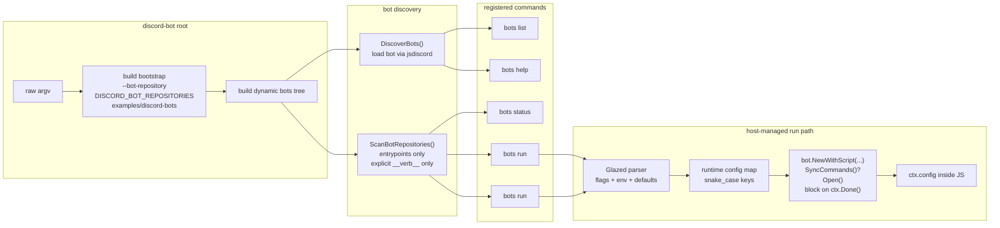

# GUIDE - Goja JS Verbs to CLI: From `require()` to `discord-bot bots run`

> This guide describes the **current** shape of the Discord bot framework after the jsverbs / Glazed unification work. The important shift is that bot scripts can now carry `__verb__` metadata directly, while the Go host still owns long-lived bot execution.

## Overview

The Discord bot framework now supports three closely related ideas at once:

1. **JavaScript bot authors** still write long-lived Discord bots with `defineBot(...)` loaded through `require("discord")`.
2. **Bot scripts can also declare jsverbs metadata** using `__verb__(...)`, `__package__(...)`, and friends.
3. **The Go host decides how those verbs become CLI commands**:
   - ordinary one-shot verbs like `status` run through a jsverbs-style invoker,
   - `run` is special and becomes a **host-managed `BareCommand`** that starts the Discord session, injects `ctx.config`, optionally syncs commands, and blocks until shutdown.

This means the framework is no longer centered on `configure({ run: { fields: ... } })` plus a custom two-stage manual parser. Instead, the CLI is now built from a mix of:

- bot discovery via the Discord runtime,
- jsverbs metadata scanning of bot entrypoint scripts,
- Glazed-generated Cobra commands,
- and a host-managed execution path for `run`.

The current system also preserves compatibility in both directions:

- **new style** bots can declare `__verb__("run")` explicitly,
- **older bots without explicit run metadata** still get a synthetic `run` command from the Go side,
- operators can use both:
  - `discord-bot bots <bot> run`
  - `discord-bot bots run <bot>`

> [!summary]
> 1. Bot scripts can now carry both `defineBot(...)` and jsverbs metadata in the same file.
> 2. `__verb__("run")` does **not** mean “run this JS function directly”; it means “declare the CLI schema for a host-managed bot lifecycle command.”
> 3. Dynamic bot commands are registered before Cobra parsing by pre-resolving bot repositories from `--bot-repository`, `DISCORD_BOT_REPOSITORIES`, or the local examples directory.
> 4. Glazed env middlewares are active again for dynamic bot commands, so `DISCORD_BOT_TOKEN` and `DISCORD_APPLICATION_ID` work for `bots run <bot>` too.

## Current architecture



## The key mental model

There are now **two different uses of jsverbs** inside the same bot script:

### 1. One-shot CLI verbs

These behave like ordinary jsverbs commands. Example:

```js
function status() {
  return {
    active: true,
    mode: "unified-demo",
  };
}

__verb__("status", {
  short: "Return unified-demo metadata as structured output",
  output: "glaze",
});
```

The framework scans that metadata and turns it into a CLI command such as:

```bash
discord-bot bots unified-demo status --output json
```

### 2. Host-managed `run`

This looks like jsverbs metadata, but the function body is effectively just a marker:

```js
function run() {
  return { status: "host-managed" };
}

__verb__("run", {
  short: "Run the unified-demo Discord bot",
  output: "text",
  fields: {
    "bot-token": { type: "string", help: "Discord bot token" },
    "application-id": { type: "string", help: "Discord application/client ID" },
    "guild-id": { type: "string", help: "Optional guild ID for development sync" },
    "db-path": { type: "string", default: "./demo.sqlite" },
    "api-key": { type: "string" }
  }
});
```

The Go host **does not call the JS `run()` function to run the bot**. Instead, it uses the metadata to build a Glazed command description, then does the long-lived work itself:

1. parse flags and env vars,
2. validate credentials,
3. build a runtime config map,
4. create the Discord bot instance,
5. optionally sync commands,
6. open the gateway session,
7. block until shutdown.

That distinction is the core design decision.

## Why `defineBot(...)` and `__verb__(...)` can coexist

The framework added no-op polyfills for:

- `__package__`
- `__section__`
- `__verb__`
- `doc`

inside `/home/manuel/workspaces/2026-04-22/discord-bot-framework/2026-04-20--js-discord-bot/internal/jsdiscord/runtime.go`.

That matters because bot scripts are executed by the Discord runtime, while jsverbs metadata is discovered statically by Tree-sitter-based scanning. Without the polyfills, a bot script containing `__verb__(...)` would crash at runtime even though the metadata was meant only for discovery.

## Discovery pipeline

### Step 1: discover actual bots via the Discord runtime

`DiscoverBots(...)` still loads the JavaScript script through the Discord host and extracts the bot descriptor:

- name
- description
- commands
- events
- components
- modals
- autocomplete handlers
- legacy `RunSchema` metadata if present

This is how the framework knows which `.js` files are real Discord bots.

### Step 2: scan only bot entrypoint scripts for jsverbs metadata

A key implementation correction was to **avoid scanning whole repositories**. If the scan includes helper libraries, jsverbs will infer commands from ordinary top-level functions like `firstValue()` or helper files like `knowledge-base/lib/reactions.js`.

The current scanning wrapper in `/home/manuel/workspaces/2026-04-22/discord-bot-framework/2026-04-20--js-discord-bot/internal/botcli/jsverbs_scan.go` now does two important things:

1. it reuses `discoverScriptCandidates()` so only actual bot entrypoints are scanned,
2. it calls jsverbs with `IncludePublicFunctions: false`, so only **explicit** `__verb__(...)` metadata becomes commands.

That is why `ui-showcase` no longer exposes fake commands like `first-value`.

## Command tree shape

The `bots` subtree is now assembled in `/home/manuel/workspaces/2026-04-22/discord-bot-framework/2026-04-20--js-discord-bot/internal/botcli/command.go`.

### Static Glazed commands

These are always present:

- `bots list`
- `bots help <bot>`

Both are ordinary Glazed commands with structured output.

### Discovered jsverbs commands

For each scanned bot script:

- explicit non-`run` jsverbs become regular discovered commands,
- explicit `run` jsverbs become host-managed `botRunCommand`s,
- bots with **no explicit `__verb__("run")`** still get a synthetic `run` command so older bots keep working.

### Compatibility aliases

For every runnable bot, the framework now registers both forms:

```bash
discord-bot bots ui-showcase run
discord-bot bots run ui-showcase
```

This lets old operator muscle memory continue to work while still supporting the more natural per-bot command tree.

## Root-level repository selection

The dynamic command tree has to exist **before Cobra parses** commands like:

```bash
discord-bot --bot-repository ./examples/discord-bots bots knowledge-base run
```

So the root command now pre-scans raw argv in `/home/manuel/workspaces/2026-04-22/discord-bot-framework/2026-04-20--js-discord-bot/cmd/discord-bot/root.go` and builds the bootstrap up front.

Repository precedence is:

1. root-level `--bot-repository` (repeatable)
2. `DISCORD_BOT_REPOSITORIES`
3. fallback `./examples/discord-bots`

This is one of the important differences from a normal Glazed middleware problem: repository selection affects **which commands exist**, not just field values inside an already-selected command.

## Host-managed run command details

The host-managed run command lives in:

- `/home/manuel/workspaces/2026-04-22/discord-bot-framework/2026-04-20--js-discord-bot/internal/botcli/bot_run_command.go`
- `/home/manuel/workspaces/2026-04-22/discord-bot-framework/2026-04-20--js-discord-bot/internal/botcli/run_description.go`

Its responsibilities are:

### 1. Build the CLI schema

Every run command now always includes core host-managed fields:

- `bot-token`
- `application-id`
- `guild-id`
- `sync-on-start`

Then it adds any bot-specific fields from either:

- explicit `__verb__("run", { fields: ... })`, or
- a synthetic fallback derived from the old bot descriptor when explicit run metadata is absent.

### 2. Parse config through Glazed

Dynamic bot commands now use the same parser configuration style as the static root commands:

```go
AppName: "discord"
```

That re-enables Glazed environment middleware, so values like these work again:

- `DISCORD_BOT_TOKEN`
- `DISCORD_APPLICATION_ID`

### 3. Avoid the required-before-env trap

A subtle issue appeared here: Glazed’s Cobra source validates required flags before env middlewares run. That meant marking `bot-token` and `application-id` as parser-level required would reject env-only usage too early.

The fix was:

- make those fields non-required at parser time,
- keep the real validation in `cfg.Validate()`.

That preserves env-based workflows while still failing correctly before startup if the credentials are absent.

### 4. Build the runtime config map

After parsing, the host walks all parsed field values and builds:

```go
map[string]any
```

with snake_case keys suitable for `ctx.config`.

### 5. Optional sync before open

The run command now supports:

```bash
--sync-on-start
```

When enabled, the host calls `SyncCommands()` before opening the gateway session.

That is especially useful during development because it restores the older operational pattern where starting the bot could also refresh slash commands.

## Runtime config key mapping

The current runtime contract is:

- CLI flags use kebab-case,
- `ctx.config` uses snake_case.

Examples:

| CLI flag | JS runtime key |
|---|---|
| `--db-path` | `ctx.config.db_path` |
| `--api-key` | `ctx.config.api_key` |
| `--review-limit` | `ctx.config.review_limit` |
| `--capture-enabled` | `ctx.config.capture_enabled` |

This mapping is implemented in:

- `/home/manuel/workspaces/2026-04-22/discord-bot-framework/2026-04-20--js-discord-bot/internal/botcli/field_name.go`
- `/home/manuel/workspaces/2026-04-22/discord-bot-framework/2026-04-20--js-discord-bot/internal/jsdiscord/descriptor.go`

The framework originally had edge cases around consecutive capitals; tests now lock the behavior down.

## Migration status of the examples

### `unified-demo`

`/home/manuel/workspaces/2026-04-22/discord-bot-framework/2026-04-20--js-discord-bot/examples/discord-bots/unified-demo/index.js`

This is the clean demonstration of the new pattern:

- `defineBot(...)`
- `__verb__("status")`
- `__verb__("run")`
- runtime reads from `ctx.config.db_path` and `ctx.config.api_key`

### `knowledge-base`

`/home/manuel/workspaces/2026-04-22/discord-bot-framework/2026-04-20--js-discord-bot/examples/discord-bots/knowledge-base/index.js`

This is the first real migrated non-trivial bot. It no longer relies on:

```js
configure({ run: { fields: ... } })
```

Instead it declares:

```js
__verb__("run", { fields: ... })
```

and reads the new snake_case config shape, while staying tolerant of older camelCase lookups in a few compatibility helpers.

### `ui-showcase` and other older bots

Bots that do not yet declare `__verb__("run")` still receive a synthetic host-managed run command, so operators can continue to start them without rewriting every example at once.

## Ordinary jsverbs still need the Discord registrar

One tricky implementation detail is that bot scripts often do top-level imports like:

```js
const { defineBot } = require("discord");
```

So even a one-shot jsverbs command like `status` still needs the runtime to understand `require("discord")`.

The fix was a custom bot-specific jsverbs invoker that builds the runtime with both:

- the jsverbs source overlay / require loader,
- the Discord registrar.

Without that, non-run bot verbs would fail at startup even though their actual function body looked like a normal jsverbs verb.

## Current operator workflows

### Inventory and inspect

```bash
go run ./cmd/discord-bot --bot-repository ./examples/discord-bots bots list --output json
go run ./cmd/discord-bot --bot-repository ./examples/discord-bots bots help unified-demo --output json
```

### One-shot bot verbs

```bash
go run ./cmd/discord-bot --bot-repository ./examples/discord-bots bots unified-demo status --output json
```

### Run a bot with the per-bot command tree

```bash
go run ./cmd/discord-bot --bot-repository ./examples/discord-bots bots unified-demo run \
  --bot-token "$DISCORD_BOT_TOKEN" \
  --application-id "$DISCORD_APPLICATION_ID" \
  --guild-id "$DISCORD_GUILD_ID" \
  --db-path ./examples/discord-bots/unified-demo/data/demo.sqlite \
  --api-key local-demo-key \
  --sync-on-start
```

### Run a bot with the compatibility syntax

```bash
go run ./cmd/discord-bot --bot-repository ./examples/discord-bots bots run ui-showcase \
  --sync-on-start
```

### Use env-backed credentials through Glazed middleware

```bash
DISCORD_BOT_TOKEN=token-from-env \
DISCORD_APPLICATION_ID=app-from-env \
go run ./cmd/discord-bot bots --bot-repository ./examples/discord-bots run ui-showcase --print-parsed-fields
```

That now shows the Glazed provenance log with `source: env` for the two Discord credential fields.

## What changed from the older design

The earlier design of this guide assumed a framework centered on:

- `configure({ run: { fields: ... } })`
- `run_dynamic_schema.go`
- two-stage manual parsing for `bots run`
- dynamically re-parsing leftover flags after bot selection

That is no longer the main architecture.

The current design replaced that with:

- jsverbs metadata scanning,
- host-managed `__verb__("run")` semantics,
- Glazed command generation,
- root-level bootstrap / repository pre-resolution,
- synthetic fallback run commands for older bots,
- and compatibility aliases for both command shapes.

## Working rules

1. **Use explicit `__verb__(...)` metadata for real CLI verbs.**
2. **Treat `run` as host-managed orchestration, not as a normal one-shot JS function.**
3. **Scan only bot entrypoint scripts, and only explicit verbs.**
4. **Let Glazed handle parsing, env, defaults, and help rendering.**
5. **Validate Discord credentials after env resolution, not as early required-flag checks.**
6. **Keep `ctx.config` as a generic injected map so new bot fields do not require host recompilation.**
7. **Preserve compatibility while migrating example bots incrementally.**

## Key files to read

- `/home/manuel/workspaces/2026-04-22/discord-bot-framework/2026-04-20--js-discord-bot/cmd/discord-bot/root.go`
- `/home/manuel/workspaces/2026-04-22/discord-bot-framework/2026-04-20--js-discord-bot/internal/botcli/command.go`
- `/home/manuel/workspaces/2026-04-22/discord-bot-framework/2026-04-20--js-discord-bot/internal/botcli/jsverbs_scan.go`
- `/home/manuel/workspaces/2026-04-22/discord-bot-framework/2026-04-20--js-discord-bot/internal/botcli/run_description.go`
- `/home/manuel/workspaces/2026-04-22/discord-bot-framework/2026-04-20--js-discord-bot/internal/botcli/bot_run_command.go`
- `/home/manuel/workspaces/2026-04-22/discord-bot-framework/2026-04-20--js-discord-bot/internal/jsdiscord/runtime.go`
- `/home/manuel/workspaces/2026-04-22/discord-bot-framework/2026-04-20--js-discord-bot/internal/jsdiscord/descriptor.go`
- `/home/manuel/workspaces/2026-04-22/discord-bot-framework/2026-04-20--js-discord-bot/examples/discord-bots/unified-demo/index.js`
- `/home/manuel/workspaces/2026-04-22/discord-bot-framework/2026-04-20--js-discord-bot/examples/discord-bots/knowledge-base/index.js`

## Related

- [[PROJ - JS Discord Bot Framework]]
- `/home/manuel/workspaces/2026-04-22/discord-bot-framework/2026-04-20--js-discord-bot/ttmp/2026/04/22/DISCORD-BOT-JSVERBS-UNIFICATION--unify-discord-bot-with-jsverbs-using-verb-syntax-in-bot-scripts-and-registering-bots-as-glazed-commands/design-doc/01-discord-bot-and-jsverbs-unification-architecture.md`
- `/home/manuel/workspaces/2026-04-22/discord-bot-framework/2026-04-20--js-discord-bot/ttmp/2026/04/22/DISCORD-BOT-JSVERBS-UNIFICATION--unify-discord-bot-with-jsverbs-using-verb-syntax-in-bot-scripts-and-registering-bots-as-glazed-commands/reference/01-investigation-diary.md`
