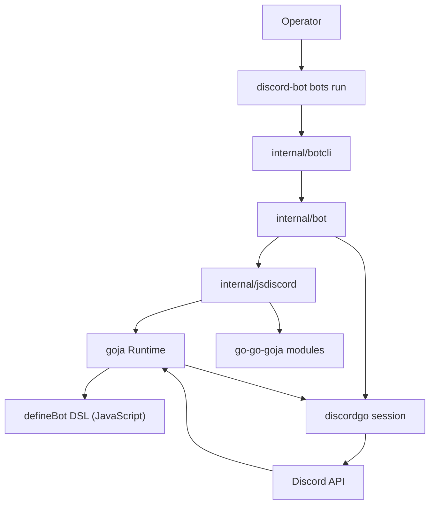
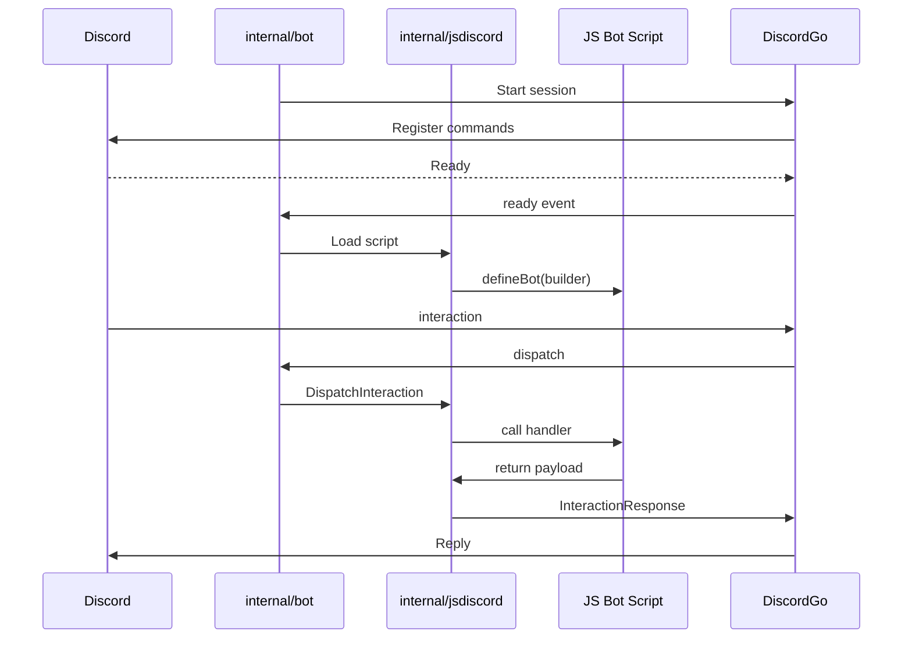

# PROJ - JS Discord Bot Framework

> A Go Discord bot host that runs JavaScript bot scripts through a goja runtime, with a clean `defineBot` DSL and Glazed CLI integration.

## Overview

The **JS Discord Bot Framework** is a Go application that hosts JavaScript bot implementations via [goja](https://github.com/dop251/goja). Instead of writing Discord bots directly in Go, bot authors write JavaScript that is loaded, executed, and integrated with Discord by the host process. The host bridges the JavaScript runtime to the Discord API and exposes a clean DSL for registering commands, components, modals, events, and runtime configuration.

The project lives at `/home/manuel/code/wesen/2026-04-20--js-discord-bot`.

## [!summary](Project Themes)

1. **Goja-based JS runtime** — Bot scripts run in a goja JavaScript runtime with a custom `require("discord")` module, not in a browser or Node.js.
2. **Clean DSL over raw payloads** — Bot authors use `command()`, `component()`, `modal()`, `event()` builders rather than hand-crafting Discord API payloads.
3. **Single-bot per process** — Each `bots run` invocation selects exactly one JS bot implementation, keeping the runtime model simple and enabling clean startup-config injection via `ctx.config`.
4. **Glazed CLI orchestration** — The operator-facing CLI uses [Glazed](https://github.com/go-go-golems/go-go-golems) for command structure and dynamic startup-flag parsing.

## Architecture



### Key packages

| Package | Role |
|---------|------|
| `internal/jsdiscord/` | JavaScript runtime, DSL parsing, Discord host bridge, dispatch routing |
| `internal/bot/` | Live bot host wiring (one script per process) |
| `internal/botcli/` | Glazed CLI for bot discovery, help, and dynamic run-schema parsing |
| `internal/config/` | Environment and flag configuration |
| `cmd/discord-bot/` | CLI entrypoint |

### The JS DSL API

Bot scripts export a `defineBot` builder that receives an `api` object:

```js
const { defineBot, command, component, event, configure } = require("discord");

module.exports = defineBot((api) => {
  // Commands
  command("ping", async (ctx) => {
    await ctx.reply("pong");
  });

  // Component handlers
  component("confirm:yes", async (ctx) => {
    await ctx.edit({ content: "Confirmed!" });
  });

  // Events
  event("ready", async (ctx) => {
    console.log(`Logged in as ${ctx.botUser.username}`);
  });

  // Bot metadata and runtime config
  configure({
    name: "my-bot",
    description: "A simple example bot",
    run: {
      fields: {
        debugMode: {
          type: "bool",
          help: "Enable verbose logging",
          default: false,
        }
      }
    }
  });
});
```

### Dispatch lifecycle



## Key Technical Decisions

### Single-bot per process

The project explicitly chose single-bot-per-process over multi-bot composition. The rationale (from DISCORD-BOT-004):

- Multi-bot flag collisions become a real problem when bots define overlapping runtime flags (e.g., two bots both defining `--index-path`).
- The right place for capability composition is *inside one JS bot* using normal JS modules, not at the host level.
- One process / one Discord session / one JS runtime simplifies startup configuration dramatically.

> **Trade-off:** True multi-bot use cases (e.g., running a `knowledge-base` and a `support` bot in the same process) must be addressed by composing both into a single `defineBot` call rather than selecting two at the CLI. This is intentional and considered the better model for this framework.

### Two-stage Glazed parsing for runtime config

The `bots run` CLI uses a two-stage parse:

1. **Pre-parse:** Resolve static runner flags and the selected bot name.
2. **Dynamic parse:** After bot discovery, build a Glazed/Cobra schema from the bot's `configure({ run: ... })` metadata and parse the remaining flags.

This approach avoids having to define all possible bot flags upfront and keeps the flag system in the same Glazed/Cobra medium rather than inventing a second incompatible system.

### Host split by concern

After several feature slices, `host.go` grew to the default landing zone for almost every Discord runtime change. The refactor split it into same-package concern-specific files:

- `host_commands.go` — Discord command building and option parsing
- `host_dispatch.go` — Interaction and event routing to JS handlers
- `host_ops_channels.go`, `host_ops_messages.go`, `host_ops_members.go`, `host_ops_roles.go` — Request-scoped Discord operations exposed to JS
- `host_responses.go` — Interaction response helpers
- `host_payloads.go` — Payload normalization
- `host_maps.go` — Object mapping helpers
- `host_logging.go` — Lifecycle debug logging

### No browser globals assumed

The JS runtime is goja, not a browser. Bots must use `require("timer")` for async delays rather than `setTimeout`. Example bots that assumed browser globals were fixed during the DISCORD-BOT-004 work.

### Runtime error visibility

Rejected JavaScript promises that fail inside a handler originally produced unhelpful `promise rejected: map[]` errors. The fix was to snapshot both the exported value and a VM-side string rendering of the rejected value while still inside the owner-thread call, providing real JavaScript error text and stack traces in logs.

## UI DSL

The knowledge-base bot grew large enough that UI construction patterns became repetitive and hard to read. A parallel design ticket (UI-DSL-DISCORD) analyzed the codebase and proposed a layered UI DSL approach:

1. **Small generic UI primitives** — builders for `message()`, `embed()`, `button()`, `select()`, `form()`, `card()`, `confirm()`
2. **Stateful screen helpers** — `flow()` namespace for per-user per-channel state management, custom ID generation, and render helpers
3. **Local bot-specific screen/form helpers** — built on top of the primitives

The implementation landed in `examples/discord-bots/ui-showcase/` with a working showcase bot demonstrating all DSL concepts.

## Discord Interaction Types

The framework supports all Discord application command types:

| Type | JS API | Notes |
|------|--------|-------|
| Chat input (slash commands) | `command()` | Basic slash commands with options |
| User context menu | `userCommand()` | `ctx.args.target` contains resolved user |
| Message context menu | `messageCommand()` | `ctx.args.target` contains resolved message |
| Subcommands | `subcommand()` | Flattened args from nested option structure |
| Components | `component()` | Button, select menu, etc. |
| Modals | `modal()` | Form submission |
| Autocomplete | `autocomplete()` | Choice suggestions |

## Runtime Modules (go-go-goja)

The JS runtime uses goja with the go-go-goja engine. Built-in modules available via `require()`:

- `discord` — The bot API (`defineBot`, `command`, `component`, etc.)
- `timer` — `sleep(ms)` returning a Promise

Custom modules can be added by implementing `modules.NativeModule` and registering via `modules.Register()`.

## Example Bots

| Bot | Location | Demonstrates |
|-----|----------|--------------|
| `ping` | `examples/discord-bots/ping/` | Basic commands, timer sleep, deferred replies |
| `knowledge-base` | `examples/discord-bots/knowledge-base/` | Search, review queue, modal forms, capture flows |
| `ui-showcase` | `examples/discord-bots/ui-showcase/` | Full UI DSL with builders, screens, pagers, galleries |
| `interaction-types` | `examples/discord-bots/interaction-types/` | All slash/user/message command types and subcommands |
| `archive-helper` | `examples/discord-bots/archive-helper/` | Thread message download, markdown export |

## Key Tickets

| Ticket | Focus |
|--------|-------|
| DISCORD-BOT-002 | Move sandbox here, first real JS Discord API |
| DISCORD-BOT-004 | Single-bot simplification + startup config |
| DISCORD-BOT-017 | Channel, thread, and role event expansion |
| DISCORD-BOT-020 | User/message commands, subcommands |
| DISCORD-BOT-019 | UI DSL design and implementation |
| UI-DSL-DISCORD | Full UI DSL analysis and design |
| PASS1-4 (2026-0421) | Code quality and cleanup passes |

## What Was Tricky

### Subcommand dispatch routing

Subcommand arguments are nested one level deeper in Discord's option structure. The dispatch layer had to detect `SubCommand` option types, flatten only the inner options, and route to the correct `subcommand()` handler without mixing in the root command's own options.

### Payload normalization across reply paths

Multiple reply paths exist in the framework (initial interaction responses, deferred responses, edited deferred responses, follow-up messages, plain channel replies for message events). Each has different Discord transport semantics. The solution was to normalize all JS payloads into a shared `normalizedResponse` shape first, then adapt that shape into the appropriate DiscordGo type depending on the transport path.

### Bot startup config without rewriting the whole CLI

Adding dynamic bot-defined startup fields without rewriting `bots run` as a static Glazed command required a two-stage parsing approach: a light pre-parse for static runner flags and bot selection, followed by a dynamic Glazed/Cobra parser built from the selected bot's run schema metadata.

### JavaScript error propagation

JavaScript `Error` objects exported through Goja's `Export()` often collapsed into empty maps. The fix snapshots both an exported value and a VM-side string rendering of the rejected value inside the owner-thread call, providing actionable error messages instead of `map[]`.

## Open Questions

- Should the framework eventually share dynamic bot-run schema machinery with `discord-bot run` and `sync-commands` commands?
- Should some lifecycle logs be promoted from debug to info for selected operator workflows?
- Should the `bots help` CLI output include subcommands?
- Should a helper for avatar URL construction be added to the JS runtime?

## Related

- [go-go-goja](https://github.com/go-go-golems/go-go-golems) — Goja runtime engine
- [Glazed](https://github.com/go-go-golems/go-go-golems) — CLI framework
- [discordgo](https://github.com/bwmarrin/discordgo) — Discord API client

## KB reviews

- [[KB-BATCH3-goja-ecosystem]] (2026-05-11) — concept extraction + classification

## Related KB entries

- [[Tribal/goja-embedding-in-go]] — the Go+JS runtime pattern
- [[Tribal/goja-execution-model]] — sessions + thread discipline (CREATED)

**Tribal candidates** (not yet at 3-project threshold):
- Runtime owner thread discipline (3/3) → **READY**
- Two-stage Glazed parsing for runtime config (2/3)
- goja-based Discord bot host (1/3)
