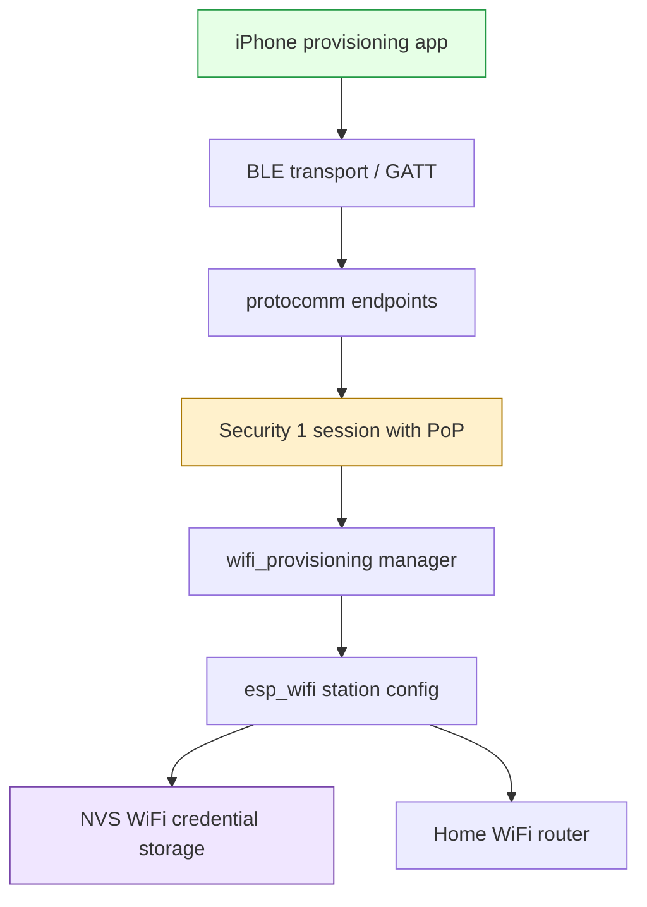
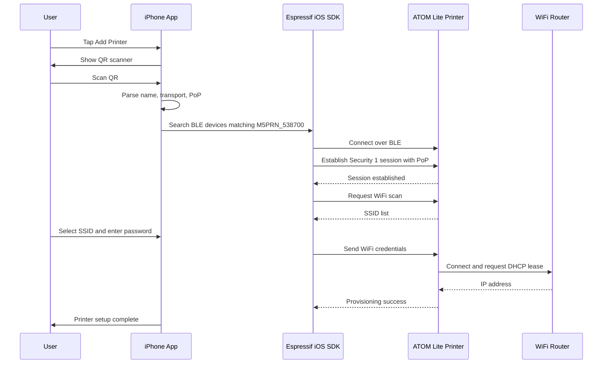
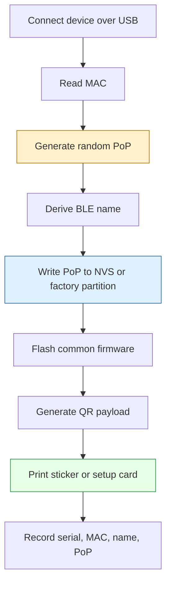

# ATOM Lite ESP-IDF Provisioning: From FTDI Flashing to BLE WiFi Setup

This report explains the ATOM Lite ESP-IDF provisioning project for the M5Stack ATOM Thermal Printer Kit. It is both a project narrative and a small textbook chapter: it explains why the firmware exists, how the ESP-IDF provisioning stack fits together, what happened during flashing and validation, and what must change before this becomes a polished real-world iPhone setup flow.

> [!summary]
> - The M5Stack ATOM Thermal Printer Kit is controlled by an **ATOM Lite / ESP32-PICO-D4**, not an ATOMS3R. That means the correct ESP-IDF target is `esp32`, and the correct host interface is the FTDI UART bridge on `/dev/ttyUSB0`.
> - The new firmware under `0092-m5-printer-esp-idf-provision` boots under ESP-IDF 5.4.1, starts Espressif BLE WiFi provisioning, advertises as `M5PRN_538700`, and was successfully provisioned from a phone.
> - The development PoP `12345678` proves the path works, but production needs a unique per-device PoP, usually delivered through a QR code scanned by the iPhone app.
> - The current firmware still has a post-provisioning watchdog issue, so the project is functional enough for architecture validation but not yet product-ready.

---

## 1. Why This Project Exists

WiFi provisioning is the first real interaction a user has with an IoT device. If that interaction is clumsy, the rest of the product feels fragile before it has done anything useful. The original M5Stack ATOM Printer firmware follows a common early IoT pattern: the device creates its own WiFi access point, the user joins that access point from a phone, opens a web page, enters home WiFi credentials, and then switches the phone back to the normal network.

That works, but it is especially awkward on iPhone. iOS does not give ordinary apps the freedom to silently switch WiFi networks. The user leaves the app, enters Settings, chooses the printer's temporary AP, returns to the browser or app, submits credentials, and then manually returns to the home network. Every step is a place for confusion.

BLE provisioning changes the shape of the problem. The phone can remain on home WiFi while it talks to the printer over Bluetooth Low Energy. The device does not have to host a captive portal. The app does not have to ask the user to perform network gymnastics. The setup becomes a direct conversation between the phone and the printer:

```text
Phone ──BLE──> Printer: here are WiFi credentials
Printer ─WiFi─> Router: connect me to the network
Printer ──BLE──> Phone: success, my IP is 192.168.1.42
```

The goal of this project was to build that path using native ESP-IDF on the actual printer hardware.

---

## 2. Correcting the Hardware Assumption

The project began with a mistaken premise: an earlier firmware tree targeted ATOMS3R. That was the wrong board family. The M5Stack ATOM Thermal Printer Kit uses an ATOM Lite controller, and the ATOM Lite is based on the ESP32-PICO-D4.

This distinction is not cosmetic. It changes the target, the USB interface, and some debugging assumptions.

| Question | ATOMS3R | ATOM Lite printer controller |
| --- | --- | --- |
| MCU family | ESP32-S3 | ESP32 / ESP32-PICO-D4 |
| ESP-IDF target | `esp32s3` | `esp32` |
| USB style | Native USB Serial/JTAG on many S3 boards | FTDI USB-UART bridge |
| Typical port | `/dev/ttyACM*` or USB-JTAG path | `/dev/ttyUSB0` |
| Boot/debug assumption | USB Serial/JTAG may exist | UART bootloader flashing |
| Printer kit match | No | Yes |

The Linux kernel log made the truth visible:

```text
idVendor=0403, idProduct=6001
Product: M5stack
Manufacturer: Hades2001
Detected FT2232C/D
FTDI USB Serial Device converter now attached to ttyUSB0
```

That is not a problem. It is exactly what an ATOM Lite looks like from the host: a USB-C connector wired to an FTDI USB-serial bridge, which talks to the ESP32 UART bootloader. `idf.py flash monitor` is the right workflow.

The correct mental model is:


The second-stage ESP-IDF bootloader is not involved until after flashing succeeds. The immutable ROM bootloader is what accepts the initial serial connection.

---

## 3. The Firmware We Built

The firmware lives at:

```text
/home/manuel/workspaces/2025-12-21/echo-base-documentation/esp32-s3-m5/0092-m5-printer-esp-idf-provision/source/atomlite-printer-prov
```

It is a standalone ESP-IDF project. The repository-local environment is defined by:

```bash
source /home/manuel/workspaces/2025-12-21/echo-base-documentation/esp32-s3-m5/.envrc
```

which in turn loads ESP-IDF 5.4.1:

```bash
source ~/esp/esp-idf-5.4.1/export.sh
```

The core files are deliberately small:

| File | Role |
| --- | --- |
| `CMakeLists.txt` | Top-level ESP-IDF project definition. |
| `sdkconfig.defaults` | ESP32 target assumptions: 4MB flash, NimBLE BLE provisioning, UART console. |
| `partitions.csv` | Custom app partition large enough for BLE/WiFi provisioning firmware. |
| `main/main.c` | Boot, event handlers, provisioning manager, WiFi lifecycle, reset task. |
| `main/app_printer.c` | UART2 thermal printer helpers. |
| `main/app_button.c` | GPIO39 active-low hold detection. |

The firmware currently does five things:

1. Initializes NVS, networking, WiFi, event loop, button, and printer UART.
2. Asks ESP-IDF whether WiFi credentials already exist.
3. If not provisioned, starts BLE provisioning using `wifi_provisioning` over BLE.
4. If provisioned, starts station mode and reconnects to WiFi.
5. Prints a short status receipt when it obtains an IP address.

The important code path can be summarized as pseudocode:

```c
app_main() {
    nvs_flash_init();
    esp_netif_init();
    esp_event_loop_create_default();

    app_button_init();
    app_printer_init();

    esp_netif_create_default_wifi_sta();
    esp_wifi_init();

    wifi_prov_mgr_init(ble_scheme);

    if (wifi_prov_mgr_is_provisioned()) {
        wifi_prov_mgr_deinit();
        start_wifi_station();
    } else {
        service_name = make_name_from_mac();
        wifi_prov_mgr_start_provisioning(
            WIFI_PROV_SECURITY_1,
            pop,
            service_name,
            NULL
        );
    }

    wait_for_wifi_events_and_print_status();
}
```

That structure matters because `wifi_prov_mgr` already knows where ESP-IDF stores WiFi credentials. The firmware does not need to invent a parallel `provisioned` flag. It asks the provisioning manager whether credentials exist, and then either starts provisioning or station mode.

---

## 4. ESP-IDF Provisioning: The Mental Model

Espressif's provisioning framework is a layered system. The user sees a phone app and a device name. The firmware sees a provisioning manager. Underneath that are BLE GATT characteristics, protobuf messages, and a secure session protocol.

The stack looks like this:



Each layer has a distinct responsibility:

- BLE carries bytes between the phone and the ESP32.
- Protocomm gives those bytes endpoint names and request/response structure.
- Security 1 uses the PoP to establish a protected session.
- The provisioning manager interprets messages as WiFi actions: scan, set credentials, report state.
- The WiFi driver stores credentials and connects to the access point.

This is why using Espressif's iOS SDK is attractive. If you write your own CoreBluetooth implementation from scratch, you inherit every layer below the app: protobuf encoding, endpoint discovery, Security 1, error handling, and state polling. The product does not become better because your app reimplemented protocomm. It becomes better because setup is reliable.

---

## 5. The First Successful Boot

After flashing at a reliable baud rate, the monitor showed the firmware booting from the expected factory partition:

```text
I boot: ESP-IDF v5.4.1 2nd stage bootloader
I boot.esp32: SPI Flash Size : 4MB
I boot: Partition Table:
I boot:  0 nvs       WiFi data     00009000 00006000
I boot:  1 phy_init  RF data       0000f000 00001000
I boot:  2 factory   factory app   00010000 00180000
I app_init: Project name: atomlite-printer-prov
I app_init: ESP-IDF:      v5.4.1
```

Then the application initialized the printer UART:

```text
I printer: ATOM printer UART2 ready: TX=23 RX=33 baud=9600
```

That line is easy to overlook, but it is a major milestone. UART0 belongs to the host monitor. UART2 belongs to the printer. Keeping those separate prevents logs and printer bytes from corrupting each other.

The provisioning manager then started BLE provisioning:

```text
I wifi_prov_mgr: Provisioning started with service name : M5PRN_538700
I atomlite-prov: BLE provisioning started
I atomlite-prov: Provision with Espressif's 'ESP BLE Provisioning' app:
I atomlite-prov:   Transport : BLE
I atomlite-prov:   Device    : M5PRN_538700
I atomlite-prov:   Security  : Security 1
I atomlite-prov:   PoP       : 12345678
I NimBLE: GAP procedure initiated: advertise;
```

At this point the printer is no longer just booting firmware. It is advertising as a provisioning target. The phone can find it.

---

## 6. Flashing: Why 115200 Worked

The first flash attempt failed at `460800` baud with:

```text
A fatal error occurred: Unable to verify flash chip connection (No serial data received.).
```

The important part of the log came before the failure:

```text
Chip is ESP32-PICO-D4 (revision v1.1)
Uploading stub...
Running stub...
Stub running...
Changing baud rate to 460800
Changed.
```

That sequence proves the ROM downloader was working. The chip entered download mode, accepted the esptool stub, and started running it. The failure happened after the baud-rate switch, when esptool expected stable communication with the RAM stub.

The fix was to flash more conservatively:

```bash
idf.py -p /dev/ttyUSB0 -b 115200 flash monitor
```

This worked. The lesson is not that the ESP32-PICO-D4 cannot write flash quickly. The embedded flash can write much faster than a 115200-baud UART stream can feed it. The bottleneck was the serial path:

```text
host USB controller → cable → FTDI bridge → ESP32 UART → esptool stub
```

At higher baud rates, that path has less timing margin. A different USB port and a lower baud rate made the path reliable. For future iterations, `app-flash` at `230400` may be a good compromise:

```bash
idf.py -p /dev/ttyUSB0 -b 230400 app-flash monitor
```

`app-flash` is faster because it writes only the app partition after the bootloader and partition table are already installed.

---

## 7. Proof of Possession: Development vs Product

The firmware currently uses a fixed development PoP:

```c
static const char *PROV_POP = "12345678";
```

That is a useful bring-up choice. It lets the developer see the entire flow, manually type the code, and compare logs against the phone app. It should not ship.

A production PoP is a per-device secret. It answers the question: does the person configuring this printer physically possess the printer or its packaging? BLE advertisements are public. A phone nearby can see `M5PRN_538700`. The PoP is what prevents a random nearby user from claiming the printer during setup.

A production PoP should be random:

```text
K7P93QX2
AB92KQ7PZ4
```

It should not be the MAC address, the last six digits of the MAC address, a model-wide password, or a predictable serial number. Those are identifiers, not secrets.

The manufacturing invariant is simple:

```text
firmware PoP == printed/setup-card QR PoP == backend record PoP
```

If those three disagree, setup fails or support becomes painful.

---

## 8. QR Codes: The Right User Interface for PoP

Users should not type PoPs unless they have to. A QR code can carry the BLE device name and PoP together:

```json
{"ver":"v1","name":"M5PRN_538700","pop":"K7P93QX2","transport":"ble"}
```

This turns a protocol handshake into a product interaction:

```text
Scan the setup code on your printer.
```

The QR code can be placed on a sticker, a setup card, the bottom of the device, or inside the paper bay. Because this product is a printer, there is also a uniquely nice option: print a setup receipt. A first implementation can print text. A later implementation can print an actual QR code using ESC/POS QR commands.

A polished setup receipt might look like:

```text
M5 Printer Setup

Scan this code in the app:
[ QR code ]

Device: M5PRN_538700
```

The QR becomes the bridge between physical possession and cryptographic provisioning. The app does not need to ask the user what Security 1 means. It parses the payload and uses the PoP internally.

---

## 9. Smooth iPhone Provisioning

The best iPhone flow is short:

```text
Add Printer → Scan QR → Choose WiFi → Enter Password → Done
```

Under the hood, the app does more work:



The app should use Espressif's iOS provisioning SDK:

```text
https://github.com/espressif/esp-idf-provisioning-ios
```

The SDK exists so the app can avoid implementing protocomm, protobufs, BLE endpoint mapping, and Security 1. The app's job is product experience: QR scan, device matching, WiFi selection, error messages, and success confirmation.

There is one iOS-specific constraint: the app generally cannot read the user's saved WiFi password. It may or may not be able to infer the current SSID depending on entitlements and permissions. A robust app should ask for the password and can show a WiFi scan list obtained from the ESP32 itself.

Good error states matter:

| Failure | Good user message | Bad user message |
| --- | --- | --- |
| PoP mismatch | `This setup code does not match that printer.` | `Security failed.` |
| Wrong WiFi password | `The WiFi password was not accepted.` | `Provisioning failed.` |
| AP not found | `The printer cannot see that WiFi network.` | `STA fail reason 1.` |
| BLE lost | `Move closer to the printer and try again.` | `GATT error.` |

A smooth setup flow is not just the happy path. It is the ability to recover from predictable failures without making the user start over.

---

## 10. Manufacturing the Secret

A small-batch manufacturing process can be simple:



A simple PoP generator:

```bash
python3 - <<'PY'
import secrets, string
alphabet = string.ascii_uppercase + string.digits
print(''.join(secrets.choice(alphabet) for _ in range(10)))
PY
```

The firmware needs a storage strategy. There are three choices:

| Strategy | Good for | Tradeoff |
| --- | --- | --- |
| Compile-time header | One-off prototypes | One binary per device. |
| Regular NVS key | Small batches | Needs a write-NVS manufacturing step. |
| Manufacturing partition | Productized devices | More up-front tooling, cleaner separation. |

For this project, regular NVS is the likely next step. The firmware can read `factory/prov_pop` on boot. If it is missing in a development build, use `12345678`. If it is missing in a production build, refuse provisioning and print a manufacturing error.

---

## 11. Current Validation State

The project has crossed several important milestones:

```text
ESP-IDF 5.4.1 build               ✅
Flash at 115200 over FTDI UART     ✅
Boot on ESP32-PICO-D4              ✅
Printer UART2 init                 ✅
BLE provisioning advertisement     ✅
Phone provisioning                 ✅ user-reported
Production PoP design              ✅ documented
Custom iPhone app design           ✅ documented
Post-provisioning stability         ⚠️ watchdog issue observed
```

The watchdog issue appeared in the tmux monitor after provisioning:

```text
E task_wdt: Task watchdog got triggered.
E task_wdt:  - IDLE0 (CPU 0)
E task_wdt: CPU 0: main
Backtrace ... xEventGroupWaitBits ... app_main ... main.c:239
```

This does not invalidate the provisioning architecture. It does mean the firmware's post-provisioning loop needs cleanup. The main task appears to be spending enough time in the event wait path on CPU0 that the idle task watchdog complains. The fix should be handled as a firmware task, not hidden in the app design.

A likely direction is to move the long-lived application loop into a dedicated task that yields cleanly, or to restructure the event wait so `app_main` does not monopolize CPU0. The system should be quiet after provisioning. A product cannot ask support engineers to ignore watchdog spam.

---

## 12. Lessons Learned

The most important lesson is that board identity comes first. ATOMS3R and ATOM Lite are both M5Stack devices, but they imply different ESP-IDF targets and different host I/O paths. The wrong target can lead to hours of chasing the wrong kind of bootloader problem.

The second lesson is that a successful flash failure can still be useful. The original `460800` failure looked alarming, but the log proved that the ROM bootloader and esptool stub were working. Lowering the baud to `115200` converted an unreliable transport into a reliable one. Once bootloader and partition table are installed, `app-flash` can reduce iteration time.

The third lesson is that provisioning is as much a product design problem as a firmware problem. Security 1 with a fixed PoP is a firmware feature. Security 1 with a per-device QR code, an iPhone app, useful error messages, and a recovery path is a product experience.

---

## 13. Near-Term Next Steps

1. **Fix the watchdog issue.** The firmware should remain quiet after provisioning and after reconnecting with stored credentials.
2. **Validate reboot persistence.** After provisioning, reset the device and confirm it starts station mode instead of provisioning mode.
3. **Validate button reset.** Hold GPIO39 button for five seconds and confirm NVS erase returns the device to provisioning mode.
4. **Add per-device PoP storage.** Implement NVS or manufacturing partition lookup for `prov_pop`.
5. **Stop logging PoP in production mode.** Keep development logs behind a compile-time flag.
6. **Define QR payload and label generation.** Make the manufacturing artifact explicit.
7. **Prototype iPhone app flow.** Use Espressif's provisioning SDK and implement QR-driven exact-device onboarding.
8. **Add printer-native setup output.** Print setup or success receipts as part of the provisioning lifecycle.

---

## 14. Related Project Artifacts

Repo directory:

```text
/home/manuel/workspaces/2025-12-21/echo-base-documentation/esp32-s3-m5/0092-m5-printer-esp-idf-provision
```

Firmware directory:

```text
/home/manuel/workspaces/2025-12-21/echo-base-documentation/esp32-s3-m5/0092-m5-printer-esp-idf-provision/source/atomlite-printer-prov
```

Docmgr ticket:

```text
/home/manuel/workspaces/2025-12-21/echo-base-documentation/esp32-s3-m5/ttmp/2026/04/23/ATOMLITE-PRINTER-PROV--atom-lite-esp-idf-ble-provisioning-firmware-for-m5-printer
```

Key ticket documents:

- Implementation guide: `design-doc/01-implementation-guide.md`
- Production PoP and iPhone provisioning analysis: `analysis/01-production-pop-and-iphone-provisioning-analysis.md`
- Diary: `reference/01-diary.md`
- Tasks: `tasks.md`

Key commits:

```text
2b74d824e25c9ab59ecaf8cab7bfcdb6a14589e7
Add ATOM Lite printer ESP-IDF provisioning firmware

c5649f3e0a67ce27fc4c2baf83a7bec15cfbe1e0
Diary: record ATOM Lite provisioning implementation

52822dc0704e3f65d8e9c6acb56cbc9a07a7d1e0
Use repo ESP-IDF 5.4.1 env for ATOM Lite provisioning
```

---

## 15. Closing

The project now has the right foundation. It targets the right chip, uses the right ESP-IDF environment, flashes through the right serial path, and exercises the official Espressif provisioning architecture rather than a custom BLE characteristic protocol. The device has been seen advertising, and provisioning has been performed.

The remaining work is the difference between a working lab firmware and a product setup experience. That work is not mysterious: unique per-device PoPs, QR onboarding, a small iPhone app built on Espressif's SDK, stable post-provisioning firmware behavior, and printer-specific setup feedback. The architecture supports all of it. The next phase is to harden it.
