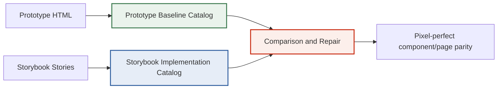
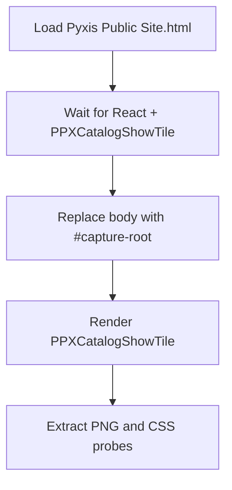
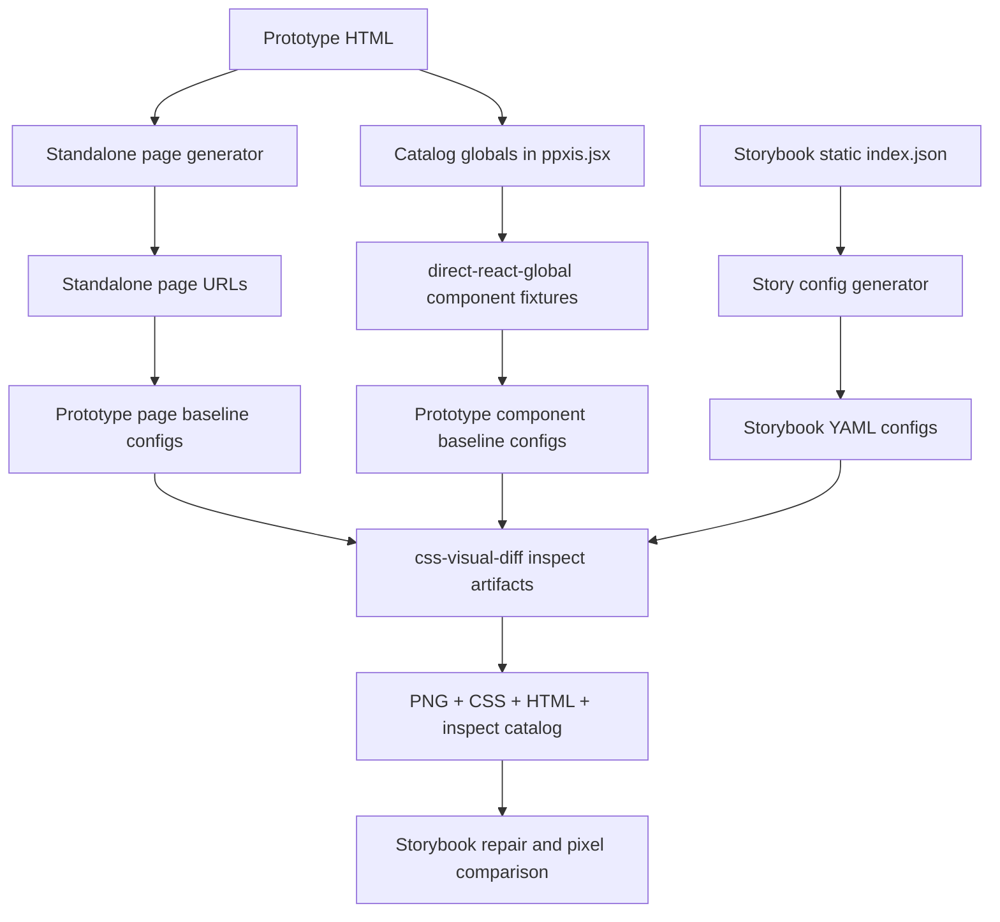

# Pyxis Baseline Element Extraction and Visual Catalogs

This report explains the work done to turn the Pyxis prototype into a usable visual baseline: not just a set of screenshots, but a catalog of pages, components, CSS evidence, prepared HTML, and repeatable `css-visual-diff` YAML configs. The aim is to make pixel-perfect Storybook work teachable. A future developer should be able to read this note and understand why the catalog exists, what counts as a trustworthy baseline, and how the extraction system is shaped.

The work lives primarily in:

```text
/home/manuel/code/wesen/2026-04-23--pyxis
```

The active ticket is:

```text
ttmp/2026/04/23/PYXIS-STORYBOOK-CATALOG--build-storybook-screenshot-and-css-catalog-for-atoms-molecules-and-public-components/
```

The comparison tool source is:

```text
/home/manuel/workspaces/2026-04-21/hair-v2/css-visual-diff
```

> [!summary]
> - The baseline must come from the prototype, not from Storybook. Storybook is the implementation catalog; the prototype is the measuring stick.
> - A screenshot alone is not enough. Each baseline element needs PNG, computed CSS, prepared HTML, inspect JSON, and a stable YAML config that can be rerun.
> - The safest extraction path is to bypass the design canvas: either render a prototype global directly with `direct-react-global`, or use a standalone HTML page that already renders a single page/root.
> - Sample-first extraction is essential. Run two or three targets, inspect the PNGs with the `read` image tool, then expand. Do not start with a full catalog run while selectors are still uncertain.

## Why this work exists

Frontend parity is often discussed as if the problem were subjective: the implementation “looks close” or “feels off.” That language is useful during design review, but it is not enough for repair. An engineer needs a smaller and more exact question: which thing differs, in which pixels, and because of which CSS values?

The Pyxis prototype made this question harder than usual. The original HTML files were not simple pages. They were design canvases: one browser page containing multiple artboards, panning transforms, canvas labels, and wrapper chrome. A normal screenshot of that browser page could have the right dimensions and still be the wrong artifact. It might include the canvas instead of the product, or crop the wrong artboard, or preserve a transformed viewport that never appears in the final site.

The baseline catalog solves this problem by making the prototype explicit. Instead of treating “whatever the browser shows after loading the HTML file” as the truth, the catalog says: load the HTML, prepare a clean render target, render exactly the page or component we care about, and then extract a bundle of evidence.

That bundle becomes the source of truth for Storybook repair.

## The core mental model

The work has two catalogs, not one.



The prototype baseline catalog answers: **What did the design intend?**

The Storybook implementation catalog answers: **What does the React implementation currently render?**

The comparison workflow answers: **What must change to make the implementation match the baseline?**

This separation matters. If we only catalog Storybook, we have a beautiful inventory of the current implementation but no standard to judge it against. If we only catalog prototype screenshots, we have a visual target but no systematic way to repair the implementation. The two catalogs are useful because they meet in the middle.

## What counts as a baseline element

A baseline element is not necessarily a React component. It is a visual unit that the implementation must reproduce. Sometimes that unit is an atom, such as a button or badge. Sometimes it is a molecule, such as a show tile. Sometimes it is a page section, such as a navigation bar or poster grid. Sometimes it is a full page.

For Pyxis, the baseline element vocabulary currently includes:

| Category | Examples |
|---|---|
| Foundations | colors, typography, badges, buttons, form fields, stats, icon grid, empty state |
| Public atoms/molecules | poster, show tile, ticket pill, page header, nav, footer |
| Public pages | Shows, Show Detail, Archive, Book us, About |
| Mobile variants | Shows mobile, Detail mobile, Archive mobile, Book mobile, About mobile |

The important decision is not whether a unit has a perfect Atomic Design name. The important decision is whether it is a stable unit of comparison. If a unit has its own visual rules and will be repaired independently, it deserves a baseline entry.

## The artifact bundle

Every useful baseline target should produce the same family of artifacts:

```text
screenshot.png
computed-css.md
computed-css.json
prepared.html
inspect.json
metadata.json
```

Each file answers a different question.

| Artifact | Question it answers |
|---|---|
| `screenshot.png` | What did the browser paint? |
| `computed-css.md` | What CSS values did the browser compute? |
| `computed-css.json` | What CSS evidence can scripts consume later? |
| `prepared.html` | What DOM existed after preparation? |
| `inspect.json` | What are the bounds, attributes, children, and computed details? |
| `metadata.json` | Which URL, selector, viewport, and target produced this artifact? |

A baseline screenshot without computed CSS is visually useful but operationally weak. A computed CSS table without a screenshot can be technically correct and still point at the wrong element. The bundle is what makes the evidence trustworthy.

## Why YAML configs are part of the system

The `.css-visual-diff.yml` file is not an implementation detail. It is the recipe that makes the baseline reproducible. It records:

- the URL to load,
- the viewport,
- the preparation hook,
- the root selector,
- the screenshot/style probes,
- the CSS properties to inspect,
- the output policy.

A one-off shell command can produce a screenshot. A YAML config can produce the same screenshot next week, on a different machine, after the implementation has changed.

The current prototype configs live under:

```text
ttmp/2026/04/23/PYXIS-STORYBOOK-CATALOG--.../sources/prototype-configs/
ttmp/2026/04/23/PYXIS-STORYBOOK-CATALOG--.../sources/prototype-configs/public-components/
```

The current Storybook configs live under:

```text
ttmp/2026/04/23/PYXIS-STORYBOOK-CATALOG--.../sources/story-configs/
```

Those YAML files are source-like artifacts. They should be committed. The generated PNG/CSS bundles are reproducible and can be large; those are ignored.

## The two extraction paths

There are now two good ways to extract baselines from prototype HTML.

### Path 1: prepare a component from a browser global

This is the most precise path for atoms and molecules. The prototype exposes a component on `window`, and `css-visual-diff` renders it directly into a clean root.

Example mental model:



The YAML shape looks like this:

```yaml
prepare:
  type: direct-react-global
  wait_for: "window.React && window.ReactDOM && window.PPXCatalogShowTile"
  component: PPXCatalogShowTile
  root_selector: "#capture-root"
  props: { index: 0, compact: false, width: 270 }
  width: 270
  background: "#FFFFFF"
  after_wait_ms: 250
```

This is how the new public component fixtures work.

### Path 2: open a standalone HTML page

This is better for full pages. Instead of loading the design canvas and preparing it, we generate a clean standalone HTML entrypoint such as:

```text
prototype-design/standalone/public/shows.html
prototype-design/standalone/public/detail.html
prototype-design/standalone/foundations/system.html
```

Then a config can simply point at the page:

```yaml
original:
  url: "http://localhost:7070/standalone/public/shows.html"
  wait_ms: 1000
  viewport: { width: 1000, height: 1600 }
  root_selector: "#root"
```

Standalone pages are not fully self-contained bundles; they still load shared prototype scripts. But they are standalone entrypoints: each file renders one intended page/root without DesignCanvas.

## Public-site prototype globals

A key step was adding catalog-only globals to:

```text
prototype-design/screens/ppxis.jsx
```

The original page-level exports were:

```text
PPXDesktop
PPXMobile
PPXShell
P_SHOWS
```

Those are good for page capture, but awkward for small element capture. The catalog now also exposes raw public-site pieces and fixture wrappers:

```text
Poster
PPXNav
PPXFooter
ShowTile
PageHeader
PPXCatalogFrame
PPXCatalogPoster
PPXCatalogShowTile
PPXCatalogNav
PPXCatalogFooter
PPXCatalogPageHeader
PPXCatalogShowGrid
```

The wrappers are important because raw components often need props that are inconvenient in YAML. For example, `ShowTile` wants a show object and a click handler. The wrapper hides that complexity:

```jsx
function PPXCatalogShowTile({ index = 0, compact = false, width }) {
  const show = P_SHOWS[index] || P_SHOWS[0];
  const w = width || (compact ? 354 : 270);
  return (
    <PPXCatalogFrame width={w}>
      <div data-catalog="show-tile" style={{ width: w }}>
        <ShowTile show={show} compact={compact} onClick={() => {}} />
      </div>
    </PPXCatalogFrame>
  );
}
```

Now the YAML can pass plain JSON:

```yaml
props: { index: 0, compact: false, width: 270 }
```

and the selectors can use stable catalog roots:

```css
[data-catalog='show-tile'] > div
[data-catalog='show-tile'] > div button
[data-catalog='poster'] > div
[data-catalog='nav'] header
```

This is much better than selectors that depend on the page grid structure.

## Standalone pages

Another step was generating standalone HTML pages under:

```text
prototype-design/standalone/
```

The public pages are:

```text
prototype-design/standalone/public/shows.html
prototype-design/standalone/public/detail.html
prototype-design/standalone/public/archive.html
prototype-design/standalone/public/book.html
prototype-design/standalone/public/about.html
prototype-design/standalone/public/shows-mobile.html
prototype-design/standalone/public/detail-mobile.html
prototype-design/standalone/public/archive-mobile.html
prototype-design/standalone/public/book-mobile.html
prototype-design/standalone/public/about-mobile.html
```

The foundations page is:

```text
prototype-design/standalone/foundations/system.html
```

These are generated by ticket scripts:

```text
ttmp/2026/04/23/PYXIS-STORYBOOK-CATALOG--.../scripts/09-generate-standalone-public-html.mjs
ttmp/2026/04/23/PYXIS-STORYBOOK-CATALOG--.../scripts/10-generate-standalone-foundations-html.mjs
```

The practical value is simple: for page-level baseline extraction, a clean URL is easier to reason about than a design canvas plus a prepare hook. The standalone pages do not replace component fixtures; they complement them.

## Storybook-side extraction

The Storybook implementation catalog is generated from the built Storybook `index.json`:

```text
web/packages/pyxis-components/storybook-static/index.json
```

A script reads that story inventory and generates one YAML config per story:

```text
ttmp/2026/04/23/PYXIS-STORYBOOK-CATALOG--.../scripts/01-generate-story-catalog-configs.mjs
```

It currently discovers 72 stories across:

- Atoms,
- Molecules,
- Public components.

Each Storybook config has two probes:

1. `story-root`, the padded Storybook render frame.
2. `component-focus`, the first meaningful descendant such as `data-part`, `button`, `input`, `nav`, `section`, or similar.

The runner uses:

```bash
css-visual-diff inspect --config "$config" --side react --all-styles --out "$out_base"
```

The `--all-styles` detail matters. An earlier runner loaded each story twice, once for each probe. That was correct but slow. `--all-styles` loads once and writes both probe bundles.

## The sample-first rule

This workflow has one rule that prevents wasted time:

> Never run the full catalog while selectors are still being authored.

Run a small sample first. For Storybook, the runner supports:

```bash
LIMIT=3 scripts/02-run-story-catalog-inspect.sh
STORY_GREP=Button LIMIT=2 scripts/02-run-story-catalog-inspect.sh
```

For prototype components, use:

```bash
scripts/08-run-prototype-public-component-sample.sh
```

That sample extracts:

- poster redroom,
- show tile redroom,
- nav desktop.

This rule is not about saving only a few seconds. It is about avoiding misleading artifacts. If one selector is wrong, a full run produces a large pile of evidence that looks complete but is actually unstable.

## A real failure mode: selector hangs

During the component fixture work, `poster-redroom` succeeded, but `show-tile-redroom` hung long enough to hit the command timeout. The cause was a selector that did not match the actual wrapper depth.

The bad selector assumed this structure:

```css
[data-catalog='show-tile'] > div:nth-child(2) > div:first-child
```

The actual structure had one more wrapper:

```css
[data-catalog='show-tile'] > div > div:nth-child(2) > div:first-child
```

The fix was to inspect the partial `prepared.html`, count the DOM depth, update the selector, and rerun only the failing config.

This failure produced a useful working rule:

> A selector should be trusted only after the PNG crop and `prepared.html` both show the intended element.

The sample runner now uses `timeout 90s` so a missing selector does not waste the whole session.

## Why `read` image inspection matters

The catalog workflow deliberately uses the `read` image tool for sample validation. This is not a cosmetic preference. Visual extraction can fail in ways that still produce valid files:

- the crop can include too much whitespace,
- the selector can point at a wrapper,
- the image can include page chrome,
- fonts can fail to load,
- the target can be clipped,
- a page can render but not the page you intended.

File existence is not validation. Dimensions are not validation. The human needs to look at the sample PNGs.

The verified sample images included:

```text
poster-redroom/poster/screenshot.png
show-tile-redroom/show-tile/screenshot.png
nav-desktop/nav/screenshot.png
standalone public shows nav
standalone public shows first show tile
standalone foundations primary button
```

Those checks establish that the extraction path is credible before broadening it.

## How the system fits together

The current moving parts are:



The diagram shows why the workflow is more than screenshots. It is a pipeline from source prototypes and stories into repeatable evidence.

## Important files

The most important prototype sources are:

```text
prototype-design/Pyxis Public Site.html
prototype-design/Pyxis Full App.html
prototype-design/screens/ppxis.jsx
prototype-design/screens/system.jsx
prototype-design/lib/components.jsx
```

The most important standalone outputs are:

```text
prototype-design/standalone/index.html
prototype-design/standalone/public/index.html
prototype-design/standalone/public/shows.html
prototype-design/standalone/public/detail.html
prototype-design/standalone/public/archive.html
prototype-design/standalone/public/book.html
prototype-design/standalone/public/about.html
prototype-design/standalone/foundations/system.html
```

The most important ticket scripts are:

```text
scripts/01-generate-story-catalog-configs.mjs
scripts/02-run-story-catalog-inspect.sh
scripts/03-build-story-catalog-index.mjs
scripts/06-run-prototype-baseline-sample.sh
scripts/08-run-prototype-public-component-sample.sh
scripts/09-generate-standalone-public-html.mjs
scripts/10-generate-standalone-foundations-html.mjs
```

The most important playbook is:

```text
playbooks/02-html-prototype-baseline-extraction-playbook.md
```

## The implementation sequence

The project evolved in a sensible order.

1. **Read the `css-visual-diff` story config authoring guidance.** This established the inspect-first loop: prepared HTML, screenshot, CSS probe, then full comparison.
2. **Create the catalog ticket.** This gave scripts, configs, diary, changelog, and playbooks a stable home.
3. **Generate Storybook YAML configs.** This produced a complete implementation-side inventory from `storybook-static/index.json`.
4. **Run Storybook extraction.** The first complete extraction produced 72 stories and 144 probe bundles.
5. **Optimize the Storybook runner.** `--all-styles` reduced duplicate page loads.
6. **Pivot to prototype-first baseline extraction.** The prototype, not Storybook, became the source of truth.
7. **Add prototype baseline configs.** Foundations and Public Shows became the first baseline layers.
8. **Expose public component globals.** This made direct component extraction possible for posters, show tiles, nav, footer, page headers, and grids.
9. **Add standalone HTML pages.** This gave each full page a clean URL without DesignCanvas.
10. **Write the baseline extraction playbook.** The workflow became teachable and reproducible.

The sequence is important because it shows a general pattern: first make the tool usable, then make the source of truth explicit, then generate repeatable artifacts, then document the workflow.

## What is solved now

The system now supports:

- prototype page baselines from `Pyxis Public Site.html`,
- Foundations/SystemPage baselines from `Pyxis Full App.html`,
- direct prototype component baselines via `window` globals,
- standalone public page HTML entrypoints,
- standalone Foundations HTML,
- generated Storybook implementation configs,
- Storybook screenshot/CSS extraction,
- sample-first validation scripts,
- ticket-local documentation and diary entries.

This is enough to continue the catalog work without guessing how the previous artifacts were made.

## What is not finished

The baseline catalog is not complete yet.

The next baseline targets are:

- footer desktop/mobile,
- page header,
- show grid desktop/mobile,
- nav mobile,
- all poster variants,
- all public standalone pages,
- page-level comparison configs from standalone prototype pages to Storybook public pages.

The Storybook side also needs careful mapping. For example, a prototype `ShowTile` may not correspond one-to-one to a current Storybook component if the implementation still uses an older public component shape. That is exactly why the baseline catalog exists: it reveals those mismatches before full-page repair.

## Working rules

The durable rules from this work are:

- The prototype baseline comes first. Storybook is judged against it, not the other way around.
- Do not screenshot DesignCanvas unless you are debugging the canvas itself.
- Prefer standalone HTML for full-page extraction and `direct-react-global` fixtures for component extraction.
- Treat YAML configs as source. Treat generated PNG/CSS bundles as reproducible artifacts.
- Inspect `prepared.html` before blaming CSS.
- Inspect PNGs with `read` before trusting dimensions or JSON.
- Run small samples before full catalogs.
- Use `timeout` while authoring selectors.
- Add stable `data-catalog` roots when component-level selectors would otherwise depend on page structure.

## Closing

The most important accomplishment is not that Pyxis now has more screenshots. It is that screenshots have become part of a reproducible evidence system. A baseline element is no longer a picture someone dragged out of a browser. It is a named target, rendered from a known HTML source, prepared by a known hook or standalone entrypoint, inspected with known selectors, and stored with CSS, DOM, and metadata evidence.

That makes the visual work teachable. A future developer can add a new baseline, inspect the crop, compare the computed CSS, and then repair Storybook with a concrete target in hand. The catalog turns “make it match the prototype” from an aesthetic instruction into an engineering loop.
