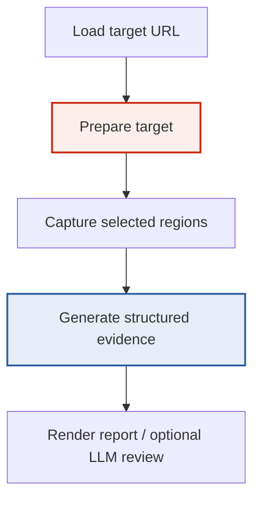
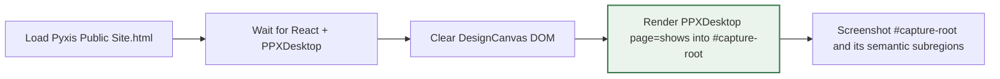

# Building a Visual Diff Workbench for Pyxis with css-visual-diff

This note is a project report on the work done to turn `css-visual-diff` from a promising comparison tool into a practical frontend workbench for Pyxis. The report is written in the style of a technical article rather than a changelog. Its purpose is not merely to say what changed, but to explain why those changes mattered, how the moving parts fit together, and what a future engineer should understand before extending the system.

The reference project for this work lives in two repositories:

- `css-visual-diff`: `/home/manuel/workspaces/2026-04-21/hair-v2/css-visual-diff`
- Pyxis frontend/prototype workspace: `/home/manuel/code/wesen/2026-04-23--pyxis`

> [!summary]
> - The most important conceptual shift was this: the prototype could not be trusted as a normal web page, so the system had to learn how to **prepare** a target before capturing it.
> - The second shift was workflow-related: visual parity work became tractable only after we moved from full-page screenshots to **direct-render prototype extraction**, then to **atom-level Storybook diffs**, and only then back to page-level comparisons.
> - The third shift was interpretive rather than mechanical: the tool now generates not just screenshots, but a layered evidence set — HTML, inspect JSON, computed CSS diffs, pixel diffs, and now optional LLM review — so the human can reason about *why* a difference exists rather than only seeing that one exists.

## Why this work exists

A visual diff tool is easy to oversimplify. At first glance, the problem seems straightforward: open two pages, screenshot both, compare the pixels, and report the delta. That story is appealing because it is compact, but it breaks down as soon as the target is not a clean page. The Pyxis prototype was exactly such a case. The source artifact looked like a website, but it was really a design shell — a canvas containing multiple artboards, panning transforms, and UI chrome that had nothing to do with the intended final public site.

That distinction matters because a visual diff tool is only as trustworthy as its input. If the baseline itself is contaminated — if the screenshot starts at the wrong origin, if the output includes canvas labels, if the footer is clipped off, if the DOM is wrapped in presentation scaffolding — then every subsequent pixel percentage is an illusion. A precise metric over the wrong capture is still wrong.

The work on `css-visual-diff` therefore started from a more fundamental question than “How do we diff two pages?” The real question was: **How do we define a trustworthy render target?** Once that question is asked, the rest of the design follows naturally. The tool needs a notion of target preparation, explicit root selection, structured artifact export, validation, and a workflow that allows humans to audit the capture before they trust the comparison.

## The problem with the original Pyxis prototype

The Pyxis public prototype was stored under:

```text
/home/manuel/code/wesen/2026-04-23--pyxis/prototype-design/
```

The most important files were:

```text
prototype-design/Pyxis Public Site.html
prototype-design/design-canvas.jsx
prototype-design/lib/components.jsx
prototype-design/lib/tokens.js
prototype-design/screens/ppxis.jsx
```

The key observation was that `Pyxis Public Site.html` did not simply render a single page. It rendered a `DesignCanvas` containing multiple artboards, some transformed, some panned, and some clipped by `overflow: hidden`. A naive browser screenshot of that page could have correct dimensions and still be semantically wrong.

This was not an incidental inconvenience. It was the central architectural obstacle.

If a future engineer wants to understand why the `prepare` feature exists, this is the answer. It was not invented as a general abstraction first and then applied to Pyxis. It was demanded by the shape of the prototype itself.

## The conceptual architecture

At a high level, the system evolved into four stages:



This diagram is deceptively simple. The important design move is that **preparation** became a first-class phase rather than an ad hoc hack. Without that phase, the tool is trapped in the worldview that URLs map directly to trustworthy pages. With it, the tool can treat the loaded page as raw material and define the actual thing to be compared.

### The system in one sentence

`css-visual-diff` became a browser-based comparison runner that can transform both sides into trustworthy render targets, capture matching regions, export machine-readable evidence, and summarize differences in both deterministic and natural-language forms.

## The prepare hook: the turning point

The most important implementation addition was the `prepare` hook in config.

The relevant code surfaces include:

```text
internal/cssvisualdiff/config/config.go
internal/cssvisualdiff/modes/prepare.go
internal/cssvisualdiff/modes/capture.go
internal/cssvisualdiff/modes/cssdiff.go
internal/cssvisualdiff/modes/matched_styles.go
```

The configuration schema grew to include:

- `Target.Prepare`
- `Target.RootSelector`
- `PrepareSpec`
- validation for `script` and `direct-react-global`

That last mode, `direct-react-global`, was especially important for Pyxis. It allows the tool to treat a loaded page as a container of global React components and then render a chosen component into a clean root.

In the Pyxis case, the mental model looked like this:



This solved a deep problem elegantly. Rather than trying to reverse-engineer the canvas viewport and crop around it, the tool simply sidestepped the shell and rendered the prototype’s actual page component directly.

That is the sort of design decision worth pausing over. It is the difference between fighting the artifact and cooperating with it. The browser still loads the original prototype, but the comparison does not have to remain hostage to the page’s original shell.

## Why screenshots were not enough

Once direct-render extraction was working, another lesson became unavoidable: screenshots alone are poor debugging artifacts.

A screenshot answers a narrow visual question: “What did the browser paint?” It does not answer:

- Which selector was found?
- Was the wrong DOM subtree captured?
- What were the computed values of the properties that matter?
- Which CSS declaration won in the cascade?
- Was the image blank, clipped, or missing expected text?
- Did the output contain the right semantic content even if the pixels look plausible?

So the tool’s output model expanded. A good capture run now produces a family of artifacts:

```text
capture.json
capture.md
cssdiff.json
cssdiff.md
matched-styles.json
pixeldiff.json
original-prepared.html
react-prepared.html
original-inspect.json
react-inspect.json
test.html
```

Each artifact answers a different class of question.

### What each artifact is for

| Artifact | What it explains |
|---|---|
| `capture.json` | Whether selectors existed, were visible, and what screenshots were taken |
| `capture.md` | Human-readable summary of capture success/failure |
| `cssdiff.json` | Computed property differences between matching selectors |
| `matched-styles.json` | Which rules/declarations won in the cascade |
| `pixeldiff.json` | Quantified image-level change percentages |
| `*-prepared.html` | What DOM actually existed after prepare hooks ran |
| `*-inspect.json` | Recursive structure, layout, and style evidence |
| `test.html` | One browser-entry report that collects the outputs for manual review |

This is one of the deeper lessons of the project. A visual diff workbench should not ask the human reviewer to infer the entire state of the system from PNGs. It should provide enough evidence that the reviewer can move fluidly between painted result, DOM structure, and CSS causality.

## Validation as a first-class concern

The next important addition was validation.

The temptation in browser tooling is to treat success as the absence of a crash. If the screenshot file exists, the run succeeded. But in practice, many of the worst failures are “successful” from the operating system’s perspective. A wrong selector can still produce a PNG. A clipped target can still have the right width. A design canvas shell can still look visually plausible at a glance.

So the tool learned to validate both DOM and PNG structure.

### DOM validation

The config gained section-level text expectations:

- `expect_text.includes`
- `expect_text.excludes`
- per-target variants for original/react

This is how a run can detect, for example, that the prototype unexpectedly contains `01 · Desktop` or that the React side is missing a heading that the comparison expects.

### PNG validation

The config also gained structure-oriented image checks:

- width / height
- minimum / maximum dimensions
- top/bottom strip color expectations
- validation summaries written into JSON and Markdown

This mattered because many bad captures have distinctive color-strip signatures. A clipped canvas or browser shell leaks colors into the top strip that a clean page would never have.

The philosophical point here is worth stating explicitly. Validation is not just defensive programming. It is epistemic hygiene. It is how the tool earns the right to have its own output believed.

## Pyxis as a proving ground

The Pyxis workbench effort grew into three nested workflows.

### 1. Prototype-only validation

Before comparing React to anything, we needed to prove that prototype extraction itself was correct.

This led to the `pyxis-prototype-only.yaml` config and the `06-run-pyxis-prototype-only.sh` script.

That run mirrors the prototype into both target slots. It does **not** exist to tell us anything about parity. It exists to test the extraction pipeline itself.

The important reasoning pattern was:

1. First ask, “Did we extract the prototype correctly?”
2. Only then ask, “How does React differ from it?”

This sounds obvious after the fact, but in practice many teams skip the first question and spend days repairing the wrong thing.

### 2. Atom-level Storybook diffs

Once the tool could extract trustworthy prototype images, the next step was to shrink the comparison scope.

This is where the Storybook atom fixture became essential:

```text
web/packages/pyxis-components/src/atoms/AtomDiffFixture.stories.tsx
```

The corresponding config:

```text
/home/manuel/workspaces/2026-04-21/hair-v2/css-visual-diff/examples/pyxis-atoms-prototype-vs-storybook.yaml
```

This was the moment the workflow became practically useful. Whole-page diffs are emotionally persuasive but analytically noisy. Atom-level diffs, by contrast, reduce the problem to something an engineer can act on immediately.

When the first atom report came back, it did not say vaguely that the design was “off.” It said things like:

- `button-primary` height `33.5938px -> 40px`
- `font-size 13px -> 14px`
- `border-radius 8px -> 0px`
- `input-search` left padding `32px -> 36px`
- `avatar-md` font weight `600 -> 500`

That is a radically better debugging surface.

The atom workflow also taught an important lesson about selector precision. A wrapper selector like `[data-comp='button-primary']` can be visually fine and semantically misleading. Using `[data-comp='button-primary'] button` produces evidence about the real button element rather than its wrapper span. The tool was only as good as the specificity of the question asked of it.

### 3. Storybook page coverage and page-level diffs

After atom parity became good enough, the work expanded back out into pages.

A new Storybook was added for `pyxis-user-site`, with public page coverage for:

- Shows desktop/mobile
- Show detail desktop/mobile
- Archive desktop/mobile
- Book desktop/mobile
- About desktop/mobile

The relevant story file:

```text
web/packages/pyxis-user-site/stories/PublicPages.stories.tsx
```

The first page-level Storybook-vs-prototype comparison config was:

```text
/home/manuel/workspaces/2026-04-21/hair-v2/css-visual-diff/examples/pyxis-storybook-shows-desktop.yaml
```

That run proved something both encouraging and unsurprising. The comparison pipeline itself worked; the remaining gap was now genuinely in the page implementation rather than in the tooling. The nav diff dropped sharply after shell alignment work, but the main content still differed wildly because the React page still used an earlier hero/list structure while the prototype used a poster grid.

That is exactly the kind of transition we wanted. The tooling stopped being the source of ambiguity and became a reliable witness to actual UI drift.

## The report browser: `test.html`

One of the most user-facing improvements was the static HTML report mode that writes both `index.html` and `test.html`.

This sounds mundane, but it solved a human workflow problem. Before that, the artifacts were technically rich but cognitively fragmented. The user had to jump among JSON files, PNGs, and markdown summaries. The report browser turned the artifact set into something navigable by eye.

A future engineer should understand that this was not a cosmetic flourish. It was an ergonomics feature in service of correctness. The more friction there is in inspecting artifacts, the more likely people are to skip inspection and trust the wrong thing.

## The LLM layer: useful, but not sovereign

A later phase added LLM review support.

This work touched:

```text
cmd/css-visual-diff/main.go
internal/cssvisualdiff/llm/bootstrap.go
internal/cssvisualdiff/llm/image_question_client.go
internal/cssvisualdiff/llm/review.go
internal/cssvisualdiff/modes/ai_review.go
```

Two distinct paths emerged.

### `ai-review`

This is the config-driven per-image review mode. It asks an OCR-style question about each captured screenshot independently.

This mode worked mechanically, but on tiny UI crops it could hallucinate. One run described a blue “Add to cart” button when the image was actually the Pyxis `Get tickets` button.

### `llm-review`

This is the comparison-oriented mode. It takes:

- left image,
- right image,
- diff image,
- computed CSS evidence,
- winner-rule evidence,
- and a natural-language question,

then asks the model to explain the discrepancy.

This mode was substantially better because it asked a better question. It did not merely show an isolated image and say “what is this?” It showed a pair and said, in effect, “Compare these, using both the visuals and the structured evidence.”

The Z.ai GLM-5V-Turbo run on `button-primary` was good enough to be useful. It correctly identified border radius regression, typography drift, and size inflation. It was not perfect: it occasionally over-inferred causality and once speculated about Tailwind-style utilities in a non-Tailwind project. But as a triage assistant it was valuable.

### Token usage visibility

A practical improvement followed from this work: token usage is now surfaced directly in `llm-review.md` and printed to stdout. Before that, the data existed in JSON but was too easy to miss.

This matters because visual LLM review can become expensive quickly. Once costs exist, they should be part of the artifact, not a hidden internal detail.

## The deeper design lessons

A good report should not merely enumerate changes. It should state the governing lessons. These are the ones that matter most to carry forward.

### Lesson 1: Prepare hooks are not an edge case; they are the real abstraction

The naive model of browser comparison assumes that URLs are the unit of truth. In practice, they often are not. Targets frequently need to be transformed into comparable render roots. `prepare` is therefore not a workaround. It is the honest expression of the problem.

### Lesson 2: Comparison must move from large to small and back again

The effective workflow was:

```text
prototype-only sanity check
→ atom-level diffs
→ page shell alignment
→ page content comparison
```

That sequence matters. If you start at the full-page level, you can see the pain but not the cause. If you start at the atom level and never return to pages, you can perfect your primitives while still shipping the wrong composition. The workbench succeeds because it allows the engineer to move up and down that scale intentionally.

### Lesson 3: Visual tools need semantic evidence

A screenshot alone is a poor debugging artifact. The tool became valuable when it paired pixels with DOM, CSS, and validation evidence.

### Lesson 4: Static reports are part of the engineering system

People debug through interfaces. `test.html` is not an accessory. It is the interface that makes the artifact graph inspectable.

### Lesson 5: LLMs are interpreters, not judges

The most productive role for the VLM layer is explanatory, not authoritative. It helps compress evidence into a readable hypothesis, but it should never outrank the deterministic artifacts that generated that hypothesis.

## Project shape today

At the time of writing, the system supports:

- target preparation via script or direct-react-global rendering,
- root selector screenshots,
- prepared HTML export,
- inspect JSON export,
- DOM validation,
- PNG structure validation,
- static HTML artifact reports,
- atom-level Storybook diff workflows,
- page-level Storybook diff workflows,
- comparison-oriented LLM review,
- token usage reporting for LLM runs.

The current Pyxis state is especially important because it shows where tooling ends and UI work begins.

### What is now true

- Atom parity is largely solved.
- User-site Storybook now covers the public pages in desktop and mobile forms.
- The first Storybook-vs-prototype page-level diff works.
- Nav and footer shell alignment has begun converging.
- The largest remaining page diffs are due to real implementation differences, especially the Shows page layout.

This is a good sign. A workbench is mature when the next problem is genuinely the product UI, not the measurement apparatus.

## A simplified end-to-end sequence

The following pseudocode captures the workflow that emerged from the project.

```text
function runPyxisParityCheck(pageStory, prototypePage):
    ensurePrototypeServer()
    ensureStorybookOrStaticBundle()

    prototypeTarget = loadPrototypeHTML()
    prototypePrepared = prepareTarget(
        type="direct-react-global",
        component="PPXDesktop",
        props={page: prototypePage},
        root="#capture-root"
    )

    reactTarget = loadStorybookIframe(pageStory)

    capture = captureMatchingSections(
        prototypePrepared,
        reactTarget,
        selectors=[full, nav, main, footer]
    )

    validate(capture)
    cssDiff = computeCSSDiffs(capture)
    pixelDiff = computePixelDiffs(capture)
    report = buildStaticReport(capture, cssDiff, pixelDiff)

    if targetedReviewNeeded:
        llm = runLLMReview(capture, cssDiff, pixelDiff)
        attach(llm, report)

    return report
```

What this pseudocode emphasizes is the sequencing. Capture is not the first meaningful step; preparation is. Reporting is not an optional afterthought; it is a necessary final stage. LLM review is not in the critical path of correctness; it is layered on top of a deterministic foundation.

## Important file references

If someone needs to reacquire the system quickly, these are the files worth reading in order.

### css-visual-diff core

```text
/home/manuel/workspaces/2026-04-21/hair-v2/css-visual-diff/cmd/css-visual-diff/main.go
/home/manuel/workspaces/2026-04-21/hair-v2/css-visual-diff/internal/cssvisualdiff/config/config.go
/home/manuel/workspaces/2026-04-21/hair-v2/css-visual-diff/internal/cssvisualdiff/modes/prepare.go
/home/manuel/workspaces/2026-04-21/hair-v2/css-visual-diff/internal/cssvisualdiff/modes/capture.go
/home/manuel/workspaces/2026-04-21/hair-v2/css-visual-diff/internal/cssvisualdiff/modes/cssdiff.go
/home/manuel/workspaces/2026-04-21/hair-v2/css-visual-diff/internal/cssvisualdiff/modes/matched_styles.go
/home/manuel/workspaces/2026-04-21/hair-v2/css-visual-diff/internal/cssvisualdiff/modes/html_report.go
/home/manuel/workspaces/2026-04-21/hair-v2/css-visual-diff/internal/cssvisualdiff/llm/review.go
```

### Geppetto / Pinocchio support

```text
/home/manuel/workspaces/2026-04-21/hair-v2/geppetto/pkg/inference/engine/factory/factory.go
/home/manuel/workspaces/2026-04-21/hair-v2/geppetto/pkg/steps/ai/openai/helpers.go
/home/manuel/workspaces/2026-04-21/hair-v2/geppetto/pkg/steps/ai/openai/chat_stream.go
/home/manuel/workspaces/2026-04-21/hair-v2/pinocchio/examples/js/profiles/basic.yaml
```

### Pyxis-side artifacts and helpers

```text
/home/manuel/code/wesen/2026-04-23--pyxis/prototype-design/Pyxis Public Site.html
/home/manuel/code/wesen/2026-04-23--pyxis/prototype-design/screens/ppxis.jsx
/home/manuel/code/wesen/2026-04-23--pyxis/web/packages/pyxis-components/src/atoms/AtomDiffFixture.stories.tsx
/home/manuel/code/wesen/2026-04-23--pyxis/web/packages/pyxis-user-site/stories/PublicPages.stories.tsx
/home/manuel/code/wesen/2026-04-23--pyxis/ttmp/2026/04/23/PYXIS-SCREENSHOT-EXTRACTION--pyxis-screenshot-css-extraction-from-prototype-html/scripts/
```

## A compact chronology of important milestones

It is sometimes useful to see the project not as a list of files but as a sequence of ideas.

1. **Initial screenshot attempts failed** because the prototype was a transformed design canvas rather than a clean page.
2. **Direct-render extraction** was added to render `PPXDesktop` / `PPXMobile` directly into a clean root.
3. **Prepare hooks** became config-driven and reusable rather than Pyxis-specific hacks.
4. **Prepared HTML and inspect JSON export** were added so screenshots could be audited against DOM evidence.
5. **Validation** was added so plausible-looking failures could be rejected automatically.
6. **`test.html` report output** made artifact browsing practical.
7. **Atom-level Storybook fixture and diff configs** made frontend parity work tractable.
8. **User-site Storybook coverage** extended the same approach to full public pages.
9. **LLM review support** added an explanatory layer over deterministic diff evidence.
10. **Token usage reporting** made model cost visible and therefore manageable.

Each step solved a different class of failure, and each one made the later steps more meaningful.

## What I would want an intern to remember

If I had to reduce the whole project to a handful of engineering rules, they would be these.

- A visual diff system does not begin with pixels. It begins with the question: *What exactly are we comparing?*
- If the baseline is not trustworthy, nothing downstream is trustworthy.
- Always inspect a prepared target before interpreting a diff percentage.
- Fix atoms before fixing pages. Shared primitives amplify their mistakes across the whole UI.
- Use reports that let humans navigate artifacts easily; otherwise the richest evidence will go unread.
- Treat LLM output as a structured guess, not as ground truth.
- Preserve the workflow as scripts and configs, not as shell history. A parity system only becomes reusable when the path through it is repeatable.

## Closing

The most satisfying thing about the `css-visual-diff` work is that it transformed a vague design-parity ambition into an actual engineering loop. At the beginning, Pyxis had a prototype, a React implementation, and a large gap between them. The gap was visible but not measurable in a trustworthy way. By the end of this phase, the gap is measurable, navigable, scriptable, and increasingly localizable.

That is the real achievement. Not that the UI is finished — it is not — but that the work now happens inside a system that makes progress legible. Once you have such a system, frontend parity stops being mystical. It becomes iterative, evidence-based, and teachable.

And that, more than any individual patch or screenshot, is what the project accomplished.
