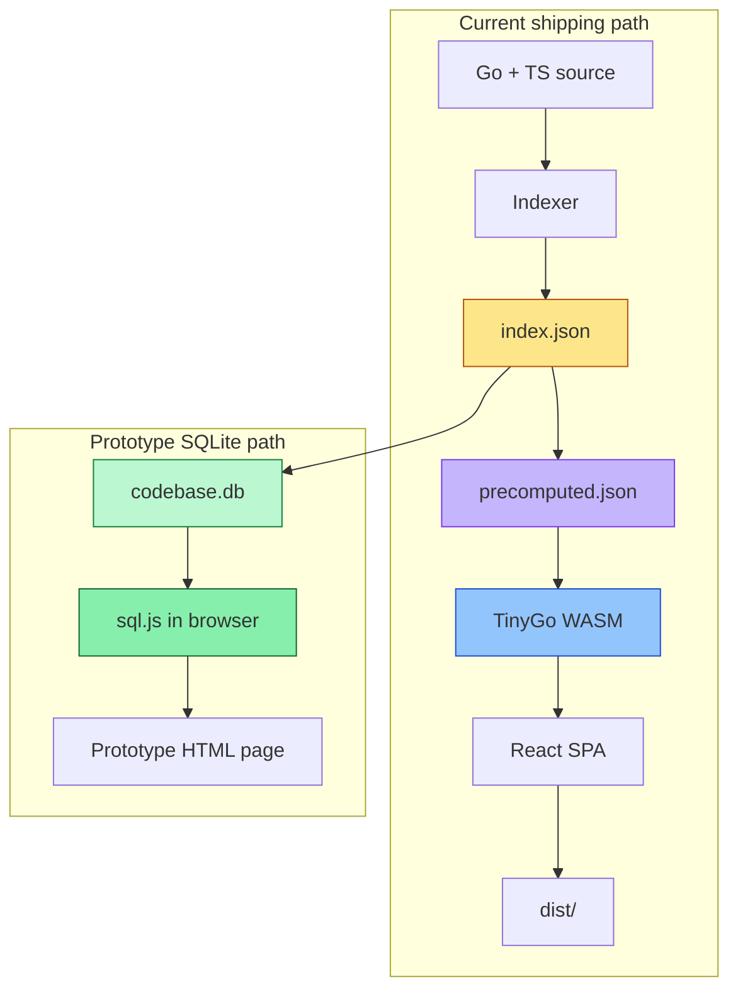

# Codebase Browser — Static WASM Build and SQLite Prototype

This project note covers the current direction of `codebase-browser` after two major pieces of work. First, the browser was turned into a static artifact that can run from `file://` with no server. Second, a standalone prototype proved that the next step — a SQLite-backed index that can be queried from both Go and the browser — is practical.

The important thing to understand is that this is not just a feature addition. It is a change in the shape of the system. The project started as a Go HTTP server that exposed a JSON index through `/api/*` endpoints. It now has a working static delivery mode, and it is moving toward a real relational database model where the browser can ask questions in SQL instead of replaying custom lookup logic.

> [!summary]
> The project currently has three important identities:
> 1. a **static documentation browser** that ships as a directory of files and runs without a server
> 2. a **browser-side query engine** that currently uses TinyGo WASM for lookup logic
> 3. a **SQLite migration path** that replaces hand-rolled JSON indexes with a relational database and FTS5 search

## Why this project exists

The original `codebase-browser` solved a real problem: it let a Go codebase describe itself. The indexer could walk source files, collect symbols, render documentation pages, and serve everything through a browser UI. That was already useful. But the project still depended on a running server, which is a small operational burden and a large distribution burden. If the goal is to share a browsable codebase snapshot, the most natural artifact is a file, not a process.

That insight drove the first half of this work. The server was not really a live service; it was a delivery mechanism for data that already existed at build time. Search, symbol lookup, cross-reference browsing, and doc rendering all came from deterministic code paths over embedded source and index data. That made the project a good candidate for a static artifact.

The second half of the work came from a different observation: the codebase index is relational by nature. Packages contain files. Files contain symbols. Symbols reference symbols. Once you recognize that structure, a JSON blob starts to look like a compromise. SQLite is a better fit for the shape of the data, and it is portable enough to run on both the Go side and the browser side.

## Current project status

The project is in a transitional state, but the transition is now concrete rather than speculative.

What is already working:

- **GCB-006 static build**: the codebase browser can be built into a `dist/` directory and opened directly in a browser.
- **TinyGo-backed browser logic**: the static build currently uses a TinyGo WASM module for symbol lookup and doc-page access.
- **Playwright verification**: the static artifact has been opened in a browser, exercised, and verified end-to-end.
- **GCB-007 design work**: a detailed SQLite architecture note exists in the repo’s ticket workspace.
- **Standalone SQLite + TinyGo prototype**: a separate demo proves that `sql.js` in the browser and TinyGo WASM can cooperate successfully.

What is still evolving:

- the custom WASM module is still part of the shipping artifact
- the SQLite database is currently a prototype and design target, not yet the main codebase-browser data source
- the `internal/sqlite/` package described in the design document still needs to be implemented in the real repo

## The story so far

The story is easier to understand if it is told as a sequence of architectural moves.

### First move: understand the server as a build artifact

The existing Go server was not wrong, but it was more dynamic than it needed to be. The search endpoint did not query a live database. The symbol endpoint did not talk to the network. The doc renderer did not depend on runtime state. The server was a wrapper around data that already existed in the repository.

Once that became clear, the next step was obvious: if the data is known at build time, then the browser should be able to consume it directly.

### Second move: split the runtime from the data

The static build separated three responsibilities that had previously been mixed together:

- **indexing and pre-computation** happen at build time
- **browser interaction** happens in the SPA
- **lookup logic** runs in a small TinyGo WASM module

That arrangement worked because it matched the problem. The browser only needed a way to answer queries over already-known data. It did not need the Go server process itself.

### Third move: test whether SQLite is the better long-term shape

Once the static build worked, the next question became one of data model, not delivery model. The browser could already work without a server. The issue now was whether the custom JSON + WASM approach should be the long-term query engine.

The answer is probably no. The prototype showed that SQLite is a more natural abstraction. The schema is relational. FTS5 gives us search. SQL gives us ad-hoc analysis. And the same database file can be used by the Go side and the browser side.

## Architecture today

At the moment, the project has two parallel shapes:

1. the **shipping static browser**, which uses TinyGo WASM plus precomputed JSON
2. the **prototype SQLite browser**, which uses `sql.js` in the browser and Go on the build side to generate the database

The first is what users can already run. The second is the architecture we are testing before we convert the real codebase-browser.

The diagram matters because it shows the conceptual shift. The current shipping path is still a custom lookup engine layered on JSON. The prototype path is a real database with schema, indices, and full-text search.

## The static WASM build: what it taught us

The static build proved that `codebase-browser` did not fundamentally need a server. The browser UI could be made self-sufficient by moving all deterministic work to build time.

The build now produces a directory that contains:

- the compiled React app
- the source tree snapshot
- a TinyGo WASM module
- precomputed JSON with search and cross-reference data
- the runtime glue needed to initialize the WASM module in the browser

This is the most important practical result of GCB-006: the browser can run as a static artifact and still behave like a real code browser.

The implementation details that mattered most were not the obvious ones. The obvious part was building a SPA. The difficult part was making the browser feel as if it still had a live backend when in fact it had none. That required:

- switching to `HashRouter` so routes work from `file://`
- keeping RTK-Query endpoint names stable while swapping the transport layer
- precomputing doc pages and snippets so the browser never has to inspect source files at runtime
- teaching the bundler how to assemble the final artifact without a server process

## The SQLite prototype: why it is the next shape

The SQLite prototype exists to answer a deeper question: what should the browser query against when the system grows up?

A flat JSON file is enough for simple lookups. It is not enough for questions like:

- show me all exported functions in this package that have no doc comments
- show me the most referenced symbols in the whole repository
- show me all files that reference a symbol named `handleSearch`
- search across symbol names, doc comments, package paths, and signatures with ranking

Those are SQL questions. They are much harder to answer cleanly with custom JavaScript map logic.

The prototype uses three pieces together:

1. **Go** generates a SQLite database from the existing codebase index.
2. **TinyGo WASM** runs in the browser and provides query helpers, schema text, sample data, and formatting.
3. **sql.js** loads the SQLite engine in the browser so the page can create tables, insert rows, and run real SQL queries.

The important point is not the technology list. It is the division of labor:

- Go remains the data producer.
- SQLite becomes the query engine.
- The browser becomes the presentation layer.

That is a cleaner architecture than the current one because it stops pretending the query engine is really a custom search abstraction. It is just SQL, and that is a good thing.

### Prototype layout

The prototype lives in the ticket workspace under `ttmp/2026/04/23/GCB-007--sqlite-codebase-index-query-symbols-files-and-xrefs-with-sql/scripts/`.

The most useful files are:

- `02-sqlite-browser-demo.html` — the standalone browser demo
- `03-build-codebase-db.go` — the Go script that builds a real `codebase.db` from `index.json`
- `04-tinygo-sqlite-wasm/` — the TinyGo WASM module used by the demo

The demo was verified in Playwright. It loads `sql.js`, loads the TinyGo module, populates a database, renders symbol tables, runs searches, and executes suggested SQL queries.

## The most important implementation lessons

### 1. TinyGo is workable, but it is not the point

TinyGo solved the browser WASM part of the static build. It also proved that Go code can still sit in the browser if we need it. But the prototype showed that the real long-term win is not Go-in-the-browser for its own sake. The win is the database shape.

If the data lives in SQLite, the browser no longer needs a custom lookup runtime. The query engine is standard. The schema is inspectable. The same database can be queried from Go or from the browser.

### 2. FTS5 matters

The first prototype attempt exposed a crucial detail: not every SQLite build includes FTS5. That matters because the whole point of the migration is to gain proper search. The prototype had to fall back to `LIKE` when FTS5 was unavailable in the browser build.

That failure was useful. It clarified that FTS5 is not a nice extra. It is a requirement. Any real implementation will need to choose a SQLite build that includes it on both sides.

### 3. The UI should not know about the transport

The existing React UI already has a stable shape. That is an advantage. The UI should keep asking for “index”, “packages”, “symbol”, “xref”, and “doc page” without caring whether the answer comes from HTTP, WASM, or SQL.

That means the migration should change the transport layer, not the UI contract. The user should not feel the architecture shift in the component tree. They should only feel that queries became more powerful.

## Current project status in one sentence

The browser can already run as a static artifact, and we now have a working prototype that proves the next step — SQLite-backed queryable codebase data in the browser — is realistic.

## Important files and notes

The current work is documented in the repo’s ticket workspace:

- `ttmp/2026/04/23/GCB-006--static-wasm-build-pre-render-html-ship-go-search-as-browser-side-module/`
- `ttmp/2026/04/23/GCB-007--sqlite-codebase-index-query-symbols-files-and-xrefs-with-sql/`

The most useful design notes are:

- `design-doc/01-wasm-static-html-architecture-design.md`
- `reference/01-investigation-diary-wasm-static-refactor.md`
- `design-doc/01-sqlite-index-architecture-and-design.md`

If you are trying to understand the project from scratch, read those in that order.

## Open questions

The architecture is clear enough to proceed, but a few questions remain open:

- Should the browser eventually ship only a SQLite database and remove the custom TinyGo lookup runtime entirely?
- Should source files remain as static files, or should they be embedded into SQLite too?
- Should doc pages become a database table, or stay as pre-rendered HTML files?
- Should the Go server load the database directly, or should JSON remain available as an export format?

These questions do not block the prototype. They do matter for the full refactor.

## Near-term next steps

The next step is implementation, not more architecture:

1. create `internal/sqlite/` in the real repo
2. generate `codebase.db` from the existing `index.json`
3. add a `query` CLI sub-command that can run SQL files
4. switch the browser prototype from sample data to the real database
5. then decide whether the custom WASM module still has a place

## Working rule

If a future change can be expressed as a SQL query, it probably should be. That rule is the clearest summary of why this migration matters.

The project started by treating the codebase as JSON. It is now learning to treat it as a database. That is the right direction.
