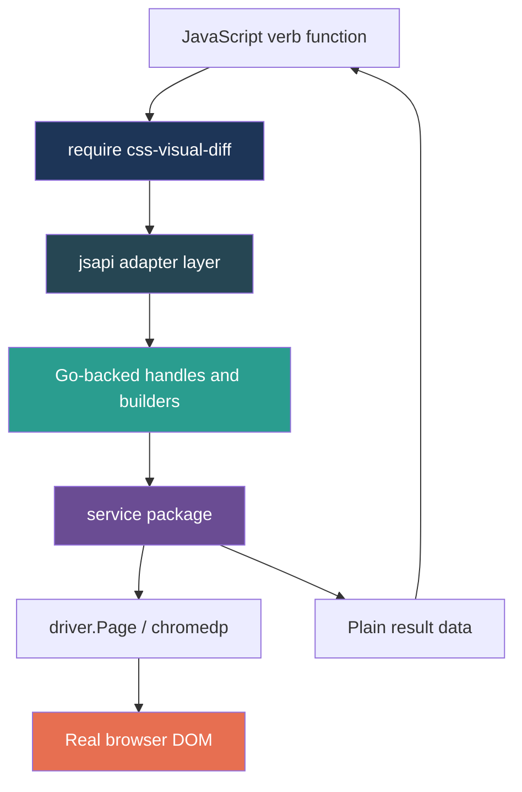

# CSS Visual Diff Flexible JavaScript API Implementation

This chapter explains the implementation of the flexible JavaScript API added to `css-visual-diff`. The goal is not to list every method. The goal is to teach the architecture: how a YAML-oriented browser comparison tool grew a JavaScript-native layer with page locators, Go-backed builders, strict extraction, snapshots, structural diffs, embedded help, and reusable scripting examples.

The implementation happened on branch `task/add-js-interpreter` after the original Goja/jsverbs PR had already been merged. The work is recorded in ticket `CSSVD-FLEX-JS-API` under the repository-local `ttmp/` tree, and the final branch contains ten focused commits from documentation and design through service primitives, Goja adapters, strict APIs, and embedded user-facing help.

> [!summary]
> This implementation has four intertwined identities:
> 1. A package-boundary cleanup that moved the native `require("css-visual-diff")` module into `internal/cssvisualdiff/jsapi`.
> 2. A lower-level browser inspection API built around page-bound locators, reusable probes, extractor handles, snapshots, and diffs.
> 3. A Goja Proxy model that makes live handles and builders Go-backed, strict, and able to produce useful errors for LLM-written code.
> 4. An operator-facing documentation pass that moved JavaScript docs into embedded Glazed help entries and added a textbook-style guide for pixel-accurate website scripting.

## 1. The starting point

Before this work, `css-visual-diff` already had a useful JavaScript surface. Repository-scanned scripts could be exposed as CLI verbs under `css-visual-diff verbs ...`, and scripts could call a Promise-first native module:

```js
const cvd = require("css-visual-diff")
const browser = await cvd.browser()
const page = await browser.page(url, { viewport: { width: 1280, height: 720 } })
const result = await page.inspectAll([{ name: "cta", selector: "#cta", props: ["color"] }], {
  outDir: "/tmp/cssvd/cta",
  artifacts: "css-json",
})
```

That surface was intentionally close to the existing CLI and YAML model. It let JavaScript drive high-level operations: open a page, preflight selectors, inspect probes, write artifacts, and record catalog manifests. It did not yet let scripts ask lower-level questions like “what is this element's text right now?” or “compare these two in-memory snapshots without writing the standard inspect bundle.”

The lower-level API exists to fill that gap. It turns `css-visual-diff` from a browser automation tool that JavaScript can invoke into a browser inspection library that JavaScript can compose.

The main implementation commits are:

```text
561d75a refactor: move css visual diff js api adapters
63f2951 feat: serialize js page operations
0be4f59 feat: add dom locator service primitives
28002ca feat: expose js locator handles
a66432a feat: add js target probe extractor builders
9d65d80 feat: add strict js element extraction
47b44fb feat: add strict js page snapshots
eef2b31 feat: add js snapshot diff reporting
8fba1d4 docs: embed js api help and pixel guide
```

The branch also includes the ticket/design commit:

```text
17240de docs: add flexible js api implementation ticket
```

## 2. The core mental model

The implementation is easiest to understand if you keep three boundaries in mind.

The first boundary is between the browser service and the JavaScript adapter. Browser work belongs in Go service packages. Goja adapters decode JavaScript values, call service functions, and lower Go results back into JavaScript. They should not become the place where DOM algorithms live.

The second boundary is between page-bound handles and reusable recipes. A locator is bound to a live page. A probe is not. This distinction shapes the entire API.

The third boundary is between authoring objects and result objects. Authoring objects — pages, locators, probes, target builders, extractor handles — are Go-backed and often Proxy-wrapped. Result objects — selector statuses, element snapshots, page snapshots, diffs, manifests — are plain serializable data.



A good API here is not one that accepts anything. A good API is one that makes the user's intention explicit. If a script wants to query one live page, it should say `page.locator("#cta")`. If it wants a reusable recipe, it should say `cvd.probe("cta").selector("#cta")`. If it wants to read facts, it should say which extractors to run. These small distinctions make scripts easier to read and easier to debug.

## 3. The package boundary: `dsl` versus `jsapi`

The first implementation phase was a no-behavior refactor. The original native module implementation lived in `internal/cssvisualdiff/dsl/cvd_module.go`. That was acceptable for the first JavaScript prototype, but it put two different responsibilities in one package.

The `dsl` package owns jsverbs host/runtime wiring: scanning scripts, registering sentinels, building commands, and installing generic runtime modules. The `css-visual-diff` native JavaScript API is now its own subsystem.

The refactor moved:

```text
internal/cssvisualdiff/dsl/cvd_module.go       -> internal/cssvisualdiff/jsapi/module.go
internal/cssvisualdiff/dsl/catalog_adapter.go  -> internal/cssvisualdiff/jsapi/catalog.go
internal/cssvisualdiff/dsl/config_adapter.go   -> internal/cssvisualdiff/jsapi/config.go
```

The registrar now delegates:

```go
// internal/cssvisualdiff/dsl/registrar.go
func (runtimeRegistrar) RegisterRuntimeModules(ctx *engine.RuntimeModuleContext, reg *noderequire.Registry) error {
    // diff and report legacy modules still live here
    jsapi.Register(ctx, reg)
    // ...
}
```

The public module name did not change:

```js
const cvd = require("css-visual-diff")
```

This matters because the rest of the work could now grow under `internal/cssvisualdiff/jsapi` without turning `dsl` into a large mixed-responsibility package. The split also created a clear review rule: Goja adapter code can live in `jsapi`; browser and DOM logic should live in `service`; jsverbs command scanning stays in `dsl` / `verbcli`.

## 4. Promise-first, but serialized per page

The JavaScript API is Promise-first. Any operation that touches Chromium, timers, files, or catalog writes returns a Promise. That makes scripts natural to write:

```js
const [text, bounds, styles] = await Promise.all([
  page.locator("#cta").text({ normalizeWhitespace: true, trim: true }),
  page.locator("#cta").bounds(),
  page.locator("#cta").computedStyle(["color", "font-size"]),
])
```

The problem is that Chrome DevTools Protocol operations on one page are not meaningfully parallel. Even when JavaScript launches several Promises at once, the underlying page needs a single orderly stream of operations. The implementation solves this with a per-page mutex in `pageState`:

```go
type pageState struct {
    mu     sync.Mutex
    page   *service.PageService
    target config.Target
}

func (s *pageState) runExclusive(work func() (any, error)) (any, error) {
    s.mu.Lock()
    defer s.mu.Unlock()
    return work()
}
```

Every existing page operation now goes through `runExclusive`: `goto`, `prepare`, `preflight`, `inspect`, `inspectAll`, and `close`. Locator methods and snapshot/extract operations use the same guard. This gives users the ergonomics of `Promise.all` while preserving safety inside a single page.

The lock is page-scoped, not browser-scoped. Two independent pages can still operate concurrently because each page has its own `pageState`.

## 5. The Goja Proxy pattern

The lower-level API uses Go-backed values wrapped in Goja Proxies. The point is not only encapsulation. The point is feedback.

A plain JavaScript object can accept almost any property access. If an LLM writes `page.locator("#cta").styles(["color"])`, a plain object might produce `undefined is not a function`. That error is technically correct and operationally useless. A Proxy can say something better:

```text
cvd.locator: .styles() is not available here. .styles() belongs to cvd.probe. For direct style reads on a locator, use .computedStyle(["color"]) instead.
```

The reusable infrastructure lives in:

```text
internal/cssvisualdiff/jsapi/proxy.go
internal/cssvisualdiff/jsapi/unwrap.go
```

The core pieces are:

```go
type ProxyRegistry struct {
    mu     sync.Mutex
    nextID int64
    items  map[int64]proxyBinding
}

type ProxySpec struct {
    Owner        string
    Methods      map[string]ProxyMethod
    MethodOwners map[string]MethodSpec
}

type MethodSpec struct {
    Owner string
    Hint  string
}
```

`newProxyValue` creates the Proxy, binds a Go backing value to a registry id, and installs a `Get` trap. The trap has three important branches:

1. If the property is an own method, return a callable wrapper.
2. If the property is known to belong to another object, throw a wrong-parent error.
3. Otherwise, throw an unknown-method error with available methods and a did-you-mean suggestion.

The registry is also what makes strict APIs possible. A top-level function like `cvd.extract(locator, extractors)` can reject raw objects because it can unwrap only values created by the `jsapi` package.

```go
func mustUnwrapProxyBacking[T any](vm *goja.Runtime, registry *ProxyRegistry, operation string, value goja.Value, owner string) *T {
    backing, err := unwrapProxyBacking[T](vm, registry, operation, value, owner)
    if err != nil {
        panic(typeMismatchError(vm, operation, owner, value))
    }
    return backing
}
```

This is the difference between a permissive scripting API and a guided scripting API. The API is still JavaScript, but the important domain objects are Go-backed and type-aware.

## 6. DOM locator services: the browser-facing foundation

The first visible lower-level API was `page.locator(selector)`, but the implementation did not start there. It started in the service layer.

The file `internal/cssvisualdiff/service/dom.go` defines browser-page operations that do not import Goja:

```go
type LocatorSpec struct {
    Name     string `json:"name,omitempty"`
    Selector string `json:"selector"`
    Source   string `json:"source,omitempty"`
}

type TextOptions struct {
    NormalizeWhitespace bool `json:"normalizeWhitespace,omitempty"`
    Trim                bool `json:"trim,omitempty"`
}

type ElementHTML struct {
    Exists bool   `json:"exists"`
    HTML   string `json:"html"`
}
```

The service functions are direct browser operations:

```go
func LocatorStatus(page *driver.Page, locator LocatorSpec) (SelectorStatus, error)
func LocatorText(page *driver.Page, locator LocatorSpec, opts TextOptions) (string, error)
func LocatorHTML(page *driver.Page, locator LocatorSpec, outer bool) (ElementHTML, error)
func LocatorBounds(page *driver.Page, locator LocatorSpec) (*Bounds, error)
func LocatorAttributes(page *driver.Page, locator LocatorSpec, attrs []string) (map[string]string, error)
func LocatorComputedStyle(page *driver.Page, locator LocatorSpec, props []string) (map[string]string, error)
```

Two reuse decisions matter. `LocatorStatus` reuses `PreflightProbes`, so status semantics stay aligned with the existing high-level API. `LocatorComputedStyle` reuses `EvaluateStyle`, so computed CSS extraction stays aligned with the existing inspect/cssdiff logic.

Missing selectors return empty structured results when that is natural:

| Operation | Missing selector result |
|---|---|
| `LocatorText` | `""` |
| `LocatorHTML` | `{ exists: false, html: "" }` |
| `LocatorBounds` | `nil` |
| `LocatorAttributes` | empty map |
| `LocatorComputedStyle` | empty map |

Invalid selectors are different. A malformed selector is not a missing element. It is a broken query. Direct locator operations return errors for invalid selectors so users fix the selector rather than silently comparing empty values.

## 7. `page.locator`: a live page-bound handle

The JavaScript locator adapter lives in:

```text
internal/cssvisualdiff/jsapi/locator.go
```

`page.locator(selector)` is synchronous because constructing a locator does not touch the browser. It only captures a page reference and selector:

```go
type locatorHandle struct {
    page     *pageState
    selector string
}
```

Browser-touching methods return Promises:

```js
const cta = page.locator("#cta")
const [status, text, styles] = await Promise.all([
  cta.status(),
  cta.text({ normalizeWhitespace: true, trim: true }),
  cta.computedStyle(["color", "background-color"]),
])
```

The locator methods are:

```text
status()
exists()
visible()
text(options)
bounds()
computedStyle(props)
attributes(names)
```

Every method calls the service layer through `pageState.runExclusive`, so it inherits the page safety guarantee.

This is the first place where the conceptual design becomes executable. A locator is not a probe. It does not have `.styles()`. It does not have `.build()`. If a user mixes the concepts, the Proxy trap gives a domain-specific error.

## 8. Builders: target, probe, viewport, extractor

The next implementation layer added synchronous authoring builders.

```text
internal/cssvisualdiff/jsapi/target.go
internal/cssvisualdiff/jsapi/probe.go
internal/cssvisualdiff/jsapi/extractor.go
internal/cssvisualdiff/jsapi/builder_helpers.go
```

A target builder describes a page target:

```js
const target = cvd.target("booking")
  .url("http://localhost:3000/booking")
  .viewport(cvd.viewport.desktop())
  .waitMs(250)
  .root("#app")
  .build()
```

A probe builder describes a reusable inspection recipe:

```js
const probe = cvd.probe("cta")
  .selector("#cta")
  .required()
  .text()
  .bounds()
  .styles(["color", "font-size", "background-color"])
  .attributes(["class"])
```

Extractor handles describe facts to read from one locator:

```js
const extractors = [
  cvd.extractors.exists(),
  cvd.extractors.visible(),
  cvd.extractors.text(),
  cvd.extractors.bounds(),
  cvd.extractors.computedStyle(["color"]),
  cvd.extractors.attributes(["id", "class"]),
]
```

These builders are Go-backed Proxies. The `.build()` methods return plain data for debugging and interop, but strict APIs do not require users to call `.build()`. This is important. The builder itself carries a typed backing value that `cvd.snapshot` can unwrap later.

The tricky implementation detail was lowerCamel decoding. Direct Goja `ExportTo` does not always populate Go structs when the struct relies on JSON tags or when the JS value came from another lowerCamel helper. The safer pattern is the repository's tiny JSON codec helper:

```go
func decodeInto[T any](raw any) (T, error) {
    var out T
    b, err := json.Marshal(raw)
    if err != nil { return out, err }
    if err := json.Unmarshal(b, &out); err != nil { return out, err }
    return out, nil
}
```

The viewport builder discovered this in practice. Passing `cvd.viewport.mobile()` into `.viewport(...)` initially decoded to zero width/height. Routing through `decodeInto[config.Viewport]` fixed it.

## 9. Strict extraction: `cvd.extract(locator, extractors)`

The extraction layer is where locators and extractors meet.

The service file is:

```text
internal/cssvisualdiff/service/extract.go
```

It defines a service-native extraction model:

```go
type ExtractorKind string

const (
    ExtractorExists        ExtractorKind = "exists"
    ExtractorVisible       ExtractorKind = "visible"
    ExtractorText          ExtractorKind = "text"
    ExtractorBounds        ExtractorKind = "bounds"
    ExtractorComputedStyle ExtractorKind = "computedStyle"
    ExtractorAttributes    ExtractorKind = "attributes"
)

type ExtractorSpec struct {
    Kind       ExtractorKind `json:"kind"`
    Props      []string      `json:"props,omitempty"`
    Attributes []string      `json:"attributes,omitempty"`
    Text       TextOptions   `json:"text,omitempty"`
}

type ElementSnapshot struct {
    Selector   string            `json:"selector"`
    Exists     *bool             `json:"exists,omitempty"`
    Visible    *bool             `json:"visible,omitempty"`
    Text       string            `json:"text,omitempty"`
    Bounds     *Bounds           `json:"bounds,omitempty"`
    Computed   map[string]string `json:"computed,omitempty"`
    Attributes map[string]string `json:"attributes,omitempty"`
}
```

The core algorithm is deliberately small:

```go
func ExtractElement(page *driver.Page, locator LocatorSpec, extractors []ExtractorSpec) (ElementSnapshot, error) {
    snapshot := ElementSnapshot{Selector: locator.Selector}
    for _, extractor := range extractors {
        switch extractor.Kind {
        case ExtractorExists:
            status := LocatorStatus(...)
            snapshot.Exists = &status.Exists
        case ExtractorVisible:
            status := LocatorStatus(...)
            snapshot.Visible = &status.Visible
        case ExtractorText:
            snapshot.Text = LocatorText(...)
        case ExtractorBounds:
            snapshot.Bounds = LocatorBounds(...)
        case ExtractorComputedStyle:
            snapshot.Computed = LocatorComputedStyle(...)
        case ExtractorAttributes:
            snapshot.Attributes = LocatorAttributes(...)
        }
    }
    return snapshot, nil
}
```

The JavaScript adapter lives in:

```text
internal/cssvisualdiff/jsapi/extract.go
```

The API is intentionally strict:

```js
await cvd.extract(page.locator("#cta"), [
  cvd.extractors.exists(),
  cvd.extractors.text(),
  cvd.extractors.computedStyle(["color"]),
])
```

This works because `cvd.extract` unwraps the first argument as a `cvd.locator` and each array entry as a `cvd.extractor`. A raw object is rejected:

```js
await cvd.extract({ selector: "#cta" }, [cvd.extractors.text()])
```

with an error that contains:

```text
css-visual-diff.extract: expected cvd.locator
```

That error is the design in miniature. The API does not guess what a raw object means. It asks the caller to use the page-bound handle that carries the correct backing state.

## 10. Strict snapshots: batching reusable probes

Extraction answers one locator. Snapshot answers a list of reusable probes.

The service file is:

```text
internal/cssvisualdiff/service/snapshot.go
```

It defines:

```go
type SnapshotProbeSpec struct {
    Name       string          `json:"name"`
    Selector   string          `json:"selector"`
    Source     string          `json:"source,omitempty"`
    Required   bool            `json:"required,omitempty"`
    Extractors []ExtractorSpec `json:"extractors"`
}

type ProbeSnapshot struct {
    Name     string          `json:"name"`
    Selector string          `json:"selector"`
    Source   string          `json:"source,omitempty"`
    Snapshot ElementSnapshot `json:"snapshot"`
    Error    string          `json:"error,omitempty"`
}

type PageSnapshot struct {
    Results []ProbeSnapshot `json:"results"`
}
```

The algorithm is a batch over `ExtractElement`:

```go
func SnapshotPage(page *driver.Page, probes []SnapshotProbeSpec) (PageSnapshot, error) {
    for _, probe := range probes {
        snapshot, err := ExtractElement(page, LocatorSpec{...}, probe.Extractors)
        if err != nil && probe.Required {
            return PageSnapshot{}, err
        }
        // optional probe errors are recorded in the result
    }
}
```

The JavaScript API is:

```js
const snapshot = await cvd.snapshot(page, [
  cvd.probe("title").selector("h1").text().styles(["font-size", "color"]),
  cvd.probe("cta").selector("#cta").text().bounds().styles(["background-color"]),
])
```

This is strict too. Raw object probes are rejected:

```js
await cvd.snapshot(page, [{ name: "cta", selector: "#cta" }])
```

The interesting implementation compromise is the page wrapper. Locators, probes, and extractors are full Proxies. Existing page wrappers were ordinary Goja objects with methods already installed. Converting them to full Proxies would have been a larger compatibility refactor. Instead, Phase 8 tagged page objects in the shared registry as `cvd.page`, so `cvd.snapshot` can unwrap them strictly without changing their method behavior.

That is a pragmatic migration pattern: strict unwrapping can be introduced before every old wrapper is converted into a Proxy.

## 11. Structural diffs and reports

Once scripts can produce snapshots, they need a way to compare them. Phase 9 added a deliberately small structural diff service:

```text
internal/cssvisualdiff/service/diff.go
```

The model is:

```go
type DiffOptions struct {
    IgnorePaths []string `json:"ignorePaths,omitempty"`
}

type DiffChange struct {
    Path   string `json:"path"`
    Before any    `json:"before,omitempty"`
    After  any    `json:"after,omitempty"`
}

type SnapshotDiff struct {
    Equal       bool         `json:"equal"`
    ChangeCount int          `json:"change_count"`
    Changes     []DiffChange `json:"changes"`
}
```

The service normalizes both inputs through JSON, walks maps with sorted keys, walks arrays by index, and records changed leaf paths. The current diff is not CSS-aware. It does not know about tolerances, colors, layout fuzziness, or browser rendering noise. It is intentionally a stable first layer.

```js
const diff = cvd.diff(before, after, {
  ignorePaths: ["results[0].snapshot.bounds.x"],
})

const markdown = cvd.report(diff).markdown()
await cvd.write.json("out/diff.json", diff)
await cvd.report(diff).writeMarkdown("out/diff.md")
```

Two failure modes during implementation are worth preserving.

First, the jsverbs runtime is not a full Node runtime. A test script tried `require("path")` and failed with:

```text
promise rejected: GoError: Invalid module
```

The fix was to build test paths with simple string concatenation. Scripts should not assume Node built-ins unless the runtime explicitly provides them.

Second, `ignorePaths` initially did not work because options were decoded with direct `ExportTo`, which did not populate the JSON-tagged `DiffOptions` field as expected. The fix was to use the same JSON-based `decodeInto` helper used elsewhere in the adapter.

The rule is simple: JavaScript-facing option decoding should go through the JSON codec unless there is a specific reason not to.

## 12. Embedded documentation as part of the binary

The final phase moved standalone JavaScript docs into the existing Glazed help system.

Before:

```text
docs/js-api.md
docs/js-verbs.md
```

After:

```text
internal/cssvisualdiff/doc/topics/javascript-api.md
internal/cssvisualdiff/doc/topics/javascript-verbs.md
internal/cssvisualdiff/doc/tutorials/pixel-accuracy-scripting-guide.md
```

The binary already had help wiring:

```go
helpSystem := help.NewHelpSystem()
if err := doc.AddDocToHelpSystem(helpSystem); err != nil {
    // handle error
}
help_cmd.SetupCobraRootCommand(helpSystem, rootCmd)
```

So the work was content placement, frontmatter, and validation rather than Go integration. Users can now run:

```bash
css-visual-diff help javascript-api
css-visual-diff help javascript-verbs
css-visual-diff help pixel-accuracy-scripting-guide
```

The `pixel-accuracy-scripting-guide` is intentionally textbook-style. It teaches the feedback loop: render, locate, extract, snapshot, diff, report, and adjust. The guide exists because this API is not just a method surface. It is a way of working while building UI.

## 13. External example and smoke scripts

The implementation added a lower-level external verb example:

```text
examples/verbs/low-level-inspect.js
```

The command path is:

```bash
css-visual-diff verbs --repository examples/verbs examples low-level inspect \
  http://127.0.0.1:8767/ '#cta' /tmp/cssvd-low-level \
  --output json
```

The example uses:

```js
const locator = page.locator(selector)
const element = await cvd.extract(locator, [
  cvd.extractors.exists(),
  cvd.extractors.visible(),
  cvd.extractors.text(),
  cvd.extractors.bounds(),
  cvd.extractors.computedStyle([...]),
  cvd.extractors.attributes([...]),
])

const snapshot = await cvd.snapshot(page, [
  cvd.probe(values.name || "target")
    .selector(selector)
    .required()
    .text()
    .bounds()
    .styles([...])
    .attributes([...]),
])
```

Two Phase 10 smoke scripts were added under the ticket:

```text
ttmp/2026/04/24/CSSVD-FLEX-JS-API--design-a-flexible-lower-level-javascript-api/scripts/001-help-entries-smoke.sh
ttmp/2026/04/24/CSSVD-FLEX-JS-API--design-a-flexible-lower-level-javascript-api/scripts/002-low-level-verb-binary-smoke.sh
```

The first smoke builds the binary if needed and checks that the embedded help entries render. The second smoke serves a tiny local HTML page, runs the external lower-level verb, and verifies that `element.json` and `snapshot.json` are written.

This matters because Go tests alone do not exercise the compiled binary, embedded docs, repository scanning, external examples, and browser behavior as one system. The smoke scripts do.

## 14. Validation strategy

The implementation uses four kinds of tests.

Service tests validate browser and data logic without Goja concerns:

```text
internal/cssvisualdiff/service/dom_test.go
internal/cssvisualdiff/service/extract_test.go
internal/cssvisualdiff/service/snapshot_test.go
internal/cssvisualdiff/service/diff_test.go
```

Goja adapter tests validate Proxy behavior and builder semantics:

```text
internal/cssvisualdiff/jsapi/proxy_test.go
internal/cssvisualdiff/jsapi/builders_test.go
```

Repository-scanned JS verb tests validate real `require("css-visual-diff")` behavior through the actual command system:

```text
internal/cssvisualdiff/verbcli/command_test.go
```

Binary smoke scripts validate help embedding and external verb execution:

```bash
ttmp/.../scripts/001-help-entries-smoke.sh
ttmp/.../scripts/002-low-level-verb-binary-smoke.sh
```

The final validation commands included:

```bash
go test ./...

go run ./cmd/css-visual-diff help javascript-api

go run ./cmd/css-visual-diff help javascript-verbs

go run ./cmd/css-visual-diff help pixel-accuracy-scripting-guide

ttmp/2026/04/24/CSSVD-FLEX-JS-API--design-a-flexible-lower-level-javascript-api/scripts/001-help-entries-smoke.sh

ttmp/2026/04/24/CSSVD-FLEX-JS-API--design-a-flexible-lower-level-javascript-api/scripts/002-low-level-verb-binary-smoke.sh
```

The ticket also passed:

```bash
docmgr doctor --root ./ttmp --ticket CSSVD-FLEX-JS-API --stale-after 30
```

## 15. The important implementation files

| File | Purpose |
|---|---|
| `internal/cssvisualdiff/jsapi/module.go` | Registers `require("css-visual-diff")`, browser/page methods, and API installers. |
| `internal/cssvisualdiff/jsapi/proxy.go` | Goja Proxy construction, method-owner errors, unknown-method errors, and shared registry. |
| `internal/cssvisualdiff/jsapi/unwrap.go` | Strict unwrapping of Go-backed Proxy values. |
| `internal/cssvisualdiff/jsapi/locator.go` | `page.locator(...)` and async locator methods. |
| `internal/cssvisualdiff/jsapi/target.go` | `cvd.target(...)` and viewport helpers. |
| `internal/cssvisualdiff/jsapi/probe.go` | `cvd.probe(...)` builder and service extractor tracking. |
| `internal/cssvisualdiff/jsapi/extractor.go` | `cvd.extractors.*` handles and conversion to service specs. |
| `internal/cssvisualdiff/jsapi/extract.go` | Strict `cvd.extract(locator, extractors)`. |
| `internal/cssvisualdiff/jsapi/snapshot.go` | Strict `cvd.snapshot(page, probes)`. |
| `internal/cssvisualdiff/jsapi/diff.go` | `cvd.diff`, `cvd.report`, and `cvd.write.*`. |
| `internal/cssvisualdiff/service/dom.go` | Locator status/text/html/bounds/attributes/style primitives. |
| `internal/cssvisualdiff/service/extract.go` | Element extraction from a locator and extractor specs. |
| `internal/cssvisualdiff/service/snapshot.go` | Page snapshots over probe specs. |
| `internal/cssvisualdiff/service/diff.go` | Structural diff and Markdown rendering. |
| `internal/cssvisualdiff/verbcli/command_test.go` | End-to-end repository-scanned JS integration tests. |
| `internal/cssvisualdiff/doc/tutorials/pixel-accuracy-scripting-guide.md` | Embedded textbook-style user guide. |
| `examples/verbs/low-level-inspect.js` | External example for the lower-level API. |

## 16. Common failure modes and their fixes

### Failure: lowerCamel options do not decode into Go structs

Symptom:

```text
cvd.target.viewport: expected positive width and height, got width=0 height=0
```

Cause: direct `vm.ExportTo` did not populate a Go struct from a lowerCamel map where the struct's fields did not match the JavaScript names directly.

Fix: route JS options through the JSON codec:

```go
opts, err := decodeInto[service.DiffOptions](call.Argument(2).Export())
```

### Failure: assuming Node built-ins exist

Symptom:

```text
promise rejected: GoError: Invalid module
```

Cause: a jsverbs script used `require("path")`, but the runtime does not provide Node's `path` module.

Fix: avoid Node built-ins unless registered. Use simple string operations or add an explicit module.

### Failure: cross-call strict unwrapping fails

Cause: Proxies created with isolated registries cannot be unwrapped later by top-level functions.

Fix: use a shared default registry for `newProxyValue(..., nil, ...)` so `cvd.extract` and `cvd.snapshot` can prove that values came from this API.

### Failure: page-like raw objects sneak into strict APIs

Cause: accepting raw JavaScript objects makes it impossible to know whether an argument carries the required page/browser state.

Fix: registry-tag page objects as `cvd.page` and unwrap them in strict APIs. Longer term, consider converting page wrappers to full Proxies.

## 17. Open questions

The implementation is usable, but several design questions remain.

**Should the Proxy registry be per runtime rather than package-level?** The package-level default registry is simple and covered by tests, but per-runtime state would be cleaner for long-lived processes or multiple embedded runtimes.

**Should page wrappers become full Proxies?** Page objects are currently registry-tagged ordinary objects. That preserves behavior but is conceptually different from locator/probe/extractor handles.

**Should `cvd.write.json` create parent directories?** The current implementation assumes the parent directory exists. The examples and smoke scripts create it explicitly.

**Should diff paths support richer matching?** Exact paths such as `results[0].snapshot.text` are simple and deterministic, but real UI comparisons may want wildcards or probe-name-based paths.

**Should CSS-aware diff normalization live in `service/diff.go` or a separate file?** Structural diff is a foundation. Visual diffing may eventually need color normalization, numeric tolerance, and layout-specific comparisons.

## 18. Near-term next steps

The next useful implementation steps are not new features for their own sake. They are polish that makes the API safer and easier to adopt.

1. Convert page wrappers to full Proxy-backed `PageHandle` values or introduce a proper per-runtime `ModuleState` that owns the registry.
2. Make `cvd.write.json` and `cvd.write.markdown` create parent directories automatically.
3. Add a second embedded tutorial focused on CI gating and catalog output.
4. Add focused help entries for `cvd.extract`, `cvd.snapshot`, and `cvd.diff` once the API settles.
5. Consider TypeScript-style declaration output for editor assistance and LLM prompting.
6. Add CSS-aware diff options: numeric tolerance, ignored CSS properties, color normalization, and probe-name-based ignore paths.

## 19. The working rules

The implementation suggests a set of working rules for future API growth.

**Rule 1: Put browser logic in `service`, not in Goja adapters.** The JavaScript layer should decode arguments, call services, and lower results.

**Rule 2: Keep live authoring objects Go-backed.** Locators, probes, extractors, targets, and pages should carry host-side identity so strict APIs can validate them.

**Rule 3: Return plain data at the boundary.** Statuses, snapshots, diffs, reports, and manifests should remain serializable and easy to write to JSON.

**Rule 4: Prefer specific errors over permissive guessing.** If the user passes a raw object to a strict API, reject it and explain which builder or handle to use.

**Rule 5: Validate through the command system, not just package tests.** Repository-scanned JS verb tests catch runtime, Promise, binding, and output-shape issues that unit tests cannot.

**Rule 6: Embed durable docs in the binary.** If a feature matters to users, it should be available through `css-visual-diff help ...`.

## 20. Closing

The lower-level JavaScript API turns `css-visual-diff` into a programmable browser inspection system. The old high-level API remains valuable: it writes inspect artifacts and catalogs. The new API adds a smaller vocabulary beneath it: locators for live page questions, probes for reusable recipes, extractors for facts, snapshots for batches, diffs for comparison, and reports for evidence.

The important part is not any single method. The important part is the architecture that keeps the system understandable. Service code owns browser behavior. Goja adapters own JavaScript binding. Proxies make domain errors precise. Results remain plain data. Documentation lives in the binary. Tests exercise both the packages and the compiled CLI path.

That combination makes the API teachable, scriptable, and reviewable. It gives frontend work a tighter loop: ask the browser precise questions, compare the answers, and let the evidence guide the next CSS change.

## 21. Reference material

Source repository:

- `/home/manuel/workspaces/2026-04-21/hair-v2/css-visual-diff`

Ticket workspace:

- `ttmp/2026/04/24/CSSVD-FLEX-JS-API--design-a-flexible-lower-level-javascript-api`

Primary ticket docs:

- `design-doc/01-flexible-javascript-api-analysis-design-and-implementation-guide.md`
- `reference/01-investigation-diary.md`
- `tasks.md`
- `changelog.md`

Embedded help entries:

- `internal/cssvisualdiff/doc/topics/javascript-api.md`
- `internal/cssvisualdiff/doc/topics/javascript-verbs.md`
- `internal/cssvisualdiff/doc/tutorials/pixel-accuracy-scripting-guide.md`

Validation scripts:

- `scripts/001-help-entries-smoke.sh`
- `scripts/002-low-level-verb-binary-smoke.sh`

Final reMarkable artifact:

- `/ai/2026/04/24/cssvd-flex-api-implementation`
