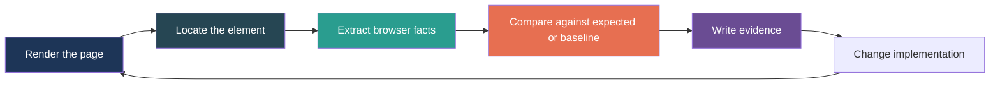

# Using CSS Visual Diff Scripts for Pixel-Perfect Websites

This chapter teaches how to use `css-visual-diff` as a practical development loop for building pixel-perfect websites. It is not primarily an implementation report. It is a usage guide: how to think, what to run, what to measure, how to write scripts, and how to turn browser evidence into frontend changes.

Pixel-perfect work fails when it becomes subjective. A designer says the spacing feels wrong. A developer says the CSS matches the Figma numbers. A screenshot looks close but not quite. The browser has the answer, but only if you ask it precise questions: what element rendered, what text it contains, what bounds it occupies, what computed styles it has, and what changed since the last version. `css-visual-diff` is the tool for asking those questions repeatedly.

> [!summary]
> The working method is simple:
> 1. Use locators while exploring a live page: `page.locator("#cta").computedStyle([...])`.
> 2. Turn stable checks into probes: `cvd.probe("cta").selector("#cta").text().styles([...])`.
> 3. Capture snapshots, diff them, and write JSON/Markdown evidence.
> 4. Use inspect artifacts and catalogs when a human needs screenshots, HTML, or durable review bundles.

## 1. Pixel perfection is a feedback loop

Pixel perfection is often described as matching a design. That description is too vague to be useful. A browser renders a page through a chain of decisions: DOM structure, CSS cascade, inherited styles, layout constraints, font rendering, responsive breakpoints, JavaScript state, and browser defaults. If you only look at the final screenshot, you see the symptom but not the cause.

A better way to work is to use a loop:



The important step is extraction. Extraction is what turns “it looks wrong” into “the button is 36px high, but the baseline was 40px” or “the text is correct, but the font weight is 500 instead of 700.” Once the problem is phrased this way, it becomes a normal engineering task.

The loop has two modes:

- **Authoring mode:** You are building or debugging. Missing selectors and mismatches are information. You want fast, descriptive output.
- **CI mode:** You are protecting a known-good state. Missing selectors and mismatches should fail the build or produce review artifacts.

Good scripts can support both modes by exposing a `failOnMissing` flag or by returning structured rows that CI can interpret.

## 2. The vocabulary: page, locator, probe, extractor, snapshot, diff

The JavaScript API is designed around a small vocabulary. Understanding this vocabulary is more valuable than memorizing methods.

| Word | Meaning | Use it when |
|---|---|---|
| Browser | A Chromium-backed browser service. | You need to open pages. |
| Page | One loaded browser page with viewport and target state. | You are inspecting one URL or UI state. |
| Locator | A page-bound selector handle. | You are asking live questions about one element. |
| Probe | A reusable inspection recipe. | You want repeatable checks across pages or runs. |
| Extractor | A fact to read from an element. | You want text, bounds, CSS, attributes, visibility. |
| Snapshot | The result of applying probes to a page. | You want data to diff, write, or store. |
| Diff | A structural comparison between snapshots. | You want to know what changed. |
| Catalog | A durable manifest/index of targets, artifacts, and failures. | You need operator-facing evidence. |

The distinction between locator and probe matters most.

A **locator** answers a live question:

```js
const cta = page.locator("#cta")
const color = await cta.computedStyle(["color"])
```

A **probe** defines a reusable recipe:

```js
const ctaProbe = cvd.probe("cta")
  .selector("#cta")
  .text()
  .styles(["color", "font-size"])
```

When you are exploring, locators are usually faster. When you are building repeatable checks, probes are better.

## 3. The first script: inspect one element

Start with the smallest script that answers a useful question. This script opens a page, finds a selector, and returns the facts that help you fix a component.

```js
async function inspectElement(url, selector) {
  const cvd = require("css-visual-diff")
  const browser = await cvd.browser()

  try {
    const page = await browser.page(url, {
      viewport: { width: 1280, height: 720 },
      waitMs: 250,
      name: "authoring-page",
    })

    const element = page.locator(selector)

    const [status, text, bounds, styles, attrs] = await Promise.all([
      element.status(),
      element.text({ normalizeWhitespace: true, trim: true }),
      element.bounds(),
      element.computedStyle([
        "display",
        "position",
        "height",
        "padding-top",
        "padding-right",
        "padding-bottom",
        "padding-left",
        "font-family",
        "font-size",
        "font-weight",
        "line-height",
        "color",
        "background-color",
        "border-radius",
        "box-shadow",
      ]),
      element.attributes(["id", "class", "data-testid", "aria-label"]),
    ])

    return { selector, status, text, bounds, styles, attrs }
  } finally {
    await browser.close()
  }
}
```

This script gives you a useful first answer. It tells you whether the selector matched, whether the element is visible, what text is rendered, what box the browser computed, and which visual CSS properties actually landed.

The important thing is that this is browser truth. It is not the CSS source, and it is not a guess from a screenshot. It is the value after the cascade, layout, and JavaScript have finished.

## 4. Turning the script into a CLI command

To run this script as a command, place it in a repository folder such as `verbs/inspect-element.js` and add a `__verb__` declaration.

```js
async function inspectElement(url, selector) {
  // implementation from the previous section
}

__verb__("inspectElement", {
  parents: ["site"],
  short: "Inspect one element's rendered text, bounds, styles, and attributes",
  fields: {
    url: { argument: true, required: true, help: "Page URL" },
    selector: { argument: true, required: true, help: "CSS selector" },
  },
})
```

Run it:

```bash
css-visual-diff verbs --repository ./verbs site inspect-element \
  http://localhost:3000/checkout \
  '[data-testid="pay-button"]' \
  --output json
```

Use `--output json` while building scripts. JSON preserves the nested result and makes it easy to pipe into `jq`, compare fields, or paste evidence into a ticket.

## 5. What to measure for pixel-perfect work

The exact properties depend on the component, but most UI bugs fall into a few categories.

| Visual concern | Useful extractors/properties |
|---|---|
| Text content | `text({ normalizeWhitespace: true, trim: true })` |
| Size | `bounds()`, `height`, `width`, `min-height`, `line-height` |
| Spacing | `margin-*`, `padding-*`, `gap`, `row-gap`, `column-gap` |
| Typography | `font-family`, `font-size`, `font-weight`, `line-height`, `letter-spacing` |
| Color | `color`, `background-color`, `border-color`, `opacity` |
| Shape | `border-radius`, `border-width`, `box-shadow` |
| Layout | `display`, `position`, `align-items`, `justify-content`, `grid-template-columns` |
| State | `class`, `aria-*`, `data-*`, `disabled` |

For a button, a good first probe is:

```js
const buttonProbe = cvd.probe("primary-button")
  .selector('[data-testid="primary-button"]')
  .required()
  .text()
  .bounds()
  .styles([
    "display",
    "height",
    "padding-left",
    "padding-right",
    "font-size",
    "font-weight",
    "line-height",
    "color",
    "background-color",
    "border-radius",
    "box-shadow",
  ])
  .attributes(["class", "aria-label", "disabled"])
```

For a card, the probe should often be split into several probes. The card container owns layout and background. The title owns typography. The CTA owns button styling. One huge selector rarely answers the right question.

```js
const probes = [
  cvd.probe("card-shell")
    .selector('[data-testid="pricing-card"]')
    .bounds()
    .styles(["background-color", "border-radius", "box-shadow", "padding"]),

  cvd.probe("card-title")
    .selector('[data-testid="pricing-card"] h2')
    .text()
    .styles(["font-size", "font-weight", "line-height", "color"]),

  cvd.probe("card-action")
    .selector('[data-testid="pricing-card"] button')
    .text()
    .bounds()
    .styles(["height", "background-color", "color", "border-radius"]),
]
```

The rule is: measure the element that owns the property. Do not ask the wrapper for typography if the `h2` owns the typography. Do not ask the button for card padding if the card wrapper owns padding.

## 6. Capturing a snapshot of a page

A snapshot applies probes to one loaded page and returns plain data. It is the right abstraction when you want repeatable checks.

```js
async function snapshotCheckout(url) {
  const cvd = require("css-visual-diff")
  const browser = await cvd.browser()

  try {
    const page = await browser.page(url, {
      viewport: cvd.viewport.desktop(),
      waitMs: 250,
      name: "checkout",
    })

    return await cvd.snapshot(page, [
      cvd.probe("checkout-title")
        .selector("h1")
        .required()
        .text()
        .styles(["font-size", "font-weight", "line-height", "color"]),

      cvd.probe("summary-card")
        .selector('[data-testid="summary-card"]')
        .required()
        .bounds()
        .styles(["background-color", "border-radius", "padding", "box-shadow"]),

      cvd.probe("pay-button")
        .selector('[data-testid="pay-button"]')
        .required()
        .text()
        .bounds()
        .styles(["height", "font-size", "font-weight", "background-color", "color", "border-radius"]),
    ])
  } finally {
    await browser.close()
  }
}
```

The snapshot result is plain data. That is why it is useful. You can write it to disk, diff it, store it as a baseline, attach it to a ticket, or inspect it in a test.

## 7. Comparing baseline and current implementation

Once you can capture a snapshot, comparison is straightforward.

```js
async function compareCheckout(baselineUrl, currentUrl, outDir) {
  const cvd = require("css-visual-diff")

  const before = await snapshotCheckout(baselineUrl)
  const after = await snapshotCheckout(currentUrl)

  const diff = cvd.diff(before, after, {
    ignorePaths: [
      // Ignore responsive horizontal placement if only size/style matters.
      "results[1].snapshot.bounds.x",
      "results[2].snapshot.bounds.x",
    ],
  })

  await cvd.write.json(`${outDir}/before.json`, before)
  await cvd.write.json(`${outDir}/after.json`, after)
  await cvd.write.json(`${outDir}/diff.json`, diff)
  await cvd.report(diff).writeMarkdown(`${outDir}/diff.md`)

  return {
    ok: diff.equal,
    changeCount: diff.changeCount,
    report: `${outDir}/diff.md`,
  }
}
```

This is not a replacement for screenshots. It is a different tool. A screenshot tells you how the page looks. A snapshot diff tells you which browser facts changed. In practice, you want both. Use snapshot diffs to narrow the cause. Use screenshots and inspect artifacts to review the visible effect.

## 8. A full external verb for authoring

Here is a complete external verb that can live in `examples/verbs/checkout-compare.js` or a project-local `verbs/` directory.

```js
async function compareCheckout(baselineUrl, currentUrl, outDir, values) {
  values = values || {}
  const cvd = require("css-visual-diff")

  async function capture(url, name) {
    const browser = await cvd.browser()
    let page
    try {
      page = await browser.page(url, {
        viewport: values.mobile ? cvd.viewport.mobile() : cvd.viewport.desktop(),
        waitMs: values.waitMs || 250,
        name,
      })

      return await cvd.snapshot(page, [
        cvd.probe("title")
          .selector("h1")
          .required()
          .text()
          .styles(["font-size", "font-weight", "line-height", "color"]),

        cvd.probe("pay-button")
          .selector('[data-testid="pay-button"]')
          .required()
          .text()
          .bounds()
          .styles(["height", "font-size", "font-weight", "background-color", "color", "border-radius"])
          .attributes(["class", "aria-label", "disabled"]),
      ])
    } finally {
      if (page) await page.close()
      await browser.close()
    }
  }

  const before = await capture(baselineUrl, "baseline")
  const after = await capture(currentUrl, "current")
  const diff = cvd.diff(before, after, {
    ignorePaths: values.ignoreBounds
      ? ["results[1].snapshot.bounds.x", "results[1].snapshot.bounds.y"]
      : [],
  })

  await cvd.write.json(`${outDir}/before.json`, before)
  await cvd.write.json(`${outDir}/after.json`, after)
  await cvd.write.json(`${outDir}/diff.json`, diff)
  await cvd.report(diff).writeMarkdown(`${outDir}/diff.md`)

  if (values.failOnChange && !diff.equal) {
    throw new Error(`visual facts changed: ${diff.changeCount} change(s); see ${outDir}/diff.md`)
  }

  return {
    ok: diff.equal,
    changeCount: diff.changeCount,
    report: `${outDir}/diff.md`,
  }
}

__verb__("compareCheckout", {
  parents: ["site"],
  short: "Compare checkout page visual facts",
  fields: {
    baselineUrl: { argument: true, required: true },
    currentUrl: { argument: true, required: true },
    outDir: { argument: true, required: true },
    values: { bind: "all" },
    mobile: { type: "bool", default: false, help: "Use mobile viewport" },
    waitMs: { type: "int", default: 250, help: "Wait after navigation" },
    ignoreBounds: { type: "bool", default: false, help: "Ignore selected x/y movement" },
    failOnChange: { type: "bool", default: false, help: "Fail if the diff is not equal" },
  },
})
```

Run it:

```bash
mkdir -p /tmp/cssvd-checkout
css-visual-diff verbs --repository ./verbs site compare-checkout \
  http://localhost:3000/baseline/checkout \
  http://localhost:3000/checkout \
  /tmp/cssvd-checkout \
  --output json
```

Run it as a CI gate:

```bash
css-visual-diff verbs --repository ./verbs site compare-checkout \
  http://localhost:3000/baseline/checkout \
  http://localhost:3000/checkout \
  /tmp/cssvd-checkout \
  --failOnChange \
  --output json
```

The same script supports authoring and CI. In authoring mode, it returns the diff. In CI mode, it throws on change.

## 9. When to use catalogs and inspect artifacts

The lower-level API gives you compact facts. Catalogs and inspect artifacts give you durable evidence. They solve different problems.

Use lower-level snapshots when:

- you want quick feedback while editing CSS,
- you want machine-readable comparisons,
- you want to avoid writing screenshots on every run,
- you are testing text, computed CSS, attributes, or bounds.

Use inspect artifacts and catalogs when:

- a human needs to review screenshots,
- you need prepared HTML to debug missing selectors,
- you want a manifest/index of targets and failures,
- CI should preserve evidence after a failure.

A mature workflow often has two commands:

1. A fast lower-level authoring command that runs constantly while building.
2. A slower catalog command that writes full review evidence before PR review or CI gating.

The built-in catalog verbs still matter:

```bash
css-visual-diff verbs catalog inspect-page \
  http://localhost:3000/checkout '[data-testid="pay-button"]' /tmp/cssvd-catalog \
  --slug pay-button \
  --artifacts bundle \
  --output json
```

Use the lower-level API to find and fix the problem. Use catalogs to preserve the evidence.

## 10. Debugging selector problems

Selector bugs are the most common source of false visual failures. Debug them in layers.

First, ask whether the selector exists:

```js
const status = await page.locator(selector).status()
return status
```

A useful status contains:

```js
{
  selector: "#cta",
  exists: true,
  visible: true,
  bounds: { x: 10, y: 20, width: 120, height: 40 },
  textStart: "Book now",
  error: ""
}
```

If `exists` is false, do not tune CSS yet. You are not measuring the element. Check:

- Did the page navigate to the right URL?
- Did React render before inspection?
- Does the viewport hide or replace the element?
- Is the selector written against source markup rather than rendered DOM?
- Does the page need `waitMs` or a `prepare` step?

If `exists` is true but `visible` is false, inspect layout facts:

```js
const el = page.locator(selector)
return {
  bounds: await el.bounds(),
  styles: await el.computedStyle(["display", "visibility", "opacity", "position"]),
}
```

A zero-width or zero-height bound often means the selector matched a wrapper rather than the visible child. `display: none` means the element exists but is not in the layout. `visibility: hidden` means the space may exist but the element is not visible.

## 11. Debugging CSS mismatches

When a visual detail is wrong, resist the urge to inspect the whole stylesheet. Ask for the specific computed facts that control the detail.

If the vertical size is wrong, ask for:

```js
await locator.computedStyle([
  "height",
  "min-height",
  "max-height",
  "padding-top",
  "padding-bottom",
  "line-height",
  "font-size",
  "border-top-width",
  "border-bottom-width",
])
```

If the text looks wrong, ask for:

```js
await locator.computedStyle([
  "font-family",
  "font-size",
  "font-weight",
  "line-height",
  "letter-spacing",
  "text-transform",
  "color",
])
```

If the layout is wrong, ask for the parent and child together:

```js
const container = page.locator("[data-testid='toolbar']")
const button = page.locator("[data-testid='toolbar'] button")

return {
  container: {
    bounds: await container.bounds(),
    styles: await container.computedStyle(["display", "gap", "align-items", "justify-content", "padding"]),
  },
  button: {
    bounds: await button.bounds(),
    styles: await button.computedStyle(["height", "padding-left", "padding-right"]),
  },
}
```

Many visual mismatches are parent-child mismatches. The child may be correct, but the parent gap is wrong. Or the parent may be correct, but the child has a default margin. Measure both.

## 12. Responsive pixel accuracy

Responsive work needs snapshots per viewport. Do not assume one desktop snapshot protects a mobile layout.

```js
async function captureAt(url, viewportName, viewport) {
  const cvd = require("css-visual-diff")
  const browser = await cvd.browser()
  try {
    const page = await browser.page(url, { viewport, name: viewportName, waitMs: 250 })
    return await cvd.snapshot(page, [
      cvd.probe(`${viewportName}-nav`).selector("nav").bounds().styles(["display", "height", "gap"]),
      cvd.probe(`${viewportName}-cta`).selector("#cta").text().bounds().styles(["font-size", "height"]),
    ])
  } finally {
    await browser.close()
  }
}

const desktop = await captureAt(url, "desktop", cvd.viewport.desktop())
const mobile = await captureAt(url, "mobile", cvd.viewport.mobile())
```

The probes are named with the viewport because the same selector may represent a different layout contract at each breakpoint. On desktop, a navigation bar may be horizontal. On mobile, it may be hidden or replaced by a menu button. Name the probes so the result tells the story.

## 13. Building a baseline library

A team can store baselines as JSON snapshots. This is less heavy than screenshot storage and works well for computed facts.

A simple baseline layout:

```text
visual-baselines/
├── checkout.desktop.json
├── checkout.mobile.json
├── pricing.desktop.json
└── pricing.mobile.json
```

A script can compare current output to a checked-in baseline:

```js
async function compareToBaseline(url, baselinePath, outDir) {
  const fs = require("fs")
  const cvd = require("css-visual-diff")

  const baseline = JSON.parse(fs.readFileSync(baselinePath, "utf8"))
  const current = await snapshotCheckout(url)
  const diff = cvd.diff(baseline, current)

  await cvd.write.json(`${outDir}/current.json`, current)
  await cvd.write.json(`${outDir}/diff.json`, diff)
  await cvd.report(diff).writeMarkdown(`${outDir}/diff.md`)

  return { equal: diff.equal, changeCount: diff.changeCount }
}
```

If the runtime does not provide the file module you expect, do not assume Node compatibility. The safer pattern is to pass baseline/current paths through a small host-provided helper or keep baseline comparison in a repository script that uses available modules. The current API already provides writing helpers; reading helpers may be a future addition.

## 14. CI strategy

CI should not run every exploratory check. CI should run stable checks with clear failure meaning.

A good CI command has these traits:

- It uses explicit URLs or starts a local server before running.
- It uses stable selectors, preferably `data-testid` or other semantic attributes.
- It checks only properties that matter for the contract.
- It ignores paths that are expected to change.
- It writes JSON and Markdown evidence.
- It exits non-zero only when the failure should block the change.

A CI-oriented result should be short:

```js
return {
  ok: diff.equal,
  changeCount: diff.changeCount,
  diffJson: `${outDir}/diff.json`,
  report: `${outDir}/diff.md`,
}
```

The artifact files contain the detail. The row tells CI and reviewers where to look.

## 15. Selector design rules

Selectors are part of the test contract. Treat them like public API.

**Use semantic test selectors when possible.** A selector like `[data-testid='pay-button']` is more stable than `.css-1abc23 button:nth-child(2)`.

**Select the owner of the property.** If typography belongs to `h1`, probe `h1`. If padding belongs to the card wrapper, probe the wrapper.

**Avoid selectors that depend on layout position.** `:nth-child(3)` often breaks when content changes.

**Use separate probes for separate responsibilities.** A page header, title, CTA, and card grid deserve different probes.

**Keep selector misses visible.** In authoring mode, return `exists: false`. In CI mode, throw or fail on missing required probes.

## 16. A recommended project workflow

A frontend project can adopt `css-visual-diff` gradually.

### Step 1: Add an external verb repository

Create:

```text
verbs/
└── visual-checks.js
```

Run it with:

```bash
css-visual-diff verbs --repository ./verbs ...
```

### Step 2: Write one locator-based command

Start with a single command that inspects one selector. Use it while building the component.

### Step 3: Turn the known checks into probes

When you know which facts matter, write `cvd.probe(...)` builders and capture snapshots.

### Step 4: Add diff output

Compare baseline and current snapshots. Write JSON and Markdown.

### Step 5: Add inspect artifacts only where useful

For a PR or CI failure, add catalog/inspect output so humans have screenshots and HTML.

### Step 6: Move stable commands into CI

Only after the selectors and expectations are stable should the command fail builds.

This sequence matters. If you start with CI gates before selectors are stable, you create noise. If you never add CI gates, you lose the regression protection. The right order is exploration, stabilization, evidence, enforcement.

## 17. Common mistakes

| Mistake | Why it hurts | Better approach |
|---|---|---|
| Starting with screenshots only | Screenshots show symptoms but not causes. | Extract text, bounds, and computed CSS first. |
| Using one giant probe | One mismatch becomes hard to localize. | Use one probe per visual responsibility. |
| Comparing unstable bounds | Responsive layouts move naturally. | Ignore expected x/y paths or compare stable properties. |
| Accepting raw object recipes everywhere | Errors become vague and scripts drift. | Use Go-backed builders: `cvd.probe(...)`, `cvd.extractors.*`. |
| Treating locators as reusable recipes | Locators are tied to one loaded page. | Use probes for repeatable checks. |
| Forgetting `finally` cleanup | Browser processes may survive failures. | Always close pages/browsers in `finally`. |
| Assuming Node modules exist | The runtime is goja-based, not full Node. | Use the modules actually exposed by the tool. |

## 18. The working rules

These are the habits that make `css-visual-diff` useful for pixel-perfect frontend work.

**Rule 1: Ask small questions first.** Before comparing a page, ask whether the selector exists and what styles it computed.

**Rule 2: Use locators for exploration.** A locator is the quickest way to interrogate a live page.

**Rule 3: Use probes for repeatability.** Once you know what matters, encode it as a named probe.

**Rule 4: Extract only facts you care about.** A focused extractor list is easier to review than a huge dump.

**Rule 5: Write evidence.** JSON is for machines. Markdown is for humans. Screenshots and catalogs are for review.

**Rule 6: Separate authoring and CI behavior.** Authoring should teach. CI should enforce.

**Rule 7: Keep selectors stable.** Good selectors are part of the visual contract.

## 19. Reference commands

Embedded help:

```bash
css-visual-diff help javascript-api
css-visual-diff help javascript-verbs
css-visual-diff help pixel-accuracy-scripting-guide
css-visual-diff help inspect-workflow
css-visual-diff help config-selectors
```

External example:

```bash
css-visual-diff verbs --repository examples/verbs examples low-level inspect \
  http://127.0.0.1:8767/ '#cta' /tmp/cssvd-low-level \
  --output json
```

Catalog example:

```bash
css-visual-diff verbs catalog inspect-page \
  http://127.0.0.1:8767/ '#cta' /tmp/cssvd-catalog \
  --slug cta \
  --artifacts bundle \
  --output json
```

YAML inspect example:

```bash
css-visual-diff css-md \
  --config page.css-visual-diff.yml \
  --side react \
  --style button-primary \
  --output-file /tmp/button-primary-css.md
```

## 20. Closing

The point of `css-visual-diff` scripting is not to replace your eyes. It is to give your eyes better evidence. A pixel-perfect website is built by repeatedly tightening the gap between intent and rendered browser facts. The script gives you the facts. The diff tells you what changed. The report gives the team something to review. The catalog preserves the evidence.

The workflow is small enough to use while building and structured enough to use in CI. That is the balance you want. If the loop is too heavy, developers will not run it. If the loop is too loose, it will not protect anything. `css-visual-diff` sits in the middle: programmable, browser-backed, and precise enough to guide the next CSS change.
