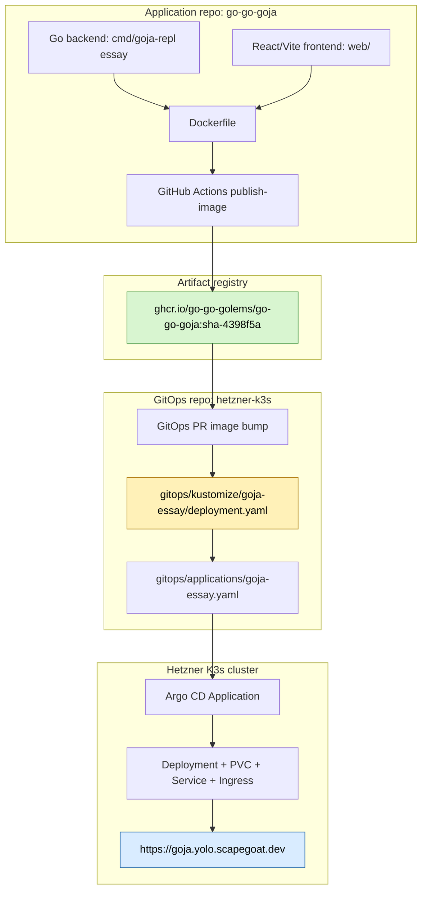
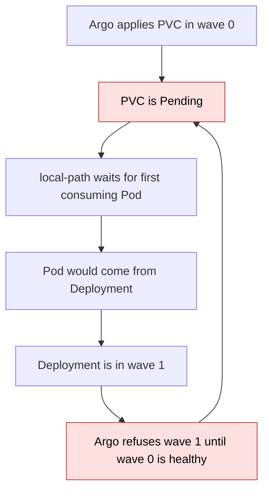

# Goja Essay: Argo CD Deployment Report

This report explains how the `goja-repl essay` web application was packaged, published, deployed to the Hetzner K3s cluster, and validated at `https://goja.yolo.scapegoat.dev/essay/meet-a-session`. The work followed the platform pattern already proven by [[PROJ - Serve Artifacts - Deploying to K3s with GitOps|Serve Artifacts]] and `codebase-browser`: the application repository builds and publishes an immutable image, the GitOps repository records which image should run, and Argo CD reconciles that desired state into the cluster.

The deployment was not merely another stateless web service. The Goja essay creates live REPL sessions, stores them in SQLite, and serves a React/Vite frontend through a Go HTTP backend. That combination added two important wrinkles: the container image had to carry both frontend assets and a CGO-enabled Go binary, and the Kubernetes deployment needed a persistent volume for SQLite. The interesting part of the story is not that the service is now online; it is the sequence of contracts that make it reproducible.

> [!summary]
> 1. `goja-repl essay` is now deployed at `https://goja.yolo.scapegoat.dev/essay/meet-a-session` through GHCR, GitOps, and Argo CD.
> 2. The application image is built from a Node/Vite frontend stage and a CGO-enabled Go backend stage, then runs as a non-root Debian container.
> 3. SQLite persistence works through a `local-path` PVC mounted at `/data`; the first rollout exposed a real Argo CD sync-wave deadlock that was fixed by applying the PVC and Deployment in the same wave.

## Why this deployment exists

The Goja essay is an interactive teaching surface for the `goja-repl` runtime. A static article can describe sessions, policies, bindings, evaluations, and persistence, but an interactive essay can show those ideas by creating real sessions and exposing the actual backend payloads. The user does not have to trust a screenshot. They can click through the essay, create a REPL session, evaluate code, and inspect the state that the backend records.

That is why this deployment matters. A local command such as:

```bash
go run ./cmd/goja-repl essay --addr 127.0.0.1:3091
```

is useful for development, but it is not a public artifact. A public deployment gives the essay a stable address, makes it easy to share, and subjects it to the same operational rules as the rest of the K3s platform. The platform's rule is simple: application repositories build artifacts; the GitOps repository declares runtime state; Argo CD applies that runtime state. No one SSHes into the node to hand-edit a Deployment.

## The mental model: three repositories of truth

A deployment like this works because each layer has a narrow responsibility. The app repo is the truth for source code and image construction. GHCR is the truth for immutable image artifacts. The GitOps repo is the truth for which image and which Kubernetes resources should run. The cluster is not the source of truth; it is the place where the truth is enacted.



This separation is more than bureaucracy. It gives every failure a home. If the image does not build, look at the app repo workflow. If Argo runs the wrong image, look at the GitOps manifest. If the pod cannot start, look at the cluster. The boundaries make debugging possible because they prevent every tool from doing every job.

## The application shape

The deployed command is `goja-repl essay`. Its backend entry point lives at:

```text
/home/manuel/code/wesen/corporate-headquarters/go-go-goja/cmd/goja-repl/essay.go
```

That command creates the REPL application, opens the SQLite-backed store, builds the essay HTTP handler, and starts an HTTP server. The important runtime paths are:

| Path | Role |
|---|---|
| `/` | Redirects to the main essay page |
| `/essay/meet-a-session` | Serves the essay shell |
| `/static/essay/` | Serves built Vite assets |
| `/api/essay/sections/meet-a-session` | Bootstrap JSON used by the page and by health checks |
| `/api/essay/sections/meet-a-session/session` | Creates a real persistent REPL session |
| `/api/essay/sections/meet-a-session/session/<id>` | Reads a saved session snapshot |

The frontend lives under `web/`. Vite builds it into `web/dist/public` with a production base path of `/static/essay/`. The Go handler then finds those files through the environment variable:

```bash
GOJA_REPL_ESSAY_WEB_DIST=/app/web/dist/public
```

That detail matters. The frontend is not embedded into the Go binary with `go:embed`; it is copied into the image and located at runtime. If the image did not set `GOJA_REPL_ESSAY_WEB_DIST`, the backend would fall back to a source-tree-relative lookup that is correct for local development but wrong for a production container.

## Packaging: building two programs into one image

The container image has to build two programs: a TypeScript/React frontend and a Go backend. The Dockerfile therefore uses three stages.

```dockerfile
FROM node:22-slim AS web-builder
WORKDIR /app/web
COPY web/package.json web/pnpm-lock.yaml ./
RUN corepack enable && corepack prepare pnpm@10.15.0 --activate
RUN pnpm install --frozen-lockfile
COPY web/ .
RUN pnpm build

FROM golang:1.26-bookworm AS go-builder
WORKDIR /app
COPY go.mod go.sum ./
RUN go mod download
COPY . .
COPY --from=web-builder /app/web/dist/public ./web/dist/public
RUN CGO_ENABLED=1 go build -ldflags="-s -w" -o bin/goja-repl ./cmd/goja-repl

FROM debian:12-slim
# install certs, create non-root user, copy binary and frontend dist
ENV GOJA_REPL_ESSAY_WEB_DIST=/app/web/dist/public
ENTRYPOINT ["/app/goja-repl"]
CMD ["essay", "--addr", ":8080", "--db-path", "/data/goja-repl.sqlite"]
```

The middle line is the one that looks boring but carries a lot of meaning:

```bash
CGO_ENABLED=1 go build ... ./cmd/goja-repl
```

`goja-repl` uses `mattn/go-sqlite3` through the `repldb` package. That SQLite driver is a CGO binding, not a pure-Go implementation. A statically-linked `CGO_ENABLED=0` binary would either fail to build or fail at runtime when it tried to use SQLite. This is why the runtime image is `debian:12-slim` rather than `distroless/static`. The image needs a normal libc environment.

The final command writes the database here:

```bash
/data/goja-repl.sqlite
```

That path is deliberately outside `/app`. Application code is immutable; runtime state belongs on a mounted volume.

## CI/CD: image first, GitOps second

The GitHub Actions workflow in the app repo is `publish-image.yaml`. It does four jobs in sequence, although GitHub represents them as two workflow jobs:

1. set up Go, pnpm, and Node;
2. build the frontend and run `go test ./...`;
3. build and push `ghcr.io/go-go-golems/go-go-goja:sha-<shortsha>`;
4. open a GitOps PR that patches the deployment image.

The image tag that reached production was:

```text
ghcr.io/go-go-golems/go-go-goja:sha-4398f5a
```

The GitOps PR was:

```text
#38 chore(go-go-goja): bump goja-essay-prod image to sha-4398f5a
```

This image-bump PR is the handshake between application delivery and infrastructure delivery. The application repo does not call `kubectl`. It only says, "I have published a new immutable artifact." The GitOps repo then records, "this is the artifact the cluster should run." Argo CD handles the rest.

A small build fix was needed before this worked: the Vite config uses Node APIs (`node:path`, `process`, and `import.meta.dirname`), but the frontend package did not declare `@types/node`. Because the build script runs `tsc --noEmit && vite build`, the Docker build exposed that missing type dependency. Adding `@types/node` made the frontend build reproducible in a clean container rather than only working in a developer environment with incidental global types.

## The Kubernetes runtime contract

The GitOps package lives here:

```text
/home/manuel/code/wesen/2026-03-27--hetzner-k3s/gitops/kustomize/goja-essay/
```

It contains the usual public web app pieces plus one stateful piece:

| File | Purpose |
|---|---|
| `namespace.yaml` | Creates the `goja-essay` namespace |
| `pvc.yaml` | Allocates 1Gi for SQLite session storage |
| `deployment.yaml` | Runs the `goja-repl essay` image on port 8080 |
| `service.yaml` | Exposes the pod as an internal ClusterIP service on port 80 |
| `ingress.yaml` | Routes `goja.yolo.scapegoat.dev` through Traefik and cert-manager |
| `kustomization.yaml` | Bundles the resources for Argo CD |

The Deployment carries the runtime contract:

```yaml
containers:
  - name: goja-essay
    image: ghcr.io/go-go-golems/go-go-goja:sha-4398f5a
    ports:
      - containerPort: 8080
        name: http
    readinessProbe:
      httpGet:
        path: /api/essay/sections/meet-a-session
        port: http
    livenessProbe:
      httpGet:
        path: /api/essay/sections/meet-a-session
        port: http
    volumeMounts:
      - name: data
        mountPath: /data
volumes:
  - name: data
    persistentVolumeClaim:
      claimName: goja-essay-data
```

The health endpoint is not arbitrary. `/api/essay/sections/meet-a-session` exercises the real essay handler and returns deterministic JSON without requiring a user-created session. A root-page probe would only prove that HTML can be returned. The bootstrap endpoint proves that the API surface the frontend depends on is alive.

## The Argo CD Application is not discovered automatically

One important platform rule surfaced during this work: this Hetzner K3s repo does not currently use an app-of-apps or ApplicationSet pattern for `gitops/applications/`. Committing `gitops/applications/goja-essay.yaml` to Git is necessary, but it is not sufficient. Argo CD does not scan that directory and create new `Application` CRDs by itself.

The first registration is manual:

```bash
kubectl apply -f gitops/applications/goja-essay.yaml
kubectl -n argocd annotate application goja-essay \
  argocd.argoproj.io/refresh=hard --overwrite
```

After that, the Application owns its child resources and Argo CD reconciles future Git changes automatically.

This distinction is worth preserving because it prevents a common misunderstanding. GitOps means the desired runtime state lives in Git; it does not mean every Git file becomes a cluster object without a controller watching that file. Something must create the Argo CD Application. In this platform, that first step is still a bootstrap action.

## The failure mode: local-path PVC plus sync waves

The most instructive bug was the first Argo sync. The initial manifest used this order:

```yaml
Namespace:  sync-wave -1
PVC:        sync-wave  0
Deployment: sync-wave  1
Service:    sync-wave  1
Ingress:    sync-wave  2
```

That looks reasonable if you imagine a PVC like an ordinary prerequisite: create storage first, then create the pod. But the default `local-path` StorageClass behaves differently. It uses `WaitForFirstConsumer`, which means the PVC remains Pending until a pod exists that wants to mount it. The pod comes from the Deployment. The Deployment was in the next sync wave. Argo CD waits for one wave to become healthy before starting the next.

The system therefore formed a small deadlock:



The fix was to put the PVC and Deployment in the same sync wave:

```yaml
PVC:        sync-wave 1
Deployment: sync-wave 1
Service:    sync-wave 1
Ingress:    sync-wave 2
```

Now Argo applies the PVC and the Deployment together. The Deployment creates a pod. The pod consumes the PVC. The local-path provisioner binds the PVC. The pod starts. The Deployment becomes healthy. Then Argo proceeds to the Ingress.

This is the rule to remember: with `WaitForFirstConsumer` storage, do not put a PVC in an earlier Argo sync wave than the pod that consumes it. The PVC is not healthy before the pod; it becomes healthy because of the pod.

## Recovery from the stuck first sync

Changing the manifest fixed future syncs, but the live Argo Application was already stuck in a running operation against the old revision. It had created the PVC, was waiting for it to become healthy, and then a delete/recreate attempt left the Application with a deletion timestamp and the Argo resources finalizer.

The recovery sequence was deliberately direct:

```bash
kubectl -n argocd patch application goja-essay \
  --type=json \
  -p='[{"op":"remove","path":"/metadata/finalizers"}]'

kubectl -n argocd delete application goja-essay --ignore-not-found
kubectl delete namespace goja-essay --ignore-not-found
kubectl wait --for=delete namespace/goja-essay --timeout=120s || true

kubectl apply -f gitops/applications/goja-essay.yaml
kubectl -n argocd annotate application goja-essay \
  argocd.argoproj.io/refresh=hard --overwrite
```

This was not the steady-state deployment path. It was cleanup after an interrupted/stuck sync. Once the stale Application and stale Pending PVC were gone, the fresh Application synced current Git and converged normally.

The important lesson is not "remove finalizers casually." The lesson is narrower: if an Argo Application is already marked for deletion and stuck because a child resource can never become healthy, inspect the finalizer and child resources explicitly. Remove the finalizer only when you understand what resources remain and are prepared to clean them up.

## Validation: proving the deployment, not just observing it

A Kubernetes Deployment being green is necessary, but it is not enough. The validation checked the system from several angles.

First, Argo CD reached the desired steady state:

```text
NAME         SYNC STATUS   HEALTH STATUS
goja-essay   Synced        Healthy
```

Then the namespace resources were present:

```text
pod/goja-essay-...        1/1 Running
pvc/goja-essay-data       Bound, 1Gi, local-path
service/goja-essay        ClusterIP
ingress/goja-essay        goja.yolo.scapegoat.dev
certificate/goja-essay-tls Ready=True
```

Then the public endpoints were tested:

```bash
curl -I http://goja.yolo.scapegoat.dev/essay/meet-a-session
curl -I https://goja.yolo.scapegoat.dev/essay/meet-a-session
curl -fsS https://goja.yolo.scapegoat.dev/api/essay/sections/meet-a-session
```

Finally, persistence was tested by creating a session, deleting the pod, waiting for the replacement pod, and reading the same session again:

```text
session-6ad9c669-a671-4efb-b5b4-52bc26164680
```

The post-restart fetch returned the same session ID and creation timestamp. That proves the application was not merely keeping session data in memory. It was reading the session back from the SQLite database on the PVC.

## What changed in the repositories

In the application repo, the deployment work added:

- `Dockerfile`
- `.dockerignore`
- `.github/workflows/publish-image.yaml`
- `deploy/gitops-targets.json`
- `scripts/open_gitops_pr.py`
- `@types/node` in `web/package.json`

The key app repo commit was:

```text
4398f5a :art: Add image deployment
```

In the GitOps repo, the deployment work added the `goja-essay` Kustomize package and Application, merged the image bump, fixed the PVC sync wave, and recorded the ticket closure:

```text
0494d6d :art: Add goja-essay
80fc94c chore(go-go-goja): bump goja-essay-prod image to sha-4398f5a (#38)
79b2668 fix(goja-essay): move PVC to sync-wave 1 to avoid local-path deadlock
1b53846 docs(goja-essay): record rollout validation
f92b9b0 docs(goja-essay): close rollout ticket
```

The ticket workspace is:

```text
/home/manuel/code/wesen/2026-03-27--hetzner-k3s/ttmp/2026/04/23/HK3S-0022--package-and-deploy-goja-repl-essay-to-k3s-via-argocd
```

## Working rules for the next deployment

The reusable rules from this deployment are compact:

- An app repo should publish immutable `sha-<shortsha>` images and should not mutate the cluster directly.
- A GitOps PR should be the only bridge from a new image to a cluster rollout.
- If a Go service uses `mattn/go-sqlite3`, build with `CGO_ENABLED=1` and use a libc-capable runtime image.
- If a Vite config uses Node globals or Node modules, include `@types/node` so clean CI builds type-check.
- If a workload uses `local-path` PVCs, put the PVC in the same Argo sync wave as the first pod/Deployment that consumes it.
- Do not assume that committing an Argo CD `Application` YAML creates the Application. Unless there is an app-of-apps or ApplicationSet, the first `kubectl apply` is still required.

## Current status

The deployment is complete and live.

- Public URL: `https://goja.yolo.scapegoat.dev/essay/meet-a-session`
- Argo CD: `Synced` and `Healthy`
- TLS certificate: issued and ready
- Runtime image: `ghcr.io/go-go-golems/go-go-goja:sha-4398f5a`
- Persistence: verified across pod deletion and replacement
- Ticket: `HK3S-0022`, closed complete

## Near-term follow-ups

The deployment is working, but there are two useful follow-ups.

First, the PVC sync-wave lesson should be promoted into a reusable platform playbook. It is not specific to Goja; any app using `local-path` storage and Argo CD sync waves can hit the same deadlock.

Second, the public essay should get a quick human browser pass. The API, session creation, HTTPS, and persistence are validated, but a browser pass can catch presentation problems that `curl` cannot: broken asset paths, layout issues, hydration errors, or frontend state transitions that do not surface through the bootstrap endpoint.
