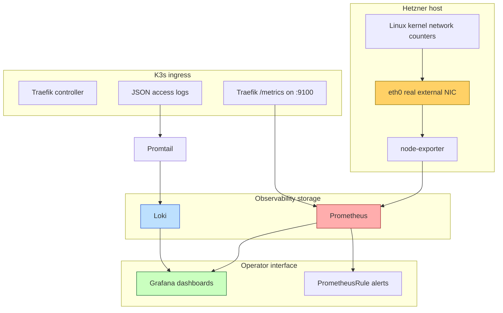

# Observability: Hetzner K3s Metrics, Logging, and Alerting

This report explains the observability system implemented for the Hetzner single-node K3s platform in `/home/manuel/code/wesen/2026-03-27--hetzner-k3s`. The system now answers three questions that matter operationally: how much traffic is leaving the server, which ingress services are responsible for HTTP traffic, and where to look when a request-level investigation needs host, path, status, byte count, or user-agent evidence.

> [!summary]
> - Prometheus and node-exporter measure host-level egress on the real Hetzner NIC, `eth0`, avoiding double-counting overlay interfaces such as `flannel.1`, `cni0`, `veth*`, Docker, loopback, and Tailscale.
> - Traefik is the live ingress controller, so the Kubernetes attribution layer uses Traefik Prometheus metrics and JSON access logs rather than nginx-ingress metrics.
> - Loki and Promtail retain Traefik logs; Grafana now has dashboards for Hetzner egress and Traefik attribution; the next access-control step is Keycloak OIDC or a Tailscale-only exposure path.

The implementation happened in two tickets: `HK3S-0023` established the metrics, alerting, and access-log foundation, and `HK3S-0024` added dashboards plus retained log storage. This note is not a changelog. It is a technical explanation of the design: why each component exists, how data flows through the system, what failed during rollout, and what rules should guide the next changes.

## Why this system exists

A Kubernetes cluster can spend bandwidth in ways that are hard to see from application logs alone. A static site can be crawled aggressively. A public API can return larger responses than expected. A backup job can quietly push data. A Kubernetes overlay can make one packet appear on several interfaces. If you only inspect container logs, you may know which request happened but not how much total traffic left the host. If you only inspect host counters, you may know how many bytes left but not which host, path, service, or user agent caused them.

The observability system deliberately separates those two levels. Host metrics answer the accounting question: "How much did the Hetzner server transmit?" Ingress metrics and logs answer the attribution question: "Which HTTP-facing workload probably caused it?" Keeping those questions separate prevents a common monitoring mistake: trying to turn one data source into a complete truth system. Node-exporter is excellent at kernel counters; it is not an HTTP access log. Traefik access logs are excellent at request context; they are not authoritative for all host egress.

The cluster is currently a single-node K3s platform with Argo CD as the reconciliation layer. That matters because the implementation is not a set of one-off `helm install` commands. Long-lived pieces are represented as Argo CD `Application` resources under `gitops/applications/`, and repo-owned Kubernetes resources live under `gitops/kustomize/`. The operating model is: put desired state in Git, apply the `Application` once, let Argo CD keep the cluster there.

## The mental model

The system has four layers. Each layer has one job.



The first layer is the host. The Linux kernel maintains byte counters per network interface. Node-exporter exposes those counters to Prometheus as metrics such as `node_network_transmit_bytes_total`. The important decision is to select `eth0`, not a broad list of interfaces. On this node, `eth0` is the default route to the outside world. Interfaces like `flannel.1`, `cni0`, and `veth*` are implementation details of Kubernetes networking. Counting them together with `eth0` would count the same logical traffic more than once.

The second layer is ingress. K3s uses Traefik here, not nginx-ingress. Traefik already exposed Prometheus metrics internally; the missing piece was a `PodMonitor` so Prometheus Operator could discover and scrape it. Traefik also needed JSON access logs so the cluster could retain request context: host, path, service, status, bytes, duration, and user-agent.

The third layer is storage. Prometheus stores numeric time series; Loki stores log streams. The system uses both because metrics and logs answer different kinds of questions. A metric query can tell you the current outbound bandwidth with one expression. A log query can tell you which request path was heavy in the last hour. Trying to make logs do all metric work is expensive and awkward; trying to make metrics preserve every request field is impossible.

The fourth layer is operator interface. Grafana presents the dashboards. Prometheus rules define alerts. Argo CD keeps the machinery reconciled.

## What was implemented

The metrics and logging system is represented by these main GitOps files:

| Purpose | File |
|---|---|
| kube-prometheus-stack Argo CD app | `gitops/applications/monitoring.yaml` |
| Loki/Promtail Argo CD app | `gitops/applications/loki.yaml` |
| Monitoring extras Argo CD app | `gitops/applications/monitoring-extras.yaml` |
| Traefik observability Argo CD app | `gitops/applications/traefik-observability.yaml` |
| Hetzner egress Prometheus rules | `gitops/kustomize/monitoring-extras/prometheus-rule-hetzner-egress.yaml` |
| Traefik PodMonitor | `gitops/kustomize/monitoring-extras/podmonitor-traefik.yaml` |
| Hetzner egress dashboard | `gitops/kustomize/monitoring-extras/grafana-dashboard-hetzner-egress.yaml` |
| Traefik attribution dashboard | `gitops/kustomize/monitoring-extras/grafana-dashboard-traefik-attribution.yaml` |
| Traefik JSON access-log config | `gitops/kustomize/traefik-observability/traefik-helmchartconfig.yaml` |
| Grafana Keycloak access plan | `docs/grafana-keycloak-access-playbook.md` |

The live Argo CD Applications reached `Synced Healthy` after rollout:

```text
monitoring              Synced Healthy
monitoring-extras       Synced Healthy
traefik-observability   Synced Healthy
loki                    Synced Healthy
```

The live workload shape is intentionally simple. Prometheus, Grafana, Alertmanager, kube-state-metrics, Prometheus Operator, and node-exporter live in the `monitoring` namespace. Loki and Promtail live in the `logging` namespace. Traefik remains in `kube-system`, managed by K3s' Helm controller, with observability settings applied through a `HelmChartConfig` rather than manual Deployment edits.

## Host egress: the accounting layer

The central host-level metric is:

```promql
node_network_transmit_bytes_total{device="eth0"}
```

The important part of that expression is not the metric name; it is the interface filter. A Kubernetes node has many interfaces, and most are not billing boundaries. During investigation, the node had `lo`, `eth0`, `docker0`, `flannel.1`, `cni0`, many `veth*` devices, and `tailscale0`. The default route used `eth0`, so `eth0` is the best approximation for traffic leaving the Hetzner host through the public network.

The dashboard and alerting rules build from that primitive. Current outbound bandwidth is a rate over a counter:

```promql
sum by (instance) (
  rate(node_network_transmit_bytes_total{device="eth0"}[5m])
) * 8
```

The counter stores bytes. `rate(...[5m])` turns the byte counter into bytes per second, and multiplying by `8` turns bytes into bits. This is the right form for a bandwidth graph because it produces a time series that moves with current traffic.

Twenty-four-hour egress is an increase over the same counter:

```promql
sum by (instance) (
  increase(node_network_transmit_bytes_total{device="eth0"}[24h])
) / 1024 / 1024 / 1024
```

`increase(...[24h])` asks a different question: not "how fast is traffic moving now?" but "how many bytes were transmitted across this counter over this window?" Dividing by `1024^3` presents the result in GiB.

The first alert rule is a budget-style warning:

```promql
sum(increase(node_network_transmit_bytes_total{device="eth0"}[24h]))
  > 500 * 1024 * 1024 * 1024
```

The second is a sustained-rate warning:

```promql
sum(rate(node_network_transmit_bytes_total{device="eth0"}[15m])) * 8
  > 200 * 1000 * 1000
```

These thresholds are initial defaults, not laws of nature. The 500 GiB/24h rule catches large daily transfer events. The 200 Mbit/s rule catches a sustained drain even before the daily total becomes alarming. In practice, these should be tuned against the Hetzner plan, normal workload traffic, and acceptable noise level.

## Traefik metrics: service-level attribution

Host egress gives the total, but not the culprit. Since the cluster uses Traefik, the attribution layer starts with Traefik metrics. The controller already had Prometheus enabled internally with a metrics entrypoint on port `9100`; the implementation added a `PodMonitor` that selects Traefik pods in `kube-system`.

The basic query for request attribution is:

```promql
sum by (service, code, method) (
  rate(traefik_service_requests_total[5m])
)
```

This query asks: for each Traefik backend service, HTTP status, and method, how many requests per second are flowing? It is not byte attribution yet, but it is an excellent first triage view. If egress is high and one service has a sudden request spike, the operator has a direction.

When response byte metrics are available, service byte attribution can be queried as:

```promql
topk(20,
  sum by (service) (
    increase(traefik_service_responses_bytes_total[1h])
  )
)
```

This is the metrics-side approximation of "which service sent the most data in the last hour?" It is fast and cheap because it uses Prometheus counters rather than scanning logs. Its limitation is granularity: the label is a Traefik service name, not an individual path or user agent.

That limitation is exactly why logs were added.

## Traefik JSON logs: request-level attribution

Metrics are aggregated by design. Logs preserve individual events. Traefik JSON access logs now record structured request information such as host, path, status, origin and downstream byte counts, duration, router name, service name, and user-agent. This is the data needed for questions like:

- Which hostname sent the most bytes in the last hour?
- Which path is being crawled?
- Which user agent is responsible for most large responses?
- Which client addresses are producing 403, 404, 429, or 5xx responses?

The final Traefik header policy is allowlist-based:

```text
--accesslog.fields.headers.defaultmode=drop
--accesslog.fields.headers.names.User-Agent=keep
--accesslog.fields.headers.names.X-Forwarded-For=keep
--accesslog.fields.headers.names.X-Real-Ip=keep
--accesslog.fields.headers.names.X-Forwarded-Host=keep
--accesslog.fields.headers.names.X-Forwarded-Proto=keep
```

This policy exists because the first implementation used `headers.defaultmode=keep`, dropping only obvious sensitive headers such as `Authorization`, `Cookie`, and `Set-Cookie`. During validation, Traefik logged `X-Vault-Token` headers from Vault Secrets Operator requests that were routed through the public Vault ingress. That was the most important security lesson in the project: an access log is a data sink, and header logging should be deny-by-default only if the deny list is complete. Deny lists are rarely complete. The safe rule is to drop all headers and keep only those needed for attribution.

After this incident, VSO `VaultConnection` resources for `draft-review`, `hair-booking`, `keycloak`, and `smailnail` were changed from the public Vault hostname to the internal Kubernetes service:

```yaml
spec:
  address: http://vault.vault.svc.cluster.local:8200
  skipTLSVerify: true
```

That change removes routine VSO-to-Vault traffic from Traefik entirely. It also documents a broader rule: in-cluster controllers should not call in-cluster services through public ingress unless there is a specific reason to test the ingress path.

## Loki and Promtail: making logs durable

Container logs are useful for immediate debugging, but they are not a forensic store. Once a pod rotates or restarts, important request history may disappear. Loki fills that gap. Promtail tails Kubernetes container logs and ships them to Loki; Grafana queries Loki through a datasource named `Loki`.

The installed Loki stack is intentionally modest: a single-node `loki-stack` deployment with local-path persistence and a 7-day retention intent. This is not a multi-tenant log platform. It is a pragmatic retention layer for a single-node cluster where the immediate goal is ingress attribution.

The actual live Traefik Loki stream selector is:

```logql
{namespace="kube-system", app="traefik"}
```

That label shape matters. The first dashboard draft used a Kubernetes-style label name, `app_kubernetes_io_name`, but Promtail's relabeling produced `app="traefik"`. The correct rule is simple: write LogQL against Loki's actual stream labels, not the labels you expect from Kubernetes manifests.

A useful host-level LogQL query is:

```logql
topk(20,
  sum by (RequestHost) (
    sum_over_time(
      {namespace="kube-system", app="traefik"}
      | json
      | unwrap OriginContentSize [1h]
    )
  )
)
```

This query parses each Traefik JSON log line, extracts `OriginContentSize`, sums it over the last hour, groups by `RequestHost`, and returns the top twenty. The path-level version groups by both host and path:

```logql
topk(20,
  sum by (RequestHost, RequestPath) (
    sum_over_time(
      {namespace="kube-system", app="traefik"}
      | json
      | unwrap OriginContentSize [1h]
    )
  )
)
```

These queries are not replacements for host egress accounting. They are attribution tools. A host can transmit data that never appears in Traefik logs: image pulls, backups, package downloads, direct pod egress, Tailscale traffic, and any non-HTTP workload. The correct operational workflow is to start with `eth0` totals, then use Traefik metrics and Loki logs to explain the HTTP portion.

## Grafana: dashboards as a teaching surface

Grafana now has two repo-owned dashboards delivered through sidecar ConfigMaps.

The first, `Hetzner Egress`, teaches the host accounting layer. It shows current outbound bandwidth by node, cluster egress over the last 24 hours, current cluster outbound bandwidth, and 24-hour egress by node. In a single-node cluster these panels may seem redundant. That redundancy is useful: it makes the dashboard survive a future second node without changing the core mental model.

The second, `Traefik Attribution`, combines Prometheus and Loki. It shows request rates by Traefik service and status, service byte attribution from Prometheus metrics, host/path byte attribution from Loki, and recent Traefik JSON access logs. The dashboard deliberately crosses the metric/log boundary because real investigations do the same. A Prometheus panel can identify a hot service quickly; a Loki panel can then explain which host or path inside that service was expensive.

Grafana itself exposed a subtle state problem. The pod was healthy, the sidecars wrote dashboard and datasource files, but the sidecars could not reload provisioning because the persisted Grafana database admin password had drifted from the generated Kubernetes Secret. The symptom was a sidecar log line:

```text
401 Unauthorized {"message":"Invalid username or password"}
```

The live repair reset Grafana's admin password to the current `monitoring-grafana` Secret value:

```bash
PASS=$(kubectl -n monitoring get secret monitoring-grafana \
  -o jsonpath='{.data.admin-password}' | base64 -d)

kubectl -n monitoring exec deploy/monitoring-grafana -c grafana -- \
  grafana cli admin reset-admin-password "$PASS"
```

Then dashboard and datasource provisioning were reloaded through the Grafana API. This failure mode is worth remembering: a Kubernetes pod can be ready while application-level provisioning is broken. Readiness proves the HTTP server responds; it does not prove dashboards loaded.

## Rollout failure modes and why they mattered

The project had four important rollout lessons.

First, Grafana persistence and local-path storage required a chown fix. The `init-chown-data` container failed with:

```text
chown: /var/lib/grafana/csv: Permission denied
chown: /var/lib/grafana/pdf: Permission denied
chown: /var/lib/grafana/png: Permission denied
```

The fix added `DAC_OVERRIDE` and `FOWNER` capabilities to the init container while keeping it otherwise constrained. This is not the kind of issue visible in a static manifest review. It appears when a real persistent volume with real file modes meets a restricted init container.

Second, Traefik header logging initially captured Vault token headers. The fix was not merely to add `X-Vault-Token` to a deny list. The fix was to change the model to default-drop headers and allowlist only attribution fields. This is a deeper lesson: logging systems should be designed as if every unreviewed field might contain a secret.

Third, Loki's StatefulSet showed Argo CD `OutOfSync` because of defaulted or immutable StatefulSet/PVC-template fields. The workload was healthy, but Argo CD comparison remained noisy. The solution was an `ignoreDifferences` rule for the specific Loki StatefulSet fields. This is a GitOps lesson: desired state is not merely YAML; it is YAML interpreted through Kubernetes defaults, immutability rules, and controller behavior.

Fourth, dashboard queries had to match real Loki labels. Prometheus labels and Loki labels are not the same namespace. A Kubernetes label like `app.kubernetes.io/name=traefik` may become a Loki label like `app="traefik"`. The correct way to write LogQL is to inspect `/loki/api/v1/series` or label values and then encode what is real.

## Alerting model

The current alerting layer is intentionally small. There are two alerts: daily egress volume and sustained outbound bandwidth. Both are cluster-level early warning signals. They do not try to encode every possible cause.

That restraint matters. Alerting should start with symptoms that require human attention. A 24-hour egress threshold means "this server may be approaching a cost or abuse boundary." A sustained-rate threshold means "something is sending data continuously enough to deserve investigation." Once an alert fires, dashboards and logs explain it.

A good future Alertmanager routing setup would add destinations and severities, but the hard design decision is already present: alert on the billing-relevant host interface, not on overlay traffic.

## Access control: current state and future shape

Grafana is currently not exposed publicly. Operators can use port-forwarding:

```bash
kubectl -n monitoring port-forward svc/monitoring-grafana 3000:80
```

A Keycloak access plan exists in `docs/grafana-keycloak-access-playbook.md`. The intended public model would be:

```text
browser
  -> https://grafana.yolo.scapegoat.dev
  -> Traefik TLS ingress
  -> Grafana generic_oauth
  -> Keycloak realm/client
```

The safer private model discussed afterward is Tailscale exposure. In that model, Grafana remains in the `monitoring` namespace, but a tailnet-only ingress/proxy component would live in a namespace such as `tailnet-ingress`. The endpoint would expose `monitoring/monitoring-grafana` to a Tailscale name like `grafana-k3s-demo-1`, while Grafana authentication remains enabled. Tailscale would answer "can this device reach Grafana?" and Grafana/Keycloak would answer "who is this user and what role do they have?"

That distinction is important. Network privacy is not application identity. A tailnet-only Grafana should still require login.

## Recommended operating sequence

When an egress alert fires, do not start with logs. Start with the counter that caused the alert.

1. Confirm host egress:

   ```promql
   sum(rate(node_network_transmit_bytes_total{device="eth0"}[5m])) * 8
   ```

2. Check 24-hour volume:

   ```promql
   sum(increase(node_network_transmit_bytes_total{device="eth0"}[24h])) / 1024 / 1024 / 1024
   ```

3. Check Traefik services:

   ```promql
   sum by (service, code, method) (rate(traefik_service_requests_total[5m]))
   ```

4. If HTTP traffic looks suspicious, move to Loki:

   ```logql
   topk(20,
     sum by (RequestHost, RequestPath) (
       sum_over_time(
         {namespace="kube-system", app="traefik"}
         | json
         | unwrap OriginContentSize [1h]
       )
     )
   )
   ```

5. If Traefik does not explain the host egress, investigate non-ingress sources: backups, image pulls, package downloads, direct pod egress, Tailscale traffic, or node-level processes.

This sequence prevents a common debugging mistake. If host egress is high but Traefik logs are quiet, the answer is not to distrust node-exporter. The answer is that traffic may not be HTTP ingress traffic.

## Current status

The implemented system is live and reconciled through Argo CD. The current capabilities are:

- Host egress metrics on `eth0` through node-exporter and Prometheus.
- Prometheus alerts for 24-hour egress volume and sustained outbound rate.
- Traefik metrics scraped by Prometheus through a `PodMonitor`.
- Traefik JSON access logs with a default-drop header policy.
- Loki/Promtail log retention for Kubernetes container logs, including Traefik streams.
- Grafana dashboards for Hetzner egress and Traefik attribution.
- Grafana datasource wiring for Prometheus, Alertmanager, and Loki.
- Documentation for future Keycloak OIDC access.
- VSO VaultConnections moved to the internal Vault service to avoid routing secret sync traffic through Traefik.

The main open decisions are access and hardening. Grafana should either remain port-forward-only, be exposed privately over Tailscale, or be exposed publicly with Keycloak OIDC. Grafana admin credentials should eventually be managed through Vault/VSO rather than relying on generated chart secrets with persistent Grafana state. Promtail should eventually be revisited because Grafana Alloy is the newer long-term direction.

## Working rules

The durable rules from this project are short and strict.

- Count host egress on the real external NIC, `eth0`, not on Kubernetes overlay interfaces.
- Use Traefik metrics for service-level ingress attribution because Traefik is the actual ingress controller.
- Use Loki logs for host/path/user-agent attribution because metrics cannot preserve request-level context.
- Drop access-log headers by default and allowlist only fields needed for attribution.
- Keep in-cluster controller traffic on Kubernetes service DNS unless public ingress is explicitly part of the test.
- Treat Argo CD `Healthy` and `Synced` as necessary but not sufficient; validate the actual query path in Prometheus, Loki, and Grafana.
- Keep Grafana authentication enabled even if the network path is private.

## Related project artifacts

- Source repo: `/home/manuel/code/wesen/2026-03-27--hetzner-k3s`
- HK3S-0023 diary: `/home/manuel/code/wesen/2026-03-27--hetzner-k3s/ttmp/2026/04/25/HK3S-0023--add-prometheus-and-traefik-observability-for-hetzner-egress/reference/01-diary.md`
- HK3S-0024 diary: `/home/manuel/code/wesen/2026-03-27--hetzner-k3s/ttmp/2026/04/25/HK3S-0024--add-grafana-dashboards-and-loki-ingress-log-attribution/reference/01-diary.md`
- Grafana Keycloak plan: `/home/manuel/code/wesen/2026-03-27--hetzner-k3s/docs/grafana-keycloak-access-playbook.md`
