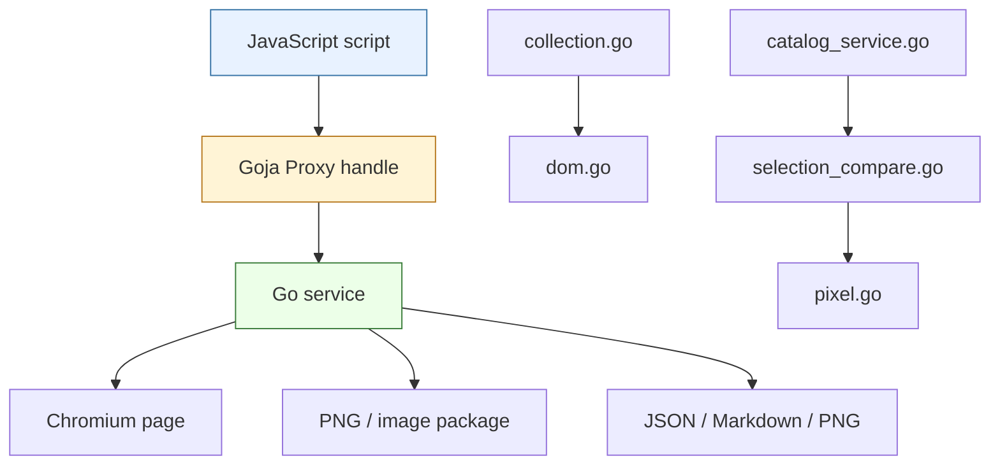

# Design Principles and Proxy Patterns in the CSS Visual Diff JavaScript API

This report explains the design of the new `css-visual-diff` JavaScript API from first principles. It is not a changelog, although it refers to implementation phases and files. The purpose is to preserve the architecture: why the API ended up with `Locator`, `CollectedSelection`, `SelectionComparison`, `cvd.compare.region(...)`, and Go-backed Proxy handles; why raw JavaScript objects were rejected for the new primitives; and how the implementation gives both humans and LLM-written scripts better feedback when they make mistakes.

> [!summary]
> - The API evolved from “expose one pixel comparison helper” into a coherent object model: live browser handles, immutable collected data, deterministic comparison data, and explicit artifact/report views.
> - Goja Proxy handles are the key implementation pattern. They let Go own behavior, validation, object identity, and custom error messages while still giving JavaScript a fluent object interface.
> - The final design intentionally separates quick paths from primitives. `cvd.compare.region(...)` is the low-effort path; `locator.collect(...)` plus `cvd.compare.selections(...)` is the composable path.
> - The API is designed for scripts written by both people and coding agents. That means errors should teach the next correct action instead of merely saying “undefined is not a function.”

## 1. The problem was not “we need a function”

The initial pressure came from a practical need: a downstream Pyxis workflow could reproduce a YAML visual comparison with `css-visual-diff`, but project-local JavaScript scripts could not call the same region/pixel comparison primitive through the documented public module. A narrow interpretation of the request would have produced a helper like this:

```js
await cvd.comparePixels({
  left: { page, selector: "#root" },
  right: { page, selector: "[data-page='archive']" },
})
```

That would have been fast to ship. It would also have been the wrong foundation. A rendered region comparison is not only a pixel operation. It includes selector readiness, bounds, screenshots, text, computed styles, attributes, normalized image sizes, diff artifacts, JSON output, Markdown output, and often a human policy decision. If the public API centers on `comparePixels`, then every non-pixel concept looks like an afterthought.

The better design question was: what are the domain objects?

The answer became:

```text
Browser → Page → Locator → CollectedSelection → SelectionComparison → Report / Artifacts / Catalog
```

This chain gives each object one responsibility. A page is live browser state. A locator is a live selector on a page. A collected selection is immutable browser evidence. A selection comparison is deterministic analysis over two collected selections. Reports and artifacts are views over that comparison. Catalogs collect those views into durable manifests.

The important shift is from “call a function that compares pixels” to “build a small model of visual evidence.” Once the model exists, pixel comparison becomes one view, style comparison another, bounds comparison another, and cataloging another.

## 2. The experiments that shaped the API

Several experiments and implementation passes shaped the final design.

### Experiment 1: Internal helper modules were useful but not public

The old built-in compare verb used private modules:

```js
require("diff").compareRegion(...)
require("report").renderAgentBrief(...)
```

These modules were pragmatic. They let the built-in command call Go functionality without exposing a polished public API. But they were not a good surface for user scripts. Their names were too generic, their shapes were mode-driven, and they did not compose naturally with the rest of `require("css-visual-diff")`.

The lesson was:

> Internal helper modules are allowed to exist while building, but they should not define the public mental model.

Phase 8 applied that lesson by rewriting the built-in compare verbs to dogfood the public API:

```js
const cvd = require("css-visual-diff")
const comparison = await cvd.compare.region({ ... })
```

That was a decisive test. If the built-in command could be implemented using the public API, then project-local scripts could use the same path.

### Experiment 2: Raw `{ page, selector }` objects were too weak

A raw object is easy to type:

```js
{ page, selector: "#cta" }
```

But it loses too much information. The Go side cannot know whether it is a real page handle, a stale page-like object, a typo from an LLM, or a user-created object with the right properties but wrong identity. The API would have to validate late and give vague errors.

The new API requires a real locator handle:

```js
leftPage.locator("#cta")
```

That locator is a Go-backed Proxy with a registry identity. When `cvd.compare.region(...)` receives it, Go can unwrap it and prove that it is a `cvd.locator`. If the user passes a raw object, the error can say what to do next:

```text
css-visual-diff.compare.region: expected cvd.locator
```

The lesson was:

> New behavior-rich APIs should accept handles, not lookalike objects.

Compatibility with raw objects may remain in older high-level APIs, but the new lower-level primitives should be strict.

### Experiment 3: Collection and comparison are separate operations

It is tempting to make locators compare directly:

```js
await leftPage.locator("#cta").compare(rightPage.locator("#cta"))
```

That reads nicely, but it hides a crucial boundary. A locator is live. A comparison should be over stable evidence. If comparison keeps asking the browser questions, page mutation can leak into the result.

The API therefore exposes collection explicitly:

```js
const left = await leftPage.locator("#cta").collect({ inspect: "rich" })
const right = await rightPage.locator("#cta").collect({ inspect: "rich" })
const comparison = await cvd.compare.selections(left, right)
```

The quick helper is allowed, but it is explainable as a composition:

```js
await cvd.compare.region({ left: leftLocator, right: rightLocator })
```

means:

```text
collect left
collect right
capture screenshots
compare collected selections
return comparison handle
```

The lesson was:

> Quick APIs are best when they are thin compositions of explicit primitives.

This keeps the simple path convenient without hiding the real model from advanced users.

## 3. The final public model

The canonical API now has two paths.

### The quick path

Use this when you want an answer and artifacts with minimal ceremony:

```js
const comparison = await cvd.compare.region({
  name: "cta",
  left: leftPage.locator("#cta"),
  right: rightPage.locator("#cta"),
  outDir: "artifacts/cta",
  threshold: 30,
})

await comparison.artifacts.write("artifacts/cta", ["json", "markdown"])
return comparison.summary()
```

This path chooses sensible defaults: `inspect: "rich"`, threshold `30`, region screenshots, pixel diff PNGs, and a `SelectionComparison` handle.

### The primitive path

Use this when you want custom JavaScript analysis:

```js
const left = await leftPage.locator("#cta").collect({
  inspect: "rich",
  styles: ["font-size", "line-height", "color"],
  attributes: ["class"],
})

const right = await cvd.collect.selection(rightPage.locator("#cta"), {
  inspect: "rich",
  styles: ["font-size", "line-height", "color"],
  attributes: ["class"],
})

const comparison = await cvd.compare.selections(left, right, {
  styleProps: ["font-size", "line-height", "color"],
  attributes: ["class"],
})

return {
  summary: comparison.summary(),
  typography: comparison.styles.diff(["font-size", "line-height"]),
  classChanges: comparison.attributes.diff(["class"]),
  bounds: comparison.bounds.diff(),
}
```

This path lets a project encode policy in JavaScript. The API provides rich evidence; the project decides what evidence matters.

### Canonical namespaces

The API now prefers explicit namespaces:

```js
cvd.collect.selection(...)
cvd.compare.region(...)
cvd.compare.selections(...)
cvd.image.diff(...)
cvd.diff.structural(...)
cvd.snapshot.page(...)
cvd.catalog.create(...)
cvd.config.load(...)
```

The old top-level names were convenient but ambiguous. For example, in a visual diff tool, `cvd.diff(...)` could mean structural diff, CSS diff, image diff, or selection diff. `cvd.diff.structural(...)` removes the ambiguity.

## 4. Why Go-backed Proxies are the implementation pattern

JavaScript APIs often expose plain objects. That works well for data, but it works poorly for behavior-rich domain objects that must enforce invariants. The new API uses a different pattern:

```text
Go struct + registry identity + Goja Proxy traps = JavaScript handle
```

The Go struct owns the real state. The Proxy controls what JavaScript can access. The registry proves identity when one API receives a handle created by another API.

The core files are:

```text
internal/cssvisualdiff/jsapi/proxy.go
internal/cssvisualdiff/jsapi/unwrap.go
```

The shape is:

```go
type ProxySpec struct {
    Owner        string
    Methods      map[string]ProxyMethod
    Properties   map[string]ProxyProperty
    MethodOwners map[string]MethodSpec
}
```

A handle is created with:

```go
newProxyValue(vm, nil, ProxySpec{
    Owner: "cvd.locator",
    Methods: map[string]ProxyMethod{
        "status": locator.status(ctx, vm),
        "text": locator.text(ctx, vm),
        "collect": locator.collect(ctx, vm),
    },
    MethodOwners: map[string]MethodSpec{
        "styles": {
            Owner: "cvd.probe",
            Hint: "For direct style reads on a locator, use .computedStyle([\"color\"]) instead.",
        },
    },
}, locator)
```

The backing Go value is registered:

```go
id := registry.bind(spec.Owner, backing)
target.Set("__cssVisualDiffProxyID", id)
```

Later, strict APIs unwrap it:

```go
locator := mustUnwrapProxyBacking[locatorHandle](
    vm,
    defaultProxyRegistry,
    "css-visual-diff.compare.region",
    call.Argument(0),
    "cvd.locator",
)
```

This gives the Go side three powers that plain objects do not provide:

1. It can reject raw objects.
2. It can reject the wrong kind of handle.
3. It can produce an error that teaches the correct next step.

## 5. Custom error feedback for humans and LLMs

A normal JavaScript object fails like this:

```text
TypeError: locator.styles is not a function
```

That error tells the user what went wrong but not how to recover. The Proxy pattern can do better because it knows which object received the call and which object owns the method.

For example, `.styles(...)` belongs to probes, while `.computedStyle(...)` belongs to locators. If a user calls:

```js
page.locator("#cta").styles(["color"])
```

the API can say:

```text
cvd.locator: .styles() is not available here. .styles() belongs to cvd.probe.
For direct style reads on a locator, use .computedStyle(["color"]) instead.
```

That kind of error is valuable for humans. It is even more valuable for coding agents. An LLM that sees “not a function” may invent another method. An LLM that sees “use `.computedStyle(["color"])` instead” has a good chance of correcting itself.

The same mechanism handles unknown methods. If the available methods are `styles` and the user writes `style`, the proxy can suggest the closest match:

```text
cvd.probe: unknown method .style(). Available: styles. Did you mean .styles()?
```

This is not decoration. It is an API design principle:

> In a scriptable tool, errors are part of the user interface.

The API should assume scripts will be written, edited, and repaired interactively. Good errors reduce the cost of that loop.

## 6. The registry is what makes handles real

A Proxy alone controls property access. The registry gives object identity.

The registry stores:

```go
type proxyBinding struct {
    Owner string
    Value any
}
```

When JavaScript passes a value into a strict API, `unwrapProxyBacking` reads the hidden proxy ID, looks up the binding, checks the owner, and type-asserts the backing Go value.

The key check is:

```go
if binding.Owner != owner {
    return nil, fmt.Errorf("%s: expected %s, got %s", operation, owner, binding.Owner)
}
```

This lets `cvd.compare.selections(...)` enforce that its arguments are `cvd.collectedSelection` handles:

```js
await cvd.compare.selections(leftCollected, rightCollected)
```

If the user passes locators instead, the API can reject them. If the user passes raw JSON, it can reject that too. This strictness is deliberate. Raw JSON comparison may become a separate explicit API later, but it should not be smuggled into a handle-oriented function.

This is the difference between structural compatibility and semantic compatibility. A raw object can have the same fields. It is not the same kind of thing.

## 7. The `.then` trap: Promise-first APIs and Proxies

The API is Promise-first. Browser work, file writes, collection, comparison, and reports that touch disk all return Promises. That means many Proxy handles are resolved from Promises:

```js
const selected = await page.locator("#cta").collect()
```

When a JavaScript Promise resolves to an object, the Promise machinery checks whether the object is a thenable by reading its `.then` property. A strict Proxy sees every property read. The first implementation treated unknown properties as errors, so `await locator.collect()` failed with:

```text
TypeError: cvd.collectedSelection: unknown method .then(). Available: attributes, bounds, status, styles, summary, text, toJSON.
```

The fix is simple but important:

```go
if property == "then" {
    return goja.Undefined()
}
```

Returning `undefined` tells Promise resolution that the handle is not a thenable. The handle can then be awaited normally.

This produced a durable rule:

> Any Proxy handle that can be resolved from a Promise must be `.then`-safe.

Without this rule, strict Proxy APIs and Promise-first APIs fight each other.

## 8. Method namespaces: why `comparison.styles.diff()` is a property, not a method

The early Proxy infrastructure only supported methods. That worked for simple handles:

```js
locator.text()
locator.bounds()
locator.attributes(["class"])
```

A comparison object wants a richer shape:

```js
comparison.pixel.summary()
comparison.bounds.diff()
comparison.styles.diff(["color"])
comparison.attributes.diff(["class"])
comparison.report.markdown()
comparison.artifacts.write(outDir, ["json", "markdown"])
```

These are not all methods on the comparison. They are small namespaces under the comparison. This mirrors the domain: pixel evidence, bounds evidence, style evidence, attribute evidence, reports, and artifacts are different views over the same comparison.

The Proxy infrastructure therefore gained `Properties`:

```go
type ProxyProperty func(receiver goja.Value) goja.Value

type ProxySpec struct {
    Owner      string
    Methods    map[string]ProxyMethod
    Properties map[string]ProxyProperty
}
```

Now `comparison.styles` can return an object with a `diff` function. That object does not need its own registry identity because it is just a view over the parent comparison handle. The comparison handle remains the behavior-rich object; the nested object is a convenience view.

This design keeps the public API readable without turning `SelectionComparison` into a bag of dozens of flat methods like `styleDiff`, `attributeDiff`, `boundsDiff`, `pixelSummary`, `writeReportMarkdown`, and so on.

## 9. Service-first implementation

The Proxy layer is important, but it is not where the core work belongs. The browser and image operations live in services:

```text
internal/cssvisualdiff/service/collection.go
internal/cssvisualdiff/service/pixel.go
internal/cssvisualdiff/service/selection_compare.go
internal/cssvisualdiff/service/catalog_service.go
```

The service layer is plain Go. That means it can be tested without Goja when possible. It also means CLI modes, built-in verbs, and future adapters can reuse the same logic.

A simplified dependency diagram looks like this:



The service-first rule is:

> If an operation has durable domain meaning, implement it in Go services first, then wrap it in JS.

That rule avoided a common trap: writing JavaScript glue that accidentally becomes the real implementation.

## 10. CollectedSelection: the immutable evidence object

`CollectedSelection` is the first major service-backed value.

It answers: “What did the browser say about this selector at this moment?”

The Go schema is:

```go
type CollectedSelectionData struct {
    SchemaVersion  string             `json:"schemaVersion"`
    Name           string             `json:"name,omitempty"`
    URL            string             `json:"url,omitempty"`
    Selector       string             `json:"selector"`
    Exists         bool               `json:"exists"`
    Visible        bool               `json:"visible"`
    Bounds         *Bounds            `json:"bounds,omitempty"`
    Text           string             `json:"text,omitempty"`
    ComputedStyles map[string]string  `json:"computedStyles,omitempty"`
    Attributes     map[string]string  `json:"attributes,omitempty"`
    Screenshot     *ScreenshotDescriptor `json:"screenshot,omitempty"`
}
```

The JS handle exposes:

```js
selected.summary()
selected.toJSON()
selected.status()
selected.bounds()
selected.text()
selected.styles(["color"])
selected.attributes(["class"])
```

The explicit `summary()` / `toJSON()` pattern is a boundary marker. The handle has behavior. The lowered value is data. Scripts can return lowered values to the CLI, write them to JSON, put them in catalogs, or compare them structurally.

The important design principle is:

> Behavior-rich handles should not pretend to be plain data. They should provide deliberate lowering methods.

This matters for long-running scripts and for LLMs. If a handle serializes accidentally, it may produce confusing internals or empty objects. If the script must call `toJSON()`, the intent is clear.

## 11. SelectionComparison: the central analysis object

`SelectionComparison` compares two collected selections. It is central because it combines the evidence users care about:

- pixel changes,
- bounds deltas,
- text changes,
- style changes,
- attribute changes,
- artifact links,
- report rendering.

The Go service result is:

```go
type SelectionComparisonData struct {
    SchemaVersion string              `json:"schemaVersion"`
    Name          string              `json:"name,omitempty"`
    Left          SelectionSummary    `json:"left"`
    Right         SelectionSummary    `json:"right"`
    Pixel         *PixelDiffResult    `json:"pixel,omitempty"`
    Bounds        BoundsDiff          `json:"bounds"`
    Text          TextDiff            `json:"text"`
    Styles        []MapValueDiff      `json:"styles,omitempty"`
    Attributes    []MapValueDiff      `json:"attributes,omitempty"`
    Artifacts     []SelectionArtifact `json:"artifacts,omitempty"`
}
```

The JS handle turns that data into a queryable object:

```js
comparison.pixel.summary()
comparison.bounds.diff()
comparison.styles.diff(["font-size", "color"])
comparison.attributes.diff(["class"])
comparison.report.markdown()
comparison.artifacts.list()
```

The comparison does not re-query the browser. That invariant is what makes it deterministic. Once `SelectionData` exists, comparison is pure except for optional artifact writing. This separation also makes test coverage simpler: service tests can construct synthetic selections and compare them without launching Chromium.

## 12. `cvd.compare.region`: the low-effort wrapper that does not hide the model

The quick path is:

```js
await cvd.compare.region({ left, right, outDir })
```

The implementation does not call an old mode. It uses the new primitives:

```text
validate left and right are cvd.locator handles
collect left under left page lock
capture left region screenshot
collect right under right page lock
capture right region screenshot
compare selections
return cvd.selectionComparison handle
```

This is important. A good convenience function should not become a second implementation. It should compose the primitives users could have called themselves. That makes the API teachable:

```js
// quick
const comparison = await cvd.compare.region({ left, right })

// expanded
const collectedLeft = await left.collect({ inspect: "rich" })
const collectedRight = await right.collect({ inspect: "rich" })
const comparison = await cvd.compare.selections(collectedLeft, collectedRight)
```

The quick path is low-effort, but it is not magical.

## 13. Page serialization and avoiding hidden parallelism

Browser page operations are serialized per page. This is implemented with `pageState.runExclusive(...)`. The design decision is pragmatic: CDP operations on one page are mostly serialized anyway, and hidden per-page concurrency produces confusing failures.

The API still remains Promise-first:

```js
const [left, right] = await Promise.all([
  leftPage.locator("#cta").collect(),
  rightPage.locator("#cta").collect(),
])
```

But internally, operations on the same page are protected.

`cvd.compare.region(...)` avoids nested locks by collecting each side under its own page lock and then comparing data after locks are released. Same-page comparisons serialize naturally. Different-page comparisons are safe. Future optimization could collect different pages in parallel, but the correctness boundary is already clear.

The principle is:

> Parallelism should be coarse and explicit. Browser/page correctness matters more than pretending every CDP operation can run at once.

## 14. Catalog integration: comparisons become durable workflow records

A comparison is useful by itself. A catalog is useful when a script compares many things.

Phase 9 added:

```js
catalog.record(comparison, target?)
```

A workflow can now do:

```js
const catalog = cvd.catalog.create({
  title: "Homepage visual checks",
  outDir,
  artifactRoot: "artifacts",
})

const comparison = await cvd.compare.region({
  name: "cta",
  left: leftPage.locator("#cta"),
  right: rightPage.locator("#cta"),
  outDir: catalog.artifactDir("cta"),
})

await comparison.artifacts.write(catalog.artifactDir("cta"), ["json", "markdown"])
catalog.record(comparison, { slug: "cta", name: "CTA", url: leftUrl, selector: "#cta" })

await catalog.writeManifest()
await catalog.writeIndex()
```

The catalog manifest now has `comparisons`, and the index renders a `## Comparisons` table. This continues the same design philosophy: comparison data is the source of truth; reports, artifacts, and catalogs are views over it.

## 15. Error feedback as API surface

The most interesting design pattern is not any one method. It is the way the API tries to make wrong code recoverable.

Examples:

| Mistake | Better feedback |
|---|---|
| Calling `.styles()` on a locator. | Explain that `.styles()` belongs to probes and suggest `.computedStyle(...)`. |
| Passing raw `{ selector: "#cta" }` to `cvd.compare.region`. | Say `expected cvd.locator`, pointing users toward `page.locator(selector)`. |
| Passing a locator to `cvd.compare.selections`. | Explain that selections must be collected first. |
| Misspelling a method. | Show available methods and suggest the closest one. |

This is why the Proxy pattern matters. Plain JavaScript objects cannot easily enforce these domain-specific mistakes. Go-backed Proxies can.

For LLM-written code, this may be the difference between a dead end and a self-correcting loop. The error message becomes a local instruction.

## 16. Why no workflow builder

The API deliberately avoids a workflow builder. There is no object like:

```js
cvd.workflow()
  .target(...)
  .compare(...)
  .report(...)
  .run()
```

That might look elegant at first, but it duplicates JavaScript. JavaScript already has functions, arrays, loops, conditionals, error handling, modules, and object literals. The API should provide strong primitives, not a second programming language.

A real multi-section workflow can just be JavaScript:

```js
const sections = [
  { name: "hero", selector: "#hero" },
  { name: "cta", selector: "#cta" },
  { name: "footer", selector: "footer" },
]

for (const section of sections) {
  const comparison = await cvd.compare.region({
    name: section.name,
    left: leftPage.locator(section.selector),
    right: rightPage.locator(section.selector),
    outDir: catalog.artifactDir(section.name),
  })
  await comparison.artifacts.write(catalog.artifactDir(section.name), ["json", "markdown"])
  catalog.record(comparison, { slug: section.name, selector: section.selector })
}
```

This is easier to debug than a custom workflow DSL and easier for LLMs to generate correctly.

## 17. The public examples as design proof

The public examples now show the API's two main paths.

`examples/verbs/compare-region.js` teaches the low-effort path:

```js
const comparison = await cvd.compare.region({ ... })
return comparison.summary()
```

`examples/verbs/collect-and-analyze.js` teaches the primitive path:

```js
const left = await leftPage.locator(selector).collect(...)
const right = await cvd.collect.selection(rightPage.locator(selector), ...)
const comparison = await cvd.compare.selections(left, right, ...)
const typographyDiffs = comparison.styles.diff([...])
```

These examples are more than documentation. They are executable tests. The Phase 10 smoke starts a local HTTP server, runs the examples through the actual `css-visual-diff verbs --repository examples/verbs ...` path, and checks outputs.

That validation matters because docs often drift. Executable examples keep the public contract honest.

## 18. Real-site validation

The implementation was also validated against live HTTPS pages through the built-in compare verb, which now uses the public API.

Equivalent-content sanity check:

```text
left:  https://example.com/ body
right: https://example.org/ body
changedPercent: 0
changedPixels: 0
bounds.changed: false
text.changed: false
```

Different-content validation:

```text
left:  https://example.com/ body
right: https://www.iana.org/domains/reserved main
changedPercent: 10.295429500970773
changedPixels: 98100
bounds.changed: true
text.changed: true
style changes: background-color, color, font-family
```

The artifacts are stored in the ticket validation folder. This does not prove every production site will be easy — login flows, animations, cookie banners, and lazy loading remain hard — but it proves the API works outside synthetic local fixtures.

## 19. Design rules that emerged

The final design can be summarized as a set of working rules.

- A public API should expose domain concepts, not implementation history.
- Quick paths should compose primitives rather than bypass them.
- Live browser handles and immutable evidence values should be separate objects.
- New behavior-rich APIs should accept strict handles, not raw lookalike objects.
- Go services should own durable domain behavior; JS adapters should wrap them.
- Proxy handles should provide method-owner errors and recovery hints.
- Promise-returned Proxy handles must be `.then`-safe.
- Reports, artifacts, and catalogs should be views over comparison data.
- JavaScript should remain the workflow language; the API should not invent a workflow builder.
- Public examples must be executable, not merely illustrative.

These rules are more valuable than any one function. They can guide the next API additions.

## 20. Open questions and future refinement

Several questions remain.

### Should old aliases be removed completely?

The public docs now teach canonical names, but some old top-level aliases still exist internally. Since backward compatibility is not required, a future cleanup could remove them. The tradeoff is whether to do that immediately or after downstream scripts have had a chance to move.

### Should `catalog.record` store full comparison data?

It currently stores full `SelectionComparisonData`. That is useful and simple. For very large batch runs, manifests may grow. A future catalog schema could store compact summaries plus links to full comparison JSON files.

### Should screenshot collection become part of `locator.collect()`?

`cvd.compare.region(...)` captures screenshots. Plain `locator.collect()` currently focuses on DOM/style/text/attribute facts. A future option could support screenshot capture directly:

```js
await locator.collect({ inspect: "rich", screenshot: true })
```

The artifact semantics should be designed carefully before adding this.

### Should real-site smoke be replayable by default?

External network smokes are useful but can be flaky. They are excellent manual validation and optional CI checks, but local fixture tests remain the right default regression suite.

## 21. How to continue safely

A future maintainer should start with the service layer, then the JS handles.

Read in this order:

```text
internal/cssvisualdiff/service/collection.go
internal/cssvisualdiff/service/pixel.go
internal/cssvisualdiff/service/selection_compare.go
internal/cssvisualdiff/service/catalog_service.go
internal/cssvisualdiff/jsapi/proxy.go
internal/cssvisualdiff/jsapi/collect.go
internal/cssvisualdiff/jsapi/compare.go
internal/cssvisualdiff/jsapi/catalog.go
internal/cssvisualdiff/dsl/scripts/compare.js
examples/verbs/compare-region.js
examples/verbs/collect-and-analyze.js
```

Validate with:

```bash
go test ./... -count=1
ttmp/2026/04/25/CSSVD-JSAPI-PIXEL-WORKFLOWS--design-js-api-additions-for-pixel-comparison-and-workflow-orchestration/scripts/010-public-examples-smoke.sh
```

If adding a new handle, follow the Proxy rules:

1. Give it a precise owner name, such as `cvd.someHandle`.
2. Register it in the Proxy registry.
3. Reject raw objects at API boundaries.
4. Add method-owner hints for likely mistakes.
5. Make sure it is safe when returned from a Promise.
6. Provide `summary()` and/or `toJSON()` if it represents durable data.

## 22. Closing

The new API is not just a set of methods. It is a model for writing visual feedback loops in JavaScript while keeping browser and image operations reliable in Go. The design works because it respects boundaries: live versus collected, data versus behavior, quick path versus primitive path, public API versus internal helper, JavaScript orchestration versus Go services.

The Proxy pattern is the hinge. It lets the API feel like JavaScript without giving up Go's ability to validate, unwrap, type-check, and explain. That is especially important in a world where scripts are often written with assistance from coding agents. A good API does not merely execute correct code. It helps incorrect code become correct.
