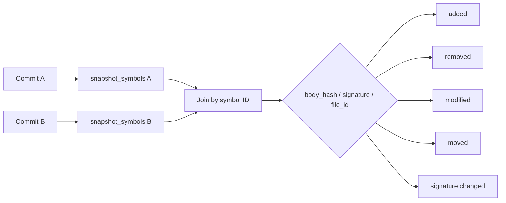

# Embeddable Semantic Diff Widgets for Literate PR Review

This note explains the `codebase-browser` semantic review widget work as a technical deep dive. The goal is not only to record which widgets were added, but to explain the architecture well enough that a future maintainer can build the next widget without rediscovering the same invariants. The central idea is simple: a markdown review guide should be able to contain live code review tools — snippets at old commits, body diffs, symbol timelines, impact lists, changed-file summaries, and annotations — while the reader stays inside the narrative.

> [!summary]
> - The project turns markdown from passive prose into an interactive review surface. A fenced directive such as `codebase-diff` becomes a hydrated React widget backed by the history database.
> - The load-bearing design is the split between **static source browsing** and **history-backed semantic snapshots**. Static index data is fast and embedded; history data is multi-commit and lives in SQLite.
> - The implementation proceeded in vertical slices. Each slice delivered one working result: `commit=` snippets, inline diffs, symbol timelines, impact analysis, quick review widgets, and polish.
> - The hardest bugs were not algorithmic. They were boundary bugs: missing `wasm_exec.js`, stale WASM precomputed docs, invalid JSON in HTML attributes, and links from history-derived symbols into static-index routes.

## 1. Why this project had to exist

A pull request review is a reading task, but most review tools present it as a line-diff task. The reviewer sees a file, a hunk, and a handful of green and red lines. From that raw material they reconstruct the question they actually care about: which symbol changed, who calls it, whether the signature changed, what commits led here, and where to focus attention first.

That reconstruction is expensive because it usually happens across several windows. The author's PR description is in one place. The GitHub diff is in another. The local editor or terminal is needed for `git log`, `git blame`, `grep`, and caller searches. The reviewer moves between those places while trying not to lose the thread of the review.

The `codebase-browser` already had the ingredients for a better review surface. It could index symbols and references. It could render markdown docs. It could hydrate source snippets inside those docs. It later grew a history database that tracks symbol bodies across commits. The missing move was to compose those capabilities so that a review guide could say:

```markdown
This function changed because we needed commit-aware snippets:

```codebase-diff sym=sym:...handleSnippet from=c913257... to=e457069...
```

Here is who calls the helper that changed:

```codebase-impact sym=sym:...writeJSON dir=usedby depth=2
```
```

The design question is not "can markdown contain code blocks?" It already can. The design question is whether markdown can become a small, stable protocol between prose and live code intelligence. In GCB-010, the answer is yes: `codebase-*` fences are that protocol.

## 2. The mental model

The easiest way to understand the system is to separate three concerns.

1. **The index knows what the code is.** It records packages, files, symbols, byte ranges, signatures, docs, and references.
2. **The history database knows how those things changed.** It stores per-commit snapshots of the same semantic entities.
3. **The markdown renderer knows where the reader wants a widget.** It turns fenced directives into DOM stubs that React can hydrate.

Those three responsibilities deliberately do not collapse into one. The renderer does not compute diffs. The frontend does not parse Go. The history endpoint does not know about prose. Each layer does one job and hands structured information to the next.

```mermaid
flowchart TD
    MD[Markdown review guide] --> R[Go markdown renderer]
    R --> Stub[HTML stub with data-directive and data-params]
    Stub --> React[React doc hydration]
    React --> API[/api/history and /api/snippet]
    API --> HDB[(history.db SQLite snapshots)]
    API --> Repo[git repo / file content cache]
    React --> Widget[Inline review widget]

    StaticIndex[(embedded index.json)] --> R
    StaticIndex --> React

    style MD fill:#eef,stroke:#77f
    style HDB fill:#efe,stroke:#4a4
    style Widget fill:#ffe,stroke:#aa7
```

The key is that the markdown document does not need to carry all widget data. It carries intent. A directive says "show the diff for this symbol from commit A to commit B." The server validates that this is a known directive and emits a stub. The browser then fetches the current data from the history API.

That makes the document durable. A review guide can be stored as markdown, read without JavaScript as fallback prose, and become interactive in the browser when the API and React app are available.

## 3. The semantic index: names that survive movement

The codebase-browser index is the first foundation. It turns source code into a stable JSON model:

```go
type Index struct {
    Packages []Package
    Files    []File
    Symbols  []Symbol
    Refs     []Ref
}
```

A `Symbol` is not just a name. It has a kind, a stable ID, a file, a signature, docs, and byte-accurate ranges:

```go
type Symbol struct {
    ID        string
    Kind      string
    Name      string
    PackageID string
    FileID    string
    Range     Range
    Signature string
}

type Range struct {
    StartLine   int
    EndLine     int
    StartOffset int
    EndOffset   int
}
```

The byte offsets matter because rendering a snippet by line number is fragile. A symbol may start or end on awkward lines; comments and multi-line signatures complicate simple slicing. Byte offsets let the server read the exact file content and take `content[startOffset:endOffset]`.

The stable ID matters even more. A function such as `handleSnippet` is identified as:

```text
sym:github.com/wesen/codebase-browser/internal/server.method.Server.handleSnippet
```

The ID contains the package path, symbol kind, receiver when needed, and symbol name. It does not contain the file path. That means a function can move between files and still be recognized as the same semantic object. Without that property, a review tool would confuse movement with deletion and re-addition.

The key points to internalize:

- A review widget operates on symbols, not just files. This lets the UI say "show the history of `handleSnippet`" rather than "show lines 42-93 of `api_source.go`."
- Symbol IDs are the join key between the static index, the history database, the API, and the frontend widgets.
- Byte ranges are the source of truth for snippets. Line numbers are primarily display metadata.

## 4. The history database: snapshots over time

A static index tells us what the code looks like now. A review needs to know what changed. The history database solves that by indexing multiple commits and storing the semantic snapshot for each one.

At a high level, the history indexer does this:

```text
for each commit in range:
    create git worktree at commit
    run semantic extractor
    store packages/files/symbols/refs in SQLite
    compute body_hash for each symbol body
    remove worktree
```

The important tables are:

| Table | Purpose |
|---|---|
| `commits` | Commit hash, short hash, message, author, time, parents. |
| `snapshot_symbols` | One row per symbol per commit, including byte ranges, signature, and `body_hash`. |
| `snapshot_files` | One row per file per commit, including path and content hash. |
| `snapshot_refs` | One row per reference edge per commit. |
| `file_contents` | Deduplicated file content by hash. |

The `body_hash` is what makes the history page and the history widget cheap. To know if a function body changed, the system does not need to render or diff the body every time. It compares hashes:

```sql
SELECT a.id, a.body_hash, b.body_hash
FROM snapshot_symbols a
JOIN snapshot_symbols b ON a.id = b.id
WHERE a.commit_hash = :old
  AND b.commit_hash = :new
  AND a.body_hash != b.body_hash;
```

Only when the reader asks for the actual diff does the system fetch the old and new body text and run the line diff.



This history layer is what distinguishes the project from a prettier markdown renderer. The widgets are not screenshots of a diff; they are queries against a semantic time series.

## 5. The directive protocol

The markdown renderer already supported directives such as `codebase-snippet`, `codebase-signature`, and `codebase-doc`. GCB-010 extends that family.

The protocol is small:

```markdown
```codebase-diff sym=sym:... from=<old> to=<new>
```
```

The renderer sees a fenced block whose info string begins with `codebase-`. It parses key-value parameters, validates what it can validate, and emits a stub:

```html
<div class="codebase-snippet"
     data-codebase-snippet
     data-directive="codebase-diff"
     data-sym="sym:..."
     data-params="{&quot;from&quot;:&quot;...&quot;,&quot;to&quot;:&quot;...&quot;}">
  fallback text
</div>
```

The browser then scans for `[data-codebase-snippet]`, clears the fallback body, and mounts the right React component into the stub with a portal.

This design is worth studying because it solves a real composition problem. Markdown renderers are good at prose. React is good at interaction. The stub is the seam between them. It lets the markdown renderer remain simple while still giving React a precise mounting point and a typed-ish parameter payload.

A subtle bug appeared here: raw JSON cannot be placed in an HTML attribute using JavaScript-style backslash escaping. Browsers do not treat `\"` as an escaped quote in HTML. The fix was to HTML-escape the JSON string:

```go
paramsJSON, _ := json.Marshal(ref.Params)
paramsAttr = ` data-params="` + html.EscapeString(string(paramsJSON)) + `"`
```

That produces `&#34;` entities in the HTML source, and `getAttribute("data-params")` returns valid JSON in the browser. This is a small detail, but it is exactly the kind of detail that makes directive-based systems reliable.

## 6. Slice 0: showing code at a commit

The first vertical slice was deliberately modest. Instead of building a new diff widget immediately, it extended existing snippets with an optional `commit=` parameter:

```markdown
```codebase-snippet sym=sym:...stubHTML commit=c913257...
```
```

This produced a valuable result: the same markdown page could show the same symbol at two different commits. That validated the deepest plumbing with minimal UI risk.

The server path became:

```text
/api/snippet?sym=<symbol>&kind=declaration&commit=<hash>
```

When `commit` is present, `handleSnippet` resolves the symbol from `snapshot_symbols` instead of the static index:

```go
SELECT f.path, s.start_offset, s.end_offset
FROM   snapshot_symbols s
JOIN   snapshot_files f
  ON   f.commit_hash = s.commit_hash
 AND   f.id = s.file_id
WHERE  s.commit_hash = ?
  AND  s.id = ?
```

Then it reads file content from the history cache or `git show`, slices the byte range, and applies `kind=signature|body|declaration` trimming.

The frontend initially rendered these snippets as plain code blocks. That was useful but visually weaker than normal snippets, so a later polish step reused the shared `<Code>` component. Commit-resolved snippets now get the same syntax token spans and coloring as current snippets.

The design lesson is that the first slice should exercise the hardest boundary, not the flashiest UI. Slice 0 proved that markdown parameters could reach React, React could call a history-aware endpoint, and the endpoint could recover exact source bytes from an old commit.

## 7. Slice 1: inline body diff

Once commit-aware snippets worked, the next slice introduced the first new widget: `codebase-diff`.

```markdown
```codebase-diff sym=sym:...handleSnippet from=c913257... to=e457069...
```
```

The widget uses the existing endpoint:

```text
GET /api/history/symbol-body-diff?from=<old>&to=<new>&symbol=<id>
```

The response contains old body, new body, ranges, and a unified diff. The first implementation intentionally chose a unified diff rather than a side-by-side layout. That choice reduced complexity and made the slice small enough to validate quickly.

The rendering shape is:

```tsx
<pre data-role="diff">
  <code>
    <span style={{ display: 'block', background: red }}>- removed line</span>
    <span style={{ display: 'block', background: green }}>+ added line</span>
    <span style={{ display: 'block', color: muted }}>  context line</span>
  </code>
</pre>
```

This exact structure later fixed the body-diff coloring on the full symbol history page. The earlier history page rendered `<div>` elements directly inside `<pre>`, which is invalid and unreliable. The widget slice taught the better pattern, and the page adopted it.

## 8. Slice 2: symbol history timeline

A diff answers "what changed between A and B?" A timeline answers "how did this symbol evolve?" The `codebase-symbol-history` widget renders the existing symbol history endpoint inline:

```markdown
```codebase-symbol-history sym=sym:...stubHTML limit=8
```
```

The endpoint returns newest-first entries, each with commit hash, message, author time, body hash, line range, signature, and kind. The widget marks a row with a filled dot if the row's `body_hash` differs from the next row's body hash.

```text
History: func stubHTML
5 commits, 2 body changes
○ e457069 feat(ui): support commit= param...
● 3eed622 feat(server,docs): add commit= param...
○ 6ada63e Fix history concepts...
```

Clicking a changed row expands the same `SymbolDiffInlineWidget` used by `codebase-diff`. This reuse is important. It means the timeline is not a separate diff implementation; it is a chooser for the diff widget.

The most common misunderstanding here is the direction of comparison. The history API returns newest first, so the predecessor of row `i` is row `i+1`. The widget compares the selected row to the next row in the list.

## 9. Slice 3: impact analysis

Impact analysis asks a graph question: starting from a symbol, what else is connected by reference edges?

The reference graph lives in `snapshot_refs`:

```text
from_symbol_id -> to_symbol_id
```

For `dir=usedby`, the widget follows incoming edges. For `dir=uses`, it follows outgoing edges. The server performs a bounded BFS:

```pseudo
visited = {root}
queue = [(root, 0)]

while queue not empty:
    symbol, depth = pop(queue)
    if depth == maxDepth: continue

    edges = one_hop(symbol, direction)
    for edge in edges:
        next = edge.from if direction == usedby else edge.to
        record node at depth + 1
        if next not visited:
            visited.add(next)
            push(next, depth + 1)
```

The directive is:

```markdown
```codebase-impact sym=sym:...writeJSON dir=usedby depth=2
```
```

The first implementation linked local symbols to `/symbol/:id`, but that exposed a subtle architectural mismatch. Impact results come from the history database. `/symbol/:id` resolves against the static embedded index. If the history DB is newer than the embedded index, the symbol can exist in history but not resolve on the static symbol page.

The fix was to make the link history-backed:

```text
/history?symbol=<sym-id>
```

That route renders a standalone symbol history panel from the history API. It is the correct target for symbols discovered through the history graph.

This change also led to UI polish. In `?symbol=` mode, the history page originally showed the left commit-pair picker, which duplicated the from/to controls in the standalone symbol history panel. The page now hides the commit picker in symbol mode and changes the header copy from "Codebase history" to "Symbol history."

```mermaid
flowchart LR
    ImpactRow[Impact row: handleConceptDetail] --> HistoryLink[/history?symbol=...]
    HistoryLink --> SymbolHistory[Standalone symbol history panel]
    SymbolHistory --> BodyDiff[Body diff selector]

    ImpactRow -. old path .-> StaticSymbol[/symbol/:id]
    StaticSymbol -. can fail if static index stale .-> NotFound[Symbol not found]

    style HistoryLink fill:#efe,stroke:#4a4
    style StaticSymbol fill:#fee,stroke:#d55
```

The lesson is that links must follow the provenance of their data. If a row comes from the history database, link to a history-backed route.

## 10. Slice 4: quick review widgets

Slice 4 added three small widgets that make review guides feel complete.

### Diff stats

`codebase-diff-stats` renders compact counters for a commit pair:

```markdown
```codebase-diff-stats from=<old> to=<new>
```
```

It uses `/api/history/diff` and displays file counts, symbol counts, and moved-symbol count.

### Changed files

`codebase-changed-files` renders the file section of the same commit diff:

```markdown
```codebase-changed-files from=<old> to=<new>
```
```

This is the bridge back to traditional review. Even in a semantic review guide, the reviewer still needs to know which files changed.

### Annotation

`codebase-annotation` lets an author highlight relative lines in a symbol snippet:

```markdown
```codebase-annotation sym=sym:...handleSnippet commit=e457069... lines=5-9 note=Commit-aware_branch_routes_to_history_DB
```
```

This is the most author-driven widget. It does not discover structure; it lets the author point at the important part of a function. The first implementation uses directive parameters rather than a rich body DSL. That is a pragmatic slice decision: enough to validate the value without designing a full annotation language.

A small hydration rule changed here. Earlier widgets always had `data-sym`, so `DocPage` skipped stubs without a symbol. Diff stats and changed files are commit-pair widgets, not symbol widgets; they have no natural `sym`. The hydration walker now requires only `data-directive`. Symbol-specific widgets still receive `sym`; non-symbol widgets hydrate from `data-params` alone.

## 11. The WASM boundary bug

One of the most useful lessons came from a bug that had nothing to do with diffs. After rebuilding the frontend, the browser showed:

```text
Error: Go WASM runtime not loaded. Include wasm_exec.js before loading this module.
```

The codebase-browser uses a Go/WASM search and documentation runtime for static deployments. The Vite bundle expects `window.Go` to exist before the app module initializes. Vite will not include `wasm_exec.js` unless `ui/index.html` explicitly references it.

The fix was simple:

```html
<script src="/wasm_exec.js"></script>
<script type="module" src="/assets/index-...js"></script>
```

and `wasm_exec.js` was copied into `ui/public/` so Vite includes it in the build.

A second WASM/static boundary appeared with docs. The SPA originally loaded docs from WASM precomputed data. That meant newly added markdown pages were available at `/api/doc/...` but did not appear in the UI until the static precomputed bundle was regenerated. The fix was to make `docApi` prefer live `/api/doc` endpoints in server-backed mode and fall back to WASM for static deployments.

These bugs are worth preserving because they reveal a general rule:

> When a project has both live-server and static-WASM modes, every data source must have an explicit precedence rule. Otherwise the app will silently read stale static data while the live server has the correct data.

## 12. Current implemented surface

As of this report, the implemented widget surface is:

| Directive | Status | Demo page |
|---|---:|---|
| `codebase-snippet commit=...` | implemented | `/#/doc/04-slice0-demo` |
| `codebase-signature commit=...` | implemented | `/#/doc/04-slice0-demo` |
| `codebase-diff` | implemented | `/#/doc/05-slice1-diff-demo` |
| `codebase-symbol-history` | implemented | `/#/doc/06-slice2-history-demo` |
| `codebase-impact` | implemented and polished | `/#/doc/07-slice3-impact-demo` |
| `codebase-diff-stats` | implemented | `/#/doc/08-slice4-quick-wins-demo` |
| `codebase-changed-files` | implemented | `/#/doc/08-slice4-quick-wins-demo` |
| `codebase-annotation` | implemented | `/#/doc/08-slice4-quick-wins-demo` |
| `codebase-commit-walk` | not implemented yet | pending Slice 5 |

The implementation commits form a readable sequence:

```text
3eed622 feat(server,docs): add commit= param to snippet API and directive stubs
e457069 feat(ui): support commit= param in doc snippet hydration
f5fc5c4 fix(ui): load wasm_exec before app bundle and prefer live doc API
0304bad feat(ui): syntax-highlight commit-resolved doc snippets
4e0e3ec feat(docs): add inline codebase-diff widget
7d669d8 feat(docs): add inline symbol history widget
47c37c0 feat(docs): add inline impact analysis widget
81f26ec fix(docs): link impact rows to history-backed symbols
6411b76 feat(docs): add Slice 4 quick review widgets
a7e6e18 fix(ui): color symbol history body diffs
```

## 13. How to build the next widget

A new markdown widget now follows a repeatable sequence.

### Step 1: Add a renderer case

In `internal/docs/renderer.go`, add a `case` for the directive. Validate required parameters, resolve symbols when needed, and put everything else into `ref.Params`.

```go
case "codebase-new-widget":
    sym, err := resolveSymbol(params["sym"], loaded)
    if err != nil { return nil, err }
    ref.SymbolID = sym.ID
    ref.Kind = "new-widget"
    ref.Params = map[string]string{"foo": params["foo"]}
    return ref, nil
```

### Step 2: Add or reuse an API endpoint

Prefer reusing existing endpoints. `codebase-diff`, `codebase-symbol-history`, `codebase-diff-stats`, and `codebase-changed-files` all reused existing APIs. `codebase-impact` needed a new endpoint because graph BFS did not exist yet.

### Step 3: Add a React widget

Widgets live in:

```text
ui/src/features/doc/widgets/
```

The widget should own its data fetching. It should render loading, error, empty, and ready states. It should use existing primitives (`Code`, `SymbolDiffInlineWidget`, history hooks) whenever possible.

### Step 4: Dispatch from `DocSnippet`

`DocSnippet` is the central switch:

```tsx
if (directive === "codebase-new-widget") {
  return <NewWidget sym={sym} params={params} />
}
```

### Step 5: Add a demo page

Every slice got a demo page. This is more than documentation; it is the manual acceptance test. The demo pages make regressions obvious.

## 14. What remains for Slice 5

The missing capstone is `codebase-commit-walk`. It should not introduce much new data access. Instead, it should compose the widgets that already exist into a guided narrative.

A plausible directive body is:

```markdown
```codebase-commit-walk from=c913257... to=e457069...
step "Snippet plumbing"
  diff sym=sym:...handleSnippet from=c913257... to=e457069...
  note The handler now routes commit-aware requests to the history DB.

step "Impact"
  impact sym=sym:...writeJSON dir=usedby depth=2
  note These are the handlers touched by the shared JSON helper.
```
```

The implementation should parse this body into a JSON step list and render a stepper. Each step should delegate to an existing widget. The hard part is not diffing or history; those are solved. The hard part is authoring ergonomics: what syntax feels natural in markdown while remaining easy to parse?

## 15. Failure modes and working rules

The project produced several working rules that should guide future work.

- **Do not put JavaScript-escaped JSON directly in HTML attributes.** HTML has its own escaping rules. Use `html.EscapeString` and let `getAttribute` decode entities.
- **Do not link history-derived symbols to static-index routes by default.** If data came from `history.db`, link to a history-backed route unless you have proven the static index contains the same symbol.
- **Keep `wasm_exec.js` explicit in `ui/index.html`.** Vite will not infer that the Go runtime must load before the app bundle.
- **Prefer live `/api/doc` in server-backed mode.** Static precomputed docs are correct for static deployment, but they are stale during local server development.
- **Build widgets as vertical slices.** A directive, a widget, a demo page, and Playwright validation are more valuable than a large layer-by-layer refactor.
- **Every widget needs a fallback.** The markdown should remain intelligible when JavaScript does not run.

## 16. Review guide mental model

The deeper lesson is that a review guide is a program. It is written in markdown, but it contains instructions:

```text
show this symbol at this commit
show this diff between these commits
show the callers of this symbol
show the files changed by this commit range
highlight these lines
```

The `codebase-*` directive language is a small declarative language for code review. It does not replace GitHub or an IDE. It gives the author a way to place interactive evidence exactly where the prose needs it.

That is the textbook idea to remember: literate review is not about making markdown prettier. It is about moving the reviewer's questions closer to the author's explanation.

## Related files

Repository: `/home/manuel/code/wesen/2026-04-19--go-codebase-browser`

Important source files:

- `internal/docs/renderer.go` — directive parsing, validation, and stub emission.
- `internal/server/api_source.go` — snippet endpoint, including `commit=` support.
- `internal/server/api_history.go` — history endpoints, body diff, and impact BFS.
- `internal/history/schema.go` — history database schema.
- `internal/history/diff.go` — commit-level file/symbol diff.
- `internal/history/bodydiff.go` — per-symbol body diff.
- `ui/src/features/doc/DocPage.tsx` — DOM stub discovery and React portal mounting.
- `ui/src/features/doc/DocSnippet.tsx` — directive-to-widget dispatch.
- `ui/src/features/doc/widgets/SymbolDiffInlineWidget.tsx` — inline unified diff widget.
- `ui/src/features/doc/widgets/SymbolHistoryInlineWidget.tsx` — compact history timeline widget.
- `ui/src/features/doc/widgets/ImpactInlineWidget.tsx` — impact graph list widget.
- `ui/src/features/doc/widgets/DiffStatsWidget.tsx` — compact stats widget.
- `ui/src/features/doc/widgets/ChangedFilesWidget.tsx` — changed-files widget.
- `ui/src/features/doc/widgets/AnnotationWidget.tsx` — annotated snippet widget.
- `ui/src/features/history/HistoryPage.tsx` — full history UI and symbol history deep links.

Demo pages:

- `internal/docs/embed/pages/04-slice0-demo.md`
- `internal/docs/embed/pages/05-slice1-diff-demo.md`
- `internal/docs/embed/pages/06-slice2-history-demo.md`
- `internal/docs/embed/pages/07-slice3-impact-demo.md`
- `internal/docs/embed/pages/08-slice4-quick-wins-demo.md`

Ticket docs:

- `ttmp/2026/04/25/GCB-010--embeddable-semantic-diff-widgets-for-literate-pr-code-review-in-markdown/design-doc/01-embeddable-semantic-diff-widgets-design-affordances-and-architecture-for-literate-pr-review.md`
- `ttmp/2026/04/25/GCB-010--embeddable-semantic-diff-widgets-for-literate-pr-code-review-in-markdown/reference/01-investigation-diary.md`

## Near-term next steps

1. Implement `codebase-commit-walk` as a composition layer over existing widgets.
2. Decide whether `codebase-diff` should remain unified-first or grow a side-by-side mode.
3. Improve `codebase-annotation` authoring so notes can be written in the fenced body rather than squeezed into parameters.
4. Add Storybook stories for each widget with mocked history API data.
5. Add an end-to-end test that loads all demo pages and asserts that each widget hydrates.
6. Consider grouping external impact nodes separately from local nodes.

## Closing

The project is now past the speculative phase. The key risks have been exercised: old commit snippets work, semantic diffs render inline, timelines expand into diffs, impact rows navigate to history-backed symbol views, and non-symbol widgets hydrate correctly. The remaining work is mostly composition and polish.

The important architectural shape should remain stable: markdown carries intent, the Go renderer emits validated stubs, React hydrates widgets, and the history database answers semantic questions about code over time.
