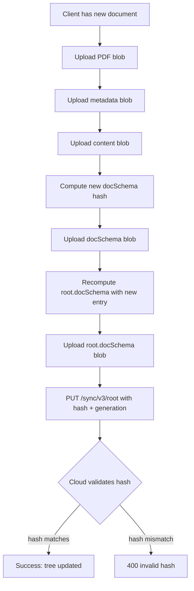

# The rmapi Sync15 Schema V4 Invalid Hash Bug: A Deep Technical Dive

When you upload a document to the reMarkable cloud through the `rmapi` library, the operation can fail with a cryptic `400 Bad Request` whose body reads `{"message":"invalid hash"}`. The error does not occur during the upload of the document's PDF, metadata, or content blobs — all of which return `200 OK` or `202 Accepted`. It occurs during the final step, when the client uploads a new `root.docSchema` index that describes the entire document tree. Understanding why this happens requires understanding how reMarkable's sync15 protocol works, how `rmapi` computes the cryptographic hash of its index files, and why the reMarkable cloud now rejects schema version 3 root indices.

This note is a complete technical walkthrough of that failure mode, the investigation that uncovered it, and the fix that resolves it. The lessons here generalize beyond this single bug: they illustrate how to debug opaque cloud API errors, how to reason about content-addressed storage systems, and how to safely modify third-party library behavior through reflection when the library itself has not yet released a fix.

> [!summary]
> - The reMarkable cloud's sync15 protocol stores documents as a Merkle-like tree of SHA-256 hashed blobs. The root `docSchema` index describes the tree.
> - `rmapi` defaults to schema version 3 when `SchemaVersion` is empty, but the cloud now rejects V3 root indices with `400 {"message":"invalid hash"}`.
> - PR #55 in `ddvk/rmapi` changes the default from V3 to V4. Until that PR is merged and released, the fix is to force V4 by setting `HashTree.SchemaVersion` to `"4"`.
> - The `UploadDocument` signature grew by three optional parameters (`currentPage`, `pageCount`, `contrastFilter`) in the latest `ddvk/rmapi` master.
> - Two code review lessons: unexported struct fields are not settable via reflection without `reflect.NewAt` + `unsafe.Pointer`; and logging transports must read full response bodies before truncating for display.

---

## 1. The Symptom: A 400 That Arrives Late

The failure surface is deceptive. Here is what a successful upload looks like in the HTTP trace:

```
PUT /sync/v3/files/<hash>  rm-filename: <uuid>.pdf       -> 200 OK
PUT /sync/v3/files/<hash>  rm-filename: <uuid>.metadata  -> 200 OK
PUT /sync/v3/files/<hash>  rm-filename: <uuid>.content   -> 202 Accepted
PUT /sync/v3/files/<hash>  rm-filename: <uuid>.docSchema -> 200 OK
PUT /sync/v3/files/<hash>  rm-filename: root.docSchema   -> 400 Bad Request
  body: {"message":"invalid hash"}
```

All four document-level uploads succeed. The failure is on the root index — the file that tells the cloud what documents exist and where they live in the tree. This means the problem is not with the document's content, nor with authentication, nor with rate limiting. It is with the *structure* of the tree itself, as the client describes it.

The error is also unforgiving: it aborts the sync, leaving the document partially uploaded in blob storage but invisible in the file tree. On the next sync, the client may or may not recover, depending on whether it re-mirrors the remote state correctly.

---

## 2. The sync15 Protocol: Content-Addressed Trees

To understand the error, you need to understand what `root.docSchema` is and how the reMarkable cloud validates it.

### 2.1 Blobs and hashes

The reMarkable cloud stores every file as an immutable blob addressed by its SHA-256 hash. When you upload a PDF, the client computes `SHA-256(pdf_bytes)`, then sends a `PUT` to `/sync/v3/files/<hash>` with the raw bytes. The cloud stores the blob and returns success. It does not care about filenames, document IDs, or folder structure at this stage. It only cares about the hash.

This is a classic content-addressed storage design. The same PDF uploaded twice costs no extra storage, because the hash is the same. The cloud is effectively a giant key-value store where keys are SHA-256 digests and values are opaque byte arrays.

### 2.2 The document index (docSchema)

A reMarkable document is not a single blob. It is a *collection* of blobs: the PDF, a metadata JSON file, a content JSON file, and sometimes additional files like thumbnails or highlights. The client needs a way to tell the cloud: "this document with UUID `X` consists of these four blobs." That description is itself a file, called the `docSchema`.

A docSchema is a text file with a simple line-oriented format. Here is an example for schema V3:

```
3
<hash>:80000000:<uuid>:<num_files>:<total_size>
```

The first line is the schema version (`3`). The second line is a colon-delimited record:
- `hash` — the SHA-256 of the *index file itself* (not the blobs it references)
- `80000000` — the document type constant (`DocType` in rmapi)
- `uuid` — the document's UUID
- `num_files` — how many files the document contains
- `total_size` — the sum of all file sizes in bytes

Wait: the hash field is the hash of the *index file*? That seems circular. It is. The index file contains its own hash. This is resolved by computing the hash of the index content *without* the hash field, then embedding that hash into the line. In practice, rmapi's `HashEntries` function does this by sorting the entries by document ID, concatenating their hash bytes, and SHA-256-ing the result.

### 2.3 The root index (root.docSchema)

The root index is a docSchema whose "document" is the entire tree. Instead of describing one PDF's files, it describes *all* documents in the account. Its format is the same:

```
3
<hash1>:80000000:<uuid1>:<n1>:<size1>
<hash2>:80000000:<uuid2>:<n2>:<size2>
...
```

Each line is a document entry. The root index's own hash is the SHA-256 of the concatenated binary hashes of all entries, sorted by document ID. The cloud stores this root index as a blob, then maintains a separate "root pointer" that records which hash is currently the active root, along with a monotonic generation number for optimistic concurrency control.

Here is the critical write path:



The cloud's validation at step `J` is strict: it re-reads the root index blob, computes its SHA-256, and checks that the hash the client provided matches what it just computed. If not, it returns `400 {"message":"invalid hash"}`.

---

## 3. Schema V3 vs V4: The Formats That Look Almost the Same

The root index format changed between schema V3 and V4. The difference is small but significant.

### 3.1 V3 format

```
3
<hash>:80000000:<uuid>:<num_files>:<total_size>
```

The second line uses `80000000` as the type field (`DocType`). This is a legacy constant from earlier reMarkable API versions.

### 3.2 V4 format

```
4
0:.:<count>:<total_size>
<hash>:0:<uuid>:<num_files>:<size>
```

V4 adds a header line after the version: `0:.:<count>:<total_size>`. The per-document lines use `0` as the type field (`FileType` in rmapi) instead of `80000000`. The hash computation also changes: in V4, the root hash is computed by SHA-256-ing the *entire text content* of the index file, rather than concatenating binary entry hashes.

Here is rmapi's `HashTree.Rehash()` showing the two paths:

```go
if schemaVersion == SchemaVersionV3 {
    entries := []*Entry{}
    for _, e := range t.Docs {
        entries = append(entries, &e.Entry)
    }
    hash, err = HashEntries(entries)  // binary concatenation
} else {
    reader, err := t.IndexReader()
    // ... read all bytes, SHA-256 them
    hasher := sha256.New()
    hasher.Write(schemaBytes)
    hash = hex.EncodeToString(hasher.Sum(nil))
}
```

The V4 path is simpler and more robust: the hash is literally `SHA-256(text of index file)`. The V3 path is more complex: `HashEntries` sorts by document ID, decodes each entry's hex hash to binary, concatenates the binary hashes, then SHA-256s the concatenation. Any discrepancy in sort order, hex decoding, or binary representation causes a mismatch.

### 3.3 Why V3 started failing

At some point in 2025–2026, the reMarkable cloud stopped accepting V3 root indices. The exact mechanism is unknown, but the symptom is clear:

- A V3 root index uploads successfully as a blob (the blob store doesn't validate content)
- But the `PUT /sync/v3/root` call, which updates the active root pointer, rejects the hash
- The cloud's validation logic presumably canonicalizes the index to V4 before hashing, or it simply no longer recognizes the V3 `DocType` constant

This is why `ddvk/rmapi` PR #55 changes the default from V3 to V4: the cloud has moved on, and V3 is now a legacy format that produces hash mismatches.

---

## 4. The rmapi Hash Computation in Detail

To see why the mismatch is subtle, let us trace through `HashTree.Rehash()` and `IndexReader()` exactly.

### 4.1 IndexReader: generating the text

```go
func (t *HashTree) IndexReader() (io.Reader, error) {
    schemaVersion := t.SchemaVersion
    if schemaVersion == "" {
        schemaVersion = SchemaVersionV3  // <-- the bug
    }
    // ... generate text based on schemaVersion
}
```

If `SchemaVersion` is empty (which it is for newly created trees), `IndexReader()` generates V3 text. The `HashTree.Rehash()` function also defaults to V3. So the client computes a V3 hash, uploads a V3 root index, and then the cloud — expecting V4 — computes a different hash and rejects it.

### 4.2 The sort-order trap

In V3, `HashEntries` sorts entries by document ID:

```go
func HashEntries(entries []*Entry) (string, error) {
    sort.Slice(entries, func(i, j int) bool {
        return entries[i].DocumentID < entries[j].DocumentID
    })
    hasher := sha256.New()
    for _, d := range entries {
        bh, err := hex.DecodeString(d.Hash)
        hasher.Write(bh)
    }
    return hex.EncodeToString(hasher.Sum(nil)), nil
}
```

But `IndexReader()` does *not* sort the docs before generating lines. If `t.Docs` is in a different order than the sorted entries, the hash computed by `Rehash()` (which calls `HashEntries`) will differ from the hash of the text generated by `IndexReader()`. This is a secondary bug that could cause intermittent failures even within V3.

In V4, this problem disappears because the hash is computed directly from the text, and both `Rehash()` and `IndexReader()` use the same text generation path.

---

## 5. The Fix: Forcing Schema V4

There are three ways to force V4:

### 5.1 Environment variable

`rmapi` checks `RMAPI_FORCE_SCHEMA_VERSION` at runtime:

```go
if envSchema := os.Getenv("RMAPI_FORCE_SCHEMA_VERSION"); envSchema != "" {
    schemaVersion = envSchema
}
```

Setting `RMAPI_FORCE_SCHEMA_VERSION=4` works, but it mutates global process state and generates linter warnings about unchecked `os.Setenv` error returns.

### 5.2 Reflection (the chosen approach)

The `sync15.ApiCtx` struct contains an unexported `hashTree` field of type `*HashTree`. We can reach it via reflection and set `SchemaVersion` directly:

```go
func forceSchemaV4(apiCtx api.ApiCtx) {
    v := reflect.ValueOf(apiCtx)
    if v.Kind() != reflect.Ptr || v.IsNil() {
        return
    }
    v = v.Elem()

    hashTreeField := v.FieldByName("hashTree")
    if !hashTreeField.IsValid() || hashTreeField.IsNil() {
        return
    }

    schemaVersionField := hashTreeField.Elem().FieldByName("SchemaVersion")
    if !schemaVersionField.IsValid() {
        return
    }

    if schemaVersionField.String() == "" {
        // Values through unexported fields are not settable.
        // Create a new settable Value backed by the same address.
        schemaVersionField = reflect.NewAt(
            schemaVersionField.Type(),
            unsafe.Pointer(schemaVersionField.UnsafeAddr()),
        ).Elem()
        schemaVersionField.SetString("4")
    }
}
```

The critical line is `reflect.NewAt(...).Elem()`. In Go, values obtained through unexported fields are flagged as non-settable by the reflect package. `NewAt` creates a new `reflect.Value` that points to the same memory but is not marked as non-settable, because it was created with an explicit address rather than traversed through an unexported field path.

### 5.3 Upstream fix

The proper long-term fix is `ddvk/rmapi` PR #55, which changes the default from V3 to V4:

```diff
- schemaVersion = SchemaVersionV3
+ schemaVersion = SchemaVersionV4
```

Until that PR is merged and released, the reflection workaround is necessary.

---

## 6. The UploadDocument Signature Change

The latest `ddvk/rmapi` master (commit `29d7b039e606`, "feat: add --contrast and --currentpage flags") expanded `UploadDocument` from 4 to 7 parameters:

```go
func (ctx *ApiCtx) UploadDocument(
    parentId string,
    sourceDocPath string,
    notify bool,
    coverpage *int,         // existing
    currentPage *int,       // NEW: which page to open to
    pageCount *int,         // NEW: total page count
    contrastFilter *string, // NEW: contrast mode name
) (*model.Document, error)
```

These parameters flow through to `archive.Prepare`, which writes them into the document's `.content` JSON file. For tools that do not expose these options, passing `nil` for all three preserves the previous behavior.

---

## 7. Lessons from Code Review

Two issues were caught during review of the fix.

### 7.1 Unexported fields and reflection

The first draft called `schemaVersionField.SetString("4")` directly. This panics at runtime with:

```
reflect.Value.SetString using value obtained using unexported field
```

The fix is `reflect.NewAt(type, unsafe.Pointer(addr)).Elem()`, which creates a settable alias to the same memory location. This is a standard Go pattern for mutating unexported fields when you have no other access path.

### 7.2 Logging transports must preserve full bodies

The HTTP logging transport originally used `io.LimitReader(resp.Body, maxLoggedBody)` to cap logging output at 4KB. This truncated the body *before* reconstructing `resp.Body` for downstream consumers. For responses larger than 4KB (e.g., sync index JSON), rmapi would receive incomplete data and fail.

The fix reads the full body first, logs a truncated preview, then reconstructs `resp.Body` from the complete bytes:

```go
bodyBytes, _ := io.ReadAll(resp.Body)
if len(bodyBytes) > maxLoggedBody {
    bodyStr = string(bodyBytes[:maxLoggedBody]) + "…"
} else {
    bodyStr = string(bodyBytes)
}
resp.Body = io.NopCloser(bytes.NewReader(bodyBytes)) // full bytes, not truncated
```

This is a general rule for any HTTP middleware that inspects response bodies: always drain the full body, then replace the stream. Never replace a partially consumed stream.

---

## 8. Verification: A Real Upload

After applying the fix, a test upload succeeds end-to-end:

```
PUT /sync/v3/files/<hash>  rm-filename: <uuid>.pdf       -> 200 OK
PUT /sync/v3/files/<hash>  rm-filename: <uuid>.metadata  -> 200 OK
PUT /sync/v3/files/<hash>  rm-filename: <uuid>.content   -> 202 Accepted
PUT /sync/v3/files/<hash>  rm-filename: <uuid>.docSchema -> 200 OK
PUT /sync/v3/files/<hash>  rm-filename: root.docSchema   -> 200 OK  ✓
PUT /sync/v3/root                                        -> 200 OK
  body: {"hash":"...","generation":1777126656549277}
```

The root index returns `200 OK` instead of `400`, and the root pointer update returns the new generation. The document is visible in the reMarkable cloud immediately.

---

## Key Points

- The reMarkable cloud's sync15 protocol is a content-addressed Merkle tree. The root `docSchema` index describes the entire document tree, and its hash must match what the cloud computes.
- `rmapi` defaults to schema V3 when `SchemaVersion` is empty, but the cloud now rejects V3 root indices with `400 {"message":"invalid hash"}`.
- Schema V4 computes the root hash by SHA-256-ing the full text of the index file, which is simpler and more robust than V3's binary concatenation approach.
- `ddvk/rmapi` PR #55 fixes the default, but until it is released, forcing `SchemaVersion = "4"` via reflection is a safe workaround.
- When mutating unexported struct fields via reflection, use `reflect.NewAt(type, unsafe.Pointer(addr)).Elem()` to create a settable value.
- HTTP logging middleware must read full response bodies before truncating for display, then reconstruct the complete body stream for downstream consumers.
- The `UploadDocument` signature in latest rmapi master adds three optional parameters: `currentPage`, `pageCount`, and `contrastFilter`. Pass `nil` if not using them.

---

## Related Notes

- [[PROJ - remarquee]] — the remarquee tool project note
- `ddvk/rmapi` PR #55: "default to schema v4" — the upstream fix
- `ddvk/rmapi` commit `29d7b039e606` — latest master with `UploadDocument` signature change
- Source code: `/home/manuel/code/wesen/corporate-headquarters/remarquee/pkg/rmcloud/auth.go`
- Source code: `/home/manuel/code/wesen/corporate-headquarters/remarquee/pkg/rmcloud/logtransport.go`
