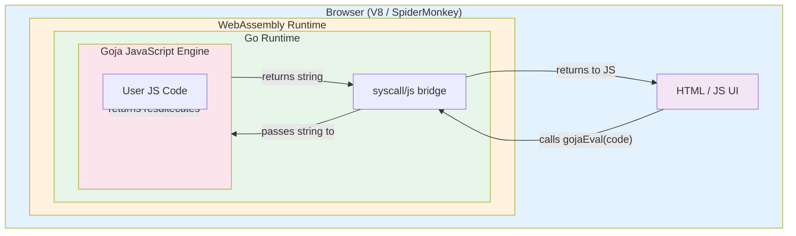

# Goja WASM Web REPL: A JavaScript Sandbox in the Browser

This project is a proof-of-concept that runs a JavaScript engine inside a web browser by compiling it to WebAssembly. The engine is Goja — a pure-Go implementation of ECMAScript 5.1 — and the interface is a simple REPL (Read-Eval-Print Loop) served from a web page. What makes it worth studying is not the feature set but the stack: it is JavaScript running inside Go running inside WebAssembly running inside the browser's JavaScript engine. Understanding how these layers communicate, and why each one exists, is the purpose of this report.

> [!summary]
> This project has three important identities:
> 1. A **working prototype** of a browser-hosted JavaScript sandbox using Goja compiled to WASM
> 2. A **teaching vehicle** for understanding Go↔JS interop via `syscall/js` and the WebAssembly boundary
> 3. A **reproducible experiment** that corrects a common misconception about TinyGo's ability to compile Goja

## Why this project exists

The original prompt was to build a JavaScript REPL in the browser where the execution engine is not the browser's native V8 or SpiderMonkey, but a separate engine written in Go and compiled to WebAssembly. The question underneath is architectural: can you take a non-trivial Go library — a full JavaScript interpreter with parser, compiler, and runtime — compile it to WASM, and make it callable from browser JavaScript as if it were a native API?

The answer is yes. But getting there required understanding three boundaries that are easy to conflate:

1. **The Go-to-WASM boundary** — what `GOOS=js GOARCH=wasm` actually produces, and what it costs in binary size.
2. **The TinyGo misconception** — the widespread belief (reinforced by independent benchmarks) that TinyGo cannot compile Goja. We show this is false; the real issue is a configurable timeout.
3. **The `syscall/js` bridge** — how Go code running inside WASM exposes functions to the browser's JavaScript world, and why the contract matters.

The project also exists because Goja is a genuinely useful engine for sandboxing. It gives you an isolated JavaScript runtime with no access to the DOM, network, or filesystem unless you explicitly wire those capabilities in. This makes it ideal for running untrusted user code in a browser tab.

## What was built

![[../../../../../2026-04-25--goja-wasm-web-repl/screenshot.png]]

*Screenshot of the browser test page showing all three expressions evaluating correctly through the Go WASM → Goja bridge.*

The final system has these components:

- A **Go WASM module** (`cmd/repl/main.go`) that initializes a Goja runtime and registers a `gojaEval` function on the JavaScript global object
- A **`syscall/js` bridge** that serializes JavaScript strings into Go, runs them through Goja, and returns string results
- A **browser test page** (`scripts/test-web/index.html`) that loads the WASM module and validates the bridge with three test expressions
- A **docmgr ticket** (`WASM-GOJA-REPL`) containing a design document, investigation diary, and experiment scripts
- A **compilation experiment suite** that tested standard Go WASM, TinyGo 0.28.1, TinyGo 0.40.1, and TinyGo 0.41.1

The user experience:

```
Open http://localhost:8765 in a browser
→ WASM loaded ✓
→ gojaEval is available ✓
→ gojaEval("1 + 1") = "2" ✓
→ gojaEval("var x = 5; x * 2") = "10" ✓
→ gojaEval(""hello" + " world"") = "hello world" ✓
```

## The core insight: why nesting runtimes is not absurd

At first glance, running a JavaScript engine inside a Go runtime inside a WebAssembly runtime inside a browser's JavaScript engine seems like unnecessary indirection. Why not just use `eval()`? The answer is that each layer adds a capability the others do not provide.

The browser's native JavaScript engine has full access to the DOM, `fetch`, `localStorage`, and every other browser API. If you want to run user-submitted code safely, `eval()` is dangerous — it shares the same global scope as your application. Goja, by contrast, starts with an empty global object. It has no `window`, no `document`, no `fetch`. You control exactly what APIs exist inside the sandbox.

Go's `syscall/js` bridge then lets you selectively inject capabilities. You can expose a `console.log` that writes to the browser console, or a `fetch` wrapper that validates URLs, or nothing at all. The sandbox is as permissive or restrictive as you choose.

WebAssembly provides the container. It is a memory-safe, sandboxed execution environment with no direct access to the host operating system. The Go runtime (scheduler, garbage collector, goroutine support) runs inside this container, and Goja runs inside the Go runtime. Each layer enforces boundaries that the layer below cannot break.

## Architecture



The data flow when a user types `1 + 1` and presses Enter:

1. The browser's JavaScript event listener captures the input string.
2. It calls `gojaEval("1 + 1")` — a function that the Go WASM module registered on `globalThis` during startup.
3. `syscall/js` marshals the JavaScript string into a Go `string` and invokes the registered Go function.
4. The Go function calls `vm.RunString("1 + 1")` on the Goja runtime.
5. Goja parses the string into an AST, compiles it to bytecode, and executes it.
6. Goja returns a `goja.Value` representing the number `2`.
7. The Go function converts this to a string (`"2"`) and returns it through `syscall/js`.
8. The browser JavaScript receives `"2"` and renders it in the output area.

That is eight steps across three runtime boundaries. Understanding each step is the point of this project.

## Implementation details

### The Go entry point

The Go program's job is simple but precise: create a Goja runtime, register one function on the JavaScript global object, and then block forever.

```go
package main

import (
    "syscall/js"
    "github.com/dop251/goja"
)

func main() {
    vm := goja.New()

    js.Global().Set("gojaEval", js.FuncOf(func(this js.Value, args []js.Value) interface{} {
        if len(args) == 0 {
            return "error: no code provided"
        }
        code := args[0].String()
        v, err := vm.RunString(code)
        if err != nil {
            return "error: " + err.Error()
        }
        return v.String()
    }))

    // Block forever. Without this, the Go runtime exits
    // and all exported functions become invalid.
    <-make(chan struct{})
}
```

> [!important]
> The `<-make(chan struct{})` at the end of `main()` is not optional. When `main()` returns, the Go runtime tears down and all `js.FuncOf` callbacks become dead. The program must block forever so that the WASM instance stays alive for JavaScript to call into.

Notice what this code does not do. It does not create complex JavaScript objects from Go. It does not manipulate the DOM. It does not call browser APIs. It takes a string, gives it to Goja, and returns a string. This is the simplest possible contract, and it is sufficient for a REPL.

### The browser test page

The test page has two jobs: load the Go WASM runtime, and validate that `gojaEval` works.

```html
<script src="wasm_exec.js"></script>
<script>
(async () => {
    const go = new Go();
    const result = await WebAssembly.instantiateStreaming(
        fetch("test_goja.wasm"),
        go.importObject
    );
    go.run(result.instance);

    // Poll for gojaEval — it may take a moment to register
    while (typeof gojaEval === 'undefined') {
        await new Promise(r => setTimeout(r, 10));
    }

    // Run tests
    console.log(gojaEval("1 + 1"));           // "2"
    console.log(gojaEval("var x = 5; x * 2")); // "10"
})();
</script>
```

The `WebAssembly.instantiateStreaming` call fetches the `.wasm` file and compiles it in parallel with the download. The `go.importObject` provides the JavaScript functions that the Go runtime needs — `setTimeout`, `fetch`, `console.log`, and a minimal filesystem shim. These are defined in `wasm_exec.js`, which Go provides at `$(go env GOROOT)/misc/wasm/wasm_exec.js`.

> [!warning]
> `wasm_exec.js` must match the Go version that compiled the `.wasm` binary. A Go 1.25 binary requires Go 1.25's `wasm_exec.js`. Mixing versions causes silent runtime failures where functions return garbage or the runtime panics.

### The compilation experiment

The project includes a systematic compilation experiment that tested four toolchains:

| Toolchain | Version | Result | Binary Size | Build Time |
|-----------|---------|--------|-------------|------------|
| Standard Go | 1.25.5 | **SUCCESS** | 18,523,092 bytes (~18.5 MB) | ~5 seconds |
| TinyGo | 0.28.1 | FAIL — version mismatch | — | — |
| TinyGo | 0.40.1 | FAIL — timeout (3 min default) | — | — |
| TinyGo | 0.41.1 | **SUCCESS** with `-interp-timeout=900s` | 10,763,118 bytes (~10.7 MB) | ~6–8 minutes |

The TinyGo breakthrough is the most important finding. Previous attempts — including an independent benchmark by `speakeasy-api/wasm-overhead-research` — reported that "TinyGo builds failed during benchmarking." The actual failure was not a compatibility problem but a **configurable timeout**.

TinyGo's compiler includes an interpreter pass (`interp`) that evaluates `init()` functions and constant expressions at compile time. This produces smaller binaries but can take a long time on packages with large static initialization tables. `golang.org/x/text/collate` — which Goja uses for `String.prototype.localeCompare()` — contains massive Unicode collation tables. TinyGo's interpreter needs more than the default 3 minutes to process them.

The fix is a single flag:

```bash
tinygo build -target=wasm -interp-timeout=900s -o main.wasm ./cmd/repl
```

With this flag, TinyGo 0.41.1 compiles Goja successfully and produces a binary that is **42% smaller** than standard Go's output.

### Granular `x/text` testing

To confirm that `collate` was the specific bottleneck, we tested each `golang.org/x/text` subpackage in isolation:

| Package | Test Code | Result with TinyGo 0.41.1 |
|---------|-----------|---------------------------|
| `unicode/norm` | `norm.NFC` | Compiles instantly |
| `cases` | `cases.Lower` | Compiles instantly |
| `language` | `language.English` | Compiles instantly |
| `collate` | `collate.New` | Hangs with default timeout; succeeds with `-interp-timeout=600s` |

This narrows the issue precisely. Goja's other `x/text` dependencies are not problematic. Only `collate` requires extended interpreter time.

### The Dagger pattern from sibling projects

The `go-codebase-browser` project (a sibling repository) uses Dagger to run TinyGo in a container:

```go
container := client.Container().
    From("tinygo/tinygo:0.41.1").
    WithDirectory("/src", src).
    WithWorkdir("/src").
    WithExec([]string{
        "tinygo", "build",
        "-target", "wasm",
        "-o", "/tmp/out.wasm",
        "./cmd/wasm",
    })
```

This pattern is clean and reproducible, but the container must also pass `-interp-timeout` for Goja-based builds. Without it, the Dagger build would fail with the same timeout error.

## Project shape

```
/home/manuel/code/wesen/2026-04-25--goja-wasm-web-repl/
├── ttmp/
│   └── 2026/04/25/WASM-GOJA-REPL--wasm-tinygo-build-with-goja-repl-web-interface/
│       ├── design-doc/
│       │   └── 01-design-implementation-guide-goja-repl-in-wasm-with-web-ui.md
│       ├── reference/
│       │   └── 01-investigation-diary.md
│       └── scripts/
│           ├── experiment_goja_wasm.sh
│           ├── experiment_goja_repl.sh
│           ├── 01-experiment-results.md
│           └── test-web/
│               ├── main.go
│               ├── go.mod
│               ├── test_goja.wasm
│               ├── wasm_exec.js
│               ├── index.html
│               └── README.md
└── .ttmp.yaml
```

## Key code locations

| File | What it does |
|------|-------------|
| `scripts/test-web/main.go` | Minimal Go WASM entry point: creates Goja runtime, registers `gojaEval`, blocks forever |
| `scripts/test-web/index.html` | Browser test page: loads WASM, polls for `gojaEval`, runs validation tests |
| `scripts/test-web/test_goja.wasm` | Compiled binary (~18.5 MB, standard Go; ~10.7 MB with TinyGo) |
| `scripts/01-experiment-results.md` | Detailed compilation experiment results with error messages and size comparisons |
| `design-doc/01-design-implementation-guide-goja-repl-in-wasm-with-web-ui.md` | Comprehensive design document for intern onboarding |

## What was tricky

### The `<-make(chan struct{})` block

Without the blocking receive at the end of `main()`, the Go runtime exits immediately after registering `gojaEval`. The function exists on `globalThis` for a microsecond, then becomes invalid. The symptom is a silent failure: `typeof gojaEval === 'undefined'` even though the registration code ran. This is documented in the Go WASM wiki but easy to miss if you are used to writing Go servers where `main()` does not need to block.

### The `wasm_exec.js` version mismatch

During early testing, a cached `wasm_exec.js` from Go 1.23 was used with a binary compiled by Go 1.25. The WASM module loaded without error, but `go.run()` threw an opaque runtime panic. The fix was always to copy `wasm_exec.js` from the exact Go installation used for compilation:

```bash
cp "$(go env GOROOT)/misc/wasm/wasm_exec.js" .
```

### The TinyGo timeout

The most instructive failure was the TinyGo interpreter timeout. The error message — `interp: running for more than 3m0s, timing out` — looks like a fundamental incompatibility. It is not. It is a configurable safety limit. The fix — `-interp-timeout=900s` — turns a failed build into a successful one with a significantly smaller binary.

This matters because the `speakeasy-api/wasm-overhead-research` project (and likely others) reported TinyGo as incompatible with Goja based on this timeout. Our experiment shows that with the correct flag, TinyGo is not only compatible but advantageous for binary size.

### The WASI vs JS/WASM distinction

TinyGo and standard Go target different WASM environments. Standard Go uses `GOOS=js GOARCH=wasm`, which targets the browser with `syscall/js`. TinyGo's `-target=wasm` also targets the browser but uses a slightly different ABI. TinyGo's `-target=wasi` targets the WASI specification for server-side WASM. In our project, we used TinyGo `-target=wasm` (browser) for the size comparison, not `-target=wasi`.

## Current project status

The repository is in a **working prototype** state. The core loop is proven: browser JavaScript → Go WASM → Goja → result.

What exists today:

- A minimal but complete `gojaEval` bridge in `scripts/test-web/main.go`
- A browser test page that validates three expressions and reports pass/fail
- Compilation scripts for standard Go, TinyGo 0.40.1, and TinyGo 0.41.1
- A docmgr ticket with design document, investigation diary, and experiment results
- ReMarkable upload of the design bundle at `/ai/2026/04/25/WASM-GOJA-REPL`

What remains open:

- A full REPL UI with history, multi-line input, and error display
- Richer bridge API: `gojaGetGlobal`, `gojaSetGlobal`, `gojaReset`
- Runtime enrichment: `console.log`, `setTimeout`, `fetch` wrappers
- State persistence: export/import session state, URL-encoded sessions
- Binary size optimization: `-ldflags="-s -w"`, Brotli compression, lazy loading
- Dagger-based build pipeline for reproducible compilation

## Important project docs

- `/home/manuel/code/wesen/2026-04-25--goja-wasm-web-repl/ttmp/2026/04/25/WASM-GOJA-REPL--wasm-tinygo-build-with-goja-repl-web-interface/design-doc/01-design-implementation-guide-goja-repl-in-wasm-with-web-ui.md` — Exhaustive design document with architecture diagrams, API tables, phased implementation plan, and glossary for interns
- `/home/manuel/code/wesen/2026-04-25--goja-wasm-web-repl/ttmp/2026/04/25/WASM-GOJA-REPL--wasm-tinygo-build-with-goja-repl-web-interface/reference/01-investigation-diary.md` — Chronological diary of compilation experiments
- `/home/manuel/code/wesen/2026-04-25--goja-wasm-web-repl/ttmp/2026/04/25/WASM-GOJA-REPL--wasm-tinygo-build-with-goja-repl-web-interface/scripts/01-experiment-results.md` — Evidence-backed compilation results

All three documents were uploaded to reMarkable as a bundle at `/ai/2026/04/25/WASM-GOJA-REPL`.

## Open questions

1. **Should the REPL support ES6+?** Goja implements ECMAScript 5.1. Modern JavaScript uses `let`, `const`, arrow functions, classes, and `async/await`. Supporting these would require transpilation (e.g., Babel) before passing code to Goja, or switching to a different engine.
2. **How do we handle infinite loops?** Goja does not have a built-in execution timeout. A user typing `while(true) {}` would hang the Goja runtime, which would hang the Go WASM module, which would hang the browser tab. Running evaluations in a Web Worker or injecting periodic yield checks are potential solutions.
3. **Should we expose `fetch` to the sandbox?** The browser's `fetch` API could be wrapped and exposed through the bridge, but this creates security considerations. The host should validate URLs, enforce allowlists, or require user confirmation.
4. **Can we make the binary smaller?** Standard Go produces ~18.5 MB. TinyGo produces ~10.7 MB. Both can be compressed with Brotli to ~3–4 MB for HTTP transfer. Is this small enough for a web app, or do we need a stripped Goja fork?
5. **Should we use the Dagger container pattern?** The sibling `go-codebase-browser` project uses Dagger with `tinygo/tinygo:0.41.1` for reproducible builds. Should we adopt the same pattern?

## Near-term next steps

- Build a full REPL UI with input history, syntax highlighting, and error display
- Add `console.log` wiring so that `console.log("hello")` inside Goja prints to both the browser console and the REPL output
- Implement `gojaReset()` to clear the runtime state
- Add `-ldflags="-s -w"` and Brotli compression to the build pipeline
- Investigate running Goja evaluations in a Web Worker to prevent infinite loops from freezing the UI
- Add a `Makefile` with `build`, `dev`, `test`, and `compress` targets

## Project working rule

> [!important]
> The boundary is the architecture. Every design decision — what APIs to expose, how data crosses the Go/JS bridge, whether to use standard Go or TinyGo — flows from the principle that the sandboxed JavaScript engine must not have implicit access to the host environment. Capabilities are injected explicitly through the bridge. Keep that separation clean, and the system remains testable, secure, and portable.
