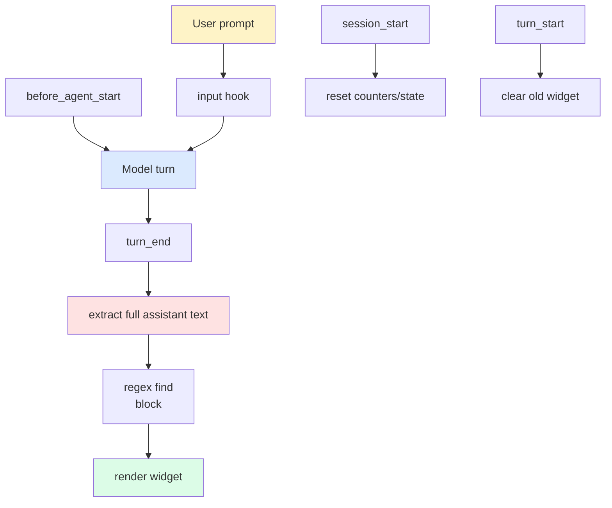
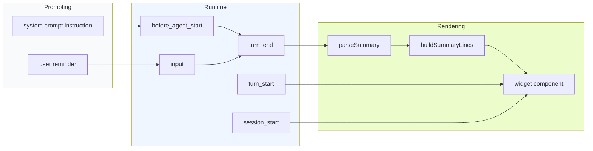

# Pi Session Summary Extension - Textbook Project Report

This project built a Pi extension that forces every assistant turn to end with a structured `<summary>...</summary>` block and then renders that summary in a persistent terminal widget. The goal was not only to make the summary visible, but to make the summary behave like a first-class part of the session: predictable, width-aware, reload-safe, and easy to inspect after a long coding turn.

The project became a nice example of how a Pi extension can combine prompt shaping, message parsing, TUI rendering, and filesystem installation into one coherent workflow. The final version is source-controlled in `extensions/session-summary/` and installed into Pi as a directory symlink.

> [!summary]
> - The extension is built around a simple idea: make the model emit a stable textual summary contract, then render that contract after the turn finishes.
> - The implementation is split cleanly into prompt text, parsing/rendering logic, and Pi lifecycle hooks.
> - Two operational details mattered more than expected: using a **directory symlink** instead of a file symlink, and **never truncating the summary widget** after the summary block itself was fixed.

## Why this project exists

Pi sessions are good at producing a lot of useful context, but the useful part is often buried in scrollback by the time the next turn starts. A short, structured summary at the end of each turn solves that problem in two ways.

First, it creates a durable recap that the model is asked to generate every time, which improves the quality of the session trail. Second, it gives the user a visible summary widget, so the recap stays in the terminal instead of disappearing into the conversation history. The summary becomes part of the interface, not just part of the text.

This is especially helpful in coding sessions, where the important facts are usually the same four things:

- what changed this turn,
- what the session has accomplished so far,
- what is blocked or uncertain,
- what should happen next.

The project exists to make those four facts reliable and visible without turning the conversation into a large structured-output system.

## Current project status

The extension is built and running from the repository source, not from a hand-edited dotfile copy. The live Pi installation points to the source-controlled directory via a symlink:

```text
~/.pi/agent/extensions/session-summary -> /home/manuel/code/wesen/2026-04-21--pi-extensions/extensions/session-summary
```

The code currently lives in two files:

- `extensions/session-summary/index.ts`
- `extensions/session-summary/prompt.ts`

The extension is functional and the summary widget now renders the full summary content rather than collapsing the block to a shorter preview. The last major cleanup was removing the line-count truncation that had caused the widget to hide part of the summary.

The project is also documented in the repo's human-facing docs and in the docmgr ticket workspace that captured the implementation plan. That means the extension has three parallel lives:

1. source code in the repo,
2. operational notes in the docmgr ticket,
3. a project report in this vault.

## Project shape

The extension is small, but it has a surprisingly clear shape. It is easiest to think of it as three cooperating layers.

### 1. Prompt contract

The prompt layer tells the model what a valid summary looks like. That instruction lives in `extensions/session-summary/prompt.ts` and asks for a `<summary>` block with four headings:

- `This turn:`
- `Session so far:`
- `Issues:`
- `Next steps:`

The instruction is intentionally plain text. It is easier for the model to follow, easier for a human to read in the terminal, and easier to keep stable over time than a richer schema would be.

### 2. Session lifecycle hooks

The extension uses Pi's lifecycle events to shape and inspect the conversation:

- `before_agent_start` appends the system prompt instruction.
- `input` appends a short reminder to user prompts.
- `turn_end` scans the final assistant message for a summary block and renders the widget.
- `turn_start` clears the previous widget so the next turn starts cleanly.
- `session_start` resets per-session counters and state.

### 3. Widget rendering

The widget is a custom TUI component that renders the parsed summary in a width-aware way. It does not mutate the assistant message itself; Pi does not let extensions rewrite the completed assistant message after assembly. So the extension leaves the raw summary in the text and adds a UI representation on top.



## Core mental model

The cleanest way to understand the extension is to see it as a **contract + parser + widget** system.

The contract tells the model what to emit. The parser looks for the contract in the finished assistant message. The widget turns that parsed text into a terminal surface. Each layer does one job, and that separation is why the extension stayed manageable.

If the prompt contract changes, the parser should change with it. If the parser changes, the widget may need to change with it. But the lifecycle logic should remain boring. That is the right place for extension code to be boring.

The hidden lesson here is that the summary is not really about storage. It is about **making a small bit of meaning survive the turn boundary**.

## Architecture

The current implementation is built around a few small responsibilities in `extensions/session-summary/index.ts`:

- `extractAllText(message)` joins the assistant's text and thinking blocks into one string.
- `parseSummary(summary)` splits the summary into the four structured fields.
- `buildSummaryLines(...)` wraps the content to the current terminal width.
- `createSummaryWidget(...)` caches the last render width and returns a TUI component.
- `turn_end` decides whether a summary exists and chooses either the success widget or the warning widget.

The state is intentionally small:

```ts
type SummaryState = {
  lastSummary: string | null;
  lastTurnHadSummary: boolean;
  turnIndex: number;
  summaryCount: number;
  missingCount: number;
};
```

That is enough to support the two user-facing commands and the current session statistics, without introducing a separate persistence layer.



## Implementation details

### The prompt file

The prompt text in `extensions/session-summary/prompt.ts` is small on purpose. It asks the model to output exactly one `<summary>` block at the end of every response, and it defines the four headings that the widget expects.

This matters because the extension is not trying to parse arbitrary prose. It is asking the model to write in a recognizable shape. The headings are a handshake between the prompt and the widget.

The instruction is also intentionally repetitive:

- the summary block must be last,
- the headings must appear in a fixed order,
- the block must exist even when the turn feels uneventful.

That repetition is not decoration. It is how you increase compliance from a model that otherwise prefers to improvise.

### Parsing the assistant message

The extension does not inspect streaming chunks. It waits until the turn is complete and then scans the fully assembled assistant message. That choice keeps the parsing simple. The entire message is available, so the extension can search for the last complete summary block rather than buffering partial tags during streaming.

The core logic is conceptually simple:

```text
1. Join assistant text and thinking blocks into one string.
2. Find every <summary>...</summary> block.
3. Use the last non-empty block.
4. Split the block into headings and content.
5. Render the result in a widget.
```

A small but important detail: the parser uses the **last** matching summary block. If the model accidentally emits multiple summary blocks, the last one is most likely the intended final answer.

### Why the widget is width-aware

A terminal widget has to respect the available width. The extension uses `wrapTextWithAnsi(...)` and `truncateToWidth(...)` from `@mariozechner/pi-tui` to keep each rendered line within the current width.

That is the right rule for a terminal widget, but it is not the same as truncating the summary itself. The widget should never hide part of the summary block just because the window is narrow or because the summary is longer than expected.

That was an important correction during the build:

- the summary text itself should be rendered in full,
- only the line wrapping should adapt to width,
- no extra `4 lines ...`-style summary truncation should remain.

The widget now behaves like a view onto the full summary, not like a preview.

### How the extension installs

The extension is installed as a **directory symlink**, not a single file symlink. That distinction matters because the entrypoint imports `./prompt`, and relative imports only work cleanly when the whole directory is visible to Pi.

The working layout is:

```text
extensions/
└── session-summary/
    ├── index.ts
    └── prompt.ts
```

Installed live as:

```text
~/.pi/agent/extensions/session-summary -> /home/manuel/code/wesen/2026-04-21--pi-extensions/extensions/session-summary
```

This is a better shape than symlinking a single file because helper modules stay next to the entrypoint and the extension can be developed like a normal module tree.

### The operational commands

The extension exposes a small command surface:

- `/summary` shows the last detected summary in a notification.
- `/summary-toggle` turns the reminder behavior on or off.
- `/summary-logs` tails the extension log file.
- `/summary-debug` dumps recent log lines into the widget.

Those commands are useful because the widget is not the only view into the extension. A reportable system needs a way to inspect its own behavior when the UI is not enough.

## How the project was built

The build happened in a very deliberate order.

### Step 1: Make the behavior spec explicit

The first version of the extension was really a prompt contract. It told the model what to write and how to shape the recap. That decision made the rest of the implementation easier, because the extension only needed to support a known summary structure.

### Step 2: Parse the complete assistant response

Once the contract existed, the next job was to look at the final assistant text and extract the block. That is the simplest reliable place to inspect the summary. It avoids partial streaming state and makes the parser deterministic.

### Step 3: Add a widget instead of a message rewrite

The summary block stays in the raw assistant text. The extension does not rewrite the assistant message. Instead, it adds a widget above the editor. That is the right abstraction for a UI affordance: transient, visible, and non-persistent.

### Step 4: Fix the module layout

The first installation attempt used a file symlink and failed because helper imports broke. The fix was to make the extension a directory and symlink the directory. That small change made the extension load like a normal module tree.

### Step 5: Remove the widget truncation

A later pass removed the summary-widget line cap. The summary should be shown in full, and the widget should only adapt line wrapping to terminal width. That was the final piece that made the extension feel trustworthy.

## Failure modes and lessons learned

### File symlink versus directory symlink

The first operational mistake was trying to install the entrypoint as a single symlinked file while still importing a sibling helper. That works only when the helper is actually available next to the symlink target. In practice, the extension needed the whole directory.

The better rule is simple:

- one file extension: file symlink is fine,
- multi-file extension: use a directory and symlink the directory.

### Fixed line caps make widgets feel dishonest

The second mistake was a widget cap that said, in effect, “this summary is too long, so I will only show part of it.” That is reasonable for a log preview and wrong for a summary contract.

A summary widget should either wrap or scroll, but it should not silently discard meaning.

### The summary contract should stay simple

There is always a temptation to make the block richer: JSON, nested metadata, extra sections, scores, and tags. The experience here suggests the opposite. The simpler the contract, the easier it is for the model to honor it and the easier it is for the human to scan it in the terminal.

## Current user-facing behavior

The user now gets two different views of the same information:

1. the raw assistant response still includes the `<summary>` block,
2. the extension renders a separate widget with the parsed summary.

That split is useful. The raw text is the durable record. The widget is the ergonomic record.

The extension also keeps the previous summary visible until the next turn starts. That gives the user time to read it before the next summary replaces it.

## Important project docs

The code and docs for this project are spread across a few places:

- `extensions/session-summary/index.ts` — extension orchestration, parsing, rendering, and commands.
- `extensions/session-summary/prompt.ts` — the summary prompt contract.
- `README.md` — the repository-level pointer to the extension and its install layout.
- `ttmp/2026/04/23/pi-ext-session-summary--pi-extension-session-summary-block-with-system-prompt-injection/` — the docmgr design and implementation documents that captured the original build plan.

Those documents tell the story from different angles. The repo code shows how it works, the ticket docs show why it was built, and this note connects them into a longer narrative.

## KB reviews

- [[KB-BATCH14-pi-extensions-tooling]] (2026-05-11) — Batch K Pi extension/tooling review; created [[Tribal/pi-extension-event-seams]] and advanced Pi TUI/model-config candidates.

## Related KB entries

- [[Tribal/pi-extension-event-seams]] — Pi lifecycle/event seams, prompt shaping, tool-call mutation, TUI surfaces, and model/config integration discipline.
- [[Fundamentals/host-mediated-sandbox-principles]] — the host/runtime boundary principle behind narrow extension capabilities and mediated side effects.

## Near-term next steps

The extension is already useful, but there are still a few natural next steps if the project continues:

- add a history view for old summaries,
- add a command to recall the last full summary block,
- consider a separate structured export mode if a later workflow needs machine-readable summaries,
- keep the widget honest by preserving full summary text and only changing the wrapping behavior.

The last point is worth treating as a project rule, not just an implementation detail.

## Project working rule

The summary block should always be displayed in full.

That means:

- no fixed line-count truncation,
- no hidden “preview only” behavior,
- no UI path that silently throws away summary content,
- full-width wrapping is fine, but meaning loss is not.

That rule is the simplest way to keep the extension aligned with its own purpose.
