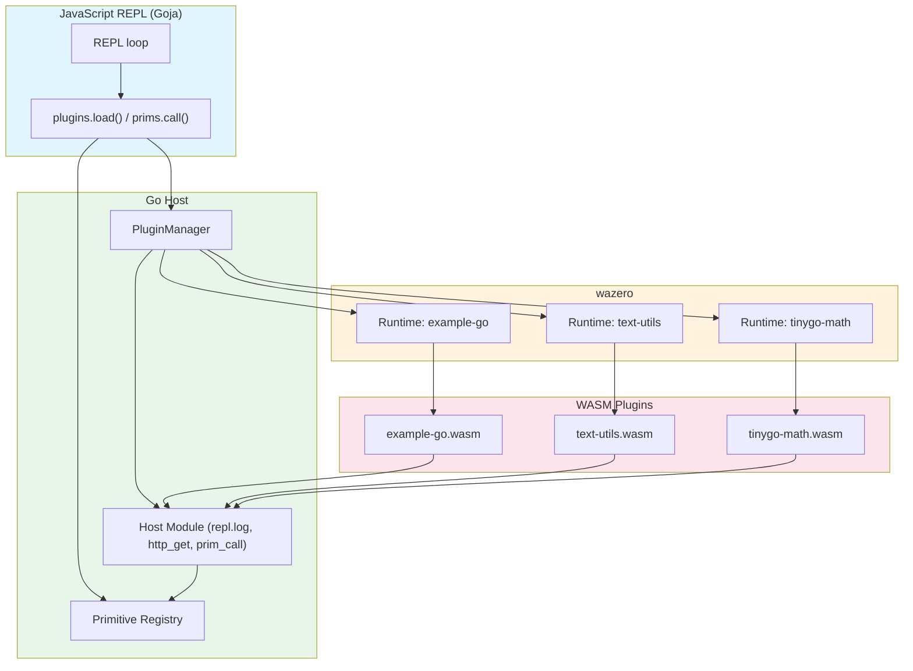

# WASM Plugin REPL: A Deep Dive into Host-Guest Architecture with Goja and wazero

This project is a proof-of-concept REPL that loads WebAssembly plugins from the command line and exposes their functions to an interactive JavaScript runtime. What makes it worth studying is not the feature set — a calculator that loads from `.wasm` files is hardly revolutionary — but the architecture: it demonstrates how to build a clean, extensible host-guest boundary using pure Go, with zero CGO dependencies, and how to bridge three distinct execution environments (Go host, Wasm guest, JavaScript REPL) through a single, well-defined ABI.

> [!summary]
> This project has four important identities:
> 1. A **working prototype** of a Wasm plugin system with host-mediated capabilities
> 2. A **teaching vehicle** for understanding the host-guest boundary in WebAssembly
> 3. A **demonstration** of capability-based security applied to plugin architectures
> 4. A **practical benchmark** comparing Go WASI reactors (3.1MB) vs TinyGo (210KB) for the same task

## Why this project exists

The original prompt was simple: build a REPL that takes `.wasm` files on the CLI, loads them, and lets the user call plugin functions from JavaScript. But the real question underneath was architectural: how do you give a sandboxed Wasm module access to host capabilities (logging, HTTP, the system clock) without breaking the sandbox?

The answer is not to poke holes in the sandbox. It is to make the sandboxed module **ask** for capabilities through a well-defined import interface, and let the host decide whether to grant each request. This is the capability-based model that WASI is built on, and it is the pattern this project implements end-to-end.

The project also exists to answer a practical question: if you want to write a plugin in Go (or TinyGo, or Rust, or AssemblyScript) and call it from JavaScript, what does the glue code look like? Not the theory — the actual bytes-on-the-wire, memory-layout, function-signature glue code.

## What was built

The final system has these components:

- A **Go host** (`cmd/repl/main.go`) that bootstraps wazero, loads plugins, and starts a Goja REPL
- A **wazero runtime layer** (`internal/plugins/loader.go`, `internal/plugins/invoke.go`) that manages plugin lifecycle and implements the JSON-through-memory ABI
- A **host module** (`internal/host/host.go`) that exposes `repl.log`, `repl.http_get`, and `repl.prim_call` to guests
- A **primitive registry** (`internal/primitives/registry.go`) that both JavaScript and Wasm can call into — the convergence point for all host capabilities
- A **Goja bridge** (`internal/repl/bridge.go`, `internal/repl/repl.go`) that injects `plugins.load()` and `prims.call()` into the JavaScript environment
- Four **example plugins**: a Go math/string plugin, a text-utils plugin, an HTTP fetcher plugin, and a TinyGo math plugin
- **Async primitives** (`async.start`, `async.poll`, `async.result`) for background tasks
- Integration tests that compile plugins on demand and verify round-trip behavior

The user experience:

```bash
./repl ./plugins/example-go/example.wasm
```

```js
> p = plugins.load("./plugins/example-go/example.wasm")
> p.call("double", 21)
42
> p.call("greet", "World")
"Hello, World"
> p.call("fetch", "https://example.com")
"<!doctype html>..."
> prims.call("clock.now")
1777134558
```

## The core insight: why host-guest boundaries fail

Most attempts to build plugin systems fail at the boundary. The host has full OS access; the guest has none. The temptation is to "punch through" — give the guest direct access to `net.Dial`, or `os.Open`, or `fmt.Println`. But every hole in the sandbox is a future vulnerability, and every direct call creates a coupling that makes the plugin hard to test in isolation.

The better approach is to make the boundary **explicit and mediated**. The guest declares what it needs through imports. The host implements those imports as Go functions. The guest never touches the OS directly. This has three consequences that shape the entire architecture:

1. **Testability**: The host imports can be mocked. You can test a plugin without a network connection, without a filesystem, without anything but the Wasm runtime and a fake host module.
2. **Security**: The host can reject, rate-limit, or transform any request. A plugin that asks for `http_get("https://evil.com")` can be blocked at the host level.
3. **Composability**: Both JavaScript and Wasm call the same host capabilities through the same registry. There is one `http.get` implementation, not two.

## Architecture



The data flow when a user calls `p.call("fetch", "https://example.com")`:

1. Goja evaluates the JS expression.
2. The bridge serializes `"https://example.com"` to JSON bytes: `[34, 104, 116, 116, 112, ...]`.
3. The bridge calls `Plugin.InvokeJSON(ctx, "fetch", jsonBytes)`.
4. `InvokeJSON` allocates guest memory by calling the guest's `alloc` export.
5. The host writes `"fetch"` and the JSON bytes into guest memory.
6. The host calls the guest's `invoke` export with four `uint32` parameters: name pointer, name length, arg pointer, arg length.
7. The guest reads its own memory, parses the JSON, dispatches to `fetch`.
8. The guest's `fetch` function calls `hostHTTPGet` — a Wasm import that traps back to the host.
9. The host's `http_get` implementation reads the URL from guest memory, calls `net/http.Get`, reads the response body.
10. The host allocates guest memory for the response, writes the HTML bytes, and returns a packed `(ptr << 32) | len`.
11. The guest unpacks the pointer and length, reads the HTML, wraps it in a JSON string, allocates guest memory for the result, and returns packed `(ptr << 32) | len`.
12. The host reads the result from guest memory, copies it (because the view may become invalid), frees the allocations, and returns the bytes to the bridge.
13. The bridge calls `unmarshalFlexible` — tries `json.Unmarshal`, falls back to raw string for non-JSON output like HTML.
14. Goja returns the value to the user.

That is fourteen steps across three runtime boundaries. Understanding each step is the point of this project.

## Implementation details

### The JSON-through-memory ABI

WebAssembly has no strings, no objects, no JSON. It has integers, floats, and a single linear memory region. To pass rich data between host and guest, we need a convention. The convention we chose is JSON-serialized to bytes, passed through guest memory, with pointers packed into `uint64` values.

The packing scheme is simple but essential:

```go
// internal/plugins/invoke.go
func packPtrLen(ptr, length uint32) uint64 {
    return (uint64(ptr) << 32) | uint64(length)
}

func unpackPtrLen(packed uint64) (ptr, length uint32) {
    return uint32(packed >> 32), uint32(packed)
}
```

Why pack into `uint64`? Because Wasm functions can only return a single value (or a fixed tuple), and `uint64` is the largest integer type. The high 32 bits hold the pointer; the low 32 bits hold the length. This gives us a single return value that encodes both pieces of information needed to read a byte slice from memory.

The `InvokeJSON` method implements the full protocol:

```go
func (p *Plugin) InvokeJSON(ctx context.Context, name string, arg []byte) ([]byte, error) {
    alloc := p.Module.ExportedFunction("alloc")
    free := p.Module.ExportedFunction("free")
    invoke := p.Module.ExportedFunction("invoke")

    // 1) Allocate and write function name
    nameResults, err := alloc.Call(ctx, uint64(len(name)))
    namePtr := uint32(nameResults[0])
    p.Module.Memory().Write(namePtr, []byte(name))

    // 2) Allocate and write argument JSON
    argResults, err := alloc.Call(ctx, uint64(len(arg)))
    argPtr := uint32(argResults[0])
    p.Module.Memory().Write(argPtr, arg)

    // 3) Call guest invoke
    results, err := invoke.Call(ctx,
        uint64(namePtr), uint64(len(name)),
        uint64(argPtr), uint64(len(arg)),
    )

    // 4) Unpack result
    resPtr, resLen := unpackPtrLen(results[0])

    // 5) Read result bytes (copy them)
    resBytes, ok := p.Module.Memory().Read(resPtr, resLen)
    resCopy := append([]byte(nil), resBytes...)

    // 6) Free allocations
    _, _ = free.Call(ctx, uint64(namePtr), uint64(len(name)))
    _, _ = free.Call(ctx, uint64(argPtr), uint64(len(arg)))
    _, _ = free.Call(ctx, uint64(resPtr), uint64(resLen))

    return resCopy, nil
}
```

Each step is loaded with subtleties:

- **Step 1 and 2**: The host calls `alloc` on the guest. This means the guest controls its own memory layout. The host cannot simply write to arbitrary addresses. It must ask.
- **Step 5**: `module.Memory().Read()` returns a **view** into guest memory, not a copy. If the guest reallocates or grows memory, that view becomes invalid. This is why we `append([]byte(nil), resBytes...)` — to copy into Go-owned memory before the guest has a chance to invalidate the view.
- **Step 6**: We free all three allocations (name, arg, result). The guest's `free` is currently a no-op in our plugins — we rely on the Go GC or the bump allocator's linear semantics — but the protocol requires the call.

### The bump allocator bug

The most instructive failure in this project was the allocator. Our first guest implementation used `make([]byte, n)` inside the `alloc` function:

```go
// BROKEN — do not use
func alloc(n uint32) uint32 {
    buf := make([]byte, n)
    return uint32(uintptr(unsafe.Pointer(&buf[0])))
}
```

When the host called `alloc` twice in succession — once for the function name, once for the argument — both calls returned the **same address**:

```
[host] allocated name at 4444064, writing "double"
[host] allocated arg at 4444064, writing 21
```

The second write overwrote the first. The guest then read `"21\x00\x00\x00\x00"` as the function name and dispatched to a non-existent function. The root cause: Go's escape analysis determined that `buf` did not escape the function, so it allocated it on the stack. When `alloc` returned, the stack slot was reused by the next call.

The fix was a **bump allocator** using a global buffer:

```go
var bumpBuf = make([]byte, 1024*1024) // 1 MiB
var bumpOff uint32

func alloc(n uint32) uint32 {
    if bumpOff+n > uint32(len(bumpBuf)) {
        return 0
    }
    base := uint32(uintptr(unsafe.Pointer(&bumpBuf[0])))
    ptr := base + bumpOff
    bumpOff += n
    bumpOff = (bumpOff + 7) &^ 7 // 8-byte alignment
    return ptr
}
```

This allocator returns monotonically increasing absolute addresses in Wasm linear memory. It is not thread-safe, it does not free memory, and it will eventually run out of space. For a proof of concept, it is sufficient. For production, you would use a real allocator or manage explicit free lists.

### Host-mediated HTTP

A Wasm module cannot open sockets. WASI preview 1 does not define socket APIs. So how does a plugin fetch a URL? It asks the host.

The host registers `repl.http_get`:

```go
// internal/host/host.go
b.NewFunctionBuilder().
    WithFunc(func(ctx context.Context, m api.Module, urlPtr, urlLen uint32) uint64 {
        urlBytes, ok := m.Memory().Read(urlPtr, urlLen)
        url := string(append([]byte(nil), urlBytes...))

        resp, err := http.Get(url)
        // ... error handling ...

        body, _ := io.ReadAll(resp.Body)
        return writeResultToGuest(m, body)
    }).
    Export("http_get")
```

The guest imports and calls it:

```go
//go:wasmimport repl http_get
func hostHTTPGet(urlPtr unsafe.Pointer, urlLen uint32) uint64
```

This is not a workaround. It is the intended pattern. The host can validate URLs, enforce allowlists, inject authentication headers, or log every request. The plugin has no direct network access — it has only the capability the host chooses to provide.

### The primitive registry: one capability, two callers

The primitive registry is the architectural centerpiece. It is a thread-safe map of named functions that both JavaScript and Wasm can invoke:

```go
// internal/primitives/registry.go
type Primitive func(ctx context.Context, input []byte) ([]byte, error)

type Registry struct {
    mu     sync.RWMutex
    prims  map[string]Primitive
}
```

Built-in primitives include `clock.now`, `log`, `http.get`, and async primitives (`async.start`, `async.poll`, `async.result`). Both paths converge on the same implementation:

```text
JavaScript: prims.call("clock.now") → Registry.Call("clock.now") → time.Now().Unix()
Wasm:       repl.prim_call("clock.now") → Registry.Call("clock.now") → time.Now().Unix()
```

This avoids a dangerous anti-pattern: making Wasm plugins call arbitrary Goja functions. Goja is not goroutine-safe, and calling from a Wasm import back into JavaScript would create reentrancy hazards. Instead, both sides call into the same Go registry, which is safe, testable, and centralized.

### The JSON unmarshal bug

When we first tested `p.call("fetch", "https://example.com")` in the REPL, it crashed:

```
Error: GoError: unmarshal result: invalid character '<' looking for beginning of value
```

The fetcher plugin returns raw HTML, not JSON. The bridge tried to `json.Unmarshal` it and panicked. The fix was `unmarshalFlexible`:

```go
func unmarshalFlexible(vm *goja.Runtime, data []byte) goja.Value {
    var result any
    if err := json.Unmarshal(data, &result); err == nil {
        return vm.ToValue(result)
    }
    return vm.ToValue(string(data))
}
```

This is a small function with a large lesson: the ABI should not assume all output is JSON. Plugins may return HTML, plain text, binary data, or custom formats. The bridge must handle all of them gracefully.

### The TinyGo comparison

Go's WASI reactor produces 3.1MB binaries. TinyGo produces 210KB — a 15x difference. Both run in the same wazero runtime, use the same ABI, and produce the same results.

| Metric | Go WASI | TinyGo |
|--------|---------|--------|
| Binary size | 3.1 MB | 210 KB |
| Build command | `GOOS=wasip1 GOARCH=wasm go build -buildmode=c-shared` | `tinygo build -target=wasi` |
| Export syntax | `//go:wasmexport` | `//export` |
| Import syntax | `//go:wasmimport` | `//import` (not used in our plugin) |
| GC | Go runtime GC | TinyGo GC |
| Standard library | Full Go stdlib | Subset |

The TinyGo plugin required one adjustment: the REPL bridge JSON-encodes all arguments, so a string `"3,5"` arrives as the bytes `"3,5"` (with quotes). The Go plugin handles this automatically via `json.Unmarshal`. The TinyGo plugin, which parses raw strings with `strconv.Atoi`, needed an `unquoteJSON` helper:

```go
func unquoteJSON(s string) string {
    if len(s) >= 2 && s[0] == '"' && s[len(s)-1] == '"' {
        return s[1 : len(s)-1]
    }
    return s
}
```

This is an ABI-level detail: all plugins must agree on how arguments are encoded. Our convention is "JSON-encoded everywhere," which means plugins written in different languages must all handle JSON quoting consistently.

## Current project status

The repository is in a **working prototype** state. All core functionality is implemented and tested.

What exists today:

- `cmd/repl/main.go` — CLI entrypoint with multi-plugin loading
- `internal/plugins/loader.go` — PluginManager with isolated wazero runtimes
- `internal/plugins/invoke.go` — `InvokeJSON` with the full memory protocol
- `internal/host/host.go` — Host module with `repl.log`, `repl.http_get`, `repl.prim_call`
- `internal/primitives/registry.go` — Thread-safe primitive registry with async support
- `internal/repl/repl.go` — Interactive REPL with `.exit` and `.plugins` commands
- `internal/repl/bridge.go` — JS bridge with `plugins.load()` and `prims.call()`
- `plugins/example-go/` — Go WASI reactor with `double`, `greet`, `fetch`, `now`
- `plugins/text-utils/` — Go WASI reactor with `slugify`, `reverse`, `wordcount`, `truncate`
- `plugins/fetcher/` — Go WASI reactor with `fetch`, `fetch_json`, `fetch_with_timestamp`, `batch_fetch`
- `plugins/tinygo-math/` — TinyGo plugin with `add`, `multiply`, `factorial`
- `Makefile` — `build`, `test`, `plugins`, `clean`, `repl` targets
- Integration tests in `internal/plugins/loader_test.go` and `internal/primitives/registry_test.go`

What remains open:

- Plugin reload at runtime (currently load-once)
- Manifest format for auto-generating JS method names
- Promise-based async in Goja (currently polling-based)
- CPU/memory limits per plugin runtime
- ABI versioning strategy

## Project shape

```
/home/manuel/code/wesen/2026-04-25--goja-wazero/
├── cmd/repl/main.go              # CLI entrypoint
├── internal/
│   ├── host/host.go              # Host module builder
│   ├── plugins/
│   │   ├── loader.go             # Plugin lifecycle
│   │   ├── invoke.go             # JSON ABI protocol
│   │   └── loader_test.go        # Integration tests
│   ├── primitives/
│   │   ├── registry.go           # Primitive registry + async
│   │   └── registry_test.go      # Async tests
│   └── repl/
│       ├── repl.go               # REPL loop
│       └── bridge.go             # JS bridge
├── plugins/
│   ├── example-go/
│   │   ├── main.go               # Go WASI reactor
│   │   └── example.wasm          # 3.1 MB
│   ├── text-utils/
│   │   ├── main.go               # Text processing
│   │   └── text.wasm
│   ├── fetcher/
│   │   ├── main.go               # HTTP patterns
│   │   └── fetcher.wasm
│   └── tinygo-math/
│       ├── main.go               # TinyGo math
│       └── math.wasm             # 210 KB
├── Makefile
├── go.mod
└── ttmp/2026/04/25/GOJA-WAZERO-REPL-001--wasm-plugin-repl-proof-of-concept/
    ├── design-doc/01-wasm-plugin-repl-design-and-implementation-guide.md
    └── reference/01-investigation-diary.md
```

## Key code locations

| File | What it does |
|------|-------------|
| `cmd/repl/main.go` | Bootstraps registry, loads CLI plugins, starts REPL |
| `internal/plugins/loader.go:Load` | Creates isolated wazero runtime, validates imports, instantiates guest |
| `internal/plugins/invoke.go:InvokeJSON` | The full JSON-through-memory protocol |
| `internal/host/host.go:InstallHostAPI` | Registers `repl.log`, `repl.http_get`, `repl.prim_call` |
| `internal/primitives/registry.go:BuiltinPrimitives` | Registers `clock.now`, `log`, `http.get`, async primitives |
| `internal/repl/bridge.go:RegisterGlobals` | Injects `plugins.load()`, `prims.call()` into Goja |
| `internal/repl/bridge.go:unmarshalFlexible` | Handles both JSON and non-JSON plugin output |
| `plugins/example-go/main.go` | Reference Go WASI reactor plugin |
| `plugins/tinygo-math/main.go` | Reference TinyGo plugin |

## What was tricky

### The allocator

The bump allocator was the single most instructive bug in the project. It revealed that Wasm memory is not abstract — it is a real byte array with real addresses, and the guest's `alloc` function must return addresses that are valid in the guest's linear memory, not offsets relative to some host-side buffer. The fix — using `uintptr(unsafe.Pointer(&bumpBuf[0]))` as the base — is a lesson in how low-level the host-guest boundary really is.

### The build tags

Without `//go:build wasip1` on plugin source files, `go test ./...` tries to compile `//go:wasmimport` functions for linux/amd64 and fails with "missing function body." This is obvious in hindsight but cost a test cycle. The fix is a one-line build tag at the top of every plugin `main.go`.

### The wazero API change

wazero v1.11.0 changed `imp.Import()` from returning a struct to returning a 3-tuple `(moduleName, name, isImport)`. The design doc's pseudocode used the old API. This caused a compilation error that was fixed by updating the destructuring pattern. It is a reminder that zero-dependency does not mean zero-churn.

## Important project docs

- `ttmp/2026/04/25/GOJA-WAZERO-REPL-001--wasm-plugin-repl-proof-of-concept/design-doc/01-wasm-plugin-repl-design-and-implementation-guide.md` — Exhaustive design document with full ABI specification, phased implementation plan, and API reference
- `ttmp/2026/04/25/GOJA-WAZERO-REPL-001--wasm-plugin-repl-proof-of-concept/reference/01-investigation-diary.md` — Chronological diary of all steps, failures, and fixes
- `imports/goja-wazero.md` — Original concept document that inspired the architecture

Both documents were uploaded to reMarkable at `/ai/2026/04/25/GOJA-WAZERO-REPL-001`.

## Open questions

1. **Runtime reload**: Should plugins be reloadable without restarting the REPL? This would require closing the old `wazero.Runtime` and creating a new one, which is possible but needs careful state management.
2. **Manifest-driven loading**: A `manifest_json()` export could auto-generate JS method names, eliminating the need for the generic `p.call("name", ...)` pattern.
3. **Promise-based async**: The current async primitives use polling (`async.start` → `async.poll` → `async.result`). Goja supports Promises, which would give a more natural JS API.
4. **Sandboxing limits**: Each plugin gets its own `wazero.Runtime`, but there are no CPU or memory limits. wazero supports fuel-based execution limiting, which could cap instructions per call.
5. **ABI versioning**: The JSON-through-memory protocol is version 0.1. How do we evolve it without breaking existing plugins?

## Near-term next steps

- Add a Rust plugin example to demonstrate language-agnostic ABI
- Explore wazero's fuel-based execution limits for sandboxing
- Add a `manifest.json` export to plugins for auto-generated JS proxies
- Investigate Goja Promise support for cleaner async APIs
- Document the ABI as a standalone specification

## Project working rule

The boundary is the architecture. Every design decision — memory allocation, capability exports, argument encoding, error handling — flows from the single principle that the host must mediate all guest access to the outside world. The plugin is a sandboxed computation unit; the host is the operating system. Keep that separation clean, and the system remains testable, secure, and extensible.

## KB reviews

- [[KB-BATCH12-wasm-browser-runtime]] (2026-05-11) — Batch J analysis; highlighted host-mediated Wasm capability boundaries and ABI design.

## Related KB entries

- [[On-Ramp/wasm-from-go]] — useful contrast: Wasm guest boundary in a Go host rather than in a browser.
- [[Tribal/go-to-wasm-compilation]] — standard Go vs TinyGo plugin comparison case.
- [[Tribal/data-only-vs-host-access-module-split]] — adjacent host-mediated capability boundary.

**Tribal candidates** (not yet written / needs review):
- Host-mediated guest capability boundary (2/3 with Capsule Lab).
- JSON-through-memory Wasm ABI (1/3).
- One primitive registry shared by JS callers and Wasm guests (1/3).

**On-Ramp candidates** (not yet written):
- WASI / Wasm guest ABI for plugin calls (1/5 🌐).

