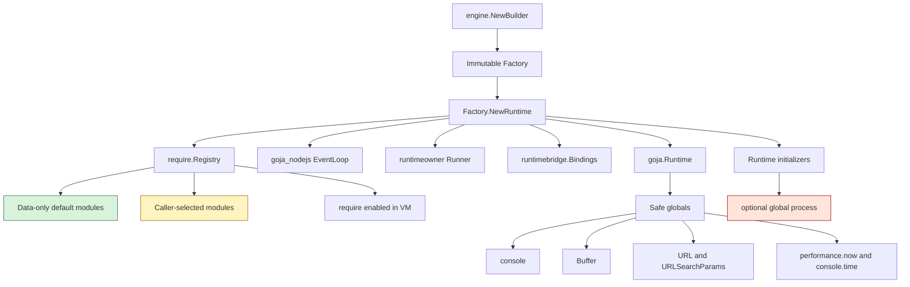
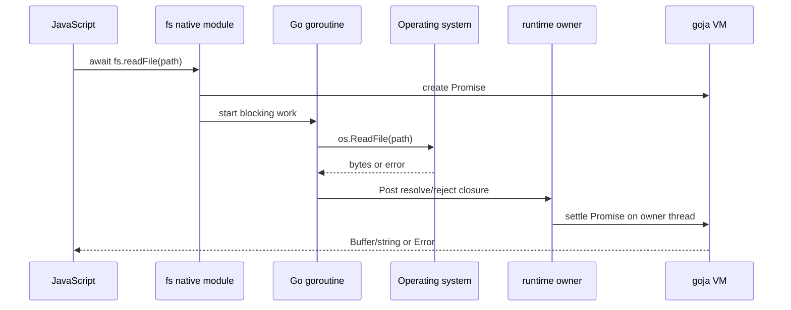

# go-go-goja Node-like Primitives: Technical Deep Dive

This report explains the implementation of Node.js-like primitives in `go-go-goja`: why the runtime needed them, how they are wired into the engine, which parts are enabled by default, which parts require explicit host opt-in, and how the design keeps a useful JavaScript scripting environment from becoming an accidental host escape hatch.

The work is tracked in the repository ticket `GOJA-053` under `/home/manuel/workspaces/2026-04-25/add-primitive-modules/go-go-goja/ttmp/2026/04/25/GOJA-053--add-fs-primitive-module-and-ensure-all-goja-nodejs-modules-are-require-able`. The implementation now gives embedded JavaScript a practical subset of Node's everyday tools: `Buffer`, `URL`, filesystem operations, paths, OS information, crypto helpers, timing helpers, and controlled access to process/environment features.

> [!summary]
> - The runtime now has a deliberate split between **data-only primitives** and **host-access primitives**. Safe globals and data-only modules are available by default; filesystem, OS, subprocess, and database access are explicitly selected by the embedder.
> - The implementation uses the existing goja runtime factory as the composition point. A factory builds a `require` registry, installs safe globals, registers data-only modules, and then applies caller-selected modules and runtime initializers.
> - The `fs` module is async-first and Buffer-aware. Async operations perform blocking OS work in goroutines and settle JavaScript Promises back on the runtime owner thread.
> - The project intentionally does not clone all of Node. It implements the subset that makes scripts useful while preserving a clear sandbox policy for Go embedders.

## Why this project exists

A JavaScript runtime without primitive modules is technically programmable but practically lonely. It can compute values, call functions, and manipulate objects, but it cannot read a config file, generate a random UUID, build a portable path, measure its own performance, or use common binary data conventions without a custom Go binding for each task. That is acceptable for a narrow embedded DSL. It is not enough for a general scripting layer.

Node.js solved this problem by shipping a broad standard library. The goal here was not to recreate Node completely. The goal was more precise: give `go-go-goja` enough Node-shaped surface area that everyday scripts feel familiar, while keeping host exposure visible at runtime construction time.

That last clause matters. `go-go-goja` is an embedded runtime. The Go host controls the VM, the module registry, the event loop, the runtime owner, and the surrounding process. A browser can treat JavaScript as untrusted code inside a mature sandbox. Node treats JavaScript as application code with process-level powers. `go-go-goja` sits in between. It needs Node-like ergonomics, but it must not accidentally inherit Node's assumption that JavaScript may freely inspect and mutate the host.

The project therefore has two intertwined goals:

1. **Ergonomics:** make common JavaScript scripts work with familiar APIs such as `Buffer`, `URL`, `require("fs")`, `require("path")`, `require("crypto")`, and `performance.now()`.
2. **Composability:** make every host-sensitive capability an explicit runtime composition decision in Go.

The resulting design is best understood as a runtime factory that builds a capability set.

## Current project status

The implementation is active and functional. The important pieces are already in place:

- `Buffer`, `URL`, `URLSearchParams`, `console`, `performance.now()`, and `console.time*` are installed as safe globals.
- `require("buffer")`, `require("url")`, `require("util")`, and `require("process")` are available through `goja_nodejs` core-module registration.
- The global `process` object is opt-in through `engine.ProcessEnv()` because it exposes `process.env`.
- Data-only modules are enabled by default: `crypto`, `path`, `time`, and `timer`.
- Host-access modules are selectable: `fs`, `os`, `exec`, and `database`.
- `fs` supports Promise-based APIs, synchronous APIs, Buffer/string behavior, common options, Node-style error fields, and `rm`/`rmSync`.
- `path`, `os`, and `crypto` provide focused subsets of Node-like behavior.
- The project includes real smoke tests that execute JavaScript in live goja runtimes rather than only testing Go helper functions.

There are known limitations. They are deliberate boundaries rather than accidental omissions:

- `path` uses Go's `path/filepath`, so it follows the host platform. It does not yet provide Node's exact `path.posix` and `path.win32` split.
- `os.release()` and `os.type()` are pragmatic values derived from Go runtime information.
- `crypto` is a focused subset: UUIDs, random bytes, and basic hashes.
- `fs` error objects expose useful Node-style fields but do not exactly duplicate Node's error message formatting.
- `process` remains globally opt-in, but `require("process")` is available because the `goja_nodejs` process module is registered.

## The runtime composition model

The core implementation lives in the engine factory. A caller does not instantiate a bare `goja.Runtime` and then hope modules appear. Instead, the caller creates an `engine.Factory` through `engine.NewBuilder()`. The factory is an immutable build plan: it remembers require options, static module registrations, runtime-scoped module registrars, and runtime initializers.

The important sequence happens in `engine/factory.go`, inside `Factory.NewRuntime(ctx)`:

1. Create a fresh `goja.Runtime`.
2. Create and start a `goja_nodejs/eventloop.EventLoop`.
3. Create a runtime owner runner that serializes VM access.
4. Store runtime bridge bindings so native modules can find the owner, event loop, and cancellation context.
5. Create a `require.Registry`.
6. Register data-only default modules.
7. Register caller-selected modules.
8. Enable `require()` in the VM.
9. Install safe globals such as `console`, `Buffer`, `URL`, `URLSearchParams`, `performance`, and console timers.
10. Run opt-in runtime initializers such as `ProcessEnv()`.

In diagram form:



The factory is the right place for this work because it is the boundary between the Go host and the JavaScript world. By the time user code runs, the runtime should already know what it can require, which globals exist, and which host capabilities are intentionally exposed.

## The key abstraction: module specs and runtime initializers

The composition API has two distinct concepts:

```go
type ModuleSpec interface {
    ID() string
    Register(reg *require.Registry) error
}

type RuntimeInitializer interface {
    ID() string
    InitRuntime(ctx *RuntimeContext) error
}
```

A `ModuleSpec` is about the `require` registry. It answers the question: what should `require("...")` be able to resolve? A `RuntimeInitializer` is about the live VM. It answers the question: what should be installed into this runtime instance after `require` exists?

That distinction is the reason `process` is handled carefully. The `process` module can be require-able:

```javascript
const process = require("process");
```

but the global object is a separate decision:

```go
factory, err := engine.NewBuilder().
    WithRuntimeInitializers(engine.ProcessEnv()).
    Build()
```

This keeps the implementation honest. Module registration and global mutation are different powers. The API reflects that.

The same abstraction supports native modules from two sources. First, a module can be registered directly with `NativeModuleSpec`. Second, it can be selected from `modules.DefaultRegistry` by name. The new granular helpers make the common case readable:

```go
factory, err := engine.NewBuilder().
    WithModules(engine.DefaultRegistryModule("fs")).
    Build()
```

or:

```go
factory, err := engine.NewBuilder().
    WithModules(engine.DefaultRegistryModulesNamed("fs", "os")).
    Build()
```

The old broad helper still exists:

```go
engine.DefaultRegistryModules()
```

but it is now best understood as a trusted-runtime convenience, not the recommended sandbox default.

## Data-only defaults versus host-access modules

The most important policy decision in the project is the split between data-only primitives and host-access primitives.

A plain runtime built with:

```go
factory, err := engine.NewBuilder().Build()
```

still receives useful capabilities:

```javascript
console.log(typeof Buffer);           // function
console.log(typeof URL);              // function
console.log(require("path").join("a", "b"));
console.log(require("crypto").randomUUID());
console.log(require("time").now());
```

But it does not receive filesystem or OS access:

```javascript
require("fs"); // fails unless selected
require("os"); // fails unless selected
```

The current data-only default module list is implemented in `engine/module_specs.go`:

```go
var dataOnlyDefaultRegistryModuleNames = []string{"crypto", "path", "time", "timer"}
```

That line is small, but it encodes the runtime's default trust model.

| Category | Examples | Default? | Reason |
|---|---|---:|---|
| Safe globals | `console`, `Buffer`, `URL`, `URLSearchParams`, `performance` | Yes | They do not directly expose host files, processes, or environment variables. |
| Data-only modules | `path`, `crypto`, `time`, `timer` | Yes | They provide computation, formatting, randomness, or scheduling without general host inspection. |
| Host-access modules | `fs`, `os`, `exec`, `database` | No | They expose host filesystem, OS metadata, subprocesses, or external state. |
| Process global | `process.env` | No | It exposes host environment variables. |

This policy is not a mathematical proof of safety. `crypto.randomBytes()` still consumes host randomness, and `timer` affects scheduling. The point is narrower: a default runtime should be useful without granting broad authority over the host machine.

## Imported goja_nodejs primitives

The first layer of Node-like support comes from `goja_nodejs` itself. Packages such as `buffer`, `url`, `util`, and `process` register core modules through Go package `init()` functions. For registration to happen, the packages must be imported. `engine/nodejs_init.go` contains the explicit blank imports that make this policy visible.

The factory then installs safe globals:

```go
console.Enable(vm)
buffer.Enable(vm)
url.Enable(vm)
```

This is why scripts can use `Buffer` and `URL` without first requiring a module:

```javascript
const b = Buffer.from("hello");
const u = new URL("https://example.com/search?q=goja");
```

There is a subtle lesson here: `require("buffer")` and global `Buffer` are related but not identical. The first is module resolution. The second is global-object mutation. A runtime can have one without the other. `go-go-goja` chooses to install `Buffer`, `URL`, and `URLSearchParams` globally because they are common, familiar, and not host-secret-bearing.

`process` follows the opposite rule. The module is require-able, but the global is not installed unless the caller opts in. That choice prevents accidental exposure of host environment variables through code that merely assumes Node's global `process` exists.

## Timing primitives

Timing support was added in three places:

- global `performance.now()`
- global `console.time()`, `console.timeLog()`, and `console.timeEnd()`
- explicit `require("time")`

The implementation uses Go's monotonic time behavior through `time.Now()` and `time.Since(start)`. The value returned to JavaScript is elapsed milliseconds as a `float64`, matching the familiar browser/Node shape of `performance.now()`.

A script can therefore write:

```javascript
const start = performance.now();
// work
console.log(`elapsed: ${performance.now() - start}ms`);
```

or:

```javascript
console.time("load");
// work
console.timeEnd("load");
```

or:

```javascript
const time = require("time");
const t0 = time.now();
// work
console.log(time.since(t0));
```

The implementation detail that matters is ordering. `console.time*` augments the console object after `console.Enable(vm)` has installed it. If the factory tried to patch console before enabling it, the methods would attach to nothing. This is a small example of why the factory setup sequence should be treated as architecture, not incidental startup code.

## The filesystem module: async-first, Buffer-aware, owner-thread-safe

The `fs` module is the largest primitive in the project because it combines host access, blocking operating-system calls, Promise semantics, binary data, options, and error conversion.

The public JavaScript shape is intentionally familiar:

```javascript
const fs = require("fs");

await fs.mkdir("/tmp/goja-demo", { recursive: true });
await fs.writeFile("/tmp/goja-demo/message.txt", "hello", { encoding: "utf8" });

const buf = await fs.readFile("/tmp/goja-demo/message.txt");
console.log(buf.toString());

const text = await fs.readFile("/tmp/goja-demo/message.txt", "utf8");
console.log(text);
```

Reads return `Buffer` by default and strings when an encoding is supplied. Writes accept strings, Buffers, TypedArrays, and DataViews. This matters because binary correctness is one of the main reasons Node's `fs` API is useful. A filesystem module that silently converts everything to strings is pleasant for demos and dangerous for real scripts.

The async implementation follows a consistent pattern. A function creates a Promise on the owner thread, performs blocking filesystem work in a goroutine, and then posts resolution or rejection back to the runtime owner:

```go
func asyncValue(vm *goja.Runtime, bindings runtimebridge.Bindings, op string, fn func() (any, error)) goja.Value {
    promise, resolve, reject := vm.NewPromise()
    go func() {
        value, err := fn()
        if err != nil {
            _ = bindings.Owner.Post(bindings.Context, op+".reject", func(context.Context, *goja.Runtime) {
                _ = reject(fsErrorValue(vm, err))
            })
            return
        }
        _ = bindings.Owner.Post(bindings.Context, op+".resolve", func(context.Context, *goja.Runtime) {
            _ = resolve(vm.ToValue(value))
        })
    }()
    return vm.ToValue(promise)
}
```

This pattern is the heart of safe async native modules in `go-go-goja`. The goroutine may do OS work, but it must not freely mutate the VM. The VM is owned by the runtime owner. Promise settlement is therefore scheduled through `bindings.Owner.Post(...)`.

The data flow looks like this:



The module also exposes sync variants:

```javascript
fs.writeFileSync("/tmp/sync.txt", Buffer.from("sync"));
const text = fs.readFileSync("/tmp/sync.txt", "utf8");
```

The sync variants are useful for small scripts and setup code. They deliberately block the runtime. The async variants should be the default for longer-running or interactive environments.

## Filesystem options and errors

The `fs` implementation supports the options that scripts most often need:

- read encodings such as `"utf8"`
- write/append encodings
- file modes
- `mkdir(..., { recursive: true })`
- `rm(..., { recursive, force })`

When operations fail, errors are converted into JavaScript `Error` objects with Node-style fields:

```javascript
try {
  fs.readFileSync("/tmp/does-not-exist");
} catch (err) {
  console.log(err.code);    // ENOENT
  console.log(err.path);    // /tmp/does-not-exist
  console.log(err.syscall); // open
}
```

This is not full Node error-message compatibility, but it gives callers the important programmable fields. The fields matter more than the exact English sentence because scripts branch on `err.code`, not on the formatted message.

## Path, OS, and crypto modules

The follow-up primitive modules fill out the everyday scripting environment.

The `path` module is default-enabled and host-platform-backed:

```javascript
const path = require("path");
const file = path.join("/tmp", "goja-demo", "message.txt");
console.log(path.dirname(file));
console.log(path.basename(file));
console.log(path.extname(file));
```

It uses Go's `path/filepath`, which is exactly what a Go embedder often wants when JavaScript is constructing paths for the host machine. It is not what a script wants if it needs deterministic POSIX behavior on every host. That future use case should be handled with explicit `path.posix` and `path.win32` variants.

The `os` module is opt-in because it exposes host information:

```javascript
const os = require("os");
console.log(os.homedir());
console.log(os.tmpdir());
console.log(os.platform());
console.log(os.arch());
```

The `crypto` module is default-enabled because it is treated as data-only. It provides UUIDs, random bytes, and common hashes:

```javascript
const crypto = require("crypto");

const id = crypto.randomUUID();
const bytes = crypto.randomBytes(16);
const sha = crypto.createHash("sha256").update("hello").digest("hex");
```

`digest()` returns a Buffer by default. `digest("hex")` and `digest("base64")` return strings. The supported algorithms are `md5`, `sha1`, `sha256`, and `sha512`.

The design principle across these modules is the same: implement the subset that is immediately useful, make the limitation explicit, and leave space for compatibility expansion when a real script requires it.

## Smoke tests as architecture validation

The project used real JavaScript smoke tests rather than only testing Go helpers. That matters because the risky parts of this work live at the boundary:

- Does `require("fs")` resolve in an actual runtime?
- Does a Promise returned by Go settle in JavaScript?
- Does a Buffer returned by Go behave like a JavaScript Buffer?
- Does `process` stay absent globally until explicitly enabled?
- Are host-access modules absent from a plain runtime?
- Can `DefaultRegistryModule("fs")` enable only `fs` and not `os`?

A representative test shape is:

```go
factory, err := engine.NewBuilder().
    WithModules(engine.DefaultRegistryModule("fs")).
    Build()

rt, err := factory.NewRuntime(context.Background())

ret, err := rt.Owner.Call(context.Background(), "smoke", func(_ context.Context, vm *goja.Runtime) (any, error) {
    return vm.RunString(`
        const fs = require("fs");
        fs.writeFileSync(path, Buffer.from("hello"));
        fs.readFileSync(path).toString();
    `)
})
```

The important phrase is `rt.Owner.Call`. The tests exercise the same owner-thread discipline that production modules must respect. They are not merely unit tests of helper functions; they are integration tests of runtime construction, module registration, JavaScript execution, and value conversion.

## A subtle runtime bug: pending Promise timeout status

During broader validation, an unrelated flaky test surfaced in the REPL session code. A pending Promise timeout sometimes returned `"runtime-error"` instead of `"timeout"`. The underlying error was a runtime owner cancellation caused by context deadline expiration:

```text
runtimeowner replsession.promise-state: runtime call canceled: context deadline exceeded
```

The fix was in `pkg/replsession/evaluate.go`: when `waitPromise()` receives an owner-call error, it checks whether the evaluation context already has a timeout cause. If so, it returns the timeout cause instead of reporting a generic runtime error.

This bug is worth mentioning because it illustrates how async primitives stress the runtime. Adding Promise-returning modules is not just a module-level feature; it exercises the REPL, the owner, cancellation paths, and result classification. The filesystem implementation made this pressure visible.

## Third-party embedding

The final embedding story is intentionally simple. If a third-party Go package wants a useful JavaScript runtime with data-only primitives, it can do this:

```go
package myruntime

import (
    "context"

    "github.com/go-go-golems/go-go-goja/engine"
)

func NewRuntime(ctx context.Context) (*engine.Runtime, error) {
    factory, err := engine.NewBuilder().Build()
    if err != nil {
        return nil, err
    }
    return factory.NewRuntime(ctx)
}
```

If it wants file access, it says so:

```go
factory, err := engine.NewBuilder().
    WithModules(engine.DefaultRegistryModule("fs")).
    Build()
```

If it wants file and OS access:

```go
factory, err := engine.NewBuilder().
    WithModules(engine.DefaultRegistryModulesNamed("fs", "os")).
    Build()
```

If it wants the global `process` object:

```go
factory, err := engine.NewBuilder().
    WithRuntimeInitializers(engine.ProcessEnv()).
    Build()
```

This API is the public expression of the design philosophy. A runtime is not a monolith. It is a composed capability set.

## Security and sandboxing lessons

The sandboxing lesson from this project is not that data-only primitives are perfectly safe and host-access primitives are dangerous. The real lesson is that capabilities should have names, and embedders should grant them deliberately.

`fs` is not evil. It is powerful. `os` is not evil. It reveals host facts. `exec` is not evil. It delegates authority to the operating system. Each of these can be exactly what a trusted automation script needs. Each can also be a serious sandbox violation if it appears by accident.

The granular module selection work turns that distinction into code:

```go
engine.DefaultRegistryModule("fs")
engine.DefaultRegistryModulesNamed("fs", "os")
engine.DefaultRegistryModules()
```

The names make code review easier. A reviewer can look at a factory builder and see the host powers being granted. That is much better than hiding them behind a generic "standard library" switch.

Subprocess execution deserves special caution. The existing `exec` module is selectable and host-sensitive. Node's standard subprocess API is `child_process`, and its `exec()` function runs through a shell. A future Node-compatible `child_process` module should probably be layered over a policy-driven subprocess design rather than exposing raw shell execution by default.

## Implementation map

The most important files are:

| Area | Files |
|---|---|
| Runtime factory and composition | `engine/factory.go`, `engine/module_specs.go`, `engine/runtime.go` |
| goja_nodejs core imports | `engine/nodejs_init.go` |
| Safe globals and timing | `engine/factory.go`, `engine/performance.go` |
| Optional process global | `engine/module_specs.go` |
| Filesystem module | `modules/fs/fs.go`, `modules/fs/fs_async.go`, `modules/fs/fs_sync.go`, `modules/fs/fs_errors.go` |
| Time module | `modules/time/time.go` |
| Path module | `modules/path/path.go` |
| OS module | `modules/os/os.go` |
| Crypto module | `modules/crypto/crypto.go` |
| Promise/cancellation support touched by validation | `pkg/replsession/evaluate.go` |
| User-facing help | `pkg/doc/16-nodejs-primitives.md`, `pkg/doc/01-introduction.md` |
| jsverbs file-backed field follow-up | `pkg/jsverbs/command.go`, `pkg/jsverbs/jsverbs_test.go` |

The ticket documentation and implementation diary are under:

```text
/home/manuel/workspaces/2026-04-25/add-primitive-modules/go-go-goja/ttmp/2026/04/25/GOJA-053--add-fs-primitive-module-and-ensure-all-goja-nodejs-modules-are-require-able
```

## Important commits

The implementation was committed in focused steps:

| Commit | Purpose |
|---|---|
| `eb9401a` | Add configurable Node.js primitive globals. |
| `a0e5628` | Add JavaScript timing primitives. |
| `79a3662` | Add promise-based fs primitives. |
| `2a2c9b5` | Stabilize pending Promise timeout status. |
| `ab179dd` | Add Buffer support to fs primitives. |
| `0a0c49c` | Add path, os, crypto, and fs options. |
| `5053b6a` | Add Glazed help entry for Node.js primitives. |
| `34ab48b` | Document third-party embedding. |
| `a7a6c97` | Add granular default module selection. |
| `0b01fc0` | Document granular primitive module selection. |
| `ace832a` | Support jsverbs `objectFromFile` fields. |

The commit history mirrors the architecture: first wire safe globals, then add timing, then add host filesystem access, then tighten compatibility, then split defaults by capability.

## Open questions

Several design questions remain useful for future work:

- Should `require("process")` itself be controllable, not just global `process`?
- Should `path.posix` and `path.win32` be implemented for deterministic cross-platform path behavior?
- Should `crypto` grow HMAC, more encodings, or WebCrypto-like APIs?
- Should an `events` module be added as a data-only default to support future stream and child-process APIs?
- Should `child_process` be implemented as a Node-compatible module, a safer policy-driven `subprocess` module, or both?
- Should `exec` be replaced or wrapped by a more structured sandbox-aware subprocess design?
- Should the default data-only list remain `crypto`, `path`, `time`, and `timer`, or should `timer` be explicit because it affects scheduling?

These are not blockers. They are the natural next decisions now that the base primitive layer exists.

## Near-term next steps

The next implementation layer should probably focus on evented APIs. Node's filesystem convenience APIs are useful, but many Node-compatible modules depend on `EventEmitter`, streams, and child processes. A small `require("events")` module with `EventEmitter` would be a good data-only addition. It would provide the foundation for future `child_process.spawn()` and stream-like objects.

A safe subprocess design should come after that. The recommended path is not to expose raw shell execution first. Start with a policy-driven module that runs allowlisted commands and structured pipelines, then layer a Node-compatible `child_process` facade over it where appropriate.

## Project working rule

The working rule for this project is:

> Add Node-like capabilities only when the Go host can still explain, in code, exactly what authority was granted to JavaScript.

That rule is why `Buffer` is global, `path` is default, `fs` is opt-in, and global `process` requires a named initializer. It keeps the runtime pleasant for scripts without making the host boundary invisible.

The implementation is successful because it does not treat Node compatibility as an all-or-nothing identity. It treats Node as a vocabulary. `go-go-goja` can speak enough of that vocabulary to be useful, while still being an embedded Go runtime whose capabilities are composed deliberately.

## KB reviews

- [[KB-BATCH3-goja-ecosystem]] (2026-05-11) — concept extraction + classification

## Related KB entries

- [[Tribal/goja-embedding-in-go]] — the Go+JS runtime pattern
- [[Tribal/goja-execution-model]] — sessions + thread discipline (CREATED)

**Tribal candidates** (not yet at 3-project threshold):
- Data-only vs host-access module split (2/3)
- Runtime owner thread discipline (3/3) → **READY**
- Runtime-scoped module registrars (2/3)
