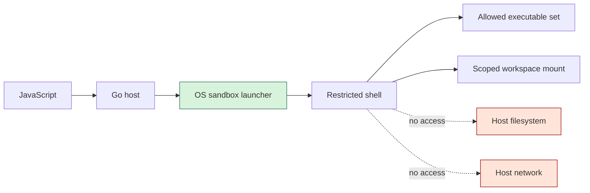

# Research: Go-Controlled Shell and Subprocess Sandboxing for JavaScript Runtimes

This research note records the design space for running subprocesses from an embedded JavaScript runtime while keeping control in Go. The motivating project is `go-go-goja`, where JavaScript can be embedded as a scripting layer, but host capabilities such as filesystem access, OS introspection, environment variables, and subprocess execution must be granted deliberately.

The central question is simple to ask and subtle to answer: how can a JavaScript script get the convenience of shell-like execution while the Go host retains hard guarantees about which programs can run? The answer is that a raw shell and hard guarantees pull in opposite directions. If the host passes an arbitrary string to `/bin/sh -c`, then the shell language becomes part of the trusted computing base. If the host wants strong guarantees, it must either avoid the shell, interpret only a narrow shell subset itself, or put the shell behind an operating-system sandbox.

> [!summary]
> - Node's `child_process.exec()` runs through a shell; that is convenient, but it is the wrong default for a hard sandbox.
> - The strongest Go-controlled design is an allowlisted subprocess API where JavaScript names logical commands and Go validates executables, arguments, cwd, environment, timeouts, and output limits.
> - Shell-like ergonomics can be recovered with structured pipelines or a parsed shell subset, without giving JavaScript arbitrary `/bin/sh -c` power.
> - A literal guarantee that only certain binaries can ever execute requires OS-level controls too, because allowed programs can spawn other programs transitively.

## Why this research exists

`go-go-goja` now has a useful split between data-only primitives and host-access primitives. Safe globals such as `console`, `Buffer`, `URL`, `URLSearchParams`, and `performance` are always available. Data-only modules such as `path`, `crypto`, `time`, and `timer` are also available by default. Host-access modules such as `fs`, `os`, `exec`, and `database` require explicit selection through the engine factory.

Subprocess execution belongs firmly in the host-access category. It is more sensitive than file reads and more complex than environment access, because it can combine all other capabilities: a process can read files, open sockets, inspect the host, fork children, and interpret additional languages. A poorly designed subprocess module quietly becomes an escape hatch from every other sandbox decision.

The immediate comparison point is Node.js. In Node, the standard module for subprocesses is `child_process`:

```javascript
const { exec, execFile, spawn } = require("node:child_process");
```

The important distinction is that `exec()` runs a string through a shell, while `execFile()` and `spawn()` run executables directly by default.

```javascript
// Shell-backed. Pipelines, &&, redirects, globs, and variables are shell syntax.
exec("rg TODO src | head -n 20", callback);

// Direct process execution. No shell grammar unless you invoke a shell yourself.
execFile("rg", ["TODO", "src"], callback);
```

That distinction should shape the Go design. If compatibility with Node is the goal, `child_process.exec()` has a clear meaning: shell execution. If sandboxing is the goal, `exec()` should not be the primitive that embedders reach for first.

## The core mental model

A subprocess API is a capability boundary. JavaScript should not receive the capability "run whatever command string you can express." It should receive smaller capabilities such as "run ripgrep with these argument forms in this workspace" or "pipe this allowed command into that allowed command." Those capabilities are data. Go can inspect data before it acts. Shell strings are programs. Once Go hands a shell string to `/bin/sh`, the shell performs parsing, expansion, redirection, command lookup, and control flow outside the host's policy engine.

The mental model is therefore:

```mermaid
flowchart TD
    JS[JavaScript script] --> Request[Structured execution request]
    Request --> Policy[Go policy engine]
    Policy -->|reject| Error[Policy error]
    Policy -->|allow| Runner[Go subprocess runner]
    Runner --> OS[Operating system process]
    OS --> Result[Bounded stdout/stderr/status]
    Result --> JS

    ShellString[Raw shell string] -. bypasses structure .-> Shell[/bin/sh -c]
    Shell --> OS

    style Policy fill:#d8f3dc,stroke:#2d6a4f
    style ShellString fill:#ffe5d9,stroke:#9d0208
    style Shell fill:#ffe5d9,stroke:#9d0208
```

The policy engine must see the executable identity, arguments, working directory, environment, timeout, and output policy before a process starts. If it sees only one string, it must either parse shell itself or trust the shell.

## Option 1: Do not expose a shell; expose whitelisted commands

This is the strongest application-level design. JavaScript does not get a shell and does not even get arbitrary executable paths. Instead, it gets logical command names. Each logical command maps to a Go-side policy.

```javascript
const subprocess = require("subprocess");

const result = subprocess.run("rg", {
  args: ["TODO", "src"],
  cwd: "/workspace/project",
  timeoutMs: 10000,
});
```

In Go, the module owns the policy table:

```go
type SubprocessPolicy struct {
    Commands       map[string]CommandPolicy
    AllowedCWDs     []string
    Env             map[string]string
    DefaultTimeout  time.Duration
    MaxStdoutBytes  int64
    MaxStderrBytes  int64
}

type CommandPolicy struct {
    Path         string
    ValidateArgs func([]string) error
    AllowCWD     func(string) error
    Env          map[string]string
}
```

The implementation does not call a shell. It resolves the logical command, validates the arguments, normalizes and checks the working directory, constructs a controlled environment, applies context deadlines, and then invokes:

```go
cmd := exec.CommandContext(ctx, policy.Path, args...)
cmd.Dir = checkedCWD
cmd.Env = controlledEnv
```

This design gives Go strong guarantees at the API boundary:

| Guarantee | How Go enforces it |
|---|---|
| Only selected logical commands may run | JavaScript chooses keys from `policy.Commands`, not arbitrary paths. |
| Only selected binaries may run directly | Each command maps to a fixed absolute `Path`. |
| Arguments have known shape | `ValidateArgs` rejects forbidden flags, paths, or patterns. |
| Working directory is scoped | `AllowCWD` checks resolved paths against allowed roots. |
| Environment is controlled | `cmd.Env` is built from policy, not inherited blindly. |
| Runtime is bounded | `exec.CommandContext` and timeouts kill long-running commands. |
| Output is bounded | stdout/stderr writers enforce byte limits. |

The tradeoff is that shell syntax disappears. There is no `&&`, no `|`, no glob expansion, no redirects, and no `$HOME` expansion unless the module implements those concepts deliberately. For a hard sandbox, that tradeoff is usually a feature.

## Option 2: Provide structured pipelines instead of shell strings

Many scripts use shells not because they need the whole shell language, but because pipelines are convenient. Pipelines can be modeled as data without invoking `/bin/sh`.

```javascript
const subprocess = require("subprocess");

const result = subprocess.pipeline([
  { cmd: "rg", args: ["TODO", "src"] },
  { cmd: "head", args: ["-n", "20"] },
], {
  cwd: "/workspace/project",
});
```

Go validates every stage independently, then wires the processes together:

```go
first := exec.CommandContext(ctx, "/usr/bin/rg", "TODO", "src")
second := exec.CommandContext(ctx, "/usr/bin/head", "-n", "20")

pipe, err := first.StdoutPipe()
if err != nil { return err }
second.Stdin = pipe
```

A richer structured API can support shell-like control flow without shell parsing:

```javascript
subprocess.sequence([
  { cmd: "go-test", args: ["./..."] },
  { cmd: "git-status", args: ["--short"] },
]);

subprocess.and([
  { cmd: "go-test", args: ["./..."] },
  { cmd: "go-vet", args: ["./..."] },
]);
```

The user experience is close to a shell, but the host still sees every command as structured data before execution. This is the best middle ground for `go-go-goja`: shell ergonomics where they matter, Go policy where it matters more.

## Option 3: Parse a shell subset and interpret it yourself

If users strongly prefer shell-like strings, Go can accept a string but refuse to hand it to a shell. Instead, it parses the string into an AST, rejects unsupported features, and executes the allowed subset itself.

The Go package `mvdan.cc/sh/v3/syntax` is the natural parser for this approach:

```go
parser := syntax.NewParser()
file, err := parser.Parse(strings.NewReader(script), "")
```

The host then walks the AST and allows only a small grammar. For example, a conservative subset might allow:

- simple commands
- pipelines
- `&&` and `||`
- single-quoted and double-quoted words without command substitution
- environment variables only from an allowlist, or no variable expansion at all

It should reject:

- command substitution: `$(...)` and backticks
- process substitution: `<(...)` and `>(...)`
- arbitrary redirects, unless the destination is policy-checked
- `source` / `.`
- `eval`
- functions and aliases
- here-documents
- glob expansion unless Go implements scoped expansion itself

The danger is not parsing. Parsing is only the first step. The hard part is faithfully defining which shell constructs are safe and making sure unsupported constructs fail closed. Shell is a full programming language with decades of edge cases. A partial interpreter must be small, explicit, and boring.

A safe-shell subset might accept:

```sh
rg TODO src | head -n 20
```

and reject:

```sh
rg "$(cat /secret)" src
source ./setup.sh
python -c 'import os; os.system("/bin/sh")'
```

The last example reveals a deeper problem: even if the shell subset is safe, an allowed executable may itself interpret another language or spawn children. That is the transitive execution problem.

## Option 4: Use a real shell inside an OS sandbox

If the requirement is truly "run arbitrary shell syntax," the hard boundary should move below the shell. The shell should run in an operating-system sandbox that controls filesystem visibility, network access, users, capabilities, and resource limits.

On Linux, strong building blocks include:

- user namespaces
- mount namespaces
- network namespaces
- read-only bind mounts
- cgroups
- seccomp
- AppArmor or SELinux
- non-root users
- `setrlimit`
- tools such as `bubblewrap`, `nsjail`, Firejail, Docker/Podman, gVisor, or Kata Containers

The strongest version creates a filesystem namespace containing only the allowed executables and libraries. If `/usr/bin/python3` is not present, the shell cannot execute it by absolute path. If the network namespace has no route, a process cannot open arbitrary network connections. If the workspace is mounted read-only, shell redirection cannot overwrite source files.



This approach can support raw shell strings, but it is operationally heavier and platform-specific. macOS has fewer convenient primitives than Linux. Dedicated low-privilege users, helper processes, and virtual machines can help, but Linux namespaces are the more straightforward path for hard process isolation.

## Option 5: Restricted `PATH` is useful but not sufficient

A common first attempt is to run a shell with a restricted `PATH`:

```go
cmd := exec.CommandContext(ctx, "/bin/sh", "-c", script)
cmd.Env = []string{
    "PATH=/sandbox/bin",
    "HOME=/tmp/sandbox-home",
}
```

This prevents accidental lookup of commands outside `/sandbox/bin`, but it is not a hard sandbox. A shell script can still invoke absolute paths:

```sh
/bin/rm
/usr/bin/python3
```

It can also use shell builtins, redirections, command substitution, and whatever interpreters are reachable. Restricted `PATH` is a useful convenience layer when combined with a filesystem namespace or wrapper binaries. By itself, it is not a security boundary.

## Option 6: Wrapper binaries for allowed operations

Wrapper binaries are a practical way to make allowed operations stable and auditable. Instead of exposing raw `git`, expose `/sandbox/bin/git-status`. Instead of exposing raw `go`, expose `/sandbox/bin/go-test`. Each wrapper validates arguments and invokes the real tool in a known way.

```text
/sandbox/bin/
├── rg
├── go-test
├── go-vet
└── git-status
```

This pattern works especially well with a structured API:

```javascript
subprocess.run("go-test", { args: ["./..."], cwd: "/workspace/repo" });
```

It also works inside an OS sandbox: mount only the wrapper directory into the sandbox path, and avoid mounting general-purpose interpreters unless they are intentionally part of the capability set.

Wrappers are not magic. If a wrapper eventually calls a tool that can spawn arbitrary children, the OS sandbox still matters. But wrappers make policy visible and auditable, and they give the JavaScript layer stable command names that do not depend on host paths.

## The transitive execution problem

A direct allowlist answers the question "what may JavaScript ask Go to execute?" It does not fully answer "what may ever execute as a consequence?" Many useful programs can spawn other programs.

Examples:

- `git difftool` and `git mergetool` can launch external tools.
- `git` can invoke pagers, hooks, credential helpers, and filters.
- `go test` can compile and execute test binaries.
- `npm install` can run lifecycle scripts.
- `python script.py` can call `subprocess.run()`.
- `bash script.sh` is deliberately a shell interpreter.

This is why hard guarantees have layers. At the Go API layer, allowlists prevent direct misuse. At the OS layer, namespaces and filesystem restrictions prevent transitive escape. At the policy layer, command-specific validators prevent dangerous flags and modes.

A useful rule of thumb:

> If an allowed program is also an interpreter, package manager, shell, build system, or VCS, treat it as a delegated sandbox boundary, not a simple binary.

## Recommended design for `go-go-goja`

The best fit is an opt-in, policy-driven subprocess module. It should not try to be Node's `child_process.exec()` first. It should start from a safer primitive and then optionally add compatibility.

A possible Go API:

```go
policy := subprocess.Policy{
    Commands: map[string]subprocess.CommandPolicy{
        "rg": {
            Path: "/usr/bin/rg",
            ValidateArgs: subprocess.All(
                subprocess.MaxArgs(8),
                subprocess.DisallowFlags("--pre"),
            ),
        },
        "go-test": {
            Path: "/usr/local/go/bin/go",
            PrefixArgs: []string{"test"},
            ValidateArgs: subprocess.PackagePatternsOnly,
        },
    },
    AllowedCWDs: []string{"/workspace"},
    Env: map[string]string{
        "HOME": "/tmp/goja-sandbox-home",
        "PATH": "/usr/bin",
    },
    DefaultTimeout: 30 * time.Second,
    MaxStdoutBytes: 1 << 20,
    MaxStderrBytes: 1 << 20,
}

factory, err := engine.NewBuilder().
    WithModules(subprocess.Module(policy)).
    Build()
```

The JavaScript API should expose direct execution and structured pipelines:

```javascript
const subprocess = require("subprocess");

const rg = subprocess.run("rg", {
  args: ["TODO", "src"],
  cwd: "/workspace/repo",
});

const firstTodos = subprocess.pipeline([
  { cmd: "rg", args: ["TODO", "src"] },
  { cmd: "head", args: ["-n", "20"] },
], {
  cwd: "/workspace/repo",
});
```

A Node-compatible module can exist later, but should be explicit about risk:

```go
factory, err := engine.NewBuilder().
    WithModules(childprocess.Module(childprocess.Policy{
        AllowExecShell: false,
        AllowExecFile: true,
        Commands: commandPolicy,
    })).
    Build()
```

Under that policy:

- `execFile()` maps naturally to controlled direct execution.
- `spawn()` can be added once streaming and event semantics are implemented safely.
- `exec()` should be disabled unless `AllowExecShell` is true or implemented through a safe-shell parser.

## Suggested implementation sequence

Start with the smallest useful secure surface, then add convenience only where the policy model remains clear.

### Step 1: Direct command execution

Implement:

```javascript
subprocess.run(cmdName, { args, cwd, env, timeoutMs })
```

Return a structured result:

```javascript
{
  code: 0,
  stdout: "...",
  stderr: "...",
  signal: null,
  timedOut: false
}
```

Reject unknown commands, invalid cwd, invalid env keys, invalid arguments, excessive output, and expired timeouts.

### Step 2: Command-specific validators

Add reusable validators:

```go
MaxArgs(n)
ExactArgs(...)
AllowedFlags(...)
DisallowFlags(...)
PathsUnder(root)
PackagePatternsOnly
NoShellMetacharacters
```

The validator API should make safe policies easy to read in code review.

### Step 3: Structured pipelines

Implement:

```javascript
subprocess.pipeline([{ cmd, args }, ...], options)
```

Validate every stage before starting any process. If validation fails, no process should start.

### Step 4: OS sandbox integration

Add an optional runner backend:

```go
type Runner interface {
    Run(ctx context.Context, req CheckedRequest) (Result, error)
}
```

The default runner uses `exec.CommandContext`. A hardened runner can launch through `bubblewrap`, `nsjail`, a container, or a dedicated helper service.

### Step 5: Optional Node compatibility layer

Only after the policy-driven core exists, add `child_process` compatibility. The compatibility layer should be a thin adapter over the safe runner, not a separate bypass.

## Common failure modes

### Failure mode: Treating shell escaping as sandboxing

Escaping protects one string interpolation site. It does not turn shell into a restricted language. If the user controls enough of the shell string, or if the script composes multiple dynamic pieces, the policy becomes hard to reason about.

### Failure mode: Allowing interpreters without treating them as policy engines

Allowing `python`, `bash`, `node`, `perl`, or `ruby` is equivalent to allowing programs that can run other programs and read files. That may be fine, but it must be intentional and usually requires OS sandboxing.

### Failure mode: Forgetting inherited environment

`exec.Command` inherits no environment if `Env` is nil? In Go, `Cmd.Env == nil` means inherit the parent process environment. A secure runner should build `Env` explicitly.

### Failure mode: Unbounded output

A command that writes forever can exhaust memory if the host buffers stdout and stderr blindly. The runner should use bounded writers and return an explicit "output limit exceeded" error.

### Failure mode: Starting part of a pipeline before validating all of it

For pipelines, validation must happen before execution. If stage one starts and stage two later fails validation, the system has already executed something that policy may have intended to reject as a whole.

### Failure mode: Confusing `PATH` control with execution control

Restricted `PATH` prevents some accidental command lookup. It does not prevent absolute paths, shell builtins, mounted interpreters, or transitive execution by allowed programs.

## Working rules

- Do not expose raw `exec(commandString)` to untrusted JavaScript unless an OS sandbox is the real boundary.
- Prefer logical command names over executable paths in JavaScript APIs.
- Validate all arguments as data before constructing an `exec.Cmd`.
- Build the environment explicitly; do not inherit by default.
- Treat cwd as a capability. Normalize it and check it against allowed roots.
- Bound runtime and output size for every subprocess.
- Validate a whole pipeline before starting any stage.
- Treat interpreters, package managers, shells, build tools, and VCS tools as high-risk even when they are allowlisted.
- Keep Node compatibility separate from the safe primitive, so users must opt into shell semantics knowingly.

## Open questions

- Should `crypto` remain classified as data-only even though it uses host randomness? It does not expose host data, but it does consume a host capability.
- Should `timer` remain a default data-only module? It does not expose host data, but it affects scheduling and long-running script behavior.
- Should `go-go-goja` provide a generic subprocess module, a Node-compatible `child_process` module, or both?
- Should the first implementation include OS sandbox adapters, or should it define the interface first and ship only direct execution?
- How should streaming output be represented in goja without overcomplicating the event-loop contract?

## Conclusion

The safe design is not "a better escaped shell." The safe design is to avoid giving JavaScript a shell until the host has decided exactly what kind of process execution belongs in the runtime. For `go-go-goja`, the natural primitive is a policy-driven subprocess module with direct execution and structured pipelines. Node compatibility can be layered on top, but `child_process.exec()` should remain an explicit high-trust capability because it means shell execution.

The durable lesson is broader than this one runtime: subprocess execution is not a function call. It is a delegation of authority to the operating system and to every executable reachable from that delegation. A good embedding API makes that authority visible, reviewable, and narrow.
