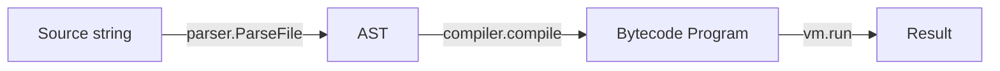
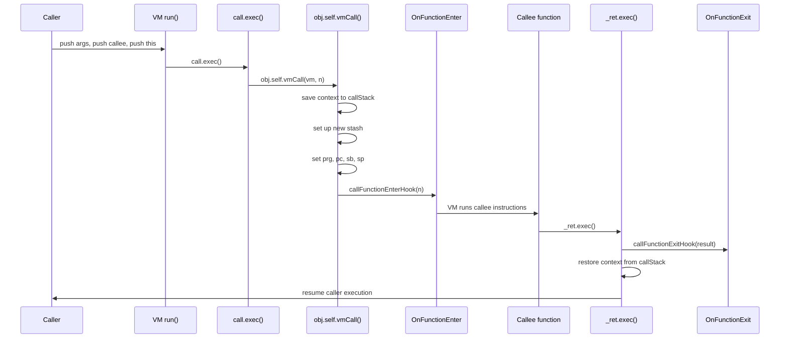

# Goja RuntimeHook Internals: Building Tracers, Debuggers, and TUI Visual Debuggers

This article explains how the `dop251/goja` JavaScript engine executes code, how PR #697 introduces the `RuntimeHook` API for instrumentation, and how to build tracers, debuggers, and terminal visual debuggers on top of it. The target audience is a Go engineer who has never worked on a JS engine but wants to understand how to observe and control JavaScript execution from Go.

> [!summary]
> The four most important ideas in this article:
> 1. Goja executes JavaScript through a three-stage pipeline (parse → compile → VM execute) where the VM is a stack-based bytecode interpreter
> 2. `RuntimeHook` is a single Go interface with six callbacks that fire at key execution points; when no hook is attached, overhead is one nil-pointer check per instruction
> 3. The hook can pause execution via `HookResultPause` and resume via `Runtime.Resume()`, using `sync.Cond` for efficient goroutine coordination
> 4. Introspection APIs (`Scopes()`, `VMState()`, `CaptureCallStack()`) expose previously invisible runtime state, enabling full visual debuggers

## Why this article exists

Before PR #697, goja was essentially a black box during execution. You could run a script and get a result or an error, but you could not step through code, inspect live variables, set breakpoints, or trace function calls. The only control mechanism was `Interrupt()`, which abruptly terminates execution. This is a sharp tool—useful for killing runaway scripts, but useless for understanding them.

This limitation matters because goja is used in production for a wide variety of tasks where visibility into execution is essential. Consider these scenarios:

- **Server-side JavaScript execution in Go services.** A Go backend might allow users to upload custom scripts that process data, validate inputs, or transform records. When a user script behaves unexpectedly, administrators need to understand what it is doing without killing the process.
- **Plugin systems that run user-authored scripts.** A plugin architecture gives users power, but that power comes with risk. When a plugin throws an exception or hangs, the host application needs diagnostic tools to pinpoint the problem.
- **REPL environments and interactive coding tools.** A REPL is fundamentally an interactive exploration tool. Users expect to step through code, inspect variables, and understand the call stack. Without these capabilities, a REPL is just a script runner.
- **Sandboxed evaluation of untrusted code.** Security-sensitive applications run untrusted JavaScript in sandboxes. Instrumentation is essential for monitoring resource usage, detecting anomalous behavior, and enforcing timeouts or quotas.

In all of these contexts, developers need visibility into what the JavaScript runtime is doing. They need to know which function is currently executing, what variables are in scope, how deep the call stack is, and whether an exception will be caught or propagate to the top level. The `RuntimeHook` API provides exactly this visibility with minimal overhead and a clean Go interface.

## What goja is and how it executes JavaScript

Goja (`github.com/dop251/goja`) is an implementation of ECMAScript 5.1 (with many ES6+ features such as `async/await`, `Promise`, arrow functions, `let`/`const`, classes, and generators) written entirely in Go. Unlike Node.js or a browser, goja is not a standalone process. It is an embedded library. You import it into a Go program, create a `*goja.Runtime`, and execute JavaScript scripts programmatically. This embedding model is what makes goja attractive for Go services that need scriptability, but it also means the host program is responsible for providing debugging and observability infrastructure.

Typical usage looks like this:

```go
package main

import "github.com/dop251/goja"

func main() {
    rt := goja.New()
    v, err := rt.RunString(`1 + 2`)
    if err != nil {
        panic(err)
    }
    fmt.Println(v.Export()) // 3
}
```

Under the hood, this simple call triggers a surprisingly deep execution pipeline. Understanding that pipeline is essential for understanding where and how hooks can observe execution.

### The three-stage pipeline

When goja runs a script, it passes through three distinct stages. Each stage transforms the code from one representation to another, and each transformation creates opportunities for observation.



**Stage 1: Parse.** The JavaScript source string is parsed by `github.com/dop251/goja/parser` into an abstract syntax tree (`ast.Program`). The AST represents the syntactic structure of the program—statements, expressions, declarations, control flow constructs. Parsing is purely syntactic: it checks that the source is valid JavaScript but does not execute anything. The parser also records source positions (file, line, column) for every AST node, which is essential for debugging because it allows the debugger to map bytecode positions back to source locations.

**Stage 2: Compile.** The AST is compiled by `github.com/dop251/goja/compiler` into a `*Program`. A `Program` is bytecode—a slice of `instruction` values. The compiler performs several important transformations:
- It resolves variable scoping, determining which variables are local, which are captured by closures, and which are global.
- It generates bytecode instructions for the VM to execute.
- It builds a source map (`srcMap`) that correlates bytecode positions (`pc` values) with source positions. This source map is what makes `StackFrame.Position()` and `FindPCsForLine()` possible.

The compilation step happens once per script. The resulting `*Program` can be executed multiple times via `Runtime.RunProgram(p)`. This is important for debugger design: the debugger can pre-compile scripts and then run them under observation. It is also important for restart semantics: a restarted debugger can recompile the source and run it again in a fresh runtime.

**Stage 3: Execute.** The `Runtime` creates a `vm` (virtual machine) and runs the bytecode in a loop. The VM is where all the action happens: values are pushed and popped from the stack, functions are called and returned, exceptions are thrown and caught, and scopes are created and destroyed. The `RuntimeHook` callbacks fire inside this execution loop, giving external code visibility into every step of the process.

### The VM as a stack machine

Goja's VM is a **stack-based bytecode interpreter**. This architectural choice shapes everything about how execution works and how hooks observe it. In a stack machine, operands are pushed onto a stack, instructions pop their operands from the stack, compute a result, and push the result back. There is no register file; everything flows through the stack. This design is simple to implement and compact, but it means that the stack itself is a central part of the execution state.

Understanding the VM's key types is essential for understanding how hooks observe execution:

```go
// vm.go:375
type vm struct {
    r            *Runtime      // back-pointer to the Runtime
    prg          *Program      // currently executing program
    pc           int           // program counter (index into prg.code)
    stack        valueStack    // operand stack
    sp, sb, args int           // stack pointer, stack base, arg count
    stash        *stash        // current lexical scope
    callStack    []context     // saved contexts for nested calls
    iterStack    []iterStackItem  // iterator state
    refStack     []ref         // reference stack for assignments
    tryStack     []tryFrame    // try/catch/finally frames
    curAsyncRunner *asyncRunner  // async execution state
}
```

These fields are the living state of execution. Let us examine them in detail:

- **`r`** is a back-pointer to the `Runtime` that owns this VM. The VM needs this to access runtime-global state such as the global object, the job queue, and the runtime hook. Every VM belongs to exactly one `Runtime`, and a `Runtime` has exactly one VM.

- **`prg`** is the `*Program` currently being executed. When a function is called, `prg` changes to the function's compiled program. When the function returns, `prg` is restored to the caller's program. This is how the VM switches between different pieces of compiled code.

- **`pc`** is the program counter—the index of the **next** instruction to execute in `prg.code`. After each instruction executes, `pc` is updated (usually incremented, but control flow instructions like jumps and calls change it to different values).

- **`stack`** is the operand stack. It is a dynamically-growing slice of `Value` objects. Instructions push operands onto the stack and pop results from it.

- **`sp`** (stack pointer) points to the next free slot on the operand stack. When an instruction pushes a value, it stores it at `stack[sp]` and increments `sp`. When an instruction pops a value, it decrements `sp` and reads `stack[sp]`.

- **`sb`** (stack base) marks the start of the current function's frame. When a function is called, `sb` is set to point past the function's arguments. Local variables are accessed relative to `sb`.

- **`stash`** points to the current lexical environment. This is where local variables live, and it is the most important type for understanding scopes and introspection.

- **`callStack`** holds saved contexts for nested function calls. When a function is called, the current `context` (containing `prg`, `pc`, `stash`, etc.) is pushed onto `callStack`. When the function returns, the context is popped and restored.

- **`tryStack`** holds `tryFrame` values for active `try/catch/finally` blocks. Each frame records where to jump if an exception occurs. This is how JavaScript's exception handling is implemented.

**Key invariants that hold throughout execution:**
- `pc` is always the index of the next instruction to execute, not the current one.
- `sp` is always the next free slot; `stack[sp-1]` is the top of the stack.
- `sb` marks the boundary between the current function's locals and the caller's stack.
- `stash` always points to the innermost active scope.

### The stash struct and how scopes work

The `stash` struct is the most important internal type for understanding scopes and introspection. It represents a lexical environment—a container for variable bindings that JavaScript code can access.

```go
// vm.go:24
type stash struct {
    values    []Value                 // indexed local variables
    extraArgs []Value                 // rest parameters
    names     map[unistring.String]uint32  // name → index in values
    obj       *Object                 // if non-nil, this is a "with" or global scope
    outer     *stash                  // parent scope (closure chain)
    funcType  funcType                // function kind marker
}
```

Let us walk through each field:

- **`values`** is a slice of `Value` objects that holds the actual variable values. Variables are accessed by index, not by name, at runtime. The compiler determines the index for each variable during compilation.

- **`names`** is a map from variable names to indices in `values`. This map is used when the debugger (or `eval()`) needs to look up a variable by name. In normal execution, the compiler generates direct index accesses, bypassing this map.

- **`obj`** is the key to understanding global and `with` scopes. When `obj` is non-nil, this stash is backed by a JavaScript object rather than a simple array of values. Global variables (`var x` at the top level) live in the global object, which is stored here. `with` statements also create object-backed scopes. This is why `Scopes()` has special logic for `ScopeGlobal` and `ScopeWith`.

- **`outer`** is the parent scope in the lexical chain. When a function is defined inside another function, it captures the outer function's scope. Variable lookup walks this chain from innermost to outermost. This is how closures work.

- **`funcType`** marks what kind of function this stash belongs to. This is used by `Scopes()` to distinguish function scopes from block scopes.

When a function is called, the VM creates a new `stash` and links it to its outer scope. Variable lookup walks the `outer` chain. The `Scopes()` API (added by PR #697) walks this chain from `vm.stash` outward and builds a human-readable representation.

### How the stash chain is built during execution

The stash chain grows and shrinks as functions are called and returned. Consider this JavaScript:

```javascript
function outer() {
    var a = 1;
    function inner() {
        var b = 2;
        return a + b;
    }
    return inner();
}
outer();
```

When `outer()` is called, the VM creates a stash for `outer` and links it to the global stash. When `inner()` is called, the VM creates a stash for `inner` and links it to `outer`'s stash. The chain looks like this:

```
inner stash  (funcType != funcNone)  → ScopeLocal
  → outer stash (funcType != funcNone) → ScopeLocal
    → global stash (obj == r.globalObject) → ScopeGlobal
```

The `Scopes()` API walks this chain and produces a `[]Scope` slice. For each stash, it determines the scope type by checking:
- If `obj != nil` and `obj == r.globalObject`, the scope is `ScopeGlobal`
- If `obj != nil` but not global, the scope is `ScopeWith`
- If `funcType != funcNone`, the scope is `ScopeLocal` (function scope)
- If `outer != nil` and `outer.funcType != funcNone`, the scope is `ScopeBlock` (block scope inside a function)
- Otherwise, the scope is `ScopeClosure` (captured variables)

This logic is in `runtime.go:2569` and is worth reading carefully because it reveals how goja maps its internal scope representation to the debugger-friendly `ScopeType` enum.

### The main execution loop

The heart of goja is `vm.run()` in `vm.go:634`. This loop is where every bytecode instruction is fetched and executed, and it is where the `OnInstruction` hook fires.

```go
func (vm *vm) run() {
    for {
        pc := vm.pc
        if pc < 0 || pc >= len(vm.prg.code) {
            break
        }
        // Runtime hook - only cost when hook attached
        if h := vm.r.runtimeHook; h != nil {
            if h.OnInstruction(vm.r, pc) == HookResultPause {
                vm.r.debugPausedMutex.Lock()
                vm.r.debugPaused = true
                for vm.r.debugPaused {
                    vm.r.debugPausedCond.Wait()
                }
                vm.r.debugPausedMutex.Unlock()
            }
        }
        vm.prg.code[pc].exec(vm)
    }
}
```

This is a classic fetch-decode-execute loop with one critical addition: the hook check. Let us trace through one iteration:

1. **Fetch.** The VM reads `pc` and checks that it is within bounds. If not, the loop exits.
2. **Hook check.** If a runtime hook is attached (`vm.r.runtimeHook != nil`), the VM calls `h.OnInstruction(vm.r, pc)`. If the hook returns `HookResultPause`, the VM blocks until `Resume()` is called.
3. **Execute.** The VM fetches the instruction at `prg.code[pc]` and calls its `exec(vm)` method. The instruction operates on the VM state—pushing and popping the stack, updating `pc`, modifying `stash`, etc.

The "decode" step is trivial because `prg.code[pc]` is already a typed `instruction` value. There is no opcode table or switch statement. Each instruction is a Go value that implements the `instruction` interface:

```go
type instruction interface {
    exec(*vm)
}
```

For example, the `call` instruction is a `call uint32` value. Its `exec` method pops the callee and arguments from the stack, resolves the callee to an `*Object`, calls `obj.self.vmCall(vm, n)`, and then (in PR #697) calls `vm.callFunctionEnterHook(n)`.

The hook check happens **before every instruction** when a hook is attached. This is what makes instruction-level stepping possible. The debugger can set `modeStepInto`, and the hook will pause before every single instruction, giving the user fine-grained control over execution.

## The RuntimeHook API

PR #697 introduces a minimal, low-overhead hook interface that enables building debuggers, profilers, tracers, and coverage tools. The design goals were deliberate: zero overhead when unused, a single interface for type safety, pause/resume support for interactive debugging, and a minimal API surface that does not include runtime eval or variable mutation.

### The interface

```go
// runtime_hook.go
type RuntimeHook interface {
    OnInstruction(rt *Runtime, pc int) HookResult
    OnFunctionEnter(rt *Runtime, name string, args []Value)
    OnFunctionExit(rt *Runtime, name string, result Value)
    OnException(rt *Runtime, exception *Exception, caught bool) HookResult
    OnPromiseReaction(rt *Runtime, promise *Object)
    OnVariableSet(rt *Runtime, name string, value Value, scope ScopeType)
}
```

Each callback has a specific purpose and fires at a well-defined execution point. Let us examine each one in detail:

**`OnInstruction(rt *Runtime, pc int) HookResult`**

This is the most frequent and most powerful callback. It is called **before every single bytecode instruction** when a hook is attached. The `pc` parameter is the program counter—the index of the instruction about to execute. The hook can return `HookResultContinue` to let execution proceed, or `HookResultPause` to block execution until `Runtime.Resume()` is called.

This callback is the foundation of all debugger control flow:
- **Breakpoints.** The hook checks whether the current source position matches a breakpoint. If so, it returns `HookResultPause`.
- **Step-over.** The hook checks whether the call depth has decreased back to the original level. If so, it pauses.
- **Step-into.** The hook simply returns `HookResultPause` on every instruction, allowing the user to step through code one instruction at a time.
- **Run-to-completion.** The hook always returns `HookResultContinue`, letting execution run freely.

**`OnFunctionEnter(rt *Runtime, name string, args []Value)`**

Called after the VM has set up the new function context but before the function's first instruction executes. The `name` parameter is the function name from `vm.prg.funcName`. For anonymous functions and arrow functions, this may be empty. The `args` parameter contains the function arguments reconstructed from the stack.

This callback is useful for:
- Tracing function calls
- Profiling call frequency and call depth
- Building call graphs
- Logging entry points for debugging

**`OnFunctionExit(rt *Runtime, name string, result Value)`**

Called before the function returns, just before the return value is saved and the context is popped. The `result` parameter is the return value.

This callback is useful for:
- Tracing function returns
- Profiling execution time (paired with `OnFunctionEnter`)
- Building return-value logs

**Important caveat:** If a function exits via exception rather than normal return, `OnFunctionExit` is **NOT** called. The exception path goes through `handleThrow()`, which unwinds the stack without executing the normal return instruction (`_ret`). Debuggers should use `OnException` to handle abnormal exits.

**`OnException(rt *Runtime, exception *Exception, caught bool) HookResult`**

Called when an exception is thrown. The `exception` parameter is the thrown exception. The `caught` parameter indicates whether there is an active `try/catch` frame that will handle the exception.

This callback is useful for:
- Break-on-exception debugging
- Logging uncaught exceptions
- Building exception profiles
- Implementing "catch all exceptions" breakpoints

The `caught` parameter is particularly valuable. It lets the debugger distinguish between exceptions that will be caught (`caught == true`) and exceptions that will propagate to the top level (`caught == false`). This is the difference between a handled error and a crash.

**`OnPromiseReaction(rt *Runtime, promise *Object)`**

Called when a promise reaction (`.then()` or `.catch()` handler) is enqueued. Note that the handler itself has not executed yet—this is the **enqueue** event, not the execution event. To actually run promise handlers, the VM must drain the job queue (which happens when `RunString("")` is called or when the main script finishes).

This callback is useful for:
- Tracing async execution flow
- Building promise dependency graphs
- Debugging promise chains

**`OnVariableSet(rt *Runtime, name string, value Value, scope ScopeType)`**

Called when a variable is assigned. The `name` parameter is the variable name. The `value` parameter is the new value. The `scope` parameter indicates where the variable lives.

This callback is useful for:
- Tracing variable mutations
- Building watch expressions
- Implementing "watchpoints" that break when a variable changes
- Logging state changes for debugging

### HookResult

```go
type HookResult int

const (
    HookResultContinue HookResult = iota
    HookResultPause
)
```

- `HookResultContinue` — execution proceeds normally. The VM fetches and executes the instruction.
- `HookResultPause` — the VM blocks. Execution will resume when another goroutine calls `Runtime.Resume()`.

The pause mechanism is implemented with `sync.Cond` (see below). It is designed to be called from a different goroutine than the one running the VM, which is essential for interactive debugging.

### BaseRuntimeHook

To avoid boilerplate, users embed `BaseRuntimeHook` and override only the methods they need:

```go
type MyHook struct {
    goja.BaseRuntimeHook
}

func (h *MyHook) OnInstruction(rt *goja.Runtime, pc int) goja.HookResult {
    // Only this method is overridden
    return goja.HookResultContinue
}
```

This is idiomatic Go and matches patterns already used in goja (e.g., `FieldNameMapper`). The `BaseRuntimeHook` provides no-op implementations of all methods, so unimplemented callbacks simply do nothing.

## Where hooks fire (evidence-based)

This section maps every hook callback to exactly where in the codebase it is invoked. These line numbers are from commit `167788e` (PR #697).

### OnInstruction

**Location:** `vm.go:648` (inside `vm.run()`) and `vm.go:693` (inside `vm.runWithProfiler()`)

The same hook logic is duplicated in both loops. This is intentional: it keeps the profiler path separate and avoids hurting profiler performance when no hook is attached. Both loops check the hook before executing the instruction.

### OnFunctionEnter

**Location:** `vm.go:1019` (inside `vm.callFunctionEnterHook`), called from `call.exec()` at `vm.go:3760`

The sequence is:
1. `call.exec()` pops the callee and arguments from the stack
2. `obj.self.vmCall(vm, n)` sets up the new function context (new stash, new `prg`, saved context on `callStack`)
3. `vm.callFunctionEnterHook(n)` fires the hook

The function name comes from `vm.prg.funcName`. For anonymous functions and arrow functions, this may be empty. The arguments are reconstructed from the stack using `argStart := vm.sb + 2`, which assumes the stack layout is `[this, callee, arg0, arg1, ...]`.

### OnFunctionExit

**Location:** `vm.go:1039` (inside `vm.callFunctionExitHook`), called from `_ret.exec()` at `vm.go:4016`

The sequence is:
1. `_ret.exec()` reads the return value from the stack
2. `vm.callFunctionExitHook(retval)` fires the hook
3. The return value is saved, the context is popped from `callStack`, and execution resumes in the caller

**Important:** If a function exits via exception rather than normal return, `OnFunctionExit` is **NOT** called. The exception path goes through `handleThrow()`, which unwinds `callStack` and `tryStack` without executing `_ret`. Debuggers should use `OnException` to handle abnormal exits.

### OnException

**Location:** `vm.go:839` (inside `vm.handleThrow`)

The sequence is:
1. `vm.handleThrow(arg)` converts the thrown value to an `*Exception`
2. It walks `tryStack` from top to bottom looking for a handler
3. If a handler is found, `caught = true`; otherwise `caught = false`
4. The hook is called with the exception and `caught` flag
5. If the hook returns `HookResultPause`, the VM blocks
6. Execution then unwinds to the appropriate handler or propagates to the top

### OnPromiseReaction

**Location:** `builtin_promise.go:196` (inside `triggerPromiseReactions`)

Called when a `.then()` or `.catch()` handler is scheduled. The handler itself has not executed yet. To actually run promise handlers, the VM must drain the job queue, which happens when the main script finishes or when `RunString("")` is called explicitly.

### OnVariableSet

**Location:** Six places in `vm.go`:
- `initGlobalP.exec()` (`vm.go:2989`) — `var x = ...` at global scope with pop
- `initGlobal.exec()` (`vm.go:3001`) — `var x = ...` at global scope without pop
- `_putValue.exec()` (`vm.go:3506`) — ordinary assignment (`x = ...`)
- `_putValueP.exec()` (`vm.go:3534`) — assignment with stack pop
- `_initValueP.exec()` (`vm.go:3552`) — initialization with stack pop

All follow the same pattern:
```go
value := vm.stack[vm.sp-1]
ref.set(value)
if h := vm.r.runtimeHook; h != nil {
    h.OnVariableSet(vm.r, ref.refname().String(), value, refScopeType(ref))
}
```

The `refScopeType` helper maps the `ref` implementation to a `ScopeType`:
- `*stashRef`, `*stashRefLex`, `*stashRefConst` → `ScopeLocal`
- `*objStrRef` with `binding == true` → `ScopeGlobal`
- Everything else → `ScopeLocal`

## How function calls work in the VM

To understand `OnFunctionEnter` and `OnFunctionExit`, it helps to understand the full function call sequence in the VM. Here is the complete flow:



The key insight is that `OnFunctionEnter` fires after the new function context is fully set up but before the first instruction executes. This means the debugger can inspect the new scope, the arguments, and the call stack immediately upon entry. Similarly, `OnFunctionExit` fires before the context is restored, so the debugger can inspect the return value and the final state of the function's scope.

## How exceptions propagate

Understanding `OnException` requires understanding how exceptions propagate through the VM. The sequence is:

1. JavaScript code executes `throw value`.
2. The VM's `throw` instruction calls `vm.handleThrow(value)`.
3. `handleThrow` converts the value to an `*Exception` and checks `tryStack`.
4. The `OnException` hook fires, with `caught` set based on whether a handler exists.
5. If the hook pauses, execution blocks.
6. The VM then unwinds `tryStack`:
   - If a `catch` block is found, execution jumps to the catch handler.
   - If a `finally` block is found, execution jumps to the finally handler.
   - If no handler is found, the exception propagates to the top level.
7. If the exception reaches the top level, `RunProgram` returns the exception as a Go `error`.

The `caught` flag is determined by checking whether any `tryFrame` on `tryStack` has a valid `catchPos`. This lets the debugger distinguish between handled and unhandled exceptions before the unwinding begins.

## Introspection APIs

PR #697 adds several methods to `*Runtime` that let a hook inspect execution state. These APIs expose previously invisible VM state to the debugger.

### Scopes()

```go
func (r *Runtime) Scopes() []Scope
```

Walks `vm.stash` → `outer` → ... and builds a slice of `Scope` structs. Each scope contains its type, name, and a map of variables to values.

```go
type Scope struct {
    Type      ScopeType
    Name      string
    Variables map[string]Value
}
```

Scope types:
- `ScopeLocal` — function locals
- `ScopeClosure` — captured variables
- `ScopeBlock` — `let`/`const` in a block
- `ScopeGlobal` — global object properties
- `ScopeWith` — `with`-statement object

**How it works:**
- If `stash.obj != nil` and `stash.obj == r.globalObject`, it's `ScopeGlobal`
- If `stash.obj != nil` but not global, it's `ScopeWith`
- If `stash.funcType != funcNone`, it's `ScopeLocal`
- If the outer stash has `funcType != funcNone`, it's `ScopeBlock`
- Otherwise, it's `ScopeClosure`

Variables are read from:
- `stash.names` → `stash.values` for lexical scopes
- `obj.self.stringKeys()` + `getStr()` for object-backed scopes

**Usage in a debugger:**
```go
func (d *Debugger) OnInstruction(rt *goja.Runtime, pc int) goja.HookResult {
    if d.shouldPause {
        scopes := rt.Scopes()
        for _, s := range scopes {
            fmt.Printf("Scope: %s (%s)\n", s.Name, s.Type)
            for name, val := range s.Variables {
                fmt.Printf("  %s = %v\n", name, val)
            }
        }
        return goja.HookResultPause
    }
    return goja.HookResultContinue
}
```

### VMState()

```go
func (r *Runtime) VMState() VMState
```

Returns a snapshot of VM registers:

```go
type VMState struct {
    PC        int  // program counter
    SP        int  // stack pointer
    SB        int  // stack base
    CallDepth int  // len(vm.callStack)
    TryDepth  int  // len(vm.tryStack)
    InAsync   bool // vm.curAsyncRunner != nil
}
```

This is useful for:
- Profiling call depth
- Understanding async execution (`InAsync` is true when resuming after `await`)
- Debugging stack overflow issues
- Building execution traces

### LoadedScripts()

```go
func (r *Runtime) LoadedScripts() []LoadedScript
```

Returns all scripts executed via `RunProgram()`, deduplicated by filename. Useful for listing available sources in a debugger.

```go
type LoadedScript struct {
    Name   string
    Source string
}
```

**How tracking works:** `RunProgram()` calls `r.trackProgram(p)` before execution. The program is appended to `r.loadedPrograms` if not already present. A mutex protects the slice.

### FindPCsForLine()

```go
func (r *Runtime) FindPCsForLine(filename string, line int) []int
```

Returns program counter values for a given source line. **Important limitation:** Only works for top-level code in programs run via `RunProgram`. Code inside functions has its own internal `*Program` that is not tracked by `trackProgram()`.

For breakpoints inside functions, the recommended approach is to use `OnInstruction` + `CaptureCallStack()` + `Position()`:

```go
func (d *Debugger) OnInstruction(rt *goja.Runtime, pc int) goja.HookResult {
    frames := rt.CaptureCallStack(1, nil)
    if len(frames) > 0 {
        pos := frames[0].Position()
        if pos.Filename == targetFile && pos.Line == targetLine {
            return goja.HookResultPause
        }
    }
    return goja.HookResultContinue
}
```

### StackFrame additions

Two new methods on `StackFrame`:

```go
func (f *StackFrame) PC() int           // returns f.pc
func (f *StackFrame) SourceCode() string // returns f.prg.src.Source()
```

`PC()` is essential for correlating a stack frame with the `pc` passed to `OnInstruction`. `SourceCode()` lets a debugger show the entire source file for a frame.

## The pause/resume mechanism

The PR uses `sync.Cond` rather than channels for pause/resume:

```go
type Runtime struct {
    debugPaused      bool
    debugPausedMutex sync.Mutex
    debugPausedCond  *sync.Cond
}
```

`sync.Cond` was chosen because:
- It avoids allocating a new channel
- It allows broadcast semantics (in case multiple waiters ever exist)
- `Wait()` atomically releases the lock and blocks, then reacquires the lock on wakeup

### Pause flow

```
VM goroutine                              Debugger goroutine
────────────────                          ──────────────────
   │                                            │
   │  h.OnInstruction(...)                      │
   │  returns HookResultPause                   │
   │      │                                     │
   │      ▼                                     │
   │  lock(debugPausedMutex)                    │
   │  debugPaused = true                        │
   │  for debugPaused {                         │
   │      cond.Wait()  ◀──── blocks ──────▶     │
   │  }                                         │  rt.Resume()
   │  unlock()                                  │      │
   │      │                                     │      ▼
   │      │                                     │  lock(debugPausedMutex)
   │      │                                     │  debugPaused = false
   │      │                                     │  cond.Broadcast()
   │      │                                     │  unlock()
   │      │◀────────── wakes up ────────────────│
   │  continue loop                             │
```

### Thread safety rules

- `Runtime` is **not** safe for concurrent use in general. The VM assumes single-threaded execution.
- `Resume()` is explicitly designed to be called from **another goroutine** while the VM is paused.
- The `debugPausedMutex` and `sync.Cond` ensure that the `debugPaused` flag is observed consistently across goroutines.
- `IsPaused()` also takes the lock before reading `debugPaused`.

### Why sync.Cond instead of channels?

A reasonable question is why the PR uses `sync.Cond` instead of a channel. The PR author explicitly considered this:

- **Channels allocate.** Even a `make(chan struct{})` allocates memory. `sync.Cond` does not.
- **Channels do not have broadcast semantics.** A channel close is a one-time event. `sync.Cond.Broadcast()` can wake multiple waiters repeatedly.
- **Channels require careful coordination.** The producer and consumer must agree on buffer size and close semantics. `sync.Cond` is simpler for a predicate loop.

The tradeoff is that `sync.Cond` is less familiar to many Go programmers. But for this use case—repeated pause/resume cycles with a single boolean predicate—it is the right tool.

## Building a tracer

A tracer is the simplest useful hook: it prints events without pausing. This is great for understanding program flow, for logging, and for building execution profiles.

### Minimal tracer

```go
type Tracer struct {
    goja.BaseRuntimeHook
    depth int
}

func (t *Tracer) OnFunctionEnter(rt *goja.Runtime, name string, args []goja.Value) {
    fmt.Printf("%s→ %s\n", strings.Repeat("  ", t.depth), name)
    t.depth++
}

func (t *Tracer) OnFunctionExit(rt *goja.Runtime, name string, result goja.Value) {
    t.depth--
    fmt.Printf("%s← %s = %s\n", strings.Repeat("  ", t.depth), name, result)
}

func (t *Tracer) OnVariableSet(rt *goja.Runtime, name string, val goja.Value, scope goja.ScopeType) {
    fmt.Printf("$ %s = %s (%s)\n", name, val, scope)
}
```

### Defensive nil checks

The `args` slice passed to `OnFunctionEnter` can contain `nil` values when the stack layout doesn't match expectations (e.g., native function calls or edge cases in argument passing). Always check for nil before calling methods on values:

```go
for _, a := range args {
    if a == nil { continue }
    argStrs = append(argStrs, a.String())
}
```

This was discovered during testing. The PR's test suite does not hit this because it uses a `testHook` that simply appends values without calling methods on them. A real tracer that calls `.String()` will crash without nil checks.

### Tracing all callbacks

Here is a complete tracer that exercises all six callbacks:

```go
type CompleteTracer struct {
    goja.BaseRuntimeHook
    depth int
}

func (t *CompleteTracer) OnInstruction(rt *goja.Runtime, pc int) goja.HookResult {
    // Too verbose to print every instruction; skip for demo
    return goja.HookResultContinue
}

func (t *CompleteTracer) OnFunctionEnter(rt *goja.Runtime, name string, args []goja.Value) {
    argStrs := make([]string, 0, len(args))
    for _, a := range args {
        if a == nil { continue }
        argStrs = append(argStrs, a.String())
    }
    fmt.Printf("%s→ ENTER %s(%s)\n", strings.Repeat("  ", t.depth), name, strings.Join(argStrs, ", "))
    t.depth++
}

func (t *CompleteTracer) OnFunctionExit(rt *goja.Runtime, name string, result goja.Value) {
    t.depth--
    resultStr := "<nil>"
    if result != nil {
        resultStr = result.String()
    }
    fmt.Printf("%s← EXIT %s → %s\n", strings.Repeat("  ", t.depth), name, resultStr)
}

func (t *CompleteTracer) OnException(rt *goja.Runtime, ex *goja.Exception, caught bool) goja.HookResult {
    status := "UNCAUGHT"
    if caught { status = "CAUGHT" }
    fmt.Printf("%s! EXCEPTION [%s] %v\n", strings.Repeat("  ", t.depth), status, ex.Value())
    return goja.HookResultContinue
}

func (t *CompleteTracer) OnPromiseReaction(rt *goja.Runtime, promise *goja.Object) {
    fmt.Printf("%s⚡ PROMISE reaction enqueued\n", strings.Repeat("  ", t.depth))
}

func (t *CompleteTracer) OnVariableSet(rt *goja.Runtime, name string, val goja.Value, scope goja.ScopeType) {
    valStr := "<nil>"
    if val != nil { valStr = val.String() }
    fmt.Printf("%s$ SET %s = %s (%s)\n", strings.Repeat("  ", t.depth), name, valStr, scope)
}
```

## Building a debugger

A debugger uses `HookResultPause` to stop execution and lets a user inspect state. Building a debugger requires understanding several concepts: breakpoints, step-over, step-into, and the execution control loop.

### Breakpoint debugger

A breakpoint debugger checks whether the current execution position matches a known breakpoint before each instruction:

```go
type BreakpointDebugger struct {
    goja.BaseRuntimeHook
    breakpoints map[string]map[int]bool
}

func (d *BreakpointDebugger) OnInstruction(rt *goja.Runtime, pc int) goja.HookResult {
    frames := rt.CaptureCallStack(1, nil)
    if len(frames) == 0 {
        return goja.HookResultContinue
    }
    pos := frames[0].Position()
    if d.breakpoints[pos.Filename][pos.Line] {
        return goja.HookResultPause
    }
    return goja.HookResultContinue
}
```

The debugger maintains a map of `filename → line → enabled`. On each instruction, it captures the top stack frame, extracts the source position, and checks whether a breakpoint exists. If so, it returns `HookResultPause`, causing the VM to block until `Resume()` is called.

### Step-over vs step-into

- **Step-into** pauses on the very next instruction, regardless of depth. This lets the user step into function calls and observe their execution.
- **Step-over** pauses on the next instruction in the **same** function (or a shallower one). This lets the user skip over function calls without stepping into them.

```go
type debugMode int

const (
    modeRun debugMode = iota
    modeStepInto
    modeStepOver
)

type Debugger struct {
    goja.BaseRuntimeHook
    mode        debugMode
    stepDepth   int
}

func (d *Debugger) OnInstruction(rt *goja.Runtime, pc int) goja.HookResult {
    switch d.mode {
    case modeStepInto:
        return goja.HookResultPause
    case modeStepOver:
        state := rt.VMState()
        if state.CallDepth <= d.stepDepth {
            return goja.HookResultPause
        }
    }
    return goja.HookResultContinue
}
```

For step-over, the debugger records the call depth when the user presses "step over". It then continues execution, allowing deeper calls to run to completion, and only pauses when the call depth returns to the original level (or shallower).

### Interactive resume

Because `RunProgram` blocks the calling goroutine, the debugger must run JS in a separate goroutine:

```go
done := make(chan struct{})
go func() {
    _, err := rt.RunProgram(prg)
    close(done)
}()

for {
    if rt.IsPaused() {
        showDebuggerUI(rt)
        cmd := readUserCommand()
        if cmd == "continue" {
            rt.Resume()
        } else if cmd == "step_into" {
            d.mode = modeStepInto
            rt.Resume()
        } else if cmd == "step_over" {
            d.mode = modeStepOver
            d.stepDepth = len(rt.CaptureCallStack(0, nil))
            rt.Resume()
        }
    }
    select {
    case <-done:
        return
    case <-time.After(50 * time.Millisecond):
    }
}
```

The main goroutine polls `IsPaused()` and shows the debugger UI. When the user issues a command, it updates the debugger state and calls `Resume()` to unblock the VM goroutine.

## Building a TUI visual debugger

A terminal UI debugger composes multiple `tea.Model`s to show source, call stack, scopes, console output, and status. The design uses submodel decomposition: each pane is an independent `tea.Model` with its own state and rendering logic.

### Submodel decomposition

| Submodel | Responsibility | Key features |
|----------|---------------|-------------|
| `SourceModel` | Source-code pane | Line numbers, current-line highlight, breakpoint markers, vertical scroll |
| `StackModel` | Call-stack pane | Frame list with function name, args, file, line; frame selection |
| `ScopeModel` | Scope inspector | Scope chain with variable names, values, types; scope expansion |
| `ConsoleModel` | Log output | Timestamped entries with tags (DBG, JS, ERR); auto-scroll; scrollback |
| `StatusBarModel` | Status line | Execution state (RUNNING/PAUSED/FINISHED), key bindings hint, current location |

This decomposition has several benefits:
- Each submodel is independently testable
- Submodels can be reused in other tools
- The root model only coordinates layout and forwards messages
- Adding a new pane requires only adding a new submodel, not restructuring existing code

### The hook-to-bubbletea bridge

Bubble Tea's `tea.Program` is not available inside `Update`. The canonical pattern for bridging external event sources (like the VM goroutine) into the Bubble Tea event loop is a `chan tea.Msg`:

```go
type debuggerHook struct {
    goja.BaseRuntimeHook
    msgCh chan tea.Msg
    mode  debugMode
}

func (h *debuggerHook) OnInstruction(rt *goja.Runtime, pc int) goja.HookResult {
    frames := rt.CaptureCallStack(1, nil)
    pos := frames[0].Position()

    select {
    case h.msgCh <- pauseMsg{...}:
    default:
    }
    return goja.HookResultPause
}
```

The root model reads from this channel using a `tea.Cmd`:

```go
func (m debuggerModel) readMsgCh() tea.Cmd {
    return func() tea.Msg {
        return <-m.msgCh
    }
}
```

When a `pauseMsg` arrives, the root model updates all submodels and re-renders:

```go
case pauseMsg:
    m.stat.SetState(status.StatePaused)
    m.stat.SetLocation(msg.pc, msg.line, msg.funcName, msg.file)
    m.src.SetCurrentLine(msg.line)
    m.stk.SetFrames(convertFrames(msg.frames))
    m.scp.SetScopes(convertScopes(msg.scopes))
    m.con.Append("DBG", fmt.Sprintf("Paused at %s:%d", msg.file, msg.line))
    return m, m.readMsgCh() // re-schedule channel read
```

### Key challenges

1. **Breakpoint synchronization.** The source viewer and the hook each maintain their own breakpoint maps. They must be synchronized when the user toggles a breakpoint. In our implementation, `handleToggleBreakpoint` updates both maps:
   ```go
   func (m debuggerModel) handleToggleBreakpoint() (tea.Model, tea.Cmd) {
       line := m.src.CurrentLine()
       if line > 0 {
           m.src.ToggleBreakpoint(line)
           if m.hook != nil {
               if m.src.HasBreakpoint(line) {
                   m.hook.SetBreakpoint(m.src.FileName(), line)
               } else {
                   m.hook.ClearBreakpoint(m.src.FileName(), line)
               }
           }
       }
       return m, nil
   }
   ```

2. **Width/height math.** `lipgloss` borders and padding consume cells. Each border takes 2 cells (left+right or top+bottom). The root model must subtract these from submodel dimensions:
   ```go
   m.src.SetSize(leftW-2, srcH-2)  // subtract border
   ```

3. **Restart.** `goja.Runtime` is not reusable. A restart requires creating a fresh runtime, recompiling the program, and resetting all submodels. The `restartMsg` handler in our implementation does exactly this:
   ```go
   case restartMsg:
       rt := goja.New()
       m.rt = rt
       prg, err := goja.Compile(m.src.FileName(), strings.Join(m.src.Lines(), "\n"), false)
       m.program = prg
       m.hook = newDebuggerHook(m.msgCh)
       m.rt.SetRuntimeHook(m.hook)
       go func() { m.rt.RunProgram(m.program) }()
   ```

## Performance considerations

When no hook is attached, the generated code for the hot path is:

```go
if h := vm.r.runtimeHook; h != nil {
    // ...
}
```

The Go compiler inlines the field access and emits a simple nil check. The branch predictor learns that this branch is never taken when no hook is set, making overhead effectively zero.

When a hook **is** attached:
- `OnInstruction` is called before every bytecode instruction (hottest path)
- `OnVariableSet` is called on every assignment
- `OnFunctionEnter/Exit` is called on every function call/return

For production profiling, sample `OnInstruction` (e.g., every Nth call) rather than processing every instruction. Full instruction tracing has measurable overhead and is suitable only for debugging, not for production monitoring.

## Risks and limitations

1. **Function name accuracy.** `vm.prg.funcName` is empty for anonymous and arrow functions. Debuggers may need to map `pc` → AST for meaningful names. This is a known limitation of the current compiler.

2. **Args accuracy.** `callFunctionEnterHook` reconstructs arguments from the stack. The layout assumptions (`argStart := vm.sb + 2`) are correct for the current compiler but are not a formal contract. Future compiler changes could break argument reconstruction.

3. **FindPCsForLine limitation.** Only works for top-level code, not code inside functions. For breakpoints inside functions, use `OnInstruction` + `CaptureCallStack()` + `Position()`.

4. **No `OnVariableGet`.** There is no hook for variable reads. Coverage tools needing read tracking cannot use this API. This was intentionally omitted to keep the API minimal.

5. **Property assignments.** `obj.prop = 1` uses `objRef`, which `refScopeType` reports as `ScopeLocal`. This means property assignments are reported as local variable sets with the property name. This is a documented limitation.

6. **Exception path does not call `OnFunctionExit`.** When a function exits via exception, the normal return path is bypassed. Debuggers must use `OnException` to detect abnormal exits.

## Key points

The following are the most important ideas to remember:

- Goja executes JavaScript through a stack-based bytecode interpreter. The VM loop is in `vm.go:634`.
- The `stash` struct represents lexical scopes. Variable lookup walks the `outer` chain.
- `RuntimeHook` is a single interface with six callbacks that fire at well-defined execution points.
- `HookResultPause` stops execution; `Runtime.Resume()` continues it. The mechanism uses `sync.Cond` for efficient cross-goroutine coordination.
- Introspection APIs (`Scopes()`, `VMState()`, `CaptureCallStack()`) expose runtime state that was previously invisible.
- Building a tracer requires implementing `OnFunctionEnter`, `OnFunctionExit`, and `OnVariableSet`.
- Building a debugger requires `OnInstruction` with `HookResultPause`, plus breakpoint logic and step-over/step-into modes.
- Building a TUI debugger requires composable submodels and a channel-based bridge between the hook goroutine and the Bubble Tea event loop.
- Always use defensive nil checks when calling methods on `Value` objects in hooks.
- Synchronize breakpoint state between the UI model and the hook.

## Related notes

- [[PROJ - go-go-goja REPL API - Profiles, IIFE Rewriting, and AST-Driven Session Semantics]] — go-go-goja's REPL architecture with session semantics and persistence
- [[PROJ - go-go-goja Node-like Primitives - Technical Deep Dive]] — goja native module system and require() implementation

## Concrete file references

| File | Lines Changed | What changed |
|------|--------------|-------------|
| `goja/runtime_hook.go` | +75 (new file) | `RuntimeHook` interface, `BaseRuntimeHook`, `HookResult`, `ScopeType`, `Scope`, `VMState`, `LoadedScript` definitions |
| `goja/runtime.go` | +264 | `Runtime` struct additions (`runtimeHook`, `debugPaused*`, `loadedPrograms*`), `SetRuntimeHook`, `GetRuntimeHook`, `Resume`, `IsPaused`, `Scopes`, `VMState`, `LoadedScripts`, `FindPCsForLine`, `trackProgram`, `StackFrame.PC`, `StackFrame.SourceCode` |
| `goja/vm.go` | +133 / -6 | `OnInstruction` in `run()` and `runWithProfiler()`, `handleThrow` exception hook, `callFunctionEnterHook`, `callFunctionExitHook`, `refScopeType`, `OnVariableSet` in `initGlobalP`, `initGlobal`, `_putValue`, `_putValueP`, `_initValueP`, `call.exec()`, `_ret.exec()` |
| `goja/builtin_promise.go` | +4 | `OnPromiseReaction` in `triggerPromiseReactions` |
| `goja/runtime_hook_test.go` | +1704 (new file) | Comprehensive tests for all hooks, pause/resume, scopes, VM state, call stack, breakpoints, promises, exceptions, recursion, arrow functions, async |

## Working rules

> [!important]
> 1. Always use defensive nil checks when calling methods on `Value` objects in hooks. The PR's argument reconstruction is best-effort and can pass nils.
> 2. Synchronize breakpoint state between the UI model and the hook. Two separate maps will diverge silently.
> 3. Use `sync.Cond` for pause/resume, not channels. The PR made this choice to avoid allocation and enable broadcast semantics.
> 4. Remember that `goja.Runtime` is not reusable. A restart requires a fresh runtime and recompilation.
> 5. Profile `OnInstruction` sampling for production use. Full instruction tracing has measurable overhead.
