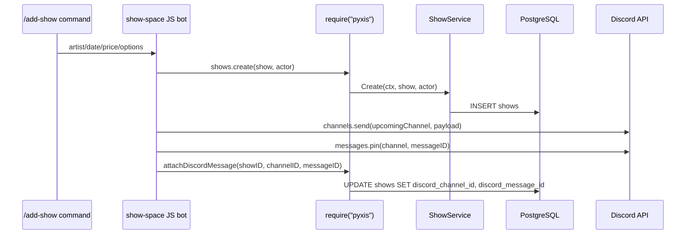

# Playbook: Adding Discord Support to Existing Go Web Applications

Adding Discord support to an existing web application is not just a matter of importing a Discord library and registering a slash command. A Discord bot is another user interface. It has a lifecycle, credentials, permissions, command schemas, response timing rules, and its own notion of state. If it writes to a different database, it becomes a second application. If it writes through the same services as the web UI, it becomes a new surface on the same system.

This note explains the second approach: embedding Discord support into an existing Go webserver so Discord commands operate on the same domain model, database, and audit trail as the web application. The concrete example is the Pyxis venue-management app in `/home/manuel/code/wesen/2026-04-23--pyxis`, where a Discord show-management bot was added by reusing the framework in `/home/manuel/code/wesen/corporate-headquarters/discord-bot` and its Goja-based JavaScript runtime.

> [!summary]
> - Treat Discord as another frontend, not as a separate backend. The bot should call the same services and persist to the same database as the web app.
> - Put the bot lifecycle near the webserver lifecycle. If `serve` starts HTTP, it can also start the bot under the same context.
> - Use a small native bridge when bot scripts need application state. In Pyxis, JavaScript calls `require("pyxis")`, and the Go module calls `ShowService`, `SettingsService`, and repositories.
> - Test in layers: compile/load the bot, connect to Discord, sync commands, then run safe interactive commands before mutating production-like data.

## Why this note exists

Pyxis already had the shape of a Discord-enabled application before the bot existed. It had users authenticated through Discord, settings fields for Discord guild and channel IDs, show-management routes, a staff action for `POST /api/app/shows/{id}/announce`, and database columns named `discord_message_id` and `discord_channel_id`. What it did not have was a running Discord gateway client or a safe bridge between Discord commands and Pyxis services.

The project therefore surfaced a reusable pattern: when an existing app already owns the domain model, the bot should not invent its own database. The first design temptation is to copy an example bot wholesale. The safer design is to copy the interaction behavior, then replace the example bot's storage layer with an adapter into the host application.

This pattern applies whenever the application has a real backend and Discord is an operations surface:

- A venue app where staff can announce, cancel, and archive shows from Discord.
- A support system where moderators can triage tickets from Discord while the web app remains the source of truth.
- A CI dashboard where slash commands query the same deployment database as the web UI.
- A knowledge system where Discord commands search or annotate records owned by the main application.

The common feature is not Discord. The common feature is **one domain model with multiple interfaces**.

## The core mental model

An embedded bot has three jobs. It must connect to Discord, translate Discord interactions into application operations, and translate application results back into Discord responses. The bot should not own the application's truth.

```mermaid
flowchart TD
    Discord[Discord slash command] --> Host[Go Discord host]
    Host --> JS[Goja JavaScript bot]
    JS --> Bridge[Native require("app") bridge]
    Bridge --> Services[Application services]
    Services --> DB[(Application database)]
    Services --> Audit[(Audit log)]
    JS --> DiscordOps[Discord outbound operations]
    DiscordOps --> DiscordAPI[Discord API]

    style Discord fill:#5865F2,color:#fff
    style DB fill:#0f766e,color:#fff
    style Audit fill:#92400e,color:#fff
    style Bridge fill:#7c3aed,color:#fff
```

There are two interfaces in this diagram that deserve attention. The first is the Discord host. It is responsible for credentials, command sync, gateway events, interaction response timing, and outbound Discord operations. In Pyxis this came from `github.com/go-go-golems/discord-bot/pkg/framework`, whose public entry point is a small `framework.New(...)` constructor.

The second is the native application bridge. The JavaScript bot runs inside Goja, not Node.js. It cannot assume `fetch`, Node's `fs`, npm packages, or a network client. Instead of making JavaScript call the web app over HTTP, Pyxis exposes a Go-native module named `pyxis`. The bot calls `pyxis.shows.listUpcoming(...)`; the native module calls the Go service layer.

That boundary is the key design choice. If the bridge is too large, JavaScript becomes a second backend. If the bridge is too small, the bot cannot express useful workflows. The right bridge exposes application verbs, not database tables.

## Architecture in the Pyxis implementation

The Pyxis implementation added four main pieces.

First, `cmd/pyxis/cmds/serve.go` grew bot startup flags. The HTTP server still starts with `pyxis serve`, but the operator can add `--discord-bot` and `--discord-sync-on-start` to start and sync the bot. Role IDs, debug mode, and the bot script path are also runtime flags.

Second, `pkg/discordbot/runner.go` wraps the reusable Discord framework. It loads credentials from environment variables such as `DISCORD_BOT_TOKEN` and `DISCORD_APPLICATION_ID`, points the framework at `bot/discord/show-space/index.js`, passes runtime config into `ctx.config`, and registers the native `pyxis` module.

Third, `pkg/discordbot/pyxis_module.go` implements the Goja bridge. It registers `require("pyxis")` and exposes show and settings functions. The JavaScript bot sees a small object, but the Go side routes calls through `ShowService` and `SettingsService`.

Fourth, the copied bot under `bot/discord/show-space/` adapts the upstream `show-space` example. The copied bot keeps the command vocabulary—`/upcoming`, `/show`, `/add-show`, `/cancel-show`, `/archive-show`, `/archive-expired`—but replaces the upstream SQLite store with `lib/pyxis-store.js`, a facade over `require("pyxis")`.

```mermaid
flowchart LR
    subgraph PyxisProcess[Pyxis process]
        Serve[cmd/pyxis/cmds/serve.go]
        HTTP[pkg/server HTTP app]
        Runner[pkg/discordbot Runner]
        Bridge[pkg/discordbot require("pyxis")]
        Services[ShowService / SettingsService]
        DB[(PostgreSQL)]
    end

    subgraph BotScript[bot/discord/show-space]
        Index[index.js commands]
        Store[lib/pyxis-store.js]
        Render[lib/render.js]
        Perms[lib/permissions.js]
    end

    Serve --> HTTP
    Serve --> Runner
    Runner --> Index
    Index --> Store
    Store --> Bridge
    Bridge --> Services
    Services --> DB
    Index --> Render
    Index --> Perms

    style Runner fill:#1d4ed8,color:#fff
    style Bridge fill:#7c3aed,color:#fff
    style DB fill:#0f766e,color:#fff
```

The important detail is that the JavaScript bot is not trusted with persistence. It can ask for a show, create a show, attach a Discord message ID, cancel a show, or archive a show. It cannot run SQL. It cannot choose a different database. It cannot silently fork the truth.

## The lifecycle: where the bot starts

The right place to start an embedded bot is the same place the long-running webserver starts. In Pyxis, that is the `serve` command. The command already opens the database pool and constructs the HTTP server. The bot needs the same database and the same cancellation context, so `serve` is the natural owner.

The simplified lifecycle looks like this:

```go
func RunServe(ctx context.Context, settings ServeSettings) error {
    database := db.Connect(ctx, settings.DBURL)
    defer database.Close()

    srv := server.New(cfg, database)

    if !settings.DiscordBot {
        return srv.Start(ctx, settings.Bind)
    }

    botDeps := discordbot.NewDeps(database)
    bot := discordbot.NewRunner(ctx, discordbot.Config{
        ScriptPath:   settings.DiscordBotScript,
        SyncOnStart:  settings.DiscordSyncOnStart,
        AdminRoleID:  settings.DiscordAdminRoleID,
        BookerRoleID: settings.DiscordBookerRoleID,
    }, botDeps)

    g, ctx := errgroup.WithContext(ctx)
    g.Go(func() error { return srv.Start(ctx, settings.Bind) })
    g.Go(func() error { return bot.Run(ctx) })
    return g.Wait()
}
```

This pattern has a useful operational property: the HTTP server and bot are siblings, not parent and child. If one fails, the shared context can cancel the other. If the process is stopped, both shut down. This is much easier to reason about than a bot launched from a handler or a separate shell script.

There is still an architectural decision hidden here. Pyxis currently constructs a second set of services for the bot in `discordbot.NewDeps(database)`. That is acceptable for a first implementation because the services are thin and share the same database pool. In a more mature application, the dependency graph should probably be built once and shared between HTTP and bot runners. The rule is simple: duplicate constructors are tolerable; duplicate state is not.

## The bridge: exposing application verbs to JavaScript

The most important implementation file is not the copied bot. It is the native module. In Pyxis, `pkg/discordbot/pyxis_module.go` registers a module named `pyxis`. The JavaScript side uses it like this:

```javascript
const pyxis = require("pyxis")

const shows = pyxis.shows.listUpcoming({ limit: 25 })
const show = pyxis.shows.get(id)
const created = pyxis.shows.create(input, actor)
const attached = pyxis.shows.attachDiscordMessage(id, channelId, messageId)
const cancelled = pyxis.shows.cancel(id, actor)
```

The Go side registers those methods on a Goja object. The core pattern is:

```go
func (r *PyxisRegistrar) RegisterRuntimeModules(ctx *engine.RuntimeModuleContext, reg *require.Registry) error {
    reg.RegisterNativeModule("pyxis", func(vm *goja.Runtime, moduleObj *goja.Object) {
        exports := moduleObj.Get("exports").ToObject(vm)
        exports.Set("shows", r.showsObject(vm))
        exports.Set("settings", r.settingsObject(vm))
    })
    return nil
}
```

Each method does three things:

1. It coerces JavaScript values into Go values. IDs may arrive as strings, numbers, or values whose `String()` representation matters. Dates arrive as strings. Actor data may be partially present.
2. It calls the application service layer. The bridge should call `ShowService`, not SQLC directly, unless the method is explicitly repository-shaped.
3. It converts Go domain objects into small JavaScript DTOs. A Discord bot does not need every internal field; it needs the fields it can render and act on.

For example, a show DTO contains IDs, artist, date labels, times, price, status, notes, and Discord message metadata:

```go
func showDTO(show domain.Show) map[string]any {
    return map[string]any{
        "id":               show.ID,
        "artist":           show.Artist,
        "dateISO":          show.Date.Format(time.DateOnly),
        "displayDate":      show.Date.Format("Mon Jan 2, 2006"),
        "doorsTime":        show.DoorsTime,
        "ageRestriction":   show.Age,
        "price":            show.Price,
        "notes":            show.Notes,
        "status":           show.Status,
        "discordChannelId": show.DiscordChannelID,
        "discordMessageId": show.DiscordMessageID,
    }
}
```

This is a contract. Once the bot depends on `dateISO` or `discordMessageId`, changes to those names are application changes, not local refactors.

## Replacing the example bot's storage layer

The upstream `show-space` bot had a SQLite-backed store. That was useful for a standalone example, but it would be dangerous in Pyxis. If the Discord bot created a show in SQLite while the web app read PostgreSQL, the operator would see two realities. The bot might announce a show the web app cannot edit. The web app might cancel a show the bot cannot unpin.

The Pyxis copy replaces that store with `bot/discord/show-space/lib/pyxis-store.js`. This file keeps the JavaScript bot comfortable while routing all state through `require("pyxis")`.

```javascript
const pyxis = require("pyxis")

function createPyxisShowStore() {
  return {
    listUpcoming(config, limit) {
      return pyxis.shows.listUpcoming({ limit: limit || 25 })
    },
    getShow(config, id) {
      return pyxis.shows.get(id)
    },
    createShow(ctx, raw) {
      const normalized = normalizeShow(raw, { referenceDate: new Date() })
      if (!normalized.ok) return normalized
      return pyxis.shows.create(normalized.show, actorFromContext(ctx))
    },
    attachDiscordMessage(config, id, channelId, messageId) {
      return pyxis.shows.attachDiscordMessage(id, channelId, messageId)
    },
  }
}
```

This is an adapter pattern. The bot code still calls `repoListUpcoming`, `repoCreateShow`, and `repoCancelShow`. The adapter decides what those mean in the host application.

The general rule is useful outside Pyxis: **copy behavior, not storage**. It is fine to reuse rendering helpers, date parsing, command declarations, and permission helpers from an example bot. It is usually not fine to reuse the example bot's persistence layer inside an existing application.

## Persisting Discord message identity

Discord operations are not just fire-and-forget. If the bot posts and pins an announcement, later flows need to know which message to unpin, edit, or reference. That means the application database needs to store Discord identity.

Pyxis already had `discord_message_id` and `discord_channel_id` columns in the `shows` table, but they were not propagated through the domain, query, and API layers. The implementation added these fields to `domain.Show`, protobuf messages, SQLC queries, and repository mappings.

The data path is now:



This looks like bookkeeping, but it is what makes cancellation and archive commands possible. Without message identity, `/cancel-show` can change the database but cannot reliably unpin the old announcement. With message identity, the bot can find the exact channel and message to operate on.

## Permission model: roles are data, not names

Discord role names are for humans. Bots see role IDs. The Pyxis bot gates management commands with two runtime values:

- `adminRoleId`, which allows admin-only commands such as archive and unpin-old.
- `bookerRoleId`, which allows show-management commands such as add, announce, and cancel.

During live testing, `/debug-my-roles` revealed the member role IDs visible to the bot. The bot was restarted with:

```bash
--discord-admin-role-id 1496685769421488248 \
--discord-booker-role-id 1496685844948320266
```

This is the right shape for early testing. For production, role IDs should probably live in settings, a secret-backed config object, or an operator runbook. The important rule is that the permission check must compare IDs to IDs. A role name that looks right in Discord is not evidence that the bot sees the expected role ID.

The permission failure message should be diagnostic. It should say what the bot saw, what it expected, and what matched. This is not just user friendliness; it is operational debugging.

## Response timing and the UI DSL lesson

Discord interactions have a short acknowledgement window. If the bot takes too long to reply, or if a framework path acknowledges the interaction twice, Discord returns errors such as `Unknown interaction` or `Interaction has already been acknowledged`.

Pyxis hit this while testing debug commands. Plain JavaScript response objects worked:

```javascript
return {
  content: upcomingShowsText(shows),
  ephemeral: true,
}
```

But debug commands originally returned a Go-backed UI DSL response with embeds and buttons:

```javascript
return ui.message()
  .ephemeral()
  .content(content)
  .embed(embed)
  .row(...debugButtons(activeView))
  .build()
```

The framework logs showed the command was dispatched, the role lookup ran, and the response was sent through the `*normalizedResponse` path. Discord then rejected the response. The immediate Pyxis fix was to return plain response objects for debug commands and defer detail buttons until the DSL/component path is better isolated.

The broader rule is: start with boring response shapes. Once plain content and embeds are reliable, add components. When a command performs additional Discord API calls before replying, consider deferring first:

```javascript
command("debug", async (ctx) => {
  await ctx.defer({ ephemeral: true })
  const payload = await buildDebugPayload(ctx)
  await ctx.edit(payload)
  return null
})
```

This is a general Discord bot lesson. A webserver can take a second to render a page. A Discord interaction cannot wait indefinitely for the bot to decide whether it wants to answer.

## Testing sequence

A Discord integration should be tested in layers. Each layer answers a different question.

| Layer | Question | Pyxis example |
| --- | --- | --- |
| Compile/load test | Can the Go process load the JavaScript bot and native module? | `TestNewRunnerLoadsPyxisShowSpaceBot` constructs `NewRunner` with fake credentials. |
| Local server test | Can `pyxis serve --discord-bot` start HTTP and bot code together? | Run on a spare port with credentials sourced from `.envrc`. |
| Gateway test | Can the bot connect to Discord? | Logs show `discord bot connected ... user=llm-bot`. |
| Command sync test | Does Discord accept the slash command definitions? | `--discord-sync-on-start` logs synced commands for the dev guild. |
| Read-only command test | Can safe commands query application state? | `/upcoming` returned five upcoming shows from PostgreSQL. |
| Permission test | Does the bot see the user's actual roles? | `/debug-my-roles` reports member role IDs. |
| Mutating command test | Can commands change state and record Discord IDs? | `/add-show` or `/announce`, preferably in a safe dev channel. |

The order matters. Do not start with `/add-show`. Start with loading. Then connect. Then sync. Then read. Then permissions. Only then mutate.

The Pyxis runtime command used during testing was:

```bash
set -a
source ../2026-04-20--js-discord-bot/.envrc
set +a

go run ./cmd/pyxis serve \
  --bind :18082 \
  --discord-bot \
  --discord-debug \
  --discord-sync-on-start \
  --discord-admin-role-id 1496685769421488248 \
  --discord-booker-role-id 1496685844948320266 \
  --log-level debug
```

For long-running interactive testing, it was placed in tmux:

```bash
tmux new-session -d -s pyxis-discord-bot -c /home/manuel/code/wesen/2026-04-23--pyxis \
  "bash -lc 'set -a; source ../2026-04-20--js-discord-bot/.envrc; set +a; go run ./cmd/pyxis serve --bind :18082 --discord-bot --discord-debug --discord-sync-on-start --discord-admin-role-id 1496685769421488248 --discord-booker-role-id 1496685844948320266 --log-level debug 2>&1 | tee /tmp/pyxis-discord-bot-tmux.log'"
```

The useful logs are not just “it started.” They show the sequence:

```text
loaded javascript bot implementation bot=pyxis-show-space commands=[...]
synced discord application commands ... scope=guild:586274407350272042
discord bot connected ... user=llm-bot
pyxis-show-space bot ready ... shows=7
```

Those four lines prove different things: script load, command registration, gateway connection, and native module/database access.

## Recommended implementation sequence

The safe sequence for adding Discord support to an existing Go application is:

1. **Map the existing application seams.** Find the command entry point, service layer, repository layer, settings model, and any existing no-op integration interfaces.
2. **Choose whether the bot is embedded or separate.** Embedded is simpler when the bot should share services and a database. Separate is better when the bot is independently deployed and talks through a stable public API.
3. **Start with a built-in bot path.** Make one explicit bot work before adding repository scanning, plugin loading, or multiple bot support.
4. **Copy behavior into the app repository.** Keep rendering and command logic if useful. Replace storage and host-specific assumptions.
5. **Expose a native bridge with application verbs.** Prefer `shows.create`, `shows.cancel`, and `settings.get` over raw SQL or generic HTTP from JavaScript.
6. **Propagate external identity through the domain model.** Store Discord message/channel IDs wherever future workflows need to refer to posted messages.
7. **Wire lifecycle into the server command.** Add explicit enable flags. Do not start the bot by accident in every dev server.
8. **Test in layers.** Compile/load, connect, sync, read, permissions, mutate.
9. **Keep operational knobs visible.** Role IDs, channel IDs, sync-on-start, debug mode, and credentials should have obvious ownership.
10. **Write down the failure modes.** Discord response timing, role ID mismatch, wrong guild sync, and duplicate databases are the common traps.

This is deliberately incremental. The goal is to get a read-only command working first. A bot that can answer `/upcoming` from the real database has already proven the hard architectural path. Posting and pinning are then extensions of a known-good bridge.

## Common failure modes

### The bot writes to the wrong database

This happens when a copied example bot keeps its own SQLite store. It will seem to work because commands return success, but the web app will not see the changes. The fix is to delete or isolate the example store and force bot state through the host application's services.

### Slash commands do not appear

Discord slash commands must be synced. In development, `--discord-sync-on-start` is useful because it registers the command definitions at startup. In production, sync-on-start may be too blunt; operators may prefer an explicit sync step.

### Role checks fail even though names look correct

The bot sees role IDs, not role names. Add debug commands that print member role IDs and configured role IDs. Compare exact strings.

### Interaction responses fail only for rich UI

Plain object responses and framework DSL responses may take different paths. If simple responses work but embeds/buttons fail, isolate with smoke commands. If slow commands fail, defer first and edit later.

### The web app and bot diverge

If `/api/app/shows/{id}/announce` and `/announce` use different renderers, different persistence, or different audit behavior, they will drift. A mature implementation should extract shared announcement logic so the web and bot surfaces behave the same way.

## Working rules

- A Discord bot attached to an existing application is a frontend, not a second backend.
- The bot should call application services, not own application storage.
- Runtime config is useful for secrets and early role/channel wiring; durable app settings should eventually live in the application's settings model.
- Store external object IDs when later workflows need to edit, unpin, delete, or correlate external messages.
- Start with plain responses and read-only commands. Add rich components and mutating commands after the response path and permission path are proven.
- Treat command sync as a deployment operation. Know which guild or global scope you are syncing to.
- Keep a detailed diary while integrating. Discord failures often appear as user-facing messages that hide the real server-side cause.

## Open questions from the Pyxis implementation

The Pyxis foundation is working: the bot loads, syncs commands, connects to Discord, reads shows from PostgreSQL, and responds to `/upcoming`. The remaining questions are the ones that turn an integration into a production feature.

- Should Discord admin/booker role IDs live in Pyxis settings, environment variables, or a secret-backed configuration object?
- Should the web app's “Announce” button call the same announcement service as the Discord bot, or should one surface own posting and the other delegate?
- Should `ctx.discord.channels.send` return the created message snapshot so the bot does not need to list recent messages to find the post it just sent?
- Should `/show` get autocomplete or buttons from `/upcoming` once the component response path is stabilized?
- Should the bot support editing existing announcements when show details change?

These are not blockers for the architectural pattern. They are the next layer of product and operations design.

## Related code and documents

- Pyxis repository: `/home/manuel/code/wesen/2026-04-23--pyxis`
- Discord bot framework: `/home/manuel/code/wesen/corporate-headquarters/discord-bot`
- Goja framework: `/home/manuel/code/wesen/corporate-headquarters/go-go-goja`
- Pyxis serve integration: `cmd/pyxis/cmds/serve.go`
- Pyxis bot runner: `pkg/discordbot/runner.go`
- Pyxis native Goja module: `pkg/discordbot/pyxis_module.go`
- Copied bot script: `bot/discord/show-space/index.js`
- Pyxis bot store facade: `bot/discord/show-space/lib/pyxis-store.js`
- Discord rendering helpers: `bot/discord/show-space/lib/render.js`
- Ticket design guide: `ttmp/2026/04/26/PYXIS-DISCORD-SHOW-MGMT--add-discord-bot-show-management-to-pyxis/design-doc/01-discord-bot-show-management-design-and-implementation-guide.md`
- Investigation diary: `ttmp/2026/04/26/PYXIS-DISCORD-SHOW-MGMT--add-discord-bot-show-management-to-pyxis/reference/01-investigation-diary.md`

## Closing

The most useful way to think about Discord support is not “add a bot.” It is “add another interface to the application.” Once that sentence is clear, many implementation choices become easier. The bot belongs in the server lifecycle. It should use the same services. It should store Discord message IDs in the main database. It should test read-only behavior before mutating state. It should make role IDs visible when permissions fail.

A bot built this way is not a sidecar script that happens to know about the app. It is a first-class operations surface for the same system.
