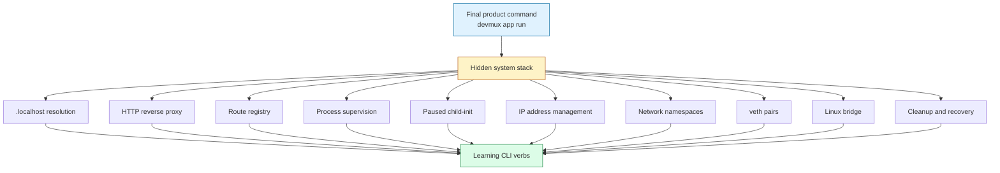
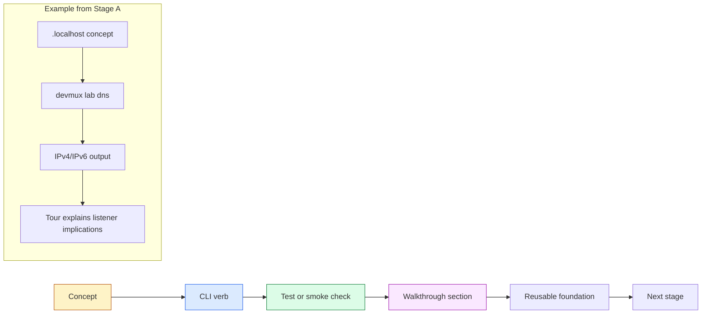
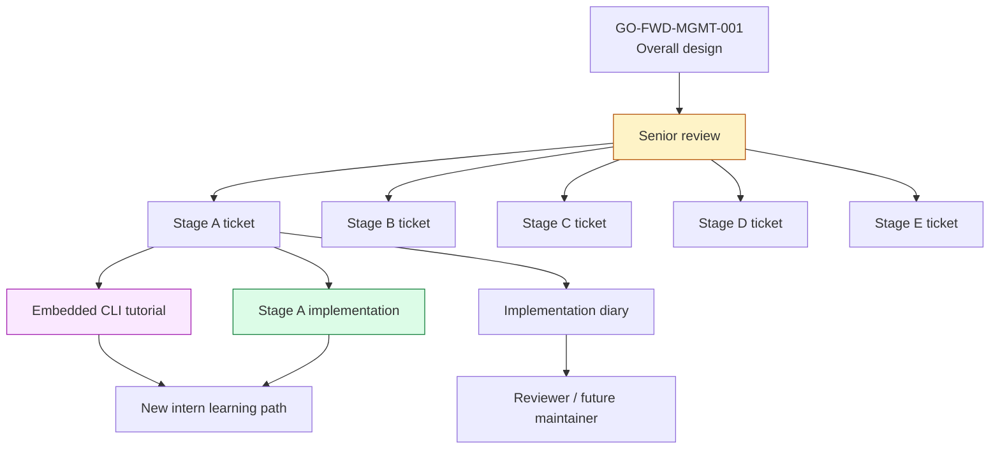

# Playbook: Phased Scaffolding for Complex Systems

This note captures a reusable engineering pattern that emerged while designing and beginning to implement `devmux`, a Go-based local development multiplexer. The project itself is technically complex — it eventually needs Linux network namespaces, veth pairs, bridges, process supervision, reverse proxying, IP address management, a daemon, a Unix socket API, cleanup, and security boundaries — but the most important lesson was not any single Linux primitive. The important lesson was how to make such a system buildable and teachable.

The pattern is: **split complex implementation work into learning-oriented phases, where each phase exposes small CLI verbs that let a developer exercise one layer of the system directly before the layers are tied together.** Then write a walkthrough for each phase so a new intern can learn the technology by running the same commands the implementation uses.

> [!summary]
> - Complex infrastructure should be decomposed into independently runnable learning layers, not implemented as one opaque daemon from the start.
> - Each layer should have CLI verbs that expose the underlying concept directly: diagnose, resolve, proxy, register, supervise, allocate, inspect, clean up.
> - Documentation should not only describe the final architecture; it should teach the foundations through interactive exercises that produce concrete output.
> - The `devmux` Stage A work is a concrete example: before touching rootful networking, it built the no-root Glazed CLI, DNS lab, registry, proxy, process supervisor, child-init experiment, IPAM, tests, and embedded tutorial help.

## Why this note exists

The `devmux` project started as an ambitious design: one Go binary would supervise applications, place them into separate Linux network namespaces, connect those namespaces with veth pairs and a bridge, and route HTTP traffic by hostname through a reverse proxy. That is a lot of machinery. If implemented directly as `devmux daemon` first, every bug would be ambiguous. A failed request could be DNS, listener binding, registry lookup, reverse proxy behavior, process startup, namespace creation, veth movement, IP assignment, routing, readiness, permissions, or cleanup.

The safer approach was to stop treating the final daemon as the first deliverable. We split the system into staged tickets:

- `GO-FWD-STAGE-A-001` — pure Go / no-root CLI foundation.
- `GO-FWD-STAGE-B-001` — Linux network primitive labs.
- `GO-FWD-STAGE-C-001` — manual sandbox composition and proxy routing.
- `GO-FWD-STAGE-D-001` — app lifecycle, daemon, and Unix socket API.
- `GO-FWD-STAGE-E-001` — hardening, cleanup, low ports, NAT, persistence, and security.

The work then became much easier to reason about. Stage A could be implemented, tested, documented, and taught without ever creating a network namespace. Stage B could later focus on Linux networking without also debugging the proxy. Stage C could compose known-good primitives. Stage D could productize the composition. Stage E could harden the result.

This note generalizes that pattern for future projects.

## When to use this pattern

Use phased scaffolding when a project combines several technologies whose failure modes overlap. Good candidates include:

- local development platforms;
- CLI tools that orchestrate processes, network state, files, and daemons;
- systems involving privilege boundaries or kernel resources;
- multi-layer tools where the final UX is simple but the underlying stack is deep;
- developer tools that must be maintained by people who did not write the first version;
- projects where onboarding is as important as implementation.

Do not overuse this pattern for small CRUD services or single-purpose libraries. The overhead of separate stages, docs, and lab commands is only justified when the system has enough conceptual weight that debugging the whole thing at once would be expensive.

## The core mental model

The core rule is:

> Build the ladder before asking someone to climb the wall.

A complex system is a wall. It has many layers stacked together, and the final user-facing command often hides all of them. That hiding is good for users but bad for builders. A new developer needs a ladder: small commands that expose one layer at a time.

For `devmux`, the final goal might look like this:

```bash
devmux app run --name api --host api.localhost --port 3000 -- ./api-server
```

But that single command implies many hidden questions:

- Does `api.localhost` resolve locally?
- Can the proxy dispatch by `Host` header?
- Where is the route table stored?
- Can a process be launched and stopped reliably?
- Can two apps both bind the same internal port?
- Can the parent pause a child while it prepares networking?
- Can the tool allocate safe IP addresses?
- Can a veth be moved into a namespace?
- Can cleanup recover after a crash?

Each question deserves a command or experiment before it becomes a hidden implementation detail.



The learning CLI verbs are not throwaway. They become diagnostics, smoke tests, and documentation anchors. The same command that teaches an intern what DNS resolution looks like can later help debug a user report that `foo.localhost` is not reaching the proxy.

## The devmux stage breakdown

### Stage A: pure Go foundation

Stage A deliberately avoids root and Linux network mutation. It proves the no-root control plane:

```text
devmux doctor
devmux lab dns
devmux lab child-init
devmux registry add/get/list/remove
devmux proxy add/list/remove/serve
devmux proc run/list/stop/wait
devmux ipam init/alloc/list/release
```

The implementation lives under:

```text
/home/manuel/code/wesen/2026-04-23--go-port-dev/cmd/devmux
/home/manuel/code/wesen/2026-04-23--go-port-dev/internal
/home/manuel/code/wesen/2026-04-23--go-port-dev/pkg/doc
```

The most useful Stage A artifact is not just the code. It is the embedded Glazed tutorial:

```text
pkg/doc/tutorials/stage-a-interactive-tour.md
```

It is visible through:

```bash
go run ./cmd/devmux help stage-a-interactive-tour
```

This matters because the CLI now teaches itself. A new intern can run the commands in order and see the system emerge.

### Stage B: Linux network primitives

Stage B will introduce rootful labs but still avoid the final daemon. It should expose commands such as:

```text
devmux lab netns-run
devmux lab netns-exec
devmux net bridge create/show/delete
devmux net veth create/attach-bridge/move-peer/delete
devmux net addr add/show
devmux net route default/show
```

The point is not to hide `ip` and `nsenter` immediately. The point is to make them legible. The CLI should show what it is doing and support dry-run modes. If an intern can create a bridge and move a veth by hand through `devmux net ...` verbs, they will understand what `devmux app run` later automates.

### Stage C: manual sandbox composition

Stage C ties known-good pieces together but still keeps the work lab-shaped:

```bash
sudo devmux lab sandbox create \
  --name foo \
  --host foo.localhost \
  --ip 10.200.0.10 \
  --port 3000 \
  -- python3 -m http.server 3000
```

This proves the final data path without committing to the full app lifecycle daemon:

```text
curl Host: foo.localhost
  -> proxy
  -> registry route
  -> namespace IP
  -> veth
  -> app process
```

Stage C is the integration rehearsal.

### Stage D: product lifecycle

Stage D introduces the product language:

```text
devmux daemon
devmux app run
devmux app list
devmux app status
devmux app stop
devmux app logs
```

This is where state machines, Unix sockets, readiness checks, logs, process groups, cleanup, and privilege dropping become first-class product features.

### Stage E: hardening

Stage E is for everything that makes the tool safe to use repeatedly:

```text
devmux doctor
devmux gc
devmux state show/export/import/repair
devmux security audit
devmux net nat enable/status/disable
```

The main rule is: if a tool creates kernel resources, it must be excellent at explaining and removing them.

## The pattern shape

A staged implementation plan has three parallel tracks:

1. **Implementation track** — code that exposes the layer.
2. **Validation track** — tests and commands that prove the layer works.
3. **Teaching track** — docs that let a new person reproduce the proof.



This pattern changes the definition of done. A feature is not complete when the code exists. It is complete when:

- a developer can run it directly;
- it emits inspectable output;
- it has at least one validation path;
- the tutorial explains what the output means;
- the next stage can reuse it without guessing.

## What we actually built in Stage A

Stage A produced a working Glazed CLI foundation with command groups that mirror the on-disk layout:

```text
cmd/devmux/cmds/
  doctor.go
  lab/
  proxy/
  registry/
  proc/
  ipam/
```

The important implementation commits were:

```text
7e1b513 Implement Stage A devmux CLI foundation
0b56a5a Add Stage A process supervisor tests
2671356 Add Stage A interactive help tutorial
210627e Enable devmux env-backed command settings
6d491db Tighten Stage A proc command validation
b9ede48 Fix proc-file env parsing validation
```

The code now supports:

- Glazed structured output via `--output`.
- `--print-parsed-fields` diagnostics.
- Environment-backed settings such as `DEVMUX_REGISTRY_FILE` and `DEVMUX_PROC_FILE`.
- A route registry stored as JSON.
- A reverse proxy that dispatches by `Host` header.
- Plain process supervision with process groups.
- A paused child-init experiment.
- IPAM using `net/netip` and an explicit safe pool range.
- Embedded Glazed help documentation through `pkg/doc`.

The interesting bug was not in devmux itself but in our understanding of Glazed's required field validation. `WithRequired(true)` fired too early for an env-backed field, so we reported it upstream as:

```text
https://github.com/go-go-golems/glazed/issues/556
```

That became another lesson: building in small stages surfaces framework behavior early, while the cost of changing direction is still low.

## Interactive documentation as a design tool

The Stage A guide is not a README pasted into the repository. It is an embedded help entry, visible from the CLI:

```bash
devmux help stage-a-interactive-tour
```

That is important for two reasons.

First, it makes documentation part of the product interface. A developer does not have to know where the ticket docs live. They can ask the tool what to do next.

Second, it forces the documentation to stay close to executable commands. A tutorial that says “run `devmux proc list`” will immediately reveal if `proc-file` semantics are wrong. In this project, the tutorial helped us notice that aliases like `DEVMUX_ROUTES` and `DEVMUX_PROCS` were less helpful than using the actual Glazed-derived names `DEVMUX_REGISTRY_FILE` and `DEVMUX_PROC_FILE`.

Good walkthrough documentation has this rhythm:

1. Explain the concept in prose.
2. Run one command.
3. Show the expected shape of the output.
4. Explain why the output matters.
5. Connect the observation to the next layer.

For example, a weak DNS section would say:

```text
Run devmux lab dns to resolve a name.
```

A strong DNS section says:

```text
Run devmux lab dns foo.localhost. If the first row is ::1, your proxy must either listen on IPv6 or your browser may fail before falling back to IPv4. This is why Stage A defaults to thinking about dual-stack listeners.
```

The second version teaches the failure mode, not just the command.

## Working rules for phased scaffolding

### Rule 1: The first phase should avoid privileged operations

When possible, start with pure logic and user-space protocols. In devmux, Stage A avoided root, namespaces, veths, and bridges. That let us debug Glazed command parsing, JSON state, reverse proxy behavior, process groups, and IPAM without kernel side effects.

### Rule 2: Every hidden layer in the final product should have a visible lab verb

If the final product hides DNS, create `lab dns`. If it hides process launch, create `proc run`. If it hides namespace inspection, create `lab netns-inspect`. These lab verbs are a long-term asset because they become diagnostics.

### Rule 3: Validation should be executable, not rhetorical

A stage guide should contain commands that prove the stage works. “The proxy routes by Host header” is less useful than:

```bash
curl -H 'Host: foo.localhost' http://127.0.0.1:39280/
```

with expected output:

```text
foo-ok
```

### Rule 4: Tutorials should use real names, not fake convenience aliases

If the real env var is `DEVMUX_REGISTRY_FILE`, use that in the tutorial. Avoid aliases such as `DEVMUX_ROUTES` unless the alias itself is part of the tool. A tutorial should teach the real interface.

### Rule 5: Do not hide failure modes from learners

A good tutorial includes troubleshooting. In Stage A, the tutorial discusses:

- unknown host errors;
- connection refused;
- address already in use;
- flags accidentally passed after `--`;
- env variables being overridden by explicit flags;
- IPv6 `.localhost` resolution.

These are not distractions. They are the real ways the tool will fail.

## Common failure modes in phased projects

### Building the final daemon first

This compresses all unknowns into one failure surface. If `curl foo.localhost` fails, nobody knows which layer is wrong. Build the layers first.

### Writing docs only after implementation

If documentation is postponed, it becomes a summary of what happened rather than a teaching artifact. Write the walkthrough while the implementation is still small enough to explain.

### Treating lab commands as throwaway

Lab commands are often the best diagnostics. Keep them. A future `devmux app run` failure may be debugged by falling back to `devmux lab dns`, `devmux proxy list`, `devmux net veth show`, or `devmux lab netns-exec`.

### Using friendly tutorial aliases that differ from the real API

Aliases make a tutorial look shorter but make the actual system harder to learn. Use the real variable names and flag names.

### Marking framework-level required fields too early

The Glazed issue around `WithRequired(true)` and env-backed values is a concrete example. Required validation should happen after all value sources are merged. Until the framework supports that semantics, do post-parse validation in the command.

- [x] ## Recommended implementation sequence template

For a future complex project, use this template:

```text
Stage 0: design and senior review
  - map layers
  - identify dangerous assumptions
  - write tickets for each stage

Stage A: pure user-space foundation
  - CLI skeleton
  - diagnostics
  - state model
  - simple protocol layer
  - tests and tutorial

Stage B: primitive labs
  - expose low-level technology directly
  - dry-run support
  - inspect commands
  - smoke tests

Stage C: manual composition
  - one command assembles the primitives
  - still lab-shaped
  - strong cleanup commands

Stage D: product language
  - daemon/API if needed
  - user-facing nouns
  - lifecycle state machine
  - logs and readiness

Stage E: hardening
  - cleanup and garbage collection
  - crash recovery
  - security audit
  - persistence
  - operator runbook
```

Each stage should produce:

- a docmgr ticket;
- a design or implementation guide;
- concrete tasks;
- validation commands;
- an implementation diary;
- a CLI help entry when the feature is user/developer-facing.

## Relationship to docmgr and reMarkable

The devmux work used docmgr tickets as stage containers. This was useful because each stage got its own scope, task list, design doc, and validation status. The guides were also uploaded to reMarkable, which made them easier to read away from the code.

The relationship between durable docs is:



This is a useful pattern by itself. A ticket guides the implementer. A CLI help entry guides the user/developer. A diary guides the reviewer and future maintainer. They overlap, but they do not replace one another.

## Related files and artifacts

Source repo:

```text
/home/manuel/code/wesen/2026-04-23--go-port-dev
```

Important implementation files:

```text
cmd/devmux/main.go
cmd/devmux/cmds/root.go
cmd/devmux/cmds/doctor.go
cmd/devmux/cmds/proxy/
cmd/devmux/cmds/registry/
cmd/devmux/cmds/proc/
cmd/devmux/cmds/ipam/
cmd/devmux/cmds/lab/
internal/proxy/
internal/registry/
internal/proc/
internal/ipam/
pkg/doc/tutorials/stage-a-interactive-tour.md
```

Important docs:

```text
ttmp/2026/04/23/GO-FWD-MGMT-001--implement-go-forward-management-server-devmux/design-doc/01-go-forward-management-server-complete-design-and-implementation-guide.md
ttmp/2026/04/23/GO-FWD-MGMT-001--implement-go-forward-management-server-devmux/design-doc/02-senior-engineering-review-of-devmux-design.md
ttmp/2026/04/26/GO-FWD-STAGE-A-001--stage-a-pure-go-cli-foundation-for-devmux/design-doc/01-stage-a-implementation-guide-pure-go-cli-foundation.md
ttmp/2026/04/26/GO-FWD-STAGE-A-001--stage-a-pure-go-cli-foundation-for-devmux/reference/01-stage-a-implementation-diary.md
```

Upstream Glazed issue:

```text
https://github.com/go-go-golems/glazed/issues/556
```

## Near-term next steps

- Continue with Stage B, keeping the same rule: expose each Linux networking primitive as its own lab verb before composing them.
- Add Stage B tutorial help once the commands exist.
- Keep the Stage A tutorial up to date as command semantics change.
- Consider creating a generic “phased scaffolding checklist” template for future docmgr tickets.
- If the Glazed required-field issue is fixed upstream, revisit devmux's post-parse validation workaround.

## Working rule

When a project feels too complex to implement safely, do not simplify by hiding layers. Simplify by **making each layer runnable, observable, and teachable**.

The final product can be elegant and compact. The path to it should be explicit.
