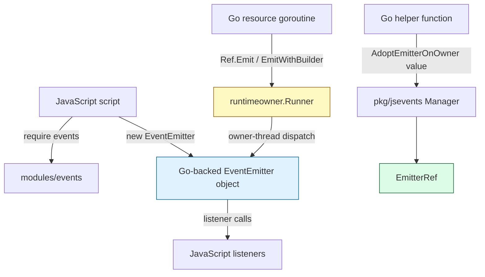
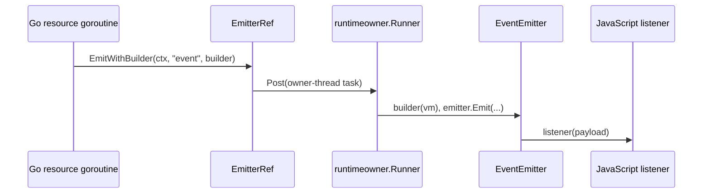

# Report: Go-Go-Goja EventEmitter Implementation

This is the event-delivery implementation branch of the [[go-go-goja]] project map.

This report explains the implementation of the Go-native `EventEmitter` module in `go-go-goja`, and the connected-emitter infrastructure that grew out of it. The code lives in `/home/manuel/workspaces/2026-04-26/add-event-emitter-module/go-go-goja`, with the central implementation in `modules/events/events.go` and the connected resource bridge in `pkg/jsevents/manager.go`.

The most important design decision is that EventEmitter behavior lives in Go, not in an embedded JavaScript shim. JavaScript sees a familiar Node-style API through `require("events")`, but the listener table, once-listener removal, unhandled error behavior, and Go adoption hooks are implemented as native Go data structures. That makes the emitter inspectable and adoptable from Go, which is what later enables helpers such as Watermill and fswatch.

> [!summary]
> - `require("events")` and `require("node:events")` now provide a Go-native subset of Node's EventEmitter API.
> - JavaScript can create an emitter, pass it into Go, and Go can safely adopt it through `events.FromValue(...)` and `jsevents.Manager`.
> - Background goroutines never call JavaScript directly; connected helpers emit through `EmitterRef`, which schedules delivery onto the runtime owner thread.
> - The implementation turns EventEmitter from a JavaScript convenience API into a reusable boundary object for Go-owned resources.

## Why this feature exists

A goja runtime is a single-threaded JavaScript world embedded inside a Go program. That combination is powerful, but it creates a recurring problem: Go has goroutines and channels, while JavaScript has callbacks and event emitters. If a background goroutine receives a filesystem event or a message-bus event, it cannot safely call a JavaScript callback directly. The callback belongs to the goja runtime, and the runtime has a single owner thread.

The EventEmitter feature solves the JavaScript-facing part of that problem. JavaScript authors get a familiar object:

```javascript
const EventEmitter = require("events");
const emitter = new EventEmitter();

emitter.on("ready", (name) => console.log("ready", name));
emitter.emit("ready", "goja");
```

The connected-emitter manager solves the Go-facing part. Go can adopt the same emitter, keep a stable `EmitterRef`, and emit later from a goroutine without touching JavaScript values directly. The distinction is subtle but central: the emitter is JavaScript-owned, but the safe handle is Go-owned.

## The implementation at a glance

The implementation has three layers. Each layer exists because the layer below it is not enough on its own.



| Layer | Main file | Responsibility |
|---|---|---|
| EventEmitter module | `modules/events/events.go` | Expose `require("events")`, construct native emitters, manage listeners, implement `emit`. |
| Runtime registration | `engine/module_specs.go`, `engine/runtime.go` | Install `events` and `node:events` as data-only default modules. |
| Connected manager | `pkg/jsevents/manager.go` | Adopt JavaScript-created emitters and schedule Go-originated events onto the runtime owner thread. |

The result is deliberately split. `modules/events` remains a pure EventEmitter primitive. It does not know about Watermill, fsnotify, runtime initializers, or host resources. `pkg/jsevents` is where connected resource helpers live.

## The native EventEmitter object

The core type is `EventEmitter`:

```go
type EventEmitter struct {
    vm        *goja.Runtime
    object    *goja.Object
    listeners map[string][]listenerEntry
}

type listenerEntry struct {
    value    goja.Value
    callable goja.Callable
    once     bool
    original goja.Value
}
```

This is the first place the implementation departs from a pure JavaScript polyfill. The listener table is Go data. Each listener entry stores both the original JavaScript value and the callable form returned by `goja.AssertFunction`. The `once` flag lets the emitter remove one-shot listeners before invoking them.

The constructor is exported as the module value itself:

```javascript
const EventEmitter = require("events");
const emitter = new EventEmitter();
```

It also supports the common named forms:

```javascript
const events = require("events");
const emitter1 = new events();
const emitter2 = new events.EventEmitter();
const emitter3 = new events.default();
```

This shape matters because JavaScript packages vary in how they import CommonJS modules. Providing `module.exports`, `EventEmitter`, and `default` reduces friction without implementing the whole Node events module.

## Listener semantics

The listener API implements the subset that scripts need most:

```text
on / addListener
once
off / removeListener
removeAllListeners
emit
listeners
rawListeners
listenerCount
eventNames
```

The important algorithm is `emit`. It takes a copy of the listener slice before dispatching:

```go
list := append([]listenerEntry(nil), e.listeners[name]...)
```

That copy protects the iteration from listener mutations. A listener may remove itself, add another listener, or call `removeAllListeners` while the event is being dispatched. The current emit call should still have a stable view of the listeners that existed when dispatch began.

The once-listener logic is intentionally simple:

```go
for _, entry := range list {
    if entry.once {
        e.removeListenerEntry(name, entry.value)
    }
    _, err := entry.callable(e.thisObject(), args...)
    ...
}
```

A `once` listener is removed before it is invoked. That matches the usual EventEmitter intuition: even if the listener emits the same event recursively, the one-shot listener should not run twice.

## The special case of `error`

EventEmitter's `error` event is not just another event. In Node's EventEmitter model, emitting `error` without an error listener throws. The Go implementation preserves that behavior:

```go
if len(list) == 0 {
    if name == "error" {
        return false, e.unhandledError(args)
    }
    return false, nil
}
```

This rule prevents silent failures. If a connected Go resource emits an error and JavaScript did not register an `error` listener, the error becomes visible instead of disappearing into the event stream. That is especially important for host helpers, where missing error handling could otherwise hide subscription failures or filesystem watcher errors.

## Adoption: turning a JavaScript object into a Go handle

The native module gives Go a way to recognize EventEmitter objects that JavaScript created:

```go
func FromValue(value goja.Value) (*EventEmitter, *goja.Object, bool)
```

`FromValue` checks the exported Go type of the value. That means Go does not merely check whether the object has an `.emit` method. It verifies that the object is backed by the native Go `EventEmitter` type. This is the foundation for safe helper APIs.

Without this check, any JavaScript object could masquerade as an emitter:

```javascript
watermill.connect("orders", { emit() { /* arbitrary */ } });
```

That would force Go to call arbitrary JavaScript object methods later, which is exactly the pattern the implementation avoids. With adoption, Go stores a pointer to the native emitter and schedules dispatch through the runtime owner.

## The connected-emitter manager

`pkg/jsevents/manager.go` adds the resource-connection layer. It installs a per-runtime manager:

```go
jsevents.Install()
```

The manager stores adopted emitters as `EmitterRef` values:

```go
type EmitterRef struct {
    manager *Manager
    id      string
    emitter *eventsmodule.EventEmitter
    object  *goja.Object
    cancel  context.CancelFunc
    closed  atomic.Bool
}
```

An `EmitterRef` is safe to keep in Go resource code. It does not make the goja runtime goroutine-safe; instead, it provides methods that schedule work back to the runtime owner:

```go
ref.Emit(ctx, "event", payload)
ref.EmitWithBuilder(ctx, "event", func(vm *goja.Runtime) ([]goja.Value, error) {
    return []goja.Value{payload.ToValue(vm)}, nil
})
```

The distinction between `Emit` and `EmitWithBuilder` is important. `Emit` is convenient for plain Go data that `vm.ToValue` can convert. `EmitWithBuilder` is the safer and more explicit path when the payload needs JavaScript functions, lowerCamel object properties, or typed object construction on the owner thread.

## Why the manager schedules instead of calling directly

The manager uses `runtimeowner.Runner` to post work:

```go
return r.manager.owner.Post(ctx, "jsevents.emit."+r.id+"."+name, func(_ context.Context, vm *goja.Runtime) {
    args, err := builder(vm)
    if err == nil {
        _, err = r.emitter.Emit(name, args...)
    }
    if err != nil {
        r.manager.report(err)
    }
})
```

This is the line that keeps the architecture honest. The background goroutine asks for an event to be emitted, but it does not emit it itself. The owner thread builds JavaScript values and invokes listeners.



This design is slightly more verbose than calling a callback directly. The extra ceremony buys correctness. It makes the owner-thread boundary visible in code review.

## Runtime registration and default safety

The `events` and `node:events` modules are data-only defaults. They are included in the default data-only module list alongside `crypto`, `path`, `time`, and `timer`. That is a deliberate sandbox decision: a plain EventEmitter does not read files, spawn processes, expose environment variables, or connect to the network.

Connected helpers are different. Watermill and fswatch connect to host resources, so they are installed explicitly by an embedding application through runtime initializers. This split gives scripts a universal event primitive while keeping host access opt-in.

## TypeScript and documentation support

The feature also updates the declaration path. The events module implements `modules.TypeScriptDeclarer`, so the generated declaration file includes the EventEmitter surface:

```typescript
class EventEmitter {
  constructor();
  on(name: EventName, listener: Listener): this;
  once(name: EventName, listener: Listener): this;
  emit(name: EventName, ...args: any[]): boolean;
}
```

Documentation lives in several layers:

- `README.md` introduces the module and connected helper pattern.
- `pkg/doc/16-nodejs-primitives.md` documents the runtime-facing primitive.
- `pkg/doc/17-connected-eventemitters-developer-guide.md` documents helper authoring.
- The docmgr ticket `EVT-001` preserves design history, diary entries, and implementation rationale.

## The jsverbs examples

The EventEmitter examples live in:

```text
testdata/jsverbs/events.js
```

They demonstrate three small but important behaviors:

```javascript
function eventTimeline(prefix, count) {
  const emitter = new EventEmitter();
  const rows = [];

  emitter.once("tick", (index) => {
    rows.push({ kind: "once", value: `${prefix}:${index}` });
  });

  emitter.on("tick", (index) => {
    rows.push({ kind: "tick", value: `${prefix}:${index}` });
  });

  for (let i = 0; i < count; i++) {
    emitter.emit("tick", i);
  }

  return rows;
}
```

This example is a compact teaching case. The first `tick` runs both listeners. The second `tick` runs only the persistent listener. A reader can see `once` semantics without reading the Go code.

Run it with:

```bash
cd /home/manuel/workspaces/2026-04-26/add-event-emitter-module/go-go-goja
go run ./cmd/jsverbs-example --dir testdata/jsverbs events event-timeline evt --count 2
```

## Tests that define the contract

The core tests live in:

```text
modules/events/events_test.go
pkg/jsevents/manager_test.go
pkg/jsverbs/jsverbs_test.go
```

The most important behavior tests are:

| Test area | What it proves |
|---|---|
| EventEmitter runtime tests | `require("events")` works and listener methods behave as expected. |
| Go adoption test | Go can unwrap a JavaScript-created native emitter and emit to it. |
| Connected manager tests | `EmitterRef` schedules back to the owner and reports async listener errors. |
| jsverbs tests | EventEmitter examples are discoverable and executable through Glazed commands. |

The tests matter because the feature is not only an API surface. It is a concurrency boundary. A passing test suite is evidence that the boundary is used correctly in the common flows.

## Common failure modes

| Failure mode | Why it happens | Correct response |
|---|---|---|
| Calling JavaScript from a goroutine | The resource code captured a callback or `goja.Value` and invoked it directly. | Use `EmitterRef.Emit` or `EmitWithBuilder`. |
| Accepting arbitrary emitter-like objects | The helper checked for `.emit` instead of adopting a native emitter. | Use `Manager.AdoptEmitterOnOwner`. |
| Installing connected helpers without the manager | `WatermillHelper` or `FSWatchHelper` runs before `jsevents.Install()`. | Install `jsevents.Install()` first. |
| Swallowing error events | JavaScript did not register an `error` listener. | Register `emitter.on("error", ...)` for connected resources. |
| Using maps for event payloads | Payload shape drifts and lowerCamel JS fields are not reviewed as a contract. | Use typed Go payload structs and `ToValue(vm)` builders. |

## Key points

- EventEmitter is a native Go module, not an embedded JavaScript implementation. This makes the emitter adoptable by Go helpers.
- `events` is a safe default primitive; connected helpers remain opt-in because they expose host resources.
- `FromValue` and `Manager.AdoptEmitterOnOwner` are the trust boundary. They reject arbitrary objects and accept only native EventEmitter values.
- `EmitterRef` is the concurrency boundary. It can be held by background goroutines, but it schedules all listener dispatch back to the runtime owner.
- The pattern generalizes beyond fswatch and Watermill. Any Go resource that emits events over time can use the same shape.

## Related notes

- [[ARTICLE - Report - Go Go Goja fswatch Implementation]]

Related repository documentation:

```text
pkg/doc/16-nodejs-primitives.md
pkg/doc/17-connected-eventemitters-developer-guide.md
ttmp/2026/04/26/EVT-001--event-emitter-module-for-go-go-goja/design-doc/01-event-emitter-module-implementation-guide.md
ttmp/2026/04/26/EVT-001--event-emitter-module-for-go-go-goja/reference/01-diary.md
```
