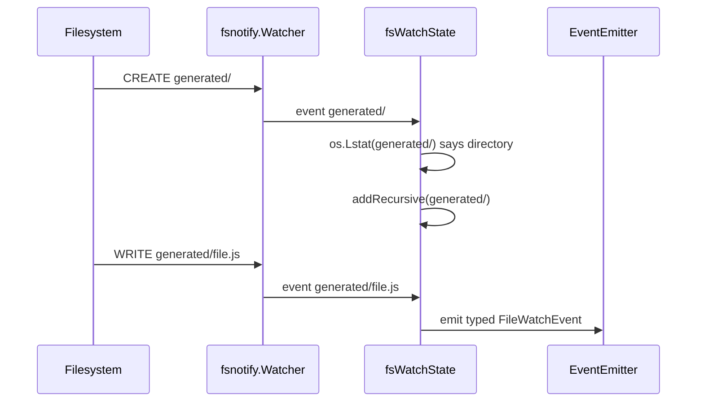

# Report: Go-Go-Goja fswatch Implementation

This report explains the implementation of the `fswatch` helper in `go-go-goja`. The helper connects `github.com/fsnotify/fsnotify` to a JavaScript-created EventEmitter, then adds recursive watching, trailing debounce, and include/exclude glob filtering. The central file is `/home/manuel/workspaces/2026-04-26/add-event-emitter-module/go-go-goja/pkg/jsevents/fswatch.go`.

The feature is best understood as an application of the connected EventEmitter pattern. JavaScript owns the listener surface. Go owns the filesystem watcher. `EmitterRef` is the bridge between them, and it schedules every event back onto the runtime owner thread.

> [!summary]
> - `fswatch.watch(path, emitter, options?)` is a custom go-go-goja helper, not a standard Node API.
> - The helper is opt-in host access and must be installed with `jsevents.Install()` plus `jsevents.FSWatchHelper(...)`.
> - Recursive watching is host-gated with `AllowRecursive` because it can allocate one OS watch per directory.
> - Event, error, and connection payloads are typed Go structs converted to lowerCamel JavaScript objects with explicit `ToValue(vm)` builders.

## Why this helper exists

The Go ecosystem already has `fsnotify`, and JavaScript developers already understand event emitters. The problem is not that either side lacks a tool. The problem is that their concurrency models do not line up. `fsnotify` emits from Go channels, often read by goroutines. JavaScript listeners live inside a single goja runtime and must be invoked only on the runtime owner thread.

`fswatch` is the bridge. It lets JavaScript say:

```javascript
const EventEmitter = require("events");
const watcher = new EventEmitter();

const conn = fswatch.watch("/tmp/project", watcher, {
  recursive: true,
  debounceMs: 100,
  include: ["**/*.js"],
  exclude: ["**/node_modules/**"]
});

watcher.on("event", (ev) => {
  console.log(ev.relativeName, ev.op);
});
```

The Go side installs the helper explicitly:

```go
factory, err := engine.NewBuilder().
    WithRuntimeInitializers(
        jsevents.Install(),
        jsevents.FSWatchHelper(jsevents.FSWatchOptions{
            Root:           "/tmp/project",
            AllowRecursive: true,
            MaxDebounce:    time.Second,
        }),
    ).
    Build()
```

This separation is the central design rule. The default runtime can have data-only primitives such as `events` and `path`, but watching a host filesystem is not data-only. It is a capability, and capabilities should be installed deliberately.

## The architecture

The runtime shape is small but precise:

```mermaid
flowchart TD
    JS[JavaScript] -->|new EventEmitter| E[Go-native EventEmitter]
    JS -->|fswatch.watch(path, emitter, options)| H[FSWatchHelper]
    H -->|normalize path + decode options| O[fsWatchCallOptions]
    H -->|adopt emitter| M[jsevents.Manager]
    M --> R[EmitterRef]
    H -->|fsnotify.NewWatcher| W[fsnotify.Watcher]
    W -->|Events / Errors channels| S[fsWatchState.run]
    S -->|typed payload ToValue on owner| R
    R -->|owner-thread emit| E
    E --> L[JavaScript listeners]

    style H fill:#e0f2fe,stroke:#0369a1
    style S fill:#dcfce7,stroke:#166534
    style R fill:#fef9c3,stroke:#a16207
```

The helper's responsibilities are divided into three phases:

| Phase | What happens | Why it matters |
|---|---|---|
| Setup on owner thread | Decode options, normalize path, adopt emitter, create watcher. | All goja values are still on the owner thread. Setup failures can throw synchronously. |
| Watch loop in goroutine | Read `watcher.Events` and `watcher.Errors`. | Filesystem notifications arrive asynchronously without blocking JavaScript. |
| Event delivery through `EmitterRef` | Build typed JS payloads on owner thread and call listeners. | The goroutine never touches JavaScript directly. |

## Host options and JavaScript options

The host configures the capability envelope with `FSWatchOptions`:

```go
type FSWatchOptions struct {
    GlobalName     string
    Root           string
    AllowPath      func(path string) bool
    AllowRecursive bool
    MaxDebounce    time.Duration
    IgnorePath     func(path string) bool
}
```

JavaScript configures one watch connection with `fsWatchCallOptions`:

```go
type fsWatchCallOptions struct {
    Recursive bool
    Debounce  time.Duration
    Include   []string
    Exclude   []string
}
```

The distinction matters. Host options are policy; script options are requests. A script can request `recursive: true`, but the host must allow it. A script can request a debounce window, but the host can cap it with `MaxDebounce`.

## Path normalization and root policy

Filesystem watching is host access, so path normalization is not a convenience detail. It is a security boundary. The helper accepts a JavaScript path value and produces a normalized host path:

1. Reject missing or empty paths.
2. If `Root` is set, resolve relative paths under that root.
3. Clean and absolutize candidate paths.
4. Reject lexical escapes such as `../outside`.
5. Apply `AllowPath` if the host provided one.

The simplified algorithm is:

```go
if Root is set:
    root = abs(clean(Root))
    if path is relative:
        candidate = join(root, path)
    else:
        candidate = clean(path)
    candidate = abs(clean(candidate))
    rel = filepath.Rel(root, candidate)
    if rel starts with "..": reject
else:
    candidate = clean(path)

if AllowPath != nil and !AllowPath(candidate): reject
```

This is lexical root protection, not full symlink resolution. Recursive traversal skips symlink directories, but a future hardening pass could add symlink target checks for hosts that need stricter containment.

## Typed payloads instead of maps

A major implementation rule was to avoid free-form `map[string]any` payloads between Go and JavaScript. The helper uses typed structs:

```go
type fsWatchEventPayload struct {
    Source       string
    WatchPath    string
    Name         string
    RelativeName string
    Op           string
    Create       bool
    Write        bool
    Remove       bool
    Rename       bool
    Chmod        bool
    Recursive    bool
    Debounced    bool
    Count        int
}
```

Then it builds the JavaScript object explicitly:

```go
func (p fsWatchEventPayload) ToValue(vm *goja.Runtime) goja.Value {
    obj := vm.NewObject()
    _ = obj.Set("source", p.Source)
    _ = obj.Set("watchPath", p.WatchPath)
    _ = obj.Set("name", p.Name)
    _ = obj.Set("relativeName", p.RelativeName)
    _ = obj.Set("op", p.Op)
    _ = obj.Set("create", p.Create)
    _ = obj.Set("write", p.Write)
    _ = obj.Set("debounced", p.Debounced)
    _ = obj.Set("count", p.Count)
    return obj
}
```

This style has two benefits. First, the Go type defines the payload contract. Second, the `ToValue` method makes lowerCamel JavaScript fields explicit. goja does not automatically use JSON tags when converting Go structs into JavaScript values, so direct `vm.ToValue(struct)` would expose Go-style field names such as `WatchPath` rather than `watchPath`.

## The watch state object

The helper uses `fsWatchState` to collect the state that belongs to one watch connection:

```go
type fsWatchState struct {
    watchPath string
    opts      fsWatchCallOptions
    matcher   fsWatchGlobMatcher
    hostOpts  FSWatchOptions
    watcher   *fsnotify.Watcher
    ref       *EmitterRef

    watchedPaths map[string]struct{}
    pending      map[string]pendingFSEvent
    timers       map[string]*time.Timer
}
```

This state object is the difference between a one-shot wrapper and a real helper. Recursive watching needs to remember which directories have been added. Debouncing needs pending events and timers. Close needs to stop timers, cancel context, close the watcher, and unregister the emitter reference.

## Recursive watching

`fsnotify` does not watch directory trees recursively. Recursive behavior is built by walking directories and adding each one to the watcher.

Initial recursive setup looks like this in concept:

```go
func (s *fsWatchState) start() error {
    info := os.Lstat(s.watchPath)
    if s.opts.Recursive && info.IsDir() {
        return s.addRecursive(s.watchPath)
    }
    return s.addWatchPath(s.watchPath)
}
```

`addRecursive` uses `filepath.WalkDir`:

```go
for each path under root:
    if entry is not a directory: continue
    if entry is a symlink directory: skip subtree
    if host IgnorePath says skip: skip subtree
    if exclude glob says skip: skip subtree
    watcher.Add(path)
```

The dynamic case is more interesting. If a new directory appears after the watcher has started, the event loop sees a create event. It checks whether the created path is a directory, and if so it adds that directory and any subdirectories beneath it.



There is one practical caveat. The first write inside a newly-created directory can race with registration of that directory. If a script creates a directory and immediately writes a file inside it, the helper may receive the directory creation event but not add the new watch before the file write occurs. The jsverbs example waits briefly in recursive mode before writing into a newly-created nested directory. A future API could add a `directory-added` or `ready` event if callers need a stronger guarantee.

## Glob filtering

The helper supports `include` and `exclude` patterns. Patterns match slash-separated paths relative to the watch root:

```javascript
fswatch.watch(root, emitter, {
  recursive: true,
  include: ["**/*.js", "**/*.ts"],
  exclude: ["**/node_modules/**", "**/.git/**"]
});
```

The matching rules are intentionally small:

- If `include` is empty, all paths are included unless excluded.
- If `include` is non-empty, an event must match at least one include pattern.
- If `exclude` matches, the event is suppressed even if it also matched include.
- `**` as a full path segment matches zero or more path segments.
- Other pattern segments use Go's `path.Match` behavior.

The implementation does not aim to be full minimatch. It implements the subset needed for project file watching without adding a dependency.

Excludes are used in two places:

| Place | Effect |
|---|---|
| Recursive traversal | Excluded directory trees are not watched. |
| Event delivery | Excluded event paths are not emitted. |

Includes are used only for event delivery. A directory may not itself match `**/*.js`, but it may contain a JavaScript file that should match later. If includes controlled traversal, recursive watching would skip too much.

## Debouncing

Filesystem notifications are noisy. A single editor save may produce `CREATE`, `WRITE`, `CHMOD`, and another `WRITE`. Sending all of those to JavaScript often forces every script to implement its own debounce logic.

The helper implements trailing debounce per path:

```javascript
fswatch.watch(root, emitter, {
  debounceMs: 100
});
```

The Go state keeps pending events:

```go
type pendingFSEvent struct {
    Event fsnotify.Event
    Count int
}
```

When a new raw event arrives for the same path, the helper merges the operation bitmask and increments the count:

```go
pending.Event.Op |= event.Op
pending.Count++
```

When the timer fires, it emits one event:

```text
relativeName: "src/app.js"
op: "CREATE|WRITE"
debounced: true
count: 3
```

On `conn.close()`, all pending timers are stopped and pending events are dropped. This matters because a timer that fires after close would try to deliver an event for a resource the script already closed.

## Event delivery

The helper emits typed payloads through `EmitterRef.EmitWithBuilder`:

```go
func (s *fsWatchState) emitEvent(ctx context.Context, event fsnotify.Event, count int, debounced bool) error {
    payload := s.eventPayload(event, count, debounced)
    return s.ref.EmitWithBuilder(ctx, "event", func(vm *goja.Runtime) ([]goja.Value, error) {
        return []goja.Value{payload.ToValue(vm)}, nil
    })
}
```

This is the line where filesystem events become JavaScript events. The payload is ordinary Go data until the owner thread calls `ToValue(vm)`. That keeps JavaScript object construction on the correct goroutine.

Errors follow the same pattern with `fsWatchErrorPayload`:

```typescript
interface FileWatchError {
  source: "fsnotify";
  path: string;
  message: string;
}
```

## The connection object

The JavaScript call returns a connection object:

```typescript
interface FSWatchConnection {
  id: string;
  path: string;
  recursive: boolean;
  debounceMs: number;
  include: string[];
  exclude: string[];
  close(): boolean;
}
```

The connection object is deliberately small. It exposes what the script needs to inspect and close the watch. It does not expose `add` or `remove` methods yet because those would require additional path-policy checks and thread-safety decisions.

## The jsverbs example

The example fixture lives in:

```text
testdata/jsverbs/fswatch.js
```

It demonstrates the JavaScript-facing API:

```javascript
async function watchAndWrite(dir, fileName, recursive, debounceMs, include, exclude) {
  const emitter = new EventEmitter();
  const events = [];
  const options = { recursive, debounceMs, include, exclude };

  emitter.on("event", (ev) => {
    events.push({
      relativeName: ev.relativeName,
      op: ev.op,
      recursive: ev.recursive,
      debounced: ev.debounced,
      count: ev.count
    });
  });

  const conn = fswatch.watch(dir, emitter, options);
  fs.writeFileSync(path.join(dir, fileName), "created by fswatch jsverb");
  ...
  conn.close();
}
```

The fixture is not runnable through the default `jsverbs-example` runtime because `fswatch` is host-specific and must be installed explicitly. The test `TestFSWatchJsverbUsesInstalledHelper` shows the correct embedding shape: build a runtime with `jsevents.Install()` and `FSWatchHelper(...)`, then call `Registry.InvokeInRuntime(...)`.

## Tests that define the behavior

The main tests live in:

```text
pkg/jsevents/fswatch_test.go
pkg/jsverbs/jsverbs_test.go
```

| Test | What it proves |
|---|---|
| `TestFSWatchHelperEmitsFileEvents` | A non-recursive watch emits a typed lowerCamel event payload. |
| `TestFSWatchHelperRecursiveWatchesExistingNestedDirectories` | Recursive setup watches directories that already exist. |
| `TestFSWatchHelperRecursiveAddsNewDirectories` | Recursive mode adds newly-created directories. |
| `TestFSWatchHelperGlobIncludeExcludeFiltersEvents` | Include and exclude globs suppress the right events. |
| `TestFSWatchHelperDebouncesEvents` | Debounce emits a stable debounced event instead of a noisy burst. |
| `TestFSWatchHelperCloseStopsPendingDebounce` | Closing a connection stops pending debounce timers. |
| `TestFSWatchJsverbUsesInstalledHelper` | The jsverbs fixture works when the embedding runtime installs fswatch. |

The tests avoid exact fsnotify event counts. Different operating systems report different raw event sequences. The contract is not "exactly two events"; the contract is that an event eventually arrives for the path, has the right typed fields, and respects the configured filters and lifecycle.

## Common failure modes

| Failure mode | Why it happens | Correct response |
|---|---|---|
| `fswatch is not defined` | The runtime did not install `FSWatchHelper`. | Add `jsevents.Install()` and `jsevents.FSWatchHelper(...)` to runtime initializers. |
| Recursive watch is rejected | `AllowRecursive` defaults to false. | Enable `AllowRecursive` for trusted/sandboxed roots. |
| Debounce is rejected | `debounceMs` is negative, non-finite, or above `MaxDebounce`. | Validate script options or raise `MaxDebounce` deliberately. |
| First write in a new directory is missed | Directory creation and file write raced with dynamic watch registration. | Wait briefly, write after registration, or add a future readiness event. |
| Excluded directory still has parent events | Parent directory metadata changes can still be observed. | Filter by `relativeName` in tests and scripts; do not assert exact raw event counts. |
| Payload fields are PascalCase | A struct was passed directly to `vm.ToValue`. | Use a typed `ToValue(vm)` builder that sets lowerCamel fields explicitly. |

## Design tradeoffs

| Decision | Benefit | Cost |
|---|---|---|
| Custom `fswatch` global instead of `fs.watch` | Avoids pretending to be Node-compatible and keeps helper opt-in. | Users must learn that `fswatch` is custom. |
| Recursive disabled by default | Protects hosts from unbounded watch allocation. | Embedders must opt in explicitly. |
| Small custom `**` glob matcher | Avoids a dependency and keeps semantics reviewable. | Does not implement full minimatch behavior. |
| Trailing debounce only | Simple and matches common save-burst cleanup needs. | No leading-edge notification yet. |
| Typed payload structs | Clear contract and safer docs/tests. | More boilerplate than `map[string]any`. |

## Key points

- `fswatch` is a connected EventEmitter helper, not a default JavaScript module and not a Node standard API.
- Host policy controls the outer boundary through `Root`, `AllowPath`, `AllowRecursive`, `MaxDebounce`, and `IgnorePath`.
- JavaScript controls the per-watch behavior through `recursive`, `debounceMs`, `include`, and `exclude`.
- Recursive watching is implemented by adding one fsnotify watch per directory and dynamically adding new directories as they appear.
- Debouncing happens in Go before event delivery, which keeps noisy filesystem bursts away from JavaScript listeners.
- Typed structs plus explicit `ToValue(vm)` builders make the Go/JavaScript boundary visible and reviewable.

## Related notes

- [[ARTICLE - Report - Go Go Goja EventEmitter Implementation]]

Related repository documentation:

```text
pkg/doc/17-connected-eventemitters-developer-guide.md
pkg/doc/16-nodejs-primitives.md
pkg/jsevents/fswatch.go
pkg/jsevents/fswatch_test.go
testdata/jsverbs/fswatch.js
ttmp/2026/04/26/EVT-001--event-emitter-module-for-go-go-goja/design-doc/02-fsnotify-connected-emitter-helper-implementation-guide.md
ttmp/2026/04/26/EVT-001--event-emitter-module-for-go-go-goja/design-doc/03-fswatch-recursion-debouncing-and-glob-filtering-guide.md
```
