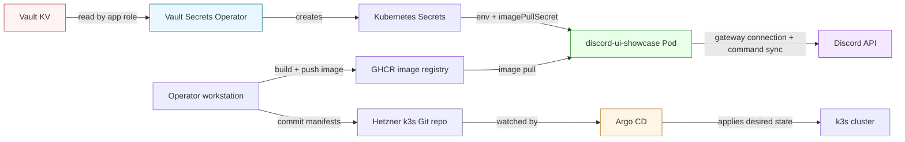
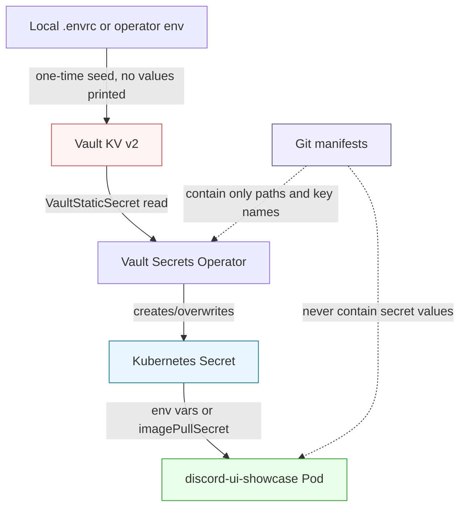

# Report: Publishing a Production Discord Bot on Argo CD, k3s, and Vault

This report explains how the Discord `ui-showcase` bot moved from a local example in the `discord-bot` repository to a live production-style workload on the Hetzner k3s cluster. The deployment uses Argo CD for reconciliation, Vault for runtime credentials, Vault Secrets Operator for Kubernetes Secret materialization, GHCR for the container image, and a small kustomize package to describe the desired Kubernetes state.

The story matters because a Discord bot is not quite like a web service. It does not need an Ingress or Service to receive HTTP traffic. It is an outbound gateway client that connects to Discord, syncs slash commands, and then waits for events. The operational shape is therefore simpler in some ways and stricter in others: one replica is safe, secrets must be handled carefully, and the most useful health signal is often the gateway log line that says the bot connected.

> [!summary]
> This report preserves four production lessons:
> 1. A Discord gateway bot should be deployed as a single-replica worker unless sharding or coordination has been explicitly designed.
> 2. Runtime credentials belong in Vault, not in `.envrc`, Kubernetes YAML, shell history, or Argo CD manifests.
> 3. Argo CD should reconcile declarative manifests from Git, while Vault Secrets Operator should turn narrowly scoped Vault reads into Kubernetes Secrets inside the application namespace.
> 4. A deployment is not complete when the pod starts; it is complete when the image pulls, Vault secrets sync, Discord commands sync, and the bot connects to the Discord gateway.

---

## Why this note exists

The immediate project was to deploy the `ui-showcase` example bot from:

```text
/home/manuel/code/wesen/2026-04-20--js-discord-bot/examples/discord-bots/ui-showcase
```

onto the Hetzner k3s cluster described by:

```text
/home/manuel/code/wesen/2026-03-27--hetzner-k3s
```

The deployment was also a useful case study. It crossed the boundary between application packaging, registry publishing, GitOps, Kubernetes workload design, Vault identity, and secret delivery. That combination is common in real production work, and it is easy to get wrong if each tool is treated as a separate magic box.

The durable lesson is the pattern: package the bot as an immutable container image; store runtime and registry credentials in Vault; grant the Kubernetes workload only the Vault read permissions it needs; let Argo CD reconcile manifests; and validate the application at the level that matters to the workload.

---

## Part 1: The system in one picture

A production deployment is easier to understand if we separate *control plane decisions* from *runtime data flow*. Git and Argo CD decide what should exist. Vault and Vault Secrets Operator decide how secrets reach the pod. Kubernetes runs the pod. Discord is the external service the pod connects to.



This diagram is the most important mental model in the report. No raw Discord token appears in Git. No registry token appears in Git. The Git repository contains references: image name, Vault path, service account name, role name, and Kubernetes object structure. Vault contains secret values. Argo CD applies manifests. Vault Secrets Operator turns Vault values into Kubernetes Secrets at runtime.

That separation is what makes the deployment safe to review. A reviewer can read every manifest and understand the system without seeing a Discord bot token or GHCR token.

---

## Part 2: The application being deployed

The application is `discord-bot`, a Go-hosted Discord bot runtime with JavaScript bot definitions. The target bot is the `ui-showcase` example. It demonstrates the framework's UI DSL: messages, forms, search flows, cards, select menus, confirmations, pagers, aliases, and stateful interaction patterns.

The live container runs the command shape:

```bash
discord-bot \
  --bot-repository /app/examples/discord-bots \
  bots ui-showcase run \
  --sync-on-start
```

The `--bot-repository` flag tells the CLI where to find bot definitions. The `bots ui-showcase run` part selects the named bot and starts it. The `--sync-on-start` flag causes the bot to register or update its Discord slash commands when it starts. In the live logs, that sync produced commands such as:

```text
demo-message
demo-form
demo-search
find
demo-review
demo-confirm
demo-pager
demo-cards
browse
demo-selects
demo-alias
demo-alias-alt
```

This is not a web application. There is no HTTP listener in the Kubernetes pod for users to reach. The pod starts, reads credentials from environment variables, connects outward to Discord, and waits for Discord gateway events.

### The first production rule: one replica

The deployment uses:

```yaml
spec:
  replicas: 1
```

That value is not an accident. Discord gateway clients are stateful participants in Discord's connection model. If two identical pods connect with the same bot token and both try to sync commands and process interactions, behavior can become surprising. Some bots solve this by implementing sharding, leader election, or a work queue. This deployment did not implement those coordination mechanisms, so one replica is the correct production default.

The rule is simple:

> Run one Discord gateway bot replica until the bot has an explicit multi-replica design.

---

## Part 3: Packaging the bot as an image

Kubernetes runs containers, not Go source trees. The first concrete deployment task was therefore to produce a container image that contains both the `discord-bot` binary and the example bot files.

The image that was built and pushed was:

```text
ghcr.io/go-go-golems/discord-bot:sha-596f442
```

with digest:

```text
sha256:e8bdebe024d4f6faad3e606f9899318693d7a7e83f0c176a1b61faa607affc08
```

The Dockerfile added to the Discord bot repository follows a deliberately small runtime shape:

1. Start from `debian:bookworm-slim`.
2. Install CA certificates so outbound TLS connections to Discord and other HTTPS endpoints work.
3. Create a non-root application user.
4. Copy a prebuilt Linux AMD64 binary into `/usr/local/bin/discord-bot`.
5. Copy `examples/discord-bots` into `/app/examples/discord-bots`.
6. Use `ENTRYPOINT ["discord-bot"]` so Kubernetes only has to provide CLI arguments.

The binary build had one important lesson. A first attempt to build with `CGO_ENABLED=0` failed because the repository's tree-sitter bindings require CGO support for this target. The working build used CGO enabled for Linux AMD64. That is the kind of packaging fact that should be remembered because it changes how future CI image publishing should be written.

### Smoke testing before deployment

Before trusting the image to k3s, the container was smoke-tested locally. The most useful smoke test was not to connect to Discord with real production credentials, but to prove that the image can find the bot definition and run the CLI path:

```bash
docker run --rm ghcr.io/go-go-golems/discord-bot:sha-596f442 \
  --bot-repository /app/examples/discord-bots \
  bots help ui-showcase \
  --output json
```

A second test used fake Discord environment variables with `ui-showcase run --sync-on-start`. It started the command path and failed as expected when Discord rejected the fake credentials. That failure was useful: it proved the command-line path and bot loading logic were correct, while keeping real secret values out of the test command.

---

## Part 4: Credential management as a pipeline

The deployment uses two kinds of credentials:

| Credential class | Purpose | Vault path | Kubernetes destination |
|---|---|---|---|
| Discord runtime credentials | Let the bot authenticate to Discord and sync commands. | `kv/apps/discord-ui-showcase/prod/runtime` | `Secret/discord-ui-showcase-runtime` |
| GHCR pull credentials | Let k3s pull the private GHCR image. | `kv/apps/discord-ui-showcase/prod/image-pull` | `Secret/discord-ui-showcase-ghcr-pull` |

The important design rule is that credentials move only through controlled secret systems:



This diagram also shows what does *not* happen. The Discord token is not committed. The GHCR token is not committed. Kubernetes Secret YAML with base64 values is not committed. The local `.envrc` is not treated as a deployment artifact; it is only an input to a one-time seed operation.

### Runtime secret contract

The runtime secret contains these keys:

```text
DISCORD_APPLICATION_ID
DISCORD_BOT_TOKEN
DISCORD_CLIENT_ID
DISCORD_CLIENT_SECRET
DISCORD_GUILD_ID
DISCORD_PUBLIC_KEY
source
```

Only two keys are strictly required for the basic bot process in this deployment: `DISCORD_BOT_TOKEN` and `DISCORD_APPLICATION_ID`. `DISCORD_GUILD_ID` is important because command sync was scoped to the guild during validation. The client/public key fields are useful for other Discord application paths and are kept with the same runtime bundle.

The Kubernetes deployment reads the secret as environment variables:

```yaml
env:
  - name: DISCORD_BOT_TOKEN
    valueFrom:
      secretKeyRef:
        name: discord-ui-showcase-runtime
        key: DISCORD_BOT_TOKEN
  - name: DISCORD_APPLICATION_ID
    valueFrom:
      secretKeyRef:
        name: discord-ui-showcase-runtime
        key: DISCORD_APPLICATION_ID
  - name: DISCORD_GUILD_ID
    valueFrom:
      secretKeyRef:
        name: discord-ui-showcase-runtime
        key: DISCORD_GUILD_ID
        optional: true
```

The optional fields are marked optional in Kubernetes because the bot can still start without some of them, depending on which feature path is used. The bot token and application ID are not optional.

### Image pull secret contract

Because the image is hosted in GHCR and may be private, the cluster also needs registry credentials. Vault stores the fields needed to render a Docker config JSON:

```text
server
username
password
auth
source
```

Vault Secrets Operator transforms those fields into a Kubernetes Secret of type `kubernetes.io/dockerconfigjson`:

```yaml
destination:
  name: discord-ui-showcase-ghcr-pull
  create: true
  overwrite: true
  type: kubernetes.io/dockerconfigjson
  transformation:
    excludes:
      - ".*"
    templates:
      .dockerconfigjson:
        text: |
          {"auths":{"{{ .Secrets.server }}":{"username":"{{ .Secrets.username }}","password":"{{ .Secrets.password }}","auth":"{{ .Secrets.auth }}"}}}
```

The `excludes` line is subtle and important. It prevents the raw Vault fields from being copied into the Kubernetes Secret alongside `.dockerconfigjson`. The resulting Secret has the shape Kubernetes expects for image pulls rather than a loose collection of registry fields.

---

## Part 5: Vault access and least privilege

The Kubernetes pod does not log into Vault with a human token. It uses Kubernetes authentication through Vault Secrets Operator. The `VaultAuth` object says: use the `discord-ui-showcase` Kubernetes service account to authenticate against the `discord-ui-showcase` Vault role.

```yaml
apiVersion: secrets.hashicorp.com/v1beta1
kind: VaultAuth
metadata:
  name: discord-ui-showcase
spec:
  vaultConnectionRef: vault
  method: kubernetes
  mount: kubernetes
  kubernetes:
    role: discord-ui-showcase
    serviceAccount: discord-ui-showcase
```

The Vault policy for this role is intentionally narrow:

```hcl
path "kv/data/apps/discord-ui-showcase/prod/*" {
  capabilities = ["read"]
}

path "kv/metadata/apps/discord-ui-showcase/prod/*" {
  capabilities = ["read", "list"]
}
```

This policy is a good example of least privilege. The application namespace can read only the production secrets for this app. It cannot write them. It cannot read other applications' secrets. It cannot manage Vault auth methods or policies. It cannot mint new privileges for itself.

The human operator path is separate. A human operator uses Vault OIDC, backed by Keycloak group membership, to seed or rotate the Vault KV entries. That OIDC path was fixed separately by ensuring the `wesen` user is in the `infra-admins` Keycloak group through Terraform. See [[ARTICLE - Report - Terraform Managed Vault Admin Access Through Keycloak OIDC]] for the identity side of the story.

---

## Part 6: The GitOps package

The k3s repository received a new application package under:

```text
/home/manuel/code/wesen/2026-03-27--hetzner-k3s/gitops/kustomize/discord-ui-showcase
```

The package contains the Kubernetes resources needed for the app:

| File | Role |
|---|---|
| `namespace.yaml` | Creates the `discord-ui-showcase` namespace. |
| `serviceaccount.yaml` | Defines the service account used by the pod and Vault Kubernetes auth. |
| `vault-connection.yaml` | Points VSO at the in-cluster Vault service. |
| `vault-auth.yaml` | Configures Kubernetes auth for this app's service account and Vault role. |
| `runtime-secret.yaml` | Materializes Discord runtime credentials from Vault KV. |
| `image-pull-secret.yaml` | Materializes the GHCR Docker config pull secret from Vault KV. |
| `deployment.yaml` | Runs the bot container as a single-replica workload. |
| `kustomization.yaml` | Lists the package resources and namespace. |

The Argo CD `Application` lives at:

```text
/home/manuel/code/wesen/2026-03-27--hetzner-k3s/gitops/applications/discord-ui-showcase.yaml
```

Its job is to tell Argo CD which Git repository path describes the desired state:

```yaml
source:
  repoURL: https://github.com/wesen/2026-03-27--hetzner-k3s.git
  targetRevision: main
  path: gitops/kustomize/discord-ui-showcase
```

This detail explains why pushing to Git matters. Applying an Argo CD `Application` object from a local checkout does not make Argo read your uncommitted files. Argo reads the configured Git repository. The manifests had to be committed and pushed before Argo could converge the application.

### Sync waves

Several manifests include Argo CD sync-wave annotations. The idea is to apply identity and secret scaffolding before the workload that consumes it:

| Wave | Resources | Why it runs first |
|---|---|---|
| `-2` | `ServiceAccount`, `VaultConnection`, `VaultAuth` | VSO needs identity before it can read Vault. |
| `-1` | `VaultStaticSecret` objects | Kubernetes Secrets should exist before the pod starts. |
| `2` | `Deployment` | The bot starts after identity and secrets are ready. |

Sync waves are not a replacement for good controllers, but they reduce avoidable startup races. If the pod starts before its image pull secret exists, image pulling can fail. If it starts before runtime secrets exist, environment variable resolution can fail. Applying the dependency objects first makes the initial deployment smoother.

---

## Part 7: The deployment sequence

The production sequence is mechanical. It is worth writing down because it prevents two common mistakes: trying to deploy before an image exists, and applying an Argo application before the Git path has been pushed.

### 1. Build and push the image

The image must contain both the binary and the bot repository directory:

```text
/usr/local/bin/discord-bot
/app/examples/discord-bots/ui-showcase
```

Conceptually, the build step is:

```bash
# Build Linux AMD64 binary with CGO enabled.
GOOS=linux GOARCH=amd64 CGO_ENABLED=1 go build -o .bin/discord-bot-linux-amd64 ./cmd/discord-bot

# Build and push image.
docker build -t ghcr.io/go-go-golems/discord-bot:sha-596f442 .
docker push ghcr.io/go-go-golems/discord-bot:sha-596f442
```

In the future, this should move into CI so the image tag is produced by the same system that tests the repository.

### 2. Seed Vault without printing values

The runtime secret seed reads local environment variables and writes them to Vault:

```bash
export VAULT_ADDR=https://vault.yolo.scapegoat.dev
vault login -method=oidc role=operators

# Source .envrc locally, then run the ticket seed script.
set -a
source ./.envrc
set +a
./ttmp/2026/04/26/DISCORD-BOT-K3S-SHOWCASE-DEPLOY--deploy-discord-ui-showcase-bot-to-k3s/scripts/01-seed-discord-ui-showcase-vault.sh
```

The safe verification command lists keys only:

```bash
vault kv get -format=json kv/apps/discord-ui-showcase/prod/runtime \
  | jq -r '.data.data | keys[]' \
  | sort
```

The principle is more important than the exact command: verification should prove that the right keys exist without revealing the values.

### 3. Add GitOps and Vault role files

The k3s repository needs three kinds of files:

1. Argo CD application file.
2. Kustomize app package.
3. Vault policy and Kubernetes auth role definitions.

The Vault bootstrap script then applies the policy/role definitions to Vault. This keeps the source of truth in Git while still configuring Vault's live auth backend.

### 4. Push before applying the Application

Because Argo CD reads GitHub, the commit must be pushed before Argo is expected to reconcile the path:

```bash
cd /home/manuel/code/wesen/2026-03-27--hetzner-k3s
git add gitops/kustomize/discord-ui-showcase gitops/applications/discord-ui-showcase.yaml vault/policies/kubernetes/discord-ui-showcase.hcl vault/roles/kubernetes/discord-ui-showcase.json
git commit -m "feat(gitops): deploy Discord UI showcase bot"
git pull --rebase origin main
git push origin main
```

Only after that does it make sense to apply:

```bash
kubectl apply -f gitops/applications/discord-ui-showcase.yaml
```

### 5. Validate at the right layers

A complete validation checks four layers:

```bash
kubectl -n argocd get application discord-ui-showcase
kubectl -n discord-ui-showcase get vaultauth,vaultstaticsecret,secret,pods -o wide
kubectl -n discord-ui-showcase rollout status deployment/discord-ui-showcase --timeout=180s
kubectl -n discord-ui-showcase logs deployment/discord-ui-showcase --tail=120
```

The live deployment reached:

```text
Argo CD: Synced Healthy
VaultAuth discord-ui-showcase: HEALTHY=True READY=True
VaultStaticSecret discord-ui-showcase-ghcr-pull: SYNCED=True HEALTHY=True READY=True
VaultStaticSecret discord-ui-showcase-runtime: SYNCED=True HEALTHY=True READY=True
Deployment rollout: successfully rolled out
Pod: 1/1 Running, 0 restarts
```

The application logs then confirmed the bot-specific success criteria:

```text
loaded javascript bot implementation bot=ui-showcase
synced discord application commands ... scope=guild:586274407350272042
discord bot connected ... user=llm-bot
ui-showcase bot ready ... meta.name=ui-showcase
```

For this kind of workload, those log lines are the equivalent of an HTTP health check plus a user-facing readiness check. They prove that the image started, secrets were usable, Discord accepted the credentials, slash commands synced, and the gateway connection is alive.

---

## Part 8: Failure modes and what they teach

Production work is often remembered best through the things that failed. Each failure in this deployment pointed at a useful boundary.

### Failure mode: Vault OIDC login has no groups claim

The original Vault credential seed was blocked by an OIDC failure:

```text
failed to fetch groups: "groups" claim not found in token
```

This was not a Discord problem. It was not a Kubernetes problem. It was an identity-chain problem: Keycloak authenticated the user, but the token did not contain the group claim Vault needed to map the user to the admin policy. The fix was to manage the `wesen` user's `infra-admins` membership declaratively through Terraform.

The lesson is that secret management depends on identity management. If the operator cannot get a valid Vault token through the normal path, every downstream deployment either stalls or tempts someone to use a root token. The right fix is to repair the normal path.

### Failure mode: static Linux build fails with CGO disabled

The first attempt to build the Linux binary with `CGO_ENABLED=0` failed because the current dependency tree includes tree-sitter bindings. The working build used `CGO_ENABLED=1`.

The lesson is that containerization does not remove build-system knowledge. If a project uses CGO dependencies, the image publication pipeline has to account for them.

### Failure mode: Argo cannot see unpushed manifests

The first k3s push was rejected because remote `main` had newer commits. Rebasing fixed the Git history. More importantly, it reinforced that Argo CD's source is the remote Git repository, not the developer's local checkout. The correct sequence is always: commit, rebase if needed, push, then ask Argo to reconcile.

### Failure mode: kubectl JSONPath is not Go templating

The validation helper originally tried to list Secret keys with a JSONPath expression using Go-template-like syntax. kubectl rejected it. The script was changed to pipe JSON into `jq`:

```bash
kubectl -n discord-ui-showcase get secret discord-ui-showcase-runtime -o json \
  | jq -r '.data | keys[] | "  - " + .'
```

The lesson is small but practical: for non-trivial JSON inspection, `jq` is clearer and less surprising than kubectl JSONPath.

---

## Part 9: Security rules that should survive this project

The deployment worked because a few security rules were followed consistently.

### Do not commit secret values

Git should contain object names, Vault paths, key names, and transformations. It should not contain Discord bot tokens, Discord client secrets, GHCR tokens, or rendered Kubernetes Secret values.

### Verify keys, not values

When checking that a Vault secret or Kubernetes Secret exists, list key names. Do not decode and print the values unless rotation or incident response explicitly requires it.

### Separate human write access from pod read access

The human operator can write secrets through Vault OIDC and the `infra-admins` group. The Kubernetes workload can only read the two app-specific Vault paths it needs. These are different identities with different permissions.

### Prefer additive identity management

The Keycloak fix used Terraform to add the required group membership without taking over the entire user object. That matters because identity systems often have multiple owners. Additive management avoids accidental removal of groups controlled elsewhere.

### Keep the application namespace narrow

The `discord-ui-showcase` namespace contains the service account, VSO objects, generated Secrets, and the Deployment. It does not need broad cluster permissions, an Ingress, or a database. Production hardening often means *not* adding infrastructure that the workload does not need.

---

## Part 10: Operational runbook

This section is the short version a future operator can follow.

### Check whether the bot is healthy

```bash
cd /home/manuel/code/wesen/2026-03-27--hetzner-k3s
export KUBECONFIG=$PWD/.cache/kubeconfig-tailnet.yaml

kubectl -n argocd get application discord-ui-showcase
kubectl -n discord-ui-showcase get vaultauth,vaultstaticsecret,secret,pods -o wide
kubectl -n discord-ui-showcase rollout status deployment/discord-ui-showcase --timeout=180s
kubectl -n discord-ui-showcase logs deployment/discord-ui-showcase --tail=120
```

Look for:

```text
Synced Healthy
VaultStaticSecret ... SYNCED=True HEALTHY=True READY=True
pod ... Running ... 0 restarts
discord bot connected
ui-showcase bot ready
```

### Rotate Discord credentials

1. Update the Discord credentials in the authoritative operator environment.
2. Log into Vault through OIDC:

```bash
export VAULT_ADDR=https://vault.yolo.scapegoat.dev
vault login -method=oidc role=operators
```

3. Rerun the safe seed script from the Discord bot repo.
4. Verify only key names.
5. Restart the deployment if the application does not automatically reload environment variables:

```bash
kubectl -n discord-ui-showcase rollout restart deployment/discord-ui-showcase
kubectl -n discord-ui-showcase rollout status deployment/discord-ui-showcase --timeout=180s
```

Environment variables are read at process start, so a restart is the conservative way to make a rotated token take effect.

### Rotate GHCR pull credentials

1. Write the new GHCR credential fields into `kv/apps/discord-ui-showcase/prod/image-pull`.
2. Wait for VSO to refresh, or force a reconcile if needed.
3. Restart or recreate pods only if image pulls are failing or a new image needs to be pulled.

### Publish a new bot image

1. Build and push a new immutable tag, preferably tied to a source commit.
2. Update `gitops/kustomize/discord-ui-showcase/deployment.yaml` in the k3s repo.
3. Commit and push.
4. Watch Argo CD sync and deployment rollout.

A future improvement is to pin by digest:

```yaml
image: ghcr.io/go-go-golems/discord-bot@sha256:<digest>
```

Digest pinning protects against tag mutation. Tag naming is still useful for humans, but digest pinning is stronger for reproducibility.

---

## Part 11: What to test in Discord

Cluster validation proves the infrastructure is healthy. A human should still test the bot from Discord because slash commands and interactive components are user-facing behavior.

Good smoke tests are:

- `/demo-message` — proves a basic slash command can execute and return a response.
- `/demo-form` — proves modal/form interactions work.
- `/demo-selects` — proves select menu components work.
- `/demo-search` or `/find` — proves a more stateful interaction path works.
- `!showcase` if message-create handlers are enabled for the target guild and bot permissions.

The important distinction is that Kubernetes readiness does not prove Discord interaction semantics. It proves the process is running. Discord command tests prove the end-user path.

---

## Part 12: The reusable pattern

This deployment can be generalized to many small bots and workers. The pattern is:

```text
1. Package the worker as a container image.
2. Push it to a registry under an immutable tag.
3. Put runtime credentials in Vault KV.
4. Put registry pull credentials in Vault KV if the image is private.
5. Add an app-specific Vault policy with read-only access to that app's paths.
6. Add an app-specific Vault Kubernetes auth role bound to one service account and namespace.
7. Add VSO objects that materialize only the needed Kubernetes Secrets.
8. Add a Deployment that consumes those Secrets.
9. Add an Argo CD Application pointing at the kustomize package.
10. Validate GitOps sync, secret sync, rollout, and application-specific liveness.
```

In pseudocode, the deployment controller story looks like this:

```text
operator commits desired state to Git
Argo notices Git changed
Argo applies namespace, service account, VaultAuth, VaultStaticSecret, Deployment
VSO authenticates to Vault as service account
Vault checks Kubernetes auth role and policy
VSO reads app-specific KV paths
VSO writes Kubernetes Secrets
kubelet pulls image using rendered imagePullSecret
kubelet starts pod with runtime secret environment variables
bot connects to Discord and syncs commands
operator validates logs and Discord behavior
```

The power of this pattern is that each component has one job. Argo CD does not know secret values. Vault does not schedule pods. Kubernetes does not know how the human operator authenticated to seed Vault. Discord does not know about GitOps. The system works because the boundaries are clean.

---

## Current status

The deployment is live and healthy as of April 26, 2026.

Concrete evidence:

```text
Argo CD application: discord-ui-showcase
Status: Synced Healthy
Namespace: discord-ui-showcase
Pod: discord-ui-showcase-57796bd8b9-pjdc4 Running, ready=true, restarts=0
Image: ghcr.io/go-go-golems/discord-bot:sha-596f442
Runtime Vault path: kv/apps/discord-ui-showcase/prod/runtime
Image pull Vault path: kv/apps/discord-ui-showcase/prod/image-pull
```

Important commits:

```text
Discord bot repo:
5051de6 docs: document k3s deployment for UI showcase bot
bfdf193 docs: record live k3s UI showcase deployment

Hetzner k3s repo:
bb060d8 feat(gitops): deploy Discord UI showcase bot

Terraform repo:
388d778 feat(keycloak): manage wesen Vault admin membership
```

---

## Open questions and future improvements

The deployment is healthy, but a few improvements would make it more production-grade.

- **Move image publication into CI.** Manual image publishing worked for the initial deployment, but CI should own repeatable image builds.
- **Pin the deployment image by digest.** The tag `sha-596f442` is meaningful, but a digest is immutable proof of the exact image content.
- **Reduce trace-level startup logs.** The bot currently logs many native module registration lines at trace level. That is useful during development but noisy for production operations.
- **Add explicit bot-level health reporting if needed.** A Discord gateway bot has no natural HTTP health endpoint. If operational needs grow, the app could expose metrics or a lightweight health server, but that should be added deliberately.
- **Document Discord-side permissions.** The cluster deployment is only half the system. The bot also depends on Discord application permissions, guild installation, intents, and command visibility.
- **Decide when sharding is needed.** One replica is correct now. If the bot becomes large or spans many guilds, sharding should be designed before increasing replicas.

---

## Working rules

The rules to carry forward are short:

1. Do not deploy a Discord bot from source; deploy an image that contains the binary and bot files.
2. Do not put runtime credentials in Kubernetes YAML; put them in Vault and render them through VSO.
3. Do not give a workload broad Vault access; bind one service account to one Vault role and one app-specific policy.
4. Do not scale a gateway bot horizontally until the bot has a sharding or coordination design.
5. Do not call a deployment complete until Argo, VSO, Kubernetes rollout, application logs, and a real Discord command path have all been checked.

These rules are not specific to `ui-showcase`. They are the reusable deployment discipline for small production bots on k3s.

---

## Related notes and source material

- [[ARTICLE - Report - Publishing Discord-Bot From Prototype to Reusable Go Package]] explains how the `discord-bot` project became a publishable Go package and binary.
- [[ARTICLE - Report - Terraform Managed Vault Admin Access Through Keycloak OIDC]] explains the Keycloak/Vault OIDC fix that made normal operator secret seeding possible.
- Source bot repository: `/home/manuel/code/wesen/2026-04-20--js-discord-bot`.
- k3s GitOps repository: `/home/manuel/code/wesen/2026-03-27--hetzner-k3s`.
- Terraform repository for Keycloak access management: `/home/manuel/code/wesen/terraform`.
- Deployment ticket: `/home/manuel/code/wesen/2026-04-20--js-discord-bot/ttmp/2026/04/26/DISCORD-BOT-K3S-SHOWCASE-DEPLOY--deploy-discord-ui-showcase-bot-to-k3s`.
