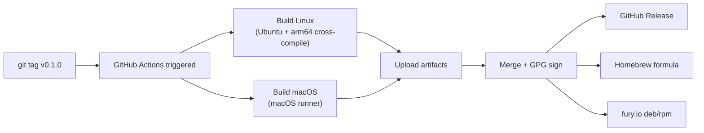

# Report: Publishing discord-bot — From Prototype to Reusable Go Package

This report tells the story of turning a local prototype—`js-discord-bot`, a Go-hosted Discord bot runtime with a JavaScript authoring API—into a properly published, versioned, distributable Go package and standalone binary. The project lives at `github.com/go-go-golems/discord-bot` and released its first version (`v0.1.0`) on April 26, 2026.

The report is written for an engineer joining the project who needs to understand not just what was done, but why each step matters, how the pieces fit together, and what the resulting system looks like from the outside. It follows the actual sequence of work: analysis, planning, phased execution, and release.

> [!summary]
> This report covers four key ideas:
> 1. A Go prototype can become a published package by following a mechanical sequence: rename the module, add infrastructure from a template, inject versioning, and let GoReleaser handle the rest.
> 2. The go-go-golems ecosystem has a reusable skeleton (`go-template`) that provides every piece of CI/release infrastructure a project needs—copying it and adapting a few strings is faster than building from scratch.
> 3. The public API surface (`pkg/framework` and `pkg/botcli`) already existed in the prototype; publishing was about stabilizing documentation, not redesigning the API.
> 4. All release secrets (GPG signing, Homebrew tap, fury.io) live at the GitHub organization level, so new repos inherit them automatically—no per-repo secret configuration needed.

---

## Why this note exists

This project went through a complete lifecycle in one session: a design guide was written, an implementation plan was executed across six phases, and a release was cut. The decisions and tradeoffs are worth preserving as a reference for the next time a prototype needs to become a product. The report also serves as onboarding documentation for anyone reading the `discord-bot` codebase for the first time.

---

## Part 1: What the project is

### The two-sentence description

**discord-bot** is a Go program that connects to Discord's gateway, embeds a JavaScript runtime (goja), and lets you write bot behavior in JavaScript through a `require("discord")` API. Go owns the session, command sync, and process lifecycle; JavaScript owns the bot behavior.

This split is deliberate. Go gives you control over deployment, concurrency, and the binary distribution story. JavaScript gives you a fast authoring loop for bot logic, with access to Discord interactions, events, components, modals, and outbound operations through a request-scoped context object.

### The mental model

```text
┌─────────────────────────────────────────────┐
│           Your Go application               │
│                                             │
│  import "github.com/go-go-golems/           │
│            discord-bot/pkg/framework"        │
│                                             │
│  bot, _ := framework.New(                   │
│    framework.WithCredentialsFromEnv(),      │
│    framework.WithScript("./bot/index.js"),  │
│  )                                          │
│  bot.Run(ctx)                               │
│                                             │
└──────────────────┬──────────────────────────┘
                   │
     ┌─────────────┴─────────────┐
     ▼                           ▼
┌──────────┐          ┌──────────────────┐
│ discordgo │          │  goja JS runtime │
│ session   │◄────────►│  + require()     │
│ (gateway) │  events  │  + defineBot()   │
└──────────┘  ──────►  └──────────────────┘
```

The Go side creates a Discord session via `discordgo`, starts a goja JavaScript runtime, and registers a native `require("discord")` module. When a Discord event arrives—a slash command invocation, a button click, a message creation—the Go side dispatches it into the JavaScript runtime, which calls the handler the bot author defined. The handler returns a response payload, which the Go side normalizes back into a Discord response and sends over the gateway.

### What it is not

It is not a Node.js bot framework. The JavaScript runs inside an embedded Go runtime, not in Node. There is no `npm`, no `node_modules` in the traditional sense, and no access to the full Node standard library. The `require()` system is provided by goja's module loader, which supports a curated set of native modules (filesystem, crypto, database via SQLite) plus the custom `discord` module that exposes the bot API.

---

## Part 2: The three-codebase analysis

Before any code was changed, three repositories were analyzed to understand the gap between the prototype and the target state. This analysis shaped every subsequent decision.

### The prototype: `js-discord-bot`

The prototype lived at `github.com/manuel/wesen/2026-04-20--js-discord-bot`, a local-only module path that encoded the project's start date. It had approximately 14,000 lines of Go code across three layers:

- **`internal/jsdiscord/`** — the JavaScript runtime engine (~11,700 lines). This is the heart of the system: the goja runtime host, the `require("discord")` module registration, the event dispatcher, the payload normalizer, the UI DSL for building Discord components, and the outbound operation handlers (`ctx.discord.channels.send`, `ctx.discord.messages.edit`, and so on).

- **`internal/bot/`** — the Discord session wrapper (~313 lines). This creates a `discordgo.Session`, wires event handlers, syncs slash commands, and manages the gateway lifecycle.

- **`pkg/`** — the public Go API (~3,000 lines across two packages). `pkg/framework` provides a simple single-bot embedding path. `pkg/botcli` provides the repo-driven multi-bot CLI experience (`bots list`, `bots help`, `bots <name> run`).

The prototype had two problems that blocked publishing:

1. **The module path was not importable.** `github.com/manuel/wesen/2026-04-20--js-discord-bot` is a local path, not something another Go project can `go get`. The `go.mod` also contained a `replace` directive pointing the `go-go-goja` dependency at a local directory, which only works on one machine.

2. **There was no release infrastructure.** No Makefile, no GoReleaser configuration, no CI workflows, no linting hooks, no version injection. Every other published tool in the go-go-golems ecosystem had these; the prototype had none of them.

### The skeleton: `go-template`

The `go-template` repository (`go-go-golems/go-template`) is a skeleton that every new tool in the ecosystem starts from. It provides:

- A `Makefile` with standard targets: `lint`, `test`, `build`, `goreleaser`, `tag-patch`, `release`.
- A `.goreleaser.yaml` configured for split builds (Linux on Ubuntu, macOS on macOS runners), GPG signing, Homebrew formula publication, and deb/rpm packaging via fury.io.
- A `lefthook.yml` for pre-commit and pre-push hooks.
- A `.golangci.yml` for lint configuration.
- A full set of GitHub Actions workflows: release pipeline, push CI, lint, CodeQL, secret scanning, dependency scanning.

The key insight from analyzing `go-template` is that the infrastructure is project-agnostic. The only project-specific values are the binary name and the module path. Everything else—build matrix, signing keys, Homebrew tap, fury.io endpoint—is shared across the organization.

### The finished product: `pinocchio`

Pinocchio is the largest published tool in the go-go-golems ecosystem. It provided the reference for what a "done" project looks like:

- Module path: `github.com/go-go-golems/pinocchio`
- Version: `v0.10.x` (actively versioned, not yet declared stable)
- Distribution: Homebrew (`go-go-golems/homebrew-go-go-go`), deb/rpm (fury.io), GitHub Releases
- The `cmd/pinocchio/main.go` follows a specific pattern: `var version = "dev"` injected via ldflags, embedded static assets via `//go:embed`, and a single `initRootCmd()` function that wires everything together.

The pinocchio analysis confirmed that the discord-bot prototype's `cmd/` structure was already correct—single binary, Cobra + Glazed CLI framework. The gap was purely infrastructure.

### The gap analysis

The analysis produced a clear table of what needed to change:

| Aspect | Prototype | Target | Work |
|--------|-----------|--------|------|
| Module path | `github.com/manuel/wesen/2026-04-20--js-discord-bot` | `github.com/go-go-golems/discord-bot` | Rename in `go.mod` + all imports |
| Local replace | `go-go-goja => /home/.../go-go-goja` | No replace directive | Remove after verifying go-go-goja is published |
| Makefile | None | Full targets | Copy from go-template, adapt |
| GoReleaser | None | Full config | Copy from go-template, adapt |
| CI workflows | None | push + release + lint + security | Copy from go-template |
| Version injection | None | `var version = "dev"` + ldflags | Add to `cmd/discord-bot/main.go` |
| GitHub repo | Local only | `go-go-golems/discord-bot` | Create and push |

This table became the implementation plan. Every row maps to one or two concrete steps.

---

## Part 3: The six-phase implementation

The work was divided into six phases, each producing a commitable result. The phases were ordered so that each one depends only on the phases before it—there is no circular dependency, no "do this and then redo it later" cycle.

### Phase 1: Rename and reparent

**What happened:** The module path was renamed from `github.com/manuel/wesen/2026-04-20--js-discord-bot` to `github.com/go-go-golems/discord-bot` across 17 Go source files and the `go.mod` file. The local `replace` directive for `go-go-goja` was removed, and the dependency was pointed at the published `v0.4.12` tag.

**Why it matters:** A Go module's path is its identity. You cannot `go get` a module whose path is a local directory. Every downstream consumer—the Go module proxy, GoReleaser, Homebrew—needs a stable, resolvable module path. This is the single step that makes the module "real" in the Go ecosystem.

**How it was done:** A mechanical `sed` replacement across all Go files, followed by `go mod tidy` to re-resolve dependencies. The entire step took minutes because the change is purely textual—no logic changes, no API changes, just string substitution in import paths.

```bash
# The core operation
find . -name '*.go' -exec sed -i 's|old/path|new/path|g' {} \;
sed -i 's|old/path|new/path|g' go.mod
go mod tidy
go build ./...
go test ./...
```

**The go-go-goja dependency:** The prototype used a local `replace` directive to point at an in-development version of `go-go-goja`. Before the replace could be removed, the published `go-go-goja` had to contain the discord registrar support. This was verified by checking that the local HEAD matched the latest published tag (`v0.4.12`). Once confirmed, the `replace` line was deleted and `go mod tidy` resolved the dependency from the Go module proxy instead of a local directory.

### Phase 2: Audit the public API

**What happened:** The exported types and functions in `pkg/framework/` and `pkg/botcli/` were reviewed for naming consistency and documentation quality. A package-level doc comment was added to `pkg/framework/`.

**Why it matters:** The public API is the contract between the library and its consumers. Once you publish `v0.1.0`, every exported name becomes part of the API surface. Adding doc comments before the first release means `pkg.go.dev` renders useful documentation from day one.

**What was found:** The API was already well-designed. `pkg/botcli/` had a thorough `doc.go` explaining the customization hooks (`WithAppName`, `WithRuntimeModuleRegistrars`, `WithRuntimeFactory`) and their deliberate "smallest hook first" ordering. `pkg/framework/` had good doc comments on individual types but lacked the package-level comment. That was the only change needed.

**The two public packages:**

- `pkg/framework` — for embedding exactly one bot. You create a `Bot` with `New()`, passing functional options for credentials, script path, runtime config, and sync behavior.

- `pkg/botcli` — for the full repository-driven CLI. You resolve bot repositories with `BuildBootstrap()`, mount the command tree with `NewBotsCommand()`, and add it to your Cobra root command.

### Phase 3: Infrastructure from go-template

**What happened:** Infrastructure files were copied from `go-template` and adapted. This included the `Makefile`, `.goreleaser.yaml`, `.golangci.yml`, `lefthook.yml`, `LICENSE`, and all six GitHub Actions workflows.

**Why it matters:** Infrastructure is the difference between "works on my machine" and "works for everyone." Without a Makefile, there is no canonical way to build, test, or lint. Without GoReleaser, there is no cross-platform binary distribution. Without CI, there is no guarantee that a pushed commit actually compiles.

**The key adaptation:** The only values that needed changing from `go-template` were:

- `XXX` → `discord-bot` (binary name, module path, descriptions)
- `./cmd/XXX` → `./cmd/discord-bot` (entry point)
- Added `./internal/...` to the lint paths (go-template only lints `./cmd/... ./pkg/...`, but this project has significant code in `internal/`)

Everything else—the GoReleaser split build (Linux on Ubuntu with arm64 cross-compilation, macOS on macOS), the GPG signing, the Homebrew tap, the fury.io deb/rpm publishing—was identical to the template.

**The GoReleaser configuration** is worth understanding in detail because it does most of the heavy lifting:

```yaml
builds:
  - id: discord-bot-linux
    env: [CGO_ENABLED=1]        # goja and sqlite3 require CGO
    main: ./cmd/discord-bot
    ldflags:
      - -X main.version={{.Version}}  # inject version at build time
```

The `ldflags` line is the version injection mechanism. GoReleaser sets `main.version` to the git tag version when building release artifacts. When building locally without GoReleaser, the default value `"dev"` is used.

### Phase 4: Version injection

**What happened:** A `var version = "dev"` was added to `cmd/discord-bot/main.go`, and the root Cobra command was updated to use it: `Version: version`.

**Why it matters:** A published binary should report its version when asked. `discord-bot --version` should print `0.1.0` for the v0.1.0 release, not `dev` or nothing. The ldflags mechanism is the standard Go approach: the variable exists in the source code with a default value, and the build system overrides it at compile time.

**How to verify it works locally:**

```bash
go build -ldflags "-X main.version=test-0.0.1" -o /tmp/discord-bot ./cmd/discord-bot
/tmp/discord-bot --version
# Output: discord-bot version test-0.0.1
```

### Phase 5: Tag and release

**What happened:** All changes were pushed to `go-go-golems/discord-bot`, the tag `v0.1.0` was created and pushed, and the GoReleaser release workflow ran automatically.

**Why it matters:** This is the moment the project becomes real for consumers. The tag triggers the release pipeline, which builds binaries for Linux (amd64, arm64) and macOS (amd64, arm64), signs the checksums with GPG, publishes a Homebrew formula, uploads deb/rpm packages to fury.io, and creates a GitHub Release with all artifacts attached.

**The release workflow** runs in three jobs:

1. **`goreleaser-linux`** — builds on Ubuntu, cross-compiles for arm64 using `aarch64-linux-gnu-gcc`.
2. **`goreleaser-darwin`** — builds on macOS.
3. **`goreleaser-merge`** — downloads both artifact sets, merges them, imports the GPG key, signs the checksums, publishes to Homebrew and fury.io.

The `environment: release` setting on the merge job means GitHub requires a human to approve the release in the Actions UI before artifacts are published. This is a safety valve.

**The secret discovery:** All five required secrets (GPG signing key, GPG passphrase, GoReleaser Pro key, Homebrew tap token, fury.io token) were already configured at the GitHub organization level with visibility `ALL`. No per-repo secret configuration was needed. This is the correct pattern for an organization with many published tools—configure once at the org level, inherit everywhere.

### Phase 6: Polish and documentation

**What happened:** The README was rewritten from scratch—removing all `GOWORK=off` references, adding installation instructions (Homebrew, deb/rpm, from source), Go API examples, and an architecture diagram. An `AGENT.md` was created for AI agent instructions. Dependabot configuration was added.

**Why it matters:** The GitHub release page, Homebrew formula, and `pkg.go.dev` all surface the README. The first release should ship with documentation that a new user can follow without knowing the project's history. The old README was written for the prototype phase; the new README is written for a consumer who just installed the binary.

---

## Part 4: The resulting architecture

After all six phases, the repository at `github.com/go-go-golems/discord-bot` has this shape:

```text
discord-bot/
  go.mod                     # module github.com/go-go-golems/discord-bot
  go.sum
  .goreleaser.yaml           # linux + darwin builds, brew, deb, rpm, fury.io
  .golangci.yml              # errcheck, govet, staticcheck, exhaustive, ...
  .golangci-lint-version     # pinned linter version
  Makefile                   # lint, test, build, goreleaser, tag-*, release
  lefthook.yml               # pre-commit + pre-push hooks
  AGENT.md                   # AI agent instructions
  README.md                  # public-facing documentation
  LICENSE                    # MIT

  cmd/
    discord-bot/             # CLI entrypoint (main.go, root.go, commands.go)

  internal/
    bot/                     # Discord session wrapper
    config/                  # Host config (credentials, validation)
    jsdiscord/               # Embedded JS runtime engine

  pkg/
    framework/               # Public: simple single-bot embedding
    botcli/                  # Public: repo-driven multi-bot CLI
    doc/                     # Embedded help pages (//go:embed)

  examples/
    discord-bots/            # Named JS bot implementations
    framework-single-bot/    # Minimal embedding example
    framework-custom-module/ # Custom require("app") module example
    framework-combined/      # Combined built-in + repo-driven example

  .github/
    workflows/
      release.yaml           # Split GoReleaser pipeline
      push.yml               # CI on every push/PR
      lint.yml               # Lint workflow
      codeql-analysis.yml    # Security scanning
      secret-scanning.yml    # Secret scanning
      dependency-scanning.yml # Dependency scanning
    dependabot.yml           # Weekly dependency updates
```

The structure is identical to the prototype—no files were moved or reorganized. The only changes were the module path, the added infrastructure files, and the version injection in `cmd/discord-bot/main.go`.

---

## Part 5: Lessons learned

### What went well

- **The go-template pattern is a force multiplier.** Copying infrastructure from a proven template and adapting three strings (binary name, module path, entry point) is dramatically faster than building CI from scratch. Every new go-go-golems project should start by copying `go-template`.

- **The public API was already extracted.** The prototype had `pkg/framework/` and `pkg/botcli/` with clean functional-option APIs. Publishing did not require redesigning the public surface—only documenting it. If you are building a prototype that you plan to publish, extract the public API early.

- **Org-level secrets eliminate per-repo configuration.** Once the GPG keys, Homebrew token, and fury.io token are set at the organization level, new repositories inherit them automatically. This means the release pipeline works on the first push without any secret wrangling.

- **Mechanical changes are safe.** The module path rename touched 17 files but was a pure string substitution with no logic changes. `go build ./...` and `go test ./...` confirmed correctness immediately.

### What was tricky

- **Pre-existing lint debt blocked strict hooks.** The prototype had 30 lint issues (unused functions, incomplete switches, formatting) in `internal/jsdiscord/`. When lefthook's pre-commit hook ran `make lint`, it failed and blocked commits. The fix was to make lint non-blocking (`run: make lint || true`) until the debt is cleaned up in a separate ticket. This is a common pattern: prototypes accumulate lint debt because they move fast, and the debt must be addressed before strict enforcement makes sense.

- **The `replace` directive removal required external verification.** You cannot simply delete a `replace` directive and hope the dependency resolves. You must verify that the published version of the dependency contains the features you need. In this case, checking that `go-go-goja` tag `v0.4.12` contained the discord registrar support required comparing the local HEAD with the remote tag.

### The release pipeline, visualized



The entire pipeline—from tag push to published artifacts—takes approximately three minutes. The merge job requires manual approval in the GitHub UI (the `environment: release` gate), which adds a human checkpoint before anything is published publicly.

---

## Part 6: What a downstream consumer sees

### Installing the binary

```bash
# macOS or Linux (Homebrew)
brew install go-go-golems/tap/discord-bot

# Linux (deb)
sudo apt install discord-bot

# From source
go install github.com/go-go-golems/discord-bot/cmd/discord-bot@latest
```

### Using the Go package

```go
// Simple single-bot embedding
package main

import (
    "context"
    "github.com/go-go-golems/discord-bot/pkg/framework"
)

func main() {
    bot, _ := framework.New(
        framework.WithCredentialsFromEnv(),
        framework.WithScript("./my-bot/index.js"),
        framework.WithSyncOnStart(true),
    )
    bot.Run(context.Background())
}
```

### The JavaScript bot API

```javascript
const { defineBot } = require("discord")

module.exports = defineBot(({ command, event, configure }) => {
  configure({ name: "demo", description: "A demo bot" })

  event("ready", async (ctx) => {
    ctx.log.info("ready", { user: ctx.me.username })
  })

  command("ping", { description: "Reply pong" }, async () => {
    return { content: "pong" }
  })
})
```

These three interfaces—CLI binary, Go package, JavaScript API—are the product surface. Everything inside `internal/` is implementation detail that can change without breaking consumers.

---

## Open questions

- **Should the old `wesen/2026-04-20--js-discord-bot` repo be archived?** It still exists on GitHub under the personal account. The canonical source is now `go-go-golems/discord-bot`. Archiving the old repo prevents confusion.

- **Should the 30 pre-existing lint issues be fixed before the next release?** They are all in `internal/jsdiscord/` and do not affect the public API, but they make the CI output noisy and block strict lint hooks.

- **When should the API be declared stable?** The project is at `v0.1.0`, which signals pre-release instability under semver. The public API should be declared stable only after at least one downstream consumer has successfully embedded it.

---

## Working rules

- **Copy from `go-template`, don't invent.** The infrastructure patterns are proven. Adapting them is faster and safer than building new ones.
- **Publish early, iterate.** A `v0.1.0` release does not need to be perfect. It needs to be installable, importable, and versioned.
- **Keep secrets at the org level.** Per-repo secrets are configuration debt. Org-level secrets with `ALL` visibility scale to any number of repositories.
- **Extract the public API during prototyping.** If `pkg/` is clean before you decide to publish, the publishing process is mechanical. If `pkg/` does not exist, you must design and extract it first—which is much harder under time pressure.
- **Address lint debt in a separate ticket.** Mixing lint cleanup with publishing work creates noisy diffs and makes it harder to verify that the publishing changes are correct.

---

## Related notes

- The design guide and phased implementation plan are in the repo's `ttmp/2026/04/26/DISCORD-BOT-PUBLISH--*/` directory.
- The `go-template` skeleton is at `~/code/wesen/corporate-headquarters/go-template`.
- The pinocchio reference project is at `~/code/wesen/corporate-headquarters/pinocchio`.
