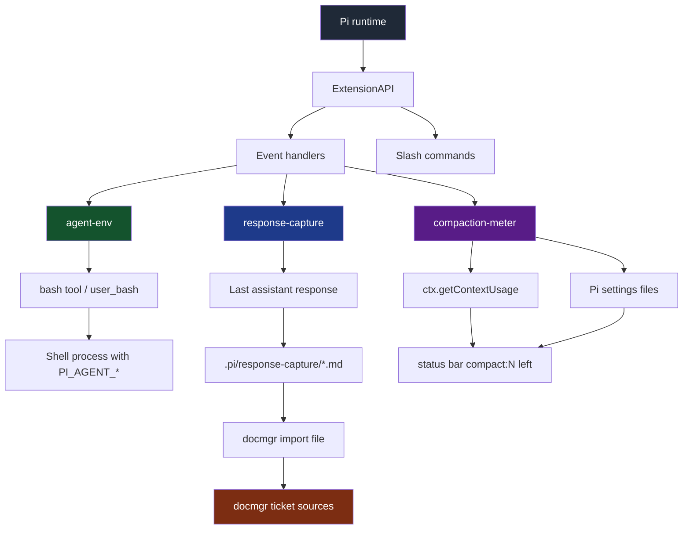
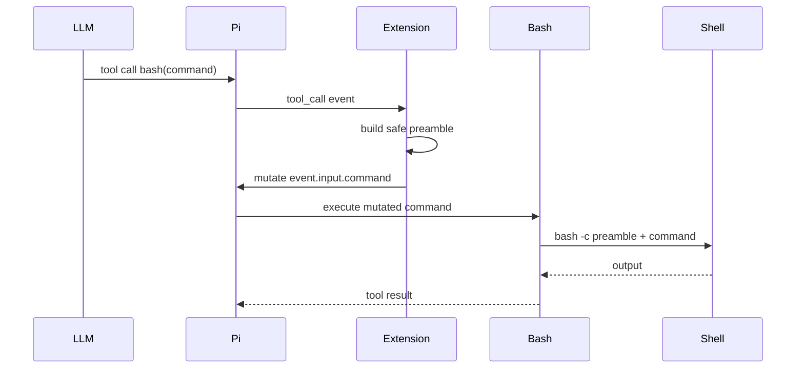
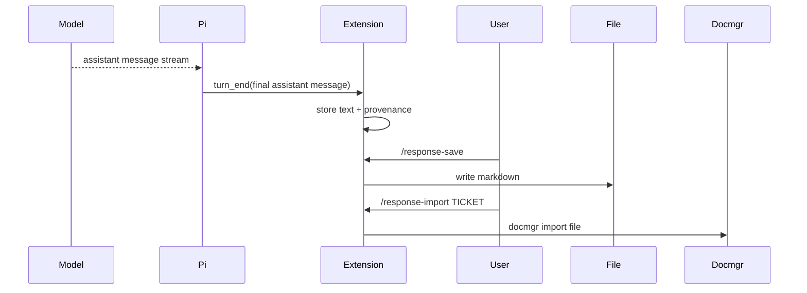
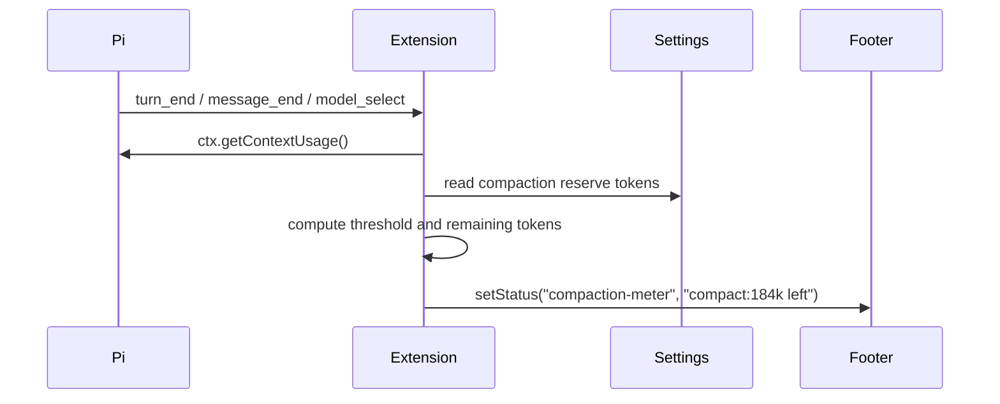

# Pi Extensions - Agent Env, Response Capture, and Compaction Meter

This project report describes three Pi coding-agent extensions built in the `2026-04-21--pi-extensions` repository: `agent-env`, which exposes Pi session metadata to shell commands as `PI_AGENT_*` environment variables; `response-capture`, which captures the last assistant response, saves it as markdown, and imports it into a docmgr ticket; and `compaction-meter`, which shows how many tokens remain before automatic compaction in the status bar. The three extensions solve different problems, but they share the same design attitude: use Pi's extension events as narrow integration seams, preserve built-in behavior where possible, and make agent work easier to audit and steer after the fact.

> [!summary]
> The three extensions turn ephemeral agent activity into usable local context.
> 1. `agent-env` lets scripts know *which Pi session, turn, model, and tool call* launched them.
> 2. `response-capture` lets a useful LLM answer become a durable markdown artifact and a docmgr source.
> 3. `compaction-meter` lets the user see *how close the session is to automatic compaction* without opening a diagnostic command.
> 4. All three extensions were validated in real Pi/tmux sessions and tracked through docmgr tickets.

## Why these extensions exist

A coding agent does useful work in two places: inside the conversation and inside the tools it calls. Without extra plumbing, both are harder to correlate than they should be. A shell script launched from Pi sees a normal process environment; it does not know the Pi session id, the turn number, or the tool call id that caused it to run. A valuable assistant response, meanwhile, exists in the transcript but is not automatically turned into a ticket artifact or documentation source.

The first two extensions close those gaps from opposite directions. The third adds a steering instrument for long-running work.

`agent-env` carries conversation metadata *outward* into the shell. It answers questions such as: "Was this command launched by Pi? Which session? Which tool call? Which turn? Which model?" That makes downstream scripts, logging, and debugging tools easier to correlate with the agent transcript.

`response-capture` carries assistant output *inward* into the documentation system. It answers a different question: "The model just wrote something useful; how do I save it as a file and attach it to the right docmgr ticket without copy/paste?" That makes the LLM's useful prose available as a durable source artifact.

`compaction-meter` carries context-window pressure *upward* into the status bar. It answers the operational question: "How many tokens do I have before Pi compacts this session?" That makes long-running sessions easier to steer before the context window forces a summary boundary.

## Current project status

All three extensions are implemented, installed by symlink, validated in tmux, and committed.

| Extension | Source path | Ticket | Status |
|---|---|---|---|
| `agent-env` | `/home/manuel/code/wesen/2026-04-21--pi-extensions/extensions/agent-env` | `PI-EXT-AGENT-ENV` | Implemented and validated |
| `response-capture` | `/home/manuel/code/wesen/2026-04-21--pi-extensions/extensions/response-capture` | `PI-EXT-RESPONSE-CAPTURE` | Implemented and validated |
| `compaction-meter` | `/home/manuel/code/wesen/2026-04-21--pi-extensions/extensions/compaction-meter` | `PI-EXT-COMPACTION-METER` | Implemented and validated |

Installed symlinks:

```text
~/.pi/agent/extensions/agent-env
  -> /home/manuel/code/wesen/2026-04-21--pi-extensions/extensions/agent-env

~/.pi/agent/extensions/response-capture
  -> /home/manuel/code/wesen/2026-04-21--pi-extensions/extensions/response-capture

~/.pi/agent/extensions/compaction-meter
  -> /home/manuel/code/wesen/2026-04-21--pi-extensions/extensions/compaction-meter
```

Relevant commits:

```text
e8b4bfd Plan agent-env implementation tasks
ae21a57 Implement agent-env extension
0bd1957 Record agent-env validation
5d48a40 Document compaction and plan response capture
04384f0 Implement response capture extension
b58a5b6 Validate response capture import
5412beb Implement compaction meter extension
```

All three docmgr tickets currently remain `active`, but their tasks are complete:

- `PI-EXT-AGENT-ENV`: 15 done / 0 open
- `PI-EXT-RESPONSE-CAPTURE`: 7 done / 0 open
- `PI-EXT-COMPACTION-METER`: 8 done / 0 open

## The common architecture pattern

All three extensions rely on the same Pi extension lifecycle. Pi loads TypeScript extension modules, calls their default factory with an `ExtensionAPI`, and lets them register event handlers and slash commands. The extensions do not patch Pi internals; they subscribe to documented event seams.



The pattern is deliberately modest. Each extension does one thing at a boundary:

- `agent-env` transforms a `bash` command immediately before execution.
- `response-capture` records a completed assistant response and exposes commands for saving/importing it.
- `compaction-meter` reads current context usage and publishes a short status-bar meter.

This is the right level of integration. None of the extensions needs to own the agent loop, replace model calls, or parse session files manually.

## Extension 1: agent-env

`agent-env` injects a set of `PI_AGENT_*` environment variables into Pi-launched shell commands. Its main source files are:

```text
extensions/agent-env/
├── index.ts   # Pi event handlers and commands
├── env.ts     # env snapshot, shell quoting, preamble generation, self-tests
└── README.md  # usage and validation guide
```

### The problem it solves

When Pi runs a bash tool call, the child process knows normal shell facts such as `PWD` and `PATH`, but it does not know Pi facts. A script cannot tell whether it was launched by a human shell, a Pi `bash` tool call, or a user `!` command inside Pi. It also cannot tag logs with the Pi session id or the exact tool call id.

The desired outcome is simple:

```bash
printf '%s\n' "$PI_AGENT" "$PI_AGENT_SESSION_ID" "$PI_AGENT_TOOL_CALL_ID"
```

should print useful values when the command runs inside Pi.

### The key design decision: mutate the command, do not replace bash

Pi offers two plausible implementation strategies:

1. Intercept the `tool_call` event and mutate `event.input.command` before the built-in bash tool runs.
2. Register a custom `bash` tool with a `spawnHook` and inject environment variables through `child_process.spawn`'s `env` field.

The first approach was chosen for version 1 because it preserves Pi's built-in bash behavior. Replacing `bash` is cleaner from a display perspective, but it risks drifting from Pi's built-in handling of shell path, shell command prefix, output truncation, rendering, and future tool changes.

The selected approach is visible but conservative:

```typescript
pi.on("tool_call", async (event, ctx) => {
  if (!state.enabled) return;
  if (!isToolCallEventType("bash", event)) return;

  const details = buildDetails(state, {
    trigger: "tool_call",
    toolName: "bash",
    toolCallId: event.toolCallId,
  });

  const preamble = buildPreamble(ctx, state, details);
  const nextCommand = injectPreamble(event.input.command, preamble);

  if (nextCommand !== event.input.command) {
    event.input.command = nextCommand;
    recordInjection(state, event.toolCallId);
    setStatus(ctx, state);
  }
});
```

There are two important details in this short handler.

First, it uses `isToolCallEventType("bash", event)` rather than a bare `event.toolName === "bash"`. Pi's type definitions recommend the helper because custom tool events can overlap with built-in tool names at the type level. The helper narrows `event.input` to the bash input shape, where `command` is known to exist.

Second, it calls `injectPreamble()` rather than blindly prepending text. This gives the extension an idempotence check: if the command already contains the marker, it is not injected again.

### The shell quoting lesson

The subtle part of `agent-env` is shell quoting. The first design draft proposed double quotes:

```bash
export PI_AGENT_TEST="$(printf injected)"
```

That is unsafe. Bash performs command substitution inside double quotes, so the value above becomes `injected`, and the command inside `$()` runs. Environment-variable injection must treat metadata as literal data, not shell code.

The implemented quoting helper uses single quotes and the standard close-quote/backslash/reopen-quote pattern for embedded single quotes:

```typescript
export function shellQuote(value: string): string {
  return `'${value.replace(/'/g, "'\\''")}'`;
}
```

This makes the dangerous example literal:

```bash
export PI_AGENT_TEST='$(printf injected)'
printf '%s\n' "$PI_AGENT_TEST"
# prints: $(printf injected)
```

The self-test command exists because this is the kind of bug that should stay tested in the running environment, not merely explained in a design document.

### The environment schema

`agent-env` exports these variables:

| Variable | Meaning |
|---|---|
| `PI_AGENT` | Marker set to `1`. |
| `PI_AGENT_EXTENSION_VERSION` | Schema version, currently `1`. |
| `PI_AGENT_TRIGGER` | `tool_call`, `user_bash`, or `self_test`. |
| `PI_AGENT_TOOL_NAME` | Usually `bash`. |
| `PI_AGENT_TOOL_CALL_ID` | Tool call id for LLM bash calls. |
| `PI_AGENT_SESSION_ID` | Current Pi session id. |
| `PI_AGENT_SESSION_FILE` | Current session file when available. |
| `PI_AGENT_SESSION_DIR` | Current session directory when available. |
| `PI_AGENT_SESSION_NAME` | User-facing session name when set. |
| `PI_AGENT_LEAF_ID` | Current session tree leaf id. |
| `PI_AGENT_CWD` | Pi working directory. |
| `PI_AGENT_TURN_INDEX` | 0-based current turn index. |
| `PI_AGENT_TURN_NUMBER` | 1-based current turn number. |
| `PI_AGENT_MODEL_PROVIDER` | Active model provider. |
| `PI_AGENT_MODEL_ID` | Active model id. |
| `PI_AGENT_MODEL_NAME` | Active model display name. |
| `PI_AGENT_START_TIME` | Extension session start time as ISO timestamp. |
| `PI_AGENT_START_TIME_MS` | Extension session start time as epoch milliseconds. |

The builder derives most values from `ExtensionContext` at injection time:

```typescript
export function buildAgentEnv(ctx: ExtensionContext, details: AgentEnvBuildDetails): Record<string, string> {
  const turnIndex = details.turnIndex;
  const turnNumber = typeof turnIndex === "number" ? turnIndex + 1 : undefined;
  const sessionManager = ctx.sessionManager;
  const model = ctx.model;

  return {
    PI_AGENT: "1",
    PI_AGENT_EXTENSION_VERSION: EXTENSION_VERSION,
    PI_AGENT_TRIGGER: details.trigger,
    PI_AGENT_TOOL_NAME: details.toolName ?? "bash",
    PI_AGENT_TOOL_CALL_ID: details.toolCallId ?? "",
    PI_AGENT_SESSION_ID: envString(sessionManager.getSessionId()),
    PI_AGENT_CWD: envString(ctx.cwd),
    PI_AGENT_TURN_INDEX: envString(turnIndex),
    PI_AGENT_TURN_NUMBER: envString(turnNumber),
    PI_AGENT_MODEL_PROVIDER: envString(model?.provider),
    PI_AGENT_MODEL_ID: envString(model?.id),
    PI_AGENT_MODEL_NAME: envString(model?.name),
    // ... other fields
  };
}
```

The design uses both `TURN_INDEX` and `TURN_NUMBER` because code and people often want different conventions. Internals are usually zero-based; human-facing output is usually one-based.

### The preamble shape

The generated preamble is ordinary shell syntax:

```bash
# PI_AGENT_ENV_BEGIN v1
export PI_AGENT='1'
export PI_AGENT_CWD='/home/manuel/code/wesen/2026-04-21--pi-extensions'
export PI_AGENT_SESSION_ID='019dc9f2-55cb-7130-a062-c816c36628b6'
export PI_AGENT_TOOL_CALL_ID='toolu_015s6vTrbuGNwPxzPsiYKrVy'
export PI_AGENT_TRIGGER='tool_call'
# PI_AGENT_ENV_END v1
```

The markers do real work. During development, it is easy to load an extension twice by using both an explicit `-e` path and an auto-discovered symlink. Without idempotence, duplicate extension instances could stack duplicate preambles. With markers, the second instance sees the first marker and leaves the command alone.

```typescript
export function injectPreamble(command: string, preamble: string): string {
  if (command.includes(MARKER_BEGIN)) return command;
  return `${preamble}\n${command}`;
}
```

### User bash commands

Pi also supports user shell commands with `!` and `!!`. These are not LLM tool calls, so `tool_call` is not enough. The extension handles them with `user_bash`:

```typescript
pi.on("user_bash", async (_event, ctx) => {
  if (!state.enabled) return;

  const ops = createLocalBashOperations();
  const details = buildDetails(state, {
    trigger: "user_bash",
    toolName: "bash",
    toolCallId: "",
  });
  const preamble = buildPreamble(ctx, state, details);

  return {
    operations: {
      exec: (command, cwd, options) => {
        const nextCommand = injectPreamble(command, preamble);
        return ops.exec(nextCommand, cwd, options);
      },
    },
  };
});
```

The extension intentionally does not pass a partial environment object into `createLocalBashOperations()`. In Pi's implementation, passing an `env` object bypasses the default shell environment. A partial object containing only `PI_AGENT_*` would risk dropping `PATH` and other necessary variables. Command preamble injection preserves the built-in environment behavior.

### Commands and validation

User-facing commands:

| Command | Purpose |
|---|---|
| `/agent-env` | Show current variable preview and enabled state. |
| `/ae` | Short preview alias. |
| `/agent-env-toggle [on|off|toggle]` | Enable or disable injection. |
| `/ae-toggle [on|off|toggle]` | Toggle alias. |
| `/agent-env-self-test` | Run internal and shell quoting tests. |

Validation in tmux confirmed:

```text
agent-env self-test: PASS
✓ shell execution: quote=$(printf injected)
agent=1

PI_AGENT=1
TRIGGER=tool_call
TOOL_CALL_ID=toolu_015s6vTrbuGNwPxzPsiYKrVy
TURN=1

USER_PI_AGENT=1 TRIGGER=user_bash
```

The important result is not just that variables exist. The important result is that `PI_AGENT_TOOL_CALL_ID` was non-empty in a real LLM bash tool call and that the quote test printed literal `$(printf injected)`, not `injected`.

## Extension 2: response-capture

`response-capture` captures the last assistant response, saves it as markdown, and imports it into a docmgr ticket. Its source files are:

```text
extensions/response-capture/
├── index.ts     # Pi event handlers and commands
├── response.ts  # capture, markdown rendering, saved-file state
├── docmgr.ts    # docmgr ticket listing and import wrappers
└── README.md    # usage guide
```

### The problem it solves

A useful assistant response is often the beginning of documentation. It might be a design note, a code review, a debugging explanation, or a handoff summary. Without tooling, turning that answer into a docmgr source requires manual copy/paste. That is slow and loses provenance.

`response-capture` gives the user a short path:

```text
/response-preview
/response-save design-note
/response-import PI-EXT-RESPONSE-CAPTURE
```

The extension turns an assistant answer into a markdown file, then delegates the import to docmgr:

```bash
docmgr import file --file <saved-response.md> --ticket <ticket> --name <saved-response>
```

### Capturing at turn_end

The extension captures assistant output at `turn_end`. That is the right event because the message is complete and the turn index is known.

```typescript
pi.on("turn_end", async (event, ctx) => {
  if (event.message.role !== "assistant") return;
  const captured = captureResponse(ctx, event.turnIndex, event.message as AssistantMessage);
  if (!captured) return;
  state.lastResponse = captured;
  state.lastSavedResponseTurnIndex = undefined;
  if (ctx.hasUI) ctx.ui.setStatus(STATUS_KEY, `response:${event.turnIndex + 1}/unsaved`);
});
```

The extension saves only assistant text blocks:

```typescript
export function extractAssistantText(message: AssistantMessage): string {
  const parts: string[] = [];
  for (const block of message.content) {
    if (block.type === "text") {
      parts.push(block.text);
    }
  }
  return parts.join("\n\n").trim();
}
```

This is a deliberate v1 choice. Thinking blocks are not imported into documentation. The saved artifact should be the user-facing answer, not hidden reasoning.

### Runtime state and the saved-file invariant

The state is small:

```typescript
export interface ResponseCaptureState {
  lastResponse: CapturedResponse | undefined;
  lastSavedPath: string | undefined;
  lastSavedResponseTurnIndex: number | undefined;
}
```

The important invariant is:

```typescript
lastSavedPath is reusable only when
lastSavedResponseTurnIndex === lastResponse.turnIndex
```

A new assistant response invalidates the relationship between the current response and the last saved file. The extension keeps `lastSavedPath` for `/response-import-last`, but `/response-import` saves the current response when needed.

### Markdown output

Saved files live under the project-local cache:

```text
.pi/response-capture/<timestamp>-<slug>.md
```

The repository `.gitignore` ignores this cache:

```gitignore
.pi/response-capture/
```

Each saved file includes provenance frontmatter:

```markdown
---
Title: "second-capture"
Source: "pi-response-capture"
SessionId: "019dc9f2-..."
SessionFile: ""
TurnIndex: 0
CapturedAt: "2026-04-26T13:57:33.340Z"
ModelProvider: "claude-agent-sdk"
ModelId: "claude-haiku-4-5"
ModelName: "Claude Haiku 4.5 (latest)"
---

# second-capture

Second capture test
```

The frontmatter is enough to answer the question, "Where did this note come from?" That matters when imported markdown becomes a docmgr source months later.

### Docmgr integration

The extension shells out to `docmgr`; it does not import docmgr internals. Ticket listing uses structured output:

```typescript
export async function listTickets(cwd: string): Promise<TicketRecord[]> {
  const { stdout } = await execFileAsync(
    "docmgr",
    ["ticket", "list", "--with-glaze-output", "--output", "json"],
    { cwd, maxBuffer: MAX_BUFFER },
  );
  const parsed = JSON.parse(stdout) as TicketRecord[];
  return Array.isArray(parsed) ? parsed : [];
}
```

Importing uses `execFile`, not shell string concatenation:

```typescript
export async function importFile(cwd: string, file: string, ticket: string, name?: string): Promise<string> {
  const args = ["import", "file", "--file", file, "--ticket", ticket];
  if (name?.trim()) args.push("--name", name.trim());
  const { stdout, stderr } = await execFileAsync("docmgr", args, { cwd, maxBuffer: MAX_BUFFER });
  return [stdout.trim(), stderr.trim()].filter(Boolean).join("\n");
}
```

This avoids path quoting bugs. If a saved response path contains spaces, it is still passed as a single argument.

### The .md.md bug

Real validation found a small bug. The first version passed the saved file basename, including `.md`, as the docmgr `--name` value. Docmgr treated the name as a logical stem and appended the extension, producing a destination ending in `.md.md`.

The fix was to strip the extension before passing `--name`:

```typescript
function importNameFromPath(path: string): string {
  const base = basename(path);
  const ext = extname(base);
  return ext ? base.slice(0, -ext.length) : base;
}
```

The extension then calls:

```typescript
const output = await importFile(ctx.cwd, path, ticket, importNameFromPath(path));
```

This is a good example of why validation should use the actual downstream tool. The extension code looked reasonable before the test; the duplication only appeared when docmgr performed its own naming behavior.

### Commands and validation

User-facing commands:

| Command | Purpose |
|---|---|
| `/response-preview` | Show a preview of the last captured assistant response. |
| `/response-save [name]` | Save the last assistant response to `.pi/response-capture/`. |
| `/response-import [ticket]` | Save if needed, then import into a docmgr ticket. |
| `/response-import-last [ticket]` | Import the last saved file without re-saving, useful after manual edits. |

Validated workflow:

```text
Reply with exactly: Second capture test
/response-save second-capture
/response-import PI-EXT-RESPONSE-CAPTURE
```

The successful imported source is:

```text
ttmp/2026/04/26/PI-EXT-RESPONSE-CAPTURE--pi-extension-to-save-last-llm-response-and-import-into-docmgr/sources/local/2026-04-26T13-57-33-340Z-second-capture.md
```

The validation transcript showed:

```text
Imported response into PI-EXT-RESPONSE-CAPTURE
File: /home/manuel/code/wesen/2026-04-21--pi-extensions/.pi/response-capture/2026-04-26T13-57-33-340Z-second-capture.md
Destination: .../sources/local/2026-04-26T13-57-33-340Z-second-capture.md
```

## Extension 3: compaction-meter

`compaction-meter` shows how many tokens remain before Pi's automatic compaction threshold is crossed. Its source files are:

```text
extensions/compaction-meter/
├── index.ts    # Pi event handlers and commands
├── meter.ts    # token-distance arithmetic and formatting
├── settings.ts # documented settings-file reader
└── README.md   # usage, formula, validation, limitations
```

### The problem it solves

Pi can automatically compact long sessions, but the user still benefits from knowing how close that compaction boundary is. Without a meter, the user can see rough context usage in the footer, but not the more operational number: *how many tokens remain before Pi decides to compact?*

That number matters during long-running development work. If only a few thousand tokens remain, it may be better to ask for a summary, checkpoint important state, or avoid reading another large file. If many tokens remain, the user can continue normally.

### The compaction formula

Pi's built-in compaction rule is conceptually:

```text
compact when contextTokens > contextWindow - compaction.reserveTokens
```

The extension turns that rule into a status-bar distance:

```text
threshold = contextWindow - reserveTokens
remaining = threshold - currentTokens
```

For a 200,000-token context window and the default reserve of 16,384 tokens, the compaction threshold is:

```text
200,000 - 16,384 = 183,616
```

At the beginning of a session with zero counted context tokens, the footer therefore reports approximately:

```text
compact:184k left
```

The formatter keeps the status short because the footer is shared space. Detailed numbers live behind `/compact-meter`.

### Reading usage and settings

The token usage source of truth is Pi's extension context:

```typescript
ctx.getContextUsage()
```

That returns current token usage, context-window size, and usage percentage when available. The extension does not parse session files or re-estimate all messages; it asks Pi for the same context-usage view the runtime already exposes.

Compaction settings are read from Pi's documented JSON settings files:

```text
~/.pi/agent/settings.json
<cwd>/.pi/settings.json
```

Project settings override global settings. If no compaction settings exist, the extension uses Pi's defaults:

```json
{
  "enabled": true,
  "reserveTokens": 16384,
  "keepRecentTokens": 20000
}
```

This was an intentional v1 tradeoff. `ExtensionContext` exposes context usage, but not the effective `SettingsManager`. Reading documented settings files avoids deep-importing Pi internals, with one limitation: command-line compaction overrides are not visible to the extension.

### Status text

The status-bar values are designed to be compact and immediately readable:

| Condition | Status text | Meaning |
|---|---|---|
| Compaction enabled and space remains | `compact:42.1k left` | The session is 42.1k tokens away from the auto-compaction threshold. |
| Usage unavailable | `compact:? left` | Pi does not currently have a usable token count. |
| Compaction disabled | `compact:off` | Automatic compaction is disabled in settings. |
| Threshold exceeded | `compact:due 1.2k over` | The session is past the auto-compaction threshold. |

The diagnostic command shows the full arithmetic:

```text
Status: compact:184k left
Compaction enabled: yes
Current context tokens: 0
Context window: 200,000
Reserve tokens: 16,384
Compaction threshold: 183,616
Tokens until compaction: 183,616
Usage of compaction threshold: 0.0%
Usage of context window: 0.0%
```

### Commands and validation

User-facing commands:

| Command | Purpose |
|---|---|
| `/compact-meter` | Show detailed token/threshold information. |
| `/cm` | Alias for `/compact-meter`. |

Validation in tmux confirmed:

- Pi startup listed `compaction-meter` in loaded extensions.
- `/compact-meter` reported 183,616 tokens until compaction for a 200,000-token context window with the default 16,384-token reserve.
- The footer showed `compact:184k left`.

## What the three extensions teach

These extensions are small, but they capture several durable rules for Pi extension work.

### 1. Prefer event seams over tool replacement

`agent-env` could have replaced the `bash` tool. It did not. It used `tool_call` mutation because that was enough for v1 and preserved built-in behavior.

The rule is: replace a built-in tool only when the documented event seam cannot express the behavior. Tool replacement gives more control, but also more responsibility.

### 2. Treat shell syntax as a security boundary

Generated shell code is code. If an extension generates `export` statements, the quoting function is part of the security model. Double quotes are not safe for untrusted or unknown values in Bash because command substitution still runs inside them.

This rule generalizes beyond `agent-env`: any extension that rewrites bash commands should include explicit tests for shell metacharacters.

### 3. Use `execFile` for CLI integration

`response-capture` invokes `docmgr` with `execFile`. That is the right default for extension-to-CLI integration. It avoids a whole class of shell quoting bugs and keeps each argument structurally separate.

### 4. Let downstream tools own their domain

`response-capture` does not write directly into docmgr internals. It writes a markdown file and asks docmgr to import it. That preserves docmgr's metadata behavior, source layout, and future compatibility.

### 5. Validate with the real runtime

All three extensions had details that only became obvious in runtime validation:

- `agent-env` needed to avoid duplicate extension loading during tests.
- `response-capture` had the `.md.md` import-name behavior.
- `compaction-meter` needed a real interactive footer to verify that `ctx.ui.setStatus()` produced the intended `compact:184k left` display.

Static reasoning was necessary, but not sufficient. The extensions needed to run inside Pi.

## Implementation details as reusable patterns

### Pattern: pre-execution command mutation

Use this when a shell command needs a preamble but built-in bash behavior should remain intact.



This is the `agent-env` pattern.

### Pattern: capture final assistant message

Use this when an extension needs the completed answer rather than streaming updates.



This is the `response-capture` pattern.

### Pattern: status item as lightweight instrument

Use this when an extension needs to surface a continuously useful fact without owning the whole footer. `compaction-meter` does this with `ctx.ui.setStatus()` rather than `ctx.ui.setFooter()`. The extension contributes a small status segment and leaves the rest of Pi's footer alone.



This is the `compaction-meter` pattern.

### Pattern: saved artifact as persistence boundary

`response-capture` does not persist its runtime state through `pi.appendEntry()`. The saved markdown file is the persistent artifact. That is the right choice because the purpose of the extension is to create a file. Persisting internal state would not help much if the file does not exist.

Use this rule for future extensions: if the extension's main product is a file, make the file the persistence boundary. Add session state only when the extension needs to recover UI workflow after reload.

## Current user-facing commands

### agent-env

```text
/agent-env
/ae
/agent-env-toggle [on|off|toggle]
/ae-toggle [on|off|toggle]
/agent-env-self-test
```

### response-capture

```text
/response-preview
/response-save [name]
/response-import [ticket]
/response-import-last [ticket]
```

### compaction-meter

```text
/compact-meter
/cm
```

## Important project docs

Docmgr tickets:

- `PI-EXT-AGENT-ENV`
  - `ttmp/2026/04/26/PI-EXT-AGENT-ENV--pi-agent-metadata-environment-variables-extension/design-doc/01-plan-review-and-revised-design.md`
  - `ttmp/2026/04/26/PI-EXT-AGENT-ENV--pi-agent-metadata-environment-variables-extension/reference/01-diary.md`
- `PI-EXT-RESPONSE-CAPTURE`
  - `ttmp/2026/04/26/PI-EXT-RESPONSE-CAPTURE--pi-extension-to-save-last-llm-response-and-import-into-docmgr/design-doc/01-implementation-guide.md`
  - `ttmp/2026/04/26/PI-EXT-RESPONSE-CAPTURE--pi-extension-to-save-last-llm-response-and-import-into-docmgr/reference/01-implementation-diary.md`
- `PI-EXT-COMPACTION-METER`
  - `ttmp/2026/04/26/PI-EXT-COMPACTION-METER--pi-status-bar-compaction-distance-extension/design/01-implementation-guide.md`
  - `ttmp/2026/04/26/PI-EXT-COMPACTION-METER--pi-status-bar-compaction-distance-extension/reference/01-implementation-diary.md`

Repository docs:

- `/home/manuel/code/wesen/2026-04-21--pi-extensions/README.md`
- `/home/manuel/code/wesen/2026-04-21--pi-extensions/docs/pi-compaction-textbook.md`

Extension READMEs:

- `/home/manuel/code/wesen/2026-04-21--pi-extensions/extensions/agent-env/README.md`
- `/home/manuel/code/wesen/2026-04-21--pi-extensions/extensions/response-capture/README.md`
- `/home/manuel/code/wesen/2026-04-21--pi-extensions/extensions/compaction-meter/README.md`

## Open questions

### Should `agent-env` eventually use `spawnHook`?

Maybe. A `spawnHook` implementation would keep injected variables out of the displayed command and session history. That is cleaner, but it requires replacing or wrapping the built-in `bash` tool carefully. The current v1 is intentionally conservative.

### Should `response-capture` persist captured response state across reloads?

Probably not yet. The saved markdown file is the useful durable artifact. Runtime persistence would matter only if users frequently reload Pi between a response and `/response-save`.

### Should `response-capture` include thinking blocks?

Not by default. Imported docmgr sources should contain user-facing content. A future opt-in command such as `/response-save --include-thinking` could exist, but it should not be the normal path.

### Should `compaction-meter` eventually use effective settings from Pi itself?

Yes, if Pi exposes the effective `SettingsManager` or effective compaction settings through `ExtensionContext`. The current implementation reads documented settings files, which is simple and stable, but cannot see command-line overrides.

### Should `compaction-meter` warn or colorize when compaction is close?

Maybe. The current v1 is intentionally quiet: it displays a number but does not interrupt. A future version could add a configurable low-token warning, for example below 10k tokens remaining, or a custom footer component with color.

### Should the docmgr tickets be closed?

All three tickets have zero open tasks. They remain `active`. Closing them is a project-management decision rather than an implementation requirement.

## KB reviews

- [[KB-BATCH14-pi-extensions-tooling]] (2026-05-11) — Batch K Pi extension/tooling review; created [[Tribal/pi-extension-event-seams]] and advanced Pi TUI/model-config candidates.

## Related KB entries

- [[Tribal/pi-extension-event-seams]] — Pi lifecycle/event seams, prompt shaping, tool-call mutation, TUI surfaces, and model/config integration discipline.
- [[Fundamentals/host-mediated-sandbox-principles]] — the host/runtime boundary principle behind narrow extension capabilities and mediated side effects.

## Near-term next steps

1. Close `PI-EXT-AGENT-ENV`, `PI-EXT-RESPONSE-CAPTURE`, and `PI-EXT-COMPACTION-METER` if no further polish is desired.
2. Use `response-capture` in normal Pi work to collect real examples and see whether import UX needs shortcuts.
3. Watch whether `agent-env` preamble visibility becomes annoying. If it does, design a v2 `spawnHook` mode.
4. Watch whether `compaction-meter` should become more proactive, for example with low-token warnings or colorized status.
5. Consider adding a shared testing playbook for Pi extensions in tmux, since all three extensions benefited from real runtime validation.

## Project working rule

For Pi extensions in this repository, prefer the smallest documented event hook that solves the problem. Add code only at the boundary where Pi already exposes a seam. Validate inside Pi, not only with static inspection, because the behavior that matters is runtime behavior: extension discovery, UI commands, tool-call mutation, CLI integration, and how other extensions interact in the same session.
