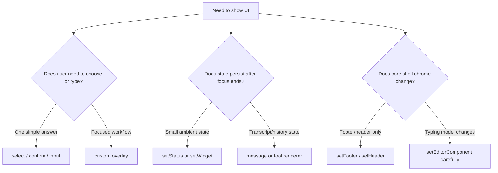
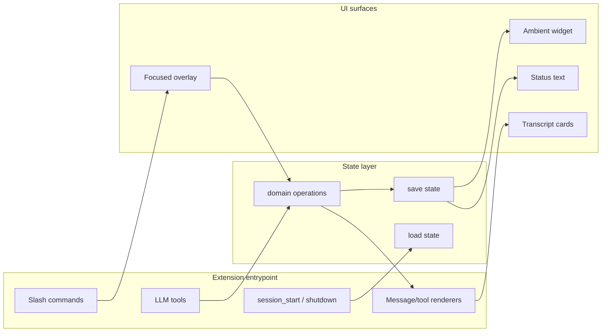

# Textbook: Building Beautiful TUIs for Pi Extensions

This note is a textbook-style report on building rich terminal user interfaces for Pi extensions. It grew out of the `TUI-EXPERIENCES` ticket, the `tui-showcase` demo extension, and the `kanban-demo` task-system extension in `/home/manuel/code/wesen/2026-04-21--pi-extensions`. The goal is not merely to list APIs. The goal is to explain the mental model: why Pi exposes the TUI the way it does, what kinds of interfaces fit naturally into that model, and how to build them without fighting the terminal.

> [!summary]
> - Pi TUI extensions are built from small terminal components that render arrays of strings and handle focused keyboard input.
> - The most useful design pattern is a layered one: overlays for focused work, widgets/status for ambient state, and renderers for durable history.
> - Beautiful terminal UI is less about decoration than discipline: width-safe rendering, clear keymaps, explicit cleanup, and predictable lifecycle behavior.
> - The `tui-showcase` and `kanban-demo` extensions are local pattern libraries for future Pi extension work.

## Why this note exists

Pi starts as a coding agent, but in interactive mode it is also a programmable terminal application. That distinction matters. A normal extension system might let you register commands or tools and stop there. Pi goes further: it lets an extension add a modal overlay, replace the editor, publish status text into the footer, render custom tool results, show persistent widgets above or below the input area, and create full keyboard-driven workflows.

That power has a cost. Terminal UI is unforgiving. A web component can overflow, reflow, or rely on browser layout. A Pi TUI component receives a width and must return lines that fit. A web component can assume a mouse and a scroll container. A Pi component should assume keyboard navigation, narrow terminals, ANSI escape codes, and a user who may press Escape at any moment. The terminal rewards interfaces that are explicit, compact, and mechanically reliable.

The work in this repository created two concrete teaching artifacts:

- `extensions/tui-showcase/index.ts` is a grab-bag demo of palettes, overlays, widgets, custom chrome, custom messages, and custom tool renderers.
- `extensions/kanban-demo/index.ts` is a fuller product-shaped example: a persistent Kanban task board with an overlay, below-editor widget, status line integration, file-backed state, and an LLM-callable tool.

The durable lesson is that Pi TUI work should be designed as a system of surfaces, not a single screen. The overlay is where the user focuses. The widget is where background state remains visible. The status line is where short state belongs. The renderer is where session history becomes readable. The editor is where the user's primary input lives, and because it is primary, it should be modified only with care.

## The first mental model: a component is a terminal function

The core Pi TUI abstraction is deliberately small. A component is an object that can render itself at a given width and optionally receive keyboard input when focused.

```ts
interface Component {
  render(width: number): string[];
  handleInput?(data: string): void;
  wantsKeyRelease?: boolean;
  invalidate(): void;
}
```

This contract is the foundation. Everything else is a higher-level convenience around it. A `Text` component wraps text. A `SelectList` implements a keyboard list. A custom overlay is still just a component. A persistent widget is a component. A custom footer is a component. A custom message renderer returns a component. If you understand this interface, the rest of the system becomes much easier to reason about.

The important word in the interface is `width`. Pi does not ask a component to render in the abstract. It asks it to render into a terminal of a particular width. The component must return an array of strings, one per terminal line, and every line must fit. This one rule shapes the whole engineering style.

```ts
function render(width: number): string[] {
  return [truncateToWidth(`Current task: ${task.title}`, width, "…")];
}
```

A good component is therefore a pure-ish terminal function:

```text
state + width + theme  ──render()──>  terminal lines
keyboard input         ──handleInput()──> state changes
state change           ──requestRender()──> Pi redraws
```

The component should not perform expensive work inside `render`. It should not read files, run commands, call the network, or mutate global state while drawing. Rendering is something Pi may do frequently. Treat it as formatting, not business logic.

## The second mental model: Pi gives you several UI surfaces

A beginner often asks, "How do I show a UI?" A better question is, "Which surface should this state live on?" Pi offers several surfaces, each with a different purpose.

| Surface | Pi API | Best for | Risk level |
| --- | --- | --- | --- |
| Notification | `ctx.ui.notify()` | Short feedback after an action | Low |
| Dialog | `ctx.ui.select()`, `confirm()`, `input()` | Simple one-question interactions | Low |
| Widget | `ctx.ui.setWidget()` | Persistent ambient state near the editor | Low |
| Status | `ctx.ui.setStatus()` | Tiny state in footer/status area | Low |
| Overlay | `ctx.ui.custom(..., { overlay: true })` | Focused mini-apps, dashboards, palettes, task boards | Medium |
| Custom message | `pi.registerMessageRenderer()` | Durable history cards in the transcript | Medium |
| Tool renderer | `renderCall`, `renderResult` | Readable agent tool activity | Medium |
| Header/footer | `ctx.ui.setHeader()`, `ctx.ui.setFooter()` | Shell chrome and workspace identity | Medium-high |
| Editor replacement | `ctx.ui.setEditorComponent()` | Primary input redesigns | High |

The design rule is simple: use the least invasive surface that tells the truth. If all you need is to say "saved," use a notification. If you need to show that a background session is still running, use a widget or status. If the user needs to navigate, filter, edit, and decide, use an overlay. If the UI changes how typing works, then and only then consider a custom editor.



## The rendering discipline: width is the law

Terminal UIs fail in small ways before they fail in large ways. A line is one cell too wide. A border does not close. An ANSI-colored string is truncated by JavaScript string length rather than visible width. A wide glyph takes two columns. A cached render keeps old theme colors after a theme switch. These problems are not glamorous, but they decide whether the interface feels solid.

Use the TUI utilities deliberately:

```ts
import { truncateToWidth, visibleWidth, wrapTextWithAnsi } from "@mariozechner/pi-tui";
```

The distinction between string length and visible width is essential. ANSI escapes add bytes but not terminal cells. Some glyphs add more than one terminal cell. The correct question is not `line.length <= width`; the correct question is `visibleWidth(line) <= width`.

A typical row helper looks like this:

```ts
function padAnsi(text: string, width: number): string {
  return text + " ".repeat(Math.max(0, width - visibleWidth(text)));
}

function row(content: string, width: number, border: (s: string) => string): string {
  const inner = width - 4;
  return border("│ ") + padAnsi(truncateToWidth(content, inner, "…"), inner) + border(" │");
}
```

This is the terminal equivalent of CSS layout. It is humble code, but it is the difference between a polished overlay and a broken one.

## The lifecycle discipline: every animation needs a cleanup path

A terminal UI often uses timers. The `tui-showcase` overlay animates a dashboard sparkline. The `PulseWidget` animates a below-editor widget. A future CI monitor might refresh every few seconds. These features are fine, but they require explicit cleanup.

```ts
class PulseWidget implements Component {
  private timer: ReturnType<typeof setInterval>;

  constructor(private tui: TUI) {
    this.timer = setInterval(() => tui.requestRender(), 500);
  }

  dispose(): void {
    clearInterval(this.timer);
  }

  invalidate(): void {}
  render(width: number): string[] { ... }
}
```

Pi will dispose extension widgets when they are replaced or cleared, and custom overlays can return components with `dispose()`. But the extension author still has to write the cleanup. The same rule applies to file watchers, PTYs, subprocesses, subscriptions, background jobs, and intervals. If the component starts something, the component or extension must stop it.

The useful invariant is:

- A component may allocate resources in its constructor.
- A component must release those resources in `dispose()`.
- An extension that installs persistent UI should clear it during `session_shutdown`.

## The first demo: `tui-showcase` as a pattern library

The `tui-showcase` extension is intentionally not a product. It is a box of parts. Its purpose is to make the possible visible.

The command surface is small:

```text
/tui-demo            open the main showcase overlay
/tui-demo chrome     toggle custom header/footer/widgets/editor skin
/tui-demo reset      restore default Pi chrome
/tui-demo palette    choose a palette with SelectList
/tui-demo settings   open a SettingsList demo
/tui-demo markdown   open a Markdown component demo
/tui-demo message    send a custom-rendered session message
```

The main overlay demonstrates a tabbed mini-application. It has tabs for palettes, components, forms, dashboards, Markdown, and help. The overlay is not drawn by a framework. It is drawn by functions that return terminal lines.

```ts
class TuiShowcaseOverlay implements Component, Focusable {
  focused = false;
  private tabIndex = 0;
  private selected = 0;
  private timer = setInterval(() => {
    this.tick++;
    this.tui.requestRender();
  }, 350);

  handleInput(data: string): void {
    if (matchesKey(data, Key.escape)) return this.done(null);
    if (matchesKey(data, Key.tab)) this.nextTab();
    if (matchesKey(data, Key.up)) this.move(-1);
    if (matchesKey(data, Key.down)) this.move(1);
  }

  render(width: number): string[] {
    return drawFramedTabs(width, this.currentTab(), this.palette());
  }

  dispose(): void {
    clearInterval(this.timer);
  }
}
```

This is a good teaching example because it shows the essential shape without hiding it. State lives in fields. Keyboard input mutates state. Rendering reads state. Timers request redraws. Disposal stops timers.

### Palettes are not themes

The showcase includes ANSI 256-color palettes. This is useful, but it should not be confused with Pi's own theme system. A Pi theme defines semantic colors such as `accent`, `muted`, `warning`, and `error`. A palette is a local visual vocabulary that a component may use for swatches, gradients, and decorative accents.

That distinction matters because semantic theme colors preserve consistency with the rest of Pi, while local palettes give a particular extension personality. Good TUI design uses both:

```ts
const title = theme.fg("accent", "Task Board");
const spark = ansiFg(palette.colors[i % palette.colors.length], "█");
```

Use `theme` for meaning. Use palettes for flavor.

### Chrome mode is intentionally invasive

The command `/tui-demo chrome` demonstrates a custom header, footer, widget, status, working message, and editor label. This is powerful. It is also a warning label. Changing Pi's chrome changes the user's working environment. It can make a workflow feel integrated, but it can also obscure information or break expectations.

The showcase includes `/tui-demo reset` for that reason. Any extension that modifies global chrome should provide a clear path back to defaults.

## The second demo: `kanban-demo` as a product-shaped TUI

The `kanban-demo` extension takes the same primitives and uses them for a fuller system. It is not just a pretty overlay. It has state, domain rules, an agent tool, a persistent widget, and a custom renderer.

The board model is deliberately simple:

```ts
type ColumnId = "backlog" | "ready" | "doing" | "review" | "done";
type Priority = "low" | "medium" | "high" | "urgent";

interface Card {
  id: number;
  title: string;
  description: string;
  priority: Priority;
  assignee: string;
  tags: string[];
  createdAt: number;
  updatedAt: number;
}

interface Column {
  id: ColumnId;
  title: string;
  wipLimit?: number;
  cards: Card[];
}

interface Board {
  nextId: number;
  columns: Column[];
  archived: Card[];
}
```

The persistence model is equally simple: the board lives in `.pi/kanban-demo.json` under the current repository. This makes the demo state local to the project and easy to inspect.

```ts
function boardPath(cwd: string): string {
  return join(cwd, ".pi", "kanban-demo.json");
}

function loadBoard(cwd: string): Board {
  if (!existsSync(boardPath(cwd))) return seedBoard();
  return JSON.parse(readFileSync(boardPath(cwd), "utf-8"));
}

function saveBoard(cwd: string, board: Board): void {
  mkdirSync(dirname(boardPath(cwd)), { recursive: true });
  writeFileSync(boardPath(cwd), JSON.stringify(board, null, "\t"));
}
```

The board has several surfaces:

- The `/kanban` command opens the overlay for focused interaction.
- The below-editor widget shows counts and WIP warnings after the overlay closes.
- The status line shows active/done counts and warnings.
- The `kanban_task` tool lets the agent add, move, update, delete, reset, and list cards.
- The tool renderer makes the tool result readable in the transcript.

This is the pattern worth remembering: a real extension is rarely one UI. It is a coordinated set of surfaces around one state model.

```mermaid
flowchart TD
    State[Board state<br/>.pi/kanban-demo.json]
    Command[/kanban command]
    Overlay[Kanban overlay<br/>focused keyboard workflow]
    Widget[Below-editor widget<br/>ambient counts + WIP warnings]
    Status[Footer status<br/>active/done summary]
    Tool[kanban_task tool<br/>agent-driven changes]
    Renderer[Custom tool renderer<br/>readable transcript]

    Command --> Overlay
    Overlay --> State
    Tool --> State
    State --> Widget
    State --> Status
    State --> Renderer
```

## Why overlays and widgets belong together

An overlay is excellent for focus. It can take over the user's attention and provide a rich keyboard workflow. But when the overlay closes, it disappears. If the state still matters, the user needs a smaller persistent reminder.

The Kanban board shows this nicely. The overlay is where cards move. The widget is where the board remains present:

```text
▦ Kanban Backlog:2  Ready:2  Doing:2  Review:1  Done:1
```

If a WIP limit is exceeded, the widget can show that too:

```text
▦ Kanban Backlog:2  Ready:2  Doing:4  Review:1  Done:1  WIP Doing 4/3
```

This is the same pattern used by high-quality terminal tools. A full-screen UI is not the only interface; the prompt, the status line, and the transcript are also part of the product.

## Why renderers matter

Tool calls are part of Pi's conversation history. If a tool returns a wall of JSON, the session becomes harder to scan. A renderer turns a tool result into a human-readable card.

The `kanban_task` tool returns structured details:

```ts
return {
  content: [{ type: "text", text: `${message}\n\n${summarizeBoard(board)}` }],
  details: { action, message, board },
};
```

The renderer reads those details and returns a component:

```ts
renderResult(result, { expanded }, theme) {
  const details = result.details as { message?: string; board?: Board } | undefined;
  const text = details?.board
    ? renderBoardText(details.board, theme, expanded)
    : fallbackText(result);

  const box = new Box(1, 0, (s) => theme.bg("customMessageBg", s));
  box.addChild(new Text(`${theme.fg("accent", details?.message ?? "Kanban result")}\n${text}`, 0, 0));
  return box;
}
```

This is not decoration. It changes how useful the transcript is. When a future reader scrolls back through the session, they can see the board state without mentally parsing raw tool output.

## Keyboard design before layout design

A common mistake is to draw the screen first and decide keys later. For terminal UIs, the order should be reversed. The keymap is the interaction contract. Once the keymap is clear, the layout has a job: make those actions visible.

The Kanban overlay keymap is intentionally conventional:

| Key | Action |
| --- | --- |
| `←` / `→` | Select previous or next column. |
| `↑` / `↓` | Select a card in the current column. |
| `Shift+←` / `Shift+→` | Move the selected card across columns. |
| `Enter` / `Space` | Toggle the details pane. |
| `/` | Enter filter mode. |
| `n` | Add a demo card. |
| `d` | Delete the selected card. |
| `a` | Archive Done cards. |
| `r` | Reset the board. |
| `Esc` | Close the overlay. |

The footer of the overlay repeats the keymap in compact form. This is not optional polish. It is part of making a terminal UI learnable.

## The role of `Focusable`

Some components should implement `Focusable`. A focusable component has a `focused` boolean and may display a cursor or receive input. The important use case is text input and IME support. When a component displays a cursor, it should emit Pi's cursor marker at the right position so the hardware terminal cursor can be placed correctly.

The Kanban overlay implements `Focusable` even though it does not yet implement an IME-aware text input field. The filter mode is simple. A more complete version would use `CURSOR_MARKER` or embed an `Input` component. The teaching point is that focus is explicit: Pi routes keyboard input to the focused component.

```ts
class SearchOverlay implements Component, Focusable {
  focused = false;
  private query = "";

  render(width: number): string[] {
    const cursor = this.focused ? CURSOR_MARKER : "";
    return [truncateToWidth(`Filter: ${this.query}${cursor}`, width)];
  }
}
```

## The shape of a well-designed Pi TUI extension

A product-shaped extension usually has the same architecture whether it manages Kanban cards, background shells, review comments, or documentation tasks.



The responsibilities should stay separate:

- The entrypoint registers commands, tools, events, and renderers.
- The state layer loads, saves, and mutates domain data.
- The overlay handles focused interaction.
- The widget summarizes background state.
- The renderer makes history readable.

This separation is why the Kanban demo is useful as a template. A future `docmgr` dashboard, PR review board, CI monitor, or background job tray could reuse the same shape.

## Common widgets worth building

Once you see Pi as a multi-surface terminal application, many widget ideas become obvious. A widget should be small, persistent, and glanceable. It should not try to be the full application.

| Widget | What it teaches the user | When it should appear |
| --- | --- | --- |
| Build/CI monitor | Whether the current branch is green or red. | After tests, CI polling, or PR setup. |
| Agent todo strip | What the agent believes it is currently doing. | During multi-step work. |
| Context budget meter | How close the session is to compaction pressure. | Always, or after large reads. |
| Background jobs tray | Which long-running jobs can be attached to. | When shells, servers, or scans run in background. |
| PR review dashboard | Which files/comments/checks still need attention. | During review work. |
| Docmgr ticket widget | Active ticket, open tasks, stale docs. | During doc-heavy tasks. |
| Dependency health widget | Outdated packages, vulnerabilities, lockfile drift. | During maintenance. |
| Model/work mode indicator | Current model, thinking level, active tool preset. | Always, if workflow depends on mode. |
| Notification inbox | Messages from subagents or external systems. | When multiple agents or integrations are active. |
| Session timeline minimap | Branch/tree/compaction milestones. | During long sessions. |
| Scratchpad widget | Short notes that can be inserted into editor. | During exploration. |
| Test watch widget | Latest failing test names. | During TDD loops. |
| Git worktree widget | Dirty/staged/ahead/behind status. | Always in code repos. |
| Prompt recipe palette | Queued skill/template/mode. | Before the next user message. |
| Operator checklist | Human-in-the-loop runbook progress. | During deployment or risky operations. |

The test for a widget is: can the user understand it in one glance? If not, it wants to be an overlay.

## Failure modes

### Rendering too wide

The symptom is broken borders, wrapped lines, or redraw artifacts. The cause is usually string length being used instead of visible width, or ANSI escapes being truncated incorrectly.

Working rule:

- Use `visibleWidth()` to measure.
- Use `truncateToWidth()` to cut.
- Test at 80 columns.

### Forgetting `requestRender()`

The symptom is state changing internally but not visually. The cause is that Pi's rendering is not automatic after every object mutation. If `handleInput()` changes state and the component remains open, call `tui.requestRender()`.

### Leaking timers

The symptom is unexpected redraws after a UI closes, or CPU usage that continues after a session switch. The cause is a missing `dispose()` or shutdown cleanup.

Working rule:

- Every `setInterval`, file watcher, PTY, or subscription must have a cleanup path.

### Overusing editor replacement

The symptom is broken paste, missing Escape behavior, broken autocomplete, or surprising Ctrl+C behavior. The cause is replacing the editor without preserving Pi's app-level input handling.

Working rule:

- Prefer overlays and widgets.
- If replacing the editor, extend `CustomEditor` and call `super.handleInput(data)` for unhandled keys.
- Provide a reset command.

### Putting business logic in render

The symptom is slow rendering, inconsistent state, or side effects triggered by redraws. The cause is treating `render(width)` like a controller method.

Working rule:

- `render` formats current state.
- Commands, tools, timers, and input handlers mutate state.

## A recommended implementation sequence

When building a new Pi TUI extension, start smaller than you think.

1. **Define the domain state.** Decide what data exists, where it is stored, and which operations mutate it.
2. **Add a command that opens a simple overlay.** Render a title, one row of data, and an Escape hint.
3. **Add keyboard navigation.** Make the keymap work before making the UI beautiful.
4. **Make rendering width-safe.** Add row helpers, truncation, and visible-width padding.
5. **Add persistent ambient state.** Use `setWidget` or `setStatus` to keep important information visible after the overlay closes.
6. **Add an LLM tool.** Let the agent mutate the same state through structured actions.
7. **Add custom renderers.** Make the tool calls and results readable in the transcript.
8. **Add polish.** Add colors, badges, tables, borders, help text, and empty states.
9. **Add cleanup.** Implement `dispose()` and `session_shutdown` handlers.
10. **Test narrow, wide, reload, and shutdown.** Terminal UI bugs often appear only at boundaries.

This sequence avoids the common trap of designing a beautiful screen before the state model and interaction model are stable.

## Concrete commands from this project

The local pattern library currently includes these extension entrypoints:

```text
/home/manuel/code/wesen/2026-04-21--pi-extensions/extensions/tui-showcase/index.ts
/home/manuel/code/wesen/2026-04-21--pi-extensions/extensions/kanban-demo/index.ts
```

Run the showcase:

```bash
pi -e ./extensions/tui-showcase/index.ts
```

Then try:

```text
/tui-demo
/tui-demo chrome
/tui-demo palette
/tui-demo settings
/tui-demo markdown
/tui-demo message
/tui-demo reset
```

Run the Kanban demo:

```bash
pi -e ./extensions/kanban-demo/index.ts
```

Then try:

```text
/kanban
/kanban add Build a beautiful confirmation overlay
/kanban widget off
/kanban widget on
/kanban reset
```

Ask the agent to use the tool:

```text
Use kanban_task to add a high priority card titled "Build gorgeous confirmation dialog" in the ready column assigned to Mira with tags tui and ux.
```

## Key points to internalize

- A Pi TUI component is a renderer plus optional input handler. The smallness of the interface is what makes the system flexible.
- Width-safe rendering is not a detail. It is the core engineering discipline of terminal UI.
- Overlays are for focused workflows. Widgets and statuses are for ambient state. Renderers are for durable history.
- A beautiful Pi extension is usually a composition of several surfaces around one state model.
- Theme colors carry meaning; local palettes add flavor. Do not use decorative color as the only indicator of state.
- Every timer, watcher, PTY, and subscription needs a cleanup path.
- Custom editor replacement is powerful but dangerous. Treat it as shell surgery, not normal UI work.
- The best demos are product-shaped. `kanban-demo` is more instructive than a static gallery because it has state, rules, persistence, and agent integration.

## Related files

- `/home/manuel/code/wesen/2026-04-21--pi-extensions/extensions/tui-showcase/index.ts`
- `/home/manuel/code/wesen/2026-04-21--pi-extensions/extensions/tui-showcase/README.md`
- `/home/manuel/code/wesen/2026-04-21--pi-extensions/extensions/kanban-demo/index.ts`
- `/home/manuel/code/wesen/2026-04-21--pi-extensions/extensions/kanban-demo/README.md`
- `/home/manuel/code/wesen/2026-04-21--pi-extensions/ttmp/2026/04/27/TUI-EXPERIENCES--beautiful-tui-experiences-in-pi-agent/design-doc/01-beautiful-tui-experiences-in-pi-agent.md`
- `/home/manuel/.nvm/versions/node/v22.22.1/lib/node_modules/@mariozechner/pi-coding-agent/docs/tui.md`
- `/home/manuel/.nvm/versions/node/v22.22.1/lib/node_modules/@mariozechner/pi-coding-agent/docs/extensions.md`
- `/home/manuel/code/others/llms/pi/pi-mono/packages/tui/src/tui.ts`
- `/home/manuel/code/others/llms/pi/pi-mono/packages/coding-agent/src/core/extensions/types.ts`
- `/home/manuel/code/others/llms/pi/pi-mono/packages/coding-agent/src/modes/interactive/interactive-mode.ts`

## Near-term next steps

- Turn `tui-showcase` into a true gallery with screenshots or terminal recordings for each surface.
- Add render-width tests for `kanban-demo` and `tui-showcase` helper functions.
- Add a reusable local helper module for frames, ANSI-safe padding, badges, progress bars, and table layout.
- Build one production extension from the Kanban pattern, such as a docmgr ticket board or PR review board.
- Add a dedicated note on custom editor replacement, because it is the sharpest and most failure-prone TUI surface.
