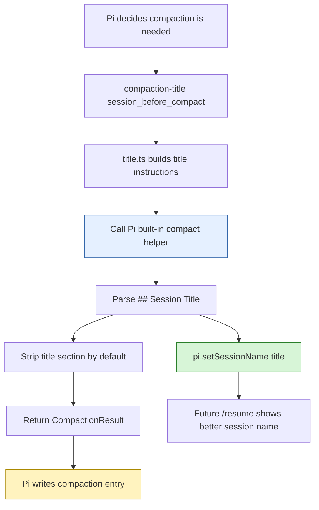
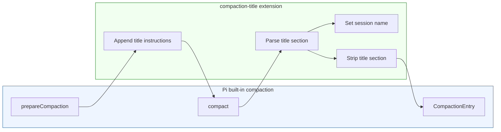

# Pi Extensions - Compaction Title Extension

This project report describes the `compaction-title` Pi extension, a session-management extension that reuses Pi's built-in compaction machinery to create better human-readable session titles. The extension does not invent its own summarizer. Instead, it calls Pi's exported `compact()` helper, appends one small instruction asking for a `## Session Title` section, parses that title, stores it with `pi.setSessionName()`, and returns the normal compaction result to Pi.

> [!summary]
> The extension turns compaction into a session-naming checkpoint.
> 1. It preserves Pi's built-in compaction behavior by importing and calling `compact()` directly.
> 2. It appends a title-section instruction instead of replacing the whole compaction prompt.
> 3. It stores the parsed title as durable session metadata through `pi.setSessionName()`.
> 4. It strips the title section from the stored compaction summary by default, keeping the summary focused on continuation context.

## Why this project exists

Pi sessions often start before the true shape of the work is known. A session might begin with a vague request like "can you look at this?" and later become a concrete implementation project with a ticket, source files, tests, documentation, and reMarkable upload. If the session selector uses the first user message or a manually assigned early title, the label can be misleading by the time the session becomes valuable enough to resume later.

Compaction is a natural moment to fix that. When Pi compacts, it has enough conversation history to understand what the session became. It already asks a model to summarize older work so future turns can continue. The `compaction-title` extension adds one extra request to that summarization moment: also write a concise session title.

The extension exists to solve this workflow problem:

```text
Long Pi session
  -> useful implementation/design work accumulates
  -> context approaches compaction
  -> compaction summary is generated
  -> session should now have a good name for /resume
```

Without this extension, the user has to remember to run `/name` manually. With it, the session title can be derived from the same context that Pi uses to preserve the session.

## Current project status

The extension is implemented and installed for Pi auto-discovery.

Source files:

- `/home/manuel/code/wesen/2026-04-21--pi-extensions/extensions/compaction-title/index.ts`
- `/home/manuel/code/wesen/2026-04-21--pi-extensions/extensions/compaction-title/title.ts`
- `/home/manuel/code/wesen/2026-04-21--pi-extensions/extensions/compaction-title/README.md`

Ticket workspace:

- `/home/manuel/code/wesen/2026-04-21--pi-extensions/ttmp/2026/04/27/PI-EXT-COMPACTION-TITLE--pi-extension-to-name-sessions-during-compaction`

Installed symlink:

```text
~/.pi/agent/extensions/compaction-title
  -> /home/manuel/code/wesen/2026-04-21--pi-extensions/extensions/compaction-title
```

Validated so far:

```bash
pi --no-session --no-extensions -e ./extensions/compaction-title --list-models no-such-model
./ttmp/2026/04/27/PI-EXT-COMPACTION-TITLE--pi-extension-to-name-sessions-during-compaction/scripts/02-smoke-test-compaction-title-extension.sh
```

Observed smoke-test output:

```text
No models matching "no-such-model"
PASS: compaction-title extension loaded successfully
```

The remaining validation is a real interactive `/compact` run to inspect generated title quality in a live session.

## Project shape

The project has three main pieces:

1. **Pi event integration** in `index.ts`
   - handles `session_start`
   - handles `session_before_compact`
   - handles `session_compact`
   - registers state and self-test commands
2. **Title parsing and instruction helpers** in `title.ts`
   - builds appended title instructions
   - combines them with user compaction instructions
   - parses `## Session Title`
   - strips the title section from the summary
   - sanitizes title text
3. **Ticket documentation and delivery artifacts**
   - design guide
   - investigation diary
   - implementation/test playbook
   - reMarkable documentation bundles



## Architecture

The most important architecture decision was to build **Option A**: reuse Pi's built-in `compact()` helper and append only the title instruction.

Earlier in the design, there were three possible approaches:

1. generate a title after compaction from `session_compact`;
2. replace compaction with a custom title-and-summary prompt;
3. call Pi's built-in `compact()` from `session_before_compact`, adding title instructions to `customInstructions`.

The implemented extension uses the third approach.

This matters because compaction is not just a cosmetic operation. It is Pi's memory-management boundary. A bad compaction summary can make the rest of the session harder to continue. Reusing `compact()` avoids copying or weakening Pi's default summary behavior.



The extension uses these Pi APIs:

| API | Purpose |
|---|---|
| `pi.on("session_start", ...)` | Restore extension state from prior custom entries and set status. |
| `pi.on("session_before_compact", ...)` | Intercept compaction before Pi writes the compaction entry. |
| `compact(...)` | Run Pi's built-in compaction with appended custom instructions. |
| `pi.setSessionName(title)` | Store the generated session title as durable session metadata. |
| `pi.appendEntry("compaction-title-state", ...)` | Persist extension bookkeeping state. |
| `pi.on("session_compact", ...)` | Refresh status after compaction finishes. |
| `pi.registerCommand(...)` | Add `/compaction-title`, `/ctitle`, and self-test commands. |
| `ctx.modelRegistry.getApiKeyAndHeaders(model)` | Resolve auth for the current model before calling `compact()`. |
| `pi.getThinkingLevel()` | Pass current reasoning level into `compact()`. |

## Implementation details

### Runtime state

The extension keeps a small state object:

```typescript
interface CompactionTitleState {
  enabled: boolean;
  stripTitleSection: boolean;
  lastTitle: string | undefined;
  lastUpdatedAt: string | undefined;
  updateCount: number;
  lastError: string | undefined;
}
```

The default state is:

```typescript
{
  enabled: true,
  stripTitleSection: true,
  lastTitle: undefined,
  lastUpdatedAt: undefined,
  updateCount: 0,
  lastError: undefined,
}
```

The state has two jobs. First, it controls behavior. `enabled` decides whether to intercept compaction. `stripTitleSection` decides whether the title section should remain in the stored summary. Second, it gives the user observability: the extension can report the last generated title, update count, and most recent error.

The state is persisted as custom session entries with:

```typescript
const CUSTOM_TYPE = "compaction-title-state";
pi.appendEntry(CUSTOM_TYPE, { ...state });
```

Custom entries do not participate in LLM context. They are bookkeeping records that survive reloads and resumes.

On startup, the extension restores state by scanning session entries:

```typescript
for (const entry of ctx.sessionManager.getEntries()) {
  if (entry.type !== "custom" || entry.customType !== CUSTOM_TYPE) continue;
  Object.assign(state, entry.data ?? {});
}
```

Then it sets `state.lastTitle` from `pi.getSessionName()` if a session name already exists.

### The compaction hook

The core implementation is the `session_before_compact` handler.

In prose, it does this:

1. If disabled, do nothing and let Pi compact normally.
2. Resolve the current model and API credentials.
3. Build extra title instructions based on the previous session title.
4. Combine those title instructions with any user-provided `/compact` custom instructions.
5. Call Pi's built-in `compact()` function with the original `event.preparation`.
6. Parse the returned summary for `## Session Title`.
7. Store the title with `pi.setSessionName()`.
8. Strip the title section from the summary by default.
9. Merge title metadata into compaction details.
10. Return the modified compaction result.

The important code path is:

```typescript
const previousTitle = pi.getSessionName() ?? state.lastTitle;
const titleInstructions = buildTitleInstructions(previousTitle);
const customInstructions = combineInstructions(event.customInstructions, titleInstructions);
const result = await compact(
  event.preparation,
  model,
  auth.apiKey,
  auth.headers,
  customInstructions,
  event.signal,
  pi.getThinkingLevel(),
);

const parsed = parseTitleAndSummary(result.summary, {
  stripTitleSection: state.stripTitleSection,
});

if (parsed.title) {
  pi.setSessionName(parsed.title);
  state.lastTitle = parsed.title;
  state.lastUpdatedAt = now;
  state.updateCount++;
  pi.appendEntry(CUSTOM_TYPE, { ...state });
}

return {
  compaction: {
    ...result,
    summary: parsed.summary,
    details: mergeDetails(result, details),
  },
};
```

The subtle part is that this extension returns a compaction result. In Pi's extension API, returning `{ compaction: ... }` from `session_before_compact` means the extension is providing the compaction that Pi should write. Because this extension calls Pi's own `compact()` helper, it still preserves normal compaction semantics.

### Title instruction builder

The helper `buildTitleInstructions()` creates a short appendix for the compaction prompt. It asks the model to add a section near the top of the summary:

```markdown
## Session Title
A short 4-10 word noun phrase naming this session.
```

It also gives rules:

- prefer concrete project, ticket, PR, feature, bug, or research task;
- use a noun phrase, not a sentence;
- avoid quotes, emoji, inline markdown, XML/HTML, and trailing punctuation;
- avoid generic titles like `Code Help` or `Project Work`;
- keep or lightly refine the existing title if it is already accurate.

This is intentionally small. The extension is not trying to take over Pi's compaction prompt. It only appends a title request.

### Combining with manual compaction instructions

Pi supports manual compaction instructions through `/compact <instructions>`. The extension preserves those by concatenating them with the title request:

```typescript
export function combineInstructions(
  customInstructions: string | undefined,
  titleInstructions: string,
): string {
  return [customInstructions?.trim(), titleInstructions.trim()]
    .filter(Boolean)
    .join("\n\n");
}
```

This means a manual compaction such as:

```text
/compact Focus on the implementation details and file paths.
```

still matters. The extension adds title generation after the user's instruction instead of replacing it.

### Parsing the title section

The parser looks for a Markdown heading:

```typescript
export function parseSessionTitle(summary: string): string | undefined {
  const match = summary.match(
    /^##\s+Session Title\s*\n+([\s\S]*?)(?=\n##\s+|\s*$)/im,
  );
  return sanitizeTitle(match?.[1]);
}
```

This parser intentionally targets a section rather than a fragile first line. A section is easy for a model to produce inside a Markdown summary, and it remains readable if `stripTitleSection` is set to `false`.

### Sanitizing title text

The sanitizer removes common formatting artifacts:

```typescript
export function sanitizeTitle(input: string | undefined): string | undefined {
  if (!input) return undefined;
  const title = input
    .split("\n")
    .map((line) => line.trim())
    .filter(Boolean)
    .join(" ")
    .replace(/^[-*]\s*/, "")
    .replace(/^#+\s*/, "")
    .replace(/^[\'\"`]+|[\'\"`]+$/g, "")
    .replace(/[<>]/g, "")
    .replace(/[.!?]+$/g, "")
    .replace(/\s+/g, " ")
    .trim()
    .slice(0, 80)
    .trim();
  return title || undefined;
}
```

It handles titles returned as bullets, headings, quoted strings, or sentences with trailing punctuation. It also caps the length at 80 characters so session selector labels stay usable.

### Stripping the title from the summary

By default, the extension removes the `## Session Title` section from the compaction summary before returning it to Pi:

```typescript
export function stripSessionTitleSection(summary: string): string {
  return summary
    .replace(/^##\s+Session Title\s*\n+[\s\S]*?(?=\n##\s+|\s*$)/im, "")
    .replace(/^\s+/, "")
    .trimEnd();
}
```

This is a design choice. The title belongs primarily in session metadata, not in the LLM continuation context. Keeping it would be harmless, but stripping it keeps the stored compaction closer to Pi's normal format.

Users can switch behavior with:

```text
/compaction-title keep
```

and return to the default with:

```text
/compaction-title strip
```

### Compaction details metadata

The extension merges extra title metadata into the compaction result details:

```typescript
interface CompactionTitleDetails {
  readFiles?: string[];
  modifiedFiles?: string[];
  sessionTitle?: string;
  previousSessionTitle?: string;
  titleGeneratedBy: "compaction-title";
  titleGeneratedAt: string;
  titleSectionStripped: boolean;
  customInstructionsAppended: boolean;
}
```

This metadata answers the audit question: which compaction generated which title? It is separate from the session name itself. The durable user-facing session name is stored with `pi.setSessionName()`, while the details record stores provenance on the compaction entry.

### Fallback behavior

The extension must never make compaction unreliable. If title generation fails, compaction should still happen.

The implemented handler catches errors:

```typescript
catch (error) {
  if (event.signal.aborted) return;
  state.lastError = error instanceof Error ? error.message : String(error);
  setStatus(ctx, state);
  if (ctx.hasUI) {
    ctx.ui.notify(
      `compaction-title failed; falling back to default compaction: ${state.lastError}`,
      "warning",
    );
  }
  return;
}
```

Returning `undefined` from `session_before_compact` means Pi can fall back to its normal compaction behavior.

## User-facing commands

| Command | Purpose |
|---|---|
| `/compaction-title` | Show current extension state. |
| `/compaction-title on` | Enable title generation. |
| `/compaction-title off` | Disable title generation. |
| `/compaction-title toggle` | Toggle enabled state. |
| `/compaction-title strip` | Strip `## Session Title` from stored summaries after parsing. |
| `/compaction-title keep` | Keep `## Session Title` in stored summaries. |
| `/ctitle` | Alias for `/compaction-title`. |
| `/compaction-title-self-test` | Run parser and instruction-builder self-tests. |

The status bar entry is compact:

```text
ct:on unset
ct:on Compaction Title Session Naming
ct:off Compaction Title Session Naming
```

## Testing and validation

The extension currently has two validation layers.

### Load validation

The extension loads successfully through Pi's explicit extension flag:

```bash
pi --no-session --no-extensions -e ./extensions/compaction-title --list-models no-such-model
```

Expected output:

```text
No models matching "no-such-model"
```

The important part is exit code 0, which proves Pi can import and initialize the extension.

### Ticket smoke test

The ticket script:

```text
ttmp/2026/04/27/PI-EXT-COMPACTION-TITLE--pi-extension-to-name-sessions-during-compaction/scripts/02-smoke-test-compaction-title-extension.sh
```

runs the same load check and prints:

```text
PASS: compaction-title extension loaded successfully
```

### Parser self-test

Inside Pi, the extension exposes:

```text
/compaction-title-self-test
```

This validates that:

- the parser extracts `## Session Title`;
- the title section is stripped by default;
- user compaction instructions are preserved when title instructions are appended.

### Remaining live validation

The next important validation is a real compaction run:

```text
/reload
/compaction-title
/compact Focus on preserving implementation details and file paths.
```

Then inspect:

```text
/session
/compaction-title
```

Expected:

- session name changes to a concrete title;
- compaction summary still preserves normal continuation context;
- `## Session Title` is absent from the stored summary in default `strip` mode;
- session JSONL contains a `session_info` entry and `compaction-title-state` custom entry.

## Documentation and delivery workflow

The implementation was tracked through docmgr ticket:

```text
PI-EXT-COMPACTION-TITLE — Pi extension to name sessions during compaction
```

Important ticket documents:

- `/home/manuel/code/wesen/2026-04-21--pi-extensions/ttmp/2026/04/27/PI-EXT-COMPACTION-TITLE--pi-extension-to-name-sessions-during-compaction/design/01-analysis-design-and-implementation-guide.md`
- `/home/manuel/code/wesen/2026-04-21--pi-extensions/ttmp/2026/04/27/PI-EXT-COMPACTION-TITLE--pi-extension-to-name-sessions-during-compaction/reference/01-investigation-diary.md`
- `/home/manuel/code/wesen/2026-04-21--pi-extensions/ttmp/2026/04/27/PI-EXT-COMPACTION-TITLE--pi-extension-to-name-sessions-during-compaction/playbook/01-implementation-and-test-playbook.md`

The docs were uploaded to reMarkable in two bundles:

```text
/ai/2026/04/27/PI-EXT-COMPACTION-TITLE/PI-EXT-COMPACTION-TITLE docs
/ai/2026/04/27/PI-EXT-COMPACTION-TITLE/PI-EXT-COMPACTION-TITLE Option A docs
```

The second bundle includes the implementation update after Option A was built.

## Important implementation references

Upstream docs and examples:

- `/home/manuel/.nvm/versions/node/v22.22.1/lib/node_modules/@mariozechner/pi-coding-agent/docs/extensions.md`
- `/home/manuel/.nvm/versions/node/v22.22.1/lib/node_modules/@mariozechner/pi-coding-agent/docs/compaction.md`
- `/home/manuel/.nvm/versions/node/v22.22.1/lib/node_modules/@mariozechner/pi-coding-agent/docs/session.md`
- `/home/manuel/.nvm/versions/node/v22.22.1/lib/node_modules/@mariozechner/pi-coding-agent/examples/extensions/custom-compaction.ts`
- `/home/manuel/.nvm/versions/node/v22.22.1/lib/node_modules/@mariozechner/pi-coding-agent/examples/extensions/session-name.ts`

Local source:

- `/home/manuel/code/wesen/2026-04-21--pi-extensions/extensions/compaction-title/index.ts`
- `/home/manuel/code/wesen/2026-04-21--pi-extensions/extensions/compaction-title/title.ts`
- `/home/manuel/code/wesen/2026-04-21--pi-extensions/extensions/compaction-title/README.md`

## Open questions

The extension is implemented, but a few product questions remain.

Should it respect manual names more strongly? Right now the prompt tells the model to keep or lightly refine the existing title if accurate. A stricter version could detect manual `/name` changes and refuse to overwrite them unless explicitly enabled.

Should title generation happen only after the first compaction? Currently that is naturally true because the hook fires on compaction. But a future `/compaction-title-now` command could generate a title from current context without compacting.

Should the title section be preserved in summaries? The default strips it. Keeping it may help future compactions know prior title evolution, but it also adds UI metadata to continuation context. The extension exposes both modes.

Should bad titles be rejected with stronger validation? Current sanitization is simple. A future version could reject titles that are too generic, too short, or too similar to prior names.

## KB reviews

- [[KB-BATCH14-pi-extensions-tooling]] (2026-05-11) — Batch K Pi extension/tooling review; created [[Tribal/pi-extension-event-seams]] and advanced Pi TUI/model-config candidates.

## Related KB entries

- [[Tribal/pi-extension-event-seams]] — Pi lifecycle/event seams, prompt shaping, tool-call mutation, TUI surfaces, and model/config integration discipline.
- [[Fundamentals/host-mediated-sandbox-principles]] — the host/runtime boundary principle behind narrow extension capabilities and mediated side effects.

## Near-term next steps

1. Run `/reload` in an interactive Pi session.
2. Run `/compaction-title-self-test`.
3. Trigger a real `/compact` and inspect the generated session title.
4. Inspect the session JSONL for `session_info`, `compaction`, and `compaction-title-state` entries.
5. If live title quality is good, keep the current prompt. If it churns too much, strengthen the "keep existing title if accurate" rule.
6. If manual session titles should be protected, add an overwrite policy.

## Project working rule

The extension should treat compaction as memory preservation first and title generation second. A better session title is useful only if the compaction summary remains faithful enough for future work. Therefore the extension should continue to reuse Pi's built-in `compact()` helper rather than maintaining a separate hand-written compaction prompt.
