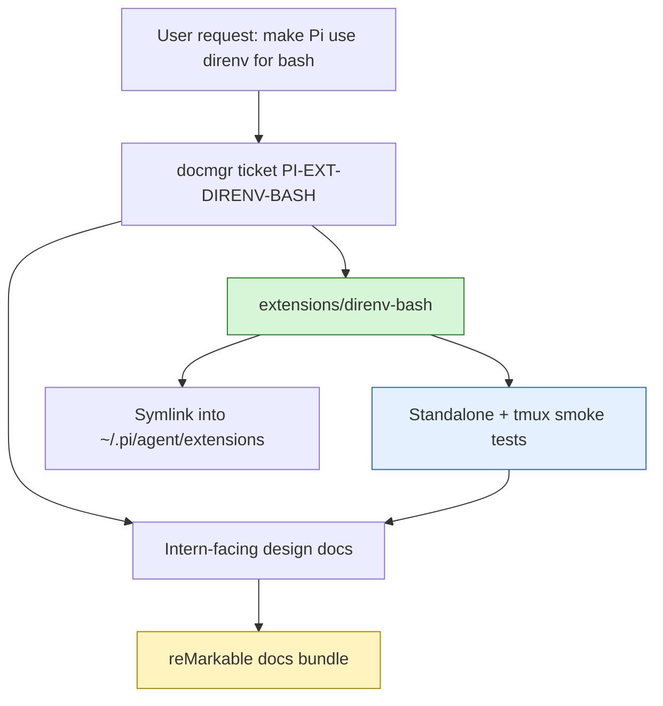
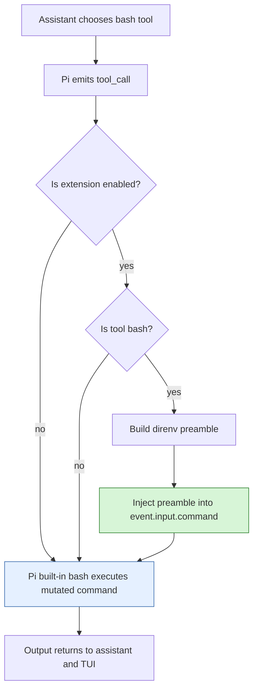
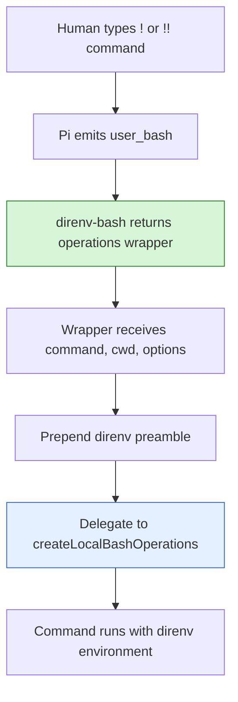
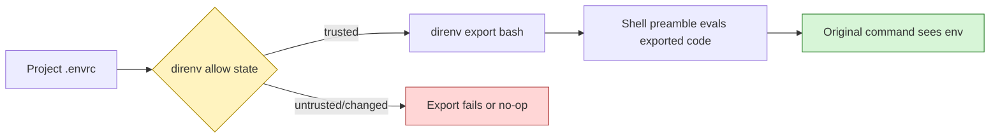

# Pi Extensions - Direnv Bash Extension

This project added a small but important Pi extension, `direnv-bash`, to make Pi's shell commands behave more like a developer's normal project shell. The extension loads the current directory's allowed `direnv` environment before Pi executes a `bash` tool call or a human-entered `!` / `!!` command.

> [!summary]
> The extension has three important identities:
> 1. a practical environment bridge between Pi and per-project `.envrc` files
> 2. a reference implementation for safe `bash` command mutation through Pi extension events
> 3. a documented example of using docmgr, tmux tests, and reMarkable upload as the development workflow for Pi extensions

## Why this project exists

Many local development projects do not rely only on globally installed tools. They use `.envrc` files to declare project-specific environment variables, add local bins to `PATH`, configure language runtimes, point commands at local services, or select caches and toolchains. In an interactive terminal, `direnv` makes that feel invisible: entering a directory loads the right environment, and leaving it unloads that environment.

Pi's `bash` tool runs commands from a working directory, but it does not automatically inherit the same shell integration that a human gets from their login shell. That means the model may run a perfectly reasonable command and still see confusing failures such as:

- `command not found`, even though the command works in the user's terminal;
- missing environment variables that are defined in `.envrc`;
- wrong language/runtime versions;
- project build tools not being on `PATH`;
- local development service URLs not being present.

The `direnv-bash` extension was built to close that gap. The goal was not to create a new shell runner. The goal was to preserve Pi's built-in bash behavior and add exactly one behavior before command execution: ask `direnv` what environment applies here, evaluate that environment in the shell, and then run the original command.

## Current project status

The extension is implemented, installed, tested, documented, and uploaded to reMarkable as part of docmgr ticket `PI-EXT-DIRENV-BASH`.

Current source files:

- `/home/manuel/code/wesen/2026-04-21--pi-extensions/extensions/direnv-bash/index.ts`
- `/home/manuel/code/wesen/2026-04-21--pi-extensions/extensions/direnv-bash/direnv.ts`
- `/home/manuel/code/wesen/2026-04-21--pi-extensions/extensions/direnv-bash/README.md`

Current ticket workspace:

- `/home/manuel/code/wesen/2026-04-21--pi-extensions/ttmp/2026/04/27/PI-EXT-DIRENV-BASH--pi-extension-to-load-direnv-for-bash-commands`

Current installation path:

- `~/.pi/agent/extensions/direnv-bash`
- symlink target: `/home/manuel/code/wesen/2026-04-21--pi-extensions/extensions/direnv-bash`

The extension has been validated in three ways:

1. Pi can load the extension through `-e ./extensions/direnv-bash`.
2. A standalone shell test proves that the `direnv export bash` / `eval` pattern loads an `.envrc` variable.
3. A tmux smoke test proves that Pi extension loading and the same direnv shell pattern work inside a tmux session.

## Project shape

The project has four layers:

1. **Pi extension entry point**
   - subscribes to `tool_call`, `user_bash`, `session_start`, and `turn_end`
   - registers slash commands
   - maintains in-memory extension state
2. **Direnv shell preamble helper**
   - generates the Bash preamble
   - injects it idempotently
   - provides internal self-tests
3. **Docmgr ticket documentation**
   - detailed design guide
   - implementation diary
   - tmux test playbook
   - ticket-local scripts
4. **Operational delivery**
   - symlink into Pi's extension directory
   - test in tmux
   - upload documentation bundle to reMarkable



## Architecture

At runtime, the extension does not replace Pi's built-in `bash` tool. This is the central design choice. Pi already has a mature bash tool implementation with output capture, timeouts, cancellation, process cleanup, rendering, and session integration. Reimplementing that would be risky and unnecessary.

Instead, the extension uses Pi's event system as middleware. When the assistant asks to run `bash`, Pi emits a `tool_call` event before the tool executes. Extensions may mutate the event's input. `direnv-bash` checks whether the event is a bash call, prepends a shell preamble, and lets Pi continue with the built-in tool.



Human-entered Pi shell commands are separate. When a user types `!make test` or `!!make test`, Pi emits `user_bash`. The extension handles that by returning a wrapper around `createLocalBashOperations()`.



## Implementation details

### The mental model

The extension is easiest to understand as a shell preamble injector.

A normal Pi bash command might be:

```bash
make test
```

The extension changes it into something shaped like this:

```bash
# PI_DIRENV_BASH_BEGIN v1
if command -v direnv >/dev/null 2>&1; then
  __pi_direnv_export="$(direnv export bash)"
  __pi_direnv_status=$?
  if [ $__pi_direnv_status -eq 0 ]; then
    eval "$__pi_direnv_export"
  else
    :
  fi
  unset __pi_direnv_export __pi_direnv_status
else
  :
fi
# PI_DIRENV_BASH_END v1
make test
```

The temporary variable `__pi_direnv_export` is created by the preamble itself. It is not provided by Pi or by direnv. It stores the Bash code printed by `direnv export bash`. The next line records the exit status. If the export succeeded, the preamble evaluates the captured shell code in the same shell process as the original command.

This same-shell detail is the key. Environment variables are process-local. If the extension ran `direnv export bash` in one process and then ran `make test` in another unrelated process, the environment changes would be lost. Capturing and evaluating the exported Bash code inside the command shell makes the subsequent command observe the environment.

### The helper module

The helper module lives at:

```text
extensions/direnv-bash/direnv.ts
```

It provides the pure functions:

```typescript
buildDirenvBashPreamble(options)
commandHasDirenvBashPreamble(command)
injectDirenvBashPreamble(command, preamble)
runInternalSelfTests()
```

This split is useful because the shell-generation logic can be reasoned about independently of Pi's runtime. The helper owns the fragile shell-string part of the implementation, while `index.ts` owns the Pi integration.

The most important function is:

```typescript
export function buildDirenvBashPreamble(options: DirenvBashOptions = {}): string {
  const stderrRedirect = options.quiet ? " 2>/dev/null" : "";
  const missingDirenv = options.strict
    ? "  echo 'direnv-bash: direnv not found on PATH' >&2\n  exit 127"
    : "  :";
  const failedExport = options.strict
    ? "  echo 'direnv-bash: direnv export bash failed' >&2\n  exit 1"
    : "  :";

  return [
    DIRENV_BASH_MARKER_BEGIN,
    "if command -v direnv >/dev/null 2>&1; then",
    `  __pi_direnv_export=\"$(direnv export bash${stderrRedirect})\"`,
    "  __pi_direnv_status=$?",
    "  if [ $__pi_direnv_status -eq 0 ]; then",
    "    eval \"$__pi_direnv_export\"",
    "  else",
    failedExport,
    "  fi",
    "  unset __pi_direnv_export __pi_direnv_status",
    "else",
    missingDirenv,
    "fi",
    DIRENV_BASH_MARKER_END,
  ].join("\n");
}
```

There are two interesting options.

`quiet` changes this line:

```bash
direnv export bash
```

into this:

```bash
direnv export bash 2>/dev/null
```

That matters because `direnv` may print status or warning messages. In some contexts, those messages are valuable. In other contexts, they add noise to the model's command output. The extension defaults to visible output and lets the user switch to quiet mode through `/direnv-bash quiet`.

`strict` changes missing or failing direnv behavior. In default mode, missing direnv is a no-op and the original command still runs. In strict mode, missing direnv exits with `127`, and a failed `direnv export bash` exits with `1`. This makes direnv loading a hard precondition.

### Idempotence markers

The helper also defines:

```typescript
export const DIRENV_BASH_MARKER_BEGIN = "# PI_DIRENV_BASH_BEGIN v1";
export const DIRENV_BASH_MARKER_END = "# PI_DIRENV_BASH_END v1";
```

These markers prevent double injection. The command injector checks whether both comments are already present:

```typescript
export function commandHasDirenvBashPreamble(command: string): boolean {
  return command.includes(DIRENV_BASH_MARKER_BEGIN) && command.includes(DIRENV_BASH_MARKER_END);
}

export function injectDirenvBashPreamble(command: string, preamble: string): string {
  if (commandHasDirenvBashPreamble(command)) return command;
  return `${preamble}\n${command}`;
}
```

This is defensive. In normal operation, a command should pass through the extension once. But extension systems can be reloaded, multiple handlers may be installed, or a future wrapper might call the injector twice. Idempotence markers make duplicate wrapping harmless.

### Pi tool-call integration

The entry point lives at:

```text
extensions/direnv-bash/index.ts
```

The core handler is small:

```typescript
pi.on("tool_call", async (event, ctx) => {
  if (!state.enabled) return;
  if (!isToolCallEventType("bash", event)) return;
  const preamble = buildDirenvBashPreamble(toOptions(state));
  const nextCommand = injectDirenvBashPreamble(event.input.command, preamble);
  if (nextCommand !== event.input.command) {
    event.input.command = nextCommand;
    recordInjection(ctx, state, event.toolCallId);
  }
});
```

There are three important API details here.

First, `tool_call` is the right stage. It fires after the assistant has produced a tool call but before Pi executes the tool. That gives the extension a chance to change arguments without taking over execution.

Second, `event.input` is intentionally mutable in Pi's extension API. Assigning to `event.input.command` changes the command that the built-in bash tool will run.

Third, `isToolCallEventType("bash", event)` is both a runtime check and a TypeScript narrowing helper. After it returns true, TypeScript knows that the event input has the bash shape and includes a `command` field.

### User bash integration

The `user_bash` handler handles shell commands typed by the human in Pi's editor:

```typescript
pi.on("user_bash", async (_event, ctx) => {
  if (!state.enabled) return;
  const ops = createLocalBashOperations();
  return {
    operations: {
      exec: (command, cwd, options) => {
        const nextCommand = injectDirenvBashPreamble(command, buildDirenvBashPreamble(toOptions(state)));
        if (nextCommand !== command) recordInjection(ctx, state, undefined);
        return ops.exec(nextCommand, cwd, options);
      },
    },
  };
});
```

The subtle point is that the extension wraps `createLocalBashOperations()` instead of implementing process execution. This keeps Pi's normal local bash backend. The wrapper is only responsible for changing the command string.

### State and commands

The extension keeps small in-memory state:

```typescript
interface DirenvBashState {
  enabled: boolean;
  quiet: boolean;
  strict: boolean;
  injectionCount: number;
  lastInjectionAt: string | undefined;
  lastToolCallId: string | undefined;
}
```

This is session-local configuration. The extension currently does not persist it across Pi restarts. That is acceptable for the first implementation because the defaults are safe and useful: enabled, not quiet, not strict.

The user-facing commands are:

| Command | Meaning |
|---|---|
| `/direnv-bash` | Show current state. |
| `/direnv-bash on` | Enable command wrapping. |
| `/direnv-bash off` | Disable command wrapping. |
| `/direnv-bash toggle` | Toggle wrapping. |
| `/direnv-bash quiet` | Hide `direnv export bash` stderr. |
| `/direnv-bash no-quiet` | Show `direnv export bash` stderr. |
| `/direnv-bash strict` | Fail when direnv is missing or export fails. |
| `/direnv-bash no-strict` | Return to best-effort behavior. |
| `/dbash` | Short alias for `/direnv-bash`. |
| `/direnv-bash-self-test` | Run internal and shell smoke tests. |

The footer status uses Pi's `ctx.ui.setStatus()`:

```text
direnv:on n=3
direnv:on(quiet) n=4
direnv:on(quiet,strict) n=5
direnv:off n=5
```

The `n=` value is an injection count. It is not a correctness guarantee, but it is a useful observability clue that commands are passing through the extension.

## Safety model

The most important safety decision was to use `direnv export bash`, not `source .envrc`.

This distinction matters. Directly sourcing `.envrc` would bypass direnv's trust gate. A changed or untrusted `.envrc` could execute as part of every Pi shell command. By contrast, `direnv export bash` preserves direnv's own `direnv allow` model. If the `.envrc` has not been allowed, or if it changed since being allowed, direnv refuses to export the environment.



The extension therefore changes the environment only to the extent that direnv says the environment is allowed and applicable.

There is still a practical caution: loading direnv can change command behavior. It can alter `PATH`, language runtime selection, Git-related variables, or service addresses. That is the point of the extension, but it also means debugging should include a quick comparison with `/direnv-bash off` when shell behavior looks surprising.

## Testing and validation

The testing strategy was deliberately layered.

### Extension load check

The first check loads the extension without asking a model to perform an LLM turn:

```bash
pi --no-session --no-extensions -e ./extensions/direnv-bash --list-models nonexistent-model-filter
```

The expected output is:

```text
No models matching "nonexistent-model-filter"
```

The useful part is the zero exit code. This proves Pi can import the extension, resolve its TypeScript files, and run the default factory without syntax/import errors.

### Standalone direnv shell check

The ticket-local script:

```text
ttmp/2026/04/27/PI-EXT-DIRENV-BASH--pi-extension-to-load-direnv-for-bash-commands/scripts/01-standalone-direnv-preamble-test.sh
```

creates a temporary directory, writes this `.envrc`:

```bash
export PI_DIRENV_BASH_TEST_VALUE="loaded-from-direnv"
```

then runs `direnv allow .`, evaluates the same shell pattern generated by the extension, and verifies that the variable is visible.

Observed success:

```text
PASS: direnv export bash loaded PI_DIRENV_BASH_TEST_VALUE=loaded-from-direnv
```

### Tmux smoke check

The ticket-local script:

```text
ttmp/2026/04/27/PI-EXT-DIRENV-BASH--pi-extension-to-load-direnv-for-bash-commands/scripts/02-tmux-pi-direnv-bash-smoke.sh
```

starts a tmux session and checks two things:

1. Pi can load the extension inside tmux.
2. The direnv export/eval pattern loads a variable inside the tmux pane.

Observed success:

```text
No models matching "no-such-model"
direnv: loading /tmp/tmp.fDcG2ixCxD/.envrc
direnv: export +PI_DIRENV_BASH_TEST_VALUE
TMUX_DIRENV_VALUE=loaded-inside-tmux

EXIT=0
PASS: pi loaded extensions/direnv-bash and direnv exported env inside tmux
```

The tmux test is useful because Pi's philosophy encourages using tmux for observable shell workflows. It also catches terminal/session assumptions that a plain shell script may miss.

## Documentation and delivery workflow

This implementation was not just code. It also followed the repository's docmgr-centered workflow.

Created ticket:

```text
PI-EXT-DIRENV-BASH — Pi extension to load direnv for bash commands
```

Important ticket documents:

- `design/01-analysis-design-and-implementation-guide.md`
- `reference/01-investigation-diary.md`
- `playbook/01-tmux-test-playbook.md`

The design document is written as an intern-facing implementation guide. It explains Pi's extension events, the direnv shell model, the exact runtime flow, safety decisions, validation strategy, and future work.

The diary records the chronological work:

- ticket creation;
- Pi extension API review;
- implementation;
- load validation;
- ticket script creation;
- standalone and tmux tests;
- installation symlink;
- reMarkable upload.

The playbook preserves the exact commands needed to re-run validation.

The docs were uploaded to reMarkable as a bundled PDF:

```text
/ai/2026/04/27/PI-EXT-DIRENV-BASH/PI-EXT-DIRENV-BASH docs
```

## Current user-facing workflow

To install or refresh the extension:

```bash
mkdir -p ~/.pi/agent/extensions
ln -sfn /home/manuel/code/wesen/2026-04-21--pi-extensions/extensions/direnv-bash ~/.pi/agent/extensions/direnv-bash
```

In an existing Pi session:

```text
/reload
```

To inspect state:

```text
/direnv-bash
```

To silence direnv messages:

```text
/direnv-bash quiet
```

To require direnv to load successfully:

```text
/direnv-bash strict
```

To debug a suspicious command without the extension:

```text
/direnv-bash off
```

Then re-enable:

```text
/direnv-bash on
```

## Important project docs

Primary docmgr ticket:

- `/home/manuel/code/wesen/2026-04-21--pi-extensions/ttmp/2026/04/27/PI-EXT-DIRENV-BASH--pi-extension-to-load-direnv-for-bash-commands`

Primary implementation guide:

- `/home/manuel/code/wesen/2026-04-21--pi-extensions/ttmp/2026/04/27/PI-EXT-DIRENV-BASH--pi-extension-to-load-direnv-for-bash-commands/design/01-analysis-design-and-implementation-guide.md`

Investigation diary:

- `/home/manuel/code/wesen/2026-04-21--pi-extensions/ttmp/2026/04/27/PI-EXT-DIRENV-BASH--pi-extension-to-load-direnv-for-bash-commands/reference/01-investigation-diary.md`

Tmux test playbook:

- `/home/manuel/code/wesen/2026-04-21--pi-extensions/ttmp/2026/04/27/PI-EXT-DIRENV-BASH--pi-extension-to-load-direnv-for-bash-commands/playbook/01-tmux-test-playbook.md`

Upstream Pi extension docs used during implementation:

- `/home/manuel/.nvm/versions/node/v22.22.1/lib/node_modules/@mariozechner/pi-coding-agent/docs/extensions.md`

## Open questions

There are a few useful follow-up questions, but none block the current extension.

Should the extension persist settings across reloads? Right now, `enabled`, `quiet`, and `strict` are in-memory session state. Persisting them would make sense if `quiet` or `strict` becomes a stable user preference.

Should there be a `/direnv-status` command? A command that runs `direnv status` in `ctx.cwd` would make debugging easier and would give the user a direct way to inspect why a variable is missing.

Should the extension expose the generated preamble? For debugging shell quoting or strict/quiet behavior, a `/direnv-bash-preamble` command could print the exact current preamble.

Should tests include a real LLM-triggered bash tool call? The current tests avoid model cost and model availability. A more integrated test could run Pi with a cheap/local model and ask it to call `bash`, but that would be less deterministic than the current extension-load and shell-semantics tests.

## KB reviews

- [[KB-BATCH14-pi-extensions-tooling]] (2026-05-11) — Batch K Pi extension/tooling review; created [[Tribal/pi-extension-event-seams]] and advanced Pi TUI/model-config candidates.

## Related KB entries

- [[On-Ramp/pi-extension-authoring-mental-model]] — 10-minute orientation to Pi extension lifecycle, events, tools, UI surfaces, and state scopes.
- [[Tribal/pi-extension-event-seams]] — Pi lifecycle/event seams, prompt shaping, tool-call mutation, TUI surfaces, and model/config integration discipline.
- [[Fundamentals/host-mediated-sandbox-principles]] — the host/runtime boundary principle behind narrow extension capabilities and mediated side effects.

## Near-term next steps

1. Run `/reload` in existing Pi sessions so the symlinked extension is active.
2. Use the extension in a real project with an existing `.envrc` and verify that Pi command behavior matches the human shell.
3. Add `/direnv-status` if missing-variable debugging becomes common.
4. Consider persisting settings if `quiet` or `strict` becomes a preferred default.
5. Keep the ticket playbook updated when Pi extension APIs or test commands change.

## Project working rule

Do not make Pi source `.envrc` directly. The extension should continue to use `direnv export bash` so it preserves direnv's trust model. The correct abstraction is: let direnv decide what environment is allowed, then evaluate only the shell code direnv emits for the current directory.
