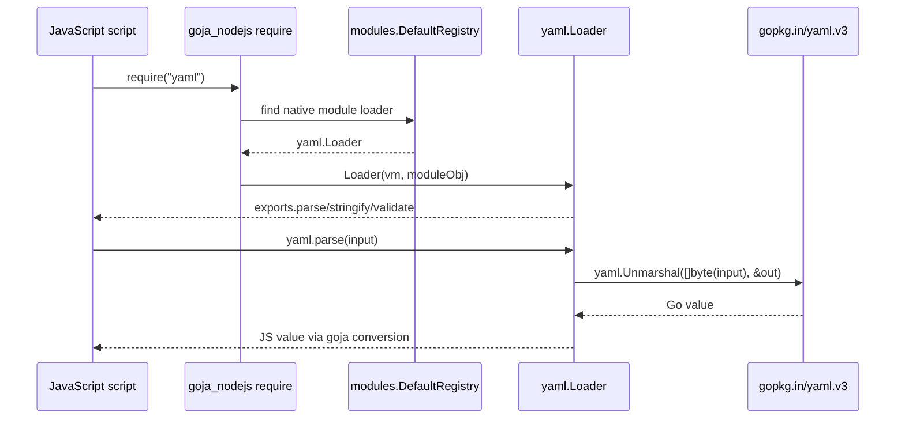

# go-go-goja YAML and Run Support

This report describes a small but important usability pass over `go-go-goja`: the runtime learned how to read and write YAML as a built-in JavaScript primitive, and the `goja-repl` CLI learned how to run a JavaScript file directly with `goja-repl run <file>`. These two changes belong together. YAML support gives scripts a practical data format for configuration and automation; the `run` verb gives those scripts a direct way to execute without first creating a persistent REPL session.

> [!summary]
> The work turned go-go-goja from an interactive runtime with useful native modules into a more scriptable tool.
> 1. `require("yaml")` now exposes `parse`, `stringify`, and `validate`.
> 2. `goja-repl run ./testdata/yaml.js` now executes a file in a fresh runtime.
> 3. The implementation clarified an important rule: touch the goja VM through the runtime owner, not by casual direct access.

## Why this project exists

A JavaScript runtime becomes useful when it can talk to the world around it. Before this work, `go-go-goja` already had the right architectural ingredients: a module registry, native Go modules exposed through Node-style `require`, an owned runtime built by `engine.Factory`, and a Glazed-powered CLI called `goja-repl`. What was missing was a clean path from a file on disk to a complete script execution.

The motivating example was simple: after adding a native YAML module, there was a new example script at `testdata/yaml.js`. But there was no natural command to run it. The existing `eval` command required a persistent session ID:

```bash
goja-repl create
goja-repl eval --session-id <id> --source "$(cat testdata/yaml.js)"
```

That workflow is correct for persisted REPL sessions, but wrong for a one-shot script. A file runner should have the shape that users expect:

```bash
goja-repl run ./testdata/yaml.js
```

The project therefore had two related goals. First, make YAML a first-class primitive module. Second, make JavaScript files executable without ceremony.

## Current project status

The implementation is complete on the working branch as of 2026-04-27.

Implemented:

- `modules/yaml/yaml.go`
  - `yaml.parse(input)`
  - `yaml.stringify(value, options?)`
  - `yaml.validate(input)`
  - TypeScript declaration metadata via `modules.TypeScriptDeclarer`
- `engine/runtime.go`
  - blank import for `modules/yaml`, so `init()` registration runs by default
- `modules/yaml/yaml_test.go`
  - integration tests through real go-go-goja runtimes
- `testdata/yaml.js`
  - runnable example script
- `pkg/doc/16-yaml-module.md`
  - Glazed help entry for the module
- `cmd/goja-repl/cmd_run.go`
  - new `goja-repl run <file>` command
- `cmd/goja-repl/root.go`
  - run command registration
- `cmd/goja-repl/root_test.go`
  - run command tests and helper-level error tests
- `README.md` and `pkg/doc/04-repl-usage.md`
  - user-facing run and YAML examples

Validation performed:

```bash
go test ./cmd/goja-repl/... ./modules/yaml/... -count=1
make lint
go run ./cmd/goja-repl run ./testdata/yaml.js
```

The final manual command prints the YAML example checks and ends with `OK`.

## Project shape

There are three layers in the work:

1. **A runtime primitive** — the YAML module lives in `modules/yaml` and is registered into the default native-module registry.
2. **A script execution command** — `goja-repl run` reads a file, creates a fresh runtime, and executes the script through the runtime owner.
3. **Documentation and examples** — help pages, README snippets, and `testdata/yaml.js` make the new features discoverable.

```mermaid
flowchart TD
    User[User] --> CLI[goja-repl run file.js]
    CLI --> ReadFile[Read JavaScript file]
    ReadFile --> Builder[engine.NewBuilder]
    Builder --> Modules[DefaultRegistryModules]
    Modules --> YAML[require("yaml") module]
    Builder --> Roots[Module roots from script path]
    Builder --> Plugins[Optional plugin setup]
    Builder --> Runtime[Factory.NewRuntime]
    Runtime --> Owner[rt.Owner.Call]
    Owner --> VM[goja Runtime]
    VM --> Script[Script executes]
    Script --> Console[console.log output]

    style YAML fill:#f8e9a1,stroke:#444
    style Owner fill:#c7e9ff,stroke:#444
    style VM fill:#d5f5d5,stroke:#444
```

The key point is that the user-facing command is small, but it passes through several important boundaries. It is not merely `os.ReadFile` followed by anonymous source evaluation. It has to respect module registration, module-root resolution, plugin setup, runtime ownership, entry-file module context, and cleanup.

## Architecture

### The native module pattern

A go-go-goja native module implements this interface from `modules/common.go`:

```go
type NativeModule interface {
    Name() string
    Doc() string
    Loader(*goja.Runtime, *goja.Object)
}
```

This interface is deliberately small. `Name` defines the string passed to `require`. `Doc` gives the runtime and help tooling a human-readable description. `Loader` is the bridge: it receives a goja runtime and a CommonJS-like module object, then attaches functions to `module.exports`.

The YAML module follows the same pattern as `fs`, `exec`, `timer`, and `database`:

```go
type m struct{}

var _ modules.NativeModule = (*m)(nil)
var _ modules.TypeScriptDeclarer = (*m)(nil)

func (m) Name() string { return "yaml" }

func init() {
    modules.Register(&m{})
}
```

The `init()` function matters. It places the module into `modules.DefaultRegistry`. The module still needs to be imported somewhere so that Go runs `init()`. That is why `engine/runtime.go` has blank imports for default modules.

### YAML execution path

When JavaScript calls:

```javascript
const yaml = require("yaml");
const config = yaml.parse("name: goja");
```

this is the path through the system:



The most important design choice is that the module returns plain Go values. goja already knows how to convert ordinary Go values into JavaScript values. A `map[string]any` becomes a JS object, a `[]any` becomes an array, a `string` becomes a string, and numeric values become JS numbers.

### The run command path

The `run` command is intentionally not built on `replapi.App.Evaluate`. That API is for sessions. A session has an ID, persistence policy, optional SQLite backing store, history, bindings, and restore behavior. A file runner has a simpler contract: run this file once and exit.

The final implementation therefore uses a pure helper:

```go
type runScriptOptions struct {
    File               string
    PluginDirs         []string
    AllowPluginModules []string
    UseModuleRoots     bool
}

func runScriptFile(ctx context.Context, opts runScriptOptions) error
```

The Glazed command is a thin adapter. It decodes the `file` argument and forwards root-level plugin flags into `runScriptFile`.

```go
func (c *runCommand) Run(ctx context.Context, vals *values.Values) error {
    settings := runSettings{}
    if err := vals.DecodeSectionInto(schema.DefaultSlug, &settings); err != nil {
        return err
    }

    opts := runScriptOptions{
        File:           settings.File,
        UseModuleRoots: true,
    }
    if c.opts != nil {
        opts.PluginDirs = c.opts.PluginDirs
        opts.AllowPluginModules = c.opts.AllowPluginModules
    }
    return runScriptFile(ctx, opts)
}
```

This shape is worth preserving. The command adapter knows about Glazed. The helper knows about script execution. That separation makes the core behavior testable without depending on Cobra's error handling.

## Implementation details

### YAML module API

The YAML module exposes three functions.

```javascript
yaml.parse(input)                 // string -> any, throws on parse error
yaml.stringify(value, options?)   // any -> string, throws on invalid options or marshal error
yaml.validate(input)              // string -> { valid: boolean, errors?: string[] }
```

`parse` is the simplest function. It unmarshals YAML text into an `any`:

```go
modules.SetExport(exports, mod.Name(), "parse", func(input string) (any, error) {
    var out any
    if err := yaml.Unmarshal([]byte(input), &out); err != nil {
        return nil, fmt.Errorf("yaml.parse: %w", err)
    }
    return out, nil
})
```

The important idea is not the call to `yaml.Unmarshal`; it is the contract around errors. Returning `(any, error)` lets goja turn Go errors into JavaScript exceptions. That means JavaScript users can write normal code:

```javascript
try {
  yaml.parse("[bad");
} catch (e) {
  console.error(e.message);
}
```

`stringify` is slightly more interesting because it has an option object. JavaScript numbers can arrive in Go as several concrete numeric types, so the code accepts `int`, `int64`, and `float64` for `indent`. It also rejects unknown options. That is intentionally stricter than silently ignoring misspellings.

```go
if v, ok := options["indent"]; ok {
    switch n := v.(type) {
    case int64:
        indent = int(n)
    case int:
        indent = n
    case float64:
        indent = int(n)
    default:
        return "", fmt.Errorf("yaml.stringify: indent must be a number, got %T", v)
    }
    if indent < 0 {
        return "", fmt.Errorf("yaml.stringify: indent must be >= 0")
    }
}
```

`validate` has a different contract. It does not throw. It returns a small result object:

```javascript
{ valid: true }
{ valid: false, errors: ["..."] }
```

This is useful because validation often lives in control flow rather than exception flow. If a command reads a user-provided YAML file, it can validate and print friendly messages without aborting through a catch block.

### TypeScript declarations

The YAML module implements `modules.TypeScriptDeclarer`. This is the bridge to `cmd/gen-dts` and any generated TypeScript declarations.

```go
func (m) TypeScriptModule() *spec.Module {
    return &spec.Module{
        Name: "yaml",
        Functions: []spec.Function{ ... },
    }
}
```

This matters because native modules are otherwise invisible to TypeScript tooling. Without a descriptor, a JavaScript author can still call `require("yaml")`, but editors and generated `.d.ts` files cannot explain what `parse`, `stringify`, and `validate` do.

### Why `rt.Owner.Call` matters

The final `run` command does not call `rt.VM.RunString` directly. It uses:

```go
_, err = rt.Owner.Call(ctx, "goja-repl.run", func(_ context.Context, vm *goja.Runtime) (any, error) {
    _ = vm
    return rt.Require.Require(scriptPath)
})
```

This is a subtle but important correction. A goja runtime should be treated as owned by its runtime loop. Some simple scripts work if the CLI goroutine calls `rt.VM.RunString` directly, but that is not the discipline the rest of the runtime is built around. Modules such as `timer` and infrastructure such as `runtimebridge` assume that VM-touching work happens through the owner path.

A good mental model is this:

```text
Bad shortcut:
  CLI goroutine -> rt.VM.RunString(anonymous source)

Preferred path:
  CLI goroutine -> rt.Owner.Call(...) -> owner/event-loop goroutine -> require(abs(entry.js))
```

The second path is a little more verbose, but it keeps runtime access serialized and gives errors an operation label: `goja-repl.run`.

### Why the `--profile` flag was removed

The first spike added a `--profile` flag, but the flag did nothing. That is worse than no flag. A command-line flag is a promise. If a user writes:

```bash
goja-repl run --profile raw script.js
```

then the command must mean something different from:

```bash
goja-repl run --profile interactive script.js
```

The final MVP removes the flag. The current `run` command has one clear meaning: create a fresh runtime and run the file. Future work can reintroduce profile-like behavior, but only after deciding whether that means raw goja execution, replsession evaluation with top-level await support, binding capture, persistence, or some other concrete behavior.

## The example script

`testdata/yaml.js` is both documentation and a smoke test. It demonstrates the complete path from file execution to native module usage:

```javascript
const yaml = require("yaml");

const config = yaml.parse(`
name: go-go-goja
version: 1.0
features:
  - repl
  - modules
  - plugins
`);

const manifestYaml = yaml.stringify({
  service: "api-gateway",
  port: 8080,
  tls: true,
});

const invalidResult = yaml.validate("[bad");
```

Running it exercises two independent features at once:

```bash
go run ./cmd/goja-repl run ./testdata/yaml.js
```

The command proves that:

- `goja-repl run` can read and execute a file.
- `engine.DefaultRegistryModules()` includes the YAML module.
- `require("yaml")` resolves.
- `parse`, `stringify`, and `validate` work from JavaScript.

## What went wrong during implementation

The interesting part of this project was not the YAML parser. The parser is mostly a thin adapter over `gopkg.in/yaml.v3`. The interesting part was recognizing the difference between a working spike and a correct runtime command.

The first `run` attempt looked plausible. It used Glazed, read a file, built a runtime, and ran the script. It even passed a manual test. But it had three design smells:

1. It advertised `--profile` without implementing profile semantics.
2. It called the VM directly instead of through the runtime owner.
3. It wrote negative tests through Cobra/Glazed error paths, which turned out to be brittle.

The fix was to split the implementation into two layers. The helper owns execution. The Glazed command owns decoding. Tests for file-not-found and syntax errors call the helper directly. The Cobra-level test only checks that the command is wired and can execute a simple script.

This is a useful lesson beyond go-go-goja. Command implementations often become easier to test when the parser is not the unit under test. A command should parse, validate, and delegate.

## Important project docs

Two docmgr tickets captured the work:

- `/home/manuel/code/wesen/go-go-golems/go-go-goja/ttmp/2026/04/27/GOJA-053--add-yaml-primitive-support-to-go-go-goja/`
  - YAML design doc, diary, changelog, and reMarkable delivery
- `/home/manuel/code/wesen/go-go-golems/go-go-goja/ttmp/2026/04/27/GOJA-054--add-run-verb-to-goja-repl-for-direct-script-execution/`
  - run-verb design doc, big-brother implementation review, diary, changelog, and reMarkable delivery

Important code files:

- `/home/manuel/code/wesen/go-go-golems/go-go-goja/modules/yaml/yaml.go`
- `/home/manuel/code/wesen/go-go-golems/go-go-goja/modules/yaml/yaml_test.go`
- `/home/manuel/code/wesen/go-go-golems/go-go-goja/testdata/yaml.js`
- `/home/manuel/code/wesen/go-go-golems/go-go-goja/cmd/goja-repl/cmd_run.go`
- `/home/manuel/code/wesen/go-go-golems/go-go-goja/cmd/goja-repl/root.go`
- `/home/manuel/code/wesen/go-go-golems/go-go-goja/cmd/goja-repl/root_test.go`
- `/home/manuel/code/wesen/go-go-golems/go-go-goja/pkg/doc/16-yaml-module.md`
- `/home/manuel/code/wesen/go-go-golems/go-go-goja/pkg/doc/04-repl-usage.md`

Key commits:

- `6ed22e9` — `feat(modules): add yaml primitive support (enabled by default)`
- `77b781b` — `docs(yaml): add example script, glazed help entry, and REPL usage docs`
- `4d85a9b` — `feat(cmd/goja-repl): add run verb for script files`
- `ab3f823` — `docs(GOJA-054): review run command implementation attempt`
- `66042a4` — `docs(GOJA-054): record run verb implementation`

## Open questions

### Should `run` support top-level await?

The current implementation loads the file through `rt.Require.Require(scriptPath)` on the runtime owner. That preserves CommonJS entry-file context and relative requires, but it does not reuse the replsession promise-waiting machinery. Future work is still needed if `run` should behave like a modern script runner where top-level await is a first-class feature.

A future design should decide whether this is in scope:

```javascript
await require("timer").sleep(100);
console.log("done");
```

If it is, `run` should probably share evaluation logic with `replsession`, including timeouts and promise handling.

### Should `run` expose script arguments?

Users will eventually expect:

```bash
goja-repl run script.js -- input.yaml output.yaml
```

That requires a small JavaScript-side convention. Options include `globalThis.argv`, a `process.argv` compatibility object, or a small `args` native module. This was intentionally deferred.

### Should console output be redirectable?

In tests, `root.SetOut(out)` does not capture JavaScript `console.log` output. For a human CLI, direct process output is fine. For embedding and tests, redirectable output would be better. This requires a deliberate console integration story rather than accidental dependence on the current default console sink.

## Near-term next steps

- Add `goja-repl run -` for stdin scripts.
- Add script argument passing.
- Decide whether top-level await belongs in `run` MVP v2.
- Decide whether to expose `__filename`, `__dirname`, or a `process` compatibility object.
- Add a small `run` help page if the command grows beyond the short README/REPL usage examples.

## Project working rule

The working rule that emerged from this project is simple:

> A go-go-goja command should parse at the edge, delegate to a testable helper, and touch the JavaScript VM only through the runtime owner.

That rule would have prevented most of the false starts in the first `run` spike. It is also a good default for future commands that execute JavaScript outside the interactive REPL.
