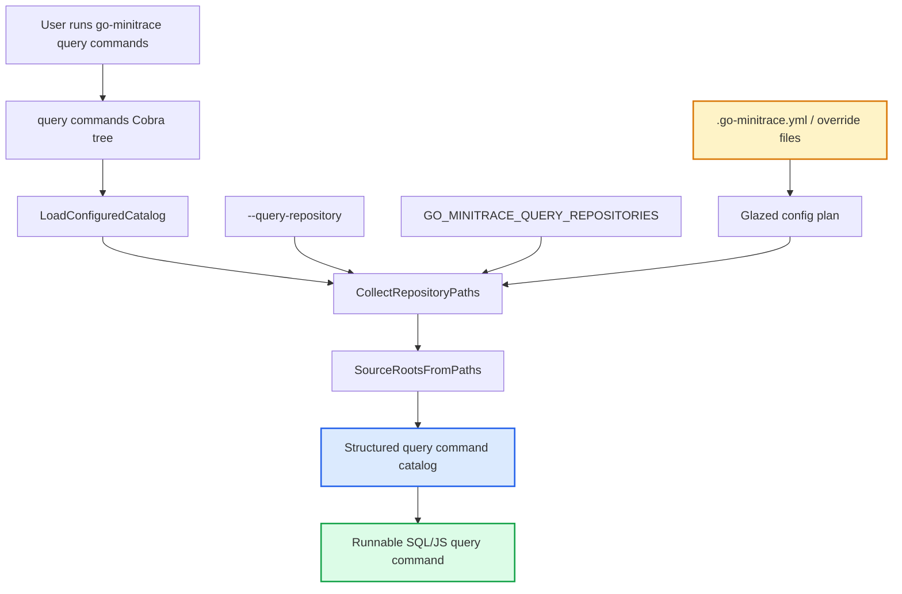

# go-minitrace Local Query Repository Config

This project slice added Pinocchio-style local query repository discovery to `go-minitrace`. The immediate trigger was the Pyxis CSS visual diff trace-analysis work: the custom `pyxis trace-summary ...` JS verbs worked, but every command had to repeat a long `--query-repository` flag unless the caller remembered to export an environment variable.

> [!summary]
> `go-minitrace` can now discover query command repositories from `.go-minitrace.yml` and `.go-minitrace.override.yml` files at the git root and current working directory.
> Relative `queryRepositories` entries are resolved relative to the config file directory, so project-local command catalogs are portable across subdirectories.
> The implementation was committed as `2ef62bc412c749f668a70e7c30a51da3e2c78568` and validated by `go test ./...` plus `golangci-lint` via the repo pre-commit hook.

## Why this project exists

`go-minitrace` has two query modes:

- ad-hoc DuckDB queries via `go-minitrace query duckdb`
- reusable structured commands via `go-minitrace query commands`

The structured command system is especially useful for trace-analysis projects because the command definitions can live next to the ticket or investigation that produced them. In the Pyxis CSS visual diff analysis, the query repository lived here:

```text
/home/manuel/code/wesen/trace-analysis/ttmp/2026/04/27/2026-04-27--css-visual-diff-workflow-analysis-pyxis/query-commands
```

Before this change, `go-minitrace` could load that repository through:

```bash
go-minitrace query commands \
  --query-repository /path/to/query-commands \
  pyxis trace-summary cssvd-summary \
  --archive-glob './analysis/pyxis/active/*/*.minitrace.json'
```

or by setting:

```bash
export GO_MINITRACE_QUERY_REPOSITORIES=/path/to/query-commands
```

That worked, but it was easy to forget. The desired workflow was closer to Pinocchio's local repository configuration: a project should be able to declare its own command repositories in a checked-in local config file.

## Current project status

The change is implemented and committed in `go-minitrace`:

```text
2ef62bc412c749f668a70e7c30a51da3e2c78568 Add local query repository config discovery
```

Committed files:

```text
cmd/go-minitrace/cmds/query/commands_test.go
pkg/doc/structured-query-commands.md
pkg/minitracecmd/repositories.go
pkg/minitracecmd/repositories_test.go
```

The relevant docs and implementation diary for the triggering analysis live in:

```text
/home/manuel/code/wesen/trace-analysis/ttmp/2026/04/27/2026-04-27--css-visual-diff-workflow-analysis-pyxis/design-doc/02-configuring-go-minitrace-query-repositories.md
/home/manuel/code/wesen/trace-analysis/ttmp/2026/04/27/2026-04-27--css-visual-diff-workflow-analysis-pyxis/reference/01-investigation-diary.md
```

There was pre-existing unrelated dirty state in the `go-minitrace` checkout, including README edits and deleted screenshots. The commit intentionally staged only the four implementation/doc files listed above.

## Project shape

The project has three main concerns:

1. **Repository discovery**
   - collect query repository paths from flags, environment, app config, local config, and embedded defaults
2. **Config layering**
   - reuse Glazed config plan layers for system, user, git-root, and current-working-directory files
3. **Command catalog construction**
   - load external query repositories before the embedded catalog so project commands can override built-ins

The resulting discovery chain is:

```text
--query-repository flags
  -> GO_MINITRACE_QUERY_REPOSITORIES
  -> config files with queryRepositories
       /etc/go-minitrace/config.yaml
       ~/.go-minitrace/config.yaml
       $XDG_CONFIG_HOME/go-minitrace/config.yaml
       <git-root>/.go-minitrace.yml
       <git-root>/.go-minitrace.override.yml
       <cwd>/.go-minitrace.yml
       <cwd>/.go-minitrace.override.yml
  -> embedded query catalog
```

## Architecture



The important mental model is that repository discovery happens before Cobra can expose the custom query commands. If a query repository is not known while `NewCommandsCommand` builds the command tree, then its commands do not exist from Cobra's perspective.

## Implementation details

### Core files

The implementation is centered in:

```text
/home/manuel/code/wesen/corporate-headquarters/go-minitrace/pkg/minitracecmd/repositories.go
```

The command tree uses it here:

```text
/home/manuel/code/wesen/corporate-headquarters/go-minitrace/cmd/go-minitrace/cmds/query/commands.go
```

The new tests live in:

```text
/home/manuel/code/wesen/corporate-headquarters/go-minitrace/pkg/minitracecmd/repositories_test.go
/home/manuel/code/wesen/corporate-headquarters/go-minitrace/cmd/go-minitrace/cmds/query/commands_test.go
```

### Config file names

The change added two local config filename constants:

```go
const (
    LocalOverrideFileName        = ".go-minitrace.yml"
    LocalProjectOverrideFileName = ".go-minitrace.override.yml"
)
```

The names intentionally mirror Pinocchio's pattern:

```text
.pinocchio.yml
.pinocchio.override.yml
```

but are scoped to `go-minitrace`.

### Config plan extension

Before this change, `go-minitrace` used only system and user config layers:

```go
glazedconfig.WithLayerOrder(
    glazedconfig.LayerSystem,
    glazedconfig.LayerUser,
)
```

After the change, it uses:

```go
glazedconfig.WithLayerOrder(
    glazedconfig.LayerSystem,
    glazedconfig.LayerUser,
    glazedconfig.LayerRepo,
    glazedconfig.LayerCWD,
)
```

and adds local sources:

```go
glazedconfig.GitRootFile(LocalOverrideFileName)
glazedconfig.GitRootFile(LocalProjectOverrideFileName)
glazedconfig.WorkingDirFile(LocalOverrideFileName)
glazedconfig.WorkingDirFile(LocalProjectOverrideFileName)
```

This is the same conceptual pattern Pinocchio uses for local profile/repository overlays.

### Path resolution

The most important correctness detail is path resolution. A local config file like:

```yaml
queryRepositories:
  - ./query-commands
```

should resolve relative to the file that declared it. If the file is:

```text
/home/manuel/code/wesen/trace-analysis/.go-minitrace.yml
```

then `./query-commands` should mean:

```text
/home/manuel/code/wesen/trace-analysis/query-commands
```

not:

```text
<whatever directory the user ran go-minitrace from>/query-commands
```

The implementation therefore routes config-loaded paths through a helper equivalent to:

```go
func normalizeRepositoryPathsRelativeTo(paths []string, baseDir string) []string {
    return normalizeRepositoryPathsWithBase(paths, strings.TrimSpace(baseDir))
}
```

and applies the base directory only to plain relative paths:

```go
func shouldResolveRelativeToConfig(path string) bool {
    if filepath.IsAbs(path) {
        return false
    }
    return !strings.HasPrefix(path, "$") && !strings.HasPrefix(path, "~")
}
```

This preserves `$HOME/...` and `~/...` as special user-facing path forms while making ordinary `./query-commands` project-local.

### Merge semantics

The implementation keeps the existing `go-minitrace` replacement semantics for config files.

That means if a higher-layer config file contains `queryRepositories`, it replaces the lower-layer config-derived list. For example:

```text
<git-root>/.go-minitrace.yml
  queryRepositories:
    - ./shared-query-commands

<cwd>/.go-minitrace.override.yml
  queryRepositories:
    - ./private-query-commands
```

The effective config-derived repository list is:

```text
<cwd>/private-query-commands
```

not both lists appended together.

However, CLI flags and environment repositories are still prepended ahead of config-derived repositories:

```text
flags > env > config-derived repositories > embedded catalog
```

This was the least disruptive behavior because it preserves the previous `loadAppConfigFromPaths` contract.

## Current user-facing behavior

A project can now add:

```yaml
# .go-minitrace.yml
queryRepositories:
  - ./query-commands
```

Then, from that repo or any subdirectory inside it:

```bash
go-minitrace query commands pyxis trace-summary cssvd-summary \
  --archive-glob '/absolute/path/to/analysis/active/*/*.minitrace.json' \
  --output json
```

No `--query-repository` flag is required.

The trace-analysis repo was tested with:

```yaml
queryRepositories:
  - ./ttmp/2026/04/27/2026-04-27--css-visual-diff-workflow-analysis-pyxis/query-commands
```

and the Pyxis command resolved correctly from both the repo root and a nested ticket directory.

## Validation

The commit was created through the repo's normal pre-commit hook, which ran:

```bash
go test ./...
golangci-lint run -v
```

Both passed.

A targeted validation before committing also passed:

```bash
go test ./pkg/minitracecmd ./cmd/go-minitrace/cmds/query
```

Manual smoke validation used a temporary git repository with a `.go-minitrace.yml` pointing at the Pyxis query commands. A temporary `go-minitrace` binary successfully ran:

```bash
go-minitrace query commands pyxis trace-summary cssvd-summary \
  --archive-glob /home/manuel/code/wesen/trace-analysis/analysis/pyxis/active/*/*.minitrace.json \
  --output json
```

## Failure modes and tricky details

### `--archive-glob` is not query repository config

The local config file only tells `go-minitrace` where command definitions live. It does not define which archive should be queried.

This is still required:

```bash
--archive-glob './analysis/pyxis/active/*/*.minitrace.json'
```

When running from nested directories, prefer an absolute archive glob.

### `unknown flag: --archive-glob` usually means the command path is wrong

If `--archive-glob` is reported as unknown, it often means the caller stopped at an intermediate command group instead of the runnable leaf. For a multi-verb JS file such as:

```text
query-commands/pyxis/trace-summary.js
```

with a verb named `cssvd-summary`, the CLI path is:

```text
go-minitrace query commands pyxis trace-summary cssvd-summary
```

not:

```text
go-minitrace query commands pyxis cssvd-summary
```

### Replacement semantics are deliberate but worth revisiting

Current behavior is simple and compatible with existing tests, but it differs from an append/dedupe mental model. If future users expect user-global repositories and project-local repositories to accumulate, the merge semantics may need to change.

## Relationship to Pinocchio

Pinocchio already had a richer local configuration system. Its relevant paths are:

```text
/home/manuel/code/wesen/corporate-headquarters/pinocchio/pkg/cmds/profilebootstrap/profile_selection.go
/home/manuel/code/wesen/corporate-headquarters/pinocchio/pkg/configdoc/types.go
```

The `go-minitrace` change copies the same high-level idea:

```text
system config
  -> user config
  -> git-root local config
  -> cwd local config
```

but keeps a smaller config document shape:

```yaml
queryRepositories:
  - ./query-commands
```

Pinocchio uses a broader unified document with `app.repositories`, profile selection, registries, and inline profiles. `go-minitrace` only needed query repository discovery.

## Important project docs

The implementation and design were documented during the Pyxis trace-analysis ticket:

- `/home/manuel/code/wesen/trace-analysis/ttmp/2026/04/27/2026-04-27--css-visual-diff-workflow-analysis-pyxis/design-doc/02-configuring-go-minitrace-query-repositories.md`
- `/home/manuel/code/wesen/trace-analysis/ttmp/2026/04/27/2026-04-27--css-visual-diff-workflow-analysis-pyxis/reference/01-investigation-diary.md`

The embedded `go-minitrace` documentation was updated here:

- `/home/manuel/code/wesen/corporate-headquarters/go-minitrace/pkg/doc/structured-query-commands.md`

The reusable Pi skill was updated here:

- `/home/manuel/.pi/agent/skills/go-minitrace-transcript-analysis/SKILL.md`

## Open questions

- Should config-derived repository lists remain replacement-based, or should they become append/dedupe like Pinocchio's `app.repositories` behavior?
- Should `~` paths be expanded in `SourceRootsFromPaths`, or intentionally left for the shell/user to avoid ambiguity?
- Should there be a `go-minitrace config explain` command showing exactly which config files and repository roots were loaded?
- Should project-local `.go-minitrace.override.yml` be recommended as gitignored by convention?

## Near-term next steps

- Add `.go-minitrace.yml` to trace-analysis if the local Pyxis query commands should remain discoverable by default.
- Consider a small `go-minitrace config explain` follow-up to make repository discovery observable.
- Decide whether replacement semantics are sufficient after using local config in a few real trace-analysis repos.
- If duplicates in reMarkable matter, clean up the duplicate uploaded `go-minitrace Query Repository Configuration Guide` entry from the Pyxis ticket folder.

## Project working rule

> [!important]
> When adding project-local config discovery to a CLI, test both the repo root and a nested subdirectory.
> The root test proves discovery works; the nested test proves relative config paths are interpreted correctly.
