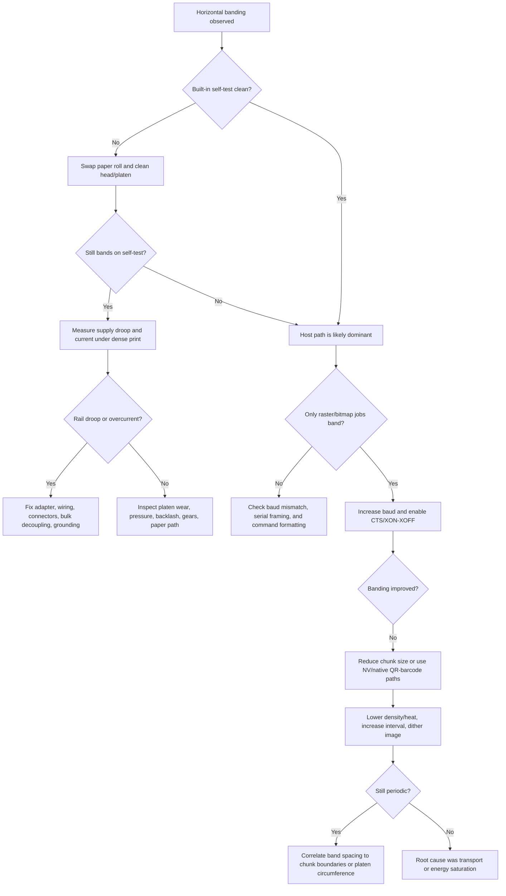

# Thermal Receipt-Printer Banding Under Low Serial Feed

> [!related]
> This imported research report supports [[PROJ - SToMS3R - AtomS3R Lite Thermal Printer Firmware]]. See also the synthesized textbook note [[ARTICLE - Thermal Receipt Printers - K118 Mechanics Commands and Firmware Control]].


## Executive summary

Horizontal banding on a 58 mm thermal receipt printer is fundamentally a **line-to-line energy or transport nonuniformity problem**. These printers are not moving-carriage devices; they are line printers with hundreds of heater elements laid across the paper width, driven in blocks while the platen advances the paper in the feed direction. That means horizontal bands come from one or more coupled errors in **thermal energy delivery, supply integrity, paper transport, or host-to-printer timing**. When the serial feed rate is too low, the printer cannot sustain its intended print pipeline, so it must pause, re-buffer, cool, re-accelerate, or restart motion. Those pauses make thermal history and motion history visible on paper as horizontal stripes. citeturn22view2turn29view0turn24view0

For an M5/ATOM-class 58 mm module, the public quick-start says the mechanism is **203 dpi, 8 dots/mm, 384 dots/line, 60 mm/s**, with **TTL UART defaulting to 9600 bps 8N1** and a recommended **12 V, 2.5 A** supply. At full width, a raw raster stream needs **48 bytes per row** and **480 rows/s** to sustain 60 mm/s, which is about **23,040 bytes/s of payload**, or roughly **230,400 baud** before overhead. So 9600 bps can sustain only about **2.5 mm/s** of continuous full-width raster, and even 115200 bps only about **30 mm/s**. In other words, a printer advertised for 60 mm/s cannot maintain that speed for full-width uncompressed raster at its default TTL baud. That mismatch is the core reason “serial feed too low” can create or worsen banding on raster jobs. citeturn3view0turn8view0turn19view3

The exact internal mechanism used inside the M5 module is not specified in its quick-start, so the guide below uses representative official 58 mm, 384-dot mechanisms and printhead references from entity["company","Seiko Instruments","japan electronics maker"] and entity["company","Kyocera","japan electronics maker"], together with official command references from entity["company","Epson","japan printer maker"] and entity["company","Star Micronics","japan printer maker"], printhead safety notes from entity["company","ROHM","japan semiconductor maker"], and host-library behavior from entity["company","Adafruit","us electronics company"]. Thermal-paper chemistry draws on official material from the entity["organization","U.S. Environmental Protection Agency","us federal agency"] and entity["company","Yamamoto Chemicals","japan chemical maker"]. Wherever your exact head resistance, head rail, receive-buffer depth, or thermistor curve are unknown, the report states representative ranges and shows how to measure them. citeturn28view0turn29view0turn22view0turn22view2turn11view1turn20view1turn3view4turn20view0

The short version of the fix strategy is this: **separate host-path problems from hardware problems with a self-test**, then raise serial throughput and honor hardware/software flow control, reduce raster payload when possible by using native QR/barcode/NV graphics paths, strengthen the power path, tune heat settings conservatively, keep average line coverage under control with dithering, and correct any platen/backlash/stiction issues. If the self-test bands too, the fault is usually in paper, head, power, or mechanics. If the self-test is clean but host bitmaps band, the fault is usually in timing, buffering, or data transport. citeturn24view0turn25view0turn26view0turn17search8

## Why serial underfeed produces horizontal bands

The M5 quick-start exposes the key mismatch directly: **384 dots per line** means **48 bytes per raster row**, and **8 dots/mm at 60 mm/s** means **480 rows/s**. In raw uncompressed raster modes such as `GS v 0`, the byte cost of a row depends mainly on image width, not on how many black dots are set inside that row. So serial bandwidth and electrical/thermal loading are related but not the same thing: the serial link pays for **dimensions**, while the printhead and power supply pay for **black-dot activation density**. citeturn3view0turn8view0turn28view0

The table below converts those dimensions into sustained full-width raster throughput, assuming 8N1 serial framing and no additional transport latency. The numbers are arithmetic derived from the M5 dimensions and the byte-oriented raster definition in Epson’s `GS v 0` command. citeturn3view0turn8view0

| UART baud | Approx payload bytes/s | Full-width rows/s at 48 B/row | Max continuous 384-dot raster speed |
|---:|---:|---:|---:|
| 9600 | 960 | 20 | 2.5 mm/s |
| 19200 | 1920 | 40 | 5 mm/s |
| 38400 | 3840 | 80 | 10 mm/s |
| 57600 | 5760 | 120 | 15 mm/s |
| 115200 | 11520 | 240 | 30 mm/s |
| 230400 | 23040 | 480 | 60 mm/s |

A concrete example makes the bottleneck obvious. A **384 × 200-dot** image, which is only **25 mm** tall, contains **9,600 raster bytes**. At 9600 bps, sending that job alone takes about **10 seconds**. At 115200 bps, it takes about **0.83 s**. But if the mechanism were actually running at its advertised 60 mm/s, printing 25 mm would take only about **0.42 s**. So unless the printer stores the whole graphic internally, it must stall or slow itself drastically at 9600, and it is still link-limited at 115200 for this class of image. Those stalls are exactly where banding often appears. citeturn3view0turn8view0

This is also why text, barcodes, and QR codes often look much better than bitmaps on the same weak serial link. The M5 firmware publishes native commands for text formatting, barcodes, and QR codes, and Epson documents higher-level bit-image / graphics / NV-graphics paths that avoid repeatedly streaming full-width raster data. Epson’s technical reference also notes that graphics stored in NV memory can print quickly even on low-speed serial links. If the printer renders from its own font ROM, barcode engine, QR engine, or NV graphics store, the serial link carries a short command and a small payload rather than 48 bytes for every row. citeturn30view1turn30view3turn24view0

There is a second, subtler consequence of low serial feed: it changes the **thermal and mechanical state at chunk boundaries**. A printer that pauses while waiting for more image bytes lets the head cool, lets the motor drop into a different phase or stop state, and can re-enter printing with different backlash, paper tension, or head temperature than on the prior lines. Depending on the firmware and mechanism, that can make the next band either **darker** from a colder head or **lighter / geometrically distorted** from restart error, feed lag, or stiction. citeturn28view0turn29view0turn26view0

## Thermal head physics and paper chemistry

A receipt printer head is a dense row of resistive heaters built on a thermally engineered substrate. Kyocera’s overview describes a thermal printhead as multiple heaters lined up on a **heat-storage layer called glaze**; the organization’s technical pages describe thin-film heater structures, protective films, alumina substrates with glass overcoat, feature sizes in the **tens of micrometers**, temperature rise to **several hundred degrees Celsius nearly instantly**, and heater on/off control in the **microsecond** range. Those details matter because a band is the visible output of a timing or energy error in a device whose normal operation is already defined at sub-millisecond and sub-dot scales. citeturn22view2turn22view0turn22view1turn22view3turn22view4

Representative 58 mm receipt mechanisms show how this is implemented electrically. The SII LTP02 manual gives **384 dots at 8 dots/mm**, a built-in thermistor, heater element resistance of **162–198 Ω**, and a divided-drive method that limits the number of simultaneously activated dots to **45**. The older SII LTPA245 series is also a 384-dot, 58 mm class mechanism, with **six 64-dot blocks**, head resistance **168–183 Ω typical 176 Ω**, and a maximum head current of **2.6 A** at 64 simultaneously activated dots. These representative values are not guaranteed to match the exact mechanism inside the M5 module, but they are squarely in the same 58 mm / 203 dpi design space. citeturn28view0turn13view0turn29view0

The most important head-physics equation in the SII LTP02 guide is the activation-pulse relationship, which it writes in the form:

`pulse width t = (printing energy E × adjusted resistance R × cycle coefficient C) / V²`

That is the right mental model even when the exact constants differ by mechanism. Required darkness is obtained by delivering a target energy to the paper, but delivered energy is highly sensitive to **voltage squared**, paper sensitivity, element resistance, and recent activation history. A 10% droop on the effective head voltage cuts delivered `V²` energy to about **81%** of nominal. A 20% droop cuts it to **64%**. That is enough to turn “slightly faded” rows into visible banding. citeturn28view0

SII also explicitly says the correct printing energy depends on **thermal paper type** and **head temperature**, with different standard energies and temperature coefficients for different papers, and it uses the built-in thermistor to compute the head temperature used for compensation. On the LTP02 example, the thermistor is **30.0 kΩ at 25°C**, **5.27 kΩ at 70°C**, and **2.09 kΩ at 100°C**. Across SII manuals, software cutback thresholds are in the **70–80°C** class and hardware abnormal-temperature detection is in the **90–100°C** class. So if banding changes with ambient temperature, paper brand, or long dense print runs, that is not a mystery; it is exactly what the print-energy equations predict. citeturn12view0turn32view3turn28view0

Thermal paper itself is an engineered stack, not simply “paper that turns black when heated.” EPA’s thermal-paper material shows a **base paper**, **precoat**, **thermal reactive layer**, and optional **topcoat / backcoat**. EPA also breaks the reactive layer into **color former (leuco dye)**, **developer**, **modifier/sensitizer**, and **binder**. Yamamoto’s leuco-dye explanation says the dye develops color when brought into contact with an acidic developer under heat, and that in thermal paper the dye and developer **melt together** to produce color. EPA notes that the sensitizer lowers the effective melting threshold of the dye-developer mix. That means a printer that is perfectly tuned for one paper can band on another simply because identical electrical pulses create different optical density in different coatings. citeturn3view4turn20view0

This is also why thermal-history control matters. The LTPA245 manual explicitly adds a **heat storage coefficient** `D` because at high speed the actual heater temperature can rise faster than the thermistor reports. Its method simulates heat storage in software, increments a counter as dots are fired, applies a radiation coefficient during cooling, and corrects the next pulse width accordingly. In modern language, that is a primitive but very real form of **dot-history compensation**. If a printer or library does not compensate for recent dense rows, banding in logos and photo-like regions is expected. citeturn32view0turn32view1

The representative parameters below are the ones that most directly affect banding. The values come from the cited manuals and are intentionally presented as **representative ranges**, because the exact M5 internal mechanism is unspecified publicly. citeturn3view0turn28view0turn29view0turn11view0

| Parameter | Representative value | Why it matters |
|---|---|---|
| Print width | 384 dots / 48 mm | Sets raster row payload to 48 bytes |
| Resolution | 8 dots/mm | 1 printed row = 0.125 mm in feed direction |
| Heater resistance | 162–198 Ω (LTP02), 168–183 Ω typ 176 Ω (LTPA245) | Sets pulse current and required pulse width |
| Simultaneous-dot limit | 45 dots (LTP02) to 64 dots (LTPA245 blocks) | Caps peak current and affects dense-fill behavior |
| Thermistor reference | 30.0 kΩ at 25°C | Basis for temperature compensation |
| Software overtemp region | roughly 70–80°C | Where density must be reduced or firing disabled |
| Hardware abnormal-temp region | roughly 90–100°C | Where hard shutdown is required |
| Typical module supply recommendation | 12 V, 2.5 A or more on M5 module | External supply floor, not necessarily direct head voltage |

## Electrical design and power integrity

The external adapter recommendation and the internal head-drive requirement are not the same thing. The M5 quick-start specifies **12 V DC** and **2.5 A operating current** for the finished module, but representative 58 mm mechanisms often run their actual head-drive rail in the **4.5–8.5 V** range internally. So the correct engineering question is not “do I feed the head 12 V,” but “what voltage actually appears at the heater circuit under load, and how much does it sag during dense pulses?” Until measured, that internal head rail is unspecified on the M5 module. citeturn3view0turn29view0

SII’s low-voltage mechanism gives a clean peak-current estimate:

`I_peak ≈ N_sa × Vp / R_H,min`

Using the representative LTP02 values from the manual, if `N_sa = 45`, `Vp = 8.0 V`, and `R_H,min = 162 Ω`, the head pulse current is about **2.22 A**. The LTPA245 reference gives another representative point directly: at **64 simultaneously activated dots**, its maximum head-drive current is **2.6 A**. Those are head-pulse currents, not necessarily whole-system wall-supply currents, and they do not include every transient elsewhere in the mechanism. But they explain why a receipt printer can look “fine on text” and then collapse on full-width graphics with a weak supply or thin cable. citeturn15view0turn29view0

SII is unusually explicit about wiring losses. It warns that allowable current for the cable material and **voltage drop on the cable** must be considered, and its pulse-width equations include `rC`, a series resistance term representing wiring and switching resistance between the control terminals and the power supply. It also models internal head wiring resistance and common-terminal resistance. That is the official statement of what field engineers see all the time: every connector, barrel jack, crimp, breadboard jumper, PCB trace, and ground return is part of the print-density equation. citeturn28view0

Adafruit’s thermal-printer guide reaches the same conclusion from the product side. It recommends **at least 2 A**, says the printer cannot be run from USB power, notes that larger supplies are less susceptible to voltage droop during sudden demand, warns that breadboard wires are not suited to continuous heavy power draw, and recommends powering the microcontroller separately when the printer is near the limit of a 2 A supply to avoid brownouts. That advice is consistent with the SII electrical model and with the M5 module’s own “12 V, 2.5 A or more” requirement. citeturn25view0turn3view0

A useful sizing example follows directly from the representative SII and Adafruit numbers. Suppose the head pulse is about **2.2 A** and the effective firing time is about **1.2 ms**. If the design goal is to limit local droop to **0.3 V**, the ideal bulk capacitance is:

`C = I × Δt / ΔV = 2.2 A × 1.2 ms / 0.3 V ≈ 8.8 mF`

That is about **8,800 µF**, before ESR, cable inductance, regulator dynamics, and pulse repetition are considered. So a casual 100 µF or 470 µF capacitor may reduce edge ringing, but it will not magically stabilize dense printing by itself. The practical implication is that **bulk capacitance helps only when it is attached to a fundamentally low-impedance supply path**. It cannot rescue a long thin cable or an undersized adapter. This example is a derivation from the cited representative head current and heating-time figures. citeturn15view0turn20view1

Grounding matters as much as supply voltage. SII explicitly says to keep the thermal-head signal ground and frame ground at the same potential, recommending a **1 MΩ connection** between signal ground and frame ground and warning about electrostatic damage and even electrolytic corrosion if the power/ground conditions are wrong when not printing. ROHM likewise requires logic power sequencing before head power, recommends shutting both rails down on abnormal conditions, and requires thermistor-based protection. In practice, large pulsed print current flowing in a shared return can move the local UART ground reference enough to create framing errors, false handshakes, or corrupted bytes. Even when a manual does not literally say “ground bounce,” the official current, cabling, grounding, and sequencing warnings are exactly the conditions that produce it. citeturn31view0turn31view2turn11view1

The electrical fixes that matter most are therefore not exotic: a real adapter with margin, short low-resistance power wiring, local bulk plus ceramic decoupling at the printer end, a clean shared reference for UART and power, and preferably an MCU rail that is not allowed to collapse whenever the printer head fires. Those are the changes that most often remove banding that grows with image darkness. citeturn25view0turn28view0turn11view1

## Mechanical transport and start-stop artifacts

The head can only print well if the paper transport keeps the paper in repeatable contact with the heater line. ROHM’s printhead design note gives representative **mechanical standard conditions** of about **18.6 ± 1.96 N per print width** platen pressure, **40 ± 5 Shore A** platen hardness, **14.0–20.0 mm** platen diameter, and **8.0 lines/mm** sub-scan feed pitch. Those are not cosmetic details. Pressure changes the contact area and heat transfer into the thermal layer; hardness changes local stress; platen diameter changes geometry; and feed pitch determines whether adjacent printed rows land where the thermal model expects them to. citeturn11view0

The transport path also leaves strong fingerprints in the band spacing. With the representative ROHM platen-diameter range of **14–20 mm**, the platen circumference is about **44–63 mm**. So if a dark/light band repeats roughly every **4.4–6.3 cm** down the receipt, the fault is far more likely to be a **roller surface defect, flattened spot, contamination ring, or pressure eccentricity** than a serial protocol problem. That is one of the best mechanical discriminators in practice. The circumference figure is derived from ROHM’s stated platen diameter range. citeturn11view0

SII’s mechanism manuals show why low serial feed interacts with mechanics so badly. The LTP02 guide states that the **motor and thermal head must be driven at the same time for printing**, that one dot line is formed by **four motor steps**, and that the head is fired every **two steps**. The same manual uses a **division drive** so current stays bounded, limits simultaneously activated dots, and requires a minimum pause for repeated activation of the same elements. In other words, the motion plan and the heat plan are entwined. If the data stream is late and the controller cannot keep that schedule, the printer is no longer operating in the regime the mechanism was characterized for. citeturn12view3turn13view0turn28view0

The manuals are direct about backlash and interruptions. The LTP02 reference says that after initialization, after platen open/close, after backward feed, and after cutting, the paper should be fed **48 steps or more** to absorb backlash before printing. It also says not to interrupt printing once bit images start, because paper feeding may be confused and print quality may degrade. The LTPA245 reference likewise calls for backlash absorption steps and states that **input data transfer speed** can affect motor behavior, contributing to noise, overheating, or over-torque conditions. This is one of the clearest official statements linking host data timing to mechanical print quality. citeturn4view3turn4view2turn14view1turn29view0

The same LTPA245 manual warns that the motor should be stopped on dot lines **where head activation is not performed**, because stopping in a recently heated line can let the head stick to the paper and create feed trouble. It also limits motor current to **300 mA/phase or less**, requires acceleration control into higher pulse rates, and requires long pauses after sufficient continuous driving to prevent motor overheating. So a host that drip-feeds raster data too slowly can force the controller into exactly the kind of repeated start-stop behavior the mechanism manuals try to avoid. citeturn29view0

This is why low-serial-feed banding often looks different from pure voltage sag. Voltage sag tends to correlate with **dense black areas** and overall fading/dark-light cycling. Mechanical starvation tends to correlate with **chunk boundaries, restarts, cuts, or periodic transport events**. A clean self-test but banding only on host raster images strongly suggests the print path is being forced into undesirable stop/restart states by underrun or pacing errors rather than by an inherently bad head. citeturn24view0turn29view0turn26view0

Paper handling details matter too. SII specifies limits on paper feed force, warns against skew, explains that foreign matter on the reduction gear or paper sensor creates feed trouble and detection errors, requires the thermal surface to face the right direction, and gives alcohol-based cleaning procedures for the head after it cools. A dirty head/platen pair can convert a mild timing problem into severe banding because the contact mechanics are already unstable before the first byte is sent. citeturn33view0turn24view0turn11view1

## Protocol, buffering, and host pacing

On the command side, the important point is that a thermal receipt printer is not just “a serial port that eats bytes.” The command language defines how much data is sent, when it can be interpreted, and how the printer signals readiness. Epson’s official `GS v 0` reference defines raster printing as `GS v 0 m xL xH yL yH d1...dk`, where `x` counts **bytes in the horizontal direction** and `y` counts **dots in the vertical direction**. It further warns that in standard mode the command is valid **only at the beginning of a line and only when the print buffer is empty**; otherwise the following bytes may be treated as normal data. That matters when multiple layers of code mix text and graphics or when a host resumes sending after a stall. citeturn8view0

The M5 Atom Printer publishes the same practical image path plainly: it documents bitmap printing with `0x1D 0x76 0x30 ...`, publishes native QR-code commands, and exposes a vendor command for changing baud from **9600** to **115200**. It also maps the printer connection internally to the Atom controller with **TX**, **RX**, and **CTS**. So, on this platform, the first two software mitigations are obvious and official: **raise baud** and **use CTS-aware host code** when possible. citeturn30view1turn30view3turn3view0

Star’s official ESC/POS serial reference shows the other half of the problem. It supports **DTR/DSR** and **XON/XOFF**, defines the XON/XOFF transmission timing, and allows BUSY to mean either **“receive buffer full”** or **“receive buffer full or printer offline.”** The same manual warns that, if BUSY is configured to mean buffer-full only, the printer may stop printing because of cover-open, paper-out, or other conditions **without entering BUSY**, and that real-time commands such as `DLE EOT`, `DLE ENQ`, and `DLE DC4` do not make the receive buffer enter a buffer-full state. That means a simplistic “poll status while blasting raster data” loop can still be wrong. Host pacing must respect the flow-control mode actually configured on the printer. citeturn4view7turn4view8turn5view3

The Adafruit libraries encode a conservative version of this reality. The CircuitPython source and C++ library document the old but common `ESC 7` heat-config command as **max heating dots**, **heating time**, and **heating interval**, explaining directly that more heating dots increase peak current, more heating time darkens print at the cost of speed and stiction risk, and more heating interval improves clarity at the cost of speed. In the bitmap path, the C++ library explicitly assumes roughly a **256-byte receive buffer** when no handshake is available; at **384-pixel width**, that yields only **5 rows per chunk** (`256 / 48 = 5`). With handshake enabled, it can push up to **255 rows** at a time because it relies on the printer’s ready signal instead of fixed delays. citeturn20view1turn21view0

That 256-byte assumption creates a surprisingly useful diagnostic. If a 384-pixel-wide image bands at a repeat spacing near **5 rows**, that is **0.625 mm** in paper travel (`5 / 8 mm`). A visible band every ~0.6 mm is often a telltale sign of **host chunk boundaries on a no-handshake library path**, not of a roller defect. The spacing is a derivation from the cited M5 width and Adafruit chunking logic. citeturn3view0turn21view0

The practical command sequences below are representative of the officially documented paths on this class of printer. The intent is not to claim universal compatibility for every clone, but to show the documented structure of the operations that matter most for banding: initialize, raise baud, avoid full-width raster unless needed, and prefer native content-generation commands when the printer supports them. citeturn3view0turn8view0turn30view1turn30view3

```text
# Initialize
1B 40

# M5 Atom Printer: change serial baud to 115200
1B 23 23 53 42 44 52 00 C2 01 00

# Print a 384 x 64 raster image in normal size using GS v 0
# x = 384 / 8 = 48 bytes => xL=30h, xH=00h
# y = 64 dots        => yL=40h, yH=00h
1D 76 30 00 30 00 40 00 <3072 image bytes>

# M5 native QR path
# Set QR correction level, store payload, print QR
1D 28 6B 03 00 31 45 31
1D 28 6B <len+3 low> <len+3 high> 31 50 30 <payload bytes> 00
1D 28 6B 03 00 31 51 30 00
```

A robust host should pace raster traffic by **printer readiness**, not by wishful sleeps. If CTS is present, use it. If only XON/XOFF is present, honor it strictly. If neither is available, send smaller chunks and use conservative timing inferred from actual print speed and heating settings. Adafruit’s sources are particularly helpful here because they show both the no-handshake chunking strategy and the handshake-enabled fast path. Star’s serial manual supplies the actual readiness semantics. citeturn21view0turn4view7turn4view8

```python
def send_raster(printer, image_rows, width_px, cts=None, xonxoff=None,
                measured_buffer=None, max_chunk_rows=255):
    row_bytes = (width_px + 7) // 8
    header_bytes = 8  # GS v 0 header

    if cts is not None:
        chunk_rows = min(max_chunk_rows, 255)
    else:
        # If unknown, start from a conservative buffer estimate.
        recv_buf = measured_buffer or 256
        chunk_rows = max(1, min(max_chunk_rows, (recv_buf - header_bytes) // row_bytes))

    for chunk in chunk_by_rows(image_rows, chunk_rows):
        wait_until_ready(cts=cts, xonxoff=xonxoff)

        y = len(chunk)
        header = bytes([0x1D, 0x76, 0x30, 0x00,
                        row_bytes & 0xFF, (row_bytes >> 8) & 0xFF,
                        y & 0xFF, (y >> 8) & 0xFF])

        printer.write(header)
        printer.write(pack_rows(chunk))

        if cts is None and xonxoff is None:
            # Conservative fallback: wait for the printer to physically consume this chunk.
            # Replace with measured timing from logic-analyzer traces if available.
            sleep(estimate_chunk_print_time(rows=y) + safety_margin())

        # Optional adaptive throttling:
        # if input voltage drooped, thermistor is hot, or line coverage is high:
        #   reduce heat_time / max_heat_dots, or extend interval before next chunk
```

For bandwidth-limited hosts, three protocol choices have outsized impact. First, **raise baud** to the highest stable value the printer documents. Second, **prefer native content-generation commands** for text, barcodes, and QR codes. Third, where supported, **pre-store graphics in NV memory** and print them by reference rather than streaming full-width raster every time. Epson explicitly endorses that last strategy for low-speed serial interfaces. citeturn3view0turn24view0

## Diagnostics, mitigation, and advanced control

The single best first discriminant is the printer’s own self-test. Epson’s technical reference says the self-test confirms **control circuit functions**, **printer mechanism**, **print quality**, **ROM version**, and **switch settings**, while hexadecimal-dump mode prints exactly what the host sends in hex. Those two modes cleanly separate “printer hardware can print” from “host stack is formatting or pacing data correctly.” Adafruit’s guide for small thermal printers also tells you to note the baud rate on the test page, precisely because a baud mismatch or weak data path can masquerade as print-quality trouble. citeturn24view0turn25view0

The test patterns below are the fastest way to localize banding. The expected outcomes are synthesized from the behavior described in the cited mechanism manuals, command references, and practical printer guides. citeturn24view0turn26view0turn29view0turn33view0

| Test pattern | Healthy result | If it fails, suspect |
|---|---|---|
| Built-in self-test page | Clean text, stable darkness, straight feed | Head/paper/power/mechanics, not host raster code |
| Hex dump mode with known bytes | Printer prints exact command bytes in hex | Host formatting errors, wrong command framing, serial corruption |
| Native QR code command | Clean QR with no horizontal striping | If QR is clean but bitmap bands, problem is raster bandwidth/pacing |
| 384-px 50% dithered checkerboard | Minor texture only, no major stripes | If this works but solid fills fail, power/current or heat settings are marginal |
| 384-px solid black block, ~25 mm tall | Strong but uniform darkness | If banding appears only here, current limit / thermal throttling / supply sag is likely |
| 1-px horizontal line every 8 rows | Even spacing, no row compression | Mis-spacing points to feed errors, backlash, missed steps, or chunk-boundary artifacts |

A second table is useful because banding patterns are often diagnostic by themselves. The pattern categories below are field-meaningful and grounded in the cited electrical, mechanical, and protocol constraints. citeturn11view0turn21view0turn24view0turn26view0turn29view0

| Banding signature | Most likely dominant layer | Fast discriminator | Highest-value fix |
|---|---|---|---|
| Clean self-test, bad host bitmaps | Protocol / pacing | Run native QR and hex dump | Raise baud, honor CTS/XON-XOFF, chunk raster conservatively |
| Repeats around 0.625 mm on 384-px jobs | Host chunking without handshake | Check library chunk size and CTS use | Enable CTS/DTR, larger chunks, higher baud |
| Repeats around 44–63 mm | Platen defect / eccentricity | Compare to platen circumference | Clean or replace platen/roller |
| Dark/light swing only in dense fills | Supply sag / simultaneous-dot limit | Scope input rail during solid block | Better supply, shorter wire, lower heat/density, dither |
| First lines after cut or idle are wrong | Backlash / restart stiction | Add pre-feed and continuous run | Avoid interruptions, pre-feed, clean gear path |
| Garbled graphics or skipped commands | Receive overflow / framing | Hex dump plus logic analyzer | Honor handshake, reduce burst size, improve common ground |
| Self-test also bands | Core hardware issue | Swap paper, clean head, retest with strong PSU | Service paper path, head, supply, or platen |

The measurement workflow should be instrumented, not guessed. Use an oscilloscope at the **printer power input**, with the probe ground kept very short, and capture the rail while printing a full-width dense block. If accessible, also measure the **internal head rail** rather than only the external adapter output, because internal connector and board losses can hide the true droop seen by the heater. Use a current shunt or current probe to measure peak and RMS current. Use a logic analyzer on **TX**, **RX**, and **CTS** (or whichever handshake line is available) and correlate CTS deassertions, XOFF timing, or long inter-byte gaps with the physical location of the bands on paper. If bands line up with chunk or handshake events, the root cause is pacing by definition. citeturn3view0turn4view7turn4view8turn28view0

For software mitigation, the most effective image-side tactic is to reduce **simultaneous-dot stress**, not merely average black percentage. Adafruit’s guide says these printers fare best with light line art and dithered photographic images, and explicitly warns that large solid-filled areas can produce streaky artifacts because the printer can only heat so many dots at a time. That lines up perfectly with the SII divided-drive limits on simultaneously activated dots. In practice, this means converting raster images to 1-bit with an ordered dither or error-diffusion dither that keeps local row coverage down, trimming full-width solid bars, and preferring vector-like native commands whenever the printer offers them. citeturn26view1turn13view0turn29view0

For firmware control, the best advanced strategy is **dynamic density throttling** driven by three observables: thermistor temperature, measured or inferred head voltage, and recent row coverage. The official ingredients already exist in the manuals: SII compensates pulse width for paper type and thermistor temperature, corrects for recent activation cycle, and in the LTPA245 class even simulates heat storage with a radiation term. Adafruit exposes max-heat-dots, heat-time, and heat-interval knobs. A modern controller can combine those into a policy such as: lower max simultaneous dots or heating time when the thermistor rises, when input voltage sags, or when recent row coverage is high; restore normal values when the head cools and coverage drops. That is not guesswork; it is just a cleaner implementation of the compensation logic the mechanism vendors already publish. citeturn28view0turn32view0turn20view1

Failure modes and safety limits also need to be respected. ROHM explicitly forbids printing without paper, requires thermistor-based temperature control plus hard rail shutdown on abnormal conditions, and warns that jams plus energized media can lead to the paper sticking to the head or even combustion. SII likewise says excessively high voltage or excessively long pulse width shortens head life, requires hardware abnormal-temperature detection, and warns about ESD, improper grounding, and head contamination. The M5 quick-start advertises a **50 km printing-distance lifespan**, but that is not a free pass to overdrive the mechanism: excessive energy, bad media, dirty head surfaces, or repeated jammed dense prints will reduce life. citeturn11view1turn12view0turn32view3turn3view0

The troubleshooting sequence below prioritizes the fastest separations first. It is based on the cited self-test, hex-dump, handshake, and mechanism guidance. citeturn24view0turn4view7turn29view0turn31view0



A practical hardware-and-software checklist is therefore short and ruthless:

- Verify the **built-in self-test** before touching host code.  
- Confirm the actual **baud rate** from the test page or printer settings, then raise it from 9600 if the device supports it.  
- Use **CTS / DTR-ready** or **XON/XOFF**; do not free-run raster data into an unknown buffer.  
- Avoid full-width raw raster unless needed; use **native text, barcode, QR**, or **NV graphics** where possible.  
- Scope the printer input rail during a dense block and fix **adapter margin, cable resistance, connector losses, and decoupling** before changing dithering.  
- Clean the **thermal head and platen** with alcohol only after cooldown, and inspect gears, skew, and paper tension.  
- If dense graphics still band, reduce **max simultaneous dots**, **heating time**, or increase **heating interval / break time**.  
- Preprocess images to **1-bit dithered graphics** and avoid long full-width solid bars.  
- If a band repeats at a length tied to **chunk height**, fix pacing; if it repeats at a length tied to **roller circumference**, service mechanics.  
- Implement **temperature, voltage, and dot-history compensation** if you control the firmware. citeturn24view0turn3view0turn4view7turn20view1turn26view1turn33view0turn11view0turn32view0

The deepest lesson is that a thermal receipt printer is a coupled **electro-thermo-mechanical control system**. Horizontal banding is what you see when those layers stop agreeing about timing and energy. Low serial feed is especially damaging because it disturbs **all four layers at once**: it changes when data arrives, which changes when motion can continue, which changes how hot the head is when the next line fires, which changes how much optical density the paper develops. Once that coupling is understood, the fixes stop looking like folklore and start looking like straightforward control engineering. citeturn28view0turn29view0turn26view0turn11view0