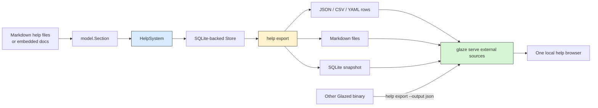
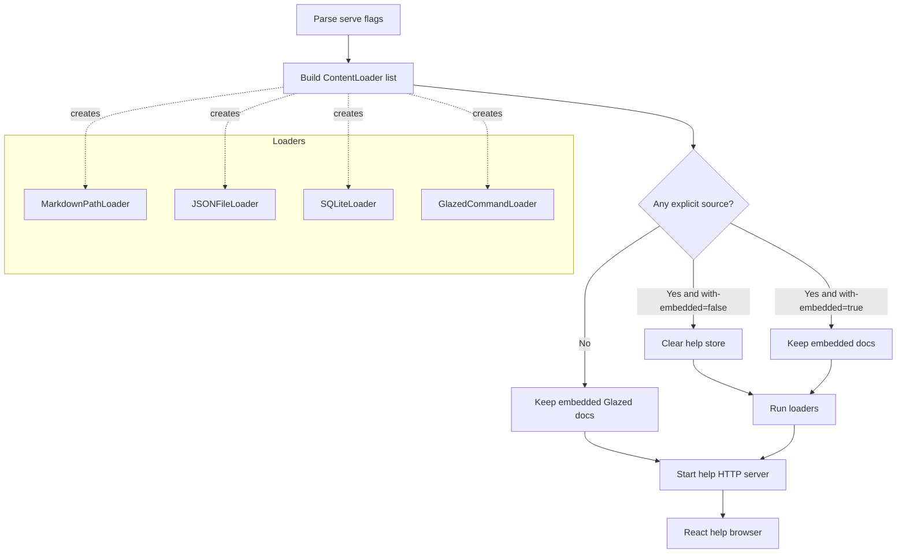

# Glazed Help Export and External Serve Sources

This report describes the project that added portable help export and external help serving to Glazed. The work began with a simple operational need: if many binaries use the Glazed help system, there should be a uniform way to ask each binary what documentation it contains. By the end of the implementation, that need became a small documentation exchange protocol built around `help export` and `glaze serve --from-*` source flags.

The central idea is deliberately modest. A Glazed-based binary already has a structured help database in memory. It knows section titles, slugs, topics, commands, flags, markdown content, and section types. The export command makes that internal structure visible as JSON, CSV, markdown files, or SQLite. The serve command then consumes those exported forms so one browser can display documentation from many binaries, snapshots, or local markdown directories.

> [!summary]
> This project turned Glazed help from an in-process feature into a portable documentation interface.
> 1. `glaze help export` exports help sections as tabular rows, reconstructed markdown files, or a standalone SQLite database.
> 2. `glaze serve` can now load help from external Glazed binaries, exported JSON, exported SQLite, and markdown paths.
> 3. `help export` is now registered automatically by `help_cmd.SetupCobraRootCommand`, so downstream tools such as Pinocchio receive the export verb without manual wiring once they depend on the updated Glazed module.

## Why this project exists

The Glazed help system was already more structured than ordinary Cobra help. It did not only print command usage; it stored documentation as typed sections with metadata. A section could be a general topic, an example, an application note, or a tutorial. It could be tagged with topics, associated with commands, and queried through the same store that powered the terminal help view, the interactive TUI, the HTTP help server, and static site generation.

That structure was useful, but it was trapped inside each process. If a binary had embedded help pages, the simplest way to inspect those pages was to run that binary's help command. That is fine for a human reading one page at a time. It is not enough for tooling. A documentation dashboard needs inventories. A search index needs normalized rows. A backup workflow needs files. A browser for a family of command-line tools needs to load content from more than one executable.

The export project solves that boundary problem. It gives every Glazed help system a common egress path:

```bash
<binary> help export --with-content=true --output json
```

Once that command exists, another tool does not need to understand the binary's internals. It only needs to know that a Glazed help export is a list of help sections. This is the same design principle as a compiler emitting an intermediate representation: the producer and consumer do not have to share the same runtime, but they do have to agree on the shape of the data.

## The core mental model

The easiest way to understand the project is to separate three concerns: how help is represented, how it is exported, and how it is imported again.



The model layer already existed. A help entry becomes a `model.Section`. The store layer already existed. It could list, query, upsert, and clear sections in SQLite. The new work added export and import edges around that existing center.

This is important because the project did not invent a second documentation model. It reused the authoritative one. If `glaze help`, `glaze serve`, and `glaze help export` disagree, then one of them is wrong. The design avoids that by making all three read from the same `HelpSystem` and `Store` abstractions.

## Current project status

The implementation is active and present in the Glazed checkout at:

```text
/home/manuel/code/wesen/corporate-headquarters/glazed
```

The relevant commits on the current branch are:

```text
391a62f feat: add glaze help export verb with tabular, files, and sqlite modes
81f52fc test: add unit tests for glaze help export command
2a5603d docs: add export-help-entries topic and cross-references
19c91f3 feat: load serve help from external sources
7d70af7 docs: document serve external help sources
4cbcfc6 fix: address help export and serve review feedback
72a0f62 feat: auto-register help export command
```

The work is associated with PR #558:

```text
https://github.com/go-go-golems/glazed/pull/558
```

The project also has a docmgr ticket and implementation diary under the workspace ticket directory:

```text
/home/manuel/workspaces/2026-04-28/add-glazed-help-export/glazed/ttmp/2026/04/28/GLAZE-HELP-EXPORT--add-glazed-help-export-verb-export-metadata-and-entries-to-disk-sqlite/
```

## User-facing behavior

The main new user-facing command is:

```bash
glaze help export
```

By default, it exports every loaded help section as Glazed tabular output and includes full markdown content:

```bash
glaze help export --output json
```

If the user only wants metadata, they can omit the content field:

```bash
glaze help export --with-content=false --output csv
```

If the user wants editable files, they can reconstruct markdown help pages:

```bash
glaze help export --format files --output-path ./exported-help
```

If the user wants a queryable snapshot, they can export SQLite:

```bash
glaze help export --format sqlite --output-path ./help.db
```

The second user-facing feature extends `glaze serve`. The serve command can now load documentation from external sources:

```bash
glaze serve --from-glazed-cmd pinocchio
```

For each binary named by `--from-glazed-cmd`, Glazed runs:

```bash
<binary> help export --with-content=true --output json
```

It then decodes the exported JSON and inserts the sections into the help store used by the web server. That makes `glaze serve` a documentation browser for other Glazed tools, not only for Glazed itself.

External source forms include:

| Source form | Flag or position | Typical use |
|---|---|---|
| Live Glazed binary | `--from-glazed-cmd pinocchio` | Browse the documentation embedded in an installed tool. |
| JSON export | `--from-json ./pinocchio-help.json` | Serve a cached or filtered snapshot. |
| SQLite export | `--from-sqlite ./pinocchio-help.db` | Serve an archived or queryable documentation database. |
| Markdown paths | positional paths | Serve local help files or directories directly. |

The default behavior is intentionally focused. If the user provides explicit external sources, embedded Glazed documentation is not included unless they ask for it:

```bash
glaze serve --with-embedded=true --from-glazed-cmd pinocchio
```

This prevents the most common surprise: asking for Pinocchio help and seeing mostly Glazed pages.

## Project shape

The project added three implementation areas and two documentation topics.

### Export command

The export command lives in:

```text
pkg/help/cmd/export.go
pkg/help/cmd/export_test.go
```

Important symbols:

| Symbol | Role |
|---|---|
| `ExportSettings` | The parsed flag values for export mode, filters, destination path, and content inclusion. |
| `NewExportCommand` | Builds the Glazed command definition for `help export`. |
| `buildExportPredicate` | Converts CLI filters into a store predicate. |
| `exportToFiles` | Writes one reconstructed markdown file per help section. |
| `safeSectionFilePath` | Prevents unsafe slugs from escaping the output directory. |
| `exportToSQLite` | Copies selected sections into a standalone SQLite store. |
| `AddExportCommand` | Wires the command under the Cobra `help` command and avoids duplicate registration. |

### External source loaders

The loader abstraction lives in:

```text
pkg/help/loader/sources.go
pkg/help/loader/sources_test.go
```

Important symbols:

| Symbol | Role |
|---|---|
| `ContentLoader` | Common interface for loading sections into a `HelpSystem`. |
| `NormalizeStringList` | Normalizes list-valued flags that may be repeated or comma-separated. |
| `MarkdownPathLoader` | Loads local markdown help files and directories. |
| `JSONFileLoader` | Loads `help export --output json` snapshots, including stdin. |
| `SQLiteLoader` | Loads exported SQLite help databases. |
| `GlazedCommandLoader` | Runs another binary's `help export` command and imports its JSON. |
| `DecodeSectionsJSON` | Accepts exported section rows and converts them back into `model.Section` values. |

### Serve command integration

The serve integration lives in:

```text
pkg/help/server/serve.go
pkg/help/server/serve_test.go
```

The serve settings now include:

```go
FromJSON      []string `glazed:"from-json"`
FromSQLite    []string `glazed:"from-sqlite"`
FromGlazedCmd []string `glazed:"from-glazed-cmd"`
WithEmbedded  bool     `glazed:"with-embedded"`
```

The command builds a sequence of loaders, optionally clears the embedded store, loads external sections, and then starts the same HTTP server as before. The browser did not need a separate frontend implementation for this first version because the API shape remained the same: the server still exposes help sections from one `HelpSystem`.

### Automatic registration

The most recent improvement moved export registration into the standard help setup path:

```text
pkg/help/cmd/cobra.go
```

Any binary that calls:

```go
help_cmd.SetupCobraRootCommand(helpSystem, rootCmd)
```

now receives `help export` automatically. This matters for downstream tools such as Pinocchio. The tool does not need to know that export exists. It only needs to use the Glazed help system normally.

The implementation also added an error-returning variant:

```go
func SetupCobraRootCommandE(hs *help.HelpSystem, cmd *cobra.Command) error
```

The existing `SetupCobraRootCommand` remains backward-compatible and calls `cobra.CheckErr` internally.

### User-facing documentation

The new help topics are:

```text
pkg/doc/topics/28-export-help-entries.md
pkg/doc/topics/29-serve-external-help-sources.md
```

They explain the two halves of the workflow: producing portable help data, and serving portable help data.

## Architecture: from markdown to portable snapshots

A help section begins as markdown with frontmatter. The frontmatter contains the section's identity and query metadata. The body contains the content a human reads.

A simplified help section looks like this:

```markdown
---
Title: Export Help Entries
Slug: export-help-entries
Topics:
- help
- export
Commands:
- help
- export
SectionType: GeneralTopic
---

## Why this exists

The help system stores documentation in an SQLite-backed store at runtime...
```

The parser turns this file into a `model.Section`. The store persists it. The renderer and server query it. The export command now reads those same sections and writes them into another representation.

The important transformation is not complicated. In pseudocode, the default export path is:

```text
settings = parse flags
predicate = buildExportPredicate(settings)
sections = helpSystem.Store.List(ctx, predicate)

if settings.Format == "glazed":
    for each section:
        emit row(section, withContent=settings.WithContent)

if settings.Format == "files":
    for each section:
        path = safeSectionFilePath(outputDir, section.Slug)
        bytes = reconstructMarkdown(section)
        write path bytes

if settings.Format == "sqlite":
    target = store.New(outputPath)
    for each section:
        target.Upsert(ctx, section)
```

This gives the command three personalities without making three user-facing verbs. The user learns one command, `help export`, and changes its target with `--format`.

## Why a single `help export` verb was the right design

An early design split the feature into separate metadata and content commands. That would have produced a tidy implementation, but a worse user interface. Users do not usually think, "I want metadata" or "I want content" as separate concepts. They think, "I want the help data in a form I can use elsewhere."

The final design makes content inclusion a flag:

```bash
glaze help export --with-content=false --output csv
glaze help export --with-content=true --output json
```

The command defaults to `--with-content=true` because the safest export is complete. A metadata-only inventory is useful, but it is lossy. If a user runs `help export` once before a refactor, they should get enough data to reconstruct the documentation later.

The single-verb design also keeps automation simple. The external serve loader only needs to know one command to run against another binary:

```bash
<binary> help export --with-content=true --output json
```

That command is now the informal protocol between Glazed help producers and consumers.

## Filtering model

Exports can be filtered by section type, topic, command, flag, or slug. These filters reuse the existing store predicate model rather than inventing an export-specific query language.

Conceptually, the filter builder does this:

```text
predicates = []

if --type is set:
    predicates.append(section_type == parsed_type)

if --topic is set:
    predicates.append(topics contains topic)

if --command is set:
    predicates.append(commands contains command)

if --flag is set:
    predicates.append(flags contains flag)

if --slug is set:
    predicates.append(slug is one of requested slugs)

return AND(predicates)
```

All filters combine with AND logic. This makes narrow exports predictable:

```bash
glaze help export --type Example --topic json --command help --output yaml
```

The command should export sections that are examples, tagged with `json`, and associated with the `help` command. It should not broaden the result if one filter is invalid. This became important during review.

## Review hardening: invalid types and safe paths

PR review surfaced two issues that were easy to miss during the first implementation because the happy path worked.

The first issue was invalid section types. If a user typed an unknown value for `--type`, the command originally risked behaving too broadly. That is dangerous for export commands because users often pipe their output into files, databases, or downstream processes. A typo should fail loudly, not export too much.

The fixed behavior is explicit:

```bash
glaze help export --type tutorial --output json
```

returns an error like:

```text
Error: invalid section type "tutorial": unknown section type tutorial
```

The second issue was file export safety. A section slug is normally a friendly identifier such as `help-system` or `export-help-entries`. But file export turns slugs into filenames. That means a malicious or malformed slug could try to escape the output directory.

The hardened implementation added `safeSectionFilePath`. It rejects empty slugs and path traversal forms such as:

```text
.
..
foo/bar
foo\bar
```

It also verifies that the resolved output path stays under the requested export directory. The key lesson is that internal identifiers become security-sensitive the moment they are used as filesystem paths.

## Why arbitrary `--from-cmd` was removed

The external serve design originally considered a generic command source. It would have let users provide an arbitrary command string that produced JSON. That sounds flexible, but it creates avoidable ambiguity.

A list-valued command flag such as `--from-cmd` has to answer several hard questions:

- Does a comma separate commands, or is it part of a shell argument?
- Does the implementation run through a shell, or split arguments itself?
- How are quotes handled?
- What happens when the command contains spaces?
- How does a user pass a custom filtered export command safely?

The final design removed `--from-cmd` entirely and kept `--from-glazed-cmd`. The latter accepts binary names or paths, not arbitrary shell snippets. The server knows exactly what to run:

```bash
<binary> help export --with-content=true --output json
```

If users need a custom filtered export, they can make the pipeline explicit:

```bash
pinocchio help export --topic agents --output json > pinocchio-agents.json
glaze serve --from-json pinocchio-agents.json
```

This is less magical and more robust. It separates generation from serving, which also makes the intermediate artifact inspectable.

## The serve loader pipeline

The serve command now has a small loading pipeline before it starts the HTTP server.



The `ContentLoader` interface is the small seam that makes this extensible:

```go
type ContentLoader interface {
    Load(ctx context.Context, hs *help.HelpSystem) error
    String() string
}
```

Each loader has one job. The JSON loader decodes rows. The SQLite loader opens a store and copies sections. The markdown loader delegates to the existing markdown path loader. The Glazed command loader runs a binary and decodes its JSON output.

This division keeps `serve.go` from becoming a large switch statement. It also makes future source types straightforward. A URL loader, a manifest loader, or a remote registry loader would only need to implement the same interface.

## Data compatibility: accepting real export rows

One subtle compatibility detail is the JSON row shape. Export rows may contain a field named `type` or `section_type`, and section type may appear as a string or numeric value depending on the serialization path. The JSON importer accepts both forms.

This matters because the export command goes through Glazed's output pipeline in tabular mode. The row shape is user-facing. Once people save JSON snapshots, later importers should be liberal in what they accept as long as the meaning is unambiguous.

The rule is:

- The exporter should produce stable, readable fields.
- The importer should accept known historical variants where practical.
- Invalid or unknown section types should fail rather than silently becoming something else.

## Automatic export registration

The original implementation required each binary to add export manually after setting up the help command. Pinocchio briefly needed code like this:

```go
help_cmd.SetupCobraRootCommand(helpSystem, rootCmd)
helpCmd, _, err := rootCmd.Find([]string{"help"})
if err != nil {
    return nil, errors.Wrap(err, "failed to find help command")
}
if err := help_cmd.AddExportCommand(helpCmd, helpSystem); err != nil {
    return nil, errors.Wrap(err, "failed to add help export command")
}
```

That worked, but it put the burden in the wrong place. Export is now part of the Glazed help system contract. A binary that opts into Glazed help should get the standard help subcommands. It should not need to remember a second registration call.

The final shape is cleaner:

```go
help_cmd.SetupCobraRootCommand(helpSystem, rootCmd)
```

Inside Glazed, `SetupCobraRootCommandE` creates the help command and calls `AddExportCommand`. The manual helper remains available and is idempotent, but normal binaries do not need it.

This design is especially important for `glaze serve --from-glazed-cmd`. That feature is only broadly useful if downstream tools acquire `help export` automatically. Otherwise, every Glazed-based CLI would need a patch before it could be browsed by the external serve command.

## Pinocchio validation

Pinocchio was used as an integration check because it is a real Glazed-based binary outside the Glazed repository. After automatic registration, Pinocchio did not need a source change. Built inside the corporate headquarters Go workspace, it exposed `help export` through the updated local Glazed module.

The validation command was:

```bash
/tmp/pinocchio-help-export-auto help export --with-content=false --output json | jq 'length'
```

It returned:

```text
69
```

Then Glazed served Pinocchio's exported help:

```bash
/tmp/glaze-auto serve \
  --with-embedded=false \
  --from-glazed-cmd /tmp/pinocchio-help-export-auto \
  --address :18126
```

The health endpoint confirmed that the external source loaded:

```json
{"ok":true,"sections":69}
```

This test proves the full loop:

```text
Pinocchio HelpSystem
  -> pinocchio help export JSON
  -> Glazed GlazedCommandLoader
  -> Glazed HelpSystem store
  -> Glazed serve API
  -> browser-ready section set
```

## Implementation details

### Export settings

The command's flag model is captured by `ExportSettings`. Its job is not to perform export work. Its job is to preserve the user's choices in a typed structure.

The important settings are:

| Setting | Meaning |
|---|---|
| `Format` | Chooses `glazed`, `files`, or `sqlite`. |
| `OutputPath` | Destination directory or SQLite file path for non-stdout modes. |
| `WithContent` | Includes or omits markdown body content in tabular export. |
| `FlattenDirs` | Writes file exports into one directory instead of type subdirectories. |
| `Type`, `Topic`, `Command`, `Flag`, `Slug` | Filters the exported section set. |

The command deliberately uses `--output-path` rather than `--output` for file destinations because `--output` already belongs to Glazed's output formatter. It uses `--flatten-dirs` rather than `--flatten` for the same reason. A command that participates in the Glazed output pipeline has to avoid collisions with standard Glazed flags.

### Tabular mode

Tabular mode is the default because it matches the rest of Glazed. A user can choose the serializer:

```bash
glaze help export --output table
glaze help export --output json
glaze help export --output csv
glaze help export --output yaml
```

Internally, the export command emits one row per section. This is the most useful shape for tooling because every row has stable metadata columns. A spreadsheet can inspect documentation coverage. A JSON consumer can build a search index. A script can filter slugs.

### File mode

File mode reverses the markdown loading path. It takes each `model.Section` and reconstructs a markdown file with frontmatter and body.

The conceptual algorithm is:

```text
for section in sections:
    directory = outputPath
    if not flattenDirs:
        directory = outputPath / lowercase(section.Type)

    path = safeSectionFilePath(directory, section.Slug)
    bytes = reconstructMarkdown(section)
    writeFile(path, bytes)
```

The exported files are intended to be valid Glazed help sections. That means they can later be loaded through markdown path serving:

```bash
glaze help export --format files --output-path ./exported-help
glaze serve ./exported-help
```

This gives the project a useful round-trip property: internal store to markdown files, then markdown files back to the help store.

### SQLite mode

SQLite mode copies sections into a new store. This is the most direct export because the runtime store is already SQLite-backed.

Conceptually:

```text
targetStore = store.New(outputPath)
for section in sections:
    targetStore.Upsert(ctx, section)
```

The result is a portable database file. This is useful when a tool wants to query help content with SQL or ship a documentation snapshot without requiring the original binary.

### Loader order

When `glaze serve` receives several sources, it loads them in this order:

```text
1. markdown paths
2. JSON files
3. SQLite files
4. Glazed command binaries
```

If two sources contain the same slug, the later source wins because it upserts over the earlier section. This rule is simple and predictable. It also enables override patterns: a team can load base markdown first, then a generated export, then a final binary source.

## Commands worth remembering

### Export everything as JSON

```bash
glaze help export --output json
```

### Export a metadata inventory

```bash
glaze help export --with-content=false --output csv > help-inventory.csv
```

### Export markdown files for review or editing

```bash
glaze help export --format files --output-path ./exported-help
```

### Export a SQLite snapshot

```bash
glaze help export --format sqlite --output-path ./help.db
```

### Serve another Glazed binary

```bash
glaze serve --from-glazed-cmd pinocchio
```

### Serve a filtered custom snapshot

```bash
pinocchio help export --topic agents --output json > /tmp/pinocchio-agents.json
glaze serve --from-json /tmp/pinocchio-agents.json
```

### Merge external docs with embedded Glazed docs

```bash
glaze serve --with-embedded=true --from-glazed-cmd pinocchio
```

## Validation performed

Targeted validation included:

```bash
go test ./pkg/help/... -count=1
go build -o /tmp/glaze-pr558-fix ./cmd/glaze
/tmp/glaze-pr558-fix serve --help | grep from-cmd
/tmp/glaze-pr558-fix help export --type tutorial --output json
```

The `grep from-cmd` check intentionally exits non-zero because `--from-cmd` was removed. The invalid type check intentionally fails because invalid types should now produce explicit errors.

Manual end-to-end serve validation included:

```bash
/tmp/glaze-serve-test serve --from-glazed-cmd /tmp/glaze-serve-test --address :18117
curl http://127.0.0.1:18117/api/health
```

with result:

```json
{"ok":true,"sections":71}
```

and:

```bash
/tmp/glaze-serve-test help export --slug export-help-entries --output json >/tmp/one-help.json
/tmp/glaze-serve-test serve --from-json /tmp/one-help.json --address :18118
curl http://127.0.0.1:18118/api/health
```

with result:

```json
{"ok":true,"sections":1}
```

After automatic registration, Pinocchio validation showed:

```json
{"ok":true,"sections":69}
```

when served through `glaze serve --from-glazed-cmd`.

## Important files

The implementation is spread across a small set of files:

| File | Why it matters |
|---|---|
| `/home/manuel/code/wesen/corporate-headquarters/glazed/pkg/help/cmd/export.go` | Defines `glaze help export`, all export formats, filtering, safe file paths, and SQLite export. |
| `/home/manuel/code/wesen/corporate-headquarters/glazed/pkg/help/cmd/export_test.go` | Tests predicates, file export, SQLite export, markdown reconstruction, invalid types, and unsafe slugs. |
| `/home/manuel/code/wesen/corporate-headquarters/glazed/pkg/help/loader/sources.go` | Defines the external source loader abstraction and implementations. |
| `/home/manuel/code/wesen/corporate-headquarters/glazed/pkg/help/loader/sources_test.go` | Tests JSON, SQLite, command, and list normalization behavior. |
| `/home/manuel/code/wesen/corporate-headquarters/glazed/pkg/help/server/serve.go` | Adds `--from-json`, `--from-sqlite`, `--from-glazed-cmd`, and `--with-embedded`. |
| `/home/manuel/code/wesen/corporate-headquarters/glazed/pkg/help/server/serve_test.go` | Tests serve loader construction and removal of arbitrary `--from-cmd`. |
| `/home/manuel/code/wesen/corporate-headquarters/glazed/pkg/help/cmd/cobra.go` | Auto-registers `help export` for every standard Glazed help setup. |
| `/home/manuel/code/wesen/corporate-headquarters/glazed/cmd/glaze/main.go` | Shows that Glaze itself now relies on automatic export registration. |
| `/home/manuel/code/wesen/corporate-headquarters/glazed/pkg/doc/topics/28-export-help-entries.md` | User documentation for the export command. |
| `/home/manuel/code/wesen/corporate-headquarters/glazed/pkg/doc/topics/29-serve-external-help-sources.md` | User documentation for serving external help sources. |

## KB reviews

- [[KB-BATCH15-codebase-browser-docs-product]] (2026-05-11) — Batch L docs-as-product review; created [[Tribal/canonical-doc-model-across-delivery-modes]] and advanced embedded-SPA/SQLite docs candidates.

## Related KB entries

- [[On-Ramp/go-cli-with-embedded-spa]] — 10-minute orientation for single-binary Go CLIs that serve or export embedded React/Vite SPAs.
- [[Tribal/canonical-doc-model-across-delivery-modes]] — one structured documentation/index/help model projected into live server, static export, SQLite, embedded SPA, and external-source serving modes.

## Open questions and future work

The current implementation establishes the local exchange format. The next useful improvements are mostly about scale, polish, and remote sources.

### Source timeouts

`--from-glazed-cmd` runs another process. A hung binary should not hang the server startup forever. A future `--source-timeout` flag would make the operational behavior clearer:

```bash
glaze serve --from-glazed-cmd pinocchio --source-timeout 10s
```

### URL sources

JSON and SQLite sources are currently local. A future version could support URLs:

```bash
glaze serve --from-json https://example.com/pinocchio-help.json
```

That would turn help snapshots into lightweight publishable artifacts.

### Source manifests

As the number of tools grows, a manifest becomes easier than a long command line:

```yaml
sources:
  - type: glazed-command
    path: pinocchio
  - type: json
    path: ./team-overrides.json
  - type: sqlite
    path: ./legacy-help.db
withEmbedded: true
```

Then:

```bash
glaze serve --sources ./help-sources.yaml
```

### Frontend source awareness

The current browser displays one merged section set. A future frontend could preserve source metadata and show where each page came from. That would matter when serving several tools with overlapping topics.

## Working rules from this project

Several durable engineering rules came out of this work.

- Export commands should fail loudly on invalid filters. A typo should not broaden an export.
- A command that writes files must treat user-derived identifiers as untrusted path fragments.
- Convenience command execution should be narrow and predictable. `--from-glazed-cmd` is safer than arbitrary `--from-cmd` because it defines exactly what will be executed.
- A reusable subsystem feature should be registered at the subsystem boundary. Because export is now part of the Glazed help system, `SetupCobraRootCommand` is the right place to attach it.
- JSON importers should accept real exported shapes, not only idealized structs. Snapshots become data contracts once users save them.

## Project working rule

> [!important]
> Treat Glazed help as a portable documentation database, not only as terminal help text. Once help sections are structured, they should be exportable, importable, browsable, and testable through the same model and store that power the CLI.
