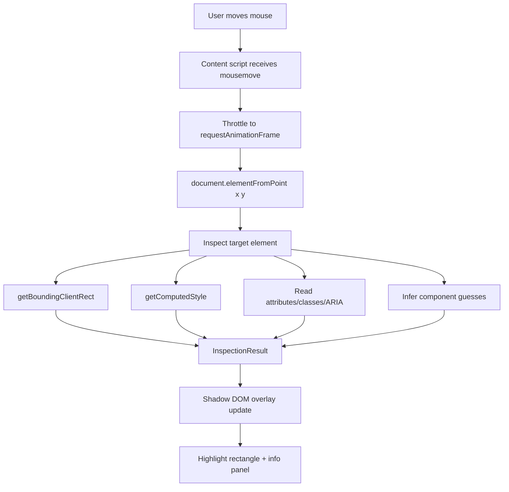
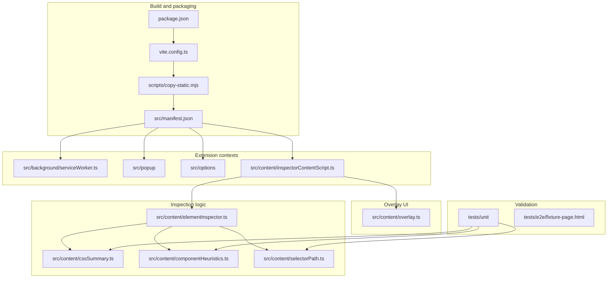
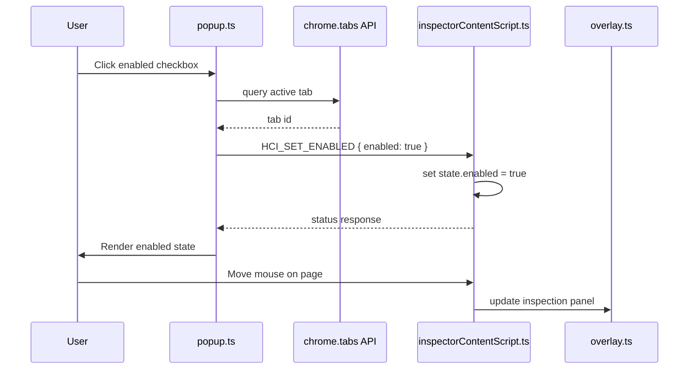

# Hover Component Inspector

The Hover Component Inspector is a small Chrome Manifest V3 extension that answers a simple question: *what am I pointing at, and why does it look that way?* When enabled, the extension watches the mouse cursor on a web page, finds the DOM element underneath it, draws a lightweight highlight rectangle, and shows an information panel with the element signature, possible component identity, selector hints, accessibility hints, dimensions, and a curated summary of computed CSS.

This note is a project report, but it is written as a teaching chapter. The interesting part of this project is not that a rectangle can be drawn over a page. The interesting part is the boundary between browser extension code, page DOM code, and developer-tool behavior. A useful overlay inspector has to see the page without becoming part of the page, explain CSS without dumping hundreds of properties, and infer component names without pretending the browser exposes framework component trees directly.

> [!summary]
> 1. The project produced a working TypeScript/Vite Chrome MV3 extension in `/home/manuel/code/wesen/2026-04-28--overlay-extenseion`.
> 2. The core runtime is a content script that uses `document.elementFromPoint`, `getBoundingClientRect`, and `getComputedStyle` to inspect the hovered element.
> 3. The overlay is rendered in a Shadow DOM container with `pointer-events: none`, so it is visually isolated and does not become the thing being inspected.
> 4. Component names are treated as evidence-backed guesses, not facts, because normal DOM APIs do not reliably expose React/Vue/Svelte component names.

## Why this project exists

Modern frontend interfaces are made out of layers. A button on the screen might be a design-system component, a route-specific component, a styled wrapper, a generated DOM node, a CSS module class, a utility class list, and an accessibility role all at once. Chrome DevTools can reveal those layers, but DevTools is often too heavy when the question is exploratory: *what is this thing?* or *which component family does this belong to?* or *what CSS is causing this spacing and color?*

The Hover Component Inspector exists as a page-level lens. It does not try to replace DevTools. It tries to make the first inspection step cheap. A user turns it on, moves the mouse, and immediately gets a small explanation of the element under the cursor.

The project began with a docmgr ticket named `CHROME-HOVER-OVERLAY`. The first deliverable was a detailed design and implementation guide for a new intern. The second deliverable was the actual extension. The repository now contains both the planning material in `ttmp/` and the extension implementation in `src/`.

The three commits that define the current project history are:

- `1b5ef75 docs: create hover overlay extension ticket`
- `3a50823 feat: implement hover overlay inspector extension`
- `0ecf9d0 docs: record implementation diary upload`

## Current project status

The project is in a working first-build state. It has a build system, a manifest, a content script, overlay rendering, popup controls, options page scaffolding, unit tests, a fixture page, and a validation command.

What already exists:

- Chrome Manifest V3 extension metadata in `src/manifest.json`.
- A content script in `src/content/inspectorContentScript.ts`.
- A Shadow DOM overlay renderer in `src/content/overlay.ts`.
- Element inspection aggregation in `src/content/elementInspector.ts`.
- CSS grouping and filtering in `src/content/cssSummary.ts`.
- Component-name heuristics in `src/content/componentHeuristics.ts`.
- Selector helpers in `src/content/selectorPath.ts`.
- Popup controls in `src/popup/`.
- Options page scaffolding in `src/options/`.
- Unit tests in `tests/unit/`.
- A manual fixture page in `tests/e2e/fixture-page.html`.
- A `npm run validate` command that runs tests, typechecking, build, and static asset copy.

What is still incomplete:

- Manual Chrome testing of the built `dist/` extension on real pages.
- Automated browser extension E2E tests.
- Copy-to-clipboard behavior for selectors or inspection JSON.
- A polished freeze-mode UI indicator.
- More precise framework-specific component integration.
- A final permission review before public distribution.

## The simplest mental model

A web page already has all the information the first version needs. The browser can answer these questions:

- Which element is under this viewport coordinate?
- What rectangle does that element occupy?
- What computed styles does the browser apply to it?
- What attributes, classes, and parent elements are nearby?

The extension is a loop around those questions.



There are two ideas to keep separate:

1. **Finding the target is a browser geometry problem.** The content script asks the document which element is under the cursor.
2. **Explaining the target is a summarization problem.** The inspector turns a noisy DOM/CSS object into a readable report.

Most mistakes in projects like this come from mixing those two responsibilities. If target detection tries to infer components, or if rendering code tries to know CSS heuristics, the extension becomes hard to modify. This implementation keeps the path fairly clean: the content script owns lifecycle, `elementInspector.ts` owns aggregation, helper modules own extraction logic, and `overlay.ts` owns rendering.

## Project shape

At a high level, the repository has five layers.



The build layer makes a `dist/` folder that Chrome can load as an unpacked extension. The extension-context layer maps to Chrome's runtime model: background service worker, popup, options page, and content script. The inspection layer is ordinary TypeScript that can mostly be understood without knowing Chrome APIs. The overlay layer is DOM UI code. The validation layer protects the pure logic and checks that the extension can be bundled.

## Architecture: where the code runs

Browser extensions are confusing at first because “the extension” is not one process with one global state. It is a set of scripts running in different contexts.

The current manifest declares four important contexts:

```json
{
  "manifest_version": 3,
  "background": {
    "service_worker": "background/serviceWorker.js",
    "type": "module"
  },
  "action": {
    "default_popup": "popup/popup.html"
  },
  "content_scripts": [
    {
      "matches": ["<all_urls>"],
      "js": ["content/inspectorContentScript.js"],
      "run_at": "document_idle",
      "all_frames": true
    }
  ]
}
```

The service worker is the extension's event background. It can respond to keyboard commands and talk to tabs, but it cannot directly inspect the page DOM. The popup is the little window that opens when the user clicks the extension icon. It can ask the active tab's content script to enable or disable inspection. The options page stores defaults. The content script is the only part that lives close enough to the page to ask DOM questions.

The architecture works because responsibilities are aligned with what each context can actually do.

| Context | File | What it can do | What it should not do |
|---|---|---|---|
| Manifest | `src/manifest.json` | Declare permissions, scripts, popup, commands | Contain runtime logic |
| Service worker | `src/background/serviceWorker.ts` | React to extension commands and message tabs | Inspect DOM elements directly |
| Popup | `src/popup/popup.ts` | Toggle state and update settings for active tab | Maintain page hover state |
| Options | `src/options/options.ts` | Save default CSS group preferences | Draw overlays |
| Content script | `src/content/inspectorContentScript.ts` | Read DOM/CSS and render overlay | Persist long-term global extension state |

This is the first important lesson from the project: a Chrome extension is designed around boundaries. If the code fights those boundaries, it becomes awkward. If the code follows them, the implementation stays small.

## The command path: from popup to page

When the user checks “Enabled on this tab” in the popup, the popup does not directly modify the page. It sends a message to the content script in the active tab.



The popup message type is part of a small protocol:

```ts
export type ExtensionMessage =
  | { type: 'HCI_GET_STATUS' }
  | { type: 'HCI_SET_ENABLED'; enabled: boolean }
  | { type: 'HCI_TOGGLE_ENABLED' }
  | { type: 'HCI_SET_FROZEN'; frozen: boolean }
  | { type: 'HCI_UPDATE_SETTINGS'; settings: Partial<InspectorSettings> }
  | { type: 'HCI_GET_LAST_INSPECTION' };
```

This protocol matters because browser extensions are distributed systems in miniature. Popup code and content-script code do not share a call stack. A checkbox change becomes a message. The message becomes a state transition. The state transition changes how later page events are interpreted.

The current popup implementation follows this pattern:

```ts
async function send(message: ExtensionMessage): Promise<ExtensionResponse> {
  const tabId = await activeTabId();
  if (!tabId) return { ok: false, error: 'No active tab' };

  try {
    return await chrome.tabs.sendMessage(tabId, message);
  } catch {
    return {
      ok: false,
      error: 'Content script is not available on this page. Try a normal http(s) tab.',
    };
  }
}
```

The error case is not a minor detail. Chrome does not run ordinary content scripts on every possible browser page. Extension pages, the Chrome Web Store, internal `chrome://` pages, and some special contexts behave differently. A good popup should explain that rather than silently failing.

## The hover loop

The content script is the project's center of gravity. It installs listeners, stores local tab state, receives messages, and schedules inspection work. Its most important design choice is that raw mouse events are not processed immediately. They are stored and consumed on the next animation frame.

```ts
function onMouseMove(state: State, event: MouseEvent): void {
  if (!state.enabled || state.frozen) return;
  state.pendingMouse = event;
  if (state.rafId == null) {
    state.rafId = requestAnimationFrame(() => processPendingMouse(state));
  }
}
```

This is the correct shape for hover inspection. Mouse events can arrive faster than the screen can paint. If the extension called `getComputedStyle` and rewrote overlay DOM for every raw event, it would do unnecessary work and could make the page feel worse. `requestAnimationFrame` ties inspection to the browser's rendering rhythm.

The processing step is small enough to read as pseudocode:

```ts
function processPendingMouse(state) {
  event = state.pendingMouse
  state.pendingMouse = null

  element = document.elementFromPoint(event.clientX, event.clientY)
  if element is null or overlay contains element:
      hide overlay
      return

  if element is the same as last element:
      reposition panel near cursor
      return

  inspection = inspectElement(element, state.settings)
  overlay.update(inspection, cursorPosition)
}
```

The same-element fast path is important. Once the user is moving inside a large card, the underlying element may not change. In that case, the extension should not recompute component guesses or CSS summaries. It can simply move the panel so it stays readable.

## The inspection result as the project's central data structure

The extension does not let every module invent its own representation of “what we found.” It uses an `InspectionResult`. That object is the boundary between analysis and presentation.

Conceptually, the object says:

```ts
InspectionResult = {
  signature,          // readable element signature
  tagName, id, classes,
  role, accessibleName, textPreview,
  selector,           // short, stable, full
  componentGuesses,   // scored evidence-backed guesses
  box,                // x/y/width/height and sides
  styles,             // grouped CSS summary
  context,            // shadow root, iframe, parent chain
  timestamp,
}
```

This is a useful design because the overlay does not need to know how component heuristics work. It receives guesses. The selector code does not need to know where the panel is displayed. It returns strings. The CSS summarizer does not need to know about mouse events. It returns grouped values.

The aggregation happens in `src/content/elementInspector.ts`:

```ts
export function inspectElement(element: Element, settings: InspectorSettings): InspectionResult {
  const rect = element.getBoundingClientRect();
  const root = element.getRootNode();

  return {
    signature: shortSelector(element),
    tagName: element.tagName.toLowerCase(),
    id: element.id || null,
    classes: Array.from(element.classList ?? []),
    role: element.getAttribute('role'),
    accessibleName: accessibleName(element),
    textPreview: textPreview(element),
    selector: {
      short: shortSelector(element),
      stable: stableSelector(element),
      full: fullSelector(element),
    },
    componentGuesses: settings.showComponentGuesses
      ? findComponentGuesses(element, settings.maxParentDepth)
      : [],
    box: metrics(rect),
    styles: summarizeStyles(element, settings),
    context: {
      shadowRoot: typeof ShadowRoot !== 'undefined' && root instanceof ShadowRoot,
      iframe: window.top !== window,
      parentChain: parentChain(element, settings.maxParentDepth),
    },
    timestamp: Date.now(),
  };
}
```

The function reads almost like a table of contents for the panel. That is usually a good sign. The aggregation layer should be boring. The interesting logic belongs in the helpers it calls.

## Overlay rendering: seeing the page without becoming the page

The overlay is both the most visible feature and the easiest place to make subtle mistakes. The overlay is inserted into the page DOM, but it should not behave like ordinary page content. It should not inherit the page's styles. It should not steal mouse events. It should not be announced constantly by screen readers. It should not become the element returned by `document.elementFromPoint`.

The implementation addresses those constraints in `src/content/overlay.ts`.

```ts
this.host = document.createElement('div');
this.host.id = 'hci-overlay-root';
this.host.setAttribute('aria-hidden', 'true');

const shadow = this.host.attachShadow({ mode: 'open' });
const style = document.createElement('style');
style.textContent = css();

const root = div('hci-root');
this.highlight = div('hci-highlight');
this.panel = div('hci-panel');

root.append(this.highlight, this.panel);
shadow.append(style, root);
document.documentElement.append(this.host);
```

There are three important choices here.

First, the overlay uses a Shadow DOM root. This isolates most overlay styles from page styles. A page can have aggressive CSS like `div { display: contents }` or `* { box-sizing: border-box }`; the extension should not become unreadable because of that.

Second, the overlay CSS begins with a reset-like boundary and disables pointer events:

```css
:host { all: initial; }
.hci-root {
  position: fixed;
  inset: 0;
  z-index: 2147483647;
  pointer-events: none;
}
```

`pointer-events: none` is not optional. Without it, the overlay can cover the page and become the thing under the cursor. Then the inspector starts inspecting itself, which creates flicker or useless results.

Third, the panel is filled with `textContent`, not `innerHTML`. This matters because the data being shown comes from the page: text previews, class names, attributes, and CSS values. Page-provided strings must be treated as text, not markup.

The highlight is positioned from the target's `getBoundingClientRect()`:

```ts
this.highlight.style.transform =
  `translate(${Math.round(left)}px, ${Math.round(top)}px)`;
this.highlight.style.width = `${Math.round(width)}px`;
this.highlight.style.height = `${Math.round(height)}px`;
```

`getBoundingClientRect()` returns viewport-relative coordinates, which pair naturally with `position: fixed`. That is why the overlay can ignore document scroll offsets for the basic rectangle. The browser has already done that coordinate conversion.

## CSS summarization: why computed style is useful but too large

The browser can provide computed CSS for an element with one call:

```ts
const computed = window.getComputedStyle(element);
```

That call is powerful, but the raw result is not a good UI. It includes a large number of properties, many of which are default values. A panel filled with `normal`, `none`, `auto`, and transparent backgrounds is technically correct but practically unhelpful.

The project therefore treats CSS inspection as summarization. The file `src/content/cssSummary.ts` defines groups:

- `layout`: display, position, dimensions, overflow, flex/grid alignment.
- `spacing`: margin and padding sides.
- `typography`: font family, size, weight, line height, letter spacing, text alignment.
- `color`: foreground, background, opacity.
- `border`: radius, border width/style/color, outline.
- `effects`: shadows, filters, transform, transition, animation.

The summarizer loops through selected properties, reads computed values, and hides noisy defaults.

```ts
export function shouldShowProperty(property: string, value: string): boolean {
  const trimmed = value.trim();
  if (!trimmed) return false;
  if (['none', 'normal', 'initial'].includes(trimmed)) return false;
  if (property === 'z-index' && trimmed === 'auto') return false;
  if (property === 'background-color' && isTransparent(trimmed)) return false;
  if ((property.includes('shadow') || property.includes('filter')) && trimmed === 'none') {
    return false;
  }
  return true;
}
```

This is the second important lesson from the project: developer tools do not merely expose data. They curate data. The difference between a useful inspector and an overwhelming inspector is often a few decisions about what not to show.

## Component identity: evidence, not certainty

The original product idea asked for “the name and CSS styling of the component under the mouse cursor.” CSS styling is directly observable through the DOM and CSSOM. Component name is not. If the page is written in React, Vue, Svelte, Angular, or a homegrown component system, the browser does not automatically preserve a clean public `ComponentName` field on each DOM element.

This means the extension must not claim more certainty than it has. The implementation uses component guesses. Each guess has:

- a name,
- a confidence level,
- a source category,
- evidence explaining where it came from.

The strongest signals are explicit attributes and custom elements:

```html
<button data-component="CheckoutSubmitButton">Pay now</button>
<my-date-picker id="start-date"></my-date-picker>
```

The extension can treat `data-component="CheckoutSubmitButton"` as high confidence because the page author explicitly named it. It can also treat `<my-date-picker>` as high confidence for a web component, because custom elements are named in the tag itself.

Other signals are weaker but still useful:

```html
<article class="pricing-card pricing-card--featured" data-testid="pricing-card-pro">
  <h2 class="pricing-card__title">Pro</h2>
</article>
```

Here the extension might infer `PricingCard` from the BEM-like class or `PricingCardPro` from the test ID. Those are not guaranteed framework component names, but they are excellent debugging clues.

The core heuristic function is intentionally modest:

```ts
export function findComponentGuesses(element: Element, maxDepth = 5): ComponentGuess[] {
  const guesses: ComponentGuess[] = [];
  let current: Element | null = element;
  let depth = 0;

  while (current && depth <= maxDepth && current !== document.body) {
    guesses.push(...guessesFromSingleElement(current, depth));
    current = current.parentElement;
    depth++;
  }

  const rank = { high: 0, medium: 1, low: 2 } as const;
  const byName = new Map<string, ComponentGuess>();

  for (const guess of guesses) {
    const existing = byName.get(guess.name);
    if (!existing || rank[guess.confidence] < rank[existing.confidence]) {
      byName.set(guess.name, guess);
    }
  }

  return Array.from(byName.values())
    .sort((a, b) => rank[a.confidence] - rank[b.confidence])
    .slice(0, 5);
}
```

The ancestor walk is important because the cursor often lands on a child node inside the component root. A user may hover the `<span>` inside a button, but the meaningful component clue is two ancestors up. The heuristic looks nearby without scanning the whole document.

The BEM parsing bug found during implementation is a good example of why tests matter. The first version parsed `pricing-card__title--large` as if the element name were `title--large`, producing `PricingCard.TitleLarge`. The correct interpretation is block `pricing-card`, element `title`, modifier `large`. The fix was to parse in stages:

```ts
const [withoutModifier, modifier] = className.split('--', 2);
const [block, element] = withoutModifier.split('__', 2);
```

This is not only a bug fix; it is a design lesson. When a naming convention has separators with different meanings, staged parsing is often clearer than one greedy regular expression.

## Selector generation: three kinds of usefulness

The inspector generates selector information because a developer often wants to copy something from the overlay into DevTools, a test, or a bug report. But “a selector” is not one thing.

There are at least three useful selector styles:

| Selector kind | Example | Why it exists |
|---|---|---|
| Short selector | `button#submit.Button.primary` | Easy for humans to read quickly. |
| Stable selector | `[data-testid="checkout-submit"]` | Better for tests and bug reports when available. |
| Full selector | `html > body > main > form > button:nth-of-type(2)` | More precise, but brittle. |

The implementation prefers stable attributes such as `data-testid`, `data-test-id`, `data-cy`, `data-component`, `aria-label`, and `name`. If no stable attribute exists, it can fall back to an ID, but generated-looking IDs are treated with suspicion.

This is a small piece of engineering taste: a selector is not merely something that matches. A good selector communicates intent. A generated ID with a hash may match today and fail tomorrow. A `data-testid` usually says the application authors intended this element to be identifiable.

## Build system and validation

The project uses TypeScript, Vite, and Vitest. The key scripts are in `package.json`:

```json
{
  "scripts": {
    "typecheck": "tsc --noEmit",
    "test": "vitest run",
    "build": "npm run typecheck && vite build && node scripts/copy-static.mjs",
    "validate": "npm run test && npm run build"
  }
}
```

The final validation command passed:

- 3 test files passed.
- 8 tests passed.
- TypeScript typecheck passed.
- Vite production build completed.
- Static extension assets were copied into `dist/`.

The build has one detail worth preserving. Vite may extract shared code into chunks. That is normal for web apps, but manifest-declared content scripts are easier to reason about when they are standalone. During implementation, the content script initially imported shared settings code, which caused Vite to emit a shared settings chunk. The fix was to duplicate the small settings helper inside the content-script entry point.

This is not aesthetically perfect, but it is operationally conservative. In extension work, the runtime loading model matters more than a tiny amount of deduplication.

## Implementation details

This section walks through the system as if rebuilding it from scratch.

### 1. Declare the extension

The manifest tells Chrome what exists. The current extension asks for storage, tab messaging, scripting/activeTab capabilities, and all-URL host permissions. It registers the content script on all URLs and all frames.

```json
{
  "permissions": ["storage", "activeTab", "scripting", "tabs"],
  "host_permissions": ["<all_urls>"],
  "content_scripts": [
    {
      "matches": ["<all_urls>"],
      "js": ["content/inspectorContentScript.js"],
      "run_at": "document_idle",
      "all_frames": true
    }
  ]
}
```

The broad host permission is convenient for a local developer tool because it makes the overlay available immediately. It is also the most important permission to reconsider before public release. A public Chrome Web Store extension with `<all_urls>` needs a clear privacy explanation.

### 2. Install one content-script runtime per page

The content script guards against duplicate installation:

```ts
if (!window.__hoverComponentInspectorInstalled) {
  window.__hoverComponentInspectorInstalled = true;
  void bootstrap();
}
```

This is a practical defensive measure. Single-page applications can live for a long time, and extension reloads can create surprising states during development. A global sentinel prevents multiple listener sets from stacking up in the same page.

### 3. Store local tab state

The content script keeps a small state object:

```ts
type State = {
  enabled: boolean;
  frozen: boolean;
  settings: InspectorSettings;
  overlay: InspectorOverlay;
  lastElement: Element | null;
  lastInspection: InspectionResult | null;
  pendingMouse: MouseEvent | null;
  rafId: number | null;
};
```

The state is intentionally local to the tab/frame. The extension does not need a centralized database of hover events. It needs to know whether this tab is enabled, which element was last inspected, and whether there is a pending animation-frame update.

### 4. Listen to messages and browser events

The content script listens to extension messages and page events:

```ts
chrome.runtime.onMessage.addListener((message, _sender, sendResponse) => {
  void handleMessage(state, message).then(sendResponse);
  return true;
});

window.addEventListener('mousemove', onMouseMove, { capture: true, passive: true });
window.addEventListener('scroll', refreshFrozenOrLast, { capture: true, passive: true });
window.addEventListener('resize', refreshFrozenOrLast, { passive: true });
window.addEventListener('keydown', onKeyDown, { capture: true });
```

The listener options are part of the design. `passive: true` tells the browser the listener will not cancel scrolling or mouse movement. `capture: true` helps the extension observe events even when page code later stops propagation.

### 5. Inspect only when useful

The hot path has three early exits:

1. If the inspector is disabled, ignore mouse events.
2. If the inspector is frozen, ignore new hover targets.
3. If the target element has not changed, reposition rather than recompute.

This keeps the extension lightweight. The browser page remains the primary application; the inspector is a guest.

### 6. Render safely

The overlay renderer creates DOM nodes and assigns `textContent`. It does not inject page-derived strings as HTML. It clamps the panel to the viewport. It uses `position: fixed`, a high z-index, and Shadow DOM styles. It marks itself `aria-hidden` because a rapidly changing debugging overlay should not be announced as normal page content.

This set of choices is what makes the overlay feel like a tool rather than like another web component inside the inspected page.

## What failed during implementation

The project had three instructive failures.

The first failure was BEM parsing. The original class parser used a greedy regular expression. It passed simple cases but failed on `pricing-card__title--large`. The fix was not a cleverer regex; it was a simpler parser that split modifiers before elements. This is a recurring rule: when syntax has meaningful separators, parse in the order the syntax defines.

The second failure was TypeScript configuration. The code compiled enough for tests to start, but typecheck revealed three issues:

- `CSS.escape` was typed as always present, so a conditional check looked suspicious to TypeScript.
- `chrome.storage.sync.get` returned `unknown`, requiring an explicit cast before merging settings.
- Vite's config type did not accept the `test` field until `defineConfig` came from `vitest/config`.

The third failure was build-shape awareness. The build passed, but inspecting the generated content script showed a shared chunk import. That might work in some extension contexts if declared correctly, but it is not the simplest reliable shape for this first version. The content-script entry point was changed so the built content script is standalone.

These failures are valuable because they show the difference between “application code that works in a dev server” and “extension code that loads correctly under the manifest model.”

## Current user-facing workflow

The development workflow is:

```bash
cd /home/manuel/code/wesen/2026-04-28--overlay-extenseion
npm install
npm run validate
```

Then load the extension:

1. Open `chrome://extensions`.
2. Enable Developer Mode.
3. Click **Load unpacked**.
4. Select `/home/manuel/code/wesen/2026-04-28--overlay-extenseion/dist`.
5. Open a normal `http(s)` page.
6. Click the extension action.
7. Enable the inspector.
8. Move the mouse over page elements.

The popup currently controls:

- whether the inspector is enabled for the active tab,
- whether the highlight is shown,
- whether the panel is shown,
- whether component guesses are shown,
- whether CSS variables are shown,
- whether the overlay uses the dark or light theme.

## Important project docs and artifacts

Repo-local documentation:

- `/home/manuel/code/wesen/2026-04-28--overlay-extenseion/README.md`
- `/home/manuel/code/wesen/2026-04-28--overlay-extenseion/ttmp/2026/04/28/CHROME-HOVER-OVERLAY--chrome-hover-overlay-component-and-css-inspector/index.md`
- `/home/manuel/code/wesen/2026-04-28--overlay-extenseion/ttmp/2026/04/28/CHROME-HOVER-OVERLAY--chrome-hover-overlay-component-and-css-inspector/design-doc/01-chrome-hover-overlay-component-and-css-inspector-design-and-implementation-guide.md`
- `/home/manuel/code/wesen/2026-04-28--overlay-extenseion/ttmp/2026/04/28/CHROME-HOVER-OVERLAY--chrome-hover-overlay-component-and-css-inspector/reference/01-diary.md`

reMarkable uploads:

- `/ai/2026/04/28/CHROME-HOVER-OVERLAY/CHROME-HOVER-OVERLAY - Chrome Hover Overlay Inspector Guide`
- `/ai/2026/04/28/CHROME-HOVER-OVERLAY/CHROME-HOVER-OVERLAY - Implementation Diary`

Important source files:

- `src/manifest.json`
- `src/content/inspectorContentScript.ts`
- `src/content/overlay.ts`
- `src/content/elementInspector.ts`
- `src/content/componentHeuristics.ts`
- `src/content/cssSummary.ts`
- `src/content/selectorPath.ts`
- `src/popup/popup.ts`
- `src/options/options.ts`
- `tests/unit/componentHeuristics.test.ts`
- `tests/unit/cssSummary.test.ts`
- `tests/unit/selectorPath.test.ts`
- `tests/e2e/fixture-page.html`

## Design principles that emerged

The project is small, but it produced several stable principles that apply to browser tooling more generally.

- A page-level tool should be a guest. It should avoid blocking events, avoid stealing pointer input, avoid polluting the accessibility tree, and avoid relying on page styles.
- A developer inspector should curate. Raw computed CSS is too large; useful CSS must be grouped and filtered.
- Component identity is evidence-based. Unless the framework exposes a public signal, component names are guesses with confidence and evidence.
- Extension contexts should match responsibilities. Popup toggles state; content script inspects DOM; service worker coordinates commands; options page saves defaults.
- Build output shape matters. A content script should be loaded in a way the manifest actually supports, not merely in a way the bundler happens to produce.

## Open questions

The first version is useful, but several decisions remain open.

- Should the extension keep `<all_urls>` host permissions, or should it move to `activeTab` and on-demand injection before public distribution?
- Should the freeze command toggle based on current content-script state instead of sending `HCI_SET_FROZEN` with `true` from the service worker?
- Should the options page broadcast setting changes to existing tabs, or is it acceptable for it to save defaults only?
- Should selectors and JSON inspection results be copyable from the popup, the overlay, or both?
- Should framework-specific component detection be added through optional probes, or should the extension stay DOM-only and conservative?
- Should CSS variables be a separate expandable group with prefix filters such as `--color`, `--space`, and `--font`?

## Near-term next steps

The next best work is not to add more heuristics immediately. The next best work is to run the tool in Chrome and watch how it behaves on real pages.

A good next sequence is:

1. Load `dist/` as an unpacked extension.
2. Test the fixture page and verify that the known elements produce the expected guesses.
3. Test several real applications with different CSS strategies: CSS modules, Tailwind, BEM, styled-components, and custom elements.
4. Record which panel fields are useful and which are noisy.
5. Add copy-to-clipboard for selector and inspection JSON.
6. Add E2E tests once the manual behavior is stable.
7. Revisit permissions before distributing beyond local use.

## Project working rule

The working rule for this project should be:

> Keep the inspector honest, local, and lightweight.

“Honest” means component names remain guesses unless backed by explicit evidence. “Local” means page data stays in the browser and is not sent to a server. “Lightweight” means the extension should not slow the page, steal interaction, or become harder to understand than the page it is inspecting.

That rule captures the spirit of the first version. The extension is useful because it makes the invisible structure of a page visible, but it remains careful about what it claims and how much it does.

## KB reviews

- [[KB-BATCH13-cozo-editor-structured-browser-tools]] (2026-05-11) — Batch D analysis; treated as the browser-overlay/inspection tooling case in the structured browser tools cluster.

## Related KB entries

**Tribal candidates** (not yet written / needs review):
- Page-level overlay as guest, not page owner (1/3).
- Inspection result as central curated data structure (1/3).
- Component identity as evidence, not certainty (1/3).

**On-Ramp candidates** (not yet written):
- Browser overlay inspection architecture (1/5 🌐).

