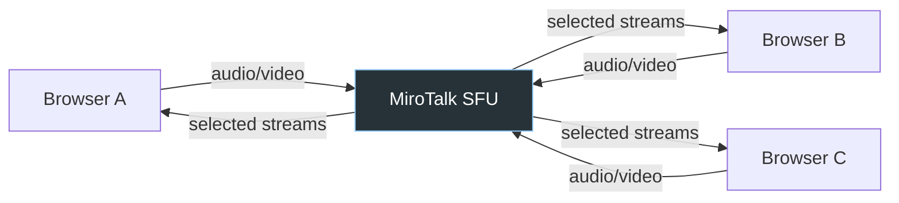
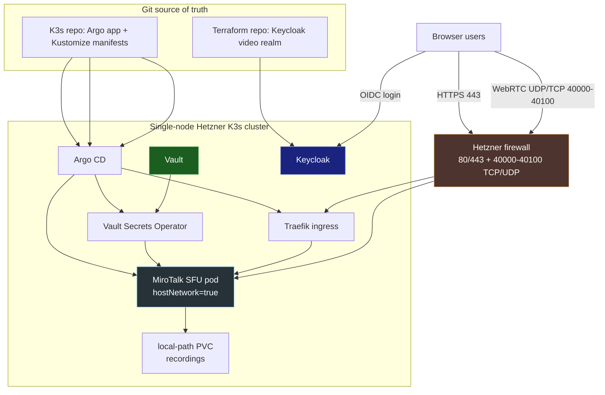
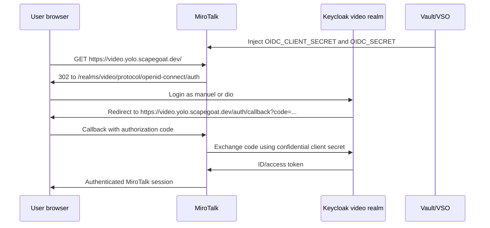

# MiroTalk SFU on K3s

This project installed **MiroTalk SFU** as a GitOps-managed video conferencing service on the single-node Hetzner K3s cluster. The public service lives at `https://video.yolo.scapegoat.dev`, uses Keycloak for login, stores sensitive runtime material in Vault, and exposes WebRTC media directly through the node firewall rather than pretending that video calls are just another HTTPS web application.

> [!summary]
> MiroTalk SFU is a browser-based video meeting server built on WebRTC and mediasoup. The deployment now has a dedicated Terraform-managed Keycloak `video` realm, a GitOps-managed Kustomize app, Vault-synced secrets, TLS through Traefik/cert-manager, and direct TCP/UDP media ports on the Hetzner node.
>
> The most important lesson from the project is architectural: the web page and the media packets are different paths. The UI goes through HTTPS ingress; the audio/video media must reach the SFU on its announced public address and RTC port range.

## Why this project exists

The cluster already had a pattern for normal web applications: put Kubernetes manifests under `gitops/kustomize/<app>`, create an Argo CD `Application` under `gitops/applications`, expose the app with Traefik ingress, and let cert-manager issue TLS certificates. That pattern works for HTTP applications because all important traffic is HTTP. A browser requests a page, Traefik proxies the request, and the app responds.

A real-time video system is different. The browser still downloads a web application over HTTPS, but the meeting itself is not just an HTTP response. Once two participants join a room, their browsers and the server negotiate WebRTC transports. Audio and video flow over RTP/RTCP through ICE-selected network candidates. That media flow is latency-sensitive, usually UDP-first, and cannot be solved merely by adding an Ingress object.

The project exists to put this more demanding kind of application onto the existing K3s cluster without losing the cluster's operating rules: Git remains the source of truth, secrets stay out of Git, identity is managed through Keycloak, and infrastructure changes are made through Terraform where possible.

## What MiroTalk SFU is

MiroTalk is a browser-based video conferencing application. The particular edition deployed here is **MiroTalk SFU**. SFU means **Selective Forwarding Unit**. The phrase is worth unpacking because it explains the shape of the deployment.

In a small peer-to-peer WebRTC call, each browser might send media directly to every other browser. That works for tiny calls, but it scales poorly. If five people join, each browser may have to upload several video streams. An SFU changes the topology: each browser sends its media once to the server, and the server forwards selected streams to the other participants. The SFU does not usually decode and re-encode every video frame like a heavy media mixer. It mostly receives streams and forwards them intelligently.



This is why the server must be reachable for media. The users do not merely need to reach `https://video.yolo.scapegoat.dev`; their browsers must also establish WebRTC transports to the address and ports that MiroTalk announces. In this deployment, the app listens on port `3010` for the web/signaling service and uses `40000-40100` for WebRTC media.

## Current project status

The deployment is active and live.

What is already in place:

- `video.yolo.scapegoat.dev` resolves to the Hetzner node public IPv4 address `91.98.46.169`.
- MiroTalk is deployed as a single pod in namespace `mirotalk-sfu`.
- Argo CD manages the app from `gitops/kustomize/mirotalk-sfu`.
- Traefik and cert-manager expose the HTTPS UI with a valid Let's Encrypt certificate.
- The pod uses `hostNetwork: true` so mediasoup can bind and announce direct node media ports.
- The Hetzner firewall allows TCP/UDP `40000-40100` for WebRTC media.
- Vault Secrets Operator syncs the runtime secret into `mirotalk-sfu-secret`.
- Keycloak has a dedicated Terraform-managed realm named `video`.
- Terraform manages the `mirotalk-sfu` OIDC client and the initial users `manuel` and `dio`.
- MiroTalk is configured to require OIDC login against `https://auth.yolo.scapegoat.dev/realms/video`.
- The latest media troubleshooting change announces `SFU_ANNOUNCED_IP=91.98.46.169` rather than the DNS name.

What is still being validated:

- Two-user media connectivity has not yet been proven after changing the announced SFU address to the public IP.
- Browser-side `chrome://webrtc-internals` evidence is still needed if the call continues to spin.
- Recording should be tested by an authenticated host user and verified under `/src/app/rec`.

## Project shape

There are two repositories involved.

The K3s/GitOps repository owns the Kubernetes and Hetzner-facing deployment:

```text
/home/manuel/code/wesen/2026-03-27--hetzner-k3s
  main.tf
  gitops/applications/mirotalk-sfu.yaml
  gitops/kustomize/mirotalk-sfu/
  scripts/bootstrap-mirotalk-sfu-runtime-secrets.sh
  vault/policies/kubernetes/mirotalk-sfu-prod.hcl
  vault/roles/kubernetes/mirotalk-sfu-prod.json
  ttmp/2026/04/28/HK3S-0027--install-mirotalk-sfu-on-k3s-via-argo-cd/
```

The Terraform Keycloak repository owns the dedicated identity realm:

```text
/home/manuel/code/wesen/terraform
  keycloak/apps/mirotalk-sfu/envs/k3s-parallel/
    main.tf
    variables.tf
    outputs.tf
    providers.tf
    versions.tf
    terraform.tfvars.example
```

This split is deliberate. Kubernetes resources belong to the K3s GitOps repo. Keycloak realm/client/user resources belong to the Keycloak Terraform repo. The runtime bridge between them is Vault: Terraform creates the OIDC client, the client secret is stored in Vault, and Vault Secrets Operator delivers it to the MiroTalk pod.

## Architecture

The system has four planes. They are easiest to understand separately.



### The control plane

The control plane is the declarative machinery that keeps the service in place. The K3s repo contains the Argo CD `Application`:

```yaml
source:
  repoURL: https://github.com/wesen/2026-03-27--hetzner-k3s.git
  targetRevision: main
  path: gitops/kustomize/mirotalk-sfu
```

Argo continuously reconciles that path into namespace `mirotalk-sfu`. This means manual cluster edits should be treated as temporary diagnostics unless they are later written back to Git.

### The web plane

The web plane is the familiar HTTP path:

```text
browser
  -> https://video.yolo.scapegoat.dev
  -> Traefik ingress on 443
  -> Service mirotalk-sfu:3010
  -> MiroTalk Express/Node server
```

This path proves that DNS, TLS, ingress, and the application server work. It does not prove media connectivity.

### The identity plane

The identity plane is Keycloak OIDC:

```text
anonymous browser
  -> MiroTalk
  -> 302 redirect to auth.yolo.scapegoat.dev/realms/video
  -> login as manuel or dio
  -> callback to /auth/callback
  -> MiroTalk session
```

The current OIDC settings live in `gitops/kustomize/mirotalk-sfu/configmap.yaml`:

```yaml
OIDC_ENABLED: "true"
OIDC_ISSUER: "https://auth.yolo.scapegoat.dev/realms/video"
OIDC_BASE_URL: "https://video.yolo.scapegoat.dev"
OIDC_CLIENT_ID: "mirotalk-sfu"
OIDC_AUTH_REQUIRED: "true"
```

The OIDC client itself lives in Terraform. The important resource is the browser client module under `../terraform/keycloak/apps/mirotalk-sfu/envs/k3s-parallel/main.tf`:

```hcl
module "browser_client" {
  source              = "../../../../modules/browser-client"
  realm_id            = module.realm.id
  client_id           = var.browser_client_id
  name                = "MiroTalk SFU"
  valid_redirect_uris = ["${local.public_app_url}/auth/callback"]
  web_origins         = [local.public_app_url]
}
```

### The media plane

The media plane is the tricky part. WebRTC does not simply reuse the HTTPS connection. MiroTalk's mediasoup worker creates transports and offers ICE candidates. The browser then tries to connect to one of those candidates.

The current media configuration is:

```yaml
SFU_ANNOUNCED_IP: "91.98.46.169"
SFU_LISTEN_IP: "0.0.0.0"
SFU_MIN_PORT: "40000"
SFU_MAX_PORT: "40100"
```

The deployment also uses host networking:

```yaml
spec:
  hostNetwork: true
  dnsPolicy: ClusterFirstWithHostNet
```

That design means the pod is not hidden behind only a Kubernetes Service for media. It can bind directly in the node network namespace, and the Hetzner firewall decides whether the outside world can reach those ports.

## Implementation details

### Why a normal Ingress was not enough

A common mistake is to deploy a video app like a blog or dashboard: create a deployment, create a service, create an ingress, and assume success once the page loads. For MiroTalk this produces a half-working system. Users can log in and join a room, but the media transport may never complete. The symptom is exactly the kind of behavior seen during testing: both users are authenticated, but one sees a spinner when the other joins, and no audio/video flows.

The reason is that there are two kinds of traffic:

| Traffic | Example | Managed by | Failure symptom |
|---|---|---|---|
| HTTPS UI and signaling | page load, login callback, room setup | Traefik Ingress on 443 | page does not load, login fails, API errors |
| WebRTC media | RTP/RTCP packets between browser and SFU | node firewall + mediasoup announced candidates | users join but cannot see/hear each other |

The Kubernetes `Service` named `mirotalk-sfu` exposes port `3010` for the web server. It is not the media exposure mechanism. The media exposure mechanism is the combination of `hostNetwork: true`, mediasoup's RTC port range, the public node IP, and the Hetzner firewall.

### The GitOps flow

The deployment path can be summarized as pseudocode:

```text
on git push to main:
    Argo CD reads gitops/applications/mirotalk-sfu.yaml
    Argo CD renders gitops/kustomize/mirotalk-sfu
    Argo CD applies namespace, service account, VSO objects, config, PVC, deployment, service, ingress
    cert-manager observes ingress and issues mirotalk-sfu-tls
    Vault Secrets Operator reads kv/apps/mirotalk-sfu/prod/runtime
    Vault Secrets Operator writes Kubernetes Secret mirotalk-sfu-secret
    Kubernetes starts or rolls the MiroTalk pod
```

This flow is why configuration changes need a pod-template annotation. A ConfigMap can change without Kubernetes restarting a pod that already read its environment. The deployment therefore carries a rollout annotation such as:

```yaml
rollout.wesen.dev/config-version: "2026-04-29-announce-public-ip"
```

Changing that annotation changes `spec.template`, which creates a new ReplicaSet and restarts the pod under Argo's control.

### The Keycloak flow

The dedicated `video` realm was created after an earlier temporary version used the shared `infra` realm. The current durable shape is better because it gives the video service its own identity boundary.



The users `manuel` and `dio` are represented in Terraform as `keycloak_user` resources. The `mirotalk-users` group is also represented in Terraform. At the moment, realm membership and successful login are the main access boundary; if the service later needs group enforcement, the next design step is to ensure group claims are emitted and checked either by MiroTalk or by an auth proxy.

### The media debugging flow

When a two-person call fails after login, do not start by debugging Keycloak. Login success already proves that the browser, ingress, and OIDC callback path work. Start with ICE.

The practical debugging loop is:

```text
if both users can log in but cannot see/hear each other:
    verify Argo and pod health
    verify DNS resolves to public node IP
    verify firewall allows UDP/TCP RTC range
    verify MiroTalk announces public IP, not a private address
    ask both browsers for chrome://webrtc-internals
    inspect selected ICE candidate pair
    if no candidate succeeds:
        suspect blocked UDP, wrong announced address, or need for TURN
```

The latest deployment changed `SFU_ANNOUNCED_IP` from `video.yolo.scapegoat.dev` to `91.98.46.169`. That is a targeted fix for candidate announcement. If calls still spin, the next useful evidence is not another Kubernetes manifest; it is the selected ICE candidate pair from both browsers while both users are in the room.

## Current user-facing behavior

The expected user path is:

1. Open `https://video.yolo.scapegoat.dev`.
2. MiroTalk redirects to Keycloak realm `video`.
3. Log in as a user managed by the Terraform Keycloak stack, currently `manuel` or `dio`.
4. Keycloak redirects back to `/auth/callback`.
5. MiroTalk opens the room UI.
6. A second authenticated user joins the same room URL.
7. Browsers negotiate WebRTC media through MiroTalk SFU.

The first five steps are working. The two-party media path is still under active validation after changing the announced SFU address to the public IP.

## Important project docs and commits

The docmgr ticket is the best chronological record:

```text
/home/manuel/code/wesen/2026-03-27--hetzner-k3s/ttmp/2026/04/28/HK3S-0027--install-mirotalk-sfu-on-k3s-via-argo-cd/
```

Important commits in the K3s repo:

- `7dac973` — deploy MiroTalk SFU via GitOps
- `03ff59c`, `50dee8a` — reduce the MiroTalk HTML watcher `EMFILE` log noise
- `78e7c27`, `6798185` — enable initial Keycloak OIDC login
- `1b3682e` — point MiroTalk OIDC at the dedicated `video` realm
- `5d77e42` — announce the public node IP for WebRTC
- `d0f0208` — record the current media troubleshooting diary step

Important commit in the Terraform repo:

- `f953160` — add the Terraform-managed MiroTalk Keycloak realm

## Failure modes and lessons learned

### Lesson 1: Authentication success is not media success

It is tempting to treat a successful login as evidence that the application works. For a WebRTC service, it proves only the application and identity planes. A user can authenticate, load the room UI, and still fail to receive media if ICE cannot establish a candidate pair.

### Lesson 2: Do not share raw MiroTalk startup logs casually

The stock MiroTalk startup log prints effective configuration, including OIDC client secret and JWT-related values. This is useful during debugging but dangerous in shared channels. If logs need to be preserved, redact secrets first.

### Lesson 3: ConfigMap changes do not restart pods

MiroTalk reads environment variables at process start. Changing a ConfigMap in Git does not by itself change the running process. The deployment needs a pod-template change, which this project handles with `rollout.wesen.dev/config-version`.

### Lesson 4: Terraform should own durable Keycloak state

The first Keycloak setup used manual `kcadm.sh` operations in the `infra` realm. That was useful for fast validation, but it was not durable. The final shape moved the realm, client, users, and group into the Terraform Keycloak repo.

### Lesson 5: Local user passwords in Terraform are sensitive state

Terraform can manage Keycloak users, but `initial_password` values become part of Terraform state. The S3 backend is encrypted, yet the state should still be treated as sensitive. For long-term operation, consider SSO or temporary passwords with rotation.

## Open questions

- Does the public-IP ICE announcement fix the two-person audio/video spinner?
- Do the users' networks allow UDP to `91.98.46.169:40000-40100`, or is a TURN server required?
- Should the `mirotalk-users` Keycloak group be enforced explicitly, or is membership in the `video` realm sufficient?
- Should `mirotalk/sfu:latest` be pinned to a digest after the first stable call test?
- What retention or backup policy should apply to local recordings?

## Near-term next steps

The next test should be a two-person browser test after the `SFU_ANNOUNCED_IP=91.98.46.169` rollout.

If the spinner remains, capture from both browsers:

```text
chrome://webrtc-internals
  -> selected ICE candidate pair
  -> candidate pair state
  -> local candidate type
  -> remote candidate address and port
  -> bytes sent / bytes received
```

The healthy target is a selected, nominated, succeeded candidate pair whose remote address is `91.98.46.169` and whose remote port is in `40000-40100`, with byte counters increasing.

If no candidate pair succeeds, the next likely project is a TURN deployment. TURN is the fallback relay that WebRTC uses when direct UDP/TCP connectivity fails. It is not needed when direct media works, but it becomes essential when users are behind restrictive NATs or networks that block arbitrary UDP.

## Project working rule

Treat MiroTalk as two systems sharing one UI: an ordinary HTTPS application and a real-time media server. Use Argo, Traefik, cert-manager, Vault, and Keycloak for the HTTPS and identity path. Use public IP announcement, cloud firewall rules, host networking, and WebRTC diagnostics for the media path. Mixing those two mental models is how this class of deployment becomes confusing.
