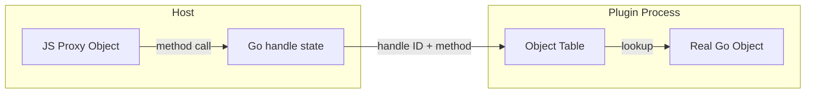
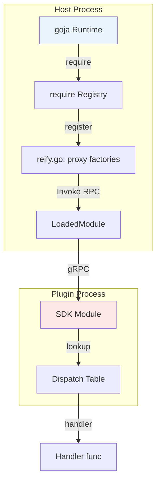
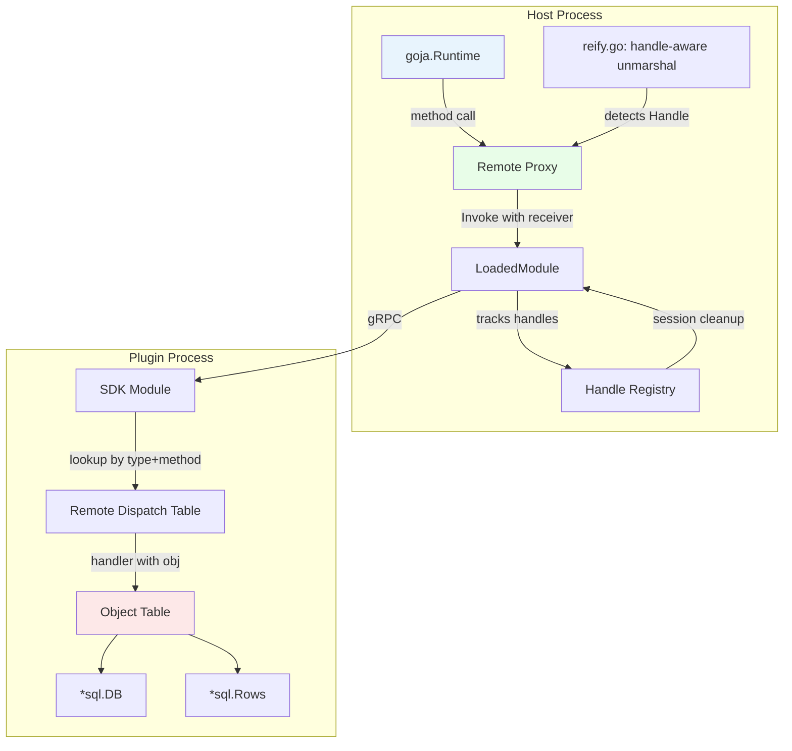

# RESEARCH PROPOSAL — Remote Capability Plugins for go-go-goja

> [!warning] Research Proposal
> This document describes a **proposed design** for remote capability plugins. It has not been implemented. The architecture, API surfaces, and protocol changes described here represent our best current understanding of what the system should look like, but they will evolve during implementation. Every code listing is pseudocode or a proposed interface, not running software.

This document is a research proposal for extending go-go-goja's plugin framework to support remote object references — the ability for plugins to create and manage long-lived objects that the JavaScript runtime can interact with across the process boundary. The core idea is a **capability membrane**: a security boundary where opaque, unguessable handles are the only way to refer to plugin-owned objects.

> [!summary]
> This proposal has three key ideas:
> 1. **Handles as first-class protocol values.** Plugin methods can return opaque tokens that refer to real Go objects living inside the plugin process. The host holds proxies, not pointers.
> 2. **A three-layer lifecycle.** Objects are cleaned up by explicit `close()`, then by session teardown, then by process death. No single layer is sufficient alone.
> 3. **Capability-based security.** Possession of a handle is the only way to call methods on the underlying object. Handles are 128-bit random strings stored in Go state, never in writable JavaScript properties.

The design is motivated by concrete use cases — database connections, file handles, image buffers — that the current stateless plugin protocol cannot express. It builds on the existing HashiCorp `go-plugin` gRPC transport already in production.

## Why this research exists

go-go-goja runs plugins as separate OS processes. This gives us crash isolation, language independence, and clean lifecycle management. But it also means that every plugin call today is stateless: you send a method name and JSON arguments, you get back a JSON result. There is no way for a plugin to say "I created a database connection — here, hold this reference, and call methods on it later."

This matters because many real-world plugin use cases are inherently stateful. A PostgreSQL plugin that opens a connection needs the caller to say `conn.query("SELECT ...")` on *that specific connection*. An image processing plugin that decodes a PNG into memory needs `img.resize(128, 128)` to operate on *that specific decoded image*. The current protocol cannot express "this function returned a thing you can call methods on."

The research question is: how do we add object identity to a stateless RPC protocol, without sacrificing the security and isolation properties that motivated out-of-process plugins in the first place?

## Current project status

**Status: Research proposal. No code has been written.**

What exists today:

- A fully functional stateless plugin system (`pkg/hashiplugin/`) with gRPC transport, protobuf contracts, SDK builders, and host-side Goja integration
- An intern research document on capability membranes and remote object handles (imported into ticket GOJA-060-HANDLE-REMOTE-REF)
- A detailed 2,300-line analysis/design/implementation guide in the ticket workspace
- 14 source files analyzed and related to the ticket
- 13 implementation tasks across 5 phases defined

What has not been built:

- No protobuf changes have been made
- No `ObjectTable` implementation exists
- No host-side proxy creation code exists
- No example plugin using remote references exists

## Core mental model

### The problem with stateless calls

Every plugin invocation in go-go-goja today follows one pattern. The JavaScript runtime calls a method, the host marshals the arguments into protobuf, sends them over gRPC to the plugin process, the plugin runs a handler, and the result comes back as a JSON-compatible value. The call is self-contained. Nothing persists between calls except what the plugin chooses to store in its own internal state.

This works beautifully for stateless services. A key-value store where every call is `set(key, value)` or `get(key)` doesn't need the caller to hold a reference to anything — the plugin manages its own internal map, and each call is independent.

But it breaks down the moment a plugin needs to create multiple distinct objects that the caller must differentiate. Consider a database plugin:

```javascript
const conn1 = pg.connect("postgres://db1.example.com");
const conn2 = pg.connect("postgres://db2.example.com");
conn1.query("SELECT * FROM users");  // must hit db1, not db2
```

In the current protocol, `pg.connect()` returns a `structpb.Value` — a JSON-compatible type. It can return a string, a number, a boolean, an array, or a map. It cannot return a reference to a live Go object. Even if we encoded some identifier as a string and sent it back, the `InvokeRequest` has no field for saying "call this method on *that* object." The protocol simply has no slot for object identity.

### Handles as the missing abstraction

The solution is to introduce a new first-class value type: the **Handle**. A handle is an opaque token that the plugin creates and the host holds. The host never interprets the token — it only passes it back to the plugin in future calls.

The relationship looks like this:



When `pg.connect()` is called, the plugin:

1. Creates a real `*sql.DB` object in its own memory.
2. Generates a random 128-bit identifier (the handle ID).
3. Stores the mapping `{handle_id → *sql.DB}` in its object table.
4. Returns the handle to the host.

The host receives the handle and creates a JavaScript proxy object — a Goja object with methods like `query()` and `close()`. The proxy holds the handle ID in Go state (not in JavaScript-visible properties). When the user calls `conn.query("SELECT ...")`, the proxy:

1. Extracts the handle ID from its internal Go state.
2. Sends an `Invoke` RPC with the handle as the `receiver`.
3. The plugin looks up the handle in its object table, finds the `*sql.DB`, and calls `.Query()`.
4. The result comes back as either a plain value or another handle.

This is the capability membrane: the host can only interact with plugin objects through handles, and handles are unguessable tokens that the plugin controls.

### Why not just use Go's `plugin` package?

Go's standard library `plugin` package loads `.so` shared libraries into the same process. This would let us pass real Go pointers across the plugin boundary. But it has severe limitations:

- It only works on Linux, FreeBSD, and macOS (no Windows).
- The host and plugin must be compiled with exactly the same Go version and dependency versions.
- It provides no crash isolation — a plugin segfault takes down the host.
- The Go race detector has known limitations with dynamically loaded code.

Out-of-process plugins with handle-based references give us the expressiveness of object references without sacrificing the isolation and compatibility guarantees that motivated the multi-process architecture.

## Architecture

### Before: the current system



The current flow is: JavaScript calls a method on a registered proxy object. `reify.go` marshals the arguments, calls `loaded.Invoke()` which sends a gRPC `Invoke(export_name, method_name, args)` to the plugin. The plugin looks up the handler in its dispatch table and returns a `structpb.Value` result.

The dispatch table key is `(exportName, methodName)`. There is no notion of a receiver — every call to `store.get("key")` goes to the same handler.

### After: with remote references



The new flow adds two paths:

1. **Handle return path:** When a plugin handler returns a `Handle`, the host detects this in `reify.go` and creates a JavaScript proxy object instead of converting the result to a plain JS value.

2. **Receiver-based dispatch path:** When JavaScript calls a method on a proxy object, the host sends an `Invoke` RPC with the `receiver` field set to the proxy's handle. The plugin routes the call through a separate dispatch table keyed by `(typeName, methodName)`, looks up the real Go object in its object table, and passes it to the handler.

A third new path exists for cleanup:

3. **Release path:** The host sends a `Release(handle)` RPC. The plugin removes the handle from its object table and calls the object's cleanup function.

## Project shape

The implementation touches four layers of the system:

1. **Protocol layer** (`pkg/hashiplugin/contract/`): New protobuf messages for `Handle`, `RemoteObjectSpec`, `ReleaseRequest`, and `ReleaseResponse`. The `InvokeRequest` gains an optional `receiver` field. The `InvokeResponse` becomes a `oneof` (value or handle). A new `Release` RPC joins the service.

2. **Plugin SDK layer** (`pkg/hashiplugin/sdk/`): A new `ObjectTable` type manages handle-to-object mappings. New `RemoteObject()`, `RemoteMethod()`, and `AutoClose()` builders let plugin authors declare object types. The dispatch system gains a parallel remote dispatch path for receiver-based calls.

3. **Host layer** (`pkg/hashiplugin/host/`): The `reify.go` file gains handle-aware result unmarshaling. When a handle arrives, it creates a Goja proxy object with methods derived from the manifest's `RemoteObjectSpec`. The `LoadedModule` gains handle tracking and a `ReleaseAll()` method for session cleanup.

4. **Integration layer**: Session cleanup hooks into the existing `engine.Runtime.AddCloser()` mechanism. TypeScript type generation (`gen-dts`) learns to produce class types for remote objects.

## Implementation details

### The protobuf contract

The entire plugin protocol is defined in a single protobuf file at `pkg/hashiplugin/contract/jsmodule.proto`. Today it defines two RPCs — `GetManifest` and `Invoke` — plus message types for manifests, export specs, method specs, and invoke request/response pairs.

The proposed changes add three new message types and modify two existing ones.

The most important new type is `Handle`: a pair of a random object ID and a type name. The object ID is a 128-bit hex string generated by the plugin's `ObjectTable`. The type name must correspond to a `RemoteObjectSpec` in the plugin's manifest — this is how the host knows what methods the handle supports.

```protobuf
message Handle {
  string object_id = 1;   // random 128-bit hex string
  string type = 2;        // e.g. "pg.Conn", "fs.FileHandle"
}
```

The `InvokeResponse` changes from a simple `google.protobuf.Value result = 1` to a `oneof`:

```protobuf
message InvokeResponse {
  oneof result {
    google.protobuf.Value value = 1;   // plain JSON-compatible result
    Handle handle = 2;                  // remote object reference
  }
}
```

This is wire-compatible with the old format because field number 1 still carries the value type. Old plugins set `value`, new plugins can set either `value` or `handle`.

A new `Release` RPC tells the plugin to destroy a handle:

```protobuf
rpc Release(ReleaseRequest) returns (ReleaseResponse);

message ReleaseRequest {
  Handle handle = 1;
}

message ReleaseResponse {}
```

And the `InvokeRequest` gains an optional `receiver` field:

```protobuf
message InvokeRequest {
  string export_name = 1;
  string method_name = 2;
  repeated google.protobuf.Value args = 3;
  Handle receiver = 4;   // NEW: when set, dispatches to a specific object instance
}
```

When `receiver` is present, the plugin ignores `export_name` and instead routes the call through the remote dispatch table using the handle's type and the method name.

### The Object Table

The `ObjectTable` is the plugin-side data structure that maps handle IDs to real Go objects. It lives entirely inside the plugin process and is never serialized or sent over the wire.

The key design decisions:

- **128-bit random IDs** rather than sequential integers. Sequential IDs are guessable. If JavaScript code can craft `{object_id: 5}`, it can access other sessions' objects. A 128-bit random string makes fabrication computationally infeasible.
- **Per-table mutex** to protect concurrent access. gRPC handlers run on different goroutines, and multiple simultaneous `Invoke` calls can hit the table at the same time.
- **Optional closer function** per entry. When an object is registered, the plugin can provide a cleanup function (e.g., `func() error { return db.Close() }`). This runs when the handle is released.

Pseudocode for the core operations:

```go
type ObjectTable struct {
    mu   sync.Mutex
    objs map[string]*objectEntry
}

// Put registers a Go object and returns a Handle.
func (t *ObjectTable) Put(obj any, typeName string, closer func() error) *Handle {
    id := random128Bits()       // crypto/rand
    t.mu.Lock()
    t.objs[id] = &objectEntry{obj: obj, typeName: typeName, closer: closer}
    t.mu.Unlock()
    return &Handle{ObjectId: id, Type: typeName}
}

// Get retrieves the Go object for a handle.
func (t *ObjectTable) Get(h *Handle) (any, error) {
    t.mu.Lock()
    entry, ok := t.objs[h.ObjectId]
    t.mu.Unlock()
    if !ok {
        return nil, fmt.Errorf("handle not found")
    }
    return entry.obj, nil
}

// Remove deletes the handle and calls its cleanup function.
func (t *ObjectTable) Remove(h *Handle) error {
    t.mu.Lock()
    entry, ok := t.objs[h.ObjectId]
    delete(t.objs, h.ObjectId)
    t.mu.Unlock()
    if !ok {
        return fmt.Errorf("handle not found")
    }
    if entry.closer != nil {
        return entry.closer()
    }
    return nil
}
```

The table also has a `ReleaseAll()` method that removes every entry and calls all cleanup functions. This is used during session teardown.

### The plugin author's API

A plugin author declares remote object types using the SDK's builder pattern. This mirrors the existing `Object()` builder but applies to dynamically-created instances instead of singletons.

Here is what a PostgreSQL plugin might look like:

```go
func main() {
    objects := sdk.NewObjectTable()

    sdk.ServeModule("plugin:pg",
        sdk.Version("v1"),
        sdk.Capabilities("database", "handle-remote-ref"),

        // Static function that creates a connection object
        sdk.Function("connect", func(ctx context.Context, call *sdk.Call) (any, error) {
            dsn, _ := call.String(0)
            db, err := sql.Open("postgres", dsn)
            if err != nil {
                return nil, err
            }
            // Register the connection as a remote object
            handle := objects.Put(db, "pg.Conn", func() error {
                return db.Close()
            })
            return handle, nil   // SDK detects *contract.Handle
        }),

        // Remote object type: pg.Conn
        sdk.RemoteObject("pg.Conn",
            sdk.AutoClose(),
            sdk.RemoteMethod("query", func(ctx context.Context, obj any, call *sdk.Call) (any, error) {
                db := obj.(*sql.DB)
                query, _ := call.String(0)
                rows, _ := db.QueryContext(ctx, query)
                handle := objects.Put(rows, "pg.Rows", func() error { return rows.Close() })
                return handle, nil
            }),
        ),

        // Remote object type: pg.Rows
        sdk.RemoteObject("pg.Rows",
            sdk.AutoClose(),
            sdk.RemoteMethod("next", func(ctx context.Context, obj any, call *sdk.Call) (any, error) {
                rows := obj.(*sql.Rows)
                if !rows.Next() {
                    return nil, nil   // no more rows
                }
                // decode row...
                return row, nil
            }),
        ),
    )
}
```

Notice the pattern: a static function (`connect`) creates a real Go object, registers it in the object table, and returns the handle. The SDK detects that the return value is a `*contract.Handle` and sends it as the `handle` variant of the `InvokeResponse` oneof.

Remote methods receive the real Go object as their second argument. The SDK handles the handle lookup — the plugin author just writes a type assertion and calls methods on the real object.

### The host-side proxy

When the host receives a `Handle` in an `InvokeResponse`, it creates a Goja proxy object. This proxy is the JavaScript-side representation of the remote object. It has:

- **Typed methods** derived from the `RemoteObjectSpec` in the manifest. If the spec declares `query`, `close`, and `ping`, the proxy has exactly those methods.
- **A `close()` method** if `auto_close` is set. This sends a `Release` RPC.
- **Internal Go state** holding the handle and a reference to the loaded module. This state is not accessible from JavaScript.

The key security property is that the handle ID lives in Go state, not in JavaScript properties. The proxy's Goja object does not have `__handleId` or `__remoteType` properties. JavaScript code cannot read the handle, cannot forge it, and cannot pass it to the wrong plugin.

Pseudocode for proxy creation:

```go
func makeRemoteProxy(vm *goja.Runtime, loaded *LoadedModule, handle *Handle) goja.Value {
    spec := findRemoteObjectSpec(loaded.Manifest, handle.Type)
    obj := vm.NewObject()
    state := &proxyState{handle: handle, released: false}

    for _, method := range spec.Methods {
        name := method.Name
        obj.Set(name, func(call goja.FunctionCall) goja.Value {
            args := marshalArgs(call.Arguments)
            resp, err := loaded.Invoke(ctx, &InvokeRequest{
                Receiver:   state.handle,
                MethodName: name,
                Args:       args,
            })
            if err != nil {
                panic(vm.NewGoError(err))
            }
            return unmarshalResponse(vm, resp)  // recursively handles handles
        })
    }

    if spec.AutoClose {
        obj.Set("close", func(goja.FunctionCall) goja.Value {
            if state.released { return vm.ToValue(nil) }  // idempotent
            loaded.Release(ctx, &ReleaseRequest{Handle: state.handle})
            state.released = true
            return vm.ToValue(nil)
        })
    }

    return obj
}
```

The recursive call to `unmarshalResponse` means that if a remote method returns another handle, the host automatically creates a new proxy. This is how `conn.query()` returns a `rows` proxy, and `rows` behaves like a real object with its own methods.

### Handle lifecycle: the three layers

Resource leaks are the primary operational risk of this design. An unclosed database connection, an unreleased file handle, an image buffer left in memory — these accumulate over the lifetime of a REPL session and eventually cause problems.

The design uses a defense-in-depth approach with three cleanup layers.

**Layer 1: Explicit `close()`.** The user calls `conn.close()` in JavaScript. This sends a `Release` RPC, the plugin removes the handle from its object table, and the cleanup function runs. This is the normal, expected path. Documentation should emphasize it.

**Layer 2: Session teardown.** When a REPL session ends, the `engine.Runtime` calls all registered closers. The host's closer calls `ReleaseAll()` on every loaded module, which sends `Release` RPCs for every tracked handle. This catches handles that the user forgot to close.

**Layer 3: Process death.** If the host process crashes, the plugin subprocess (managed by `go-plugin`) also dies. The operating system reclaims all resources — file descriptors, memory, network connections. This is the last resort.

```mermaid
flowchart TD
    subgraph Layer 1 - Explicit
        A[JS: conn.close] -->|Release RPC| B[ObjectTable.Remove]
        B -->|cleanup func| C[db.Close]
    end

    subgraph Layer 2 - Session
        D[Runtime shutdown] -->|closer hook| E[ReleaseAll]
        E -->|Release all handles| F[Cleanup all objects]
    end

    subgraph Layer 3 - Process
        G[Host crash] -->|go-plugin health check| H[Plugin exits]
        H -->|OS reaps| I[FDs + memory freed]
    end

    style A fill:#e8fde8
    style D fill:#fde8e8
    style G fill:#fde8e8
```



No single layer is sufficient. Layer 1 depends on user discipline. Layer 2 depends on clean shutdown. Layer 3 is always available but leaves no opportunity for graceful cleanup. Together, they cover the full spectrum of operational scenarios.

### Security model

A handle is a **capability** in the object-capability sense: possession of the handle grants the right to call methods on the underlying object. The design enforces this through three mechanisms.

First, handles are **unguessable**. Each handle ID is a 128-bit random string generated with `crypto/rand`. There are 2^128 possible IDs. An attacker who can observe one handle ID gains negligible information about other handles in the same or different sessions.

Second, handles are **opaque from JavaScript**. The proxy object stores the handle ID in Go state (`proxyState`), not in Goja-visible properties. JavaScript code cannot read `conn.__handleId` because that property does not exist. JavaScript code cannot forge a handle because it never sees the format.

Third, handles are **scoped**. A handle from `plugin:pg` is meaningless to `plugin:redis`. The host routes each call to the correct plugin based on which `LoadedModule` created the proxy. Handles from a previous REPL session are invalid because the plugin process has been restarted.

The anti-patterns to avoid are:

- Storing handle IDs as JavaScript properties (writable, forgeable).
- Using sequential integer IDs (guessable).
- Trusting handle values received from JavaScript arguments.
- Sharing handles across plugin boundaries.

## Important project docs

The primary design artifact is a 2,300-line analysis, design, and implementation guide stored in the go-go-goja ticket workspace:

- **Ticket:** `GOJA-060-HANDLE-REMOTE-REF` in `ttmp/2026/04/28/GOJA-060-HANDLE-REMOTE-REF--add-handle-remote-ref-capability-membrane-support-for-go-go-goja-plugins/`
- **Design doc:** `design/01-remote-reference-capability-membrane-analysis-design-implementation-guide.md`
- **Diary:** `reference/01-diary.md`
- **Intern research:** `sources/local/remote-ref.md`
- **Proto diff helper:** `scripts/01-proto-diff.sh`

The design doc covers 20 sections: problem statement, glossary, current system walkthrough, gap analysis, solution design, architecture diagrams, protobuf changes, SDK changes, host changes, lifecycle management, security model, error handling, async integration, TypeScript generation, testing strategy, migration plan, implementation phases, file-by-file change list, API reference, and references.

## Key source files to understand

The existing plugin system lives in `pkg/hashiplugin/`. Understanding these files is prerequisite for the implementation:

| File | What it does |
|------|-------------|
| `contract/jsmodule.proto` | The protobuf service definition — the single source of truth for the wire protocol |
| `contract/contract.go` | The Go `JSModule` interface agreed upon by host and plugin |
| `sdk/module.go` | Plugin SDK: `NewModule`, `MustModule`, the builder pattern |
| `sdk/dispatch.go` | Dispatch table construction and the `Invoke` method |
| `sdk/convert.go` | Result encoding via `structpb.Value` — the JSON-compatible value path |
| `sdk/export.go` | `Function()`, `Object()`, `Method()` builders |
| `host/reify.go` | The most important host file — creates Goja proxy objects from manifests |
| `host/client.go` | `LoadedModule` type, plugin subprocess lifecycle |
| `host/registrar.go` | Discovery → loading → registration pipeline |
| `shared/plugin.go` | gRPC bridge: `grpcServer` and `grpcClient` adapters |
| `plugins/examples/kv/main.go` | A stateful singleton plugin — the best reference for current patterns |

## Implementation phases

The proposal organizes implementation into five phases over approximately 14 working days.

**Phase 1 (Days 1–3): Foundation.** Update the protobuf contract, regenerate Go code, add the `Release` method to the `JSModule` interface, implement the `ObjectTable`, and write unit tests. The validation criterion is a passing test that creates an object table, puts an object, gets it back, and removes it.

**Phase 2 (Days 4–5): Plugin SDK.** Add `RemoteObject`, `RemoteMethod`, and `AutoClose` builders. Update the dispatch system for receiver-based calls. The validation criterion is a test plugin that returns a handle from a function call.

**Phase 3 (Days 6–8): Host integration.** Update `reify.go` with handle-aware unmarshaling and proxy creation. Add handle tracking and session cleanup to `LoadedModule`. The validation criterion is a REPL session that receives a handle, calls methods on the proxy, and closes it.

**Phase 4 (Days 9–10): Example and documentation.** Create a reference plugin that uses remote refs. Update `gen-dts` for remote object type generation.

**Phase 5 (Days 11–14): Polish.** Add best-effort Go finalizers for leak detection, capability checking, fuzz tests, and performance benchmarks.

## Open questions

- **Callback handles.** The current design is host→plugin only. What happens when a plugin needs to call back into the host (e.g., a progress callback)? The research document suggests "reverse handles" but this is not yet designed.

- **Async operations.** The initial implementation is synchronous — `conn.query()` blocks until the result arrives. For long-running operations, we could expose promise-based APIs (`conn.queryAsync()`), but this requires careful integration with Goja's single-threaded execution model. This is deferred to a later phase.

- **Handle ID format.** The proposal uses 128-bit hex strings (32 characters). Is this overkill? A 64-bit random integer would be simpler and still provide ~18 quintillion possible values. The tradeoff is between security margin and protocol overhead.

- **Streaming results.** For queries that return large result sets, sending all rows in a single response may be inefficient. A streaming RPC pattern could return rows incrementally, but this adds significant complexity.

- **Multi-plugin handle passing.** Can one plugin return a handle that another plugin created? This would require a handle translation layer or a shared object table. The current design scopes handles to a single plugin.

## Near-term next steps

1. Begin Phase 1: update `jsmodule.proto`, regenerate Go code, implement `ObjectTable`.
2. Create a minimal test plugin that returns a handle, to validate the end-to-end path early.
3. Decide on the `InvokeResponse` `oneof` backward-compatibility strategy before committing to the proto change.
4. Write a concrete example plugin (a simple counter or connection pool) to stress-test the SDK API.

## Project working rule

> [!important]
> This is a research proposal. Do not treat any API, protocol, or code listing as final.
> Validate every design decision with a prototype before committing to the full implementation.
> Prefer incremental proto changes over a single large migration.

