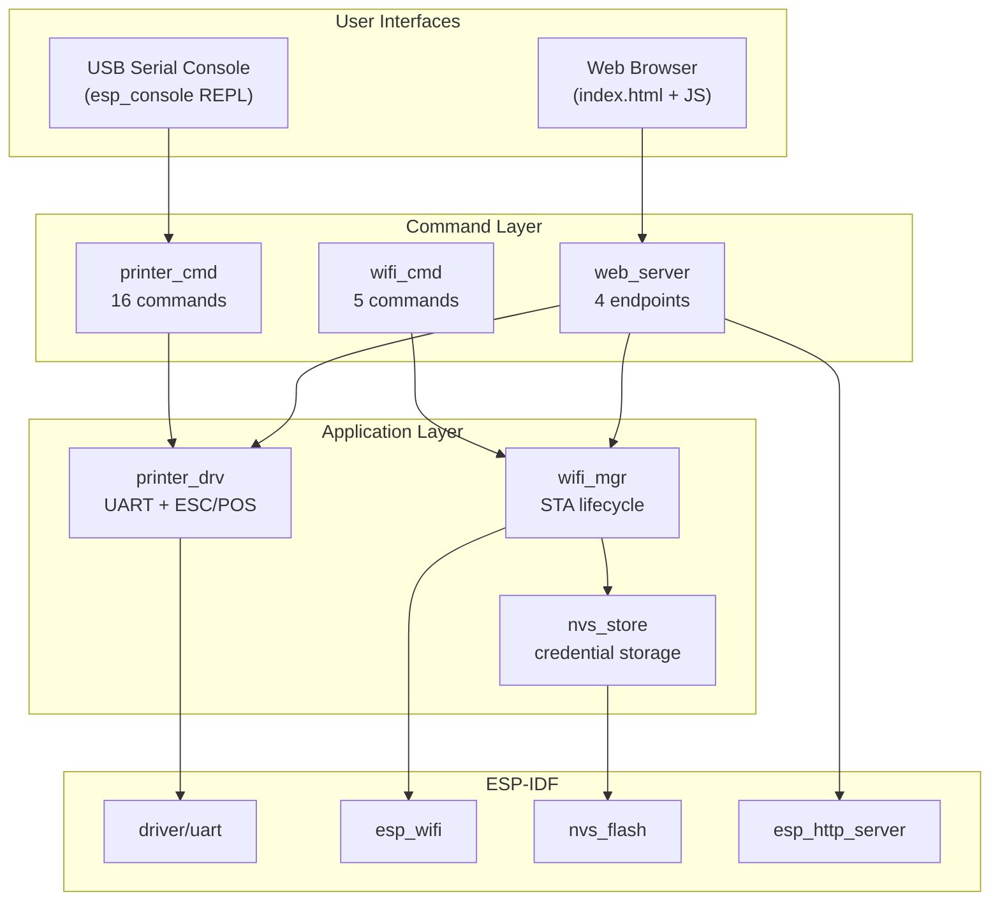

# SToMS3R — AtomS3R Lite Thermal Printer Firmware

SToMS3R ("Screw This, On My S3R") is an ESP-IDF firmware for the M5Stack AtomS3R Lite that drives a K118 58mm thermal printer through both a USB serial console and a browser-based web UI. The name is a backronym — earlier attempts to build this firmware on the ATOM Lite (ESP32-PICO-D4) ran into pin conflicts, memory limits, and a general sense that the wrong board was chosen. The AtomS3R Lite solves all three problems: its USB Serial/JTAG peripheral frees every UART pin for the printer, its 8 MB of PSRAM removes bitmap memory constraints, and the ESP-IDF framework gives direct access to the UART driver without Arduino abstraction layers.

> [!summary]
> The project has three important identities:
> 1. **A console-driven thermal printer controller** — 16 `esp_console` commands for text, barcodes, QR codes, bitmaps, and WiFi management, accessible over USB serial.
> 2. **A web UI with browser-side image processing** — a single embedded HTML page that does Floyd-Steinberg dithering in JavaScript, then POSTs raw 1-bit bitmaps to the ESP32 for streaming to the printer. The ESP32 does zero image processing.
> 3. **A diagnostic toolkit** — `printer_probe` queries the printer's status registers, `printer_swap` flips TX/RX at runtime, `printer_baud` changes the serial speed, all without reflashing.

## Related research

- [[ARTICLE - Deep Research - Thermal Receipt Printer Banding Under Low Serial Feed]] — the imported source research report on serial underfeed, thermal-head physics, paper transport, power integrity, host pacing, and horizontal banding.
- [[ARTICLE - Thermal Receipt Printers - K118 Mechanics Commands and Firmware Control]] — the longer textbook-style synthesis that connects the research report, K118 command reference, original Arduino firmware, and SToMS3R firmware design.

## Why this project exists

The M5Stack K118 thermal printer kit ships with an Arduino firmware designed for the ATOM Lite. That firmware works, but it has several limitations that become apparent as soon as you try to extend it: the Arduino framework hides the ESP32's UART capabilities behind `HardwareSerial`, the ATOM Lite's USB-UART bridge consumes GPIO pins that overlap with the printer's UART, and 520 KB of SRAM with no PSRAM makes bitmap printing a squeeze.

The AtomS3R Lite is a natural upgrade for three reasons. First, the ESP32-S3 has a built-in USB Serial/JTAG peripheral — a console path that consumes zero GPIO pins. Second, 8 MB of PSRAM means you can buffer full-page bitmaps without thinking about heap pressure. Third, ESP-IDF gives you `esp_console` (line editing, history, tab completion, argument parsing) as a first-class component, which means an interactive REPL takes about twenty lines of setup code.

This project also exists to answer a specific engineering question: *where should image processing happen when the compute device is a microcontroller?* The answer turned out to be "in the browser." A JavaScript canvas can decode a JPEG, resize it to 384 pixels wide, run Floyd-Steinberg dithering, and pack bits into bytes in milliseconds. The ESP32 then receives a raw 1-bit bitmap and streams it to the printer's UART — a task that requires no image processing, no PSRAM, and very little code.

## Current project status

The firmware is functionally complete and builds cleanly (880 KB binary, 79% partition space free). It has been flashed to hardware and communicates with the printer over UART. The web UI serves on port 80 when WiFi is connected.

What works:

- Console commands for text, feed, bold, font size, alignment, barcodes, QR codes, and bitmap test patterns
- WiFi scan, connect (with NVS persistence), disconnect, forget, and auto-connect on boot
- Web UI with text print, image upload with dithering preview, and 9 bitmap test patterns
- Runtime diagnostics: `printer_probe`, `printer_swap`, `printer_baud`, `printer_raw`
- Streaming bitmap endpoint that buffers the full HTTP body before writing to UART (avoids stripe artifacts from TCP read gaps)

What still needs verification on hardware:

- Print quality and alignment (test patterns will help here)
- QR code rendering correctness (the 3-step ESC/POS sequence should be validated against actual output)
- Long-running stability (power supply, thermal management, memory leaks under sustained use)

## Project shape

The firmware is organized as six modules, each with a clear responsibility:

| Module | Files | What it does |
|--------|-------|--------------|
| `app_main` | `app_main.c` | Entry point: init NVS, netif, WiFi, printer UART, start console REPL and web server |
| `printer_drv` | `printer_drv.c/.h` | UART driver: ESC/POS command builders, raw byte send, bitmap streaming |
| `printer_cmd` | `printer_cmd.c/.h` | 16 `esp_console` commands, argtable3 argument parsing, diagnostic tools |
| `wifi_mgr` | `wifi_mgr.c/.h` | WiFi STA lifecycle: scan, connect, disconnect, auto-reconnect, event handling |
| `wifi_cmd` | `wifi_cmd.c/.h` | 5 `esp_console` commands for WiFi management |
| `nvs_store` | `nvs_store.c/.h` | Thin NVS wrapper for persisting WiFi SSID and password |
| `web_server` | `web_server.c/.h` | HTTP server: static HTML, text print endpoint, bitmap streaming endpoint, status API |
| `index.html` | (embedded) | Web UI: text form, image drop zone, Floyd-Steinberg dithering, test patterns |

Total: 2,291 lines of C and HTML across 14 source files.

## Architecture

The system has four layers, each communicating only with the layer below it:



### Data flow: printing a bitmap from the browser

This is the most interesting path through the system, because it crosses every layer:

```mermaid
flowchart LR
    subgraph Browser
        IMG["Image file\n(JPEG/PNG)"] --> CV["Canvas API\nresize to 384px"]
        CV --> GRAY["Grayscale\n0.299R + 0.587G + 0.114B"]
        GRAY --> DITH["Floyd-Steinberg\ndithering"]
        DITH --> PACK["Bit packing\n8 pixels → 1 byte\nMSB first"]
    end

    subgraph ESP32
        HTTP["POST /api/print/bitmap\nbody = raw bytes"] --> BUF["Buffer in heap\n(zero processing)"]
        BUF --> HDR["Send GS v 0 header\n8 bytes to UART"]
        HDR --> STREAM["uart_write_bytes\nentire bitmap\nsingle call"]
    end

    subgraph Printer
        UART_RX["UART receiver\n9600 baud"] --> HEAD["Thermal head\n384 heating dots"]
    end

    PACK -->|"HTTP POST\nX-Width, X-Height\nheaders"| HTTP
    STREAM -->|"UART1\nGPIO8→RX"| UART_RX
```



The key design decision here is that the ESP32 does no image processing. It receives raw 1-bit bitmap bytes, sends an 8-byte GS v 0 header to the printer, then writes all the pixel data to the UART in a single `uart_write_bytes()` call. The UART driver's internal ring buffer (2048 bytes) queues the data, and the UART ISR drains it continuously at 9600 baud. This produces a continuous stream with no gaps — which matters because gaps in the UART data cause the printer to insert horizontal stripes.

## Implementation details

### The UART bottleneck and why streaming strategy matters

At 9600 baud, sending one byte takes approximately 1.04 milliseconds (1 start bit + 8 data bits + 1 stop bit = 10 bit times, at 1/9600 seconds per bit). A full-width bitmap row is 48 bytes (384 pixels / 8), so one row takes about 50 ms. A 200-line test pattern is 9,600 bytes, which takes about 10 seconds to transmit.

This is slow enough that the *strategy* for feeding the UART matters a lot. The original M5Stack Arduino firmware sends bitmap data one byte at a time through Arduino's `HardwareSerial::write(uint8_t)`, which writes into a ring buffer and returns immediately. The ring buffer and UART ISR handle the actual transmission. No gaps.

Our first attempt at the ESP-IDF firmware tried to stream bitmap data from the HTTP body in 512-byte chunks: read a chunk from TCP, write it to UART, read the next chunk, write it, repeat. This produced horizontal stripes in the printed output. The problem was that the TCP reads (`httpd_req_recv`) introduced gaps between UART writes. At 9600 baud, the printer's internal controller treats a gap as a data boundary, and it advances the paper by a partial line — creating a visible white stripe.

The fix was to separate the "read from network" phase from the "write to UART" phase entirely:

```
1. Read entire HTTP body into heap memory (one malloc, one tight recv loop)
2. Send GS v 0 header to UART
3. Call uart_write_bytes(buf, full_length) once
4. The UART ring buffer (2048 bytes) and ISR handle the rest
```

This mirrors the original firmware's approach. The `uart_write_bytes()` call blocks when the ring buffer is full, and unblocks as the ISR drains bytes. From the printer's perspective, the data arrives as one continuous stream with no gaps.

### The GPIO pin mapping problem

The K118 thermal printer kit was designed for the ATOM Lite, which uses the ESP32-PICO-D4. The kit's cable connects to the bottom header of the ATOM Lite at positions that map to GPIO23 (TX), GPIO33 (RX), and GPIO19 (CTS). When you plug the same cable into the AtomS3R Lite, the physical header positions map to completely different GPIO numbers: GPIO8, GPIO7, and GPIO6 respectively.

This is not obvious from the datasheets. The first version of the firmware used GPIO5 and GPIO6 (the HY2.0-4P connector pins), which produced no output at all — the cable wasn't connected to those pins. The correct mapping was:

| Header position | ATOM Lite GPIO | AtomS3R Lite GPIO | Function |
|----------------|---------------|-------------------|----------|
| Pin 1 | GPIO23 | GPIO8 | TX (ESP32 → printer) |
| Pin 2 | GPIO33 | GPIO7 | RX (printer → ESP32) |
| Pin 3 | GPIO19 | GPIO6 | CTS (clear to send) |

There was a further complication: the cable is *straight-through* (pin 1 on the controller connects to pin 1 on the printer carrier board), not crossed. This means ESP32 TX (GPIO8) connects to the printer's TX line, not its RX line. The firmware handles this by swapping TX and RX in software at boot time using `uart_set_pin()`, which is equivalent to a crossover in hardware but requires no physical rewiring.

### The web UI as image processing offload

The web UI lives in a single `index.html` file (7.6 KB) that is embedded into the firmware binary at compile time using ESP-IDF's `EMBED_TXTFILES` mechanism. When a browser requests `/`, the ESP32 serves this file from flash memory — no filesystem needed.

The image processing pipeline runs entirely in the browser:

1. **Load and resize.** The user drops an image (or picks a file). A `FileReader` reads it as a data URL, an `Image` object decodes it, and `canvas.drawImage()` resizes it to 384 pixels wide while preserving aspect ratio.

2. **Convert to grayscale.** The `getImageData()` API returns RGBA pixel values. Luminance is computed with the standard NTSC weights: `gray = 0.299 * R + 0.587 * G + 0.114 * B`.

3. **Floyd-Steinberg dithering.** This converts the continuous grayscale image to a 1-bit (black/white) image by spreading quantization error to neighboring pixels. For each pixel, the algorithm compares the current grayscale value to a threshold (128). If it's darker, the pixel becomes black; otherwise, white. The difference between the original value and the threshold (the "error") is distributed to four neighbors with weights 7/16, 3/16, 5/16, and 1/16. This produces much better results than simple thresholding because it preserves the illusion of intermediate gray levels through dot density.

4. **Bit packing.** The 1-bit pixel array is packed into bytes, 8 pixels per byte, MSB first. Pixel 0 corresponds to bit 7 (0x80), pixel 7 to bit 0 (0x01). This matches the ESC/POS raster bitmap format.

5. **POST to ESP32.** The packed bitmap is sent as the raw body of a POST request, with `X-Width` and `X-Height` custom headers. The ESP32 reads the full body into heap memory, sends the GS v 0 header, then streams the bitmap to UART.

### The ESC/POS protocol

The thermal printer speaks a subset of the ESC/POS protocol — a byte-oriented command set developed by Epson for point-of-sale printers. Commands start with either ESC (0x1B) or GS (0x1D), followed by a command byte and parameters. All communication is over UART at 9600 baud, 8 data bits, no parity, 1 stop bit.

The most important commands for this project:

| Command | Bytes | What it does |
|---------|-------|--------------|
| Initialize printer | `1B 40` | Reset to power-on defaults |
| Print text | raw ASCII + `0A` | Send characters, then line feed |
| Feed N lines | `1B 64 n` | Advance paper by n lines |
| Set bold | `1B 45 n` | n=1 on, n=0 off |
| Set font size | `1D 21 n` | n = (height << 4) \| width, each 0–7 |
| Set alignment | `1B 61 n` | 0=left, 1=center, 2=right |
| Print barcode | `1D 6B m n d1..dn` | Type m, length n, then data bytes |
| Print QR code | 3-step GS ( k sequence | Set EC level, store data, print |
| Print bitmap | `1D 76 30 m xL xH yL yH d1..dk` | Raster image, MSB-first, 1-bit |

The QR code command is the most complex. It uses a three-step sequence under the GS ( k function group. First, set the error correction level (a single byte indicating L/M/Q/H). Second, store the QR data (a header with the data length, followed by the raw bytes). Third, trigger the print. The total overhead for a short URL is about 25 bytes of command framing around 20 bytes of data.

### The NVS persistence layer

WiFi credentials are stored in ESP-IDF's Non-Volatile Storage (NVS), which is a key-value store in a dedicated flash partition. The firmware uses a "wifi" namespace with two keys: `ssid` and `password`. On boot, the firmware checks NVS for saved credentials and auto-connects if found.

NVS has a few properties worth understanding:

- Keys must be 15 characters or shorter.
- String values are limited to 4000 bytes (more than enough for SSID and password).
- Writes must be committed with `nvs_commit()` — without it, a power loss before the next automatic commit will lose the data.
- If NVS has never been initialized (first boot), `nvs_flash_init()` returns `ESP_ERR_NVS_NO_FREE_PAGES`. The firmware handles this by erasing and reinitializing NVS.

### The console REPL

The `esp_console` component provides a surprisingly complete interactive shell with very little setup code. It handles line editing (backspace, cursor movement), command history (up/down arrows, configurable depth), tab completion for command names, and argument parsing via the `argtable3` library.

The setup pattern is:

```c
// Create the REPL configured for USB Serial/JTAG
esp_console_repl_t *repl = NULL;
esp_console_repl_config_t repl_cfg = ESP_CONSOLE_REPL_CONFIG_DEFAULT();
repl_cfg.prompt = "stoms3r> ";
esp_console_dev_usb_serial_jtag_config_t hw_cfg =
    ESP_CONSOLE_DEV_USB_SERIAL_JTAG_CONFIG_DEFAULT();
esp_console_new_repl_usb_serial_jtag(&hw_cfg, &repl_cfg, &repl);

// Register commands from each module
printer_cmd_register();
wifi_cmd_register();

// Start — this call blocks forever
esp_console_start_repl(repl);
```

Because `esp_console_start_repl()` blocks, the web server must be started from a separate FreeRTOS task that polls for WiFi connectivity before launching the HTTP server.

## Current user-facing commands

### Console (USB Serial/JTAG)

**Printer commands:**

| Command | Description |
|---------|-------------|
| `printer_init` | Reset printer (ESC @) |
| `printer_text <text>` | Print a line of text |
| `printer_feed [n]` | Feed n lines (default 3) |
| `printer_size <0-7>` | Set font size |
| `printer_bold <on\|off>` | Enable/disable bold |
| `printer_align <0\|1\|2>` | Left/center/right alignment |
| `printer_barcode <type> <data>` | Print barcode |
| `printer_qr <text>` | Print QR code |
| `printer_bitmap_test` | Print test pattern (alternating lines) |
| `printer_probe` | Query printer status and diagnose connection |
| `printer_swap <on\|off>` | Swap TX/RX pins at runtime |
| `printer_baud <rate>` | Change UART baud rate |
| `printer_raw <hex>` | Send raw hex bytes |

**WiFi commands:**

| Command | Description |
|---------|-------------|
| `wifi_scan` | Scan for nearby access points |
| `wifi_connect --ssid <s> --pass <p>` | Connect and save credentials |
| `wifi_status` | Show connection state and saved SSID |
| `wifi_disconnect` | Disconnect from WiFi |
| `wifi_forget` | Erase saved credentials |

### Web UI (port 80)

- `GET /` — Serves the interactive HTML page
- `GET /api/status` — JSON with WiFi state, IP, printer baud, swap state
- `POST /api/print/text` — Accepts `{"text":"..."}`, prints the text
- `POST /api/print/bitmap` — Accepts raw 1-bit bitmap body with `X-Width`/`X-Height` headers
- 9 test pattern buttons: Full Black, Full White, H Bars, V Bars, Gradient, Checker, Gray Levels, Border, Diagonal

## Common failure modes and what we learned

### "Printer produces no output" — wrong GPIO pins

The first firmware version used GPIO5/GPIO6 (the HY2.0-4P connector). The K118 cable doesn't connect to those pins — it uses the other side of the bottom header. On the AtomS3R Lite, that's GPIO8/GPIO7/GPIO6. The `printer_probe` diagnostic command was instrumental in diagnosing this: it queries the printer's status registers (DLE EOT n) and reports clearly whether the printer responded.

### "Printer only prints a colon" — broken JSON parsing

The `POST /api/print/text` handler parsed the JSON body with a chain of `strstr` and `strchr` calls. A bug in the pointer arithmetic caused it to extract the colon between the key and the value (`:`) instead of the value itself. The TX hex logging (`I (19036) printer_drv: TX 1 bytes: 3A`) immediately revealed the problem — 0x3A is the ASCII code for `:`. The fix was to walk past the key, find the colon, then find the opening and closing quotes of the value.

### "Bitmap has horizontal stripes" — gaps in UART stream

The first bitmap streaming approach interleaved TCP reads with UART writes: read 512 bytes from HTTP, write to UART, read next 512 bytes, write to UART. The TCP reads introduced gaps in the UART stream (even 50 ms is enough at 9600 baud for the printer to interpret it as a line break). The original Arduino firmware avoided this by writing one byte at a time into a ring buffer — the UART ISR drains it continuously with zero gaps. The fix was to read the entire HTTP body into heap memory first, then make a single `uart_write_bytes()` call with the full bitmap. The UART driver's ring buffer handles the flow, and the printer sees a continuous stream.

## Open questions

- **Printer baud rate negotiation.** The printer defaults to 9600 baud, which is very slow for bitmap printing (10 seconds for a 200-line image). Some printers support ESC/POS baud-rate-change commands, but the K118's support is unverified. If it works, we could increase to 19200 or 38400 after initialization.
- **Hardware flow control.** CTS is wired (GPIO6) but currently unused. Enabling hardware flow control would let the printer signal when its internal buffer is full, preventing data loss during sustained printing. This needs testing.
- **QR code rendering.** The 3-step ESC/POS QR sequence (set EC level → store data → print) uses specific byte encodings (`pL = len + 3`, `cn = 49`, `fn = 80/81`). These should be validated against actual printed output to confirm the K118's dialect matches the M5Stack Arduino library's assumptions.
- **Large image handling.** Currently the full bitmap is buffered in heap memory before sending to UART. For very tall images (thousands of lines), this could exhaust heap. A streaming approach that reads from HTTP and writes to UART in a tight loop would work if the HTTP body can be read faster than 9600 baud — which it can, since WiFi is orders of magnitude faster.

## Near-term next steps

- Run the 9 test patterns and verify print alignment, density, and stripe-free output
- Test text printing from the web UI with the fixed JSON parser
- Test QR code printing and scan the result with a phone
- Verify auto-connect on boot works across power cycles
- Consider enabling CTS hardware flow control for reliability
- Investigate baud rate increase for faster bitmap printing

## Important project docs

| Document | Location |
|----------|----------|
| Design & implementation guide (2017 lines) | `ttmp/.../design-doc/01-stoms3r-complete-design-and-implementation-guide.md` |
| Diary (Steps 1–4) | `ttmp/.../reference/01-diary.md` |
| Tasks (39 tasks, 8 phases) | `ttmp/.../tasks.md` |
| Original K118 research (ticket 0090) | `0090-m5printer-research/` |
| ATOM Lite ESP-IDF provision (ticket 0092) | `0092-m5-printer-esp-idf-provision/` |
| ESC/POS technical deep dive | `0090-m5printer-research/docs/TECHNICAL-DEEP-DIVE.md` |
| ReMarkable uploads | `/ai/2026/04/28/STOMS3R-001/` |

## Project working rule

> When adding a new printer command, check the ESC/POS command reference in the K118 research ticket (0090) first. The printer implements a subset of the full ESC/POS specification, and not all documented commands work. When in doubt, test with `printer_raw <hex>` before writing a dedicated command.
