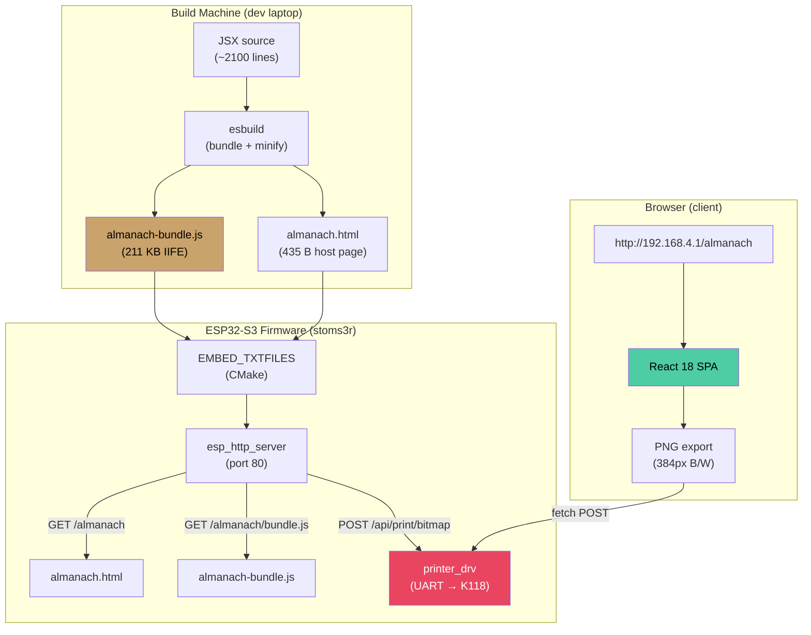
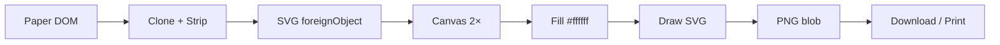
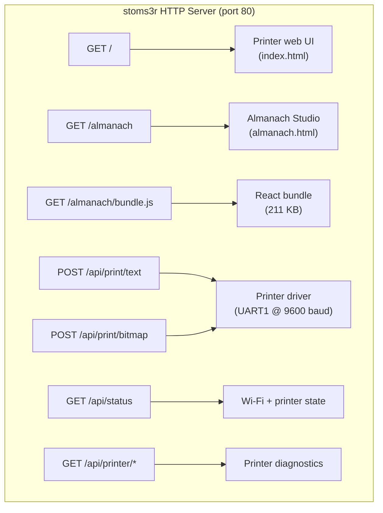

 
# Almanach Studio — A Self-Hosted Thermal Almanac Designer for ESP32

This article is a deep technical report on Almanach Studio: a React single-page application that runs on an ESP32-S3 thermal printer firmware, served over Wi-Fi to any browser on the local network. It explains the full system — the React component architecture, the build pipeline that compiles JSX into a firmware-embeddable JavaScript bundle, the ESP32 HTTP server that serves it, and the thermal-printer-specific adaptations that make the output printable on a 58mm monochrome printer.

The article is written for someone who needs to understand how the system works end to end, modify it, or apply the same pattern to a different embedded project. It assumes familiarity with C, JavaScript, and basic HTTP, but does not assume prior experience with ESP-IDF, React, or esbuild.

> [!summary]
> - Almanach Studio is a ~2100-line React JSX component compiled into a single 211 KB minified IIFE bundle, embedded in ESP32 firmware via `EMBED_TXTFILES`, and served at `/almanach` by `esp_http_server`.
> - The build pipeline uses esbuild (not Webpack, not Babel) for sub-second JSX compilation, tree-shaking of Lucide icons, and IIFE bundling that works without ES module support.
> - All rendered output is pure monochrome (#000 on #fff) with zero gray values, zero grain texture, and zero opacity — because a thermal printer can only lay down black dots or not.
> - A font scale slider (1.0×–2.0×, default 1.6×) lets the user increase body text for readable thermal output without changing the title size.
> - The stoms3r firmware's existing `/api/print/bitmap` endpoint provides the bridge from the browser's PNG export to the physical printer.

---

## Why This Project Exists

The [[ARTICLE - Thermal Receipt Printers - K118 Mechanics Commands and Firmware Control|SToMS3R firmware]] drives a K118 thermal printer from an M5Stack AtomS3R (ESP32-S3) over UART. It already had an HTTP server that could print text and bitmaps sent from a simple web page. But the web page was basic — just a text box and a file drop zone. There was no way to compose a rich daily digest page with weather, news, habits, quotes, and calendars, then print it directly.

Almanach Studio fills that gap. It is a full visual layout editor — think Canva, but designed for 58mm thermal paper — that runs entirely in the browser. The user designs their almanac page on their phone or laptop, then exports it as a PNG and prints it through the firmware's existing bitmap API.

The key constraint is that the AtomS3R has no internet access when running in SoftAP mode (acting as a Wi-Fi hotspot). Everything — the React runtime, the icons, the component code — must be embedded in the firmware binary. No CDN, no Babel in the browser, no runtime JSX transform. The SPA must be precompiled to plain JavaScript at build time.

---

## System Architecture

The system has four layers, each with a clear responsibility:



Each arrow in the diagram represents a dependency. The build machine produces two static files. The firmware embeds them and serves them over HTTP. The browser fetches them, runs the React app, and can send a printed bitmap back to the firmware. No layer knows more than it needs to.

---

## The React Component

The heart of the system is a single JSX file: `almanach-studio.jsx`, approximately 2100 lines. It is a self-contained React component with no external CSS, no router, and no state management library. Its only imports are React itself and 30 Lucide icons.

### Data Model

The component's state is an array of **blocks**. Each block is a plain JavaScript object with three fields:

```javascript
{
  id: "a1b2c3d",       // random UID for React keys
  type: "plan",         // one of 15 block types
  data: {               // type-specific content
    label: "Today's Plan",
    items: [
      { time: "08:30", text: "Morning routine", done: true },
      { time: "09:30", text: "Deep work: Project Atlas", done: false },
    ]
  }
}
```

The 15 block types fall into four groups:

| Group | Types | Purpose |
|-------|-------|---------|
| Header | title, date, divider | Page identification and structure |
| Daily | plan, news, weather, note | Time-sensitive daily content |
| Trackers | habits, mood, reading, reflection | Personal metrics and journaling |
| Knowledge | quote, word, history, did_you_know | Educational and inspirational content |

The layout state lives in a single `useState` hook:

```javascript
const [blocks, setBlocks] = useState(STARTER_BLOCKS);
```

All mutations — add, delete, reorder, edit content — produce a new array and pass it to `setBlocks`. This is standard React immutable-state practice. There is no Redux, no Zustand, no context. For a single-page tool with one user, this is sufficient.

### Themes

Six visual themes define the rendering appearance:

| Theme | Key Characteristic |
|-------|--------------------|
| Classic | Double-line ornate border frame |
| Minimal | Clean, generous spacing |
| Botanical | Corner ❦ decorations |
| Notebook | Handwritten-style fonts, ruled lines |
| Vintage Ledger | Boxed sections |
| Space Age | Dark background (originally — now forced to white for printing) |

Each theme is an object with colors (`ink`, `muted`, `accent`, `rule`, `paper`), fonts (`fontDisplay`, `fontBody`), title styling, and feature flags (`ornateFrame`, `botanical`, `lined`, `boxed`, `space`). For thermal printing, all themes are forced to pure monochrome: every color field is `#000000`, paper is `#ffffff`, and grain is `0`.

### Block Renderers

Each block type has a dedicated renderer component. The renderers are pure functions of their `data` prop and the current `theme`. They produce inline-styled JSX — no CSS classes, no stylesheets. This keeps the component self-contained and eliminates any need for a CSS bundler.

A simplified example — the DateBlock renderer:

```javascript
const DateBlock = ({ data, theme }) => (
  <div style={{
    fontFamily: theme.fontBody,
    fontSize: theme.fs(12),       // scaled by bodyScale
    color: theme.ink,
    textAlign: "center",
    borderTop: `1px solid ${theme.rule}`,
    borderBottom: `1px solid ${theme.rule}`,
  }}>
    {data.date}
    <span style={{ margin: "0 8px", color: theme.muted }}>|</span>
    {data.day}
  </div>
);
```

The `theme.fs(N)` helper scales font sizes by the user's chosen body scale factor (default 1.6×). The title block's `theme.titleSize` is exempt from scaling — only body text, labels, and secondary text are scaled. This means a 12px base font becomes 19.2px at 1.6×, which is readable on thermal paper at 203 DPI.

### Font Scale Slider

The font scale is a `bodyScale` state variable, defaulting to 1.6. It is exposed as a slider in the right rail:

```javascript
const [bodyScale, setBodyScale] = useState(1.6);
const fsRaw = (base) => Math.round(base * bodyScale * 10) / 10;
const theme = { ...THEMES[themeKey], bodyScale, fs: fsRaw };
```

The `fs` function is attached to the theme object so every block renderer can call `theme.fs(baseFontSize)` without receiving it as a separate prop. This was a practical decision: the renderers already receive `{ data, theme }`, and adding a third prop to all 15 renderers would be a larger refactor with no architectural benefit.

The body scale is persisted in the JSON save/load format alongside `themeKey` and `paperWidth`, so a saved layout remembers its font scale.

### PNG Export

The PNG export is the bridge between the browser and the thermal printer. It works by:

1. Deep-cloning the paper DOM node
2. Stripping interactive chrome (block controls, selection highlights) and zigzag edge SVGs
3. Serializing the clone as XHTML inside an SVG `foreignObject`
4. Rendering the SVG to a canvas at 2× resolution
5. Filling the canvas background with `#ffffff` first (no transparency)
6. Encoding as PNG and triggering a download

The critical detail for thermal printing is step 5. Without the white background fill, transparent areas in the zigzag torn-edge SVGs would render as the canvas background color — which is the dark editor chrome, not white. The export also strips the zigzag SVGs entirely, producing a clean rectangular image.



---

## The Build Pipeline

The build pipeline transforms JSX into a single JavaScript file that can be served by the ESP32's HTTP server. It uses esbuild — not Babel, not Webpack, not Vite — for one reason: speed and simplicity.

### Why esbuild

The JSX file imports from `react`, `react-dom`, and `lucide-react`. These packages live in `node_modules/`. The ESP32 cannot serve `node_modules/` — it can only serve static files embedded in the firmware. So everything must be bundled into one file.

esbuild does four things in a single pass:

- **Resolves imports** — follows `import React from "react"` into `node_modules/react/` and `node_modules/react-dom/`, inlining the runtime
- **Transforms JSX** — converts `<div style={...}>` into `React.createElement("div", { style: ... })` without a separate Babel step
- **Tree-shakes** — only includes the 30 Lucide icons actually used, not the entire icon library
- **Minifies** — compresses variable names, removes whitespace, eliminates dead code

The entire build takes ~150ms. The output is a single file, 211 KB minified, in IIFE format:

```javascript
var AlmanachStudio = (() => {
  // React runtime (~45 KB)
  // Lucide icons (~8 KB)
  // Almanach Studio component (~25 KB)
  // ... all inlined, all minified
})();
```

### The esbuild Configuration

```javascript
await esbuild.build({
  entryPoints: ["src/index.jsx"],
  bundle: true,
  minify: true,
  format: "iife",
  globalName: "AlmanachStudio",
  outfile: "dist/almanach-bundle.js",
  target: ["es2020"],
  define: {
    "process.env.NODE_ENV": '"production"',
  },
});
```

The key decisions:

- **`format: "iife"`** — produces a self-executing function, not an ES module. This means it loads with a simple `<script src="almanach-bundle.js"></script>` tag. No module server, no `import()`, no CORS issues. The ESP32's `esp_http_server` can serve it with a single `Content-Type: application/javascript` header.
- **`globalName: "AlmanachStudio"`** — exposes the bundle as a global variable. Useful for debugging, harmless in production.
- **`target: ["es2020"]` — targets modern browsers. The user's phone or laptop browser supports ES2020. The ESP32 does not run JavaScript; it only serves files.

### The Entry Point

The entry point (`src/index.jsx`) is a 10-line file that imports the component, finds the `#root` div, and mounts it:

```javascript
import React from "react";
import { createRoot } from "react-dom/client";
import AlmanachStudio from "./almanach-studio";

const rootElement = document.getElementById("root");
if (rootElement) {
  const root = createRoot(rootElement);
  root.render(React.createElement(AlmanachStudio));
}
```

This separation exists because the main component uses `export default function AlmanachStudio()`. The entry point imports it and mounts it. During development with Vite, the entry point is also the HMR target.

### Asset Sizes

| Asset | Size | Notes |
|-------|------|-------|
| `almanach-bundle.js` | 211 KB | Minified IIFE. Includes React 18, Lucide icons, component code |
| `almanach.html` | 435 B | Host page with `<div id="root">` and `<script>` tag |
| **Total** | **~211 KB** | Fits easily in the 4 MB factory partition |

For comparison, the existing firmware with its own web UI is ~1.01 MB. Adding Almanach Studio increases it by ~211 KB — roughly 5% of the 4 MB partition, leaving 74% free.

### Vite for Development

A Vite dev server is configured alongside esbuild for local development. It uses `@vitejs/plugin-react` for instant hot module replacement:

```bash
cd web/almanach && npm run dev    # starts http://localhost:5173 with HMR
```

The Vite config is minimal — five lines. It does not participate in the production build. The production build always uses esbuild, because esbuild produces the IIFE format that the ESP32 needs. Vite's ES module output would not work as an embedded asset without a module-aware server.

---

## The ESP32 Integration

### Embedding Static Files in Firmware

ESP-IDF's build system supports embedding text and binary files into the firmware image via the `EMBED_TXTFILES` directive in `idf_component_register()`:

```cmake
idf_component_register(
    SRCS
        "web_server.c"
        # ... other sources
    EMBED_TXTFILES
        "index.html"
        "assets/almanach/almanach.html"
        "assets/almanach/almanach-bundle.js"
    # ...
)
```

This CMake directive tells the build system to convert each file into a byte array in the compiled binary. The naming convention for the C symbols is:

```
_binary_{filename_with_underscores}_start
_binary_{filename_with_underscores}_end
```

So `assets/almanach/almanach-bundle.js` becomes `_binary_almanach_bundle_js_start` and `_binary_almanach_bundle_js_end`.

> **Important**: EMBED_TXTFILES uses the **basename** only, not the full path. If two files share the same basename (e.g., `index.html` at the top level and `assets/almanach/index.html`), their symbols collide. This is why the almanach host page was renamed from `index.html` to `almanach.html` — to avoid colliding with the existing `index.html` that serves the printer's main web UI.

The symbols are declared in C as extern arrays:

```c
extern const uint8_t almanach_html_start[] asm("_binary_almanach_html_start");
extern const uint8_t almanach_html_end[]   asm("_binary_almanach_html_end");
extern const uint8_t almanach_bundle_js_start[] asm("_binary_almanach_bundle_js_start");
extern const uint8_t almanach_bundle_js_end[]   asm("_binary_almanach_bundle_js_end");
```

The `asm()` directive forces the C compiler to use the exact symbol name that the linker generates, without C name mangling.

### HTTP Handler Registration

Each route is a `httpd_uri_t` struct with a URI pattern, HTTP method, handler callback, and optional user context:

```c
static const httpd_uri_t uri_almanach_root = {
    .uri = "/almanach",
    .method = HTTP_GET,
    .handler = almanach_root_get,
};

static const httpd_uri_t uri_almanach_bundle = {
    .uri = "/almanach/bundle.js",
    .method = HTTP_GET,
    .handler = almanach_bundle_js_get,
};
```

The handler functions are straightforward — they set the `Content-Type` header, optionally set `Cache-Control`, calculate the length from the start/end pointers, and call `httpd_resp_send()`:

```c
static esp_err_t almanach_root_get(httpd_req_t *req) {
    httpd_resp_set_type(req, "text/html; charset=utf-8");
    httpd_resp_set_hdr(req, "Cache-Control", "public, max-age=3600");
    size_t len = (size_t)(almanach_html_end - almanach_html_start);
    return httpd_resp_send(req, (const char *)almanach_html_start, len);
}
```

The cache headers are intentional. The ESP32 serves over Wi-Fi, which is bandwidth-limited compared to a local network. Telling the browser to cache the JavaScript bundle for 24 hours means the 211 KB file is only fetched once per day. The HTML page is cached for 1 hour, which is a reasonable tradeoff between freshness and bandwidth.

### The stoms3r Firmware Context

The stoms3r firmware is the SToMS3R thermal printer console — an ESP-IDF project for the M5Stack AtomS3R Lite. It provides:

- A USB Serial/JTAG console (`esp_console`) with REPL commands for printer control
- Wi-Fi connectivity (STA and SoftAP modes) with NVS-persisted credentials
- An HTTP server with REST APIs for printing (`/api/print/text`, `/api/print/bitmap`) and printer diagnostics (`/api/printer/status`, `/api/printer/temp`, etc.)
- A simple web UI (`index.html`) for text printing and image upload with Floyd-Steinberg dithering

The Almanach Studio adds two new routes (`/almanach` and `/almanach/bundle.js`) to this existing server. It does not change any existing functionality. The `max_uri_handlers` was increased from 16 to 20 to accommodate the new routes.



---

## Thermal Printer Adaptations

Thermal printers are fundamentally different from screens. A thermal printhead heats tiny dots on heat-sensitive paper. Each dot is either black or white. There are no shades of gray, no transparency, no color. This constraint shapes every aspect of the Almanach Studio's rendering.

### Monochrome Enforcement

All six themes are forced to pure black-and-white. Every color field in every theme object is set to `#000000` (ink, muted, accent, rule) or `#ffffff` (paper). The grain texture overlay — an SVG noise filter that simulates paper texture on screen — is disabled by setting `grain: 0`.

More subtly, all `opacity` values in the rendered content are removed. An element with `opacity: 0.6` on a white background produces a light gray — which the printer will dither into a noisy pattern of black and white dots. Every divider, every botanical corner decoration, every "done" checkbox that previously used opacity to create visual hierarchy now renders at full opacity.

The result was verified programmatically: a browser `evaluate()` call scanned all 96 content elements inside `.paper-body` and confirmed that zero elements had computed colors other than pure black (`rgb(0, 0, 0)`) or pure white (`rgb(255, 255, 255)`).

### Font Sizing for 203 DPI

The K118 thermal printer has a resolution of 203 DPI (8 dots/mm). At this resolution, a 12px font (roughly 9pt) is barely legible. The font scale slider defaults to 1.6×, which transforms a 12px base into 19.2px — approximately 14pt, which prints cleanly.

The slider range is 1.0× to 2.0× in 0.1 increments. At 2.0×, a 12px font becomes 24px (~18pt), which is large but still fits within the 384-pixel (48mm) print width for most block layouts.

### Paper Width

The default paper width is 384 pixels, matching the K118's dot width for 58mm paper. The slider allows 320–480 pixels for different paper widths. The almanac content is designed to be narrow — single-column, no side-by-side layouts — so it works well within these constraints.

### The Print Workflow

The end-to-end workflow for printing an almanac page is:

1. Connect to the AtomS3R's Wi-Fi network
2. Open `http://<device-ip>/almanach` in a browser
3. Design the almanac page — add blocks, edit content, choose theme, adjust font scale
4. Click **PNG** to export the rendered page as a 384×N PNG (monochrome, no transparency)
5. Open the printer web UI at `http://<device-ip>/`
6. Upload the PNG, select dithering mode **None** (the image is already B/W)
7. Click **Print Image**

A future improvement would add a direct "Print" button to the Almanach Studio that calls `/api/print/bitmap` with the rendered canvas data, skipping steps 5–7.

---

## The Dithering Problem

The stoms3r web UI's image upload feature originally applied Floyd-Steinberg dithering to every uploaded image. This is correct for color photographs — you need error-diffusion dithering to approximate gray tones with black and white dots. But for images that are already pure black and white (like an Almanach Studio PNG export), dithering introduces noise and artifacts.

The fix was a three-mode dithering selector:

| Mode | Behavior | When to Use |
|------|----------|-------------|
| Floyd-Steinberg (default) | Classic error-diffusion dithering | Color photos, gradients |
| None | Simple 128 threshold | Already-B/W images, line art |
| Auto | Detects pure B/W, skips dithering if found | General use |

The auto-detection scans all pixels and checks whether any grayscale value falls between 5 and 250. If none do, the image is classified as already monochrome and simple thresholding is used instead of error diffusion.

---

## File Map

The complete file structure added to the stoms3r project:

```
stoms3r/
├── main/
│   ├── CMakeLists.txt                  # Added almanach assets to EMBED_TXTFILES
│   ├── web_server.c                    # Added /almanach and /almanach/bundle.js handlers
│   ├── index.html                      # Existing printer web UI (dithering selector added)
│   └── assets/
│       └── almanach/
│           ├── almanach.html           # Host page (435 B)
│           └── almanach-bundle.js      # Precompiled React SPA (211 KB)
└── web/
    └── almanach/
        ├── package.json               # React, react-dom, lucide-react, esbuild, vite
        ├── esbuild.mjs                # Production build script
        ├── vite.config.js             # Dev server config (HMR)
        ├── index.html                 # Vite dev entry point
        └── src/
            ├── index.jsx              # Entry point (mounts component into #root)
            └── almanach-studio.jsx    # The component (~2100 lines)
```

---

## Common Failure Modes

### EMBED_TXTFILES Symbol Collision

If two embedded files share the same basename, their C symbols collide. The linker will silently use one and discard the other. The symptom is a runtime crash or corrupted content when serving one of the files.

**Fix:** Use unique basenames. The almanach host page was renamed from `index.html` to `almanach.html` to avoid colliding with the existing `index.html`.

**Debug technique:** Use `xtensa-esp32s3-elf-nm` on the compiled `libmain.a` to list all `_binary_*` symbols and check for duplicates:

```bash
xtensa-esp32s3-elf-nm build/esp-idf/main/libmain.a | grep _binary_
```

### Gray Values in Printed Output

Any CSS value that produces a non-black, non-white pixel will be dithered by the printer, creating visual noise. Common sources:

- `opacity: 0.7` on elements
- `muted` colors like `#7a6d55`
- `grain` texture overlay
- Semi-transparent background gradients (the notebook theme's ruled lines, the space theme's star dots)
- SVG stroke/fill colors that are not `#000000` or `#ffffff`

**Fix:** Set all theme colors to `#000000` or `#ffffff`, set `grain: 0`, and remove all `opacity` values in rendered content. Verify with a browser `evaluate()` scan.

### PNG Export Transparent Edges

The SVG `foreignObject` PNG export captures the paper element including its zigzag edge decorations. The zigzag SVGs leave transparent gaps between the teeth. When rasterized to a PNG, these transparent areas show whatever is behind the element — which is the dark editor background, not white.

**Fix:** Strip the zigzag SVGs from the export clone, and fill the canvas with `#ffffff` before drawing the SVG image.

---

## Working Rules

- **No CDN dependency.** Everything must be embedded. The AtomS3R may not have internet access in SoftAP mode.
- **Monochrome only.** All rendered output must be pure `#000000` on `#ffffff`. No gray, no opacity, no grain.
- **Single bundle.** One JavaScript file, loaded with one `<script>` tag. No ES modules, no code splitting.
- **EMBED_TXTFILES basenames must be unique** across all embedded files in the project.
- **The `fs()` helper scales everything except the title.** Title uses `theme.titleSize` directly. All other font sizes go through `theme.fs(base)`.
- **Cache headers matter on ESP32.** Set `Cache-Control: public, max-age=86400` on the JS bundle to avoid re-fetching 211 KB on every page load.
- **Verify monochrome programmatically.** Don't eyeball it — scan computed styles with `window.getComputedStyle()` and check for non-black/white colors.

---

## Related Notes

- [[ARTICLE - Thermal Receipt Printers - K118 Mechanics Commands and Firmware Control]] — the thermal printer hardware, ESC/POS commands, and the stoms3r firmware's printer driver
- [[PROJ - Docker Pi Agent Runtime - SQLite Container Setup]] — another embedded project in the same vault

---

## Near-Term Next Steps

- Add a "Print" button to the Almanach Studio that calls `/api/print/bitmap` directly, skipping the manual upload step
- Embed Google Fonts (subsets only) for offline beautiful typography
- Add ESP32 API endpoints for live data: `/api/weather`, `/api/quote`, `/api/word`, `/api/date` — so the almanac can show real daily content instead of hardcoded demo data
- Implement layout persistence on the ESP32's FAT filesystem (`/api/layouts`)
- Make the app installable as a PWA for home-screen access on mobile
