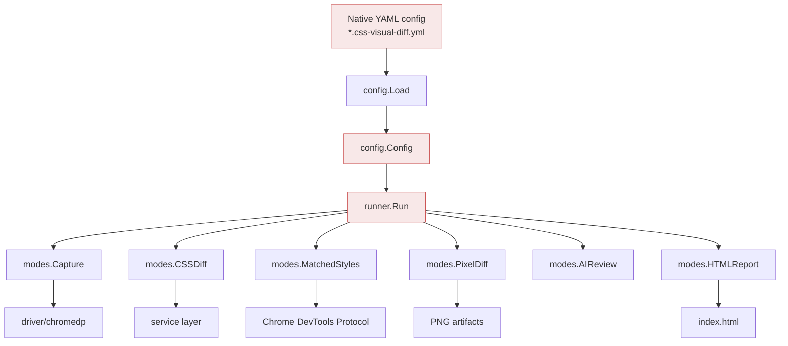
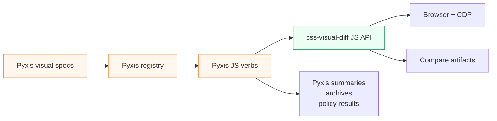

# CSS Visual Diff: Retiring the Native YAML Runner for a JavaScript-First Workflow Engine

This note explains the architectural refactor that removed the old native YAML/config-driven execution path from `css-visual-diff` and made JavaScript scriptability the primary workflow. It is written as a technical deep dive rather than a changelog. The goal is to preserve the reasoning: why the old design became expensive, how the new shape is simpler, what was deleted, and what rule should guide future feature work.

> [!summary]
> `css-visual-diff` used to have two orchestration models: a native Go YAML runner and a JavaScript/Goja scripting layer. The refactor removed the native runner, deleted the old config package and config-driven modes, and kept the tool focused on direct commands plus `css-visual-diff verbs ...`. Project-specific YAML is still allowed as userland data, but the core no longer owns a visual-diff manifest schema.

## Why this refactor happened

A visual diff tool has two jobs that pull in opposite directions. The first job is mechanical: open a browser, navigate to a URL, wait for the page, find an element, capture screenshots, compute styles, and write artifacts. The second job is project-specific: decide which pages matter, how to prepare each page, which selectors represent semantic components, which differences are acceptable, what report shape a team wants, and how a particular suite should be run.

The original native YAML runner tried to own both jobs. It defined a Go-native config schema, parsed files such as `*.css-visual-diff.yml`, and ran a fixed sequence of modes: capture, CSS diff, matched styles, pixel diff, AI review, HTML report, and story discovery. That design works while the world is small. A declarative file can say, "compare these two URLs and these selectors." But Pyxis quickly needed richer orchestration: project registries, semantic page specs, reusable component lookup, archive outputs, smoke scripts, policy bands, markdown summaries, and custom report generation. At that point, every new need had to choose between two bad options: add another field to the native YAML schema, or bypass the schema from JavaScript.

The project chose the second path. JavaScript verbs became the real workflow layer. They can load project-specific specs, call the browser API, run comparisons, write catalogs, and emit review-site data. Once that happened, the native YAML runner stopped being the center of the system and became a second, partially overlapping product inside the same repository.

The removal was not an anti-YAML decision. It was an ownership decision.

YAML remains useful as data. Pyxis still has `specs/*.visual.yml` files, and those files are valuable because they are reviewed, compact, and close to the domain language. The difference is that those specs now belong to Pyxis userland. They are loaded by JavaScript and interpreted by Pyxis code. The `css-visual-diff` core no longer promises to understand a universal visual-diff manifest schema.

## The old mental model

The old system was built around a native config object. A user wrote a YAML file, the Go code decoded it into `config.Config`, and the runner dispatched a list of mode names.



In pseudocode, the old runner looked like this:

```go
cfg := config.Load(path)
modes := runner.NormalizeModes(cliModes, cfg.Modes)

for _, mode := range modes {
    switch mode {
    case "capture":
        modes.Capture(ctx, cfg)
    case "cssdiff":
        modes.CSSDiff(ctx, cfg)
    case "matched-styles":
        modes.MatchedStyles(ctx, cfg)
    case "pixeldiff":
        modes.PixelDiff(ctx, cfg, threshold)
    case "ai-review":
        modes.AIReview(ctx, cfg)
    case "html-report":
        modes.HTMLReport(ctx, cfg)
    }
}
```

The important part is not the switch statement. The important part is the type flowing through it: `config.Config`. Once that type sits at the center, every mode tends to depend on it. The config schema becomes the API. If a later JavaScript workflow wants the same browser or style functionality, it either has to manufacture a fake config object or the service code has to be refactored away from config types.

That is exactly what happened. The old design encouraged business logic to grow around a file format rather than around runtime concepts.

## The new mental model

The new system treats `css-visual-diff` as a browser automation and artifact engine with a programmable JavaScript orchestration layer. The core provides primitives: browser pages, locators, screenshots, style extraction, snapshots, diffs, catalogs, and review artifacts. JavaScript decides how to combine those primitives for a project.

```mermaid
flowchart TD
    Spec[Project data<br/>YAML, JSON, JS objects] --> JS[JavaScript verb/userland]
    JS --> API[require("css-visual-diff")]
    API --> Service[service runtime types]
    Service --> Driver[driver/chromedp]
    Driver --> Browser[Chrome]
    Service --> Artifacts[PNG / JSON / Markdown / catalog]
    JS --> Summary[Project-specific summary/report]

    subgraph Core[css-visual-diff core]
      API
      Service
      Driver
      Artifacts
    end

    subgraph Userland[Project-owned workflow]
      Spec
      JS
      Summary
    end

    style Userland fill:#eef7ff,stroke:#3e63dd
    style Core fill:#ecfdf3,stroke:#299764
```

The corresponding pseudocode is less like a mode dispatcher and more like a small program:

```js
const cvd = require("css-visual-diff")
const spec = cvd.objectFromFile("specs/public-pages.desktop.visual.yml")

const browser = await cvd.browser()
for (const pageSpec of spec.pages) {
  const left = await browser.page(pageSpec.prototype.url, pageSpec.viewport)
  const right = await browser.page(pageSpec.react.url, pageSpec.viewport)

  for (const region of pageSpec.regions) {
    const result = await cvd.compare.region({
      leftPage: left,
      rightPage: right,
      leftSelector: region.prototypeSelector,
      rightSelector: region.reactSelector,
      outDir: artifactDir(pageSpec, region),
    })

    writeReviewRow(result, pageSpec, region)
  }
}
```

This is a better fit for Pyxis because the domain decisions live where the domain knowledge lives. The core does not need to know what a Pyxis public page is, what a Storybook atom is, what policy bands are acceptable, or how a summary should be sorted. It only needs to offer reliable browser and artifact primitives.

## The key distinction: schema as API versus schema as data

The most important lesson from this refactor is the difference between a schema that the core owns and a schema that userland owns.

| Kind of schema | Who owns it | What it means | Example | Keep? |
| --- | --- | --- | --- | --- |
| Native visual config | `css-visual-diff` Go core | A promised execution API decoded into Go structs | old `config.Config` | No |
| Verb repository config | CLI/bootstrap layer | Where to find JS verb repositories | `.css-visual-diff.yml` with `verbs.repositories` | Yes |
| Pyxis visual specs | Pyxis userland | Project domain data interpreted by Pyxis JS | `specs/*.visual.yml` | Yes |
| Runtime JS objects | JS workflow | Values passed directly to browser/service functions | `{ selector, props, outDir }` | Yes |

The old native config was expensive because it was both input data and a public API. Once users rely on a native schema, the core must preserve its meaning, validate it, lower it into runtime operations, document it, and extend it without breaking old files. That burden is worthwhile only if the schema is the primary product.

For `css-visual-diff`, the primary product is now scriptability. The schema should therefore live at the edge, in project code, where it can evolve with the project.

## How the refactor was staged

The deletion was intentionally staged. A direct deletion of `config.Config` would have broken too many packages at once. The safer route was to first move the reusable runtime concepts out of the config package, then remove compatibility surfaces, then delete the native runner.

### Phase 1: Extract runtime types from the config package

The first step was to make the service and JavaScript-facing layers stop depending on native YAML structs. New config-free runtime types were introduced in `internal/cssvisualdiff/service/runtime_types.go`:

```go
type Viewport struct {
    Width  int `json:"width"`
    Height int `json:"height"`
}

type PrepareSpec struct {
    Type        string         `json:"type,omitempty"`
    Script      string         `json:"script,omitempty"`
    WaitFor     string         `json:"waitFor,omitempty"`
    AfterWaitMS int            `json:"afterWaitMs,omitempty"`
    Component   string         `json:"component,omitempty"`
    Props       map[string]any `json:"props,omitempty"`
    RootSelector string        `json:"rootSelector,omitempty"`
}

type PageTarget struct {
    Name         string       `json:"name,omitempty"`
    URL          string       `json:"url"`
    WaitMS       int          `json:"waitMs,omitempty"`
    Viewport     Viewport     `json:"viewport,omitempty"`
    RootSelector string       `json:"rootSelector,omitempty"`
    Prepare      *PrepareSpec `json:"prepare,omitempty"`
}
```

The exact fields are less important than the direction. A viewport is not inherently a YAML concept. A prepare script is not inherently a YAML concept. A page target is not inherently a YAML concept. These are runtime concepts, so they belong in the service layer.

During this phase, the old modes still existed. To keep them compiling, a temporary adapter file translated old config structs into the new service structs:

```go
func toServicePageTarget(target config.Target) service.PageTarget {
    return service.PageTarget{
        Name:         target.Name,
        URL:          target.URL,
        WaitMS:       target.WaitMS,
        Viewport:     toServiceViewport(target.Viewport),
        RootSelector: target.RootSelector,
        Prepare:      toServicePrepareSpec(target.Prepare),
    }
}
```

That adapter was a bridge, not a destination. Its presence made the intended architecture visible: service code should speak service types; legacy modes can adapt until they are deleted.

### Phase 2 and 3: Remove the JavaScript compatibility bridge

After service and JS-facing code no longer needed native config types, the next target was the compatibility bridge exposed to scripts.

The old JS API had `cvd.loadConfig(path)`. It read a native YAML config and lowered it into a JavaScript object. The built-in `catalog inspect-config` verb then used that object to convert `sections[]` and `styles[]` into inspect probes.

That bridge kept the old schema alive inside the new scripting world. It was removed:

- `cvd.loadConfig(path)` disappeared from `internal/cssvisualdiff/jsapi/module.go`.
- `internal/cssvisualdiff/jsapi/config.go` was deleted.
- `catalog inspect-config` was removed from `internal/cssvisualdiff/dsl/scripts/catalog.js`.
- Documentation references to `loadConfig` and `inspect-config` were removed.

This phase is where the architectural boundary became clear. JavaScript can still load YAML as data, but not as a core-owned visual config:

```js
// Still valid: project-owned data.
const spec = cvd.objectFromFile("specs/public-pages.desktop.visual.yml")

// Removed: core-owned native visual config bridge.
const cfg = await cvd.loadConfig("page.css-visual-diff.yml")
```

The first line is healthy. The second line preserved the old API under a new spelling.

### Phase 4: Delete the native runner and config-driven modes

Once the JS bridge was gone, the native runner could be removed outright. This was the large deletion commit:

```text
2d864f2 Remove native YAML run pipeline
35 files changed, 56 insertions(+), 5478 deletions(-)
```

The commit removed:

- the `css-visual-diff run` command,
- `RunCommand`, `RunSettings`, config discovery, dry-run handling, coverage row emission, and story row emission from `cmd/css-visual-diff/main.go`,
- the old config-driven inspect/artifact commands (`inspect`, `screenshot`, `css-md`, `css-json`, `html`, `inspect-json`),
- the `internal/cssvisualdiff/runner` package,
- the `internal/cssvisualdiff/config` package,
- config-driven modes such as `capture`, `pixeldiff`, `html_report`, `ai_review`, `stories`, and `prepare`,
- old native YAML examples and help docs.

The commands that remained are the commands that fit the new shape:

```text
css-visual-diff compare
css-visual-diff llm-review
css-visual-diff serve
css-visual-diff verbs ...
```

The `modes` package did not disappear completely. It stopped being a registry of native config modes and became a home for direct-command helpers such as `Compare`, `GenerateCompareResult`, and `WriteCompareArtifacts`.

### Phase 5: Remove stale teaching material

Deleting code is not enough. If the documentation still tells users to run `css-visual-diff run --config`, the system still has a ghost API. The cleanup removed old native YAML examples and rewrote the README around the JS-first model.

The README now says the important thing directly:

```text
The old native YAML runner has been removed. For project-scale workflows, write JavaScript verbs and load any project-specific YAML or JSON data from userland with cvd.objectFromFile() or normal script helpers.
```

That sentence is a project rule. It tells future contributors where to put complexity.

## What was kept, and why

A refactor like this can look like a purge, but the interesting part is what survived.

### Direct `compare` survived

The direct compare command is still useful because it is not a project manifest system. It is a focused operation: compare one region between two URLs and write artifacts. It is the equivalent of a sharp hand tool. It does not need to know about a suite, a project, a manifest, or a policy file.

```bash
css-visual-diff compare \
  --url1 http://localhost:7070/prototype.html \
  --selector1 '#capture-root' \
  --url2 http://localhost:6006/iframe.html?id=button--primary \
  --selector2 '[data-component="button"]' \
  --out /tmp/cssvd/button-primary
```

Direct commands are acceptable when they expose one coherent operation. The removed runner was different: it was an orchestration framework competing with JS.

### JavaScript verbs survived and became central

The `verbs` namespace is now the main extension point. External JS files can declare commands, accept flags, load project specs, and call the native module.

```bash
css-visual-diff verbs --repository examples/verbs \
  examples review-sweep from-spec \
  --specFile examples/specs/review-sweep.example.yaml \
  --outDir /tmp/example-review
```

This gives us the flexibility of a program without forcing every project-specific concept into Go structs.

### Verb repository config survived

There is still a `.css-visual-diff.yml` shape for declaring verb repositories:

```yaml
verbs:
  repositories:
    - name: project
      path: ./verbs
```

This is not the old visual diff manifest. It is closer to application configuration. It tells the CLI where to find scripts; it does not tell the core how to compare pages. Keeping it does not reintroduce the old problem.

## The Pyxis lesson

Pyxis is the reason the refactor is easy to justify. It already moved toward a richer userland structure:

```text
prototype-design/visual-diff/userland/
├── lib/                 # reusable JS comparison/report helpers
├── specs/               # project-specific visual suite specs
├── verbs/               # registered css-visual-diff commands
└── scripts/             # smoke and archive runners
```

This shape says something important: Pyxis has its own domain language. It has pages, atoms, public site targets, app targets, sections, policies, archive outputs, semantic snapshots, and smoke flows. Trying to encode all of that in a generic Go YAML schema would either make the core bloated or make the schema too weak to be useful.

The JS userland approach lets Pyxis own its vocabulary. `css-visual-diff` owns the machinery.

That separation is the core architectural win.



## A concrete before-and-after

Before the refactor, adding a new project-scale visual feature often started with a config question:

> What field should we add to the YAML schema?

That question seems innocent, but it drags a chain behind it. A new field means schema design, validation, docs, mode integration, test fixtures, compatibility behavior, and JS lowering if scripts need to see it.

After the refactor, the first question should be:

> What JavaScript API primitive or service function would make this workflow easy to write?

This is a different design posture. For example, consider overlay screenshot labels. The old design doc proposed adding `OverlaySpec` to the native config schema and wiring it into capture mode. That plan is now obsolete. The new design should expose a service and JS API:

```js
await page.overlayScreenshot({
  output: "/tmp/labeled.png",
  labels: [
    { name: "Header", selector: "header" },
    { name: "Hero", selector: "[data-section='hero']" },
    { name: "Footer", selector: "footer" },
  ],
  legend: true,
})
```

The project can decide where the labels come from. They might be written inline, loaded from a Pyxis spec, derived from Storybook metadata, or generated from a registry. The core only needs to implement the primitive reliably.

## The implementation rule that falls out

The durable rule is this:

> New visual workflow features should enter through service/runtime types and the JavaScript API, not through a native manifest schema.

This rule has practical consequences:

- If a feature describes browser work, implement it in `driver` or `service` first.
- If a feature needs to be scriptable, expose it in `jsapi` with plain JS objects and promises.
- If a feature is project-specific, keep its schema in userland.
- If a direct CLI command is useful, make it narrow and explicit, like `compare`.
- Do not re-create a generic `run --config` pipeline under a new name.

## Failure modes the refactor avoids

The removed architecture had several failure modes that tend to appear slowly.

### The manifest becomes a programming language

Every declarative runner eventually meets a workflow that wants conditionals, loops, derived values, defaults, imports, target expansion, or custom reporting. At that point, the manifest grows little programming-language features. JavaScript already has those features. The core should not rebuild them in YAML.

### The service layer imports the schema

When reusable services accept config structs, the file format leaks inward. This makes it harder to call the same services from JS, tests, or direct commands. Moving to `service.PageTarget`, `service.Viewport`, and related runtime types fixed that direction of dependency.

### Documentation teaches the wrong path

Old docs are active architecture. If examples show `run --config`, users will keep asking for schema extensions. Removing obsolete docs was necessary because documentation directs future work as much as code does.

### Compatibility code becomes product code

`cvd.loadConfig` was a compatibility bridge, but any exported JS function becomes part of the product. Keeping it would have forced the native config package to survive. Deleting it made the architectural decision real.

## Validation as evidence

The cleanup was validated at several levels.

The Go test suite passed:

```bash
GOWORK=off go test ./...
```

The pre-commit hook also ran `golangci-lint` and the test suite successfully on the main deletion commit.

The root CLI no longer lists the removed command:

```bash
GOWORK=off go run ./cmd/css-visual-diff --help
```

The removed command fails as expected:

```bash
GOWORK=off go run ./cmd/css-visual-diff run --help
# Error: unknown command "run" for "css-visual-diff"
```

The JS verb path still loads:

```bash
GOWORK=off go run ./cmd/css-visual-diff verbs --help
GOWORK=off go run ./cmd/css-visual-diff verbs catalog inspect-page --help
```

A light Pyxis smoke test also passed with a freshly built binary:

```bash
GOWORK=off go build -o /tmp/cssvd-bin/css-visual-diff ./cmd/css-visual-diff
cd /home/manuel/code/wesen/2026-04-23--pyxis
PATH=/tmp/cssvd-bin:$PATH prototype-design/visual-diff/userland/scripts/smoke-list-targets.sh
```

The browser-dependent Pyxis smokes were not run during this cleanup because they require the prototype and Storybook/app servers to be running.

## What changed in the repository

The main code commits tell the story:

| Commit | Purpose | Shape |
| --- | --- | --- |
| `194dca4` | Refactor runtime page types out of YAML config | Introduced service runtime types and temporary mode adapters |
| `3d95489` | Remove YAML config JS compatibility bridge | Deleted `cvd.loadConfig`, `jsapi/config.go`, and `catalog inspect-config` |
| `2d864f2` | Remove native YAML run pipeline | Deleted runner, config package, config-driven modes, examples, and obsolete docs |
| `feb944c` | Close remove-yaml-run ticket | Marked the ticket complete after validation |

The largest deletion was intentionally large: 5,478 deleted lines in the native-run removal commit. That number matters because it is not only code volume. It is surface area. Every deleted mode, schema field, example, and helper was something future contributors no longer have to understand before adding a JS-first feature.

## What this means for future development

The next features should assume the new architecture. Overlay screenshot labels are a good test case. The old instinct would be to add this:

```yaml
overlay:
  labels:
    - name: Header
      selector: header
```

The new instinct should be to add this:

```js
await page.overlayScreenshot({
  labels: spec.sections.map(section => ({
    name: section.name,
    selector: section.selector,
  })),
  output: paths.overlayPng,
})
```

The second form is more flexible because `spec.sections` can come from anywhere. It can be YAML, JSON, a registry, Storybook metadata, or a previous discovery step. The core does not care. It receives selectors and writes an annotated artifact.

This is the essence of the new design: the core should be excellent at browser and artifact operations; userland should be excellent at project meaning.

## Working rules

- Treat JavaScript verbs as the project-scale workflow layer.
- Treat YAML and JSON as userland data, not as native execution manifests.
- Keep service types independent from file formats.
- Add narrow direct CLI commands only when the operation is useful by itself.
- Delete compatibility bridges when they preserve an abandoned architecture.
- Update docs in the same commit series as code deletion, because stale docs are stale APIs.
- For Pyxis, put domain concepts in `prototype-design/visual-diff/userland`, not in the Go core.

## Closing thought

The refactor did not make `css-visual-diff` less capable. It made the boundary sharper. The old runner tried to be a universal visual-diff manifest interpreter. The new system is a programmable visual-diff engine. That distinction matters because Pyxis does not need a generic manifest interpreter. It needs a reliable browser/artifact core that can be driven by project-aware JavaScript.

The codebase is smaller now, but more importantly, the next design question is clearer. When a feature arrives, we do not ask how to encode it in the old manifest. We ask what primitive would make the JavaScript workflow obvious.
