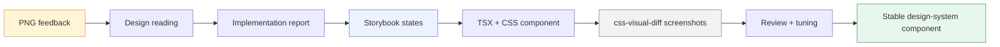

# Playbook: Adding Pyxis Design System Components from PNG Feedback

This note explains how to add a new component to the Pyxis component design system when the starting point is not a polished Figma file or a coded prototype, but one or more PNG screenshots from a designer, a rough visual sketch, or a previous implementation. The method is deliberately practical: copy the PNG into the ticket, read it as design intent, build the component in Storybook, capture real screenshots with `css-visual-diff`, compare the result, and iterate until the component feels like it belongs in Pyxis.

> [!summary]
> - A PNG is evidence, not source code. It tells us about hierarchy, layout, behavior, and intent; it does not automatically define our final colors, typography, spacing, or tokens.
> - Storybook is the workbench where new Pyxis components become real. Every important state should be visible there before the component is trusted in a route.
> - `css-visual-diff` is useful even when there is no prototype to compare against. In Storybook-first work, we use screenshot capture and project-local verbs to create stable visual evidence.
> - The finished component is not just TSX and CSS. It is a small contract: props, stories, selectors, screenshots, validation commands, and a diary of design decisions.

## Why this note exists

The Pyxis staff application is evolving from a collection of screens into a reusable component design system. That transition only works if new components are added in a disciplined way. A component that looks right in one browser tab but has no stories, no screenshot evidence, no stable selectors, and no explanation of its design choices is not a design-system component yet. It is just code that happens to render a shape.

The immediate example was the Post-show log modal. The team had several PNG inputs: a large desktop modal mockup, a designer design-system sheet, and mobile incident-checked screenshots. The first implementation moved quickly and got the broad shape right: a two-column desktop modal, a pre-show note callout, draw and door fields, incident details, and a privacy note. Then the real design work began. The mobile layout exposed overflow. A stale Storybook dev server served an empty CSS module and made it look as if the component styles had disappeared. The desktop incident privacy box stretched too far because the right column's grid items were being stretched. Each of these observations became part of the process.

This note turns that process into a reusable tutorial.

## The mental model: design evidence becomes a component contract

When a designer sends a PNG, there is a temptation to treat it like a blueprint. Measure the pixels, copy the colors, reproduce the spacing, and call the result done. That approach is brittle. Screenshots are lossy: they do not encode interactive states, token names, responsive breakpoints, keyboard behavior, backend constraints, or whether a field is a real persisted field or merely a sketch.

A better mental model is a pipeline:



The pipeline matters because each stage changes the artifact. The PNG becomes observations. Observations become implementation tasks. Tasks become stories. Stories become code. Code becomes screenshots. Screenshots become the next round of feedback. The component becomes stable only after it survives that loop.

## The roles in the workflow

It helps to give each tool a clear job. Confusion usually appears when a tool is asked to do a job it was not designed to do.

| Tool or artifact | Role in the workflow | What it should not do |
| --- | --- | --- |
| PNG sketch | Communicates visual intent, hierarchy, rough layout, and interaction clues. | It should not override Pyxis tokens automatically. |
| Ticket `sources/` folder | Preserves all visual evidence and screenshots for future review. | It should not become a dump of unnamed temporary images. |
| Diary | Records what was tried, what broke, and why decisions were made. | It should not be replaced by commit messages alone. |
| Storybook | Provides the live workbench for component states. | It should not contain only the happy path. |
| `css-visual-diff` | Captures and compares rendered output. | It should not be forced into fake comparisons when there is only one real target. |
| TSX | Defines component structure, props, state, accessibility, and behavior. | It should not encode purely visual token decisions inline. |
| CSS | Defines layout, spacing, responsive behavior, and visual state. | It should not compensate for a bad component structure. |
| TypeScript/build validation | Proves the component integrates with the app. | It does not prove the component is visually good. |

## Step 1: Copy the PNG into the ticket

The first rule is simple: never work from `/tmp/pi-clipboard-...png` as the source of record. Clipboard files disappear. They are also meaningless to future readers. Copy the PNG into the ticket and give it a name that says what it is.

For the ShowLog modal, the evidence lived under:

```text
/home/manuel/code/wesen/2026-04-23--pyxis/ttmp/2026/04/29/PYXIS-ARCHIVE-VISUAL-REDESIGN--redesign-show-archive-page-visual-hierarchy-and-filtering-ux/sources/17-show-log-modal-redesign-reference/
```

Good names are boring and descriptive:

```text
reference-modal.png
designer-feedback.png
mobile-feedback-incident-1.png
mobile-feedback-incident-2.png
current-desktop-incident-before-privacy-fix.png
current-desktop-incident-after-privacy-fix.png
```

The naming convention tells a story. `reference-modal.png` is an input. `current-desktop-incident-before-privacy-fix.png` is evidence of a problem. `current-desktop-incident-after-privacy-fix.png` is evidence of the correction.

The diary should record the copy step:

```markdown
Copied designer mobile incident screenshots into:

sources/17-show-log-modal-redesign-reference/mobile-feedback-incident-1.png
sources/17-show-log-modal-redesign-reference/mobile-feedback-incident-2.png
```

This sounds mundane, but it is what makes a design iteration auditable.

## Step 2: Read the image as design intent

Open the PNG and describe what it is trying to teach you. Do this before editing code. A useful reading is not “the button is red” or “the box is 302 pixels wide.” A useful reading identifies the structure of the work.

For the mobile incident-checked ShowLog sketch, the design intent was roughly this:

- The modal header stays compact and readable on a phone-width viewport.
- The pre-show note remains first because it is context, not input.
- The quick highlight is a short field, not a second notes textarea.
- Draw and total door remain side by side on mobile because they are paired metrics.
- The incident checkbox appears before the long post-show notes field.
- When incident is checked, incident details appear below the main notes, followed by a staff-only privacy notice.
- The footer remains visually anchored at the bottom and the primary action remains easy to hit.

Notice what is missing from that list: exact hex colors. The designer’s screenshot may show red, gray, yellow, and text sizes, but Pyxis already has an app visual language. The screenshot tells us the incident region should be semantically dangerous or sensitive. It does not mean we must copy the designer’s red exactly.

## Step 3: Use image understanding, but keep judgment in the system

Image-understanding tools are useful for turning a screenshot into a checklist. They can point out hierarchy, missing states, spacing problems, and likely intent. They are not the final authority. The system’s own tokens, components, and data model still matter.

A good prompt is specific:

```text
Analyze this mobile incident-checked modal reference. What layout refinements should we apply to the current Pyxis mobile modal while keeping our existing colors/tokens? Focus on spacing, order, sticky footer, field sizing, counters, and incident panel.
```

The phrase “while keeping our existing colors/tokens” is important. Without it, the critique may recommend copying the screenshot’s palette. That is not always wrong, but it should be a deliberate decision rather than an accident.

The output should be translated into engineering tasks. For example:

| Image critique | Engineering interpretation |
| --- | --- |
| “The incident panel should only appear when the checkbox is checked.” | Conditionally render the incident aside or use a muted preview state, depending on staff discoverability needs. |
| “The footer should remain anchored.” | Keep the modal footer in the shared `Modal` footer slot and ensure the body scrolls above it. |
| “The numeric fields should stay side by side.” | Use `grid-template-columns: repeat(2, minmax(0, 1fr))` on mobile, not a single-column stack. |
| “The privacy box is associated with incident details.” | Place it after the incident panel and keep it visually compact. |

## Step 4: Write a small implementation report before coding

A report does not need to be a novel, but it should answer the questions that code cannot answer later:

- Which parts of the PNG are binding?
- Which parts are approximate?
- Which existing Pyxis tokens and components should win over the PNG?
- Which states need Storybook coverage?
- Which fields are real persisted data and which are visual placeholders?

For the ShowLog modal, this distinction mattered because the design included `Quick highlight` and `Total door`, while the backend schema only had:

```sql
attendance_logs.draw
attendance_logs.notes
attendance_logs.incident
attendance_logs.incident_notes
```

A careless implementation would add inputs that appear to save but silently lose data. A disciplined implementation records the decision: either add real schema fields, keep them Storybook-only, or fold them into an existing notes field as an explicit temporary compromise.

## Step 5: Design the component API before the CSS

A design-system component starts with a contract. The contract is not just TypeScript props; it is the relationship between data, behavior, and visible states.

For the ShowLog editor modal, the component API was shaped around a `ShowLogEntry` and an update callback:

```ts
export type PostShowLogEditorModalProps = {
  entry?: ShowLogEntry;
  isOpen: boolean;
  isSaving?: boolean;
  onCancel: () => void;
  onSave?: (update: ShowLogUpdateInput) => void;
};
```

This is a good component boundary because the modal does not fetch data itself. It receives the entry to edit, owns local draft state while open, validates the draft, and emits a save request. The page decides how to persist the update.

The internal draft may contain visual or intermediate fields:

```ts
type Draft = Pick<ShowLogUpdateInput,
  'draw' | 'postShowNotes' | 'incident' | 'incidentNotes'
> & {
  quickHighlight: string;
  totalDoor: string;
};
```

That type tells the truth: `quickHighlight` and `totalDoor` exist in the modal draft, but they are not yet part of `ShowLogUpdateInput`. The next question is not a CSS question; it is a product/data question.

## Step 6: Build the Storybook states early

Storybook is not a gallery to fill in at the end. It is the workbench. Add stories as soon as the component skeleton exists. The stories should represent both the designer’s screenshots and the states the screenshots imply.

For a modal like this, useful states are:

```ts
export const NeedsLog = {};
export const Logged = { args: { entry: loggedEntry } };
export const Incident = { args: { entry: incidentEntry } };
export const IncidentChecked = {
  args: { entry: { ...baseEntry, incident: true, incidentNotes: '' } }
};
export const Saving = { args: { entry: loggedEntry, isSaving: true } };
export const Mobile = { parameters: { viewport: { defaultViewport: 'mobile1' } } };
export const MobileIncidentChecked = {
  args: { entry: { ...baseEntry, incident: true, incidentNotes: '' } },
  parameters: { viewport: { defaultViewport: 'mobile1' } }
};
```

Each story is a claim. `IncidentChecked` claims the validation/empty incident state is designed. `MobileIncidentChecked` claims the modal does not merely work on mobile; it has been looked at in the state where mobile is most likely to break.

## Step 7: Give the component stable selectors

Visual tooling needs stable handles. Tests need stable handles. Future maintainers need stable handles. Use Pyxis part helpers rather than relying on incidental class names when a component is a screenshot target.

The modal uses:

```tsx
panelProps={{ ...appPart('post-show-log-editor-modal') }}
```

which gives a selector like:

```css
[data-pyxis-component="post-show-log-editor-modal"]
```

That selector became the target for screenshots. The value of this pattern appears later, when we need to capture the same component repeatedly across desktop, mobile, and incident states without chasing changing DOM structure.

## Step 8: Use CSS for layout, not for hiding structural mistakes

The most important CSS question is not “what color is this?” It is “what is the spatial model?” For the ShowLog modal, the desktop spatial model is:

```text
┌────────────────────────────────────────────────────────────┐
│ Header                                                     │
├────────────────────────────────────────────────────────────┤
│ Main column                         │ Incident column      │
│ - pre-show note                     │ - incident details   │
│ - quick highlight                   │ - privacy banner     │
│ - draw / total door                 │                      │
│ - incident checkbox                 │                      │
│ - post-show notes                   │                      │
├────────────────────────────────────────────────────────────┤
│                                      Cancel  Save          │
└────────────────────────────────────────────────────────────┘
```

The CSS should express that model directly:

```css
.app-post-show-log-modal__layout {
  display: grid;
  gap: var(--show-log-modal-gap);
  grid-template-columns: minmax(0, 1.65fr) minmax(320px, .95fr);
}
```

When the incident column is not visible, the model changes:

```css
.app-post-show-log-modal__layout {
  grid-template-columns: minmax(0, 640px);
}

.app-post-show-log-modal__layout[data-incident='true'] {
  grid-template-columns: minmax(0, 1.65fr) minmax(320px, .95fr);
}
```

A subtle but important example: the desktop privacy box once stretched all the way down the right column. The bug was not the box itself. It was grid alignment. CSS grid stretches items by default. The fix was to make the side column align content at the top:

```css
.app-post-show-log-modal__side-column {
  align-content: start;
  display: grid;
  gap: 22px;
}
```

This is the kind of problem screenshots catch. The code was valid. TypeScript was happy. The visual rhythm was wrong.

## Step 9: Use `css-visual-diff` as a screenshot instrument

When there is a coded prototype and a React implementation, `css-visual-diff` can compare two sides. But Storybook-first component work often has no prototype. In that case, do not create a fake YAML file where `original` and `react` point to the same URL. That makes the tool run, but it lies about what the artifact means.

Instead, use a project-local verb that captures a single Storybook story. In Pyxis, this lives at:

```text
/home/manuel/code/wesen/2026-04-23--pyxis/prototype-design/visual-diff/userland/verbs/pyxis-app.js
```

The command shape is:

```bash
css-visual-diff verbs pyxis app capture-story \
  pyxis-app-components-organisms-showlog-postshowlogeditormodal--incident \
  ttmp/.../sources/17-show-log-modal-redesign-reference/current-desktop-incident.png \
  --width 1200 \
  --height 980 \
  --output json
```

For mobile:

```bash
css-visual-diff verbs pyxis app capture-story \
  pyxis-app-components-organisms-showlog-postshowlogeditormodal--incident \
  ttmp/.../sources/17-show-log-modal-redesign-reference/current-mobile-incident.png \
  --width 375 \
  --height 980 \
  --output json
```

The command returns structured evidence: URL, selector, viewport, output file, bounds, and inspect artifact directory. That is enough for automation and enough for a human to find the image.

## Step 10: Compare screenshots by reading them, not remembering them

After every capture, open the image. The most common failure in visual work is to assume the screenshot matches what the developer remembers seeing in the browser. It often does not.

For the ShowLog modal, screenshots revealed at least three issues:

1. The old Storybook process served an empty CSS module, so the component rendered with raw browser styles.
2. The incident column overflowed on mobile because the desktop grid rules were still in effect.
3. The privacy banner stretched too far on desktop because grid alignment was wrong.

None of these were TypeScript errors. They were visual facts.

## Step 11: Debug stale Storybook CSS before editing blindly

Storybook and Vite can occasionally get into a state where a CSS module is requested successfully but contains no styles:

```js
const __vite__css = ""
```

The symptom looks dramatic. A component that was styled a moment ago suddenly becomes raw HTML. The first instinct is to blame the last CSS edit. Sometimes that is correct. But before rewriting the component, inspect the CSS module.

A quick browser-side check:

```js
const cssUrl = [...performance.getEntriesByType('resource')]
  .map(e => e.name)
  .find(n => n.includes('PostShowLogEditorModal.css'));

const txt = await fetch(cssUrl).then(r => r.text());
console.log(txt.includes('app-post-show-log-modal__pre-show-note'));
```

If the CSS module is empty, restart Storybook:

```bash
pkill -f 'storybook dev -p 6008' || true
cd /home/manuel/code/wesen/2026-04-23--pyxis/web
nohup pnpm --filter pyxis-app storybook --host 0.0.0.0 --port 6008 \
  > /tmp/pyxis-app-storybook-6008.log 2>&1 &
```

Then verify computed styles:

```js
const note = document.querySelector('.app-post-show-log-modal__pre-show-note');
getComputedStyle(note).display;          // should be grid
getComputedStyle(note).backgroundColor;  // should be the warm note tint
```

This is not a workaround. It is part of the operational discipline of visual iteration.

## Step 12: Preserve Pyxis style while adopting design feedback

Designer feedback can arrive as a design-system sheet with colors, type sizes, and component examples. Use it carefully. The most valuable parts are usually semantic:

- primary flow belongs on the left;
- incident details are secondary;
- incident details appear when the incident checkbox is checked;
- pre-show notes are read-only context;
- helper text explains expected input;
- textareas need counters;
- mobile stacks sections in reading order.

The riskiest parts to copy directly are usually exact hex colors, line heights, and button visuals. Pyxis already has shared buttons and app tokens. If the screenshot says “primary action red,” we should usually use the Pyxis `danger` or primary action variant, not paste a new red into the component. If the screenshot says “muted text #6B7280,” we should use `--app-muted` unless there is a deliberate reason to add a new token.

The rule is:

> Adopt the designer’s hierarchy and behavior. Map colors, spacing, typography, and controls onto Pyxis tokens and components.

## Step 13: Know when a design implies backend work

UI sketches often include fields before the data model is ready. The ShowLog modal included `Quick highlight` and `Total door`. The current backend model was still based on `attendance_logs`, with fields for draw, notes, incident, and incident notes.

This mismatch must be made explicit. A UI field creates an expectation. If the field is editable, users expect it to persist. If the backend cannot persist it, the implementation must choose a temporary strategy and document it.

Possible strategies:

| Strategy | When to use it | Tradeoff |
| --- | --- | --- |
| Storybook-only field | The field is visual feedback, not ready for production. | Safe, but route UI differs from story. |
| Fold into notes | The field is useful now and can be represented as text. | Works temporarily, but loses structure. |
| Add schema/API fields | The field is part of the real product. | Correct, but requires migrations and API work. |

For production-quality ShowLog, the likely schema additions are:

```sql
quick_highlight TEXT,
total_door_cents INT
```

or an equivalent `NUMERIC(10,2)` representation for total door. The important point is not the exact column name; it is that visual design and data design must converge before shipping.

## Step 14: Remove old components when a screen is renamed

Design-system evolution often leaves fossils. In Pyxis, the Post-show log used to be called Attendance. The route still lived at `/attendance`, and old components still existed:

```text
web/packages/pyxis-app/src/components/organisms/Roster/AttendancePanel/
web/packages/pyxis-app/src/components/molecules/AttendanceStat/
```

The new screen used:

```text
web/packages/pyxis-app/src/components/organisms/ShowLog/PostShowLogPanel/
web/packages/pyxis-app/src/components/organisms/ShowLog/PostShowLogEditorModal/
```

A design-system component is weakened by obsolete alternatives that appear in Storybook. Future developers will not know which one to use. Once the new component is accepted, the old attendance organism should be removed or explicitly archived. Page names should be updated from `AttendancePage` to `ShowLogPage`, even if the route remains `/attendance` temporarily for compatibility.

## Step 15: Validate the whole loop before committing

Validation has several layers. Each layer catches a different class of problem.

```bash
# Shared components changed?
cd /home/manuel/code/wesen/2026-04-23--pyxis/web/packages/pyxis-components
pnpm exec tsc --noEmit

# App component changed?
cd /home/manuel/code/wesen/2026-04-23--pyxis/web/packages/pyxis-app
pnpm exec tsc --noEmit
pnpm exec vite build

# Ticket hygiene
cd /home/manuel/code/wesen/2026-04-23--pyxis
docmgr doctor --ticket PYXIS-ARCHIVE-VISUAL-REDESIGN --stale-after 30
```

Then capture screenshots again. TypeScript can prove that the code type-checks. Vite can prove that the bundle builds. Neither proves that the mobile incident panel fits above the sticky footer.

## Step 16: Commit in slices that match the story of the work

A good commit sequence reads like a design diary:

```text
TICKET: analyze modal reference
TICKET: task show log modal redesign
TICKET: add xl modal width
TICKET: redesign show log modal
TICKET: add png design iteration runbook
TICKET: tune show log mobile incident layout
```

Avoid committing runtime artifacts such as local uploaded flyers or binaries. Commit the evidence that belongs to the ticket: copied PNG references, current screenshots, final screenshots, CSS/TSX, stories, and docs.

## Common failure modes

### Failure mode: the component has only one story

A single Storybook story is usually a sign that the component is not really designed yet. Forms need empty, filled, validation, saving, and mobile states. Tables need empty, filtered, mixed, and loading/error states. Modals need open states that include their heaviest content, not just their default content.

### Failure mode: CSS hides a structural problem

If CSS has to fight the markup, the TSX structure may be wrong. For example, if a sidebar is conceptually optional, the DOM should reflect that either with conditional rendering or a clear data state. Do not leave a meaningless empty sidebar in the DOM and then push it around with negative margins.

### Failure mode: a screenshot is treated as a comparison when it is only a capture

If there is no prototype, say so. A single Storybook screenshot is still valuable. Calling it a comparison against itself makes the evidence less honest.

### Failure mode: backend fields are implied but not persisted

If the design includes a field, someone must decide whether it is real. A component can have local draft fields, but production route UI should not invite users to enter data that disappears.

### Failure mode: stale Storybook CSS causes false debugging

If all component styles vanish at once, check whether Vite is serving an empty CSS module before rewriting CSS. Restart Storybook if needed.

## A minimal checklist for a new Pyxis organism

A new organism is ready to be treated as a design-system component when these are true:

- It lives in a domain folder under `components/organisms/`.
- It has a narrow, understandable props API.
- It imports its own CSS.
- It uses stable `appPart()` selectors for screenshot targets.
- It has Storybook stories for meaningful states.
- It has desktop and mobile screenshot evidence when layout changes across breakpoints.
- It uses Pyxis tokens and shared components unless a local semantic style is justified.
- It has validation output recorded in the ticket diary.
- It does not duplicate an older component without a migration/removal plan.

## Closing: why this workflow is worth the ceremony

The point of this workflow is not bureaucracy. The point is memory. Visual design work is full of small decisions that are obvious for fifteen minutes and then impossible to reconstruct two weeks later. Why is the incident panel conditional? Why does the privacy box not stretch? Why is the modal `xl` on desktop but narrower when incident details are hidden? Why is total door folded into notes instead of saved as a structured field?

A good component design-system workflow preserves those answers. The PNGs show where the design came from. The stories show what states exist. The screenshots show what the browser rendered. The diary shows what changed and why. The code becomes easier to maintain because the design reasoning is not trapped in a chat transcript or a developer’s memory.

That is how a rough PNG becomes a durable Pyxis component.
