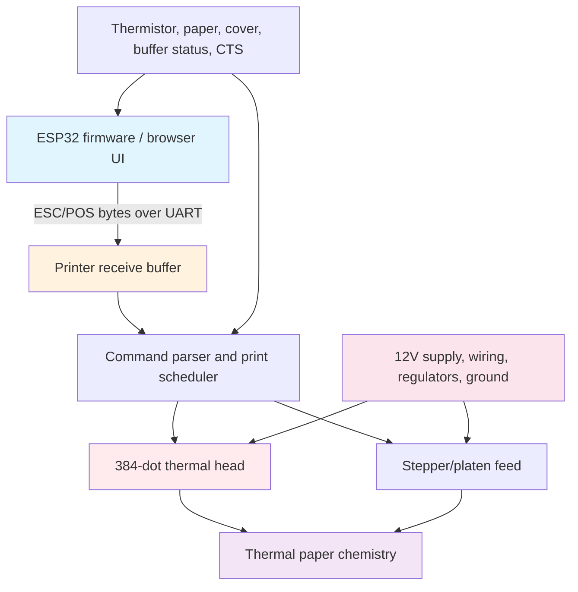
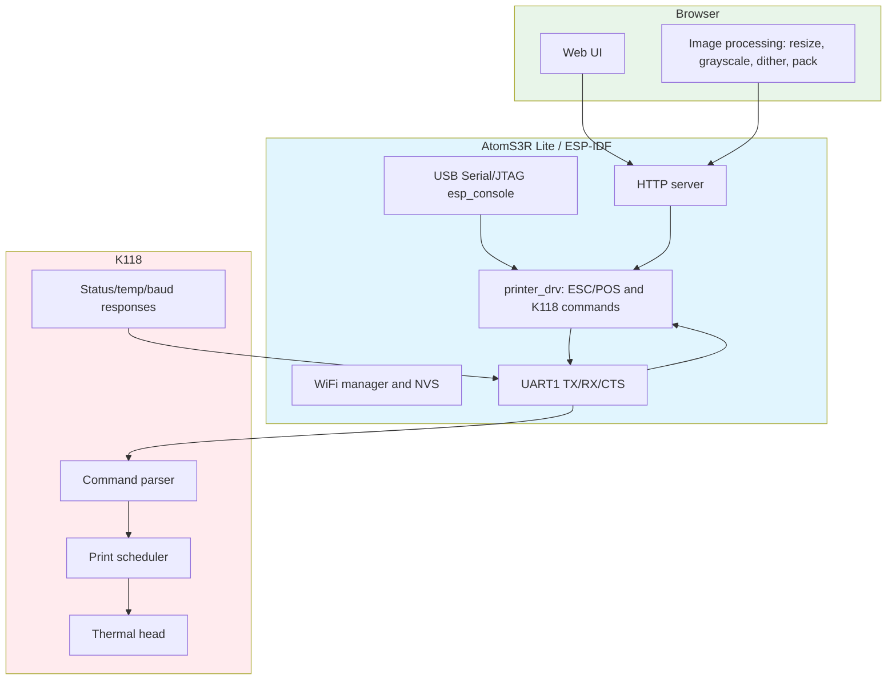
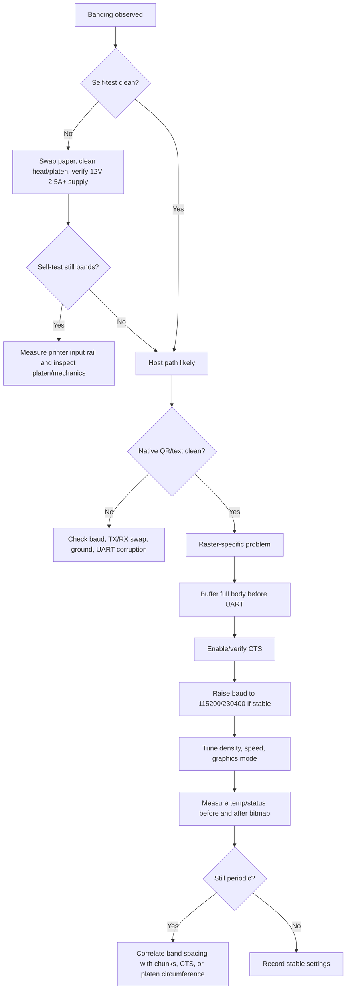

- [ ] # Thermal Receipt Printers — K118 Mechanics, Commands, and Firmware Control

A 58 mm thermal receipt printer looks like a simple serial peripheral because the host can print text by sending bytes. That first success is misleading. The printer is actually a small electro-thermo-mechanical control system: a row of hundreds of heaters makes dots, a platen advances heat-sensitive paper one line at a time, a controller schedules heater pulses and motor steps, and a serial link feeds commands into a finite receive buffer. Horizontal banding appears when those layers stop agreeing about energy, timing, or motion.

> [!summary]
> - The K118/ATOM printer is a 203 dpi, 384-dot-wide thermal line printer; one full-width raster row is 48 bytes, and sustained 60 mm/s full-width raster needs roughly 230400 baud before protocol overhead.
> - Text, QR, and barcode commands are compact because the printer renders them internally; bitmaps are expensive because the host streams one bit per dot.
> - Bitmap banding is usually not one bug. It can come from serial underrun, receive-buffer overflow, missing CTS/XON-XOFF handling, power sag, thermal throttling, paper chemistry, platen mechanics, or artificial raster chunk seams.
> - The SToMS3R firmware now treats the printer as a diagnosable device: it exposes status, temperature, baud, density, speed, graphics mode, and raw-command controls instead of only sending print jobs.

## Why this note exists

This note turns the K118 research into a durable textbook-style explanation. It combines four local sources: the imported deep research report on thermal-printer banding, the translated ATOM printer command reference, the original M5Stack Arduino firmware, and the ESP-IDF `stoms3r` firmware built for the AtomS3R Lite. The goal is not just to remember a list of byte sequences. The goal is to understand why the commands exist, what the mechanism is doing while those commands are interpreted, and how firmware should interact with a printer whose apparent simplicity hides strict timing, power, and thermal constraints.

The concrete hardware target is:

```text
Host board:       M5Stack AtomS3R Lite / ESP32-S3-PICO-1-N8R8
Printer module:   M5Stack K118 thermal printer kit / ATOM printer class
Print width:      58 mm paper, 384 printable dots per line
Resolution:       203 dpi, approximately 8 dots/mm
Default UART:     TTL serial, 9600 baud, 8N1
Recommended PSU:  12 V, 2.5 A or higher
SToMS3R UART:     UART1, TX/RX header positions GPIO8/GPIO7, CTS GPIO6
Console:          USB Serial/JTAG esp_console REPL
```

The pin mapping matters because the K118 cable is designed around the physical ATOM header, not around GPIO names. On ATOM Lite, the printer header used GPIO23/GPIO33/GPIO19. On AtomS3R Lite, the same physical positions are GPIO8/GPIO7/GPIO6. Because the cable is straight-through, `stoms3r` defaults to software TX/RX swapping so the ESP32 UART output reaches the printer's UART input.

## The mechanism: a line printer, not a moving pen

A thermal receipt printer does not draw a character by moving a print head across paper. It has a fixed horizontal row of heater elements. For this printer class there are 384 heater positions across the printable width. The paper moves in the vertical direction under that line. One printed row is made by deciding which of the 384 heaters should fire, applying pulses to them, and then advancing the paper by one line.

That one fact explains much of the behavior that otherwise feels mysterious:

- A horizontal band on paper is a line-to-line problem. It means that a group of adjacent rows received different energy, contact, timing, or motion than neighboring rows.
- A full-width bitmap row always costs 48 serial bytes, whether the row is mostly white or mostly black. The serial link pays for dimensions, not darkness.
- The power supply and print head pay for black dots. A row with many black dots requires more simultaneous heater activity than a row with a few black dots.
- Text can be compact over serial because the printer contains fonts. Bitmaps cannot be compact unless the printer supports compression or stored graphics.

A useful mental model is a four-layer loop:



The host sends bytes; the printer parses commands; the scheduler decides when heaters and motor phases can be driven; the paper chemistry records the heat as density. The scheduler is constrained by temperature, available buffer space, current limits, and mechanical timing. A host that ignores those constraints can still send valid bytes and still get bad paper.

## Thermal paper and print-head energy

Thermal paper is an engineered chemical stack. It typically has a base paper, a precoat, a reactive thermal layer, and sometimes protective top/back coats. The reactive layer contains a leuco dye, a developer, sensitizers/modifiers, and binders. Heat melts or mobilizes the dye/developer system so the dye changes to a colored state. The printer is therefore not depositing ink. It is delivering enough heat, in the right spatial pattern, to trigger a chemical transition.

The print head is an array of resistive heaters. When current flows through a heater element, the element rises in temperature quickly. The paper touching that spot darkens if the delivered energy crosses the activation threshold. Representative 58 mm mechanisms in the same design class use heater resistances in the approximate 160–200 Ω range and divide the 384 elements into groups so not all dots fire at once. The exact K118 internal mechanism is not publicly specified, but the design constraints are typical for this class.

A simplified energy model is:

```text
energy delivered to a dot ≈ voltage² × pulse_time / resistance
```

This `V²` dependence is the most important part. If the effective head voltage droops by 10%, the delivered energy falls to about 81% of nominal. If it droops by 20%, the delivered energy falls to about 64% of nominal. Dense black regions can therefore become light bands even when text looks fine, because text rarely asks the power path to energize as many dots in the same interval.

The printer also has thermal memory. A dot fired on a previous line is warmer than a dot that has been idle. A head that has printed a dense block is warmer than a head that has printed sparse text. Good printer controllers compensate for this with head temperature sensing, dot-history correction, density settings, speed settings, heating intervals, or adaptive graphics modes. A weak controller or an overwhelmed transport path lets those thermal-history differences leak onto paper as bands.

The key points to internalize:

- Darkness is not a byte value; it is a physical energy result.
- Energy depends on supply voltage, heater resistance, pulse width, paper sensitivity, and recent thermal history.
- Paper brand and coating matter. The same electrical pulse can produce different density on different rolls.
- Dense graphics stress the head, supply, and controller more than text.

## Serial bandwidth: the arithmetic that predicts bitmap trouble

The K118 class printer is advertised around 203 dpi, 8 dots/mm, 384 dots per line, and up to 60 mm/s. A full-width raster row is:

```text
384 dots / 8 bits per byte = 48 bytes per row
```

At 8 dots/mm, 60 mm/s means:

```text
60 mm/s × 8 rows/mm = 480 rows/s
```

A continuous full-width uncompressed raster stream at that speed therefore needs:

```text
480 rows/s × 48 bytes/row = 23040 bytes/s payload
```

UART 8N1 framing uses ten line bits per payload byte: one start bit, eight data bits, and one stop bit. So 23040 payload bytes/s needs about 230400 line bits/s before protocol overhead and idle gaps.

| UART baud | Approx payload bytes/s | Full-width rows/s at 48 B/row | Continuous full-width raster speed |
|---:|---:|---:|---:|
| 9600 | 960 | 20 | 2.5 mm/s |
| 19200 | 1920 | 40 | 5 mm/s |
| 38400 | 3840 | 80 | 10 mm/s |
| 57600 | 5760 | 120 | 15 mm/s |
| 115200 | 11520 | 240 | 30 mm/s |
| 230400 | 23040 | 480 | 60 mm/s |
| 460800 | 46080 | 960 | 120 mm/s worth of raw rows |

This table explains the entire bitmap investigation. At the default 9600 baud, the serial link cannot feed full-width raster anywhere near the nominal mechanism speed. Even at 115200 baud, full-width raster is still limited to about 30 mm/s before overhead. If the printer tries to maintain a print pipeline but the host starves it, it has to pause, slow down, re-buffer, cool, or restart motion. Those state changes are exactly what become horizontal bands.

A 384 × 200 image is only 25 mm tall, but it contains:

```text
48 bytes/row × 200 rows = 9600 bytes
```

At 9600 baud, just transmitting the payload takes about ten seconds. At 115200 baud it takes about 0.83 seconds. If the mechanism were physically running at 60 mm/s, 25 mm of paper would pass in about 0.42 seconds. This mismatch is why text can feel responsive while photo-like bitmaps expose the serial link as a bottleneck.

## Command languages: ESC/POS plus K118 vendor extensions

The K118 speaks a command language in the ESC/POS family. ESC/POS is byte-oriented. Some byte sequences are commands, some are parameters, and some are payload data interpreted by the preceding command. This means the firmware must know where command framing begins and ends. A missing length byte or an interrupted raster payload can cause later bytes to be interpreted incorrectly.

The standard notation used here is:

| Symbol | Byte |
|---|---:|
| `ESC` | `0x1B` |
| `GS` | `0x1D` |
| `FS` | `0x1C` |
| `DLE` | `0x10` |
| `LF` | `0x0A` |
| `NUL` | `0x00` |
| `##` | two literal `#` bytes: `0x23 0x23` |

The useful command set divides into five groups:

1. Baseline print commands: initialize, feed, text style, alignment, text.
2. Native content commands: barcode and QR code.
3. Raster image commands: `GS v 0` full bitmap rows.
4. Status and diagnostics: real-time status, rich status, temperature, baud query.
5. Vendor tuning commands: baud, density, speed, graphics mode, software flow control.

The original Arduino firmware mostly used groups 1–3. The SToMS3R firmware adds group 4 and part of group 5 because those are the commands that explain and control real-world print quality.

## Baseline print commands

The first command nearly every session sends is reset/initialize:

```text
ESC @
1B 40
```

This returns the printer to a known state. It is useful before text or native content, but it should not be sprayed into the middle of a raster payload. Initialization is a state boundary.

Line feed is simply:

```text
LF
0A
```

The original Arduino library's `newLine(count)` sends repeated `0x0A` bytes. SToMS3R also has a feed command using the ESC/POS feed form:

```text
ESC d n
1B 64 n
```

Character size uses:

```text
GS ! n
1D 21 n
```

The low nibble and high nibble control width and height magnification. The original Arduino library clamps a single `font_size` to 0–7 and mirrors it into both nibbles:

```cpp
n = font_size | (font_size << 4);
```

Absolute print position is:

```text
ESC $ nL nH
1B 24 nL nH
```

The original MQTT firmware used this for text payloads. It is not central to bitmap work, but it is useful when laying out receipts or test patterns.

Alignment, bold, underline, and related text modes are conventional ESC/POS state. They affect text and some native content, but they do not generally change raw raster dots. That distinction matters: if a bitmap is too light, `bold on` is the wrong knob; density, speed, graphics mode, power, and dithering are the right knobs.

## Native QR and barcode commands

Native QR and barcode commands are important because they avoid full-width raster streaming. A QR code can be sent as a short text payload and rendered by the printer. This is why a native QR may print cleanly even when a bitmap of the same QR bands or corrupts.

The original Arduino library defines barcode types starting at `0x41`:

| Name | Value |
|---|---:|
| `UPC_A` | `0x41` |
| `UPC_E` | `0x42` |
| `JAN13_EAN13` | `0x43` |
| `JAN8_EAN8` | `0x44` |
| `CODE39` | `0x45` |
| `ITF` | `0x46` |
| `CODABAR` | `0x47` |
| `CODE93` | `0x48` |
| `CODE128` | `0x49` |

Barcode HRI position uses:

```text
GS H n
1D 48 n
```

with positions:

| `n` | Meaning |
|---:|---|
| 0 | hidden |
| 1 | above |
| 2 | below |
| 3 | both above and below |

The original Arduino barcode path wraps barcode printing with a K118/manual-specific barcode switch:

```text
GS E C state
1D 45 43 state
```

Then it sends:

```text
GS k type len data... NUL
1D 6B type len data... 00
```

For `CODE128`, `type` is `0x49`. If SToMS3R barcode output ever differs from the Arduino firmware, the first compatibility test should be to add the original `GS E C 1` / `GS E C 0` wrapper.

QR commands follow the common ESC/POS `GS ( k` structure. Error correction level can be set with:

```text
GS ( k 03 00 31 45 level
1D 28 6B 03 00 31 45 level
```

The original enum values are:

| Level | Value |
|---|---:|
| L | `0x48` |
| M | `0x49` |
| Q | `0x4A` |
| H | `0x4B` |

QR data is stored with:

```text
GS ( k pL pH 31 50 30 data... NUL
1D 28 6B pL pH 31 50 30 data... 00
```

The original Arduino library uses `p = payload_length + 3`. Then it prints the stored QR with:

```text
GS ( k 03 00 31 51 30 00
1D 28 6B 03 00 31 51 30 00
```

That final trailing `00` is a small but real compatibility detail. Many ESC/POS examples use the shorter eight-byte print command without the trailing zero. The original M5Stack code includes the extra zero. If QR printing misbehaves, test the exact original sequence.

## Raster bitmap printing: the expensive path

The core raster command is:

```text
GS v 0 m xL xH yL yH d1...dk
1D 76 30 m xL xH yL yH d1...dk
```

The dimensions are:

```text
x = xL + 256*xH   // width in bytes, not pixels
y = yL + 256*yH   // height in dot rows
k = x * y         // number of payload bytes
```

For a full-width K118 image:

```text
width_pixels = 384
x = 384 / 8 = 48 bytes
xL = 0x30
xH = 0x00
```

Modes are:

| `m` | Meaning | Effective scale |
|---:|---|---|
| 0 / 48 | normal | full resolution |
| 1 / 49 | double height | lower vertical density |
| 2 / 50 | double width | lower horizontal density |
| 3 / 51 | double width and height | lower both directions |

The payload is a packed 1-bit image. A bit value of 1 prints a black dot. A bit value of 0 leaves white. Rows are packed into bytes, and the conventional packing for this printer path is most-significant bit first.

A 48-byte row is not large for a desktop computer, but it is large for a small serial print pipeline. That is why SToMS3R deliberately keeps image processing in the browser. The browser resizes, converts to grayscale, dithers to 1-bit, and bit-packs the image. The ESP32 then acts as a thin relay that sends already-packed raster bytes to UART.


The important design rule is that the ESP32 should not interleave network reads with printer writes inside one raster command. The original M5Stack Arduino web firmware also buffers the bitmap upload before printing. It receives chunks into `bmp_buffer`, and only after upload completion calls `printer.printBMP(...)`. This detail became decisive during the stripe investigation.

## Why direct HTTP-to-UART streaming caused stripes

The early ESP-IDF bitmap handler read part of the HTTP body, wrote that chunk to UART, then returned to the HTTP server to receive the next chunk. That created arbitrary network receive gaps inside the raster payload. At 9600 baud, the printer is already starved. Adding TCP-to-UART pauses inside a single `GS v 0` command made the transport timing even less uniform.

The corrected invariant is:

```text
Receive the whole HTTP bitmap body into ESP32 memory.
Then send one complete GS v 0 command from local memory.
```

That change does not solve power, heat, or flow control by itself, but it removes network scheduling from the middle of the print command. It makes the remaining problem a UART/printer problem, not an HTTP/printer problem.

A later diagnostic experiment printed the image in 5-row raster bands. The idea came from the common 256-byte receive-buffer heuristic: at 384 px width, five rows are 240 bytes. That is safe for small buffers, but it made the stripes regular and more frequent. The band boundaries themselves were visible. This taught an important lesson: legal command boundaries are still physical timing boundaries. A complete raster command followed by a delay may be syntactically correct and visually wrong.

So the current preferred path is:

```text
full HTTP body buffer -> one GS v 0 raster command -> UART CTS throttling
```

Banded raster printing remains useful as a diagnostic fallback, not as the default quality path.

## Flow control: CTS first, XON/XOFF if proven

A printer receive buffer is finite. If the host sends faster than the printer can accept, one of three things must happen:

1. The printer asserts a hardware busy signal and the host pauses.
2. The printer sends software flow-control bytes and the host pauses.
3. Bytes are dropped or misinterpreted.

The K118 exposes a CTS line on the ATOM printer header. In SToMS3R, CTS is connected to GPIO6 and hardware flow control is enabled in the ESP-IDF UART driver:

```c
.flow_ctrl = UART_HW_FLOWCTRL_CTS
```

This lets the UART peripheral pause transmission when the printer indicates it is not ready. It is better than fixed sleeps because it is synchronized to the receiver rather than guessed by the sender.

The K118 manual also includes a software flow-control command:

```text
ESC ## SFFC n
1B 23 23 53 46 46 43 n
```

with:

| `n` | Meaning |
|---:|---|
| 0 | disable software flow control |
| 1 | enable software flow control |

In serial-printer practice, “software flow control” usually means XON/XOFF:

```text
XOFF = 0x13  // stop sending
XON  = 0x11  // resume sending
```

But enabling XON/XOFF on the printer is not enough. The host must read RX while transmitting and stop queueing bytes after XOFF. A single huge `uart_write_bytes()` call cannot respond in time if too much data is already in the driver queue.

A robust software-flow sender has this shape:

```c
bool paused = false;
size_t off = 0;

while (off < len) {
    poll_rx_for_xon_xoff(&paused);

    while (paused) {
        vTaskDelay(pdMS_TO_TICKS(5));
        poll_rx_for_xon_xoff(&paused);
    }

    size_t chunk = MIN(32, len - off);
    uart_write_bytes(UART_NUM_1, data + off, chunk);
    off += chunk;
}
```

The right implementation sequence is conservative:

1. Add a command that sends `ESC ## SFFC 1` or `ESC ## SFFC 0`.
2. Log all received bytes during bitmap prints and look specifically for `0x13` and `0x11`.
3. Only if the printer actually emits XON/XOFF, add a chunked sender that honors it.
4. Compare no-flow, CTS, XON/XOFF, and combined modes.

CTS is the first choice because the ESP32 hardware can handle it below the application layer. XON/XOFF is valuable only if the printer emits it and the firmware is written to honor it.

## Power integrity and density: why dark images are hard

A full-width solid black bitmap is an electrical stress test. The serial link pays 48 bytes per row regardless of dot content, but the head and power path care deeply about dot content. A row with many black dots demands more heater activity. Printer controllers divide the head into blocks to limit simultaneous current, but dense graphics still drive average and peak demand upward.

The K118 module recommendation of 12 V, 2.5 A or higher should be treated as a floor, not as a generous margin. Thin cables, weak barrel connectors, breadboard jumpers, shared USB power, and long ground returns all become part of the energy equation. The symptom can look like a firmware problem: dark rows fade, dense regions stripe, UART bytes corrupt during head firing, or the ESP32 brownouts while the printer draws current.

The practical test is not “does the adapter label say 12 V?” It is:

```text
What voltage is present at the printer input during a dense print?
What does CTS do during the same interval?
Does temperature rise before the band appears?
Does the band disappear at lower density or speed?
```

The SToMS3R firmware exposes the knobs needed for this experiment:

```text
printer_density <0-39>
printer_speed <25|30|37|50|56|62|70|80|90|100|120|150|180|200|220>
printer_graphics_mode <30|31|32>
printer_temp
printer_status
```

A useful dense-print experiment is:

```text
printer_density 20
printer_speed 80
printer_graphics_mode 31
printer_temp
printer_status
# print graylevels or diagonal test pattern
printer_temp
printer_status
```

Then reduce density:

```text
printer_density 12
# print same pattern
```

If lower density dramatically improves stripes, the dominant cause is likely energy, thermal throttling, or power integrity rather than command syntax.

## Mechanics: platen, backlash, and start-stop scars

The paper transport is the other half of the printer. The head can fire perfectly and still produce bad output if the paper does not advance uniformly. The platen must press the thermal paper against the head with enough force and consistent geometry. Dust, adhesive residue, paper skew, roller flat spots, gear debris, or backlash can all turn small timing disturbances into visible bands.

Band spacing is a clue:

| Band spacing/signature | Likely layer |
|---|---|
| Every ~0.6 mm on 384 px jobs | 5-row chunking or no-handshake pacing artifacts |
| Every several centimeters, near roller circumference | platen defect, eccentricity, contamination, pressure variation |
| Only in dense black regions | power sag, current limiting, thermal throttling, density too high |
| First lines after idle/cut/feed are odd | backlash, stiction, restart behavior |
| Self-test also bands | paper/head/platen/power/mechanism, not host raster code |
| Native QR clean but bitmap bad | raster bandwidth or bitmap pacing |

Start-stop printing is especially damaging because mechanics and thermal history both change during pauses. The head cools; the motor stops or changes phase; paper tension relaxes; restart backlash appears. If a low serial feed rate forces the printer to repeatedly stop waiting for more bytes, the resulting bands are a physical record of those restarts.

This is why `GS v 0` should be treated as a streaming contract. The host should either feed it continuously under flow control or divide it into chunks only when the printer's real buffer and motion behavior are understood. Arbitrary sleeps between small bands are easy to implement and often visible on paper.

## The original M5Stack Arduino firmware: what it teaches and what it omits

The original `ATOM-PRINTER` Arduino library is useful because it shows the baseline command sequences M5Stack expected customers to use. It defines constants for initialization, position, font size, barcode, QR, and bitmap. Its web firmware supports ASCII, QR code, barcode, and bitmap uploads. Its MQTT firmware supports text, QR, and barcode payloads.

The important library functions are:

| Arduino API | Command behavior |
|---|---|
| `begin()` | `Serial2.begin(9600, SERIAL_8N1, RX=33, TX=23)` on ATOM Lite |
| `init()` | sends `ESC @` |
| `printPos(posx)` | sends `ESC $ nL nH` |
| `fontSize(font_size)` | sends `GS ! n` with width and height set together |
| `newLine(count)` | sends repeated `LF` bytes |
| `printASCII(data)` | sends raw text bytes |
| `setBarCodeHRI(pos)` | sends `GS H pos` |
| `enableBarCode(state)` | sends `GS E C state` |
| `printBarCode(type, data)` | sends barcode enable, `GS k`, data, NUL, barcode disable |
| `setQRCodeECL(level)` | sends QR error correction command |
| `printQRCode(data)` | stores QR data then sends QR print command |
| `printBMP(mode, xdot, ydot, buffer)` | sends one `GS v 0` raster command and then all bitmap bytes |
| `WriteCMD(buff, size)` | raw command write |

What the Arduino firmware omits is just as important. It does not use:

```text
GS a n             rich 4-byte status query
GS g 6             temperature query
GS g 7             baud query
ESC ## SBDR        printer baud-rate setting
ESC ## STDP        print density setting
ESC ## STSP        print speed setting
ESC ## SPSM        graphics mode setting
ESC ## SFFC        software flow-control setting
GS g l             print-head voltage query
ESC ## SELF        self-test print
ESC # F            function-list print
```

Therefore the original firmware is not a complete tuning reference. It proves how to print basic content, and it proves that bitmap uploads should be buffered before printing. It does not solve bitmap banding through diagnostics, flow control, speed, density, or adaptive graphics mode.

## K118 vendor commands that matter most

The translated ATOM printer command manual contains many commands that are not used by the Arduino firmware. The following are the commands that matter most for SToMS3R.

### Baud rate setting

```text
ESC ## SBDR <baud-le32>
1B 23 23 53 42 44 52 <4-byte little-endian baud>
```

Examples:

| Baud | Payload bytes |
|---:|---|
| 9600 | `80 25 00 00` |
| 115200 | `00 C2 01 00` |
| 230400 | `00 84 03 00` |
| 460800 | `00 08 07 00` |
| 921600 | `00 10 0E 00` |

SToMS3R exposes:

```text
set_baudrate <rate>
```

This sends the printer-side command at the current baud, waits for TX to drain, delays briefly, then changes the ESP32 UART rate. The recovery command is:

```text
printer_baud <rate>
```

which changes only the ESP32 side.

### Baud query

```text
GS g 7
1D 67 37
```

SToMS3R exposes:

```text
printer_get_baud
GET /api/printer/baud
```

### Rich status query

```text
GS a n
1D 61 n
```

This returns four bytes. The most useful bits are buffer-full, cover, feed key, cutter error, auto-recoverable error, overheat, paper near end, and paper out. For bitmap debugging, buffer-full and overheat are the first bits to watch.

SToMS3R exposes:

```text
printer_status
GET /api/printer/status
```

### Temperature query

```text
GS g 6
1D 67 36
```

The response is textual, for example `temp:42`.

SToMS3R exposes:

```text
printer_temp
GET /api/printer/temp
```

### Density

```text
ESC ## STDP n
1B 23 23 53 54 44 50 n
```

Range:

```text
0 <= n <= 39
```

SToMS3R exposes:

```text
printer_density <0-39>
POST /api/printer/density {"density":20}
```

Density is a power and thermal knob. It should be changed deliberately during print-quality testing, not hidden as a constant.

### Speed

```text
ESC ## STSP n
1B 23 23 53 54 53 50 n
```

Known valid values:

```text
25, 30, 37, 50, 56, 62, 70, 80, 90, 100, 120, 150, 180, 200, 220
```

SToMS3R exposes:

```text
printer_speed <value>
POST /api/printer/speed {"speed":80}
```

Speed changes the mechanism schedule. Slower is not automatically better, but it often reduces stress during dense graphics.

### Graphics mode

```text
ESC ## SPSM n
1B 23 23 53 50 53 4D n
```

Values:

| `n` | Meaning |
|---:|---|
| 30 | BLE graphics printing |
| 31 | adaptive-speed graphics printing |
| 32 | constant-speed graphics printing |

SToMS3R exposes:

```text
printer_graphics_mode <30|31|32>
POST /api/printer/graphics-mode {"mode":31}
```

This is a high-value command because `31` explicitly names adaptive-speed graphics printing. If bitmap banding is caused by the printer's internal graphics scheduler fighting data arrival, this command may directly change the behavior.

### Software flow control

```text
ESC ## SFFC n
1B 23 23 53 46 46 43 n
```

This command is not yet exposed in SToMS3R, but it is the natural next diagnostic if CTS alone is not enough.

### Self-test and print info commands

Useful paper-output commands include:

| Command | Meaning |
|---|---|
| `ESC ## SELF` | print self-test information |
| `ESC # V` | print software version |
| `ESC # F` | print function list |
| `ESC # K` | print density level |
| `ESC # L` | print print-head temperature |
| `ESC # M` | print print speed |

These are not structured API responses. They print on paper. That makes them useful for discovery and field service.

## How SToMS3R firmware interacts with the printer

SToMS3R deliberately splits responsibilities:



The ESP32 is not an image-processing engine in this design. The browser has more memory, more CPU headroom, and better image APIs. It performs Floyd-Steinberg dithering and sends the final 1-bit bytes. The ESP32 performs transport, command framing, persistence, diagnostics, and UART pacing.

The console exists on USB Serial/JTAG rather than the printer UART. That choice is essential. If the console used the same UART as the printer, log output or REPL echo could corrupt printer protocol traffic. USB Serial/JTAG lets the printer UART remain a dedicated peripheral link.

The main firmware command surface is:

| Purpose | Console command | Web API |
|---|---|---|
| WiFi scan/connect/status | `wifi_scan`, `wifi_connect`, `wifi_status` | status through UI/API |
| Initialize printer | `printer_init` | implicit in print paths where needed |
| Text | `printer_text` | `POST /api/print/text` |
| Feed | `printer_feed` | not central |
| Style | `printer_size`, `printer_bold`, `printer_align` | partial/UI dependent |
| Barcode | `printer_barcode` | future/UI dependent |
| QR | `printer_qr` | future/UI dependent |
| Bitmap | `printer_bitmap_test` | `POST /api/print/bitmap` |
| Probe | `printer_probe` | not central |
| Raw command | `printer_raw` | not exposed |
| TX/RX swap | `printer_swap` | not exposed |
| Host UART baud only | `printer_baud` | not exposed |
| Printer + host baud | `set_baudrate` | future/UI dependent |
| Status | `printer_status` | `GET /api/printer/status` |
| Temperature | `printer_temp` | `GET /api/printer/temp` |
| Baud query | `printer_get_baud` | `GET /api/printer/baud` |
| Density | `printer_density` | `POST /api/printer/density` |
| Speed | `printer_speed` | `POST /api/printer/speed` |
| Graphics mode | `printer_graphics_mode` | `POST /api/printer/graphics-mode` |

This command surface is intentionally broader than the original Arduino firmware. The point is not to add features for their own sake. The point is to make the hardware observable enough that print artifacts can be debugged without guessing.

## A diagnostic reading of horizontal bands

When a print has horizontal bands, the first question is not “which line of code is wrong?” The first question is “which layer has changed state at that vertical position?” A band is a timestamp printed on paper. It marks a row range where something changed: buffer availability, motor motion, head temperature, supply voltage, paper contact, or host chunking.

The fastest discriminator is the built-in self-test. If the self-test bands, the host protocol is not the primary cause. Look at paper, power, head cleanliness, platen pressure, mechanics, and module health. If the self-test is clean but host bitmaps band, the host path is implicated: baud, flow control, buffering, raster chunking, command framing, or bitmap preprocessing.

A good troubleshooting sequence is:



The SToMS3R web test patterns are useful because each stresses a different layer:

| Pattern | What it tests |
|---|---|
| full white | command framing and paper feed with almost no thermal load |
| full black | maximum power and thermal stress |
| horizontal bars | row timing and band visibility |
| vertical bars | width packing and dot alignment |
| checker | high-frequency alternation and local coverage |
| gray levels | dither density and thermal/power response by coverage |
| border | dimensions and clipping |
| diagonal | feed regularity and row continuity |
| real dithered image | realistic combined workload |

A particularly valuable comparison is native QR versus bitmap QR. If native QR is clean and bitmap QR bands, the QR algorithm is not the issue. The raster transport is.

## Commands as a control panel, not a cheat sheet

It is tempting to treat command tables as reference trivia. For this printer, the commands are better understood as a control panel for a physical system.

| Physical question | Command/tool that answers it |
|---|---|
| Is the printer alive at this UART rate? | `printer_probe`, `printer_get_baud`, simple text |
| Does the printer think its buffer is full? | `printer_status` / `GS a n` |
| Is the head overheating? | `printer_status`, `printer_temp` |
| Is the current baud too low for raster? | baud arithmetic, `set_baudrate`, `printer_get_baud` |
| Is the image too energy-dense? | lower `printer_density`, test graylevels/checker |
| Is the mechanism schedule too aggressive? | lower `printer_speed` |
| Does adaptive graphics scheduling help? | compare `printer_graphics_mode 31` and `32` |
| Is software flow control available? | future `printer_softflow`, RX log for XON/XOFF |
| Is host code corrupting command bytes? | `printer_raw`, hex dump mode, logic analyzer |
| Is the issue hardware rather than host? | self-test, paper swap, power measurement |

This framing changes the debugging process. Instead of repeatedly changing image-processing code, first ask what the printer is reporting. If `buffer_full` appears during a bitmap print, pacing is real. If temperature rises sharply, thermal cutback is real. If lower density fixes the artifact, energy is real. If higher baud fixes it, serial starvation was real.

## Practical firmware rules for this printer

The following rules are the distilled engineering guidance for SToMS3R-like firmware.

- Use USB Serial/JTAG for the console, not the printer UART. A REPL sharing the printer UART will eventually corrupt protocol traffic.
- Keep the printer UART single-owner. Do not run multiple monitors, probes, or flash/monitor sessions that compete for the same serial device.
- Treat `GS v 0` as a large framed message. Do not interleave network reads, logs, or unrelated commands inside its payload.
- Prefer native commands for text, QR, and barcode. Use bitmaps for images, not for content the printer can render internally.
- Raise baud before judging bitmap quality. Full-width raster at 9600 baud is inherently starved.
- Honor CTS if the line is present and correctly wired. If CTS behavior is uncertain, test with a logic analyzer or add a runtime flow-mode toggle.
- Do not assume software flow control works until RX shows actual `0x13`/`0x11` bytes.
- Use dithered images and avoid large solid black fills unless the purpose is a stress test.
- Tune density, speed, and graphics mode as part of print-quality work, not as afterthoughts.
- Check power at the printer under load. Adapter labels do not reveal cable, connector, or ground losses.
- Use band spacing as evidence. Repeating artifacts often point to chunk height, roller circumference, or thermal-control intervals.

## Near-term improvements for SToMS3R

The next firmware improvements are straightforward because the command map is now clear.

1. Add software-flow-control commands:

```text
printer_softflow on|off
```

backed by:

```text
ESC ## SFFC 0/1
```

2. Add RX logging during bitmap prints for:

```text
0x13 XOFF
0x11 XON
unexpected status bytes
```

3. Add paper-output discovery commands:

```text
printer_selftest
printer_print_version
printer_print_functions
printer_print_density
printer_print_temp
printer_print_speed
```

4. Add voltage query if `GS g l` works on this module:

```text
printer_voltage
```

5. Add a web control panel for printer tuning:

```text
baud dropdown
density slider
speed dropdown
graphics mode selector
status badges
temperature readout
```

6. Add optional original-firmware compatibility variants:

```text
QR print with trailing 00
barcode print wrapped in GS E C 1/0
raw LF feed command
absolute print position command
```

The larger design direction is adaptive printing: choose baud, graphics mode, density, speed, and chunk strategy based on the actual job and printer feedback. A 20 mm text receipt and a full-width dithered photo are different workloads. Firmware should stop pretending they are the same.

## Closing model

A thermal receipt printer is easy to demo and hard to drive well. The demo path is one line: send text over UART. The robust path is a control problem: feed the printer at a rate it can accept, deliver enough energy without sagging or overheating, keep the paper moving predictably, and use the command language in a way that respects buffer and scheduler boundaries.

The K118 gives us the necessary levers. It has baseline ESC/POS commands for text and graphics, native QR/barcode commands for compact content, vendor commands for baud, density, speed, graphics mode, status, and temperature, and a CTS line for hardware pacing. SToMS3R's job is to expose those levers cleanly and use them conservatively. Once the printer is understood as a coupled physical system, horizontal stripes stop being mysterious. They become evidence: a trace printed in heat, motion, and time.
