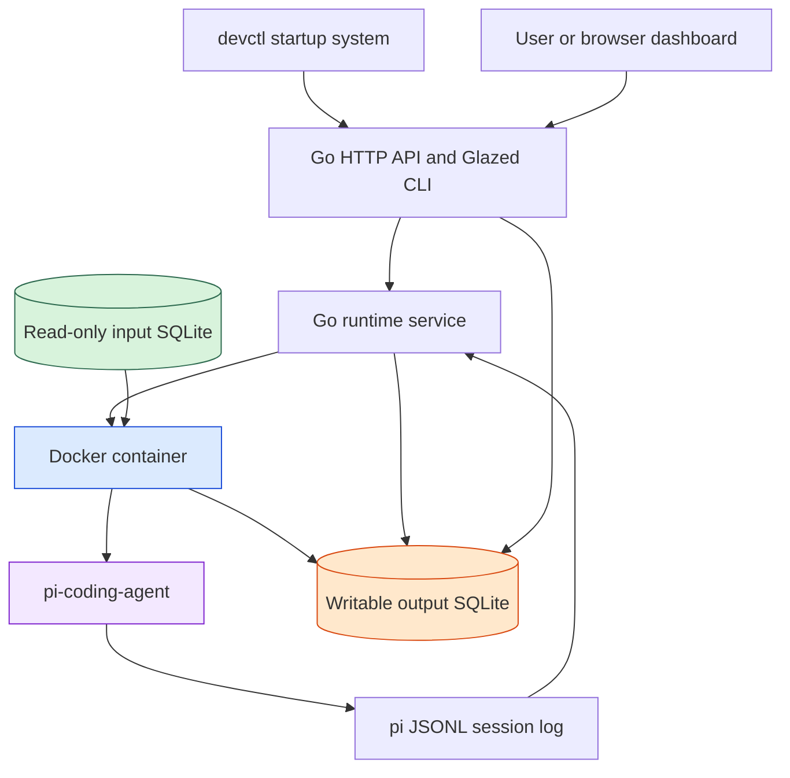
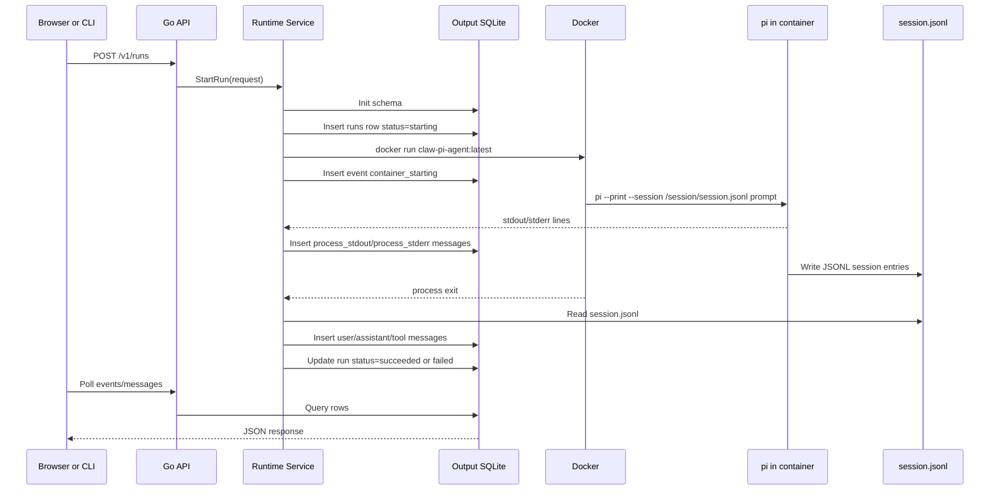

# Docker Pi Agent Runtime - SQLite Container Setup

This project builds a small local runtime for running [[pi]] as a Dockerized coding agent over a SQLite-backed input/output boundary. The goal is not to replace pi's agent loop. The goal is to place pi inside a controlled execution shell: a read-only input database, a writable output database, a Docker container, a Go HTTP API, and a dashboard that can observe runs as they happen.

> [!summary]
> The project is a local agent-container runtime with three central ideas:
> 1. **Pi owns the agent loop.** The Go service starts and observes pi; it does not reimplement tool calling, turns, model selection, or session history.
> 2. **SQLite defines the boundary.** The input database is mounted read-only, while the output database records runs, events, and dashboard messages.
> 3. **Docker gives each run a clear execution envelope.** The container receives only the mounted files and pi configuration it needs.

The system began as a hand-drawn architecture: project state flows from a central database into a read-only SQLite snapshot; an agent runs in a container; outputs flow into a writable database and a dashboard. The implementation deliberately starts smaller. Postgres and project export are future upstream concerns. The runtime today accepts an existing SQLite input file, starts Dockerized pi, and writes observable run state into a managed SQLite output database.

## Why this project exists

A coding agent is most useful when it can act with enough context and enough tools to get work done. It is also most dangerous when it has too much ambient authority. If an agent has direct access to the full host filesystem, long-lived credentials, arbitrary network egress, and an unstructured log stream, then every run becomes difficult to inspect and difficult to reproduce. You may know that the agent did something useful, but you cannot easily answer: what was the initial state, what did it see, what did it emit, and what remains after the process exits?

This project answers that problem with a simple discipline: the agent run has an explicit input, an explicit output, and a disposable execution envelope. The input is a SQLite database mounted read-only. The output is another SQLite database that records run metadata, events, and messages. The execution envelope is a Docker container running pi. The Go server is the coordinator that prepares these pieces, starts the container, and presents the result through an HTTP API and a small dashboard.

That separation matters because it changes how we reason about agent work. A normal shell session is a blur of commands, stdout, files, and history. A run in this system is a record:

- There was an input database at a path.
- There was a run ID.
- There was a Docker image.
- There was a pi session file.
- There were events with timestamps.
- There were messages suitable for a dashboard.
- There was a final status.

The design is not complete sandboxing. Docker is not a hostile-code security boundary by itself, and the current prototype mounts `~/.pi/agent` for pi credentials and settings. But the project already gives us a much clearer shape than an ad hoc script.

## Current project status

The repository is active and has a working prototype. The current implementation can:

- build a Docker image named `claw-pi-agent:latest`,
- bake pi and the configured pi provider/extension packages into that image,
- mount a read-only input SQLite database into the container as `/data/input.db`,
- mount a writable output database as `/data/output.db`,
- mount a run session directory as `/session`,
- mount the host pi configuration directory into `/root/.pi/agent`,
- start pi in print mode,
- stream process stdout and stderr into the output database,
- ingest pi's JSONL session log after the run finishes,
- expose an HTTP API and simple web dashboard,
- manage the whole dev setup through `devctl`.

The current runtime still uses `pi --print`. A new design ticket, `PI-RPC-SDK-RUNTIME`, plans the next step: switch to pi RPC or SDK integration so the dashboard can receive structured live events such as assistant text deltas, tool execution updates, queue updates, extension UI requests, aborts, and steering messages.

## Project shape

At a high level, the project has five layers.



The Go API is the face of the system. It is what the browser and CLI talk to. The runtime service behind it knows how to validate paths, create the output database, assign run IDs, start Docker, stream process logs, and record completion. The Docker image contains pi and all pinned pi packages needed by the mounted `~/.pi/agent/settings.json`. SQLite is used twice: once as the input snapshot and once as the output ledger.

This shape deliberately avoids a distributed queue, a separate Postgres dependency, and a bespoke agent protocol. Those may appear later. The prototype is a single-machine system that can be understood by reading a handful of files.

## The core mental model

The simplest way to understand the runtime is to think of an agent run as a function:

```text
run(input.db, prompt, pi-config, image) -> output.db + session.jsonl + status
```

That notation is not merely a simplification. It captures the reason the system is useful. The input database is the initial world. The prompt is the instruction. The pi config provides model/provider credentials and extensions. The image provides the software environment. The output database and session log are the observable result.

A conventional process can mutate anything it can reach. This runtime tries to narrow what the process can reach. The agent sees the input database at a stable path, `/data/input.db`, but it is mounted read-only. The agent can write to the output database and session directory. The host can inspect the output database while the run proceeds. When the container exits, the host still has a compact, queryable record.

```text
Before run:
  tmp/input.db         # project snapshot or fixture
  ~/.pi/agent          # pi settings, auth, models, packages
  claw-pi-agent:latest # software environment

During run:
  /data/input.db       # read-only view inside container
  /data/output.db      # writable output DB inside container
  /session/session.jsonl

After run:
  .claw-runs/.../claw-output.db
  .claw-runs/.../run_<id>/session.jsonl
```

The project uses SQLite not because SQLite is glamorous, but because it is exactly the right size for the boundary. A SQLite file is copyable, mountable, inspectable, and easy to archive. It gives the system a concrete artifact instead of a vague claim that "the agent had context."

## Architecture in detail

### The run lifecycle

When a caller starts a run, the runtime follows a fixed sequence. Understanding this sequence is the key to understanding the whole project.



There are three moments where the runtime writes useful state:

1. **At run creation**, it writes the run row and `run_created` event. This gives the dashboard something to display immediately.
2. **During execution**, it streams stdout and stderr as `process_stdout` and `process_stderr` messages. This makes setup logs, warnings, and pi output visible while the process is active.
3. **After execution**, it ingests pi's session JSONL file and records structured user, assistant, and tool result messages.

The third step is the limitation that motivates the next ticket. The structured pi messages arrive after completion because print mode is a one-shot interface. RPC mode will let the system receive structured events while pi is running.

### The Docker boundary

The Docker image is defined in `Dockerfile.pi-agent`. It uses `node:22-bookworm-slim`, installs shell basics, `git`, `ripgrep`, and `sqlite3`, then installs pi and the pi packages currently configured in the host pi settings.

The pinned package list is not an implementation detail; it is a startup-time decision. Earlier versions of the prototype allowed pi to install packages at container startup. That worked, but it made the first seconds of every run noisy and slow. Baking the packages into the image moves that cost to build time.

Current pinned packages:

```dockerfile
RUN npm install -g \
    @mariozechner/pi-coding-agent@0.70.6 \
    claude-agent-sdk-pi@1.0.20 \
    @thesethrose/pi-zai-provider@1.0.0 \
    @imsus/pi-extension-minimax-coding-plan-mcp@1.0.2 \
    pi-provider-kimi-code@0.3.0
```

The image sets:

```dockerfile
ENTRYPOINT ["pi"]
```

That means Docker arguments after the image name are pi arguments. The runtime must append `--print`, `--session`, and the prompt. It must not append another `pi` executable name.

The Docker mount set is assembled in `internal/runtime/runtime.go`:

```text
Host path                         Container path       Mode
---------                         --------------       ----
<input DB>                        /data/input.db       read-only
<output DB>                       /data/output.db      read-write
<session directory>               /session             read-write
~/.pi/agent or --pi-home          /root/.pi/agent      read-write by default
```

The read-only input mount is the important one. It means pi can inspect the database but cannot rewrite it. The writable output mount gives the run a place to leave state. The pi home mount provides credentials and settings. That mount is convenient and necessary for the current prototype, but it is also the most sensitive part of the system.

## SQLite as the boundary

The output database is intentionally small. It is not meant to be a full clone of pi's internal session model. Pi already writes a session JSONL file containing full turn history, tool calls, usage, and provider details. The output database is the dashboard index.

The current schema lives in `internal/store/store.go`.

### runs

A run row is the spine of the system.

```sql
CREATE TABLE IF NOT EXISTS runs (
  id TEXT PRIMARY KEY,
  input_db_path TEXT NOT NULL,
  output_db_path TEXT NOT NULL,
  session_path TEXT,
  agent_image TEXT NOT NULL,
  status TEXT NOT NULL,
  started_at TEXT NOT NULL,
  finished_at TEXT,
  error TEXT
);
```

A run answers the question: what process did we start, over what input, and how did it end?

### events

Events are compact lifecycle facts.

```sql
CREATE TABLE IF NOT EXISTS events (
  id INTEGER PRIMARY KEY AUTOINCREMENT,
  run_id TEXT NOT NULL,
  ts TEXT NOT NULL,
  level TEXT NOT NULL,
  type TEXT NOT NULL,
  message TEXT NOT NULL,
  payload_json TEXT,
  FOREIGN KEY(run_id) REFERENCES runs(id)
);
```

The dashboard uses events for status display. Examples include:

- `run_created`
- `container_starting`
- `session_ingested`
- `run_succeeded`
- `run_failed`

### messages

Messages are transcript-like rows for the dashboard.

```sql
CREATE TABLE IF NOT EXISTS messages (
  id INTEGER PRIMARY KEY AUTOINCREMENT,
  run_id TEXT NOT NULL,
  session_entry_id TEXT,
  parent_entry_id TEXT,
  ts TEXT NOT NULL,
  role TEXT NOT NULL,
  content TEXT NOT NULL,
  raw_json TEXT,
  FOREIGN KEY(run_id) REFERENCES runs(id)
);
```

The same table holds two classes of messages:

- Process messages streamed during execution, with roles such as `process_stdout` and `process_stderr`.
- Pi session messages ingested after execution, with roles such as `user`, `assistant`, and `toolResult`.

This dual use is pragmatic. It lets the dashboard present one timeline. But the distinction matters: process stdout is a stream of lines, while pi session messages are structured agent history.

## The Go runtime

The runtime's central type is `Service` in `internal/runtime/runtime.go`:

```go
type Service struct {
    RunsDir         string
    DefaultOutputDB string
}
```

The default output database is derived from the run directory:

```go
return &Service{
    RunsDir: runsDir,
    DefaultOutputDB: filepath.Join(runsDir, "claw-output.db"),
}
```

This small default changed the user experience. Earlier, the dashboard required a user to enter an output database path and a run ID. The current server owns a default database under `.claw-runs/devctl/claw-output.db`, so the browser can start and select runs without asking the user to paste internal paths.

### StartRun

`StartRun` is the entry point for a run. It resolves defaults, validates the input database, opens or creates the output database, initializes the schema, creates a run ID, creates the session directory, inserts the run row, and either runs synchronously or starts a goroutine.

The flow can be read as pseudocode:

```text
function StartRun(request):
    request.output_db = request.output_db or service.default_output_db
    request.image = request.image or "claw-pi-agent:latest"
    request.pi_home = request.pi_home or "$HOME/.pi/agent"
    request.prompt = request.prompt or default prompt

    validate input database opens read-only
    create output database parent directory
    initialize output schema

    run_id = timestamp-based id
    session_path = runs_dir/run_id/session.jsonl

    insert runs row with status "starting"
    insert event "run_created"

    if request.wait:
        execute run in this goroutine
        return final run row
    else:
        execute run in background
        return starting run row
```

The `--wait` option is important for smoke tests. Without it, a CLI invocation can return before the Docker process has finished. For the web server, background execution is correct. For tests, synchronous execution is easier to reason about.

### execute

`execute` is the host-side run supervisor. It opens the output database, marks the run as running, starts the Docker command, attaches to stdout and stderr, waits for the process to finish, ingests the session file, and updates the final status.

The key implementation idea is that stdout and stderr are streamed into SQLite while the process is still running:

```go
go streamLines(ctx, &wg, stdout, st, runID, "process_stdout")
go streamLines(ctx, &wg, stderr, st, runID, "process_stderr")
```

That makes the dashboard live enough to show process output during execution. It does not yet make pi's internal events live. That is why the next design moves to RPC.

### buildCommand

`buildCommand` is where the container boundary becomes concrete. The current command is equivalent to:

```bash
docker run --rm \
  --mount type=bind,src=/abs/input.db,dst=/data/input.db,readonly \
  --mount type=bind,src=/abs/output.db,dst=/data/output.db \
  --mount type=bind,src=/abs/session-dir,dst=/session \
  --mount type=bind,src=$HOME/.pi/agent,dst=/root/.pi/agent \
  claw-pi-agent:latest \
  --print \
  --session /session/session.jsonl \
  "<prompt>"
```

The actual Go code uses `exec.CommandContext`, not a shell string. That is the right choice because it avoids shell quoting bugs and makes each Docker argument explicit.

## The HTTP API and dashboard

The HTTP server is intentionally simple. It uses Go's standard `net/http` mux and serves both JSON endpoints and a static HTML/JavaScript dashboard from `internal/api/server.go`.

Important endpoints:

```text
GET  /healthz
GET  /
GET  /app.js
POST /v1/runs
GET  /v1/runs
GET  /v1/runs/{id}
GET  /v1/runs/{id}/events
GET  /v1/runs/{id}/messages
```

The dashboard lets a user enter an input DB and a prompt, start a run, refresh the run list, click a run, and poll its events/messages. It uses the server's default output database unless the user provides an override.

The dashboard is not meant to be the final UI. It is a thin teaching tool and debugging surface. Its value is that it proves the runtime loop works end to end:

```text
browser -> Go API -> Dockerized pi -> SQLite output -> browser polling
```

## devctl as the startup system

The project now uses `devctl` to make local startup repeatable. That matters because this repo is no longer just a Go binary. To start it correctly, a developer must ensure Docker is available, the image is built, tests pass, and the dashboard process is supervised.

The workflow is documented in `DEVCTL.md`:

```bash
devctl up --force --timeout 900s
```

The devctl plugin does four things:

1. `config.mutate` defines stable config values such as the service port and image name.
2. `validate.run` checks for `go`, `docker`, `make`, Docker daemon availability, and the pi home directory.
3. `build.run` runs `go test ./...` and `make docker-build`.
4. `launch.plan` returns a `claw-dashboard` service for devctl to supervise.

The service command is:

```bash
go run ./cmd/claw-agent serve --addr :8787 --runs-dir .claw-runs/devctl
```

The health check is:

```text
http://127.0.0.1:8787/healthz
```

This is the right division of responsibilities. The plugin computes what should be built and launched. devctl handles the process lifecycle, logs, state file, and shutdown.

## A worked example

A minimal input database can be created with Python:

```bash
mkdir -p tmp
python3 - <<'PY'
import sqlite3
conn = sqlite3.connect('tmp/input.db')
conn.execute('create table if not exists project(id text primary key, name text)')
conn.execute('insert or replace into project values (?,?)', ('p1', 'demo-project'))
conn.commit()
conn.close()
PY
```

Start the environment:

```bash
devctl up --force --timeout 900s
```

Then open:

```text
http://127.0.0.1:8787/
```

Use a prompt like:

```text
Use bash to run: sqlite3 /data/input.db "select name from project limit 1;". Then answer exactly: OK <name>
```

The intended trace is:

```text
run_created
container_starting
process_stdout / process_stderr lines, if any
session_ingested
run_succeeded
```

The final messages should include:

```text
user:      Use bash to run sqlite3 ...
assistant: [tool call] bash
toolResult: demo-project
assistant: OK demo-project
```

This example is deliberately small. It proves the boundary. If pi can read `/data/input.db`, run `sqlite3`, and return the expected answer, then the Docker mount, pi configuration, output database, session ingestion, and dashboard are all connected.

## Design decisions and why they matter

### Pi owns the agent loop

The Go runtime does not implement an agent loop. It does not decide when to call a model, how to parse tool calls, how to apply thinking levels, or how to manage session compaction. Pi already does those things. Reimplementing them would create a second agent framework and immediately make the project harder to maintain.

The Go runtime is therefore an orchestrator. Its job is to define the boundary around pi, not to become pi.

### SQLite is the run ledger

The output database is not a message queue and not a warehouse. It is a ledger for local development and dashboard display. SQLite is well suited to this because it keeps run state in a single file and gives us SQL inspection without requiring a server.

The current schema is intentionally minimal. Adding too many tables too early would force the runtime to guess which pi details matter. The next ticket adds raw RPC events and tool execution tables only because the dashboard needs them for live streaming.

### Docker is a boundary, not a complete security model

Docker gives us mount control, a disposable process, a pinned software environment, and repeatable startup. It does not make arbitrary agent behavior safe by itself. The host pi credentials are mounted into the container. The model can request tool calls. The system should be treated as a developer-convenience isolation boundary, not as a hostile sandbox.

### devctl captures operational knowledge

Before devctl, startup knowledge lived in memory and scattered commands: build the image, run tests, start the server, check the port. The devctl plugin makes that knowledge executable. A new developer can run `devctl up` and get the same build and launch path.

## Current limitations

The biggest limitation is that the system still uses `pi --print`. Structured pi session messages are available only after the run completes and the session JSONL file is ingested. The dashboard can stream process stdout/stderr during execution, but process output is a blunt instrument.

Other limitations:

- The pi home mount gives the container access to host pi configuration and credentials.
- There is no per-run network policy yet.
- The dashboard is a minimal static page, not a polished application.
- There is no cancellation endpoint wired to a running Docker process yet.
- The output database is a dashboard index, not a full structured representation of every pi event.
- The Docker image's pinned package list must be kept in sync with `~/.pi/agent/settings.json`.

## The next step: pi RPC/SDK integration

The project already has a follow-up ticket for this: `PI-RPC-SDK-RUNTIME`. The idea is to replace the opaque print-mode process with a structured integration.

In RPC mode, pi runs as:

```bash
pi --mode rpc --session-dir /session
```

The Go runtime sends JSON commands to stdin:

```json
{"id":"req-1","type":"prompt","message":"Inspect /data/input.db and summarize it."}
```

Pi emits JSON events on stdout:

```json
{"type":"message_update","assistantMessageEvent":{"type":"text_delta","delta":"Hello"}}
```

That changes the dashboard from a polling log viewer into a live agent console. It can show assistant text deltas, tool execution progress, queue changes, compaction, retries, and extension UI requests while the run is active.

The SDK path goes one step further. A Node worker can import `@mariozechner/pi-coding-agent`, create an `AgentSession`, subscribe to events directly, and expose a worker protocol to Go. That is more powerful, but it adds a TypeScript service. The design therefore recommends RPC first and SDK worker later.

## Implementation map

A new reader should start with these files:

| File | Why it matters |
|---|---|
| `internal/runtime/runtime.go` | Shows how runs are started, how Docker is invoked, and how stdout/stderr/session ingestion works. |
| `internal/store/store.go` | Defines the SQLite schema and all current DB read/write paths. |
| `internal/api/server.go` | Defines the HTTP API and the static dashboard. |
| `internal/session/ingest.go` | Converts pi JSONL session entries into dashboard messages. |
| `Dockerfile.pi-agent` | Defines the container image and pinned pi package set. |
| `scripts/devctl-plugin.py` | Encodes the devctl build/validate/launch pipeline. |
| `DEVCTL.md` | Explains how to run the project in daily development. |
| `ttmp/2026/04/29/PI-RPC-SDK-RUNTIME--pi-rpc-sdk-runtime-integration/design-doc/01-pi-rpc-sdk-runtime-integration-design-and-implementation-guide.md` | Plans the RPC/SDK streaming implementation. |

## Failure modes to remember

### Repeated npm installs at startup

This happened when configured pi packages were not baked into the image. Pi saw packages in `~/.pi/agent/settings.json`, found them missing in the container, and installed them on startup. The result was slow runs and noisy stderr. The fix was to pin and install the packages in `Dockerfile.pi-agent`.

### Stale manual server on port 8787

A manually launched server can keep the port busy and confuse devctl. The working rule is to use devctl for lifecycle:

```bash
devctl status
devctl down
devctl up --force --timeout 900s
```

### JSON columns scanning as `json.RawMessage`

SQLite returned JSON text columns as strings. Scanning directly into `json.RawMessage` caused API failures. The fix was to scan into strings and then convert to `json.RawMessage`.

### Losing structured events with print mode

Print mode is not a streaming event API. It is useful for a prototype, but any dashboard that needs live tool events must move to RPC or SDK.

## Working rules

- Treat the input database as immutable during a run.
- Treat the output database as the dashboard index, not the full pi source of truth.
- Keep pi's JSONL session file as the authoritative transcript for print-mode runs.
- Do not reimplement pi's agent loop in Go.
- Use devctl to start and stop the dashboard server.
- Rebuild the Docker image after changing the pinned pi package list.
- Keep Docker arguments explicit with `exec.CommandContext`; avoid shell-assembled Docker commands.
- Preserve print mode as a fallback until RPC mode has its own smoke tests.

## Near-term next steps

1. Implement an `internal/pi/rpc_client.go` package with fake JSONL tests.
2. Add a `pi_mode` option so runs can choose `print` or `rpc`.
3. Store raw RPC events in a new `rpc_events` table.
4. Map tool execution events into a `tool_executions` table.
5. Add HTTP control endpoints for `abort`, `steer`, `follow-up`, and `state`.
6. Add a Server-Sent Events endpoint for live browser updates.
7. Update the dashboard to show active tool calls and streaming assistant text.
8. Decide whether a Node SDK worker is needed after RPC mode is stable.

## Closing thought

The project is small, but it teaches a general pattern. When an agent becomes powerful enough to do useful work, the engineering problem shifts from "how do I call the model?" to "how do I make the run observable, bounded, and replayable?" This runtime answers that question with ordinary tools: Docker for process boundaries, SQLite for artifacts, Go for the control plane, pi for the agent loop, and devctl for repeatable startup. The value is not any single component. The value is the shape they create together.
