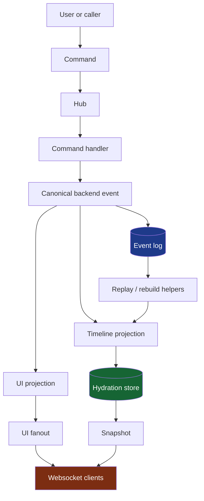
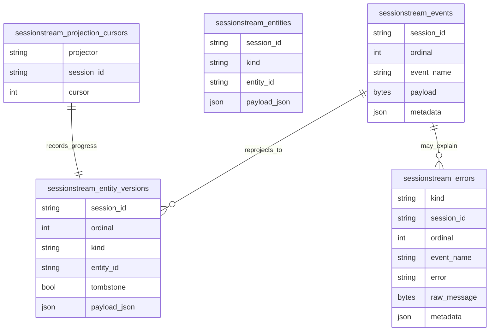
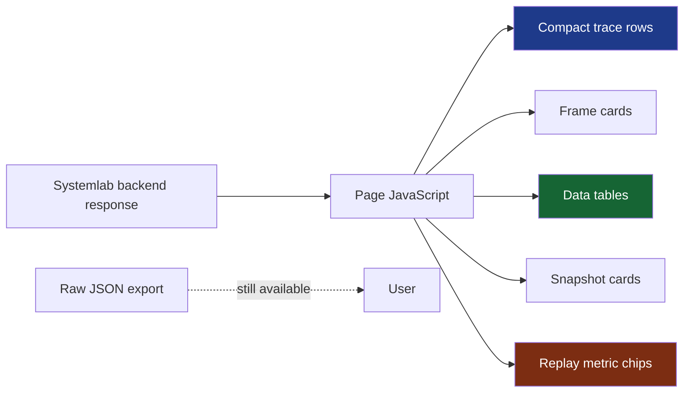

# Sessionstream — Replay Store Remediation and Systemlab UI Refinement

This is the replay-store branch of the [[sessionstream]] project map.

This report describes the sessionstream work completed on 2026-04-29. It is written as a technical narrative rather than as a changelog. The goal is to preserve the design reasoning behind the work: why replay semantics were added, why websocket command ingress was deliberately left out, why local storage now goes through SQLite, and why Systemlab had to become both a teaching instrument and a usable visual debugger.

> [!summary]
> The day’s work turned `sessionstream` from a mostly live-projection framework into a system with durable replay foundations, explicit projection/error semantics, generated protobuf examples, and a much clearer Systemlab UI. The most important architectural move was separating the **event cursor** from the **timeline projection cursor**. The most important product move was replacing raw JSON-heavy Systemlab panels with compact rendered evidence: trace rows, tables, cards, metrics, and focused screenshots.

## Why this work existed

`sessionstream` is a generic substrate for session-based streaming workflows. A caller submits a command into a session. The command handler emits canonical backend events. Projections derive two views from those events: live UI fanout and durable timeline state. A websocket adapter can deliver snapshots and live UI frames to browser clients. Systemlab exists beside the framework as a teaching and validation app: each phase demonstrates one part of the substrate.

Before this remediation, the architecture had several dangerous ambiguities. Runtime names still contained `evtstream`, which made the extracted package feel like it had not finished becoming `sessionstream`. A generic transport abstraction implied command ingress even though websocket command frames were not actually supported. Local ordinals could restart incorrectly because they did not seed from persisted state. Projection failures could advance too casually. The old map-backed memory store had semantics that could drift away from SQLite. And Systemlab’s later phases contained large files and large raw JSON panels that made it harder to see what the framework was doing.

The work fell into two connected tickets:

- `SESSIONSTREAM-003` handled the architectural remediation: replay store, cursor correctness, error recording, API cleanup, generated protobuf chat demo, and Systemlab refactoring.
- `SESSIONSTREAM-004` handled the Systemlab UI density and readability pass: compact trace rows, rendered tables, rendered websocket frames, replay metrics, and component-level screenshots.

## The central mental model

The framework is easiest to understand as a pipeline with two projection paths. The backend event stream is canonical. UI events and timeline entities are derived views.



The important design boundary is that the handler does not return UI state. It publishes events. Once the event exists, the framework can ask two separate questions:

1. What should connected clients see right now?
2. What durable state should a reconnecting or restarted process see later?

Those questions are answered by different projections. That separation is what makes replay meaningful. If timeline state is wrong, the event log can be replayed without pretending that the UI fanout path is the source of truth.

## Replay: separating event cursor from projection cursor

The most important backend change was adding real replay/event-store semantics. Before this work, the hydration cursor mostly represented the latest materialized timeline state. That is useful, but it is not enough to reason about failure. If an event is durably stored but timeline projection fails, the system needs to be able to say:

```text
event cursor:    7
timeline cursor: 4
```

That gap is not a cosmetic detail. It is the precise diagnosis: events 5 through 7 exist, but the timeline projection has not successfully materialized them. If the system only had one cursor, it would either hide the failure or conflate event ingestion with projection success.

The remediation added interfaces in `pkg/sessionstream/hydration.go`:

```go
type EventStore interface {
    AppendEvent(ctx context.Context, ev Event) error
    Events(ctx context.Context, sid SessionId, after uint64, limit int) ([]Event, error)
    EventCursor(ctx context.Context, sid SessionId) (uint64, error)
}

type ProjectionCursorStore interface {
    ProjectionCursor(ctx context.Context, projector string, sid SessionId) (uint64, error)
    AdvanceProjectionCursor(ctx context.Context, projector string, sid SessionId, ordinal uint64) error
}
```

The concrete SQLite store now maintains separate tables for the event log, entity versions, projection cursors, and errors. The simplified schema shape looks like this:



The replay helpers added to `Hub` are deliberately backend-facing rather than operator-facing HTTP endpoints:

- `Hub.EventCursor`
- `Hub.ProjectionCursor`
- `Hub.RebuildTimeline`
- `Hub.RetryTimeline`
- `Hub.RebuildTimelineFromScratch`

This distinction matters. The framework now has the primitives required to rebuild materialized timeline state, but Systemlab does not expose retry buttons. The user explicitly chose not to add operator-facing retry endpoints in this slice. Instead, Systemlab exposes read-only cursor/error inspection so the concepts are visible without adding premature operational controls.

## SQLite became the single local storage path

The old map-backed memory store was removed. Local and ephemeral modes now use in-memory SQLite via `storesqlite.NewInMemory(reg)`.

This was not only a cleanup. It was a semantic decision. A separate map-backed store is attractive because it is easy to understand, but it quickly becomes dangerous when SQLite grows replay features. Every store must agree on cursor advancement, snapshot semantics, event append behavior, projection cursor behavior, and historical entity versions. Keeping a simplified store around would invite a fork in behavior between tests/local demos and real persistence.

The new rule is simple:

> Local users still get an ephemeral store, but that store is SQLite.

That means in-memory mode and disk-backed mode share the same implementation. A restart demo may still choose ephemeral semantics, but it does not do so by exercising a different code path.

## Projection failure became explicit

Projection failures now fail closed by default. The framework also gained separate policy controls for UI and timeline projection behavior:

- `ProjectionErrorPolicyFail`
- split UI/timeline policy options
- `WithProjectionPolicies`
- `WithUIProjectionErrorPolicy`
- `WithTimelineProjectionErrorPolicy`
- `ErrorObserver` and durable `ErrorRecord` support

The key idea is that UI projection and timeline projection have different consequences. A UI fanout failure may affect live clients. A timeline projection failure affects durable state and replay correctness. Treating them as one knob is too blunt.

The remediation also records decode, ordinal, UI projection, timeline projection, fanout, and store errors into the durable error store when available. This is what allows Phase 5 Systemlab to show not only that cursors differ, but why they differ.

One production-hardening item was deliberately deferred: configurable bus decode ack/nack behavior. Today’s default remains poison-message-safe record-and-ack. A GitHub issue was opened for the flexible policy:

- `go-go-golems/sessionstream#1` — configurable bus decode error ack/nack policy.

The deferred policy is important, but it does not belong in the same slice as the replay-store remediation. The current default keeps local and Systemlab behavior safe by avoiding infinite retry loops on malformed messages.

## Websocket stayed fanout-only

A major cleanup was removing misleading command-ingress implications. The old generic transport abstraction was deleted. `Command.ConnectionId` was removed. The websocket adapter is now explicitly documented and tested as a snapshot/fanout adapter.

The supported websocket client frames are intentionally small:

```text
subscribe
unsubscribe
ping
```

A command frame is rejected as unsupported. The test `TestServerRejectsCommandFramesAsUnsupported` codifies this boundary.

`sinceOrdinal` remains in subscribe frames, but it is now documented as advisory. The adapter parses, stores, echoes, and traces it, but it does not replay missed UI events. Subscribe means:

1. Send a current snapshot.
2. Register for future live UI fanout.

Replay belongs behind explicit replay APIs. Hiding replay behind websocket subscribe would create a half-contract that looks reliable but is hard to reason about.

## Schema-first chat demo

The chat demo moved from generic `structpb.Struct` payloads to generated protobuf messages. The new schema lives at:

```text
examples/chatdemo/proto/sessionstream/examples/chatdemo/v1/chat.proto
```

Generated Go code lives under:

```text
examples/chatdemo/gen/sessionstream/examples/chatdemo/v1/chat.pb.go
```

The example now registers generated message prototypes for commands, events, UI events, and timeline entities. Tests assert that timeline payloads are concrete generated types such as:

```go
*chatdemov1.ChatMessageEntity
```

This matters because `sessionstream` is meant to be a substrate, not a toy JSON router. The generated protobuf example demonstrates a real schema-first path while still using JSON transport where appropriate.

One important limitation remains: there is not yet a dedicated standalone chatdemo binary. The chat demo exists as a package and is exercised through Systemlab Phase 4. A good next step would be a focused `cmd/sessionstream-chatdemo` app with its own HTML, chat-first UI, and sessionstream inspector.

## Systemlab became more maintainable

Systemlab is a teaching app, but teaching code still needs structure. Phase 2 and Phase 5 were large files mixing runtime setup, actions, projections, checks, clone helpers, and rendering. They were split into role-oriented files.

Phase 2 now has files such as:

```text
phase2_lab.go          constants, DTOs, state types
phase2_runtime.go      hub/store/bus setup and lifecycle
phase2_actions.go      scenario actions and response assembly
phase2_projections.go  command handler, projections, bus hooks
phase2_checks.go       invariant checks
phase2_render.go       transcript rendering
phase2_clone.go        clone helpers
```

Phase 5 received the same treatment:

```text
phase5_lab.go          constants, DTOs, state/runtime types
phase5_runtime.go      SQLite runtime construction and shutdown
phase5_actions.go      seed/restart/refresh flow
phase5_projections.go  command handler and projections
phase5_checks.go       persistence/restart checks
phase5_clone.go        response clone helper
```

Before the split, `phase2_lab.go` was roughly 792 lines and `phase5_lab.go` was roughly 466 lines. After the split, the largest new files were around two hundred lines, and the phase entry files became small maps of the phase’s vocabulary.

The refactor also extracted shared helpers:

- `trace_helpers.go` for trace append/clone behavior
- `snapshot_helpers.go` for snapshot and protobuf payload encoding
- `ws_hooks.go` for websocket trace hook construction

This was intentionally not a grand abstraction. The phase logic remains visible. The helpers remove mechanics, not lessons.

## Systemlab became more readable

The second major arc of the day was visual. The initial Phase 1 screenshot showed that the rendered Trace and Session + UI Events panels wasted a large amount of vertical space. Short trace rows looked like sparse records in a huge black area. UI events were oversized cards.

The fix was not merely “smaller CSS.” It was to treat Systemlab evidence as teaching material. Raw JSON is data; a rendered trace row is evidence. A table can teach ordering better than a nested JSON blob.

The frontend work added compact rendering patterns:

- Phase 1 trace rows became grid rows: step, kind badge, message.
- Phase 1 UI events became compact timeline rows.
- Check badges were reduced from large bubbles to small status chips.
- A Components / Density Sandbox page was added for static visual iteration.
- Phase 2 raw JSON panels became tables and compact cards.
- Phases 3–5 use shared compact renderers for traces, websocket frames, snapshots, replay metrics, and restart state.

The new shared frontend renderer module is:

```text
cmd/sessionstream-systemlab/static/js/renderers.js
```

It renders:

- compact traces
- websocket frame cards
- connection/snapshot state
- restart comparisons
- replay metrics
- error fallbacks

The rendered evidence path now looks like this:



The important distinction is that raw JSON was not removed from the system. Exports and raw data paths remain available. But the page now defaults to views that teach.

## A concrete example: Phase 2 after rendering

Phase 2 is about the difference between publish-time and consume-time ordering. In raw JSON, that distinction is buried in nested records. In the rendered version, the message history table makes it visible:

| Session | Label | Event | Published ordinal | Assigned ordinal | Topic |
|---|---|---:|---:|---:|---|
| `s-a` | `s-a-01` | `OrderedEvent` | `0` | `1` | `sessionstream.phase2` |
| `s-b` | `s-b-01` | `OrderedEvent` | `0` | `1` | `sessionstream.phase2` |

The lesson is now visible at a glance: published ordinal is zero because the handler does not assign canonical ordering. Assigned ordinal appears when the consumer processes the message for the session.

This is the Systemlab design rule that emerged from the day:

> Rendered mode should show meaning. JSON mode should show structure.

## Validation and commits

The work was repeatedly validated with:

```bash
go test ./...
make lint
make check
docmgr --root ttmp doctor --ticket SESSIONSTREAM-003 --stale-after 30
docmgr --root ttmp doctor --ticket SESSIONSTREAM-004 --stale-after 30
```

The relevant sessionstream commits are:

```text
aaac81d Implement replay store remediation
5f7a3e0 Document SESSIONSTREAM-003 remediation
6711969 Document websocket fanout boundaries
0e3d8d4 Defer bus decode policy follow-up
cb0ba32 Split large systemlab phase files
f57da2d Fix lint findings
37c1854 Create systemlab UI refinement ticket
4c4c9e4 Refine systemlab widget density
3b9da8e Render phase2 panels as tables
473811b Render phase3-5 panels with compact widgets
```

Screenshots and focused widget captures were saved in the SESSIONSTREAM-004 ticket under:

```text
ttmp/2026/04/29/SESSIONSTREAM-004--refine-systemlab-ui-density-and-trace-readability/sources/
```

Those screenshots matter because Systemlab is visual teaching software. A passing test proves behavior; a focused widget screenshot proves whether the behavior is legible.

## Remaining decisions

A few open decisions remain, but they are now isolated:

- `ConnectionId` placement should probably remain in core for now as generic fanout subscriber identity, not command identity.
- Descriptor-oriented schema lookup is not needed until there is a concrete schema tooling consumer.
- Configurable bus decode ack/nack behavior is deferred to GitHub issue `#1`.
- A standalone chatdemo app should be created if the chat example should be tested without Systemlab.
- Phases 2–5 may eventually need rendered/json toggles like Phase 1, though exports already preserve raw JSON access.
- Long Systemlab chapters may need collapsible sections so interactive controls and evidence panels are easier to reach.

## The deeper lesson

The technical through-line is that sessionstream needs honest boundaries. A command is not a websocket frame. A UI event is not durable state. An event cursor is not a projection cursor. A local store should not have different semantics from the real store. A raw JSON blob is not a teaching visualization.

Each remediation step made one of those boundaries explicit. The backend now has durable primitives that can describe what happened, what was projected, what failed, and what can be rebuilt. The frontend now has rendered evidence that shows those ideas without forcing the reader to decode nested JSON.

That is the project’s real progress. It is not just that more code was added. It is that the code now says more clearly what kind of system `sessionstream` is.

## Near-term next steps

The next useful increment is to build a standalone chatdemo app:

```text
cmd/sessionstream-chatdemo/
  main.go
  static/
    index.html
    app.css
    js/app.js
```

That app should be chat-first, with a compact sessionstream inspector on the side. It should use HTTP endpoints for commands, websocket only for snapshot/fanout, and rendered tabs for frames, timeline, session, and raw data. Systemlab can then remain the teaching laboratory, while chatdemo becomes the focused product-shaped example.

After that, the remaining architectural cleanup can proceed in smaller slices: resolve `ConnectionId` placement, decide whether descriptor lookup has a real consumer, and eventually implement the configurable bus decode ack/nack policy tracked in GitHub issue `#1`.
