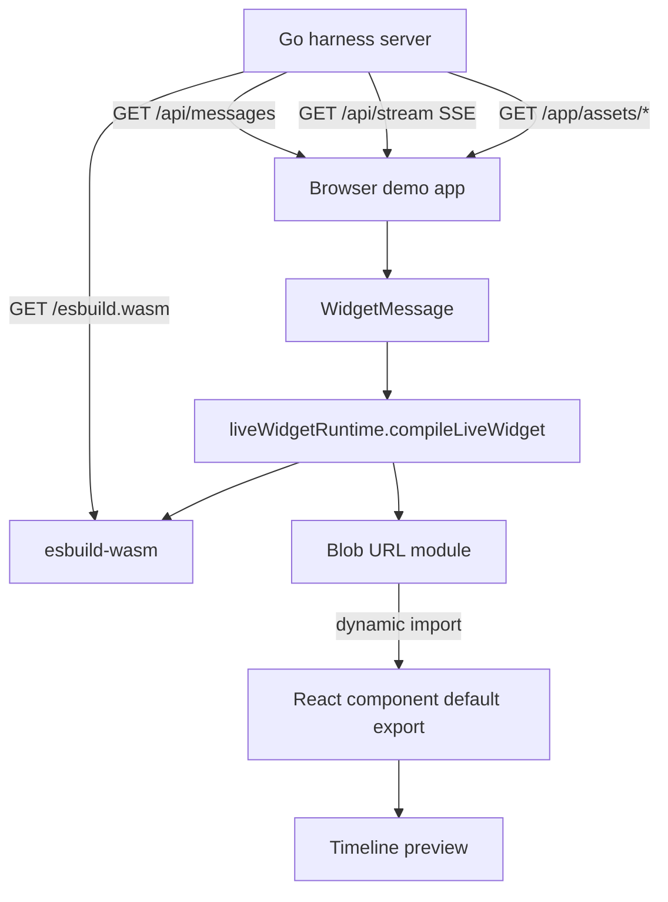
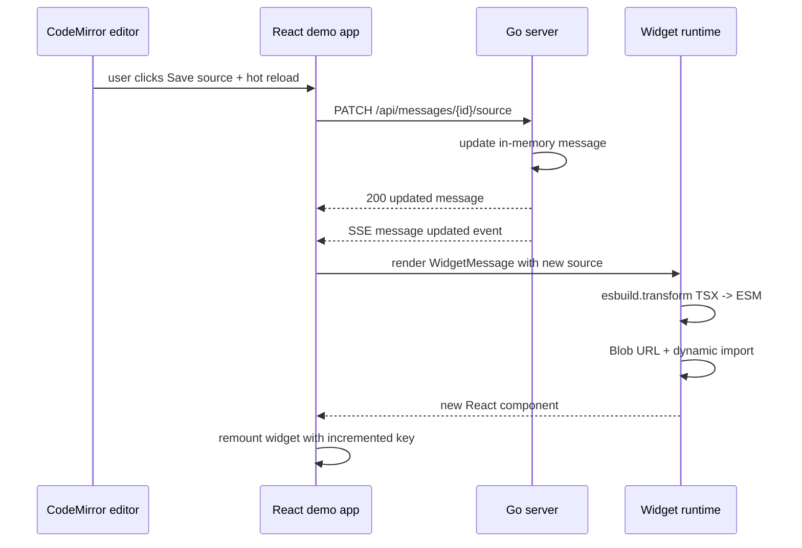
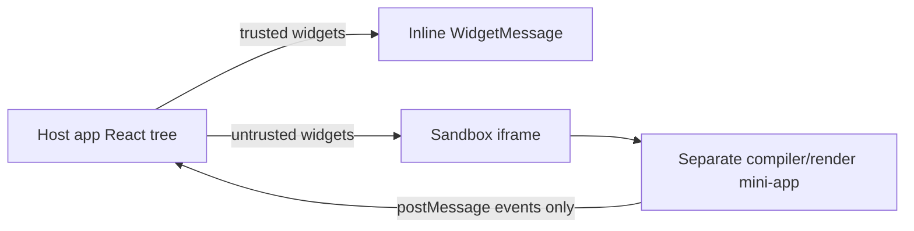
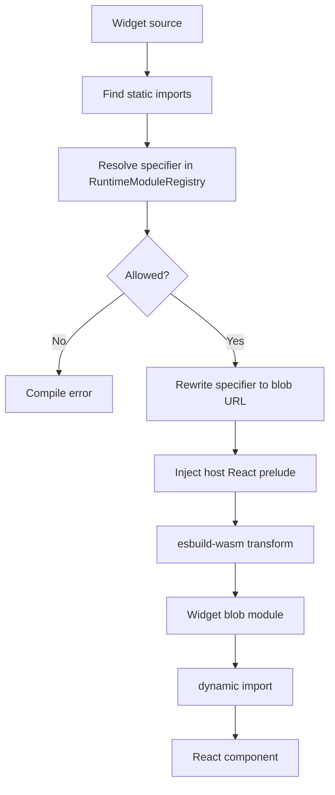
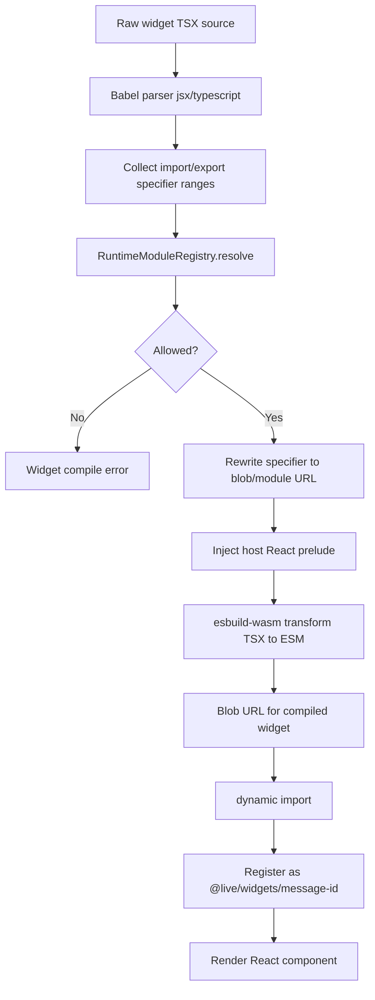

# Browser-Side React Widget Runtime

This project builds a small but important runtime experiment: a chat timeline can receive a message whose body is not merely text, but TSX source code, and the browser can compile that source into a React component, import it as a module, and render it without involving Vite HMR or a development server module graph. The current repository is both a design record and a working harness. It contains a TypeScript/React runtime, a Go server that serves widget messages and static assets, and a browser demo that lets a user edit widget TSX in CodeMirror and hot-reload the result in the page.

> [!summary]
> This project demonstrates browser-side TSX compilation and reload for React widgets.
> 1. The browser uses `esbuild-wasm` to transform user-authored TSX into ESM JavaScript.
> 2. The runtime wraps the compiled code with host-provided React bindings, creates a `blob:` URL, dynamically imports that blob module, and renders its default export.
> 3. The Go server provides the message API, SSE update stream, demo shell, built JS/CSS assets, and `/esbuild.wasm` endpoint needed for the browser runtime.

## Why this project exists

The original problem is deceptively simple: allow a chat system to display dynamically generated React widgets. A model or user should be able to produce a message whose content is a component, not a static string. That component should render inside the conversation timeline and update quickly while the source is edited.

The tempting answer is to use Vite HMR. That answer is wrong for this setting. Vite HMR is a development-server feature built around a known module graph, transformed source files, and `import.meta.hot` contracts. A widget message is different. It is source text that arrives at runtime, possibly from a database or over an API. It has no stable file path in the Vite graph and no pre-existing module identity. The runtime therefore needs a different mental model:

```text
message source string
  -> browser compiler
  -> JavaScript ESM string
  -> Blob URL
  -> dynamic import(blobUrl)
  -> React component
  -> timeline render
```

The value of the project is not just that this pipeline works. The value is that the pipeline is explicit. The code makes clear where compilation happens, where imports are constrained, where React identity comes from, where old blob URLs are revoked, and where unsafe or untrusted execution should be separated later.

## Current project status

The repository currently contains a working end-to-end harness rather than a production feature merged into an existing app. It is active and runnable.

What exists now:

- A TypeScript runtime package under `ttmp/2026/04/30/BROWSER-RELOAD-1--build-browser-side-react-hot-reload-widget-injection/sources/live-widget-runtime`.
- A browser runtime implemented in `src/liveWidgetRuntime.ts`, `src/WidgetMessage.tsx`, `src/importPolicy.ts`, `src/host.ts`, `src/security.ts`, and related files.
- A Go server under `sources/live-widget-runtime/server` using only the standard library `net/http` router.
- A Vite-built demo under `sources/live-widget-runtime/demo` that is served by the Go server.
- A CodeMirror TSX editor in the demo UI.
- Four seeded sample widgets: counter card, metric dashboard, sparkline chart, and todo checklist.
- A retro black-and-white Macintosh-style CSS theme for the demo interface.
- Build scripts that compile the runtime, bundle the browser app, copy `esbuild.wasm`, and run the Go server.

What is still intentionally not production-ready:

- The untrusted iframe runtime is only a placeholder. It shows the shape of the future security boundary but does not yet compile and render untrusted widgets in a separate origin.
- There are no automated Playwright assertions committed yet for visual behavior, widget reload, or error paths.
- The Go server is a local harness with no persistence, auth, rate limiting, or production deployment story.
- The widget import policy is deliberately strict and small. This is the correct default, but real applications will need a carefully designed allowlist and host API strategy.

## Project shape

The project has three main layers. Each layer exists to answer a different question.



1. **Message server.** The Go server owns the local message list, serves the demo shell, serves static assets, and publishes update events over Server-Sent Events.
2. **Browser demo.** The React demo fetches messages, renders text and widget messages, gives the user a CodeMirror source editor, and sends source updates back to the server.
3. **Runtime compiler and loader.** The TypeScript runtime transforms TSX, enforces import policy, injects host bindings, creates a blob module, imports it, and hands React a component.

The separation is useful because each part can be tested independently. If `/api/messages` returns widget source, the Go layer is working. If `/esbuild.wasm` has `Content-Type: application/wasm`, the compiler dependency is reachable. If `WidgetMessage` transitions from loading to a rendered component, the compile/import/render path is working.

## Current user-facing commands

The easiest way to run the full harness is from the runtime package root:

```bash
cd /home/manuel/code/wesen/2026-04-30--react-browser-reload/ttmp/2026/04/30/BROWSER-RELOAD-1--build-browser-side-react-hot-reload-widget-injection/sources/live-widget-runtime
pnpm install
pnpm build
pnpm server
```

Then open:

```text
http://127.0.0.1:8484/
```

The scripts in `package.json` matter because the Go server expects built static assets to exist under its `server/web` directory:

```json
{
  "build": "pnpm build:runtime && pnpm build:demo && pnpm copy:wasm",
  "build:runtime": "tsc -p tsconfig.json",
  "build:demo": "vite build --config demo/vite.config.mjs",
  "copy:wasm": "node demo/copy-esbuild-wasm.mjs",
  "server": "cd server && go run . -addr :8484",
  "start": "pnpm build && pnpm server"
}
```

The `cd server` in the server command is not cosmetic. The Go server's default static root is `web`, and that path is relative to the process working directory. Running from the `server/` directory means `web` resolves to `sources/live-widget-runtime/server/web`. Running `go run ./server` from the parent directory without changing the static dir would look for the wrong `web` directory.

## Important code locations

The main project files are:

- `/home/manuel/code/wesen/2026-04-30--react-browser-reload/ttmp/2026/04/30/BROWSER-RELOAD-1--build-browser-side-react-hot-reload-widget-injection/sources/live-widget-runtime/src/liveWidgetRuntime.ts`
- `/home/manuel/code/wesen/2026-04-30--react-browser-reload/ttmp/2026/04/30/BROWSER-RELOAD-1--build-browser-side-react-hot-reload-widget-injection/sources/live-widget-runtime/src/WidgetMessage.tsx`
- `/home/manuel/code/wesen/2026-04-30--react-browser-reload/ttmp/2026/04/30/BROWSER-RELOAD-1--build-browser-side-react-hot-reload-widget-injection/sources/live-widget-runtime/src/importPolicy.ts`
- `/home/manuel/code/wesen/2026-04-30--react-browser-reload/ttmp/2026/04/30/BROWSER-RELOAD-1--build-browser-side-react-hot-reload-widget-injection/sources/live-widget-runtime/src/host.ts`
- `/home/manuel/code/wesen/2026-04-30--react-browser-reload/ttmp/2026/04/30/BROWSER-RELOAD-1--build-browser-side-react-hot-reload-widget-injection/sources/live-widget-runtime/src/security.ts`
- `/home/manuel/code/wesen/2026-04-30--react-browser-reload/ttmp/2026/04/30/BROWSER-RELOAD-1--build-browser-side-react-hot-reload-widget-injection/sources/live-widget-runtime/demo/src/main.tsx`
- `/home/manuel/code/wesen/2026-04-30--react-browser-reload/ttmp/2026/04/30/BROWSER-RELOAD-1--build-browser-side-react-hot-reload-widget-injection/sources/live-widget-runtime/demo/src/style.css`
- `/home/manuel/code/wesen/2026-04-30--react-browser-reload/ttmp/2026/04/30/BROWSER-RELOAD-1--build-browser-side-react-hot-reload-widget-injection/sources/live-widget-runtime/server/main.go`
- `/home/manuel/code/wesen/2026-04-30--react-browser-reload/ttmp/2026/04/30/BROWSER-RELOAD-1--build-browser-side-react-hot-reload-widget-injection/sources/live-widget-runtime/server/storage.go`
- `/home/manuel/code/wesen/2026-04-30--react-browser-reload/ttmp/2026/04/30/BROWSER-RELOAD-1--build-browser-side-react-hot-reload-widget-injection/sources/live-widget-runtime/server/types.go`

The ticket documentation that explains the design and history lives under:

- `/home/manuel/code/wesen/2026-04-30--react-browser-reload/ttmp/2026/04/30/BROWSER-RELOAD-1--build-browser-side-react-hot-reload-widget-injection/design-doc/01-browser-side-react-widget-hot-reload-architecture.md`
- `/home/manuel/code/wesen/2026-04-30--react-browser-reload/ttmp/2026/04/30/BROWSER-RELOAD-1--build-browser-side-react-hot-reload-widget-injection/reference/01-browser-side-live-widget-injection-guide-for-interns.md`
- `/home/manuel/code/wesen/2026-04-30--react-browser-reload/ttmp/2026/04/30/BROWSER-RELOAD-1--build-browser-side-react-hot-reload-widget-injection/reference/02-diary.md`
- `/home/manuel/code/wesen/2026-04-30--react-browser-reload/ttmp/2026/04/30/BROWSER-RELOAD-1--build-browser-side-react-hot-reload-widget-injection/reference/03-live-widget-runtime-notes.md`

## The central idea: source is data until the browser imports it

A widget message is ordinary JSON when it crosses the API boundary. The server does not compile it. The server does not know what React is. It stores and returns a message shaped roughly like this:

```ts
type ChatMessage = {
  id: string;
  type: "text" | "widget";
  text?: string;
  source?: string;
  props?: Record<string, unknown>;
  widgetRuntime?: {
    trustLevel: "trusted" | "untrusted";
    allowlistMode: "strict" | "allowlist";
    permittedApis: string[];
    sourceHash?: string;
  };
};
```

The `source` field is not executable in the database or on the wire. It is just a string. It becomes executable only after the browser runtime decides that the message is a widget, passes policy checks, transforms the string through `esbuild-wasm`, creates a `Blob`, and imports the blob URL.

This distinction matters because it gives the architecture places to say no. The system can reject missing source, reject imports, reject incompatible runtime policy, reject a module without a default export, or route untrusted widgets to a sandbox path. If the string were simply shoved into `eval`, all of those decisions would be blurred together.

## How the TSX compilation pipeline works

The compile pipeline lives in `src/liveWidgetRuntime.ts`. Its job is to turn a message like this:

```tsx
export default function DemoWidget(props) {
  const [count, setCount] = React.useState(0);
  return <button onClick={() => setCount(count + 1)}>Count: {count}</button>;
}
```

into a real module that the browser can import. The pipeline is easier to understand if we separate it into seven stages.

```mermaid
flowchart TD
    A[Widget message source string] --> B[Validate source exists]
    B --> C[Resolve runtime policy]
    C --> D[Initialize esbuild-wasm once]
    D --> E[Validate and rewrite imports]
    E --> F[Prepend host React bindings]
    F --> G[esbuild.transform loader=tsx format=esm]
    G --> H[Create Blob URL]
    H --> I[dynamic import(blobUrl)]
    I --> J[Validate default export is function]
    J --> K[Cache component by message id]
    K --> L[Render in React timeline]
```

### Stage 1: validate the source exists

The compiler starts by rejecting empty widget messages:

```ts
if (!message.source) {
  throw new Error("Widget message missing source payload.");
}
```

This is a small check, but it is important. A `widget` message without `source` is not a loading state or an empty component; it is invalid input. Treating it as invalid makes failures easier to diagnose.

### Stage 2: resolve runtime policy

Each widget has a runtime policy. The current default is trusted + strict imports:

```ts
const hostPolicy = getHostPolicy({
  trustLevel: message.widgetRuntime?.trustLevel ?? "trusted",
  allowlistMode: options.allowlistMode ?? message.widgetRuntime?.allowlistMode ?? "strict",
  permittedApis: message.widgetRuntime?.permittedApis ?? [
    "React",
    "useState",
    "useEffect",
    "useMemo",
    "useCallback",
    "useRef",
  ],
});
```

Policy is resolved before compilation because import decisions and execution path decisions need to happen before any generated module is imported. The current implementation has two broad trust levels:

| Trust level | Current behavior | Intended future behavior |
|---|---|---|
| `trusted` | Compile inline in the host page and render as a React component. | Continue to support internal dashboard-style widgets with strong import controls. |
| `untrusted` | Route to `UntrustedWidgetFrame`, currently a placeholder. | Compile and render inside a sandboxed iframe with a postMessage bridge. |

The security lesson is that trust level is not a UI detail. It determines where code executes.

### Stage 3: initialize esbuild-wasm once

`esbuild-wasm` needs a wasm file. The runtime initializes it lazily:

```ts
await esbuild.initialize({
  wasmURL: "/esbuild.wasm",
});
```

The Go server serves this file at `/esbuild.wasm`. The build step copies the dependency's wasm artifact into `server/web/esbuild.wasm`, and the server also has a direct handler that returns it as `application/wasm`.

The important part is that initialization is a singleton. The runtime has:

```ts
let initialized = false;
```

and only calls `esbuild.initialize` the first time. Without this guard, repeated widget renders could attempt repeated wasm initialization, which is wasteful and can fail depending on the esbuild runtime state.

### Stage 4: enforce the import policy

The current strict policy rejects bare imports:

```ts
const rewrittenSource = validateAndRewriteImports(message.source, hostPolicy.allowlistMode);
```

Strict mode exists because arbitrary imports are a security and reproducibility boundary. A widget that says `import React from "react"` is not merely asking for a library; it may cause duplicate React instances, invalid hook calls, CDN dependencies, and unexpected network access. The current design wants widgets to use host-provided React, not their own React import.

In strict mode, this source should fail:

```tsx
import React from "react";
export default function BadImportWidget() {
  return <div>This should be rejected in strict mode.</div>;
}
```

The demo includes a **Patch bad import** button to exercise exactly this error path.

### Stage 5: inject host React bindings

The browser module being generated must refer to the same React instance as the host app. This is the detail that prevents one of the most common React runtime failures: invalid hook calls caused by two React copies.

The runtime installs a controlled global:

```ts
window.__LIVE_WIDGET_HOST__ = {
  React: context.React,
  UI: context.UI,
  allowedHelpers: context.allowedHelpers,
};
```

Then it prepends a small host prelude to the widget source:

```ts
const wrappedSource = [
  `const React = window.__LIVE_WIDGET_HOST__.React;`,
  `const { useState, useEffect, useMemo, useCallback, useRef, Fragment } = React;`,
  `const { UI, allowedHelpers } = window.__LIVE_WIDGET_HOST__;`,
  rewrittenSource,
].join("\n");
```

This means widget authors can write `React.useState(...)` without importing React. It also gives a future path for controlled host APIs: `UI`, `allowedHelpers`, or a stricter capability object. The widget receives power through the host prelude, not through arbitrary imports.

### Stage 6: transform TSX to ESM JavaScript

The central compilation call is:

```ts
const result = await esbuild.transform(wrappedSource, {
  loader: "tsx",
  format: "esm",
  target: "es2020",
  jsx: "transform",
  jsxFactory: "React.createElement",
  jsxFragment: "React.Fragment",
  sourcemap: options.sourceMap ? "inline" : false,
});
```

Each option matters:

| Option | Purpose |
|---|---|
| `loader: "tsx"` | Treats the source as TypeScript plus JSX syntax. |
| `format: "esm"` | Produces an ES module that can be loaded with dynamic `import()`. |
| `target: "es2020"` | Emits browser-compatible JavaScript without over-transforming. |
| `jsx: "transform"` | Converts JSX syntax into `React.createElement` calls. |
| `jsxFactory: "React.createElement"` | Ensures JSX uses the host React binding injected above. |
| `sourcemap: "inline"` | Allows generated widgets to be easier to inspect during development. |

The output is a JavaScript string. At this moment, it is still not a module. It is compiled text waiting for a module identity.

### Stage 7: create a blob URL and import it

Browsers can import JavaScript modules by URL. A `Blob` lets the runtime create a URL for generated source without writing a file:

```ts
const blob = new Blob([
  result.code,
  `\n//# sourceURL=live-widget-${message.id}-${sourceHash}.tsx`,
], { type: "text/javascript" });

const moduleUrl = URL.createObjectURL(blob);
const mod = await import(/* @vite-ignore */ moduleUrl);
```

The blob URL is the bridge between compiled text and the browser's module loader. The `sourceURL` comment is a debugging convenience: it gives DevTools a readable synthetic filename rather than an anonymous blob.

The `/* @vite-ignore */` comment is deliberate. Vite tries to analyze dynamic imports at build time. A blob URL is only known at runtime, so Vite must not try to pre-resolve it.

### Stage 8: validate the module contract

The widget contract is simple: the generated module must default-export a React component function.

```ts
if (typeof mod.default !== "function") {
  URL.revokeObjectURL(moduleUrl);
  throw new Error("Widget must export a default React component function.");
}
```

This turns a vague module-loading success into a precise runtime contract. A module can compile and import but still be invalid for the widget renderer. The default export check catches that boundary.

## How reload works

The reload model is not Vite HMR. There is no patch protocol and no component-level hot replacement with preserved hook state. The current reload model is simpler and more explicit:

1. The widget message source changes.
2. `WidgetMessage` observes the changed source hash through React dependencies.
3. The runtime recompiles the source.
4. If compilation and import succeed, the runtime revokes the old blob URL and caches the new component.
5. `WidgetMessage` stores the new component and bumps a version counter.
6. React remounts the widget with a new `key`.

The key code in `WidgetMessage` is:

```ts
const source = message.source ?? "";
const hash = source.split("").reduce((acc, ch) => acc + ch.charCodeAt(0), 0);

React.useEffect(() => {
  compileLiveWidget(message, { host, sourceMap: true })
    .then((compiled) => {
      setComponentState(() => compiled.component);
      setError(null);
      setVersion((n) => n + 1);
    })
    .catch((err) => {
      setError(err instanceof Error ? err.message : String(err));
    });
}, [message.id, hash, message.source, message.widgetRuntime?.sourceHash, host]);
```

And the render path uses:

```tsx
<MessageComponent key={`${message.id}:${version}`} {...(message.props ?? {})} />
```

The `key` is the important React detail. Changing the key tells React that this is not merely the same component with new props; it is a new component instance. That means local hook state is reset on successful reload. This is the right default for generated runtime modules because preserving state across arbitrary source changes is much harder than it looks. If a future product needs preserved state, it should provide an explicit widget-scoped state store rather than accidentally preserving hook internals across incompatible component definitions.

## What happens on failed reload

The runtime tries to preserve the previous working component when a recompilation fails after a successful earlier compile:

```ts
} catch (error) {
  URL.revokeObjectURL(moduleUrl);

  const previous = compiledById.get(message.id);
  if (!previous) {
    throw error instanceof Error ? error : new Error(String(error));
  }

  return {
    id: message.id,
    messageId: message.id,
    sourceHash,
    component: previous.component,
    moduleUrl: previous.moduleUrl,
    compiledAt: previous.compiledAt,
  };
}
```

This design is trying to solve a user-experience problem. If a widget is visible and a user makes a syntax mistake while editing, the whole timeline should not collapse. The runtime should either show a local error or keep the last good widget visible depending on where the failure occurred. The current behavior distinguishes:

- first compile failure: show an error because there is no previous component;
- subsequent reload failure after a prior success: return the cached previous component;
- render-time exception inside the component: let `WidgetErrorBoundary` show a local fallback.

This model still needs refinement. The user interface may want to show both the last good widget and a compile warning. But the architectural point is sound: failed reloads should not destroy unrelated timeline messages.

## Blob URL lifecycle

Blob URLs allocate browser-managed resources. If every edit creates a new blob URL and none are revoked, a rapid editing session leaks memory. The runtime therefore keeps a per-message cache:

```ts
const compiledById = new Map<string, CompiledEntry>();
```

When a new module succeeds for a message id, the previous URL is revoked:

```ts
const previous = compiledById.get(message.id);
if (previous) {
  URL.revokeObjectURL(previous.moduleUrl);
}

compiledById.set(message.id, entry);
```

When a widget is unmounted, the runtime also cleans up:

```ts
React.useEffect(() => {
  return () => {
    void cleanupWidgetRuntime(message.id);
  };
}, [message.id]);
```

The key point is that module identity is owned by the message id. Edits to the same message replace the module for that id. Removing the message should remove the associated module URL. This is the simplest lifecycle that matches the chat timeline model.

## The Go server's role

The Go server is intentionally boring. That is a strength. It uses the standard library, keeps messages in memory, serves a small static app, and provides an SSE stream for update notifications.

The main routes are:

| Route | Purpose |
|---|---|
| `GET /healthz` | Quick health check. |
| `GET /api/messages` | List text and widget messages. |
| `POST /api/messages` | Create a message, usually a widget sample. |
| `GET /api/messages/{id}` | Fetch one message. |
| `PUT /api/messages/{id}` | Replace a message. |
| `DELETE /api/messages/{id}` | Delete a message. |
| `PATCH /api/messages/{id}/source` | Update only widget source for hot-reload testing. |
| `GET /api/stream` | SSE stream for created, updated, and deleted messages. |
| `GET /esbuild.wasm` | Serve the wasm compiler file. |
| `GET /` | Serve the built demo app. |

The server seeds several widget messages at startup. This means a fresh run immediately exercises the runtime without requiring the user to create data first.

The SSE stream is useful because it makes the system feel like a live runtime rather than a static demo. When the browser patches a widget source, the server publishes an update event. The browser receives that event, replaces the message in local state, and `WidgetMessage` recompiles the changed source.



## Why the built app is served the way it is

The demo app is built by Vite in normal app mode. This matters because Vite app mode emits an `index.html` that contains the correct hashed JavaScript and CSS asset links:

```html
<script type="module" crossorigin src="/app/assets/index-....js"></script>
<link rel="stylesheet" crossorigin href="/app/assets/index-....css">
```

Earlier, the demo used Vite library mode. Library mode produced a JavaScript bundle and a CSS asset, but did not inject the CSS into the served HTML shell. That made the page load but appear unstyled. The fix was to add `demo/index.html`, configure Vite with `base: "/app/"`, and have the Go server serve `server/web/app/index.html` for `/` after `pnpm build`.

This is a practical example of a broader rule: when a Go server serves a built frontend, serve the frontend build's own HTML entry point. Do not hand-write a shell that guesses asset paths unless you also own the bundler output names.

## Security model

The project uses a security-first split even though the current harness is local.

### Strict imports by default

The import policy rejects arbitrary bare imports unless allowlist mode is explicitly used. This prevents accidental or malicious dependency loading and avoids duplicate React copies.

### Shared React instance

The runtime injects React from the host. This avoids the invalid hook call problem caused by multiple React instances and gives the host control over which APIs the widget sees.

### CSP detection

`src/security.ts` checks whether a declared CSP blocks wasm/eval capability for trusted widgets. A crucial detail was corrected during development: if no CSP is declared, the browser is not blocking the wasm transform path. The runtime should only fail when there is an explicit restrictive CSP.

### Untrusted iframe path

`UntrustedWidgetFrame.tsx` is a placeholder for the future. It currently writes a minimal sandboxed iframe and sends source bytes through `postMessage`. A production version should compile and render untrusted widgets inside the iframe, with no `allow-same-origin`, a narrow message protocol, and explicit host-to-widget capabilities.

The intended trust boundary looks like this:



## Common failure modes

### The page loads but has no styling

This usually means the server is not serving the generated Vite `app/index.html`, or `pnpm build` has not been run. The correct build should create:

```text
server/web/app/index.html
server/web/app/assets/index-*.css
server/web/app/assets/index-*.js
```

The correct run sequence is:

```bash
pnpm install
pnpm build
pnpm server
```

### `/esbuild.wasm` returns HTML or 404

If `/esbuild.wasm` returns the fallback page, the compiler cannot initialize. The build step must copy the wasm file into `server/web/esbuild.wasm`, or `WIDGET_ESBUILD_WASM` must point to the file.

Check with:

```bash
curl -I http://127.0.0.1:8484/esbuild.wasm
```

The response should include:

```text
Content-Type: application/wasm
```

### Running the Go server from the wrong directory

The server defaults to `web` as a static directory. That path is relative. Use `pnpm server`, which runs `cd server && go run . -addr :8484`, or run manually from the `server/` directory.

### Widget imports React and fails

This is expected in strict mode. Widgets should use the host-injected React binding. They should not write `import React from "react"` unless the runtime has been deliberately configured for allowlisted imports.

### Widget throws during render

Render exceptions should be contained by `WidgetErrorBoundary`. The rest of the timeline should continue to function.

## Mental model for future maintainers

The most important thing to understand is that this is not hot module replacement. It is runtime module replacement.

Vite HMR says: "I know this module in my graph. I can transform and patch it while the dev server is running."

This runtime says: "I received source text at runtime. I will compile it, give it a temporary module URL, import it, and swap the component reference for this message."

That difference explains most of the implementation:

- There is a custom source hash because the source has no file timestamp.
- There is a blob URL because the module has no file path.
- There is a shared React global because the widget must not import its own React.
- There is a strict import policy because the module did not pass through the normal bundler dependency review.
- There is explicit cleanup because the browser will not know when a generated blob module is no longer meaningful.
- There is keyed remount because the safe default is to treat new source as a new component instance.

## Recommended implementation sequence for a production app

If this harness is moved into a real product, the safe order is:

1. Keep the Go/API or equivalent message contract simple: widget messages have `id`, `type`, `source`, `props`, and `widgetRuntime`.
2. Integrate `WidgetMessage` into the real chat timeline behind a feature flag.
3. Serve `/esbuild.wasm` from the same origin as the app and verify MIME type.
4. Keep `allowlistMode: "strict"` until a real import policy is designed.
5. Add compile and render telemetry before broad usage.
6. Add Playwright coverage for compile success, compile failure, import rejection, and source reload.
7. Implement the iframe runtime before allowing untrusted model-generated widgets in production.
8. Decide whether widget source should be stored raw, signed, sanitized, or versioned in the database.

## Near-term next steps

The next useful work would be:

- Add automated browser tests for the current harness.
- Add a visible "last compile status" next to the CodeMirror editor.
- Show both previous-good widget and current compile error during failed reloads.
- Implement a real untrusted iframe mini-app.
- Add persistence to the Go harness if it becomes more than a local demo.
- Add bundle splitting so CodeMirror does not inflate the initial runtime demo bundle.

## Project working rule

> [!important]
> Treat runtime TSX as data until it has passed policy checks and been compiled into a controlled blob module. The host app should provide capabilities explicitly; widget source should not acquire capabilities through arbitrary imports.

## Related project docs

- `/home/manuel/code/wesen/2026-04-30--react-browser-reload/ttmp/2026/04/30/BROWSER-RELOAD-1--build-browser-side-react-hot-reload-widget-injection/index.md`
- `/home/manuel/code/wesen/2026-04-30--react-browser-reload/ttmp/2026/04/30/BROWSER-RELOAD-1--build-browser-side-react-hot-reload-widget-injection/tasks.md`
- `/home/manuel/code/wesen/2026-04-30--react-browser-reload/ttmp/2026/04/30/BROWSER-RELOAD-1--build-browser-side-react-hot-reload-widget-injection/changelog.md`
- `/home/manuel/code/wesen/2026-04-30--react-browser-reload/ttmp/2026/04/30/BROWSER-RELOAD-1--build-browser-side-react-hot-reload-widget-injection/design-doc/01-browser-side-react-widget-hot-reload-architecture.md`
- `/home/manuel/code/wesen/2026-04-30--react-browser-reload/ttmp/2026/04/30/BROWSER-RELOAD-1--build-browser-side-react-hot-reload-widget-injection/reference/02-diary.md`

## Update: importable base widgets and virtual modules

The project now includes the first implementation of a controlled import system for hot-reloaded widget source. This is a meaningful step because it changes the authoring model from "each widget is a self-contained snippet" to "each widget may import approved capabilities from the host." That sentence is small, but the design consequence is large: the runtime now needs a module registry.

A browser blob module cannot import `@live/base` by itself. The browser knows how to import URLs, not application-specific names. If the compiled module contains this line:

```tsx
import { Card, Button } from "@live/base";
```

the runtime must rewrite the specifier before the browser sees the module. The browser needs something like:

```tsx
import { Card, Button } from "blob:http://127.0.0.1:8484/9fb4...";
```

That blob URL points at a small facade module generated by the runtime. The facade module does not bundle React, and it does not contain independent component implementations. It re-exports host-provided UI components from `window.__LIVE_WIDGET_HOST__.UI`:

```js
const host = window.__LIVE_WIDGET_HOST__ || {};
const UI = host.UI || {};
export const Card = UI.Card;
export const Button = UI.Button;
export const Stack = UI.Stack;
export const Badge = UI.Badge;
export const MetricGrid = UI.MetricGrid;
export const Sparkline = UI.Sparkline;
export default UI;
```

This is the key design move. The widget author sees an import, but the runtime preserves the single host React instance and the host-controlled component surface. Imports become capabilities, not packages.

### New implementation files

The import registry implementation introduced a new file:

- `/home/manuel/code/wesen/2026-04-30--react-browser-reload/ttmp/2026/04/30/BROWSER-RELOAD-1--build-browser-side-react-hot-reload-widget-injection/sources/live-widget-runtime/src/moduleRegistry.ts`

The central type is `RuntimeModuleEntry`:

```ts
type RuntimeModuleEntry = {
  specifier: string;
  url: string;
  kind: "base" | "helper" | "compiled-widget" | "external-url";
  trustLevel: "trusted" | "untrusted";
  ownerMessageId?: string;
  version?: string;
  sourceHash?: string;
  exports?: string[];
  createdAt: string;
  refCount: number;
  revokeOnCleanup: boolean;
};
```

The fields are intentionally more explicit than a map from string to string. A module registry needs to know not only where a specifier resolves, but what kind of thing it resolves to, who owns it, and whether it should be revoked later. That information is what will make widget-to-widget imports possible in a later phase.

### The new compile path with imports

The compile path now has an import-resolution step before TSX transformation.



The current implementation still uses regular expressions to find import specifiers. That is acceptable for the MVP because the demo only needs static imports such as:

```tsx
import { Card, Button, Stack, Badge, MetricGrid } from "@live/base";
```

It is not acceptable as the final parser. JavaScript import syntax is richer than a regex-friendly subset. Before the runtime supports more import forms, the scanner should be replaced with parser-backed import analysis, likely using `es-module-lexer` or an AST parser.

### Why `@live/base` works without importing React

The imported base module exports components owned by the host app. When the generated widget renders `<Card>`, it is calling a component function that was created in the host app and uses the host app's React. That avoids duplicate React identity. The widget itself can still call `React.useState` because the runtime prepends:

```ts
const React = window.__LIVE_WIDGET_HOST__.React;
```

The result is a split of responsibility:

| Concern | Owner |
|---|---|
| React instance | Host app |
| Base UI components | Host app |
| Import specifier names | Runtime registry |
| TSX source text | Widget message |
| Blob module URL | Runtime compiler |
| Render lifecycle | `WidgetMessage` |

This split is the reason the pattern remains understandable. Widget authors get a familiar TSX shape, while the host keeps control over dependency identity and exposed capabilities.

### Example: imported base widget

The demo now includes a seeded widget that imports from `@live/base`:

```tsx
import { Card, Button, Stack, Badge, MetricGrid } from "@live/base";

export default function ImportedBaseWidget(props) {
  const [region, setRegion] = React.useState(props.region || "EU");
  const items = [
    ["Region", region, "live"],
    ["Widgets", "base", "import"],
    ["Runtime", "blob", "esm"],
  ];

  return (
    <Card title="Imported base widgets">
      <Stack gap={10}>
        <Badge>@live/base</Badge>
        <MetricGrid items={items} />
        <Button onClick={() => setRegion(region === "EU" ? "US" : "EU")}>
          Toggle region
        </Button>
      </Stack>
    </Card>
  );
}
```

This widget demonstrates the intended authoring experience. The author writes imports, but those imports are resolved through the registry rather than through npm, a CDN, or Vite.

## Update: concurrent compiler initialization

The first browser smoke test after adding more widgets exposed an important lifecycle bug. Multiple widgets render in the timeline at startup, and each one calls `compileLiveWidget`. The old guard was:

```ts
let initialized = false;

if (!initialized) {
  await esbuild.initialize(...);
  initialized = true;
}
```

This looks correct if compiles happen one at a time. It is not correct when several widgets compile concurrently. All of them can observe `initialized === false` before the first one finishes. Then several calls race into `esbuild.initialize`, and esbuild fails with:

```text
Cannot call "initialize" more than once
```

The fix is to memoize the in-flight initialization, not just the completed state:

```ts
let initialized = false;
let initializePromise: Promise<void> | null = null;

if (!initialized) {
  initializePromise ??= esbuild.initialize({ wasmURL: "/esbuild.wasm" })
    .then(() => { initialized = true; });

  await initializePromise;
}
```

This is a common asynchronous initialization pattern. A boolean answers "has this finished?" A promise answers "is this already in progress?" Runtime compilers, database pools, websocket clients, and wasm modules often need the promise form.

## Update: import system status and next implementation steps

The import system is now in the first useful phase.

Implemented:

- `@live/base` is registered as a runtime virtual module.
- Widget source can statically import from `@live/base`.
- The import is rewritten to a blob URL before `esbuild.transform`.
- The demo host provides UI components through `host={{ React, UI: LIVE_WIDGET_UI }}`.
- A server-seeded widget validates the path end-to-end.

Still to do:

- Replace regex import scanning with parser-backed import analysis.
- Add a separate `@live/charts` virtual module so chart components are grouped intentionally rather than bundled into `@live/base`.
- Add tests for accepted imports, rejected imports, dynamic import rejection, and missing exports.
- Add dependency metadata to the UI so developers can inspect which modules a widget imported.
- Implement widget-to-widget imports only after dependency graph tracking, cycle detection, and dirty marking are in place.

The project rule remains the same: imports are capabilities. A widget should receive only the capabilities the host explicitly registers.

## Update: splitting base and chart virtual modules

The registry now has a second virtual module: `@live/charts`. This is a small implementation change with a useful architectural lesson. A single `@live/base` module could export every host component, but that shape turns into a grab bag. It is better to group capabilities by purpose.

The current split is:

| Virtual module | Exports | Reason |
|---|---|---|
| `@live/base` | `Card`, `Button`, `Stack`, `Badge`, `Alert` | General layout and interaction primitives. |
| `@live/charts` | `MetricGrid`, `Sparkline` | Data display components that may later require their own data and rendering policies. |

A widget can now import from both modules:

```tsx
import { Card, Button, Stack, Badge } from "@live/base";
import { MetricGrid } from "@live/charts";
```

The runtime resolves each specifier independently through the same `RuntimeModuleRegistry`. This validates the registry abstraction: the compiler does not need to know what a chart is. It only needs to know that `@live/charts` is a registered, trusted runtime module with a concrete browser-importable URL.

The long-term benefit is capability hygiene. If chart components later need data adapters, expensive rendering dependencies, or stricter sandbox behavior, they can evolve behind `@live/charts` without changing the semantics of `@live/base`.

## Update: parser-backed import rewriting

The import rewriter now uses `es-module-lexer` instead of regular expressions. This is an important hardening step. Regular expressions can recognize a narrow subset of import syntax, but they cannot reliably distinguish real imports from comments, string literals, multiline declarations, side-effect imports, or re-export declarations. A lexer gives the runtime exact byte ranges for module specifiers.

The new implementation adds:

- `src/importParser.ts`
- parser-backed `validateAndRewriteImports(...)`
- unit tests in `src/importPolicy.test.ts`
- the `es-module-lexer` package dependency

The parser layer does not decide security policy. It only locates imports. That separation is the whole point:

```text
source text
  -> importParser finds specifier ranges
  -> importPolicy asks RuntimeModuleRegistry whether each specifier is allowed
  -> importPolicy rewrites only the quoted specifier bytes
  -> esbuild-wasm transforms the rewritten TSX
```

In code, the parser returns records shaped like this:

```ts
type ParsedImport = {
  specifier: string;
  specifierStart: number;
  specifierEnd: number;
  kind: "static" | "dynamic";
};
```

For a line such as:

```tsx
import { Card } from "@live/base";
```

the parser tells the rewriter where `@live/base` lives inside the source string. The rewriter then replaces that substring with the registry URL, leaving the import syntax itself intact:

```tsx
import { Card } from "blob:http://...";
```

The replacement pass applies edits from the end of the file toward the beginning. This preserves offsets. If replacements were applied from the start of the file, the first replacement could change the byte positions of later imports.

The current tests cover:

- named imports,
- multiline imports,
- namespace imports,
- side-effect imports,
- re-export specifiers,
- comments that look like imports,
- unknown bare imports,
- dynamic import rejection.

The parser-backed design is now ready for the next dependency feature: widget-to-widget imports. That feature still needs graph tracking and cycle detection, but the import locator is no longer the weak part of the pipeline.

## Update: widget-to-widget imports

The runtime now has the first implementation of widget-to-widget imports. A compiled widget is registered under a virtual specifier:

```text
@live/widgets/<message-id>
```

For example, after `widget-001` compiles successfully, the runtime registers:

```text
@live/widgets/widget-001 -> blob:http://...compiled-widget-001...
```

Another widget can then import it:

```tsx
import CounterWidget from "@live/widgets/widget-001";
import { Card, Stack, Badge } from "@live/base";

export default function ComposedWidget() {
  return (
    <Card title="Composed from another widget">
      <Stack gap={10}>
        <Badge>@live/widgets/widget-001</Badge>
        <CounterWidget greeting="inside composed widget" />
      </Stack>
    </Card>
  );
}
```

This works because the imported widget is just another ESM blob module whose default export is a React component. The registry does not care that the URL points at generated source rather than a static file. It only cares that the specifier is registered, allowed by policy, and safe relative to the importing widget.

### Dependency graph and cycle checks

Widget-to-widget imports are dangerous without a graph. The runtime now records which compiled widget imports which other compiled widget. The graph has two maps:

```ts
importsByWidget: Map<string, Set<string>>;
importersByWidget: Map<string, Set<string>>;
```

If widget B imports widget A, then:

```text
importsByWidget[B]  = { A }
importersByWidget[A] = { B }
```

This lets the registry reject obvious unsafe cases:

- A widget cannot import itself.
- Widget-to-widget imports must be explicitly enabled for a compile.
- A new import cannot create a cycle.

Cycle detection asks a simple graph question: if `fromWidget` wants to import `toWidget`, can `toWidget` already reach `fromWidget` through existing dependencies? If yes, the new edge would close a loop and must be rejected.

```ts
function wouldCreateCycle(fromWidgetId, toWidgetId) {
  return canReach(toWidgetId, fromWidgetId);
}
```

The current implementation is still an MVP. It registers compiled widgets and rejects cycles, but it does not yet provide dirty marking or automatic importer recompilation when a dependency changes. That means the next phase should build on the graph that now exists.

### New tests

The registry now has unit tests for:

- registering compiled widgets under `@live/widgets/<id>`,
- rejecting widget imports when disabled,
- rejecting self imports,
- rejecting dependency cycles.

Together with the parser-backed import tests, this gives the import system its first real safety net.

## Update: TSX-aware parser fix

The first parser-backed implementation used `es-module-lexer`. That was a reasonable first instinct because it is fast and purpose-built for ESM import scanning. It failed in the actual harness because widget source is TSX, not plain JavaScript. The lexer encountered JSX syntax before esbuild had transformed it and produced parse errors such as:

```text
Widget error: Parse error @:6:57
```

The fix was to switch import parsing to `@babel/parser` with the `jsx` and `typescript` plugins enabled. This parser can read the source in the same form that users write it in CodeMirror:

```tsx
import { Card } from "@live/base";

export default function Widget() {
  return <Card title="Hello">world</Card>;
}
```

The parser-backed architecture remains the same, but the parser is now TSX-aware:

```text
TSX source
  -> @babel/parser with jsx/typescript plugins
  -> locate ImportDeclaration / ExportNamedDeclaration / ExportAllDeclaration
  -> detect dynamic import() calls
  -> rewrite only string-literal specifier ranges
  -> esbuild-wasm transform
```

This is an example of an important implementation rule: the import parser must accept the language the author writes, not the language the compiler will eventually emit. Since authors edit TSX, the import parser must parse TSX.

The tests still cover the import policy behavior, and the browser smoke test now loads the localhost demo without console warnings while rendering the seeded widgets.

## Update: current import implementation status after TSX parser fix

The import system has now moved from design prototype to a working, tested MVP. The runtime supports three classes of virtual imports:

| Import namespace | Example | Current status |
|---|---|---|
| Base UI primitives | `import { Card, Button } from "@live/base"` | Implemented. Backed by host UI facade module. |
| Chart/display helpers | `import { MetricGrid } from "@live/charts"` | Implemented. Backed by host UI facade module. |
| Previously compiled widgets | `import CounterWidget from "@live/widgets/widget-001"` | Implemented as MVP with self-import and cycle checks. |

The implementation has an important invariant: widget imports are resolved before `esbuild-wasm` transforms TSX. That means the import parser must understand TSX syntax. The original parser-backed implementation used `es-module-lexer`, which can locate ESM imports in JavaScript but cannot parse arbitrary raw TSX. In the live localhost harness this produced visible errors such as:

```text
Widget error: Parse error @:6:57
```

The fix was to use `@babel/parser` with `jsx` and `typescript` plugins. The parser now accepts the same language that widget authors edit in CodeMirror.

### Current import pipeline



This pipeline is now structurally correct. The parser locates import specifiers. The registry decides whether each specifier is a capability the widget is allowed to use. The rewriter changes only the quoted module specifier. `esbuild-wasm` then compiles TSX that already contains browser-importable URLs.

### Why `@babel/parser` is the right parser here

The import analysis happens before TSX compilation. That means it sees source like this:

```tsx
import { Card } from "@live/base";

export default function Widget() {
  return <Card title="Hello">world</Card>;
}
```

A JavaScript-only lexer may understand the first line but fail later on JSX. A TSX-aware parser understands the entire file and can safely report real import declarations while ignoring comments and unrelated strings. The tradeoff is bundle size: `@babel/parser` is heavier than `es-module-lexer`. For this harness and for correctness, that is acceptable. If production bundle size becomes a concern, import analysis can move into a Web Worker or a server-side validation step while preserving the same API contract.

### Current test coverage

The runtime now has unit tests for the import layer and registry layer.

`src/importPolicy.test.ts` covers:

- named imports,
- multiline imports,
- namespace imports,
- side-effect imports,
- re-export specifiers,
- comments that look like imports,
- unknown bare imports,
- dynamic import rejection.

`src/moduleRegistry.test.ts` covers:

- compiled widget registration under `@live/widgets/<id>`,
- resolving compiled widgets when widget imports are enabled,
- rejecting widget imports when disabled,
- rejecting self imports,
- rejecting dependency cycles.

The current validation command sequence is:

```bash
cd /home/manuel/code/wesen/2026-04-30--react-browser-reload/ttmp/2026/04/30/BROWSER-RELOAD-1--build-browser-side-react-hot-reload-widget-injection/sources/live-widget-runtime
pnpm install
pnpm build
pnpm test
cd server && go test ./...
```

The latest run passed with:

```text
Test Files  2 passed
Tests       11 passed
```

### What remains after this update

The import system can now import base modules, chart modules, and previously compiled widgets. The next missing behavior is not import resolution; it is dependency lifecycle management.

When widget B imports widget A, and widget A later recompiles, the runtime should do something intentional with widget B. The current MVP records graph relationships and rejects cycles, but it does not yet mark importers dirty or automatically recompile them. The next project phase should add:

1. dirty-state tracking for importers when a dependency changes,
2. a UI indicator showing that a widget's dependency has a newer version,
3. optional manual or automatic recompilation of importers,
4. safer blob URL retention rules for imported widget modules,
5. browser tests that cover composed widgets across dependency updates.

The working rule remains unchanged: imports are capabilities, and capability resolution belongs in the runtime registry. A widget should be able to import useful building blocks, but only after the host explicitly registers and exposes them.
