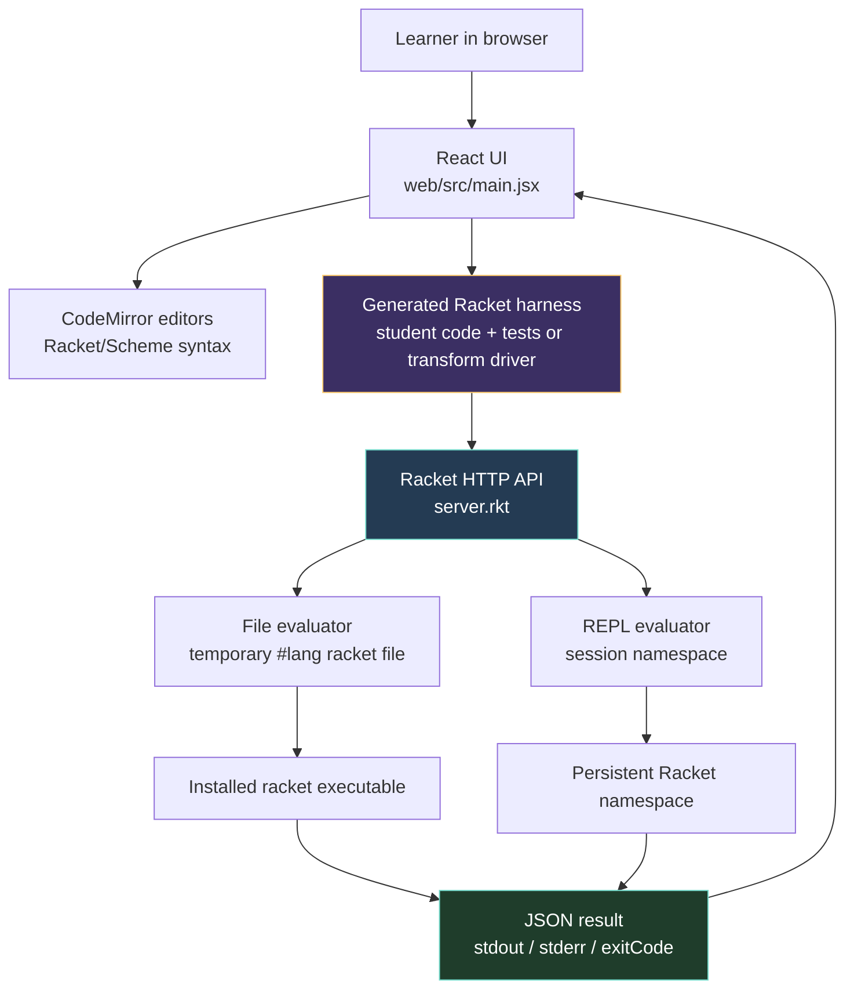
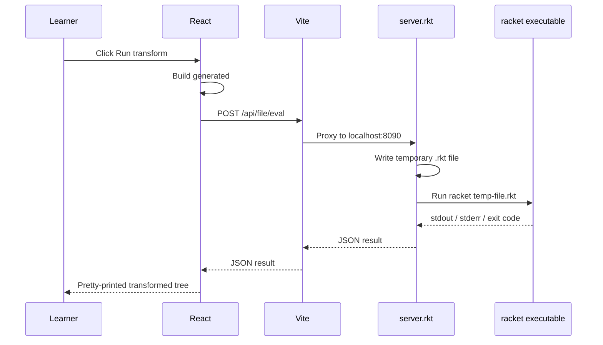

# Racket Web Editor - Interactive Compiler Course

This project is a local browser-based Racket programming environment and an interactive compiler-course laboratory for Chapter 2 of Jeremy Siek's *Essentials of Compilation*. It combines a small Racket HTTP evaluation server, a React + Vite frontend, CodeMirror editors, a persistent REPL, and a set of pass-implementation labs for the LVar → x86Int pipeline.

> [!summary]
> The project has three important identities:
> 1. a local Racket file editor and persistent browser REPL;
> 2. an interactive textbook surface for implementing compiler passes from *Essentials of Compilation* Chapter 2;
> 3. a reusable pattern for building programming courses where student code is run by the real implementation language rather than simulated in JavaScript.

The guiding idea is simple: the browser should teach, but Racket should judge. The React page presents prose, editors, controls, tests, and visualized transformed trees. The Racket backend remains the execution authority. When the student writes a pass and clicks **Run tests in Racket**, the system generates a complete Racket file, sends it to the backend, runs it through the installed `racket` executable, and returns stdout, stderr, and pass/fail status to the browser.

## Why this project exists

Compiler passes are hard to learn from static text alone. A pass such as `uniquify` or `remove-complex-operands` is not just a definition. It is an operation on a program tree. To understand it, a learner needs to see at least three things at once:

1. the input tree;
2. the pass implementation;
3. the output tree produced by that implementation.

A traditional textbook gives the input and the intended output. A programming assignment gives the implementation task and a test suite. This project tries to combine both. It gives a textbook-like explanation, a live editor, executable tests, and a transform visualizer in the same page.

The second reason this project exists is that Racket is both the implementation language and the subject language in the book's Racket track. That makes it especially important not to replace Racket with a JavaScript imitation. If a learner is practicing quasiquote, `match`, symbols, `gensym`, Racket dictionaries, and S-expression transformations, then the code should be run by Racket itself.

## Current project status

The project is active and functional.

What exists today:

- a Racket backend in `/home/manuel/code/wesen/2026-04-30--racket-editor/server.rkt`;
- a React/Vite frontend in `/home/manuel/code/wesen/2026-04-30--racket-editor/web/`;
- CodeMirror-based Racket/Scheme editors;
- a file evaluation endpoint for complete `#lang racket` programs;
- a persistent REPL endpoint using per-session Racket namespaces;
- a `/#/repl` route for the general editor and REPL;
- a `/#/chapter2` route for the interactive compiler labs;
- seven Chapter 2 implementation labs;
- per-lab test harnesses that run in real Racket;
- per-lab custom input editors and transform output viewers;
- a top-level `README.md` documenting routes, run instructions, and the book-aligned teaching representations;
- a root `PROJECT_REPORT.md` and docmgr ticket documentation under `ttmp/2026/04/30/RACKET-WEB-REPL--racket-web-editor-and-repl/`.

The key caveat is that this is a local teaching tool, not a sandbox. It runs submitted Racket code on the local machine. It should not be exposed to untrusted users or a public network.

## How to run it

The app uses two local processes. The Racket backend and Vite frontend must both be running.

Terminal 1:

```bash
cd /home/manuel/code/wesen/2026-04-30--racket-editor
racket server.rkt
```

Terminal 2:

```bash
cd /home/manuel/code/wesen/2026-04-30--racket-editor/web
pnpm install
pnpm dev
```

Open the compiler-course labs:

```text
http://localhost:5173/#/chapter2
```

Open the general Racket editor and REPL:

```text
http://localhost:5173/#/repl
```

Vite proxies `/api/*` to the Racket backend at `http://localhost:8090`. If `http://localhost:5173/api/file/eval` returns a 500, the most likely explanation is that the frontend is running but `racket server.rkt` is not running.

A quick backend smoke test is:

```bash
curl -s http://localhost:8090/api/health
```

Expected response:

```json
{"ok":true,"service":"racket-web-editor","sessions":0}
```

## Project shape

At a high level, the project has four layers.



The architecture is deliberately small. There is no database, no authentication layer, no server-side lesson renderer, and no hidden queue. The frontend owns the teaching experience. The backend owns evaluation.

## Important files

| File | Role |
|---|---|
| `/home/manuel/code/wesen/2026-04-30--racket-editor/server.rkt` | Racket HTTP API, file evaluator, REPL evaluator, timeout handling. |
| `/home/manuel/code/wesen/2026-04-30--racket-editor/web/src/main.jsx` | React app, routes, CodeMirror integration, lab definitions, generated harnesses, transform visualizer, REPL page. |
| `/home/manuel/code/wesen/2026-04-30--racket-editor/web/src/styles.css` | Dark responsive styling for the essay, labs, output panels, and REPL page. |
| `/home/manuel/code/wesen/2026-04-30--racket-editor/web/vite.config.js` | Vite dev server config and `/api` proxy to port `8090`. |
| `/home/manuel/code/wesen/2026-04-30--racket-editor/README.md` | Run instructions and book-aligned definitions. |
| `/home/manuel/code/wesen/2026-04-30--racket-editor/PROJECT_REPORT.md` | Long-form technical project report in repository form. |
| `/home/manuel/code/wesen/2026-04-30--racket-editor/ttmp/2026/04/30/RACKET-WEB-REPL--racket-web-editor-and-repl/` | Docmgr ticket workspace with design docs, diary, scripts, and report copies. |

## The backend mental model

The backend is easiest to understand as two evaluators behind one JSON API. File evaluation and REPL evaluation look similar in the browser, but they solve different semantic problems.

File evaluation answers the question: **What happens if this complete Racket file is run from the command line?**

REPL evaluation answers the question: **What happens if these expressions are evaluated in the same interactive session as my previous expressions?**

Those are not the same operation.

### File evaluation

A complete Racket file often begins with:

```racket
#lang racket
```

That line belongs to Racket's module system. It is not an ordinary expression to feed into `eval`. The backend therefore writes submitted file code to a temporary `.rkt` file and invokes the installed `racket` executable.

The simplified algorithm is:

```text
function eval_file(code, timeout):
    tmp = make_temporary_file("racket-web-editor-*.rkt")
    write code to tmp
    process = subprocess("racket", tmp)
    completed = wait(process, timeout)

    if not completed:
        kill(process)
        return {
            ok: false,
            exitCode: "timeout",
            output: captured_stdout,
            errorOutput: captured_stderr + timeout_message
        }

    return {
        ok: process.exit_code == 0,
        exitCode: process.exit_code,
        output: captured_stdout,
        errorOutput: captured_stderr
    }
```

In `server.rkt`, the core is:

```racket
(define (eval-file-code code timeout-seconds)
  (define tmp (make-temporary-file "racket-web-editor-~a.rkt"))
  (call-with-output-file tmp #:exists 'truncate
    (lambda (out) (display code out)))
  (define racket-bin (or (find-executable-path "racket") "racket"))
  (define-values (sp stdout stdin stderr)
    (subprocess #f #f #f racket-bin (path->string tmp)))
  ...)
```

This is the execution path used by the Chapter 2 labs. Every lab checker becomes a real `#lang racket` file. That file contains the student's pass implementation plus a generated test harness.

### REPL evaluation

The REPL path uses a persistent Racket namespace per browser session. The server keeps a hash table:

```racket
(define sessions (make-hash))
```

A session namespace is created lazily:

```racket
(define (make-repl-namespace)
  (define ns (make-base-namespace))
  (parameterize ([current-namespace ns])
    (namespace-require 'racket)
    (namespace-require 'racket/pretty))
  ns)

(define (session-namespace session-id)
  (hash-ref! sessions session-id make-repl-namespace))
```

The browser generates a session id. When the learner evaluates:

```racket
(define xs '(1 2 3 4))
```

that definition is installed in the namespace for that session. A later evaluation can then use it:

```racket
(map sqr xs)
```

The result is rendered as a value:

```racket
(1 4 9 16)
```

This split between file and REPL evaluation is one of the most important design decisions in the project.

| Question | Correct evaluator | Reason |
|---|---|---|
| Does this complete `#lang racket` program run? | File evaluator | `#lang` belongs to the module/file system. |
| Can I define a value and use it in a later snippet? | REPL evaluator | Definitions need a persistent namespace. |
| Should each course checker start fresh? | File evaluator | A fresh process avoids stale state between test runs. |
| Should exploratory snippets remember previous definitions? | REPL evaluator | That is the point of a REPL. |

## The frontend mental model

The frontend has two jobs. It provides the general programming interface, and it provides the course interface.

The general programming interface lives at `/#/repl`. It has:

- a file editor;
- a REPL editor;
- buttons for running a file, evaluating the REPL, and resetting the REPL namespace;
- output panels for stdout, values/status, and stderr/errors.

The course interface lives at `/#/chapter2`. It has:

- textbook-style prose;
- a Chapter 2 pipeline strip;
- implementation lab tabs;
- a CodeMirror editor for pass code;
- buttons for reset, reveal, and real Racket tests;
- a custom input editor;
- a transform output panel;
- a harness viewer.

Hash routing is enough for this project:

```javascript
function App() {
  const [hash, setHash] = useState(window.location.hash || '#/chapter2');
  ...
  return hash === '#/repl' ? <RacketReplPage /> : <Chapter2Page />;
}
```

No router library is needed because there are only two routes and no nested navigation problem.

## CodeMirror as the editing layer

The editors are built with CodeMirror 6. The integration is direct rather than using a React wrapper. A custom `useCodeMirror` hook creates the editor, wires the update listener, and synchronizes React state with the CodeMirror document.

The essential extensions are:

```javascript
lineNumbers()
highlightActiveLineGutter()
history()
bracketMatching()
indentOnInput()
StreamLanguage.define(scheme)
syntaxHighlighting(defaultHighlightStyle, { fallback: true })
highlightActiveLine()
keymap.of([indentWithTab, ...defaultKeymap, ...historyKeymap])
oneDark
EditorView.lineWrapping
```

The Scheme mode is not a complete Racket parser. That is acceptable for this project because the exercises are S-expression heavy and the main editing needs are structural: indentation, matching parentheses, readable highlighting, and stable text input.

## The Chapter 2 pass labs

The course route is built around the Chapter 2 pass order from *Essentials of Compilation*:


Each lab definition includes:

- `title` — the displayed lab name;
- `intro` — the teaching description;
- `starter` — the skeleton code;
- `reveal` — a working implementation;
- `harness` — Racket code that checks invariants;
- `sampleInput` — a datum shown in the transform panel;
- `transformExpr` — the Racket expression used to run the student's pass on the custom input.

The pattern is roughly:

```javascript
const PASS_LABS = {
  uniquify: {
    title: 'Implement uniquify-exp',
    starter: STARTER_UNIQUIFY,
    reveal: REVEALED_UNIQUIFY,
    harness: HARNESS_SUFFIX,
    sampleInput: `(program () (let ([x 32]) (+ (let ([x 10]) x) x)))`,
    transformExpr: '(uniquify input)'
  },
  ...
};
```

This design makes it easy to add new labs. A lab is not a new page. It is data plus Racket code strings.

## Book-aligned data definitions

The labs intentionally use S-expression representations aligned with the book's Racket track. They do not import the full support library. That is a deliberate teaching choice: the learner can read the entire representation directly in the browser.

The source language shape follows the Chapter 2 LVar/R1 style:

```racket
(program info expression)

expression ::= integer
             | symbol
             | (let ([symbol expression]) expression)
             | (op expression ...)
```

The `uniquify-exp` skeleton follows the Figure 2.10 style:

```racket
(define (uniquify-exp symtab)
  (lambda (e)
    (match e
      [(? symbol?) ...]
      [(? integer?) e]
      [`(let ([,x ,rhs]) ,body) ...]
      [`(,op ,es ...) ...])))
```

Later passes use compact book-like encodings of CVar and x86Int concepts.

### CVar-style blocks

`explicate-control` produces a CVar-style block:

```racket
(program ()
  (start
    (assign x.1 20)
    (assign x.2 22)
    (return (+ x.1 x.2))))
```

The main idea is that nested expression structure is flattened into a sequence of statements. The order that was implicit in nested `let` expressions becomes explicit in the block.

### x86Int-style instructions

The instruction labs use structured instruction data:

```racket
(movq (Imm 10) (Var x))
(addq (Imm 32) (Var x))
(callq read_int)
(movq (Reg rax) (Var y))
(jmp conclusion)
```

Arguments are represented as:

```racket
(Imm n)          ; immediate integer
(Reg rax)        ; register
(Var x)          ; abstract variable before assign-homes
(Deref rbp -8)   ; stack location after assign-homes
```

This keeps the important distinctions visible. Before `assign-homes`, variables are abstract. After `assign-homes`, they become concrete stack homes. After `patch-instructions`, invalid memory-to-memory operations are removed.

## Lab 1: `uniquify-exp`

The purpose of `uniquify-exp` is to make lexical binding explicit. In the source program:

```racket
(program ()
  (let ([x 32])
    (+ (let ([x 10]) x)
       x)))
```

there are two bindings named `x`. The printed name is the same, but the bindings are different. The inner binding shadows the outer one only inside the inner `let` body.

The pass maintains a symbol table from original names to current unique names:

```racket
symtab : source-symbol -> unique-symbol
```

The core rules are:

- A variable occurrence is replaced by `(dict-ref symtab e)`.
- An integer is unchanged.
- A primitive operation recursively transforms its operands.
- A `let` transforms its RHS in the old environment, then transforms its body in an environment extended with the new name.

The important subtlety is the RHS/body distinction. In:

```racket
(let ([x (+ x 1)]) x)
```

assuming there is an outer `x`, the `x` in `(+ x 1)` refers to the old outer binding. The `x` in the body refers to the new binding. If the pass extends the environment too early, it will rewrite the RHS incorrectly.

A correct implementation has this shape:

```racket
[(? symbol?) (dict-ref symtab e)]
[(? integer?) e]
[`(let ([,x ,rhs]) ,body)
 (define new-x (gensym x))
 `(let ([,new-x ,((uniquify-exp symtab) rhs)])
    ,((uniquify-exp (dict-set symtab x new-x)) body))]
```

The transform visualizer makes this concrete. With the reveal solution, the sample input becomes something like:

```racket
(program ()
  (let ((x1147 32))
    (+ (let ((x1148 10)) x1148)
       x1147)))
```

The exact suffixes differ because `gensym` chooses fresh names.

## Lab 2: `remove-complex-operands`

`remove-complex-operands` prepares the program for instruction selection by ensuring that primitive operands are atomic. In this lab, an atom is either an integer or a symbol:

```racket
(define (atom? e)
  (or (integer? e) (symbol? e)))
```

The expression:

```racket
(+ 42 (- 10))
```

contains a complex operand `(- 10)`. RCO lifts it into a temporary:

```racket
(let ((tmp1146 (- 10)))
  (+ 42 tmp1146))
```

The pass is easier to write if it has two mutually reinforcing ideas:

1. `rco-exp` recursively transforms an expression.
2. `rco-arg` transforms an expression and ensures it can be used as an operand, returning both an atomic replacement and any bindings needed to compute it.

Pseudocode:

```text
function rco_arg(e):
    e2 = rco_exp(e)
    if atomic(e2):
        return e2, []
    else:
        tmp = gensym('tmp)
        return tmp, [(tmp, e2)]

function rco_exp(e):
    if atomic(e): return e
    if let x rhs body:
        return let x = rco_exp(rhs) in rco_exp(body)
    if primitive op args:
        new_args, bindings = map rco_arg over args
        return wrap_lets(bindings, (op new_args...))
```

This lab is a good example of a compiler pass that changes shape without changing meaning. The interpreter result should remain the same, but the output tree has a stronger invariant: primitive operands are now simple.

## Lab 3: `explicate-control`

`explicate-control` is where the compiler starts to look less like an expression transformer and more like a control-flow builder. The source expression:

```racket
(let ([x.1 20])
  (let ([x.2 22])
    (+ x.1 x.2)))
```

becomes:

```racket
(program ()
  (start
    (assign x.1 20)
    (assign x.2 22)
    (return (+ x.1 x.2))))
```

The pass exposes evaluation order. The nested structure says, "evaluate this RHS, then evaluate this body." The CVar block says the same thing as a sequence:

1. assign `x.1`;
2. assign `x.2`;
3. return the final expression.

This lab uses a compact representation:

```racket
(assign variable expression)
(return expression)
(start statement ...)
```

The essential recursive function is `explicate-tail`. In tail position, a `let` becomes an assignment plus the explicated body. A primitive expression becomes a return.

```racket
(define (explicate-tail e)
  (match e
    [(? integer?) (list (list 'return e))]
    [(? symbol?) (list (list 'return e))]
    [(list 'let (list (list x rhs)) body)
     (cons (list 'assign x rhs)
           (explicate-tail body))]
    [(list op args ...)
     (list (list 'return e))]))
```

The current lab is intentionally the Chapter 2-shaped core, not the full general control-flow machinery needed for later chapters with conditionals and blocks.

## Lab 4: `select-instructions`

`select-instructions` lowers CVar statements into x86-like instruction data. This is the pass where the compiler starts speaking in the vocabulary of the target machine.

Input:

```racket
(program ()
  (start
    (assign x (+ 10 32))
    (assign y (read))
    (return (+ x y))))
```

Output:

```racket
((movq (Imm 10) (Var x))
 (addq (Imm 32) (Var x))
 (callq read_int)
 (movq (Reg rax) (Var y))
 (movq (Var x) (Reg rax))
 (addq (Var y) (Reg rax))
 (jmp conclusion))
```

The important conventions are:

- Immediate integers become `(Imm n)`.
- Variables become `(Var x)` until `assign-homes` decides where they live.
- `read` compiles to `callq read_int`, whose result is in `(Reg rax)`.
- A returned value is moved into `(Reg rax)` before jumping to `conclusion`.

This lab teaches that instruction selection is not only translation but also convention. The target machine has registers, calling conventions, and operation-specific constraints. The later passes refine the output further.

## Lab 5: `assign-homes`

`assign-homes` replaces abstract variables with concrete stack locations. The input includes home metadata:

```racket
(program ((homes ((a (Deref rbp -8))
                  (b (Deref rbp -16)))))
  ((movq (Imm 42) (Var a))
   (movq (Var a) (Var b))
   (movq (Var b) (Reg rax))))
```

The transformed instruction list is:

```racket
((movq (Imm 42) (Deref rbp -8))
 (movq (Deref rbp -8) (Deref rbp -16))
 (movq (Deref rbp -16) (Reg rax)))
```

The pass is structurally simple but conceptually important. It changes the compiler's representation of storage. Before this pass, a variable is an abstract name. After this pass, a variable has a physical location relative to `%rbp`.

The core helper is:

```racket
(define (assign-homes-arg homes arg)
  (match arg
    [(list 'Var x) (dict-ref homes x)]
    [else arg]))
```

The pass maps that helper over instruction arguments. It deliberately may produce invalid x86 instructions, such as memory-to-memory moves. That is not a failure of `assign-homes`. It is the reason `patch-instructions` exists.

## Lab 6: `patch-instructions`

`patch-instructions` fixes target-language constraints. In x86, many instructions cannot have two memory operands. The instruction:

```racket
(movq (Deref rbp -8) (Deref rbp -16))
```

must be rewritten through a register:

```racket
(movq (Deref rbp -8) (Reg rax))
(movq (Reg rax) (Deref rbp -16))
```

The lab's helper is:

```racket
(define (memory-arg? a)
  (match a
    [(list 'Deref _ _) #t]
    [else #f]))
```

The key idea is not specific to `movq`. It is a general compiler pattern: earlier passes often produce a clean intermediate representation that is *almost* target code. Patching then handles the awkward details of the real target language.

Pseudocode:

```text
function patch_instr(instr):
    if instr is movq src dst and both src and dst are memory:
        return [movq src rax, movq rax dst]
    if instr is addq src dst and both src and dst are memory:
        return [movq src rax, addq rax dst]
    otherwise:
        return [instr]

function patch_instructions(instrs):
    return append_map(patch_instr, instrs)
```

The transform visualizer is especially useful here because the output length can change. One invalid instruction becomes two valid instructions.

## Lab 7: `prelude-and-conclusion`

The final Chapter 2 lab wraps the instruction body as a callable program. A selected instruction body is not yet a complete function. It needs an entry point, stack-frame setup, a body label, a conclusion label, stack-frame cleanup, and a return.

Input:

```racket
(program ((stack-space 16))
  ((movq (Imm 42) (Reg rax))
   (jmp conclusion)))
```

Output:

```racket
((global main)
 (label main)
 (pushq (Reg rbp))
 (movq (Reg rsp) (Reg rbp))
 (subq (Imm 16) (Reg rsp))
 (jmp start)
 (label start)
 (movq (Imm 42) (Reg rax))
 (jmp conclusion)
 (label conclusion)
 (addq (Imm 16) (Reg rsp))
 (popq (Reg rbp))
 (retq))
```

The frame setup follows the usual pattern:

```text
pushq %rbp              save caller's frame pointer
movq %rsp, %rbp         establish this frame pointer
subq $stack-space, %rsp reserve stack space
jmp start               enter the generated body
```

The conclusion reverses the setup:

```text
addq $stack-space, %rsp release stack space
popq %rbp               restore caller's frame pointer
retq                    return
```

The lab uses structured data rather than assembly text, but the calling-convention idea is the same.

## The generated checker pattern

Each lab checker is generated by combining:

1. a `#lang racket` header;
2. common requires such as `racket/match`, `racket/dict`, and `racket/set`;
3. the student's current implementation;
4. a lab-specific harness.

The frontend builds the file with:

```javascript
function buildPassHarness(userCode, lab) {
  return `#lang racket
(require racket/match racket/dict racket/set)

${userCode}
${lab.harness.replaceAll('\\`', '`')}`;
}
```

Then it posts the generated file to:

```text
POST /api/file/eval
```

The checker harnesses are executable specifications. They do not merely check one printed answer. They check the contract of a pass:

- `uniquify-exp` checks binding uniqueness and lexical scope.
- `remove-complex-operands` checks that primitive operands are atomic and meaning is preserved.
- `explicate-control` checks that nested lets become ordered assignments and returns.
- `select-instructions` checks instruction selection for arithmetic, `read`, and return.
- `assign-homes` checks that every `(Var x)` is replaced with its home.
- `patch-instructions` checks that memory-to-memory instructions are eliminated.
- `prelude-and-conclusion` checks frame setup, body preservation, and frame cleanup.

The lesson is that a compiler pass is best understood by its invariant. The code is the implementation of that invariant.

## Transform visualization

The transform visualizer is the part that turns the labs from tests into an interactive textbook. Each lab has a custom input editor. The learner can type a datum, click **Run transform**, and see the output of their current implementation.

The generated transform harness has this shape:

```javascript
function buildTransformHarness(userCode, lab, inputText) {
  return `#lang racket
(require racket/match racket/dict racket/set racket/pretty)

${userCode}

(define input
  (with-input-from-string ${JSON.stringify(inputText)} read))

(define output
  ${lab.transformExpr.replaceAll('\\`', '`')})

(pretty-write output)
`;
}
```

This is a small but powerful pattern. The UI does not need custom JavaScript logic for every pass. The lab definition says how to run the transform:

```javascript
transformExpr: '(uniquify input)'
```

or:

```javascript
transformExpr: '(patch-instructions input)'
```

The backend runs the generated file, and `pretty-write` gives the learner a readable tree. This makes the pass observable.

## Request path: what happens when a learner clicks Run transform

The end-to-end path is worth spelling out because it explains the whole system.



There are several failure modes, and each points to a different layer:

| Symptom | Likely layer | Explanation |
|---|---|---|
| Vite returns 500 for `/api/file/eval` | Process setup | The Racket backend is not running on port `8090`. |
| JSON result has `ok: false` and syntax error in stderr | Student code or generated harness | Racket could not parse or compile the submitted file. |
| Checker says an invariant failed | Pass implementation | The code ran but produced the wrong structure or semantics. |
| Transform output is surprising but tests pass | Example coverage | The pass satisfies current tests, but the learner found an input worth adding to the checker. |

Good teaching tools make failure informative. This project tries to return enough evidence for the learner to know which layer failed.

## Validation performed

The project was validated at several levels.

Backend compilation:

```bash
raco make server.rkt
```

Frontend production build:

```bash
cd /home/manuel/code/wesen/2026-04-30--racket-editor/web
pnpm build
```

Backend smoke test through Vite proxy:

```bash
curl -s -X POST http://localhost:5173/api/file/eval \
  -H 'content-type: application/json' \
  -d '{"code":"#lang racket\n(displayln 42)","timeoutSeconds":5}'
```

Expected output includes:

```json
{"ok":true,"output":"42\n"}
```

Browser validation with Playwright verified that all seven reveal solutions pass their real Racket checkers and all seven transform visualizers produce output.

Observed success messages:

```text
✓ All uniquify-exp tests passed in real Racket.
✓ remove-complex-operands tests passed in real Racket.
✓ explicate-control tests passed in real Racket.
✓ select-instructions tests passed in real Racket.
✓ assign-homes tests passed in real Racket.
✓ patch-instructions tests passed in real Racket.
✓ prelude-and-conclusion tests passed in real Racket.
```

The REPL page was also verified by running a factorial file example and evaluating:

```racket
(define xs '(1 2 3 4))
(map sqr xs)
```

which produced:

```racket
(1 4 9 16)
```

## Design decisions and tradeoffs

### Keep Racket as the execution authority

The obvious alternative would be to implement the checkers and transformations in JavaScript. That would make the frontend self-contained, but it would teach the wrong thing. The course is about implementing compiler passes in Racket. The student's code should therefore be Racket code, run by Racket.

### Use generated files for lab runs

Generated files make the test path simple. The browser sends one complete `#lang racket` program. The backend writes it to a temporary file and runs it. There is no custom RPC protocol for every lab, no AST serializer for partial definitions, and no persistent course-worker process to manage.

The tradeoff is that every test run starts a new Racket process. That is slower than an in-process evaluator, but it is simpler and semantically closer to running a file.

### Use a persistent namespace for the REPL

The REPL needs continuity. A subprocess-per-snippet REPL would forget definitions. The namespace table solves that. It does mean REPL code runs inside the server process, which is another reason this project must remain local-only.

### Use simplified book-aligned representations

The labs do not import the entire *Essentials of Compilation* support code. They use compact S-expression forms that match the book's concepts closely enough for teaching. This makes the exercises readable and editable in the browser.

The tradeoff is that a student moving to the full book support framework will still need to learn the complete data definitions and testing harness. The benefit is that the core pass idea is visible without boilerplate.

## Open questions

- Should future labs import the actual support library from the book instead of using compact teaching representations?
- Should the transform visualizer support a gallery of preset examples for each pass?
- Should the page show structural diffs between input and output trees?
- Should there be a full-pipeline mode where the output of one pass becomes the input of the next?
- Should each checker expose a rendered explanation of which invariant failed, rather than only stderr text?
- Should the backend gain a production mode that serves `web/dist` directly?
- Should stronger sandboxing be added if the tool is ever used outside a trusted local environment?

## Near-term next steps

The most useful next step is a preset gallery. Each pass should have several curated inputs:

- the minimal example;
- a nested example;
- a shadowing example;
- a failure-prone example;
- a capstone example that connects to the next pass.

The second useful step is a pipeline view. A learner should be able to start with:

```racket
(program ()
  (let ([x (+ 12 20)])
    (+ 10 x)))
```

and then click through:

```text
uniquify
→ remove-complex-operands
→ explicate-control
→ select-instructions
→ assign-homes
→ patch-instructions
→ prelude-and-conclusion
```

seeing each intermediate tree.

The third useful step is better failure rendering. Instead of showing only stderr, the app could parse known checker errors and render them as teaching feedback:

```text
✗ The final x should refer to the outer binding.

The inner binding is only visible inside the body of the inner let.
Try checking whether you extended the symbol table before transforming the RHS.
```

## Working rule

This project should remain an interactive textbook first and an IDE second. Every feature should answer one of these questions:

- Does it help the learner implement a pass?
- Does it help the learner see what a pass did?
- Does it keep Racket as the source of truth for Racket code?
- Does it make a compiler invariant more concrete?

If a feature does none of those things, it probably belongs in a general IDE, not in this course surface.

## Related project files and docs

- Repo: `/home/manuel/code/wesen/2026-04-30--racket-editor`
- Root README: `/home/manuel/code/wesen/2026-04-30--racket-editor/README.md`
- Root report: `/home/manuel/code/wesen/2026-04-30--racket-editor/PROJECT_REPORT.md`
- Backend: `/home/manuel/code/wesen/2026-04-30--racket-editor/server.rkt`
- Frontend: `/home/manuel/code/wesen/2026-04-30--racket-editor/web/src/main.jsx`
- Styles: `/home/manuel/code/wesen/2026-04-30--racket-editor/web/src/styles.css`
- Docmgr ticket: `/home/manuel/code/wesen/2026-04-30--racket-editor/ttmp/2026/04/30/RACKET-WEB-REPL--racket-web-editor-and-repl/`

## Closing note

The most valuable thing about this project is not that it runs Racket in a browser-adjacent workflow. The valuable thing is the shape of the learning loop. The learner reads an explanation, writes an implementation, runs real tests, and inspects the transformed tree. That loop is exactly what a compiler course needs.

A compiler pass is not a vocabulary word. It is a transformation with an invariant. This project makes that invariant executable and visible.
